# System Design Interview — Cheat Sheet

Read this before a question session. It covers every concept, pattern, formula, and decision framework tested across all 320 questions.

---

## Table of Contents

1. [Back-of-Envelope Estimation](#1-back-of-envelope-estimation)
2. [Load Balancing & Reverse Proxies](#2-load-balancing--reverse-proxies)
3. [Caching Strategies](#3-caching-strategies)
4. [Database Selection](#4-database-selection)
5. [SQL vs NoSQL Tradeoffs](#5-sql-vs-nosql-tradeoffs)
6. [Data Partitioning & Sharding](#6-data-partitioning--sharding)
7. [Message Queues & Event Streaming](#7-message-queues--event-streaming)
8. [API Design & Communication Protocols](#8-api-design--communication-protocols)
9. [Microservices vs Monolith](#9-microservices-vs-monolith)
10. [Consistency, Availability & CAP Theorem](#10-consistency-availability--cap-theorem)
11. [Concurrency Control & Race Conditions](#11-concurrency-control--race-conditions)
12. [Distributed Systems Patterns](#12-distributed-systems-patterns)
13. [Rate Limiting & Backpressure](#13-rate-limiting--backpressure)
14. [CDN, DNS & Edge Computing](#14-cdn-dns--edge-computing)
15. [Authentication, Authorization & Security](#15-authentication-authorization--security)
16. [Observability: Logs, Metrics, Traces](#16-observability-logs-metrics-traces)
17. [Resilience Patterns](#17-resilience-patterns)
18. [Fan-out, Feeds & Notifications](#18-fan-out-feeds--notifications)
19. [Real-Time Systems & Chat](#19-real-time-systems--chat)
20. [Classic System Design Reference Architectures](#20-classic-system-design-reference-architectures)
21. [Numbers Every Engineer Should Know](#21-numbers-every-engineer-should-know)

---

## 1. Back-of-Envelope Estimation

Estimation questions test whether you can size a system before building it. The key is having a repeatable framework and knowing the right constants.

### 1.1 The Universal Estimation Framework

Every estimation follows four steps: identify the input numbers, pick the right formula, compute, and sanity-check the result against a known reference.

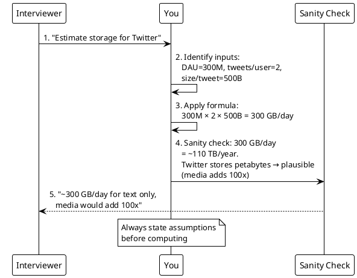

### 1.2 Core Formulas

**Daily Storage:**
```
Storage/day = DAU × actions/user/day × size/action
```

**Annual Storage:**
```
Storage/year = Storage/day × 365
```

**Peak QPS from DAU:**
```
Average QPS = DAU × actions/user/day ÷ 86,400
Peak QPS    = Average QPS × peak_multiplier (typically 3×)
```

**Bandwidth:**
```
Bandwidth (Gbps) = data_per_second (GB/s) × 8
```
Always add ~1.5× for protocol overhead (TCP headers, TLS, retransmissions).

**Concurrent Users:**
```
Concurrent = DAU × (avg_session_minutes ÷ active_window_minutes)
```

**Server Count:**
```
Servers = (peak_QPS × processing_time_sec) ÷ concurrent_capacity_per_server
```
Then multiply by 3–10× for production overhead (redundancy, deploys, GC pauses).

### 1.3 Worked Examples

| System | Inputs | Formula | Result |
|--------|--------|---------|--------|
| Twitter storage | 300M DAU × 2 tweets × 500B | 300M × 2 × 500 | **300 GB/day** |
| YouTube upload BW | 500 hrs/min × 3600/60 = 30K video-sec/sec × 8 Mbps | 30K × 8 Mbps × 1.5 | **~400 Gbps** |
| Instagram images | 500M × 20% upload × 2 MB × 365 | 100M × 2MB × 365 | **73 PB/year** |
| WhatsApp peak QPS | 1B × 40 msgs/day ÷ 86,400 × 3 | 463K × 3 | **1.4M QPS** |
| TikTok concurrent | 1B DAU × (40 min ÷ 960 min) | 1B × 0.042 | **42M concurrent** |
| DoorDash servers | 50M orders/day ÷ 86,400 × 3 = 1,736 QPS | (1736 × 0.5) ÷ 100 × 10 | **~87 servers** |

### 1.4 Cache Memory Sizing

**The 1% Rule (Pareto):** Cache 1% of total data to absorb ~80% of reads.

```
Cache size = total_data × 0.01 × replication_factor
```

| System | Total Data | 1% | Replicas | Cache Size |
|--------|-----------|-----|----------|------------|
| URL shortener | 3 TB | 30 GB | 3 | 90 GB |
| Product catalog | 1.75 TB | 17.5 GB | 3 | 52.5 GB |
| User sessions | 100 GB | 1 GB | 2 | 2 GB |

### 1.5 Constants to Memorize

| Constant | Value |
|----------|-------|
| Seconds per day | 86,400 |
| Seconds per month | ~2.6M |
| 1 million seconds | ~11.6 days |
| 1 billion seconds | ~31.7 years |
| Typical peak multiplier | 3–4× average |
| Black Friday multiplier | 10× average |
| Protocol overhead | 1.5× raw data |

---

## 2. Load Balancing & Reverse Proxies

A load balancer distributes incoming traffic across servers. The choice of layer, algorithm, and health-check strategy depends on whether the workload is stateful or stateless.

### 2.1 Layer 4 vs Layer 7

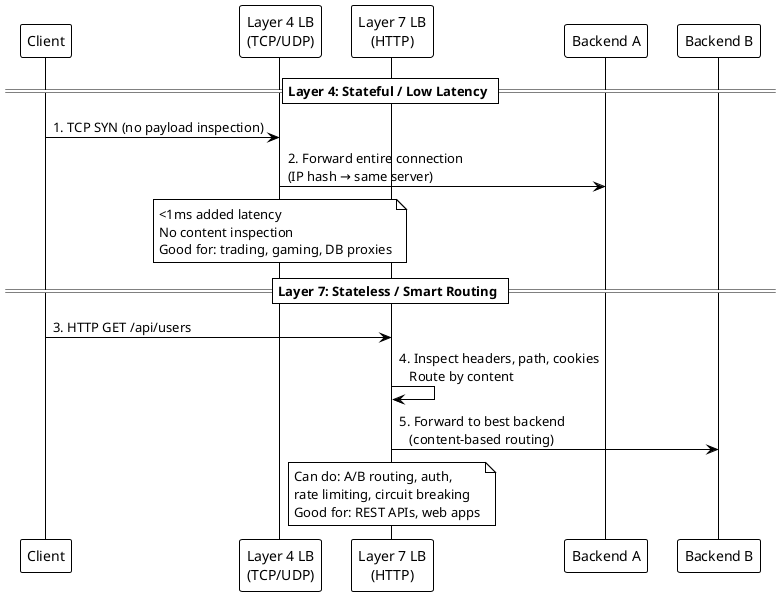

| Feature | Layer 4 | Layer 7 |
|---------|---------|---------|
| Inspects content | No | Yes (headers, path, body) |
| Latency added | <1ms | 1–5ms |
| Sticky sessions | IP hash | Cookie-based |
| Health checks | TCP connect | HTTP endpoint |
| Use case | Trading, gaming, TCP proxy | REST APIs, web apps |

### 2.2 Load Balancing Algorithms

| Algorithm | Best For | How It Works |
|-----------|----------|--------------|
| Round Robin | Equal-capacity servers | Rotate sequentially |
| Weighted Round Robin | Mixed-capacity fleet | More requests to stronger servers |
| Least Connections | Variable request duration | Route to least busy server |
| IP Hash | Session affinity (L4) | Hash client IP → consistent server |
| Consistent Hashing | Distributed caches | Minimize remapping on node add/remove |

### 2.3 Health Checks

- **Active health checks** (L7): Poll `/health` every 30s; failover in ~60s
- **Passive health checks**: Track error rates; mark unhealthy after N consecutive failures
- **DNS-based LB**: No real-time health awareness; stale entries remain until TTL expires (minutes to hours)

**Key insight:** L7 active health checks detect failures 60× faster than DNS-based failover.

---

## 3. Caching Strategies

Caching trades memory for speed. The decision framework: what to cache, where to cache, and how to invalidate.

### 3.1 Cache Tiers

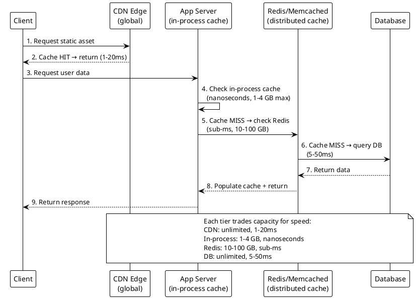

### 3.2 Cache Patterns

| Pattern | How It Works | Best For |
|---------|-------------|----------|
| **Cache-Aside** | App checks cache → miss → query DB → populate cache | General purpose, read-heavy |
| **Read-Through** | Cache itself fetches from DB on miss | Simpler app code |
| **Write-Through** | Write to cache AND DB synchronously | Strong consistency |
| **Write-Behind** | Write to cache, async flush to DB | Write-heavy, eventual consistency OK |
| **Refresh-Ahead** | Proactively reload before expiry | Predictable access patterns |

### 3.3 Cache Invalidation Strategies

| Strategy | Consistency | Complexity | Use Case |
|----------|------------|------------|----------|
| TTL-based | Eventual (within TTL) | Low | Product prices (5 min TTL) |
| Event-driven purge | Near-immediate | Medium | Inventory counts |
| Stale-while-revalidate | Eventual + fast reads | Medium | News feeds, dashboards |
| Version/surrogate keys | Immediate for groups | High | CDN cache groups |

**Cache-Control header example:**
```
Cache-Control: public, max-age=300, stale-while-revalidate=60
```
This means: serve from cache for 5 minutes; after that, serve stale for 60 more seconds while revalidating in the background.

### 3.4 Cache Stampede Prevention

When a popular cache key expires, hundreds of requests hit the DB simultaneously.

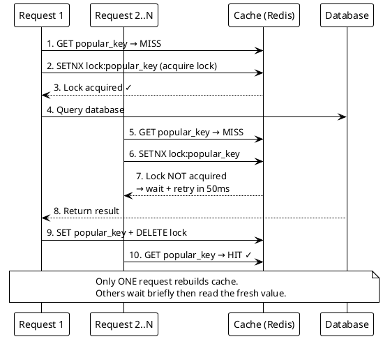

---

## 4. Database Selection

The default is PostgreSQL. Only choose something else when PostgreSQL cannot meet a specific requirement.

### 4.1 Decision Tree

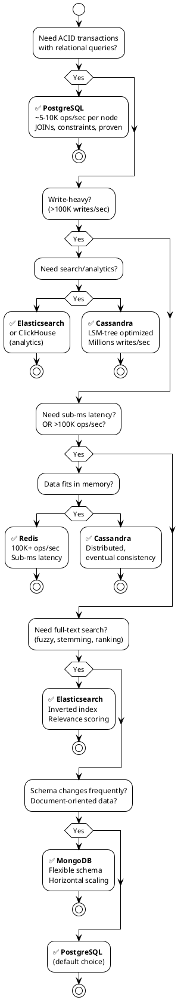

### 4.2 Database Comparison Table

| Database | Throughput | Latency | Consistency | Best For |
|----------|-----------|---------|-------------|----------|
| **PostgreSQL** | 5–10K ops/sec | 1–10ms | Strong (ACID) | Transactions, relational data |
| **Redis** | 100K+ ops/sec | <1ms | Single-thread atomic | Cache, sessions, leaderboards |
| **Cassandra** | Millions writes/sec | 1–10ms | Eventual (tunable) | Time-series, IoT, write-heavy |
| **MongoDB** | 10–50K ops/sec | 1–10ms | Configurable | Documents, flexible schema |
| **Elasticsearch** | Varies | 10–100ms | Near real-time | Full-text search, logs |
| **DynamoDB** | Unlimited (provisioned) | <10ms | Eventual/Strong | Serverless, key-value |

### 4.3 When to Use Polyglot Persistence

Use multiple databases when one database cannot serve all access patterns efficiently.

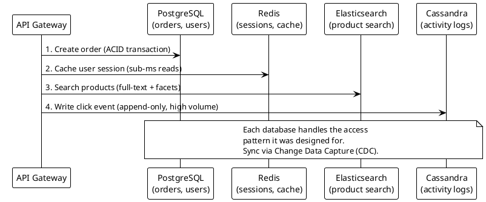

---

## 5. SQL vs NoSQL Tradeoffs

### 5.1 When to Choose SQL

- Transactions spanning multiple tables (e.g., transfer money between accounts)
- Complex JOIN queries across entities
- Strong consistency is a business requirement (financial, inventory)
- Data model is well-defined and stable
- Dataset fits on one node or can be read-replicated

### 5.2 When to Choose NoSQL

- Write throughput exceeds what a single SQL node can handle
- Data is naturally denormalized (documents, key-value pairs)
- Schema evolves frequently
- Horizontal scaling is required from day one
- Eventual consistency is acceptable

### 5.3 The CAP Tradeoff in Database Choice

| Requirement | SQL (PostgreSQL) | NoSQL (Cassandra) |
|------------|------------------|-------------------|
| ACID transactions | ✅ Native | ❌ Limited (lightweight transactions) |
| Horizontal write scaling | ❌ Hard (manual sharding) | ✅ Native |
| JOIN queries | ✅ Native | ❌ Denormalize instead |
| Schema flexibility | ❌ Migrations required | ✅ Schema-on-read |
| Sub-ms reads at scale | ❌ Needs Redis cache | ✅ Distributed |

---

## 6. Data Partitioning & Sharding

Sharding splits data across multiple database nodes to scale beyond a single server's capacity.

### 6.1 Sharding Strategies

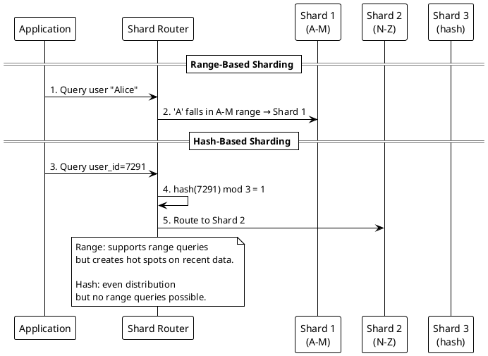

### 6.2 Shard Key Selection Guide

| System | Shard Key | Why |
|--------|-----------|-----|
| E-commerce orders | `user_id` | All of a user's orders on one shard |
| Chat messages | `conversation_id` | Both participants' messages co-located |
| URL shortener | `hash(short_code)` | Even distribution for point lookups |
| Ticket/coupon claims | `ticket_id` / `coupon_id` | Atomic claims at shard level |
| Time-series metrics | `metric_name + time_bucket` | Range queries within metric |
| Multi-tenant SaaS | `tenant_id` | Data isolation per customer |

### 6.3 Consistent Hashing

Used when nodes are added/removed frequently (e.g., cache clusters, distributed storage).

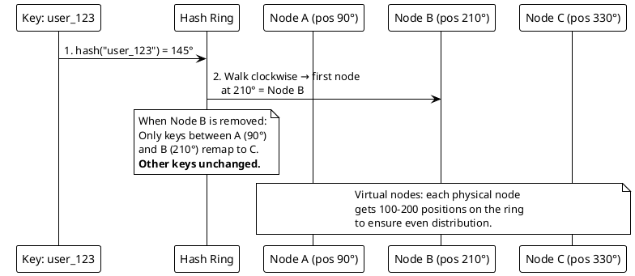

**Key insight:** Adding/removing a node only remaps 1/N of the keys (where N is the number of nodes), not all keys.

### 6.4 Hot Spot Mitigation

- **Append random suffix:** `celebrity_user_123_shard_7` spreads writes across shards
- **Time-bucket rotation:** Shard by `user_id + day` to prevent accumulation
- **Dedicated shard for VIPs:** Route known hot keys to beefier hardware

---

## 7. Message Queues & Event Streaming

### 7.1 When to Use What

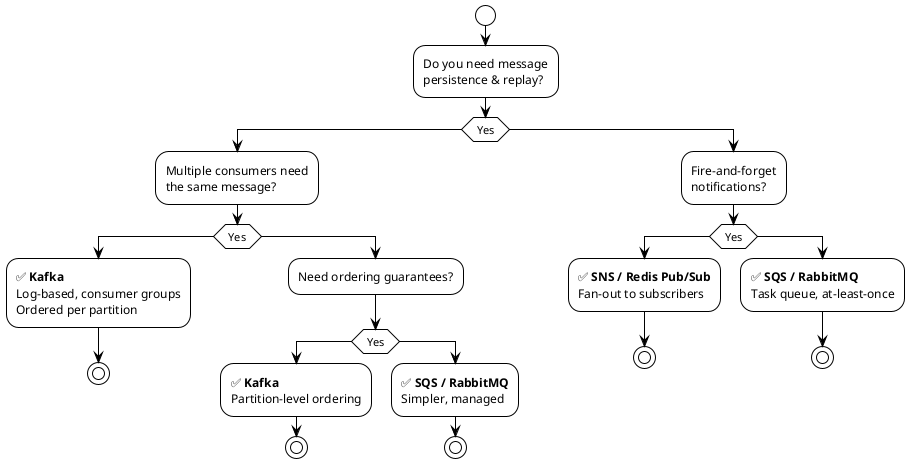

### 7.2 Kafka Key Concepts

| Concept | What It Means |
|---------|---------------|
| **Topic** | Named stream of messages (e.g., `order-events`) |
| **Partition** | Ordered, append-only log within a topic |
| **Consumer Group** | Set of consumers that share partitions (each message → one consumer) |
| **Offset** | Position of a consumer within a partition |
| **Partition Key** | Determines which partition a message goes to (e.g., `order_id`) |
| **Retention** | How long messages are kept (days/weeks, not deleted after consumption) |

**Ordering guarantee:** Messages with the same partition key are always processed in order. Messages across partitions have no ordering guarantee.

### 7.3 Idempotency

At-least-once delivery means you may process a message twice. Every consumer must be idempotent.

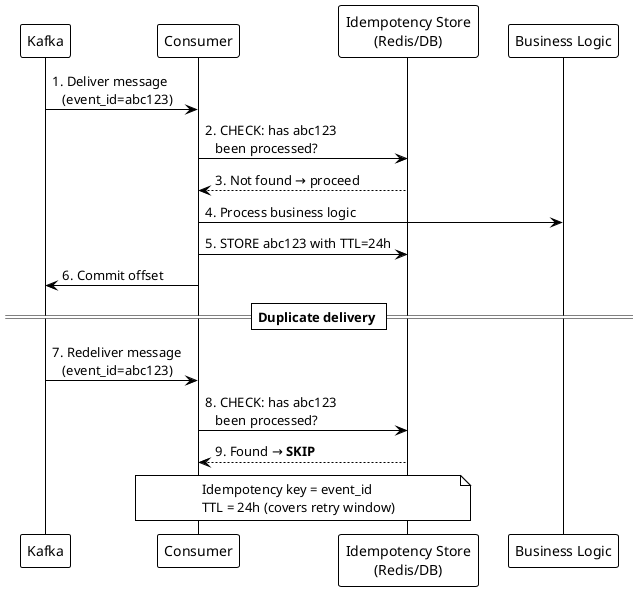

---

## 8. API Design & Communication Protocols

### 8.1 Protocol Selection Decision Tree

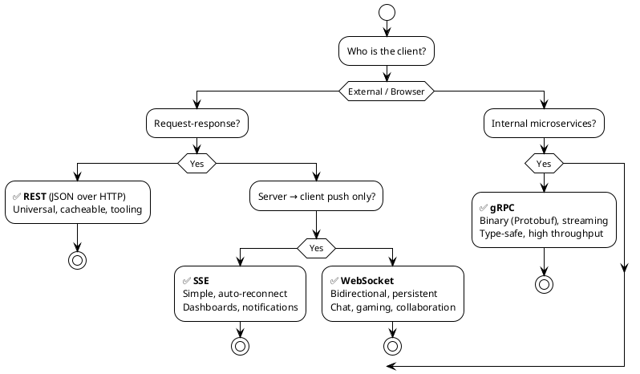

### 8.2 Protocol Comparison

| | REST | gRPC | WebSocket | SSE |
|---|------|------|-----------|-----|
| Transport | HTTP/1.1 or 2 | HTTP/2 | TCP | HTTP/1.1 |
| Format | JSON (text) | Protobuf (binary) | Any | Text |
| Direction | Request-response | Unary + streaming | Bidirectional | Server → client |
| Browser support | ✅ Native | ❌ Needs proxy | ✅ Native | ✅ Native |
| Latency | Medium | Low | Lowest (persistent) | Low |
| Use case | Public APIs | Internal services | Real-time apps | Live feeds |

### 8.3 REST API Best Practices

- **Pagination:** Use cursor-based (`?after=xyz`) not offset-based (`?page=3`) for large datasets
- **Versioning:** URL path (`/v2/users`) for breaking changes, headers for minor versions
- **Idempotency:** POST with `Idempotency-Key` header for safe retries
- **Rate limiting headers:** `X-RateLimit-Remaining`, `Retry-After`
- **HTTP status codes that matter:** 200 OK, 201 Created, 204 No Content, 400 Bad Request, 401 Unauthorized, 403 Forbidden, 404 Not Found, 409 Conflict, 429 Too Many Requests, 500 Internal Server Error, 503 Service Unavailable

### 8.4 gRPC Streaming Modes

| Mode | Request | Response | Example |
|------|---------|----------|---------|
| Unary | 1 | 1 | Get user profile |
| Client streaming | N | 1 | File upload, batch insert |
| Server streaming | 1 | N | Stock ticker, live updates |
| Bidirectional | N | N | Chat, collaborative editing |

---

## 9. Microservices vs Monolith

### 9.1 Decision Framework

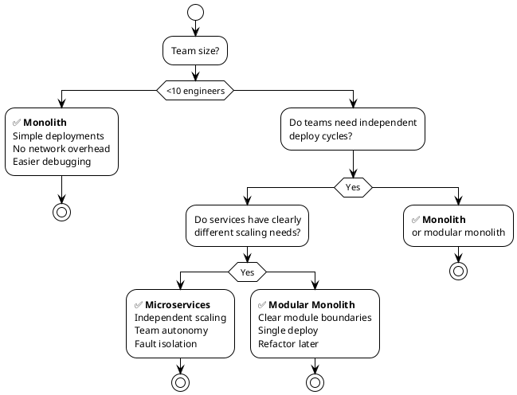

### 9.2 Microservice Communication Patterns

| Pattern | Sync/Async | Use Case |
|---------|-----------|----------|
| REST/gRPC call | Sync | Query another service, need response now |
| Event via Kafka | Async | Notify downstream, eventual consistency OK |
| Saga (choreography) | Async | Multi-service transaction, each service reacts to events |
| Saga (orchestration) | Async | Multi-service transaction, central coordinator |
| API Gateway | Sync | External client → internal service routing |

---

## 10. Consistency, Availability & CAP Theorem

### 10.1 CAP Theorem Simplified

During a network partition, you must choose:
- **CP (Consistency + Partition tolerance):** Every read returns the latest write, but some requests may fail → Use for banking, inventory
- **AP (Availability + Partition tolerance):** Every request gets a response, but it might be stale → Use for social feeds, shopping carts

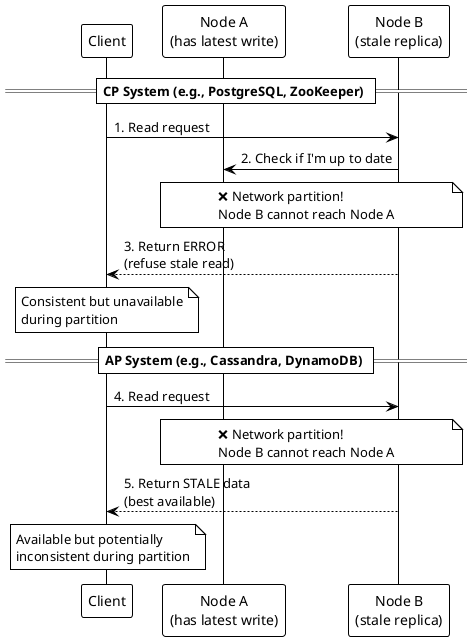

### 10.2 Consistency Levels

| Level | Guarantee | Example |
|-------|-----------|---------|
| **Strong** | Read always returns latest write | Bank balance |
| **Linearizable** | Strong + real-time ordering | Distributed locks |
| **Sequential** | Operations ordered, but may lag | Version control |
| **Causal** | Cause-effect ordering preserved | Social media replies |
| **Eventual** | All replicas converge... eventually | DNS, CDN caches |

### 10.3 Quorum Reads/Writes

```
W + R > N → strong consistency
```

| Setup | Write (W) | Read (R) | Nodes (N) | Consistency |
|-------|-----------|----------|-----------|-------------|
| Strong | 2 | 2 | 3 | ✅ Strong (W+R=4 > 3) |
| Write-fast | 1 | 3 | 3 | ✅ Strong (W+R=4 > 3) |
| Read-fast | 3 | 1 | 3 | ✅ Strong (W+R=4 > 3) |
| Eventual | 1 | 1 | 3 | ❌ Eventual (W+R=2 ≤ 3) |

---

## 11. Concurrency Control & Race Conditions

### 11.1 The Problem: Read-Then-Write is NOT Atomic

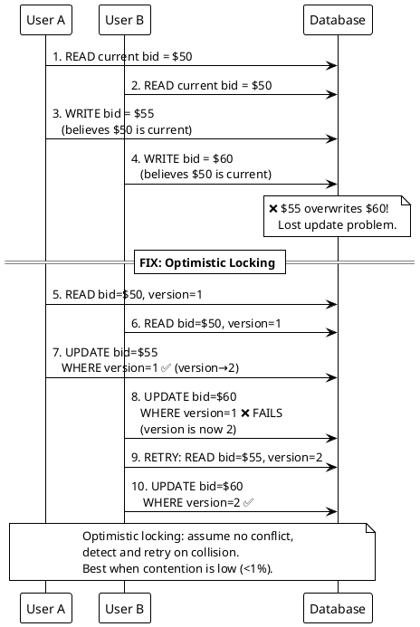

### 11.2 Concurrency Strategy Selection

| Scenario | Strategy | How It Works |
|----------|----------|-------------|
| Low contention (<1% conflicts) | **Optimistic locking** | `UPDATE WHERE version=expected`, retry on failure |
| High contention / critical section | **Pessimistic locking** | `SELECT FOR UPDATE`, hold lock during operation |
| Fixed inventory (tickets, coupons) | **Linearization** | Pre-create rows, atomic `UPDATE WHERE status='free' LIMIT 1` |
| Strict ordering per entity | **Queue serialization** | Kafka partition per entity serializes operations |
| Counter increments | **Atomic operations** | `UPDATE SET count = count + 1` (no read needed) |
| Distributed lock | **Redis SETNX + TTL** | Acquire lock, do work, release. TTL prevents deadlock |

### 11.3 TOCTOU (Time-of-Check to Time-of-Use)

A TOCTOU bug occurs when the state changes between checking a condition and acting on it.

**Bad:** `SELECT free coupon` → (gap where another user claims it) → `UPDATE claim coupon`

**Good:** `UPDATE coupons SET user_id=?, status='claimed' WHERE status='free' LIMIT 1` — single atomic statement, no gap.

---

## 12. Distributed Systems Patterns

### 12.1 Saga Pattern

For transactions that span multiple services. Two flavors:

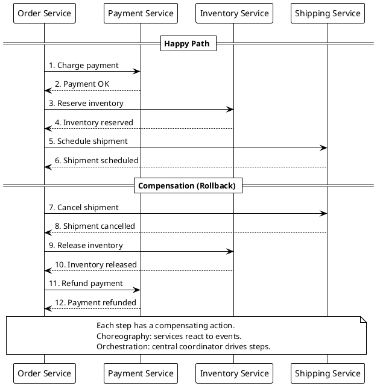

| Approach | Pros | Cons |
|----------|------|------|
| **Choreography** | Loose coupling, no single point of failure | Hard to track, debug, add steps |
| **Orchestration** | Clear flow, easy to monitor | Central coordinator is a dependency |

### 12.2 CQRS (Command Query Responsibility Segregation)

Separate the write model from the read model when they have very different requirements.

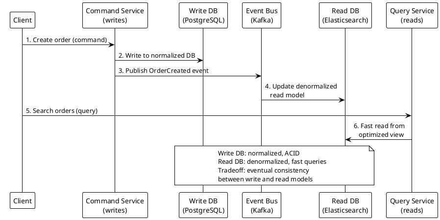

### 12.3 Event Sourcing

Store every state change as an immutable event. Reconstruct current state by replaying events.

| Aspect | Traditional CRUD | Event Sourcing |
|--------|-----------------|----------------|
| Storage | Current state only | Full event history |
| Audit trail | Must build separately | Built-in |
| Temporal queries | Not possible | Replay to any point in time |
| Complexity | Simple | High (snapshots needed for performance) |
| Best for | Standard CRUD apps | Financial systems, audit-critical domains |

### 12.4 Bloom Filters

A space-efficient probabilistic data structure for membership testing.

- **False positives:** "Might be in the set" (small probability)
- **False negatives:** NEVER. "Definitely not in the set" is always correct.

| Use Case | Why Bloom Filter |
|----------|-----------------|
| URL deduplication in crawler | 50 GB for 15B URLs (vs 700 GB in Redis) |
| Cache miss prevention | Skip DB lookup if key definitely not present |
| Spam detection | Quick pre-filter before expensive checks |

---

## 13. Rate Limiting & Backpressure

### 13.1 Rate Limiting Algorithms

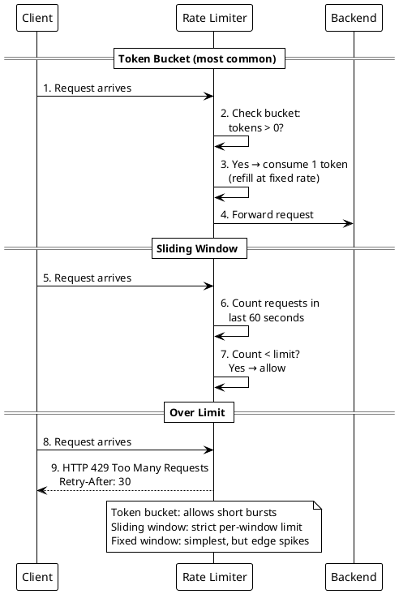

| Algorithm | Burst Friendly | Precision | Memory | Best For |
|-----------|---------------|-----------|--------|----------|
| Token Bucket | ✅ Yes | Medium | O(1) | API rate limiting |
| Leaky Bucket | ❌ Smooths | High | O(1) | Traffic shaping |
| Fixed Window | ✅ Edge bursts | Low | O(1) | Simple counters |
| Sliding Window Log | ❌ No | High | O(N) | Strict compliance |
| Sliding Window Counter | Moderate | Medium | O(1) | Good balance |

### 13.2 Distributed Rate Limiting

At 500K+ req/sec, a centralized Redis counter becomes a bottleneck.

**Solution:** Local token buckets that sync with Redis every 100ms.

- Each server maintains a local counter
- Sync with Redis periodically (every 100ms)
- Result: 40× fewer Redis calls, ~1% accuracy trade-off
- Acceptable for rate limiting (not for billing)

### 13.3 Backpressure

When a downstream service is overwhelmed, propagate the signal upstream instead of buffering indefinitely.

| Strategy | Mechanism |
|----------|-----------|
| Queue size limits | Reject new messages when queue is full |
| Load shedding | Drop low-priority requests under load |
| Circuit breaker | Stop calling failing service temporarily |
| Reactive streams | Consumer signals demand to producer |

---

## 14. CDN, DNS & Edge Computing

### 14.1 CDN Architecture

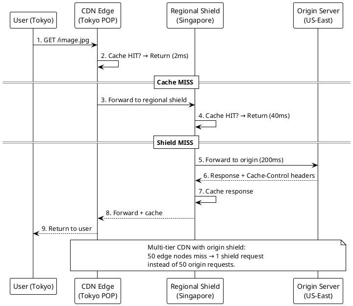

### 14.2 Cache-Control Headers

| Header | Meaning | Example |
|--------|---------|---------|
| `max-age=31536000` | Cache for 1 year | Immutable static assets (with hash in filename) |
| `max-age=300` | Cache for 5 minutes | Dynamic content |
| `stale-while-revalidate=60` | Serve stale for 60s while refreshing | Dashboards, feeds |
| `no-cache` | Must revalidate before serving | User-specific content |
| `no-store` | Never cache | Sensitive data |
| `private` | Only browser can cache (not CDN) | User-specific responses |
| `public` | CDN and browser can cache | Shared content |

### 14.3 DNS TTL Strategy

| Scenario | TTL | Why |
|----------|-----|-----|
| Stable infrastructure | 3600s (1 hour) | Minimize DNS lookups |
| 48h before planned migration | 300s (5 min) | Drain old TTLs |
| During failover | 30s | Fast cutover |

### 14.4 Edge vs Origin Decision

| Run at Edge | Keep at Origin |
|-------------|---------------|
| JWT validation | Personalized recommendations |
| A/B test bucketing | Payment processing (PCI) |
| Image resizing | Fraud detection |
| Static page SSR | Database writes |
| Geo-routing | Complex business logic |

---

## 15. Authentication, Authorization & Security

### 15.1 OAuth 2.0 Flows

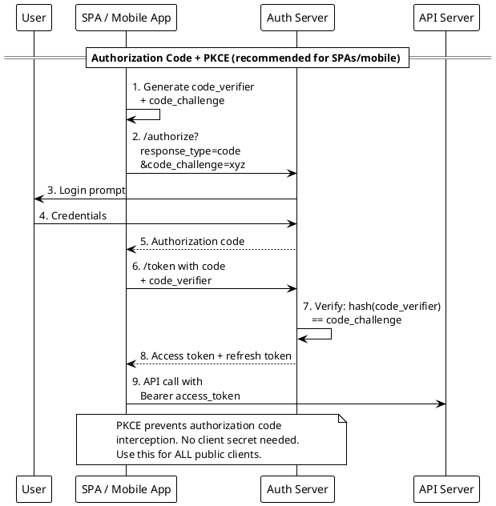

| Flow | Client Type | Use Case |
|------|------------|----------|
| Auth Code + PKCE | SPA, mobile, CLI | User-facing apps (standard) |
| Client Credentials | Server-to-server | No user involved (machine-to-machine) |
| Device Code | TV, IoT, CLI | No browser/keyboard on device |
| ~~Implicit~~ | ~~Deprecated~~ | ~~Never use~~ |
| ~~Password~~ | ~~Deprecated~~ | ~~Never use~~ |

### 15.2 JWT vs Session Tokens

| | JWT | Session Token |
|---|-----|--------------|
| Storage | Client-side (cookie/header) | Server-side (Redis/DB) |
| Validation | Stateless (verify signature) | Lookup in store |
| Revocation | Hard (need revocation list) | Easy (delete from store) |
| Scalability | ✅ No shared state | ❌ Requires centralized store |
| Best for | Distributed microservices | Monoliths, simple apps |

**Best practice:** Short-lived JWT (15 min) + Redis revocation list at API gateway for immediate logout support.

### 15.3 Authorization Models

| Model | When to Use | Example |
|-------|------------|---------|
| **RBAC** (Role-Based) | 3–5 static roles | Admin, Editor, Viewer |
| **ABAC** (Attribute-Based) | Complex, multi-condition | Doctor sees patient only if same department AND patient consented AND during business hours |
| **ReBAC** (Relationship-Based) | Social graph permissions | "Can edit if owner OR collaborator" (Google Docs) |

### 15.4 Password Hashing

**Ranking (best to worst for passwords):**
1. **Argon2id** — Modern, memory-hard, GPU-resistant
2. **bcrypt** — 30-year standard, factor 12 = ~300ms/hash
3. **scrypt** — Memory-hard
4. **PBKDF2** — Standards-compliant, CPU-only
5. ~~SHA-256~~ — Too fast (GPU can try billions/sec)
6. ~~MD5~~ — Broken, never use

### 15.5 Security Quick Reference

| Attack | Prevention |
|--------|-----------|
| CSRF | `SameSite=Strict` cookie (modern) or CSRF tokens (legacy) |
| XSS | Content-Security-Policy header + output encoding |
| SQL Injection | Parameterized queries (never string concatenation) |
| Secrets in code | HashiCorp Vault / AWS Secrets Manager with auto-rotation |
| Man-in-the-middle | TLS everywhere, certificate pinning for mobile |
| Brute force | Rate limiting + account lockout + Argon2id |

---

## 16. Observability: Logs, Metrics, Traces

### 16.1 The Three Pillars

Each pillar answers a different question. Using the wrong pillar wastes time.

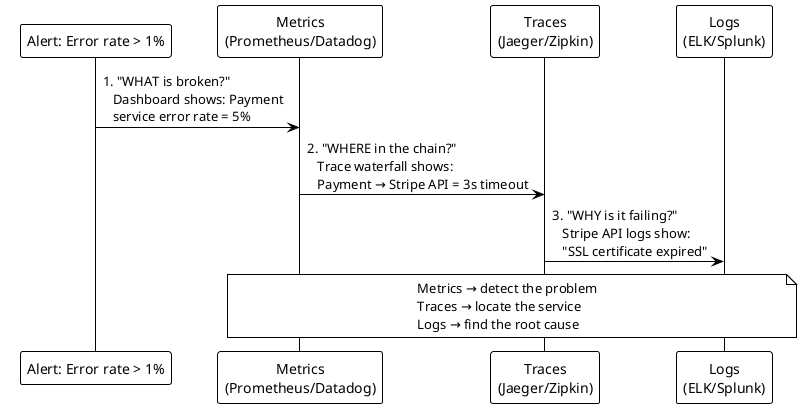

| Pillar | Data Type | Cardinality | Storage Cost | Question Answered |
|--------|-----------|-------------|-------------|-------------------|
| **Metrics** | Numeric counters/gauges | Low | Cheapest | "How many? How fast? What %?" |
| **Traces** | Request path + timing | Medium | Medium | "Which service is slow? What's the call chain?" |
| **Logs** | Text events | High | Most expensive | "What exactly happened? What was the error message?" |

### 16.2 Structured Logging

**Bad:** `"2025-01-15 14:23:01 ERROR Failed to process order 12345 for user 67890"`

**Good:**
```json
{
  "timestamp": "2025-01-15T14:23:01Z",
  "level": "ERROR",
  "message": "Failed to process order",
  "order_id": "12345",
  "user_id": "67890",
  "trace_id": "abc-123-def",
  "error": "PaymentDeclined",
  "latency_ms": 342
}
```

Benefits: machine-queryable, filterable by any field, correlates with traces via `trace_id`.

### 16.3 Metrics Cardinality Trap

**Never** use high-cardinality labels in metrics:
- ❌ `user_id` (50M unique values → 50M time series → Prometheus OOM)
- ❌ `request_id` (unique per request)
- ✅ `endpoint` (100 values)
- ✅ `status_code` (5 values)
- ✅ `region` (10 values)

**Rule:** If a label has >1,000 unique values, it belongs in logs or traces, not metrics.

### 16.4 Alerting: Symptoms vs Causes

| Alert On (Symptoms) | Investigate (Causes) |
|---------------------|---------------------|
| ✅ Error rate > 1% | CPU > 80% |
| ✅ P99 latency > 2s | Memory > 90% |
| ✅ Success rate < 99.9% | Disk > 85% |
| ✅ Queue depth growing | Thread pool exhaustion |

**Principle:** Page on user-facing symptoms. Dashboard on infrastructure causes.

### 16.5 Distributed Trace Sampling

At 100K req/sec, storing every trace is too expensive.

| Strategy | Kept | Lost | Use When |
|----------|------|------|----------|
| Head-based 10% | Random 10% | 90% including errors! | Low volume, debugging |
| **Tail-based** | All errors + slow + 1% normal | ~98% of fast/successful | ✅ Production (recommended) |

### 16.6 SLO Error Budget

```
Monthly error budget = (1 - SLO) × minutes_in_month
```

| SLO | Monthly Budget | Per-Incident Budget |
|-----|---------------|-------------------|
| 99% | 432 min (7.2 hrs) | Generous |
| 99.9% | 43.2 min | ~10 min per incident |
| 99.99% | 4.3 min | Almost zero tolerance |

**Rule:** If error budget is low → freeze deployments. If budget is full → ship faster.

### 16.7 Kubernetes Health Checks

| Probe | Checks | On Failure | Example |
|-------|--------|-----------|---------|
| **Liveness** | Is the process alive? | Restart pod | `/health/liveness` → JVM heartbeat |
| **Readiness** | Can it serve traffic? | Remove from load balancer | `/health/readiness` → DB + cache + circuits |
| **Startup** | Has it finished booting? | Delay other probes | Spring Boot ~45s boot |

**Critical rule:** Liveness should NEVER check external dependencies. If the DB is down, restarting the pod won't fix it — and you'll cascade-restart the entire fleet.

---

## 17. Resilience Patterns

### 17.1 Circuit Breaker

Prevents cascading failures by stopping calls to a failing service.

```plantuml
@startuml
!theme plain
skinparam backgroundColor white

participant "Service A" as A
participant "Circuit Breaker" as CB
participant "Service B\n(failing)" as B

== CLOSED (normal) ==
A -> CB: 1. Call Service B
CB -> B: 2. Forward request
B --> CB: 3. Error (timeout)
CB -> CB: 4. Failure count: 1/5

== After 5 failures → OPEN ==
A -> CB: 5. Call Service B
CB --> A: 6. Return FALLBACK immediately\n   (don't call B at all)
note over CB: Stays OPEN for 30 seconds\nAll requests get fallback

== After 30s → HALF-OPEN ==
A -> CB: 7. Call Service B
CB -> B: 8. Allow ONE test request
B --> CB: 9. Success!
CB -> CB: 10. Reset to CLOSED

note over A,B
  States: CLOSED → OPEN → HALF-OPEN
  Open: return fallback (cached data,\n  default value, or error)
  Prevents: cascading timeouts,\n  thread pool exhaustion
end note
@enduml
```

### 17.2 Retry with Exponential Backoff + Jitter

```
Retry 1: wait 100ms ± 50ms
Retry 2: wait 200ms ± 100ms
Retry 3: wait 400ms ± 200ms
(max 3 retries)
```

**Rules:**
- Only retry on 5xx errors and timeouts (NEVER on 4xx — client's fault)
- Always add jitter (random ±50%) to prevent thundering herd
- Set a retry budget: max 20% of requests can be retries

### 17.3 Timeout Hierarchy

Each layer's timeout must be shorter than the caller's timeout:

```
Client → API Gateway (10s) → Service A (5s) → Service B (2s) → DB (100ms)
```

If Service B's timeout > Service A's timeout, Service A times out waiting for Service B, but Service B's work completes uselessly.

### 17.4 Bulkhead Pattern

Isolate failures so one failing dependency doesn't exhaust all resources.

| Resource | Bulkhead Strategy |
|----------|------------------|
| Thread pools | Separate pool per downstream service |
| Connection pools | Separate pool per database |
| Rate limits | Separate limit per tenant |
| Queues | Separate queue per priority level |

### 17.5 Graceful Degradation Strategies

| Condition | Degradation |
|-----------|-------------|
| Recommendation service down | Show popular/trending instead |
| Search service slow | Return cached results from 5 min ago |
| Payment gateway timeout | Queue order for retry, show "processing" |
| Non-critical feature failing | Hide the feature, serve rest of page |

---

## 18. Fan-out, Feeds & Notifications

### 18.1 Fan-out Strategy Selection

```plantuml
@startuml
!theme plain
skinparam backgroundColor white

participant "Author\n(posts content)" as A
participant "Fan-out Service" as FO
participant "User Feed Cache\n(Redis)" as FC
participant "Reader\n(views feed)" as R
participant "Post Storage" as PS

== Push Model (Fan-out on Write) ==
A -> FO: 1. New post
FO -> FO: 2. Lookup followers (300 avg)
FO -> FC: 3. Write post_id to each\n   follower's feed cache
note over FO,FC: ✅ Fast reads (pre-computed)\n❌ Slow writes for VIPs (10M followers)

== Pull Model (Fan-out on Read) ==
R -> PS: 4. "Show me my feed"
PS -> PS: 5. Query posts from all\n   followed users, sort by time
note over PS: ✅ No write amplification\n❌ Slow reads (compute at read time)

== Hybrid (Instagram/Twitter) ==
A -> FO: 6. New post from VIP (>1M followers)
FO -> PS: 7. Store post (no fan-out)
note over FO: VIPs: pull model\nRegular users: push model

R -> FC: 8. Read pre-computed feed
R -> PS: 9. Merge with VIP posts\n   at read time

note over A,R
  Hybrid threshold: ~10K-1M followers
  Below: push (pre-compute)
  Above: pull (compute at read time)
end note
@enduml
```

### 18.2 Notification System Architecture

```plantuml
@startuml
!theme plain
skinparam backgroundColor white

participant "Event Source" as ES
participant "Kafka" as K
participant "Notification Service" as NS
participant "Redis\n(dedup + prefs)" as R
participant "Channel Workers" as CW

ES -> K: 1. Publish event\n   (order_shipped, new_follower)
K -> NS: 2. Consume event
NS -> R: 3. Check dedup:\n   seen event_id before?
R --> NS: 4. Not seen → proceed
NS -> R: 5. Check user preferences:\n   email? push? SMS?
R --> NS: 6. User wants: push + email
NS -> CW: 7. Route to channel-specific\n   workers (APNs, SES, Twilio)
CW -> CW: 8. Send with exponential\n   backoff on failure
CW -> K: 9. Failed after 3 retries\n   → Dead Letter Queue

note over R
  Dedup: SETNX event_id TTL=24h
  Prevents duplicate notifications
  from at-least-once delivery
end note
@enduml
```

---

## 19. Real-Time Systems & Chat

### 19.1 Chat System Architecture

```plantuml
@startuml
!theme plain
skinparam backgroundColor white

participant "User A" as A
participant "WebSocket Server\n(connection tier)" as WS
participant "Redis Pub/Sub\n(message routing)" as R
participant "Cassandra\n(message storage)" as C
participant "Presence Service" as P
participant "Push Service\n(APNs/FCM)" as PS

A -> WS: 1. Connect via WebSocket
WS -> P: 2. Mark user A as ONLINE
A -> WS: 3. Send message to User B
WS -> C: 4. Persist message
WS -> R: 5. Publish to channel\n   "conversation:123"

alt User B is ONLINE
  R -> WS: 6a. Deliver via WebSocket\n    to User B's server
else User B is OFFLINE
  WS -> PS: 6b. Send push notification\n    via APNs/FCM
end

note over WS
  Each WS server holds ~50K connections
  Scale horizontally: 20 servers = 1M users
  Redis Pub/Sub routes between WS servers
end note
@enduml
```

### 19.2 Presence System

How to track who's online efficiently:

| Approach | How | Tradeoff |
|----------|-----|----------|
| Heartbeat + TTL | Client sends heartbeat every 30s; key expires in 60s | Simple, slight delay on offline detection |
| WebSocket disconnect event | Mark offline on TCP close | Instant, but unreliable with network drops |
| **Hybrid (best)** | WebSocket event + heartbeat fallback | Covers both clean and dirty disconnects |

### 19.3 Typing Indicators

- Broadcast "typing" event via Redis Pub/Sub
- **Debounce:** Only send every 3 seconds (not on every keystroke)
- **Auto-expire:** Stop showing "typing" after 5 seconds of no updates
- **Don't persist:** Typing indicators are ephemeral, never write to DB

### 19.4 Polling vs WebSocket vs SSE

| | HTTP Polling | Long Polling | SSE | WebSocket |
|---|-------------|-------------|-----|-----------|
| Direction | Client → Server | Client → Server | Server → Client | Bidirectional |
| Connection | New per request | Held open | Held open | Held open |
| Overhead | High (repeated headers) | Medium | Low | Lowest |
| Reconnect | Built-in | Manual | Auto-reconnect | Manual |
| Use case | Simple dashboards | Legacy fallback | Live feeds, notifications | Chat, gaming, collaboration |

---

## 20. Classic System Design Reference Architectures

### 20.1 URL Shortener

```plantuml
@startuml
!theme plain
skinparam backgroundColor white

participant "User" as U
participant "API Gateway" as AG
participant "URL Service" as US
participant "Redis Cache" as R
participant "Cassandra\n(URL mappings)" as C
participant "Analytics\n(Kafka → Flink)" as A

== Create Short URL ==
U -> AG: 1. POST /shorten {long_url}
AG -> US: 2. Generate short code\n   (Base62 hash, 7 chars)
US -> C: 3. Store mapping:\n   short_code → long_url
US --> U: 4. Return https://short.ly/abc1234

== Redirect ==
U -> AG: 5. GET /abc1234
AG -> R: 6. Cache lookup
R --> AG: 7. HIT → long_url
AG -> A: 8. Log click event (async)
AG --> U: 9. HTTP 302 redirect to long_url

note over AG
  302 (temporary) not 301 (permanent)
  so clicks pass through for analytics
end note
@enduml
```

**Key decisions:**
- **302 vs 301:** Use 302 (temporary redirect) to track analytics; 301 would be cached by browsers
- **Code generation:** Base62 (a-z, A-Z, 0-9), 7 characters = 62^7 = 3.5 trillion combinations
- **Storage:** Cassandra (write-heavy, horizontal scale) or DynamoDB
- **Dedup:** Bloom filter (50 GB for 15B URLs) vs Redis exact set (700 GB)

### 20.2 News Feed

**Key decisions:**
- **Hybrid fan-out:** Push for users with <10K followers; pull for VIPs with >10K
- **Feed cache:** Redis sorted set per user, sorted by timestamp
- **Ranking:** ML model scores posts; time-decay + engagement signals

### 20.3 Web Crawler

**Key decisions:**
- **Politeness:** Respect `robots.txt`, 1 request per domain per second
- **URL frontier:** Priority queue (important URLs first) + per-domain rate limiting
- **Deduplication:** Bloom filter for seen URLs + content hash for duplicate pages
- **Scale:** Partition URLs by domain across worker nodes

### 20.4 Distributed Task Scheduler

**Key decisions:**
- **At-least-once execution:** Persist task to DB before acknowledging
- **Worker heartbeat:** Mark task as failed if no heartbeat in 60s
- **Sharding:** Partition tasks by `task_id` hash across scheduler nodes
- **Priority:** Multiple queues with weighted consumption

---

## 21. Numbers Every Engineer Should Know

### 21.1 Latency Reference

| Operation | Latency |
|-----------|---------|
| L1 cache reference | 0.5 ns |
| L2 cache reference | 7 ns |
| Main memory reference | 100 ns |
| SSD random read | 150 μs |
| HDD seek | 10 ms |
| Send 1 KB over 1 Gbps network | 10 μs |
| Round trip within datacenter | 500 μs |
| Round trip CA → Netherlands | 150 ms |

### 21.2 Throughput Reference

| System | Throughput |
|--------|-----------|
| Single Redis node | 100K+ ops/sec |
| Single PostgreSQL node | 5–10K TPS |
| Single Cassandra node (writes) | 10–20K ops/sec |
| Cassandra cluster (writes) | Millions ops/sec |
| Kafka single partition | 10K–100K msgs/sec |
| Kafka cluster | Millions msgs/sec |
| Single WebSocket server | ~50K connections |
| Single 10 Gbps NIC | 10,000 Mbps |

### 21.3 Storage Reference

| Unit | Value | Human Scale |
|------|-------|-------------|
| 1 KB | 1,000 bytes | A short email |
| 1 MB | 1,000 KB | A high-res photo |
| 1 GB | 1,000 MB | A movie |
| 1 TB | 1,000 GB | 1,000 movies |
| 1 PB | 1,000 TB | Netflix's total catalog |
| 1 EB | 1,000 PB | All data generated globally per day |

### 21.4 Connection Pool Sizing

**Little's Law:**
```
Pool size = Throughput × Average latency
```

| Throughput | Avg Latency | Pool Size |
|-----------|------------|-----------|
| 1,000 req/sec | 10ms | 10 connections |
| 5,000 req/sec | 20ms | 100 connections |
| 10,000 req/sec | 50ms | 500 connections |

**HikariCP rule of thumb:** Start with `connections = (2 × CPU cores) + disk_spindles`. For SSDs, use `2 × CPU cores + 1`.

---

## Quick Decision Cheat Sheet

When in doubt during an interview, use these defaults:

| Decision | Default Choice | Switch When |
|----------|---------------|-------------|
| Database | PostgreSQL | >100K writes/sec → Cassandra; Full-text search → Elasticsearch |
| Cache | Redis | <4 GB working set → in-process; Static assets → CDN |
| Message queue | Kafka | Simple task queue → SQS/RabbitMQ |
| API protocol | REST | Internal services → gRPC; Real-time → WebSocket |
| Architecture | Monolith | >10 teams + different scaling needs → Microservices |
| Consistency | Strong | Social feeds, analytics → Eventual |
| Sharding key | Entity ID (user_id) | Time-series → time bucket; Multi-tenant → tenant_id |
| Auth | JWT + PKCE | Simple monolith → session cookies |
| Rate limiter | Token bucket | Need strict precision → Sliding window |
| Concurrency | Optimistic locking | High contention → pessimistic; Fixed inventory → linearization |
| Fan-out | Hybrid push/pull | All users <10K followers → push only |
| Health check | Liveness + Readiness | Never check external deps in liveness |
| Redirect | 302 | No analytics needed → 301 |

---

*This cheat sheet covers all 320 questions across 26 topics. Read it once before a session, then use the decision trees during practice to build intuition.*
