# Auction System Design

> Based on "Design an auction" by Alexey Soshin

## Table of Contents

1. [Problem Introduction](#problem-introduction)
2. [Requirements Gathering](#requirements-gathering)
3. [Basic Design](#basic-design)
4. [The Concurrency Problem](#the-concurrency-problem)
5. [Optimistic Locking](#optimistic-locking)
6. [Serialization with Queues](#serialization-with-queues)
7. [Event-Driven Architecture](#event-driven-architecture)
8. [Client Communication Protocols](#client-communication-protocols)
9. [Scaling Calculations](#scaling-calculations)
10. [Final Architecture](#final-architecture)

---

## Problem Introduction

### What is an Auction System?

An auction system allows users to bid on items, with the highest bidder winning when the auction ends. The core challenge is handling **concurrent bids** while ensuring **fairness** and **data consistency**.

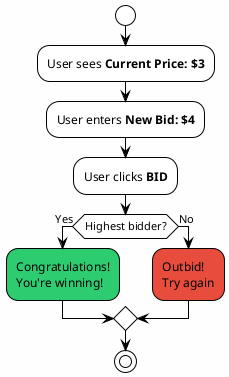

### The Basic Auction Flow

1. User sees current highest price
2. User enters a higher bid amount
3. System validates if bid is higher than current price
4. If yes: User becomes highest bidder
5. If no: User is notified they've been outbid

---

## Requirements Gathering

### Key Questions to Ask

Before designing any system, you must understand the scale and constraints:

| Question | Why It Matters |
|----------|----------------|
| How many simultaneous auctions? | Determines database and service capacity |
| How many bidders per auction? | Affects concurrency handling |
| Average bids per auction? | Determines write throughput |
| Auction duration? | Affects how bids are distributed over time |

### Our Requirements

| Parameter | Value |
|-----------|-------|
| Simultaneous auctions | **100,000** |
| Bidders per auction | **10 - 1,000** |
| Average bids per user | **5** |
| Auction duration | **24 hours** |

These numbers will drive our architectural decisions and help us calculate required throughput.

---

## Basic Design

### Initial Architecture

The simplest design uses a synchronous HTTP-based approach:

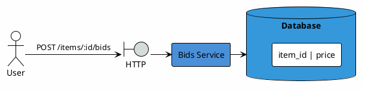

**Components:**
- **Client**: Web browser or mobile app
- **Bids Service**: Handles bid validation and storage
- **Database**: Stores auction items and current prices

### Basic Bid Flow

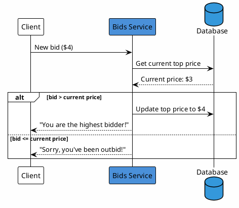

**The Logic:**
1. Receive new bid from client
2. Query database for current highest price
3. Compare new bid against current price
4. If higher: update database and confirm
5. If lower: reject and notify user

---

## The Concurrency Problem

### Why Simple Design Fails

The basic design has a critical flaw: **race conditions**. When two users bid simultaneously, both may read the same "current price" before either update completes.

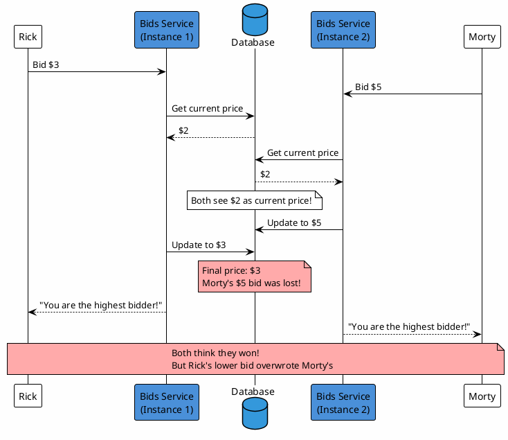

### The Concurrency Error Window

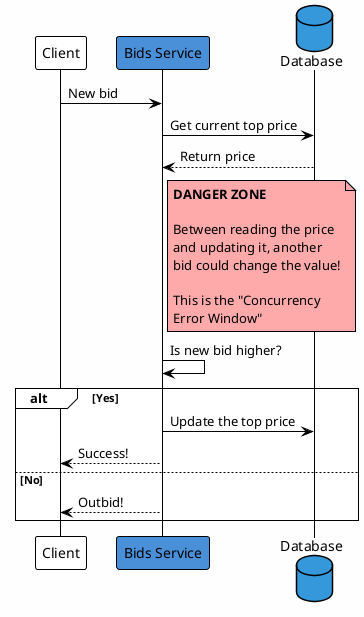

### What Goes Wrong?

1. **Lost Updates**: Higher bids get overwritten by lower ones
2. **False Confirmations**: Users told they're winning when they're not
3. **Data Inconsistency**: Database state doesn't reflect actual bid order

---

## Optimistic Locking

### The Solution: Conditional Updates

Instead of blindly updating, we **include the expected current value** in our update query:

```sql
UPDATE bids
SET price = 3
WHERE item_id = ? AND price = 2
```

This query will only succeed if the price is still what we expected ($2). If someone else changed it, **zero rows are updated**.

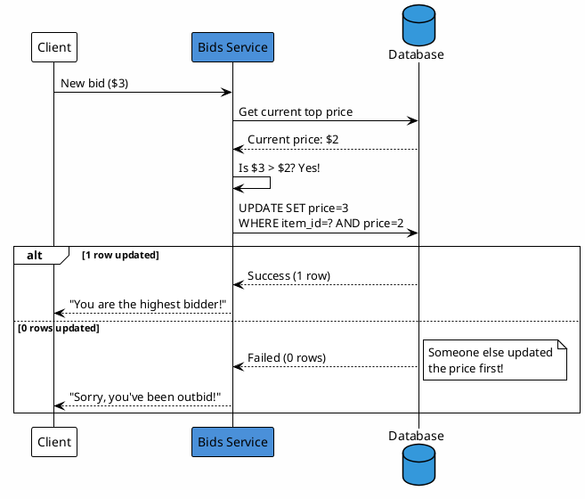

### How Optimistic Locking Resolves Conflicts

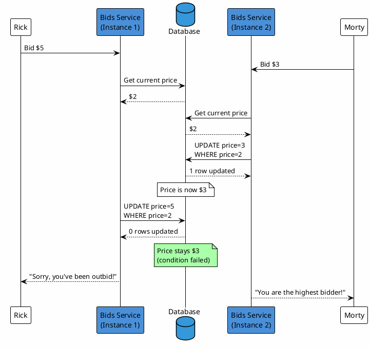

### The Remaining Problem

Optimistic locking prevents data corruption, but creates a **fairness issue**:
- Rick bid $5 (higher!) but lost
- Morty bid $3 (lower) but won
- The **order of arrival** matters, not just the **bid amount**

This happens because Rick's update arrived *after* Morty's completed, even though Rick submitted a higher bid.

---

## Serialization with Queues

### Guaranteeing Order with Message Queues

To ensure fair ordering, we introduce a **message queue** between the service and database:

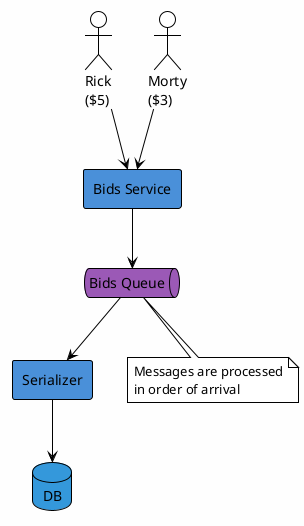

### How Queue Serialization Works

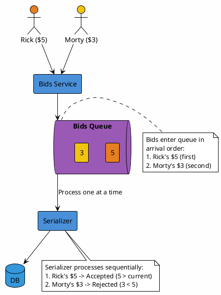

### Benefits of Queue-Based Serialization

| Benefit | Explanation |
|---------|-------------|
| **Ordering Guarantee** | First-come, first-served processing |
| **Fairness** | Higher bid that arrived first wins |
| **Decoupling** | Service doesn't wait for DB operations |
| **Backpressure** | Queue absorbs traffic spikes |
| **Retry Capability** | Failed operations can be reprocessed |

---

## Event-Driven Architecture

### From Synchronous to Asynchronous

The synchronous approach blocks the client until processing completes. With an **event-driven** design, we can respond faster and handle higher load.

#### Synchronous (Before)

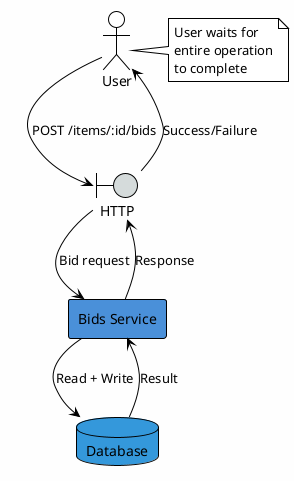

#### Asynchronous (After)

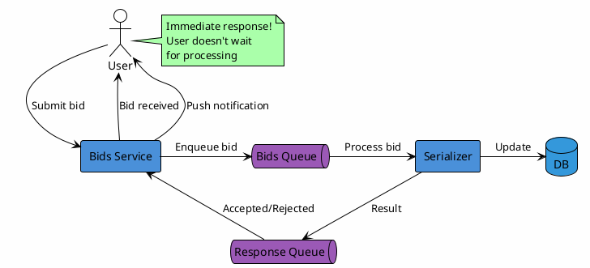

### Complete Event Flow

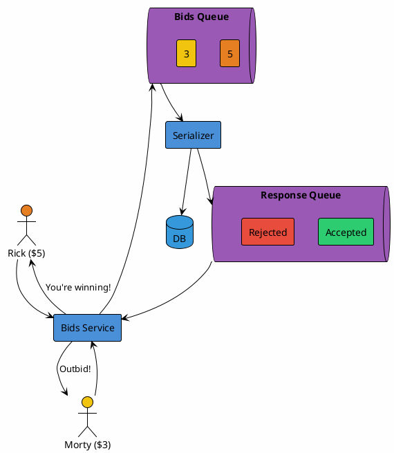

---

## Client Communication Protocols

### The Challenge: Notifying Clients

With asynchronous processing, how do clients know the result of their bid?

Two main approaches:

### Option 1: Polling

Client repeatedly asks "Is my bid processed yet?"

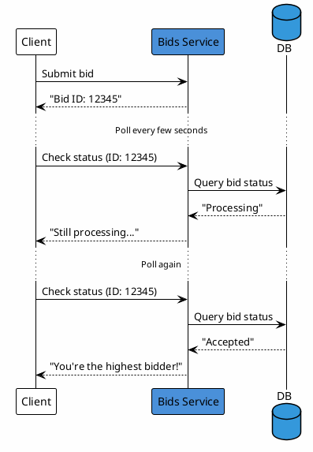

**Polling Trade-offs:**

| Pros | Cons |
|------|------|
| Simple to implement | Wasted requests (most return "no change") |
| Works through firewalls | Higher latency (wait for next poll) |
| Stateless server | Increased server load |

### Option 2: WebSockets

Server pushes updates to client over persistent connection.

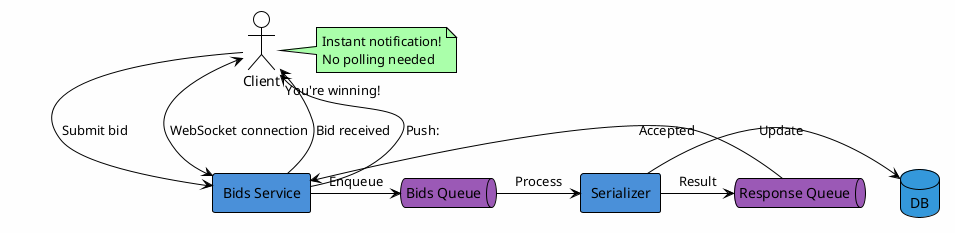

**WebSocket Trade-offs:**

| Pros | Cons |
|------|------|
| Real-time updates | More complex implementation |
| Lower latency | Requires connection management |
| Efficient (no wasted requests) | Stateful (harder to scale) |

### Two-Way Communication Example

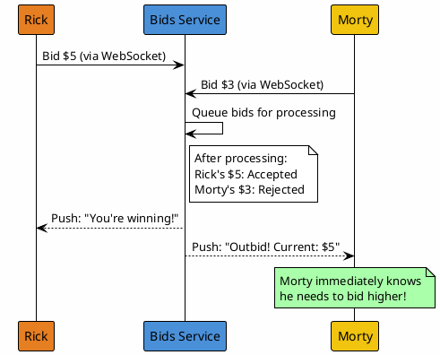

---

## Scaling Calculations

### Back-of-the-Envelope Math

Understanding your throughput requirements is crucial for capacity planning.

### Write Throughput (Bids Queue)

```
Given:
- 5 bids per user (average)
- 1,000 peak users per auction
- 100,000 simultaneous auctions

Total writes per day:
5 × 1,000 × 100,000 = 500,000,000 writes/day

Breaking it down:
500,000,000 / 24 hours   = 20,833,333 writes/hour
20,833,333 / 60 minutes  = 347,222 writes/minute
347,222 / 60 seconds     = ~8,000 writes/second
```

### Summary of Throughput Requirements

| Metric | Value |
|--------|-------|
| **Writes to Bids Queue** | ~8K/second |
| **Reads from DB** | ~8K/second (one per bid) |
| **Response Messages** | ~8K/second |

### Is This Achievable?

| Component | Typical Capacity | Our Requirement |
|-----------|------------------|-----------------|
| PostgreSQL writes | 10-50K/sec | 8K/sec |
| Redis operations | 100K+/sec | 8K/sec |
| Kafka messages | 100K+/sec | 8K/sec |
| WebSocket connections | 100K+ per server | Depends on bidders |

The requirements are well within modern infrastructure capabilities.

---

## Final Architecture

### Complete System Design

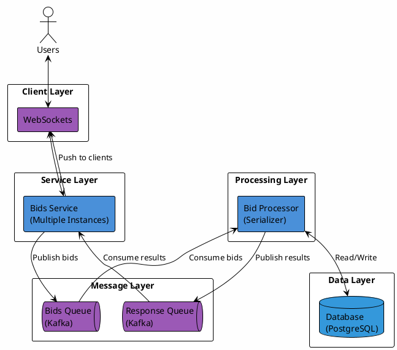

### Component Summary

| Component | Responsibility | Technology Options |
|-----------|---------------|-------------------|
| **Bids Service** | Accept bids, manage WebSockets, route messages | Node.js, Go, Java |
| **Bids Queue** | Order and buffer incoming bids | Kafka, RabbitMQ, SQS |
| **Bid Processor** | Validate and process bids sequentially | Dedicated workers |
| **Response Queue** | Deliver results back to services | Kafka, RabbitMQ, SQS |
| **Database** | Store auction state and bid history | PostgreSQL, MySQL |

### Data Flow Summary

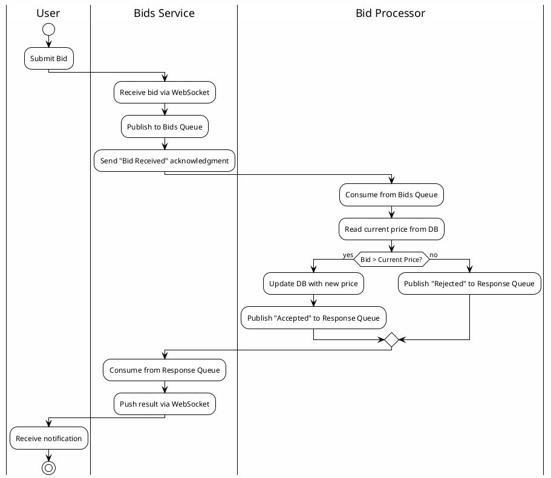

---

## Key Takeaways

### Design Principles Demonstrated

1. **Start Simple, Then Iterate**
   - Begin with basic synchronous design
   - Identify problems through analysis
   - Add complexity only when needed

2. **Understand Concurrency Challenges**
   - Race conditions can corrupt data
   - "Read-then-write" patterns are dangerous
   - Always consider what happens with simultaneous requests

3. **Optimistic Locking for Consistency**
   - Include expected state in updates
   - Let the database enforce constraints
   - Handle conflicts gracefully

4. **Queues for Ordering and Decoupling**
   - Serialize operations that must be ordered
   - Decouple components for scalability
   - Buffer against traffic spikes

5. **Event-Driven for Responsiveness**
   - Don't block clients on slow operations
   - Use async patterns for better user experience
   - Push updates instead of polling when possible

6. **Always Do the Math**
   - Calculate expected throughput
   - Validate assumptions with numbers
   - Design for peak load, not average

---

## Comparison: Approaches Summary

| Approach | Consistency | Fairness | Complexity | Latency |
|----------|-------------|----------|------------|---------|
| Basic (no protection) | Poor | Poor | Low | Low |
| Optimistic Locking | Good | Fair | Medium | Medium |
| Queue Serialization | Excellent | Excellent | High | Higher |
| Event-Driven + WebSocket | Excellent | Excellent | Highest | Best UX |

---

*Document generated from "Design an auction" presentation by Alexey Soshin*
