# Coupon System Design

A comprehensive guide to designing a high-throughput coupon distribution system that handles millions of concurrent users while ensuring fairness and data consistency.

## Table of Contents

1. [Problem Statement](#1-problem-statement)
2. [Requirements and Constraints](#2-requirements-and-constraints)
3. [Basic Solution](#3-basic-solution)
4. [The Concurrency Problem](#4-the-concurrency-problem)
5. [Solution 1: Queue-Based Serialization](#5-solution-1-queue-based-serialization)
6. [Solution 2: Prepopulated Coupons with Atomic Updates](#6-solution-2-prepopulated-coupons-with-atomic-updates)
7. [Scaling the System](#7-scaling-the-system)
8. [In-Memory Caching Strategy](#8-in-memory-caching-strategy)
9. [Fairness Considerations](#9-fairness-considerations)
10. [Alternative: Scaling with Queues](#10-alternative-scaling-with-queues)
11. [Final Architecture Summary](#11-final-architecture-summary)

---

## 1. Problem Statement

Imagine you're running a flash sale or promotional event where you need to distribute a limited number of coupons to users. The challenge is that **many more users want coupons than coupons available**, and they all arrive at roughly the same time.

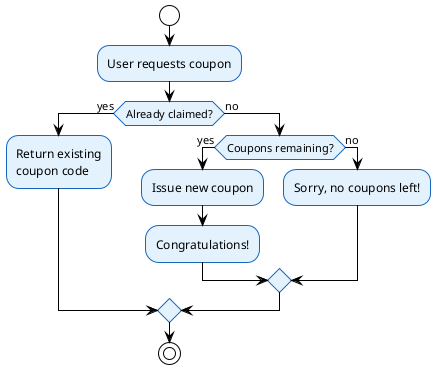

**Key Business Rules:**
- Each user can only claim **one coupon**
- Once coupons run out, no more can be issued
- The system must handle extreme traffic spikes

**Out of Scope:**
- Authentication (assume users are already authenticated)
- Payments
- 1 coupon = 1 item relationship

---

## 2. Requirements and Constraints

Before designing, we need to understand the scale:

| Parameter | Value |
|-----------|-------|
| Active Users | 100 million |
| Coupons to Distribute | 10 million |
| Time Window | 10 minutes |

### Back-of-Envelope Calculations

```
Average load:
- 100M users / 10 minutes = 10M users/minute
- 10M / 60 seconds = ~167K requests/second

But traffic isn't uniform! Peak load (80% of users in first minute):
- 80M users / 60 seconds = 1.33M requests/second
- Round up to ~1.2M requests/second peak
```

This is an **extremely high throughput** requirement. A typical database handles 10K-50K writes/second. We're looking at 20-100x that rate.

---

## 3. Basic Solution

Let's start with the simplest possible design to understand the problem.

### Database Schema

```sql
CREATE TABLE coupons (
    coupon_uuid UUID PRIMARY KEY,
    user_uuid UUID UNIQUE,  -- One coupon per user
    created_at TIMESTAMP DEFAULT NOW()
);

CREATE INDEX idx_user_uuid ON coupons(user_uuid);
```

### Basic Flow

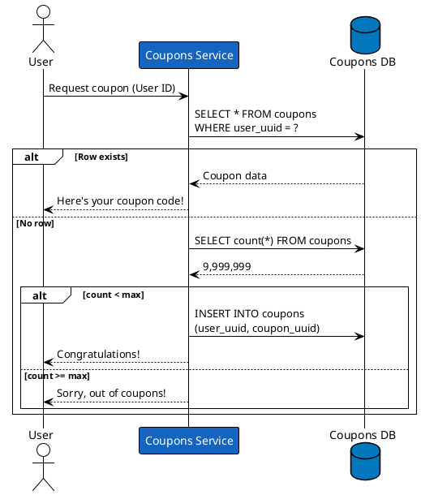

### Why This Doesn't Work

The basic solution has a critical flaw: **the check-then-act pattern is not atomic**.

---

## 4. The Concurrency Problem

### The Data Race

When multiple services check the count simultaneously, they can all see "9,999,999" and all decide to insert - resulting in more coupons than allowed.

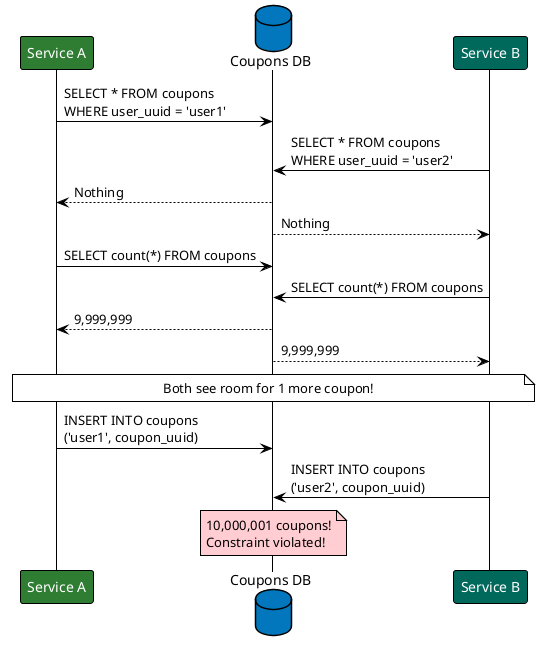

### The Core Issue

The problem is a **Time-of-Check to Time-of-Use (TOCTOU)** bug:

1. **Check**: Read the count (9,999,999)
2. **Decide**: Count < max, so proceed
3. **Act**: Insert new row

Between steps 1 and 3, another process can complete the same sequence, causing over-issuance.

---

## 5. Solution 1: Queue-Based Serialization

One way to solve concurrency is to **serialize all writes through a single writer**.

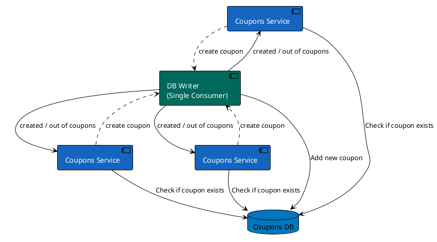

### How It Works

1. **Read path** (checking existing coupon): Services query the database directly - this can be parallelized
2. **Write path** (creating new coupon): All creation requests go through a queue
3. **Single consumer**: One DB Writer processes requests one-at-a-time, eliminating race conditions

### The Bottleneck Problem

With a single writer, we can only process writes sequentially. If each write takes 1ms, we can only do 1,000 writes/second - far below our 1.2M/second requirement.

**Can we use multiple consumers?** Not safely - multiple consumers reintroduce the race condition!

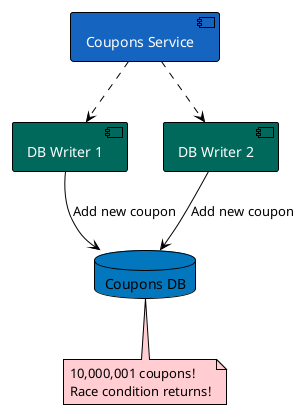

---

## 6. Solution 2: Prepopulated Coupons with Atomic Updates

A more elegant solution: **prepopulate all coupons** and use **atomic database operations** to claim them.

### The Key Insight

Instead of:
1. Check count
2. If room, insert

We do:
1. Try to claim an unclaimed coupon atomically
2. If no unclaimed coupons, we're out

### Database Schema

```sql
CREATE TABLE coupons (
    coupon_uuid UUID PRIMARY KEY,
    user_uuid UUID UNIQUE,  -- NULL means unclaimed
    created_at TIMESTAMP
);

-- Prepopulate 10 million coupons with user_uuid = NULL
INSERT INTO coupons (coupon_uuid, user_uuid)
SELECT gen_random_uuid(), NULL
FROM generate_series(1, 10000000);
```

### The Atomic Claim Query

```sql
UPDATE coupons
SET user_uuid = ?
WHERE user_uuid IS NULL
LIMIT 1
RETURNING coupon_uuid;
```

This query is **atomic** - the database ensures only one transaction can claim each coupon.

### Flow Diagram

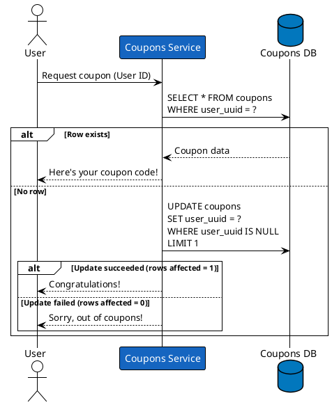

### Why This Works

- **No race condition**: The `UPDATE ... WHERE user_uuid IS NULL LIMIT 1` is atomic
- **No count check needed**: The update either succeeds (coupon available) or fails (no coupons left)
- **Automatic limiting**: Once all 10M coupons have user_uuids, no more can be claimed

---

## 7. Scaling the System

Even with atomic updates, a single database can't handle 1.2M requests/second. We need to scale horizontally.

### Scaling Reads with Sharding

Use the **last digit of user ID** to route requests to different service instances:

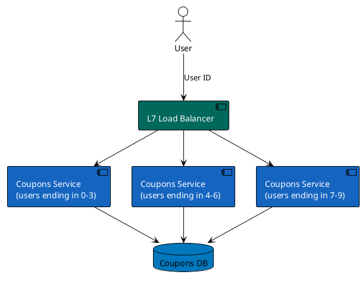

### Scaling Writes with Database Sharding

For writes, we also need to shard the database:

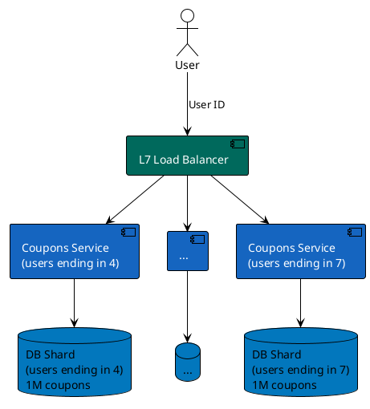

### Sharding Strategy

With 10 shards (digits 0-9):
- Each shard holds 1M coupons
- Each shard handles ~120K requests/second peak
- Much more manageable!

---

## 8. In-Memory Caching Strategy

To further reduce database load, add **in-memory caching** for issued coupons.

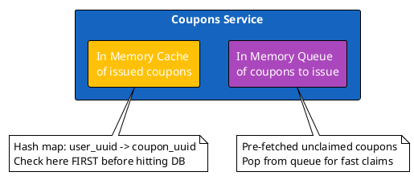

### Cache Benefits

1. **Read optimization**: Check cache before querying DB for "already claimed?" check
2. **Write optimization**: Keep a queue of pre-fetched unclaimed coupon IDs
3. **Reduced DB load**: Most repeat requests never hit the database

### Cache Consistency

Since each user is routed to the same service instance (via user ID sharding), the in-memory cache stays consistent without distributed cache coordination.

---

## 9. Fairness Considerations

### The Fairness Problem

With database sharding, coupons are distributed per-shard. This can be unfair:

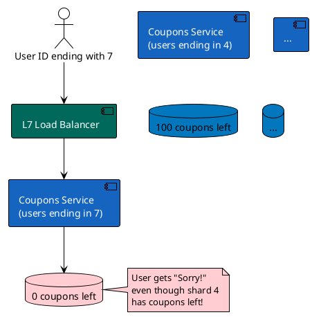

### Fairness Trade-offs

| Approach | Pros | Cons |
|----------|------|------|
| **Strict sharding** | Simple, fast | Users on "unlucky" shards may miss out |
| **Cross-shard queries** | Fair | Complex, slower, coordination overhead |
| **Rebalancing** | Eventually fair | Complex to implement correctly |

For most flash sales, **strict sharding is acceptable** because:
- The unfairness is small (a few users)
- The alternative adds significant complexity
- Users don't know about internal sharding

---

## 10. Alternative: Scaling with Queues

For systems where you prefer queue-based architecture over database sharding:

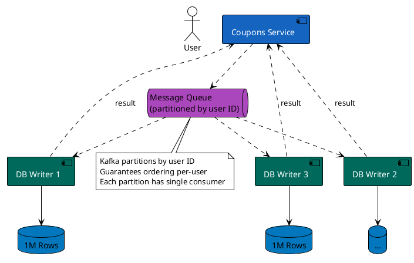

### Queue + Sharding Benefits

1. **Decoupled**: Services don't need to know about database shards
2. **Buffering**: Queue absorbs traffic spikes
3. **Ordering**: Kafka partitions guarantee per-user ordering
4. **Scalability**: Add partitions = add parallelism

### With In-Memory Cache

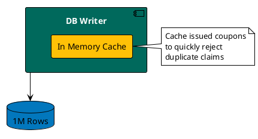

---

## 11. Final Architecture Summary

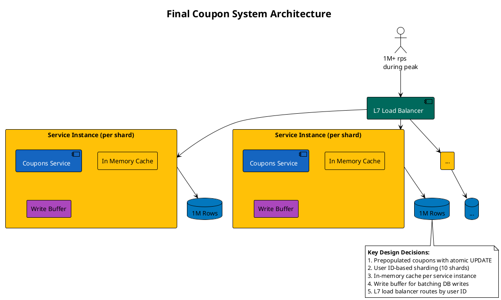

### Summary of Requirements

| Requirement | Solution |
|-------------|----------|
| 100M users | L7 load balancer + horizontal scaling |
| 10M coupons | Prepopulated in database |
| 10 minutes | Handle 1.2M rps peak with sharding |
| No over-issuance | Atomic UPDATE with WHERE user_uuid IS NULL |
| No duplicate claims | UNIQUE constraint on user_uuid + cache |
| High availability | Multiple service instances per shard |

### Key Takeaways

1. **Atomic operations beat locks**: Use database atomicity instead of application-level locking
2. **Prepopulation simplifies**: Creating coupons beforehand eliminates count-check races
3. **Sharding is essential**: No single database handles 1M+ writes/second
4. **Caching reduces load**: In-memory caches handle repeat requests instantly
5. **Fairness has trade-offs**: Perfect fairness adds complexity; accept small unfairness for simplicity

---

*Based on "Pragmatic System Design" by Alexey Soshin*