# System Design Decision Trees — Interview Edition

> Quick decision guides with **trade-offs, numbers, and clarifying questions** for system design interviews.

---

## How to Use This Document

**In an interview, don't jump to solutions.** Use the "Questions to Ask" sections to gather requirements first. The decision trees guide you AFTER you understand the constraints.

**Know the numbers.** Interviewers expect back-of-envelope calculations. Memorize the key figures in each section.

**Articulate trade-offs.** Every choice has downsides. Stating them proactively shows senior-level thinking.

---

## 1. Database Selection

### Questions to Ask First
- What's the read:write ratio?
- Do we need ACID transactions? Which operations?
- What's the expected data volume? (GB/TB/PB)
- What query patterns? Point lookups vs. range scans vs. full-text?
- What's the consistency requirement? Can we tolerate stale reads?
- Is the schema stable or evolving rapidly?

### Key Numbers to Know
| Database | Throughput | Latency | Max Storage |
|----------|-----------|---------|-------------|
| **PostgreSQL** | ~10K TPS | 1-5ms | ~10TB practical |
| **MySQL** | ~10K TPS | 1-5ms | ~10TB practical |
| **Redis** | ~100K ops/sec | <1ms | Limited by RAM |
| **DynamoDB** | ~100K+ ops/sec | <10ms | Unlimited |
| **MongoDB** | ~20K ops/sec | 1-5ms | ~100TB |
| **Cassandra** | ~50K+ writes/sec | 1-10ms | Petabytes |
| **Elasticsearch** | ~10K writes/sec | 10-100ms (search) | Petabytes |

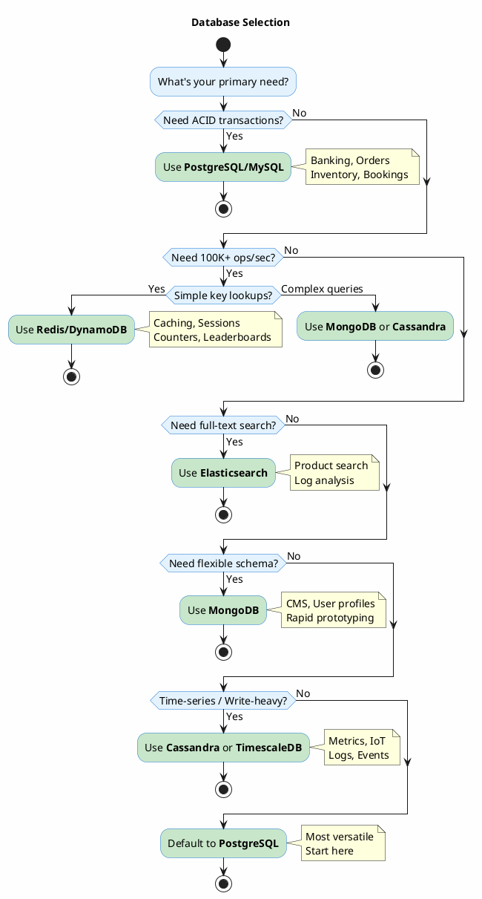

### Trade-offs Deep Dive

| Choice | Strengths | Weaknesses | When NOT to Use |
|--------|-----------|------------|-----------------|
| **PostgreSQL** | ACID, JSON support, mature ecosystem, extensions | Vertical scaling limits, complex sharding | >10TB data, >50K TPS needed |
| **Redis** | Sub-millisecond latency, data structures | RAM-limited, durability concerns | Primary data store, complex queries |
| **DynamoDB** | Unlimited scale, managed, predictable latency | Expensive at scale, limited query flexibility, vendor lock-in | Complex joins, ad-hoc queries |
| **MongoDB** | Flexible schema, horizontal scaling, aggregation pipeline | Weaker consistency by default, memory-hungry | Financial transactions, strict ACID |
| **Cassandra** | Linear write scaling, no single point of failure | Eventually consistent, no joins, operational complexity | Small datasets, need for ACID |
| **Elasticsearch** | Powerful full-text search, aggregations | Not a primary datastore, eventual consistency, resource-intensive | Primary storage, transactions |

### Implementation Notes
- **PostgreSQL sharding**: Use Citus extension or application-level sharding. Built-in partitioning for time-series.
- **Redis persistence**: RDB (snapshots) vs AOF (append-only). AOF safer but slower. Use both in production.
- **DynamoDB capacity**: On-demand vs provisioned. On-demand 5-7x more expensive but auto-scales.
- **MongoDB replica set**: Minimum 3 nodes. Primary handles writes, secondaries for reads.

---

## 2. Communication Protocol

### Questions to Ask First
- Who initiates communication? Client or server?
- Is it request-response or streaming?
- Do we need bidirectional communication?
- What's the latency requirement?
- Are there firewall/proxy constraints?
- Internal services or external/public API?

### Key Numbers to Know
| Protocol | Latency | Throughput | Connection Overhead |
|----------|---------|------------|---------------------|
| **REST/HTTP** | 10-100ms | ~10K req/sec per server | New connection per request (without keep-alive) |
| **gRPC** | 1-10ms | ~50K req/sec per server | Persistent connection, multiplexed |
| **WebSocket** | <10ms | ~100K msgs/sec per server | Single persistent connection |
| **SSE** | <100ms | ~10K clients per server | One-way, auto-reconnect |

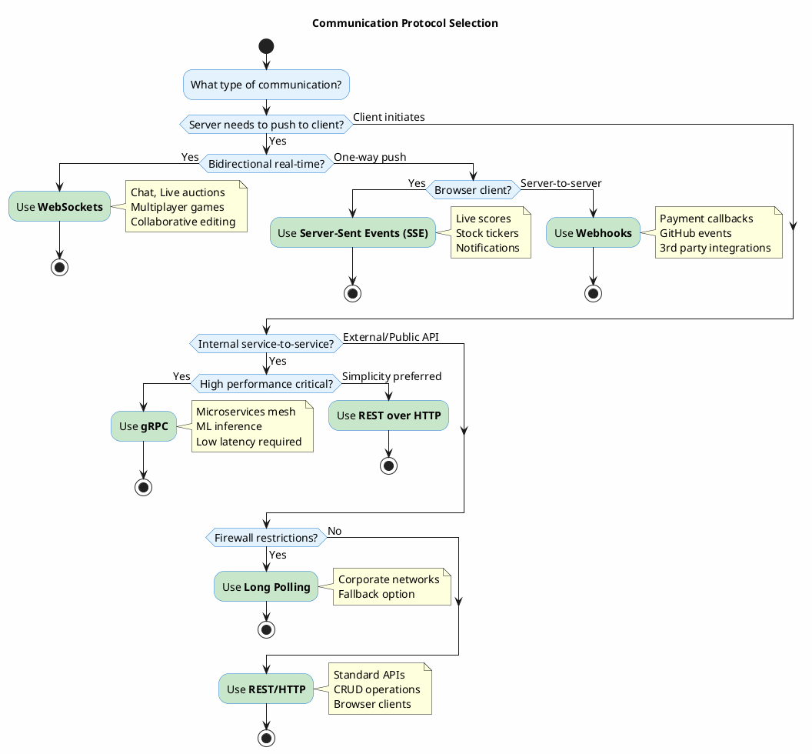

### Trade-offs Deep Dive

| Choice | Strengths | Weaknesses | When NOT to Use |
|--------|-----------|------------|-----------------|
| **REST** | Universal, cacheable, simple, great tooling | Chattier, no server push, overfetching | Real-time needs, high-frequency internal calls |
| **gRPC** | Fast (binary/HTTP2), streaming, strong typing | Harder to debug, limited browser support, steeper learning curve | Public APIs, simple CRUD |
| **WebSocket** | True bidirectional, low latency | Stateful (complicates scaling), no built-in retry | One-way communication, RESTful patterns |
| **SSE** | Simple, auto-reconnect, HTTP-based | One-way only, limited browser connections (~6 per domain) | Bidirectional needs, non-browser clients |
| **Webhooks** | Decoupled, async, simple | Delivery not guaranteed, security concerns, no backpressure | Real-time UI updates, synchronous needs |

### Implementation Notes
- **WebSocket scaling**: Use Redis Pub/Sub or Kafka to broadcast across server instances. Sticky sessions OR broadcast to all.
- **gRPC in Java**: Use `grpc-spring-boot-starter`. Define `.proto` files, generate stubs.
- **REST pagination**: Cursor-based > offset-based for large datasets. Include `next_cursor` in response.
- **Webhook reliability**: Implement retry with exponential backoff. Store events, process async. Signature verification (HMAC).

---

## 3. Caching Strategy

### Questions to Ask First
- What's the read:write ratio? (Caching helps when reads >> writes)
- What's the cache hit rate target? (90%? 99%?)
- Can we tolerate stale data? For how long?
- Is the data shared across instances or instance-local?
- What's the data size? Fits in memory?
- What's the eviction policy? LRU? TTL?

### Key Numbers to Know
| Cache Type | Latency | Throughput | Typical Use |
|------------|---------|------------|-------------|
| **L1/L2 CPU Cache** | ~1ns | - | JVM optimizations |
| **In-Process (Caffeine)** | ~100ns | millions/sec | Config, hot data |
| **Redis** | ~1ms | 100K ops/sec | Sessions, distributed cache |
| **Memcached** | ~1ms | 100K ops/sec | Simple K/V, multi-threaded |
| **CDN** | 10-50ms | unlimited | Static assets |

**Cache Math**: If DB query = 50ms, cache hit = 1ms, and hit rate = 95%, average latency = 0.95 × 1ms + 0.05 × 50ms = **3.45ms** (14x improvement)

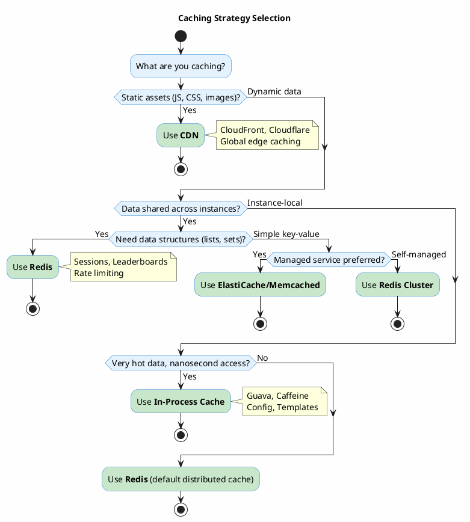

### Cache Pattern Selection

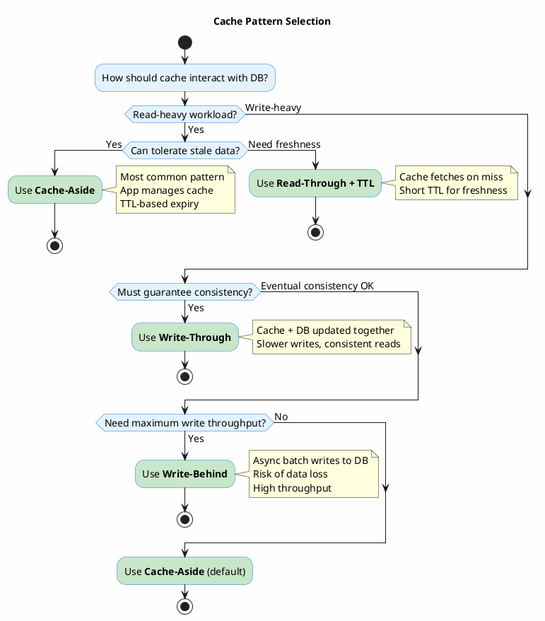

### Trade-offs Deep Dive

| Pattern | How It Works | Strengths | Weaknesses |
|---------|--------------|-----------|------------|
| **Cache-Aside** | App checks cache → miss → query DB → populate cache | Simple, resilient to cache failure | Cache miss = slow, stale data possible |
| **Read-Through** | Cache fetches from DB on miss automatically | Simpler app code | Cache becomes critical path |
| **Write-Through** | Write to cache + DB synchronously | Strong consistency | Write latency doubled |
| **Write-Behind** | Write to cache, async batch to DB | Fast writes, batching | Data loss risk if cache fails |
| **Refresh-Ahead** | Proactively refresh before expiry | No cache miss latency | Wasted refreshes for unused keys |

### Cache Invalidation Strategies
1. **TTL-based**: Simple, eventual consistency. Set TTL based on staleness tolerance.
2. **Event-driven**: Publish invalidation events on write. More complex but immediate.
3. **Version-based**: Include version in cache key. New version = new key.

### Implementation Notes (Java/Spring)
```java
// Caffeine in-process cache
@Bean
public CacheManager cacheManager() {
    CaffeineCacheManager manager = new CaffeineCacheManager();
    manager.setCaffeine(Caffeine.newBuilder()
        .maximumSize(10_000)
        .expireAfterWrite(Duration.ofMinutes(5))
        .recordStats());
    return manager;
}

// Spring Cache abstraction
@Cacheable(value = "users", key = "#userId")
public User getUser(String userId) { ... }

@CacheEvict(value = "users", key = "#user.id")
public void updateUser(User user) { ... }
```

---

## 4. Scaling Strategy

### Questions to Ask First
- What's the current bottleneck? (CPU, memory, I/O, network)
- What's the target scale? (users, requests/sec, data volume)
- Is the workload stateless or stateful?
- Can we partition the data/workload?
- What's the budget? (Vertical is simpler, horizontal is cheaper at scale)

### Key Numbers to Know
| Scaling Type | Limit | Cost Pattern | Complexity |
|--------------|-------|--------------|------------|
| **Vertical** | ~128 vCPU, 4TB RAM (cloud) | Exponential | Low |
| **Horizontal (stateless)** | Unlimited | Linear | Medium |
| **Database read replicas** | ~15 replicas (AWS RDS) | Linear | Medium |
| **Sharding** | Unlimited | Linear | High |

**Rule of Thumb**: Vertical scale until you hit $10K/month or cloud limits, then go horizontal.

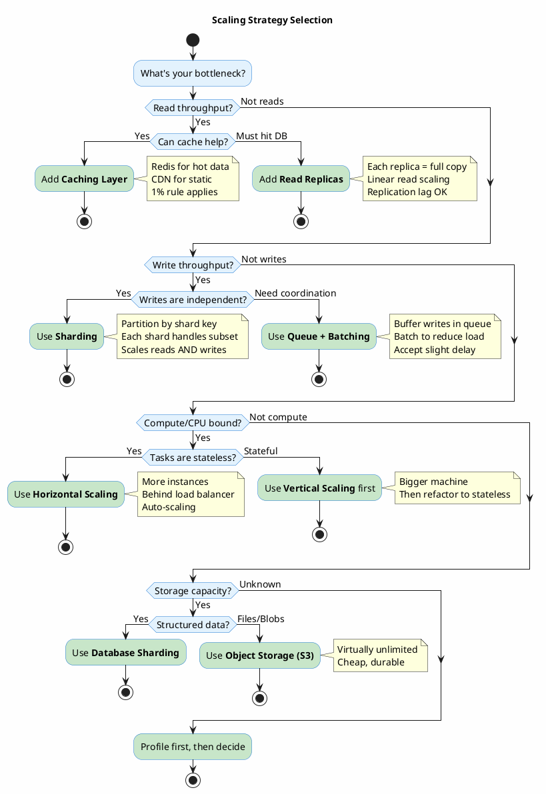

### Trade-offs Deep Dive

| Strategy | Strengths | Weaknesses | Operational Cost |
|----------|-----------|------------|------------------|
| **Vertical** | Simple, no code changes | Hard limits, single point of failure, expensive at top | Low |
| **Horizontal** | Unlimited scale, fault tolerant | Stateless requirement, complexity | Medium |
| **Read Replicas** | Easy to add, read scaling | Replication lag, doesn't help writes | Low-Medium |
| **Sharding** | Scales everything | Cross-shard queries hard, resharding painful | High |
| **Caching** | Huge latency improvement | Invalidation complexity, stale data | Medium |

### Capacity Planning Formula
```
Required instances = (Peak RPS × Avg Response Time) / (1000 × Target Utilization)

Example: 10,000 RPS, 100ms response, 70% target utilization
= (10,000 × 0.1) / (1 × 0.7) = 1,428 → ~15 instances (with buffer)
```

---

## 5. Sharding Strategy

### Questions to Ask First
- What's the shard key? (Must be in every query)
- Do you need cross-shard queries? (If yes, reconsider sharding)
- What's the expected data distribution?
- Will you need to add shards? How often?
- Any geographic or compliance requirements?

### Key Numbers to Know
- **Shard size sweet spot**: 100GB - 1TB per shard
- **Resharding cost**: Plan for 2-4x current capacity
- **Cross-shard query penalty**: 10-100x slower than single-shard

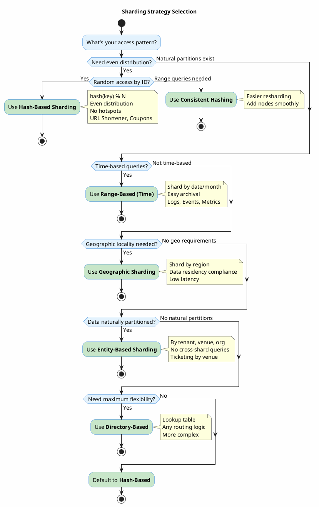

### Trade-offs Deep Dive

| Strategy | Distribution | Range Queries | Resharding | Best For |
|----------|--------------|---------------|------------|----------|
| **Hash-Based** | Even | Impossible | Hard (rehash all) | User data, random access |
| **Consistent Hashing** | Even | Impossible | Easy (minimal movement) | Caches, distributed systems |
| **Range-Based** | Uneven (hotspots) | Efficient | Medium | Time-series, logs |
| **Geographic** | By region | Within region | Easy | Global apps, compliance |
| **Directory-Based** | Configurable | Configurable | Easy | Complex routing needs |

### Consistent Hashing Implementation
```
Hash ring with virtual nodes:
- Each physical node → 100-200 virtual nodes
- hash(key) → find next clockwise node
- Adding node: only affects adjacent keys (~1/N data moved)
- Removing node: data moves to next clockwise node

Virtual nodes solve uneven distribution problem.
```

---

## 6. Concurrency Control

### Questions to Ask First
- What's the contention level? (Low: <1%, High: >10% conflicts)
- What's the cost of a failed operation? (Retry OK? Lost sale?)
- Do operations need strict ordering?
- Single database or distributed system?
- Is it a fixed inventory (tickets) or dynamic (likes)?

### Key Concepts
| Level | Contention | Strategy | Example |
|-------|------------|----------|---------|
| **Low** | <1% conflicts | Optimistic | User profile updates |
| **Medium** | 1-10% conflicts | Optimistic + retry | Shopping cart |
| **High** | >10% conflicts | Pessimistic or Queue | Flash sale, auction |
| **Critical** | Must not fail | Linearization | Ticket assignment |

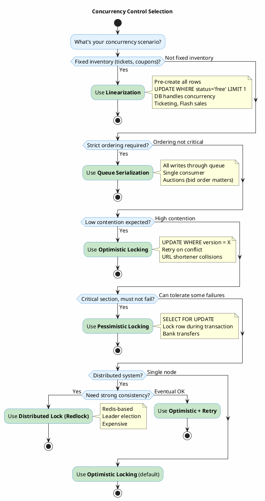

### Trade-offs Deep Dive

| Strategy | Throughput | Fairness | Complexity | Failure Mode |
|----------|------------|----------|------------|--------------|
| **Optimistic** | High | First to commit wins | Low | Retry storms under high contention |
| **Pessimistic** | Lower | Fair (FIFO) | Medium | Deadlocks, lock timeouts |
| **Linearization** | Highest | DB decides | Low | None (DB handles it) |
| **Queue Serialization** | Limited by consumer | Perfect (FIFO) | Medium | Queue backup |
| **Distributed Lock** | Lower | Depends | High | Split-brain, lock expiry |

### Implementation Patterns

**Optimistic Locking (JPA/Hibernate)**
```java
@Entity
public class Account {
    @Version
    private Long version;
    
    private BigDecimal balance;
}

// Throws OptimisticLockException on conflict
// Caller must catch and retry
```

**Pessimistic Locking**
```java
@Lock(LockModeType.PESSIMISTIC_WRITE)
@Query("SELECT a FROM Account a WHERE a.id = :id")
Account findByIdForUpdate(@Param("id") Long id);

// Blocks other transactions until commit/rollback
// Set timeout: @QueryHint(name = "javax.persistence.lock.timeout", value = "3000")
```

**Linearization for Tickets**
```sql
-- Pre-create all tickets with status='available'
-- Atomic claim:
UPDATE tickets 
SET status = 'claimed', user_id = ?, claimed_at = NOW()
WHERE event_id = ? AND status = 'available'
LIMIT 1;

-- If affected_rows = 1: success
-- If affected_rows = 0: sold out
```

---

## 7. Load Balancing

### Questions to Ask First
- Do you need to inspect HTTP content (headers, cookies, URLs)?
- Is session affinity required?
- Are servers homogeneous or different capacities?
- Single region or global distribution?
- What's the health check strategy?

### Key Numbers to Know
| Algorithm | When to Use | Overhead |
|-----------|-------------|----------|
| **Round Robin** | Homogeneous servers, stateless | Lowest |
| **Weighted Round Robin** | Mixed capacity servers | Low |
| **Least Connections** | Variable request durations | Medium |
| **IP Hash** | Session affinity needed | Low |
| **Consistent Hash** | Cache servers | Medium |

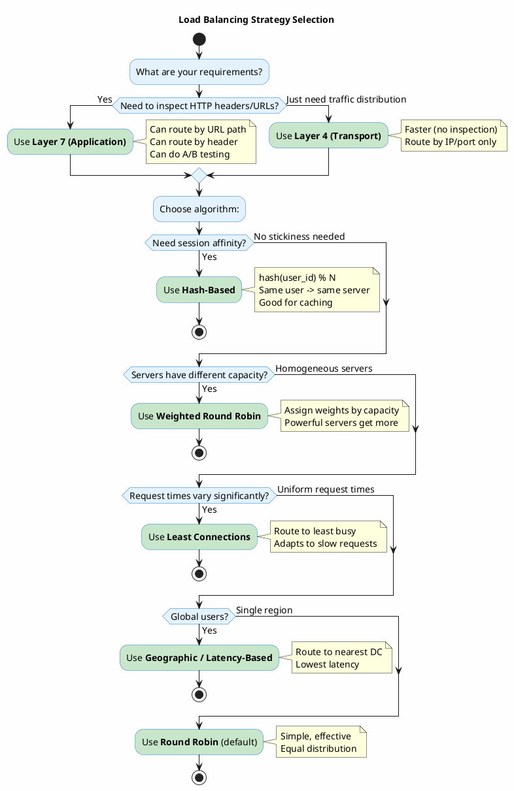

### Trade-offs Deep Dive

| Type | Latency | Features | Use Case |
|------|---------|----------|----------|
| **L4 (TCP/UDP)** | Lower (~1ms) | IP/port routing only | High throughput, simple routing |
| **L7 (HTTP)** | Higher (~5ms) | URL routing, header inspection, SSL termination | A/B testing, API routing |

### Health Check Strategies
1. **TCP Check**: Port open? (Fast but shallow)
2. **HTTP Check**: Returns 200? (Better but still shallow)
3. **Deep Health Check**: `/health` endpoint checks DB, cache, dependencies (Best but slower)

**Tip**: Use shallow checks frequently (5s), deep checks less often (30s).

---

## 8. Message Queue Selection

### Questions to Ask First
- Do you need message replay/audit trail?
- What's the throughput requirement?
- Is ordering important? (FIFO, per-partition, none)
- What's the delivery guarantee? (At-least-once, exactly-once)
- Complex routing needed?
- Managed service or self-hosted?

### Key Numbers to Know
| Queue | Throughput | Latency | Retention | Ordering |
|-------|------------|---------|-----------|----------|
| **Kafka** | 1M+ msgs/sec | 2-10ms | Days-forever | Per-partition |
| **RabbitMQ** | 20K msgs/sec | <1ms | Until consumed | Per-queue |
| **SQS** | Unlimited (managed) | 10-20ms | 14 days max | FIFO optional |
| **Redis Pub/Sub** | 100K+ msgs/sec | <1ms | None | None |

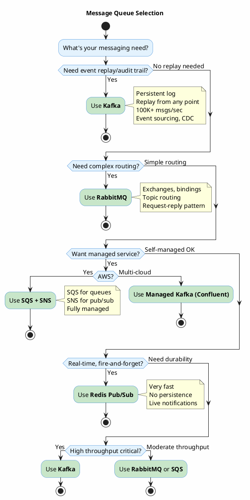

### Trade-offs Deep Dive

| Queue | Strengths | Weaknesses | Best For |
|-------|-----------|------------|----------|
| **Kafka** | Throughput, replay, scaling | Operational complexity, overkill for simple cases | Event streaming, CDC, analytics |
| **RabbitMQ** | Flexible routing, mature, low latency | Lower throughput, no replay | Task queues, RPC |
| **SQS** | Fully managed, scales infinitely | 256KB limit, no replay, AWS lock-in | Simple async jobs |
| **Redis Pub/Sub** | Blazing fast, simple | No persistence, no acknowledgment | Real-time notifications |

### Delivery Guarantees
| Guarantee | How | Trade-off |
|-----------|-----|-----------|
| **At-most-once** | Fire and forget | May lose messages |
| **At-least-once** | Ack after processing | May duplicate (idempotency required) |
| **Exactly-once** | Transactional producer + consumer | Complex, lower throughput |

**Rule**: Design for at-least-once + idempotent consumers. Exactly-once is rarely worth the cost.

---

## 9. Fan-Out Strategy (Social/Feed Systems)

### Questions to Ask First
- What's the follower distribution? (All similar vs. celebrities)
- What's the read:write ratio?
- How many followers does the average user have?
- What's the latency requirement for feed reads?
- Can feeds be slightly stale?

### Key Numbers to Know
| Strategy | Write Cost | Read Cost | Storage |
|----------|------------|-----------|---------|
| **Fan-Out on Write (Push)** | O(followers) | O(1) | High (timeline per user) |
| **Fan-Out on Read (Pull)** | O(1) | O(followees) | Low |
| **Hybrid** | O(regular followers) | O(celebrity followees) | Medium |

**Twitter Stats** (for reference):
- Average user: 200-500 followers
- Celebrities: 1M-100M followers
- Read:write ratio: ~300:1

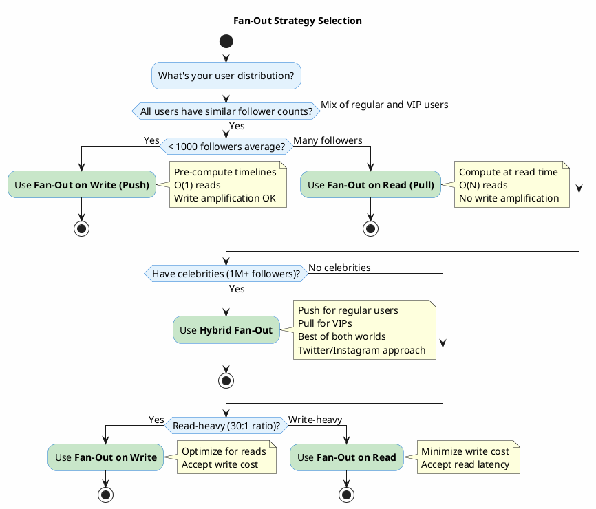

### Hybrid Fan-Out Implementation
```
On post:
1. Check if author is VIP (>10K followers)
2. If regular user:
   - Fan-out to all followers' timelines (async, via queue)
3. If VIP:
   - Store post in author's posts table only
   - Do NOT fan-out

On timeline read:
1. Fetch user's pre-computed timeline (from fan-out)
2. Fetch posts from followed VIPs (pull)
3. Merge and sort by timestamp
4. Cache the merged result (short TTL)
```

---

## 10. ID Generation

### Questions to Ask First
- Do IDs need to be sortable by time?
- Is coordination between services possible?
- What's the required uniqueness scope? (Per table, global, universal)
- Are there size constraints? (URL length, storage)
- Do you need to embed metadata (datacenter, type)?

### Key Numbers to Know
| Strategy | Size | Sortable | Coordination | Collisions |
|----------|------|----------|--------------|------------|
| **UUID v4** | 128-bit (36 chars) | No | None | ~10^-37 |
| **ULID** | 128-bit (26 chars) | Yes | None | Per-ms: 2^80 |
| **Snowflake** | 64-bit (19 digits) | Yes | Clock sync | None if configured right |
| **Auto-increment** | 64-bit | Yes | Single DB | None |

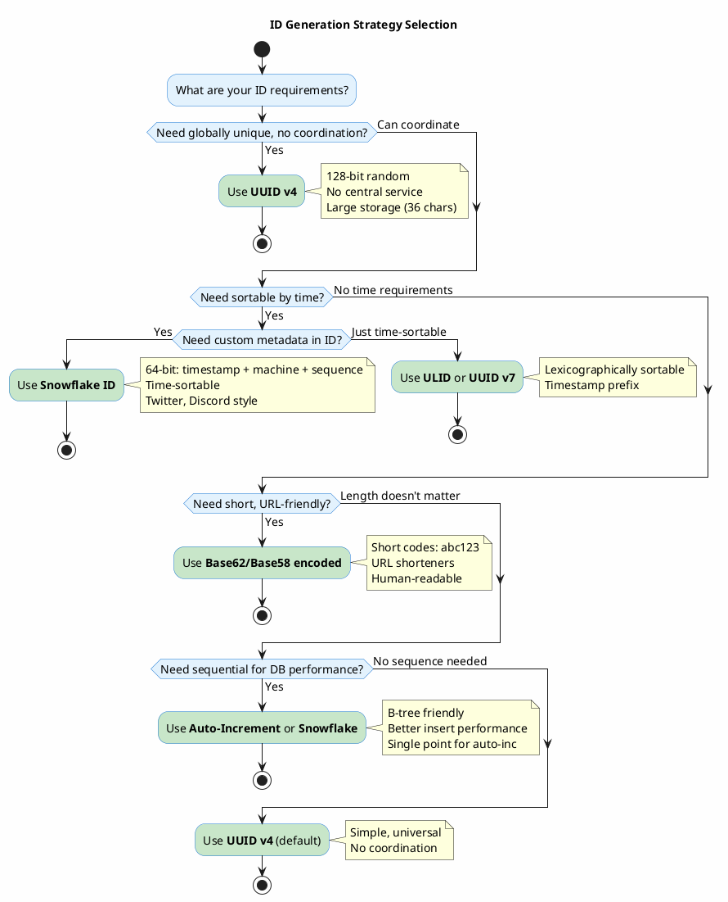

### Snowflake ID Structure
```
64 bits total:
┌────────────────────────────────────────────────────────────────────────────────┐
│ 0 │ 41 bits: timestamp (ms since epoch) │ 10 bits: machine │ 12 bits: sequence │
└────────────────────────────────────────────────────────────────────────────────┘

- Timestamp: ~69 years from custom epoch
- Machine ID: 1024 machines max (split: 5 datacenter + 5 machine)
- Sequence: 4096 IDs per machine per millisecond
- Total: 4M IDs/sec per datacenter

Implementation considerations:
- Clock skew: Reject if clock goes backward
- Machine ID assignment: Zookeeper, config, or derive from IP
```

### Trade-offs Deep Dive

| Strategy | Strengths | Weaknesses | When NOT to Use |
|----------|-----------|------------|-----------------|
| **UUID v4** | No coordination, universally unique | Large, not sortable, poor index locality | Need sorting, space-constrained |
| **Snowflake** | Sortable, compact, high throughput | Clock dependency, machine ID management | Simple systems, no sorting need |
| **ULID** | Sortable, no coordination, URL-safe | Slightly larger than Snowflake | Need custom metadata in ID |
| **Auto-increment** | Simple, compact, perfect sorting | Single point of failure, predictable | Distributed systems, security-sensitive |

---

## 11. Consistency Model

### Questions to Ask First
- What happens if a user sees stale data? (Annoying? Costly? Dangerous?)
- Is this financial/transactional data?
- Single region or multi-region deployment?
- What's more important: availability or consistency?
- Can the application handle conflicts?

### CAP Theorem Refresher
```
You can only have 2 of 3:
- Consistency: All nodes see the same data at the same time
- Availability: Every request gets a response
- Partition tolerance: System works despite network failures

In distributed systems, partitions WILL happen, so you choose:
- CP: Consistency + Partition tolerance (refuse requests during partition)
- AP: Availability + Partition tolerance (serve stale data during partition)
```

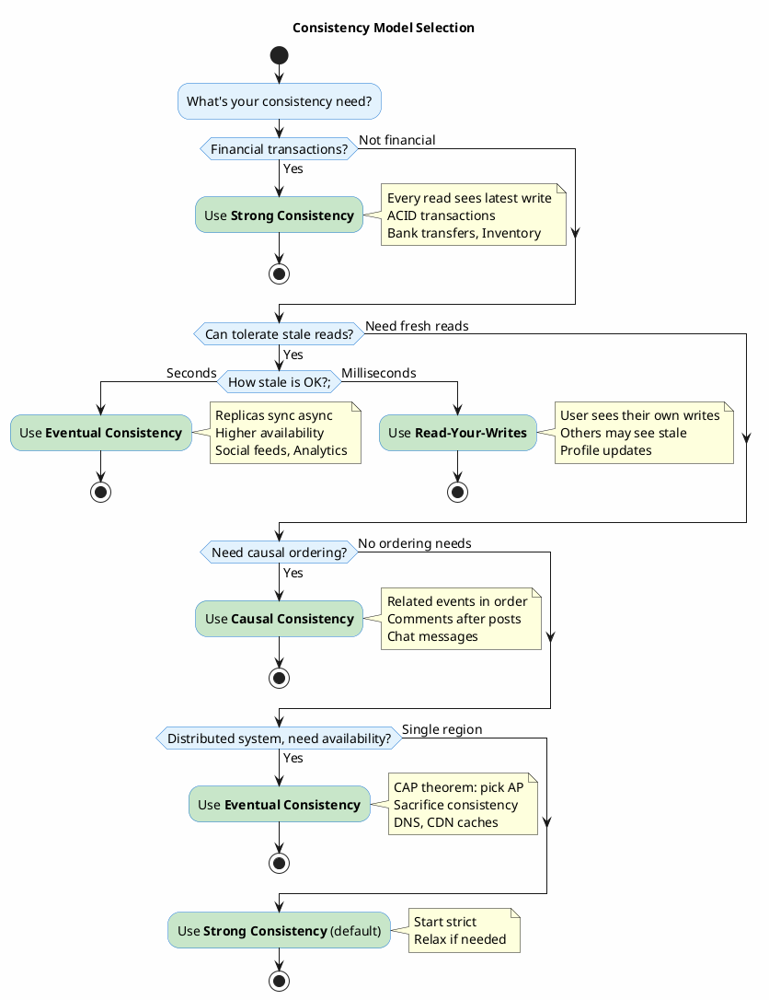

### Consistency Levels Explained

| Level | Guarantee | Latency | Use Case |
|-------|-----------|---------|----------|
| **Strong** | Latest write always visible | Higher | Banking, inventory |
| **Read-Your-Writes** | User sees their own writes | Medium | Profile updates |
| **Monotonic Reads** | Never see older data than before | Medium | Dashboard |
| **Causal** | Causally related ops in order | Medium | Comments, chat |
| **Eventual** | Will converge eventually | Lowest | Social feeds, analytics |

### Implementation Patterns

**Read-Your-Writes in Practice**:
```
Option 1: Sticky sessions
- Route user to same replica
- Simple but limits scaling

Option 2: Read from primary after write
- Write → set flag → read from primary for X seconds
- Falls back to replica after

Option 3: Version vectors
- Track version user has seen
- Read from replica only if version >= seen version
```

---

## 12. Authentication & Authorization

### Questions to Ask First
- First-party auth or delegating to third party (Google, etc.)?
- Stateless API or traditional web app?
- Do you need token revocation?
- Machine-to-machine or user-facing?
- What's the session duration?

### Key Concepts
| Term | Meaning |
|------|---------|
| **Authentication (AuthN)** | Who are you? (Identity verification) |
| **Authorization (AuthZ)** | What can you do? (Permissions) |
| **OAuth 2.0** | Authorization framework (delegation) |
| **OIDC** | OAuth 2.0 + identity layer |
| **JWT** | Self-contained token format |

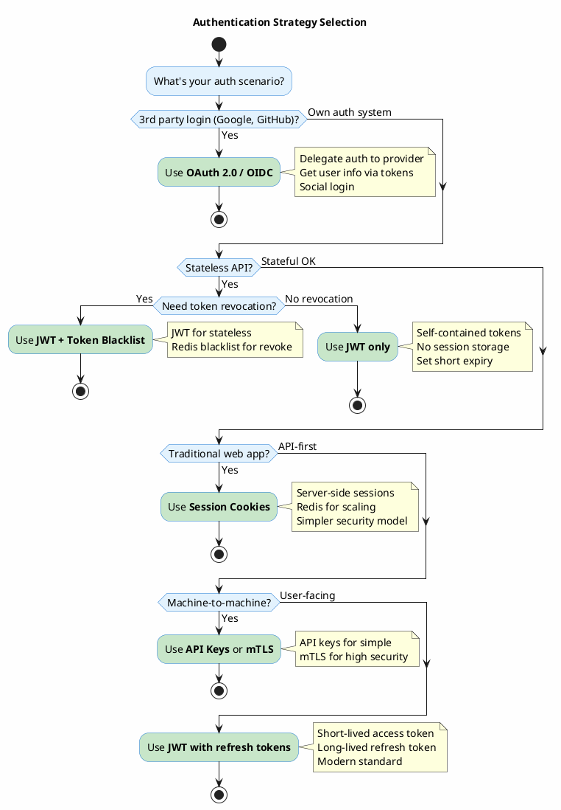

### JWT Structure
```
Header.Payload.Signature

Header: {"alg": "RS256", "typ": "JWT"}
Payload: {
  "sub": "user123",        // Subject (user ID)
  "iat": 1699900000,       // Issued at
  "exp": 1699903600,       // Expiration (1 hour)
  "roles": ["user", "admin"]
}
Signature: HMAC-SHA256(base64(header) + "." + base64(payload), secret)

Typical lifetimes:
- Access token: 15 min - 1 hour
- Refresh token: 7 - 30 days
```

### Trade-offs Deep Dive

| Strategy | Strengths | Weaknesses | Best For |
|----------|-----------|------------|----------|
| **Session Cookies** | Simple revocation, smaller payload | Server storage, scaling complexity | Traditional web apps |
| **JWT only** | Stateless, scalable | Can't revoke until expiry | Short-lived tokens, microservices |
| **JWT + Blacklist** | Revocable + stateless benefits | Blacklist check on every request | APIs needing revocation |
| **OAuth 2.0/OIDC** | Delegate to experts, social login | Complexity, dependency on provider | Consumer apps |
| **API Keys** | Simple, no expiry | Can't scope permissions easily | Internal services, simple cases |

---

## 13. Rate Limiting (BONUS)

### Questions to Ask First
- What resource are you protecting? (API, DB, downstream service)
- Per user, per IP, or global?
- Hard limit or soft (allow burst)?
- What happens when limit exceeded? (429, queue, degrade)

### Key Algorithms

| Algorithm | Behavior | Memory | Burst Handling |
|-----------|----------|--------|----------------|
| **Token Bucket** | Smooth + allows burst | O(1) per key | Good |
| **Leaky Bucket** | Perfectly smooth | O(1) per key | None |
| **Fixed Window** | Simple, boundary spikes | O(1) per key | Poor |
| **Sliding Window Log** | Accurate | O(N) per key | Good |
| **Sliding Window Counter** | Accurate, efficient | O(1) per key | Good |

### Token Bucket Implementation
```
Each user has a bucket:
- capacity: max tokens (burst size)
- tokens: current tokens
- refill_rate: tokens added per second
- last_refill: timestamp

On request:
1. Refill tokens based on time elapsed
2. If tokens >= 1: allow, decrement
3. Else: reject (429)

Redis implementation:
EVAL "
  local tokens = redis.call('get', KEYS[1])
  local last = redis.call('get', KEYS[2])
  -- refill logic
  -- check and decrement
" 2 bucket:user123:tokens bucket:user123:last
```

---

## Quick Reference Table

| Decision | Default Choice | When to Change |
|----------|---------------|----------------|
| **Database** | PostgreSQL | 100K+ ops/s → Redis; Flexible schema → MongoDB |
| **Protocol** | REST | Real-time → WebSockets; Internal → gRPC |
| **Cache** | Redis | Static assets → CDN; Hot config → Local |
| **Scaling** | Horizontal | Write bottleneck → Sharding |
| **Sharding** | Hash-based | Natural partitions → Entity-based |
| **Concurrency** | Optimistic | Fixed inventory → Linearization; Ordering → Queue |
| **Load Balancer** | Round Robin | Session affinity → Hash-based |
| **Queue** | SQS/RabbitMQ | Event sourcing → Kafka |
| **Fan-Out** | Push | VIPs present → Hybrid |
| **ID Generation** | UUID v4 | Time-sortable → Snowflake; Short → Base62 |
| **Consistency** | Strong | High availability → Eventual |
| **Auth** | JWT | Revocation needed → JWT + Blacklist |
| **Rate Limiting** | Token Bucket | Smooth output → Leaky Bucket |

---

## Back-of-Envelope Cheat Sheet

### Data Size Estimates
| Type | Size |
|------|------|
| UUID | 36 bytes (string) / 16 bytes (binary) |
| Timestamp | 8 bytes |
| Integer ID | 8 bytes |
| Short URL (7 chars) | 7 bytes |
| Tweet-like text | ~200 bytes |
| User profile (JSON) | ~1 KB |
| Image metadata | ~500 bytes |
| Image file | ~200 KB - 2 MB |

### Throughput Rules of Thumb
| Component | Capacity |
|-----------|----------|
| Single web server | 1K-10K RPS |
| PostgreSQL | 10K TPS |
| Redis | 100K ops/sec |
| Kafka partition | 10K msgs/sec |
| SSD random read | 100K IOPS |
| 1 Gbps network | 100 MB/s |

### Time Conversions
| Unit | Seconds |
|------|---------|
| 1 day | 86,400 |
| 1 week | 604,800 |
| 1 month | 2.6M |
| 1 year | 31.5M |

### Scale Estimates
| Metric | Value |
|--------|-------|
| 1M users, 10% DAU | 100K DAU |
| 100K DAU, 10 requests each | 1M requests/day |
| 1M requests/day | ~12 RPS average, ~100 RPS peak |
| 1 billion requests/month | ~400 RPS average |

---

*Enhanced for interview preparation. Based on patterns from URL Shortener, News Feed, Ticketing, Auction, Coupon, and Web Crawler system designs.*
