# System Design Decision Trees

> Quick decision guides for common system design choices.

---

## 1. Database Selection

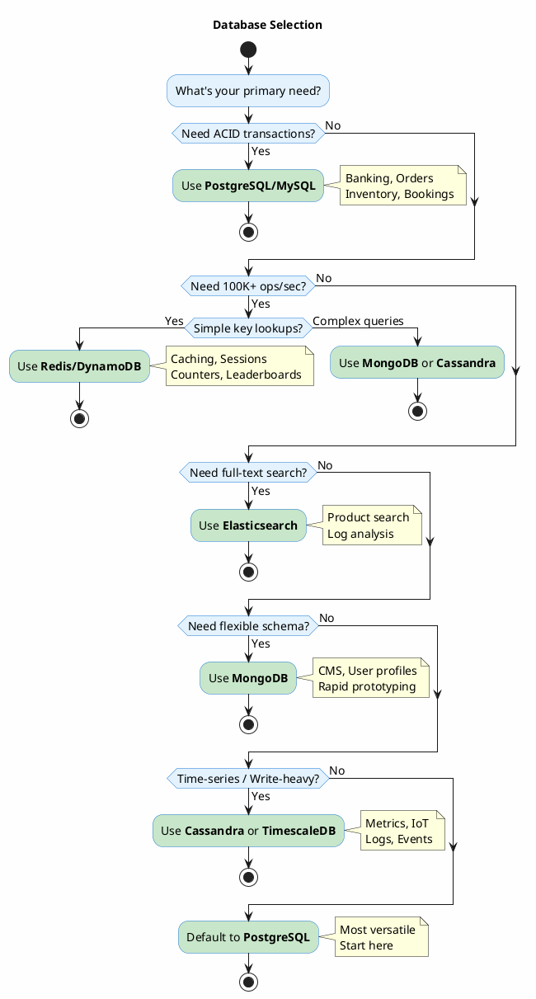

---

## 2. Communication Protocol

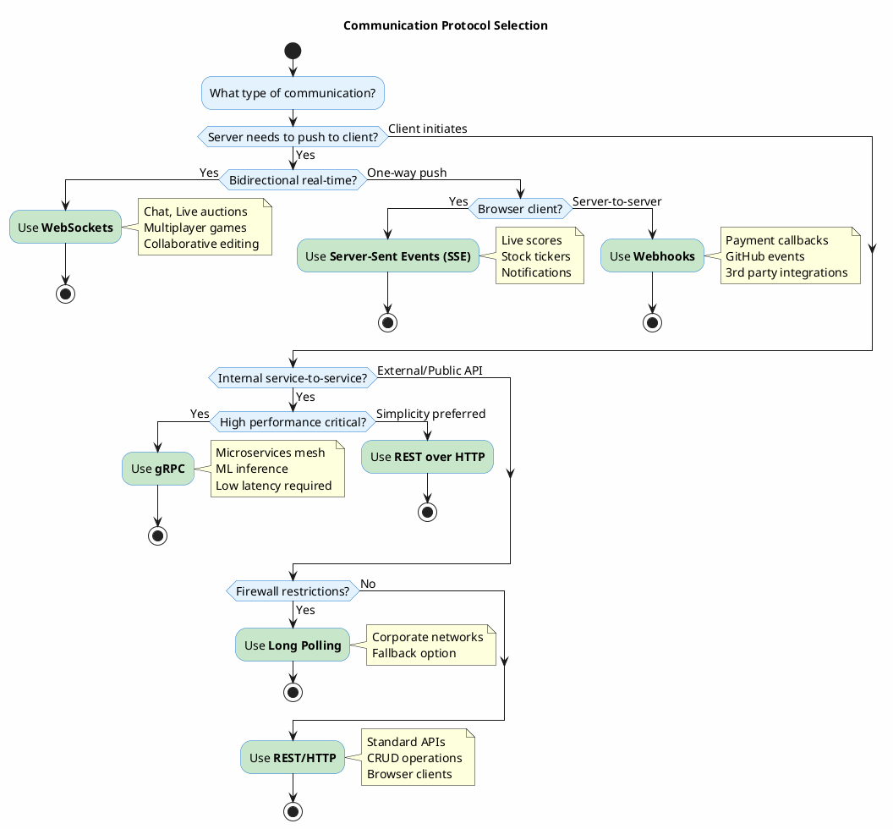

---

## 3. Caching Strategy

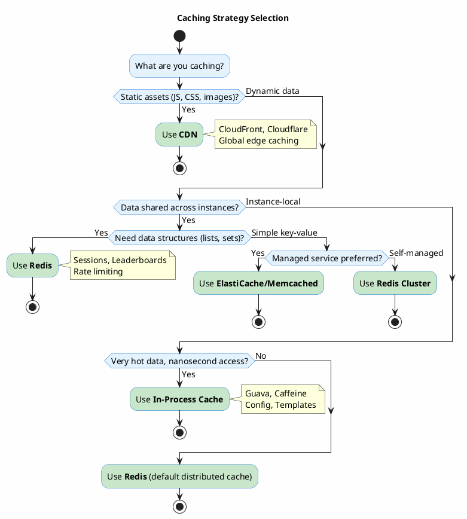

### Cache Pattern Selection

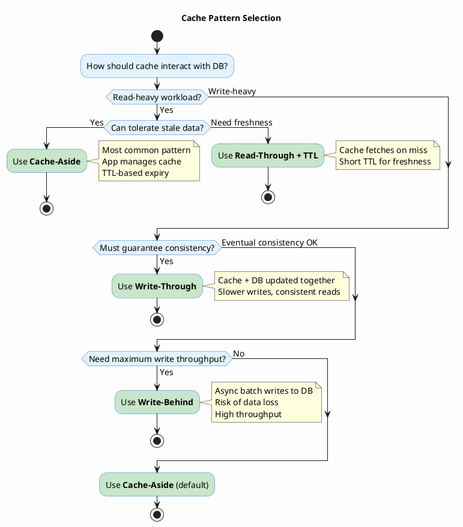

---

## 4. Scaling Strategy

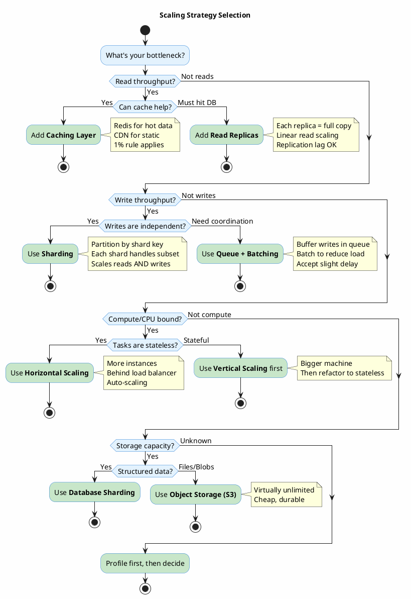

---

## 5. Sharding Strategy

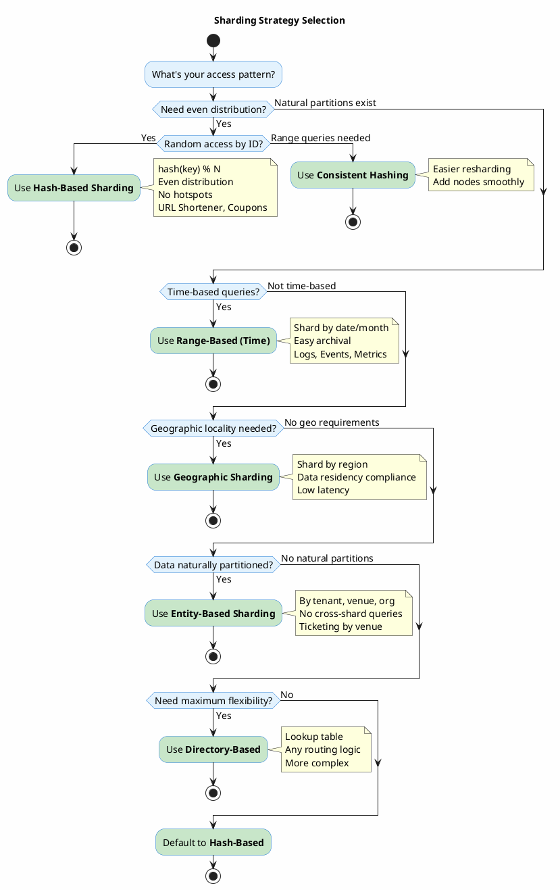

---

## 6. Concurrency Control

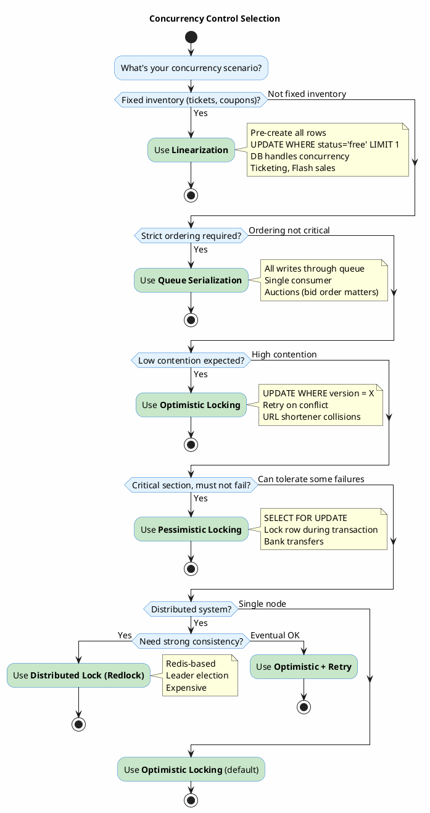

---

## 7. Load Balancing

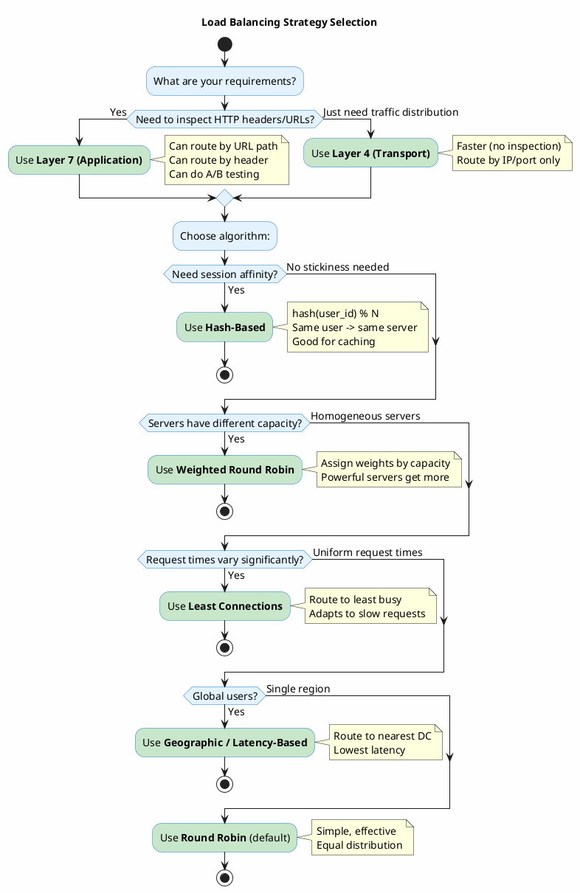

---

## 8. Message Queue Selection

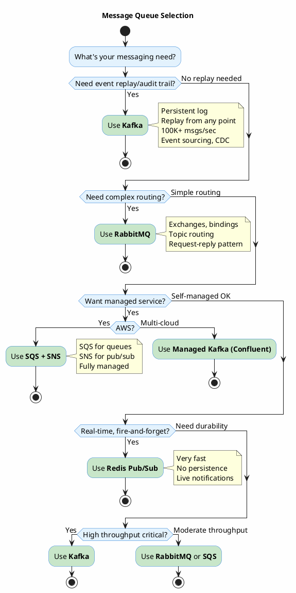

---

## 9. Fan-Out Strategy (Social/Feed Systems)

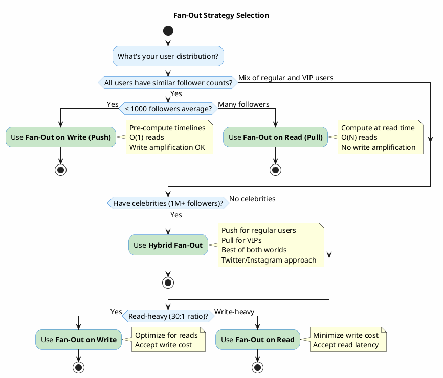

---

## 10. ID Generation

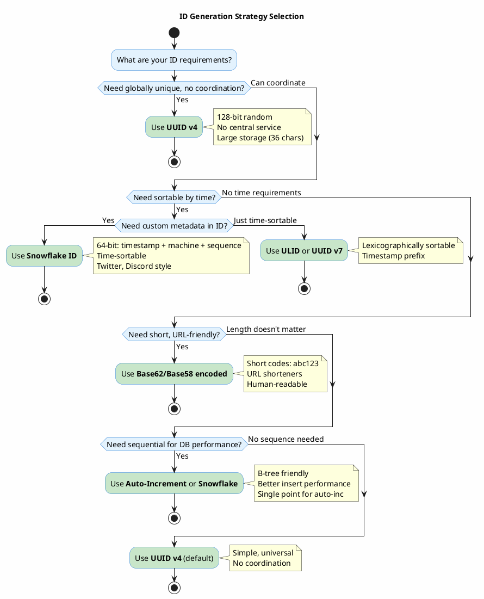

---

## 11. Consistency Model

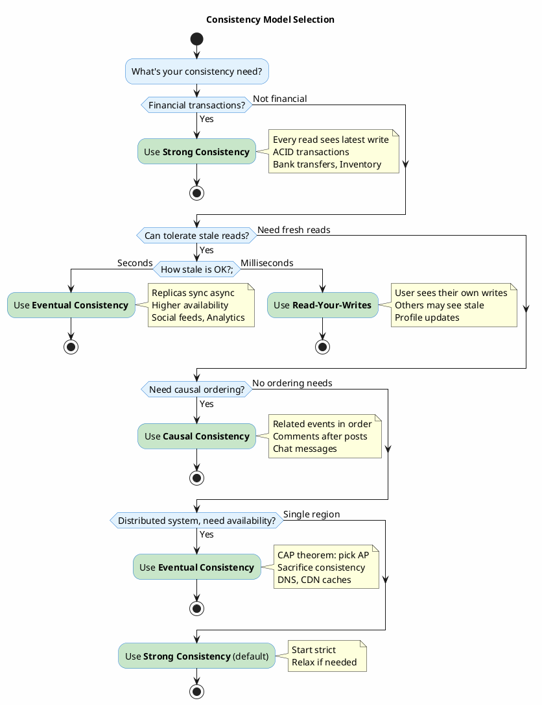

---

## 12. Authentication & Authorization

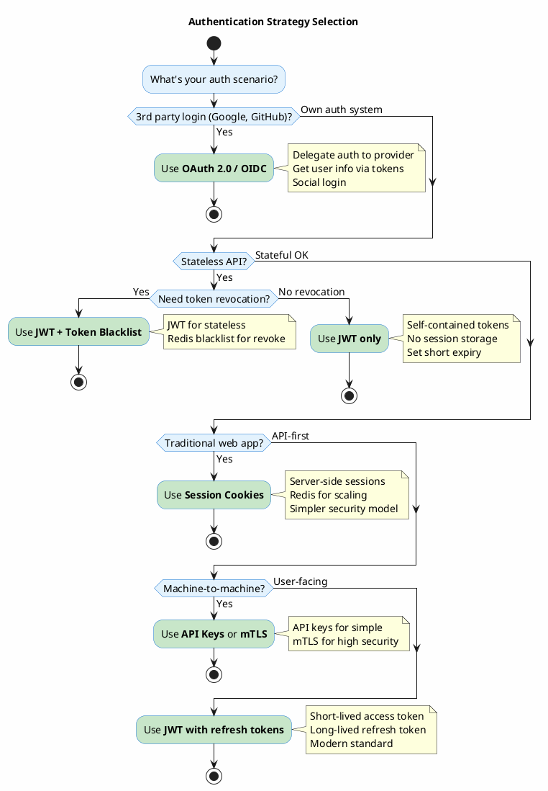

---

## Quick Reference Table

| Decision | Default Choice | When to Change |
|----------|---------------|----------------|
| **Database** | PostgreSQL | 100K+ ops/s → Redis; Flexible schema → MongoDB |
| **Protocol** | REST | Real-time → WebSockets; Internal → gRPC |
| **Cache** | Redis | Static assets → CDN; Hot config → Local |
| **Scaling** | Horizontal | Write bottleneck → Sharding |
| **Sharding** | Hash-based | Natural partitions → Entity-based |
| **Concurrency** | Optimistic | Fixed inventory → Linearization; Ordering → Queue |
| **Load Balancer** | Round Robin | Session affinity → Hash-based |
| **Queue** | SQS/RabbitMQ | Event sourcing → Kafka |
| **Fan-Out** | Push | VIPs present → Hybrid |
| **ID Generation** | UUID v4 | Time-sortable → Snowflake; Short → Base62 |
| **Consistency** | Strong | High availability → Eventual |
| **Auth** | JWT | Revocation needed → JWT + Blacklist |

---

*Based on patterns from URL Shortener, News Feed, Ticketing, Auction, Coupon, and Web Crawler system designs.*
