# News Feed System Design

## Table of Contents
1. [Introduction](#introduction)
2. [Requirements Gathering](#requirements-gathering)
3. [Back-of-Envelope Calculations](#back-of-envelope-calculations)
4. [Basic Design](#basic-design)
5. [Database Schema](#database-schema)
6. [Scaling Reads](#scaling-reads)
7. [Storage Architecture](#storage-architecture)
8. [Feed Optimization with Fan-Out](#feed-optimization-with-fan-out)
9. [The VIP/Celebrity Problem](#the-vipcelebrity-problem)
10. [Final Architecture](#final-architecture)

---

## Introduction

A **News Feed** is a core feature of social media platforms like Twitter, Facebook, and Instagram. When a user posts content, that content needs to appear in the feeds of all their followers. This seemingly simple requirement becomes extremely complex at scale.

### How News Feed Works

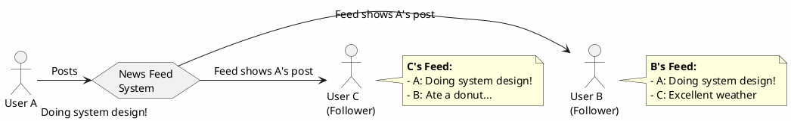

The challenge is delivering these updates to potentially millions of followers with low latency while handling massive read and write volumes.

---

## Requirements Gathering

Before designing, we need to clarify the scale and constraints. The key questions to ask:

| Question | Answer | Impact |
|----------|--------|--------|
| How many new tweets per second? | **10,000 tweets/sec** | Determines write throughput |
| What's the read-to-write ratio? | **30:1** | Reads dominate; optimize for reads |
| Average followers per user? | **100 followers** | Affects fan-out calculations |
| Maximum followers per user? | **1 million followers** | Introduces VIP/celebrity problem |

### Derived Metrics

- **Write throughput**: 10K tweets/second
- **Read throughput**: 10K × 30 = **300K reads/second**
- **Timeline writes per second** (fan-out): 10K × 100 = **1M timeline updates/second**

---

## Back-of-Envelope Calculations

### Tweet Volume

```
10K tweets/second × 60 = 600K tweets/minute
600K tweets/minute × 60 = 36M tweets/hour
36M tweets/hour × 24 = 864M tweets/day
```

### Storage Requirements

Assuming **100 bytes per tweet** (user_id, message, timestamp):

```
Daily:   864M × 100 bytes = 86.4 GB/day
Yearly:  86.4 GB × 365 = ~31 TB/year
```

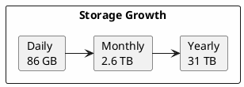

---

## Basic Design

### Tweet Creation Flow

When a user posts a tweet, it's stored in the database:

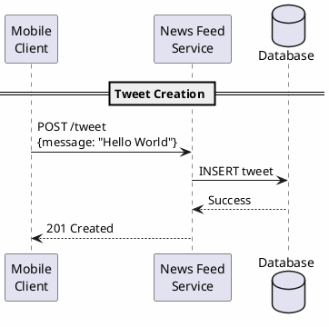

### Feed Retrieval Flow (Naive Approach)

Followers poll for updates periodically:

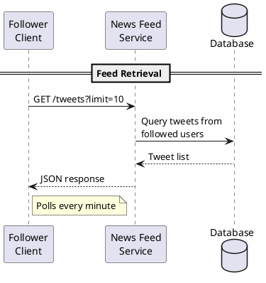

**Problem**: This approach requires complex queries joining tweets with follows for every read request - 300K times per second!

---

## Database Schema

### Tweets Table

| Column | Type | Description |
|--------|------|-------------|
| user_id | BIGINT | Author of the tweet |
| message | VARCHAR(280) | Tweet content |
| timestamp | DATETIME | When tweet was created |

### Follows Table

| Column | Type | Description |
|--------|------|-------------|
| source_id | BIGINT | User who follows |
| target_id | BIGINT | User being followed |

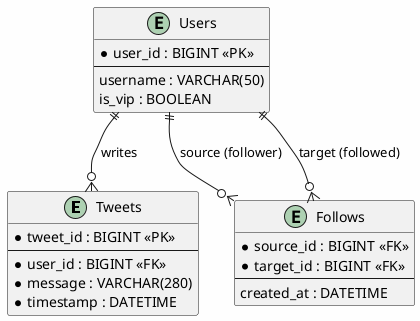

---

## Scaling Reads

With 300K reads per second, a single database won't suffice. Let's evaluate our options:

### Option 1: Read Replicas

```
300K reads/second ÷ 20K reads/replica = 15 replicas
300K reads/second ÷ 50K reads/replica = 6 replicas
```

| Pros | Cons |
|------|------|
| Simple architecture | High cost (full data copies) |
| Easy to implement | High space requirements |
| Strong consistency | Replication lag |

**Verdict**: Not ideal due to cost and space requirements.

### Option 2: Sharding

```
300K reads/second ÷ 10K reads/shard = 30 shards
300K reads/second ÷ 25K reads/shard = 12 shards
```

With 30TB of data:
- 30 shards → 1TB per shard
- 12 shards → 3TB per shard

| Pros | Cons |
|------|------|
| Less costly than replicas | Architectural complexity |
| Each shard is smaller | Cross-shard queries are hard |
| Scales horizontally | Resharding is painful |

### Option 3: Caching (Recommended)

```
300K reads/second ÷ 100K reads/instance = 3 Redis instances
```

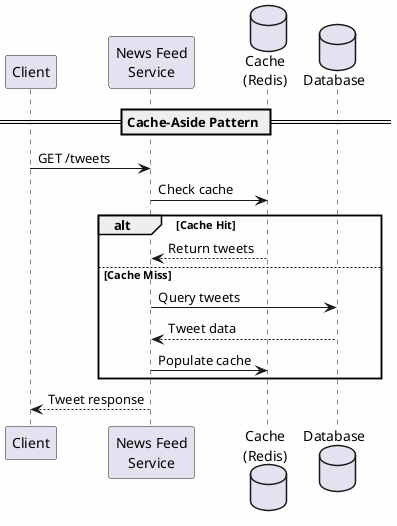

| Pros | Cons |
|------|------|
| Fewest instances needed | More complex than replicas |
| Sub-millisecond reads | Cache invalidation challenges |
| Cost effective | Data consistency concerns |

**Verdict**: Caching is the best option for this read-heavy workload.

---

## Storage Architecture

### Short-Term vs Long-Term Storage

Most users only care about recent tweets (last 5 days). We can optimize by separating hot and cold data:

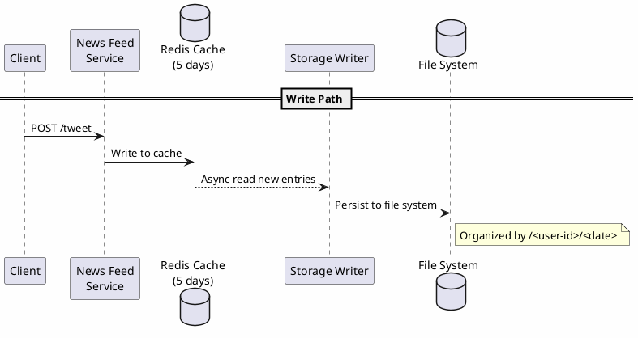

### Cache Configuration

- **Cache size**: 86GB/day × 5 days = ~430GB hot data
- **Cluster**: 3 instances × 32GB = 96GB (storing ~1% hot data)
- **File system**: Long-term storage organized by `/<user-id>/<date>`

---

## Feed Optimization with Fan-Out

### The Problem with Pull-Based Feeds

When User A requests their feed:
1. Query Follows DB: "Who does A follow?"
2. For each followed user, query their tweets
3. Merge and sort all tweets
4. Apply limit/offset

**Issue**: More people you follow = more cache requests per feed load.

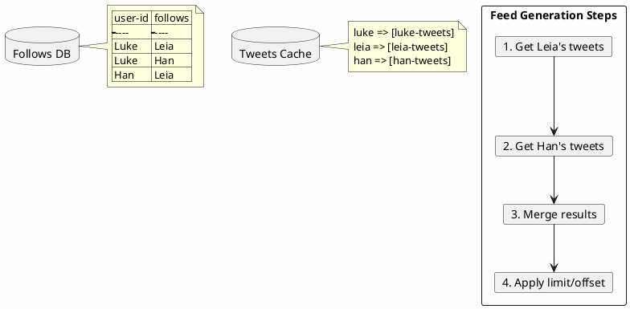

### Fan-Out on Write (Push Model)

Instead of computing feeds on read, **pre-compute them on write**:

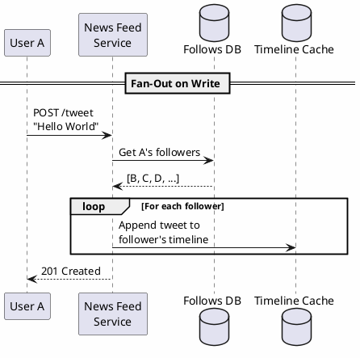

### Pre-Computed Timelines

After fan-out, each user's timeline is pre-built:

| User | Timeline Cache |
|------|---------------|
| Luke | [leia-tweets, han-tweets] |
| Han | [leia-tweets] |
| Leia | [] |

**Result**: **100x read optimization** on average! Instead of N cache lookups (one per followed user), just 1 lookup for the pre-computed timeline.

---

## The VIP/Celebrity Problem

### The Problem

With fan-out on write, a single VIP tweet triggers massive writes:

```
Normal load:
  10,000 tweets/sec × 100 followers = 1,000,000 timeline writes/sec

VIP with 1M followers posts:
  1 tweet × 1,000,000 followers = 1,000,000 timeline writes
  = 2x spike instantly!
```

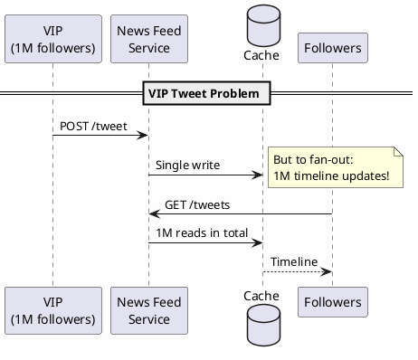

### VIP Statistics

According to Wikipedia, only **25 accounts** have more than 50M followers (as of 2021). VIPs are rare but impactful.

### Solution: Hybrid Fan-Out

Use **different strategies** for regular users vs VIPs:

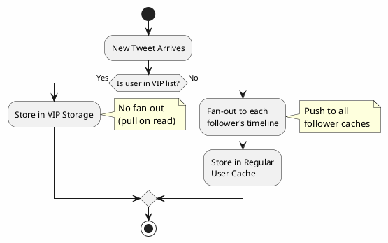

### Hybrid Feed Generation

When a user requests their feed:

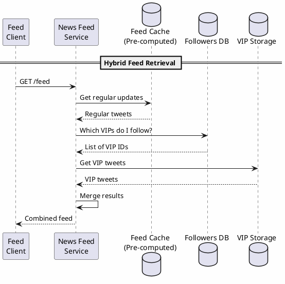

---

## Final Architecture

The complete News Feed system combines all optimization strategies:

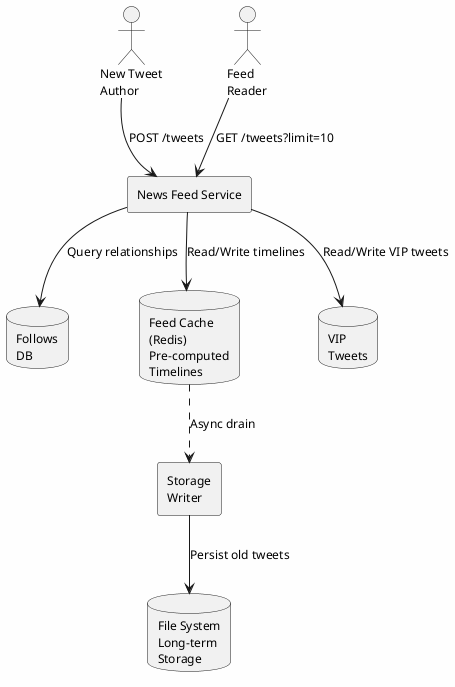

### Component Summary

| Component | Purpose | Technology |
|-----------|---------|------------|
| News Feed Service | API gateway, business logic | Stateless microservice |
| Follows DB | User relationships | PostgreSQL/MySQL (sharded) |
| Feed Cache | Pre-computed timelines | Redis Cluster |
| VIP Tweets | Celebrity content (pull-based) | Redis/Cassandra |
| Storage Writer | Async persistence | Background workers |
| File System | Long-term archive | S3/HDFS |

### Key Design Decisions

1. **Fan-out on write** for regular users (optimize reads)
2. **Fan-out on read** for VIPs (avoid write amplification)
3. **Tiered storage**: Hot data in cache, cold data in file system
4. **Caching over sharding** for read scalability
5. **Pre-computed timelines** for 100x read optimization

---

## Key Takeaways

| Challenge | Solution |
|-----------|----------|
| 300K reads/second | Redis cache cluster (3 instances) |
| 31TB/year storage | Tiered storage (cache + file system) |
| Feed computation cost | Pre-computed timelines (fan-out on write) |
| VIP spike problem | Hybrid fan-out (push for regular, pull for VIP) |
| Data freshness | Polling every minute + eventual consistency |

### Trade-offs Accepted

- **Eventual consistency**: Timelines may lag slightly behind
- **Complexity**: Hybrid approach adds architectural overhead
- **Storage duplication**: Same tweet stored in multiple timelines

This design handles Twitter-scale load while remaining cost-effective and maintainable.
