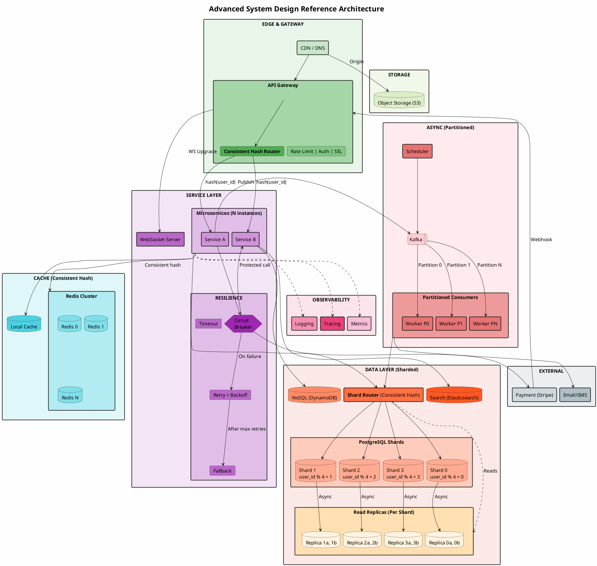
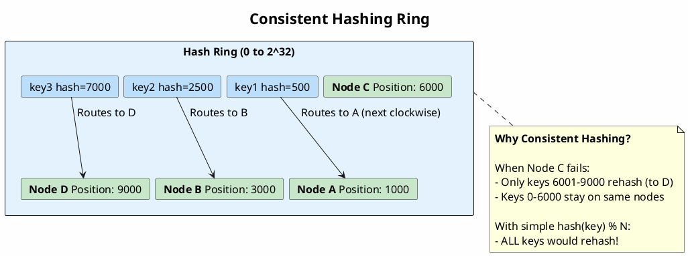
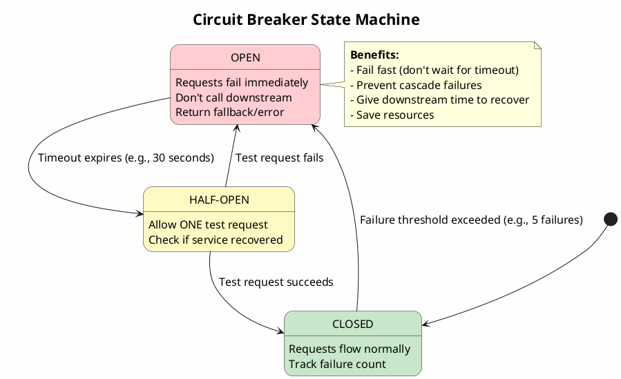
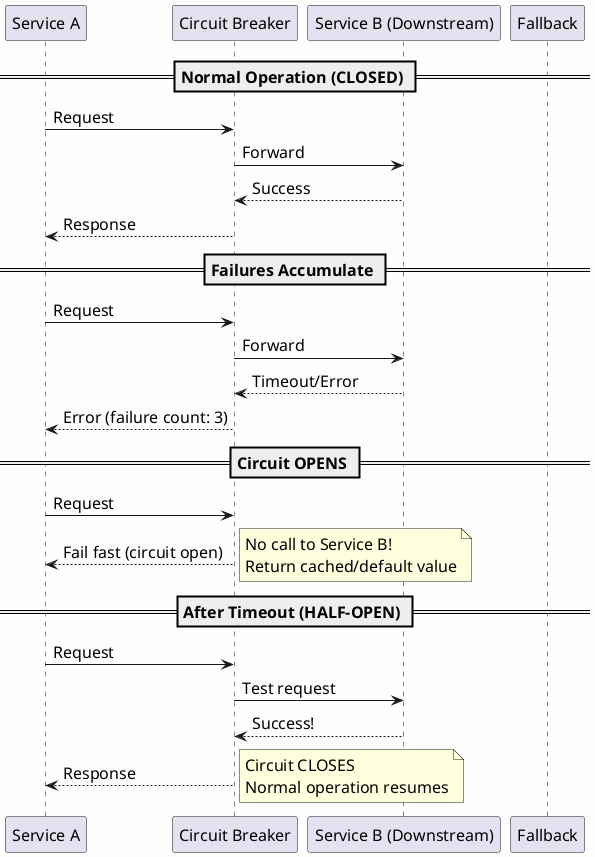
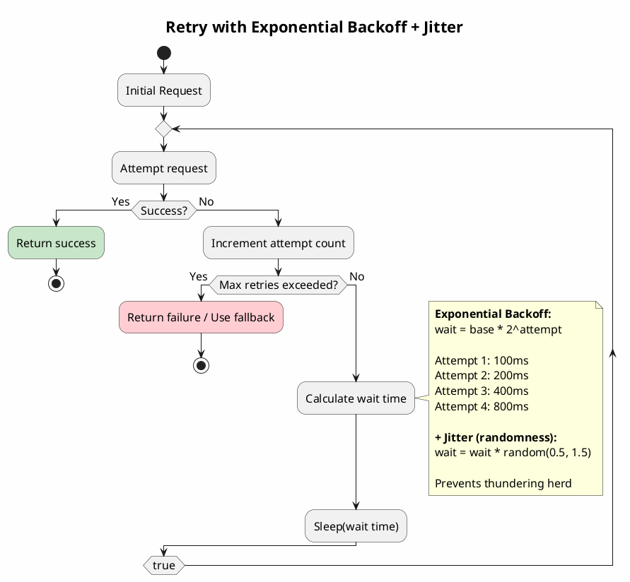
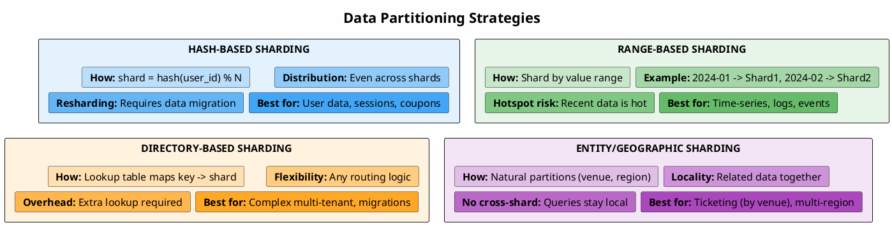
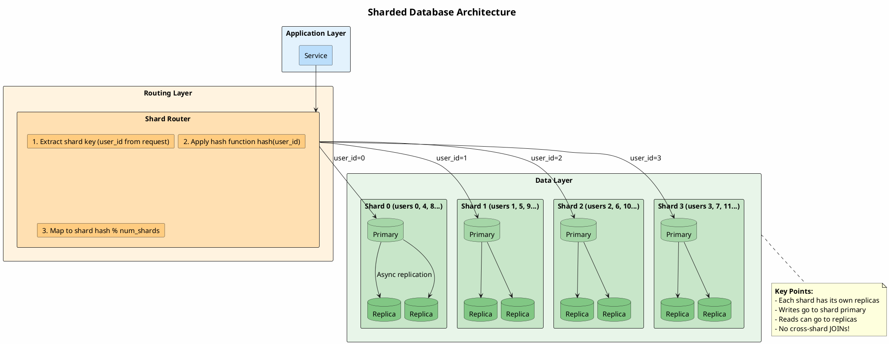
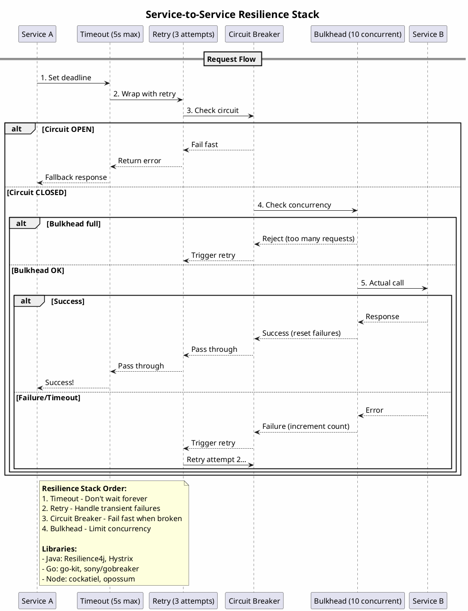
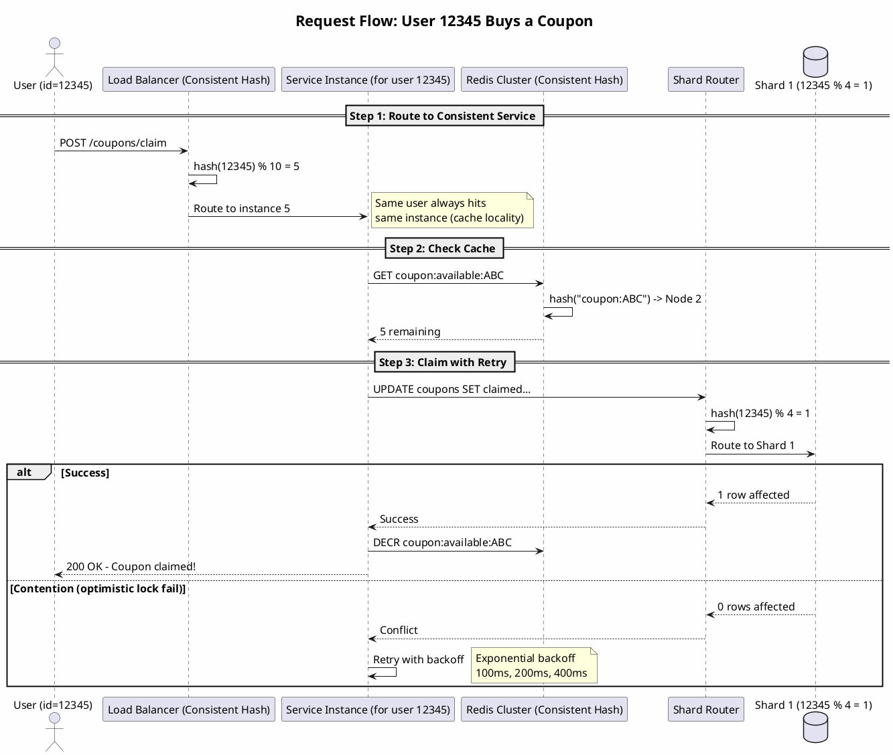

# Advanced System Design Reference Architecture

> Sharding, consistent hashing, circuit breakers, retry patterns, and data partitioning.

---

## Complete Advanced Architecture



---

## 1. Consistent Hashing



#### When to Use

| Scenario | Use Consistent Hashing |
|----------|----------------------|
| **Cache cluster** | Redis/Memcached nodes - minimize cache misses on node failure |
| **Database shards** | Add/remove shards without full data migration |
| **Load balancer** | Sticky sessions without centralized state |
| **Distributed storage** | Cassandra, DynamoDB partition assignment |

---

## 2. Circuit Breaker Pattern



#### Circuit Breaker Flow



---

## 3. Retry with Exponential Backoff



#### Retry Strategy Comparison

| Strategy | Formula | When to Use |
|----------|---------|-------------|
| **Fixed delay** | `wait = 1s` | Simple, predictable timing |
| **Linear backoff** | `wait = attempt * 1s` | Gradual increase |
| **Exponential backoff** | `wait = 2^attempt * 100ms` | Fast recovery, prevents overload |
| **Exponential + Jitter** | `wait = random(0, 2^attempt * 100ms)` | Distributed systems (prevents thundering herd) |

---

## 4. Database Sharding Strategy



#### Sharding Architecture Detail



---

## 5. Complete Resilience Pattern



---

## 6. Request Flow Through Sharded System



---

## Summary: When to Use Each Pattern

| Pattern | Problem It Solves | Example |
|---------|------------------|---------|
| **Consistent Hashing** | Minimize rehashing when nodes change | Redis cluster, DB shards |
| **Circuit Breaker** | Prevent cascade failures | Payment service down |
| **Retry + Backoff** | Handle transient failures | Network glitches |
| **Timeout** | Don't wait forever | Slow downstream |
| **Bulkhead** | Isolate failures | Limit concurrent calls |
| **Hash Sharding** | Scale writes | User data |
| **Range Sharding** | Time-based queries | Logs, events |
| **Entity Sharding** | Data locality | Ticketing by venue |

---

## Quick Reference: Resilience Configuration

```
Circuit Breaker:
  - Failure threshold: 5 consecutive failures
  - Open duration: 30 seconds
  - Half-open test: 1 request

Retry:
  - Max attempts: 3
  - Backoff: Exponential (100ms, 200ms, 400ms)
  - Jitter: ±50%
  - Retry on: 5xx, timeout, connection error
  - Don't retry: 4xx (client error)

Timeout:
  - HTTP call: 5 seconds
  - Database query: 3 seconds
  - Cache lookup: 100ms

Bulkhead:
  - Max concurrent: 10 per downstream
  - Queue size: 20
  - Queue timeout: 500ms
```

---

*Extended from Reference-Architecture.md with advanced patterns.*
