# System Design Reference Architecture

> A comprehensive reference showing all major components and when to use each alternative.

---

## Complete Reference Architecture

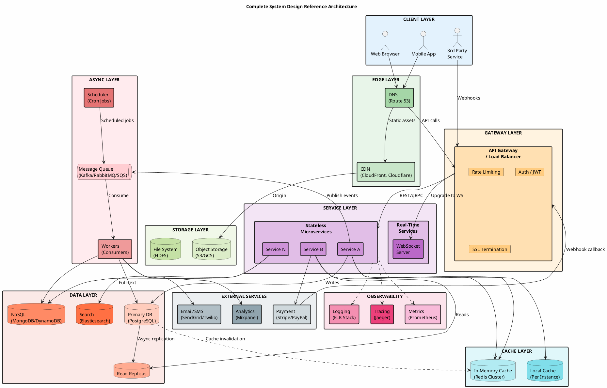

---

## Layer-by-Layer Breakdown

### 1. Edge Layer (CDN + DNS)

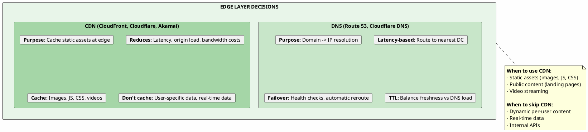

---

### 2. API Gateway / Load Balancer

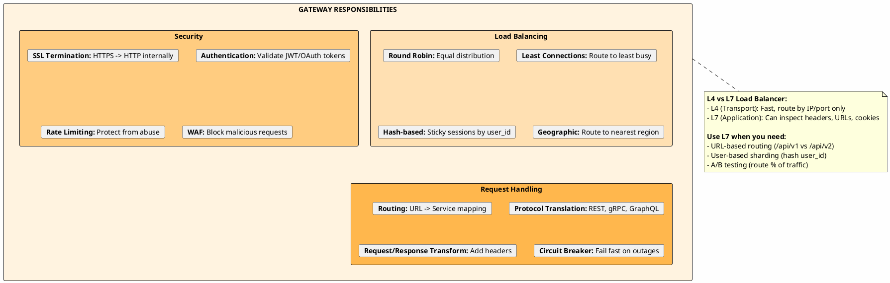

---

### 3. Communication Protocols

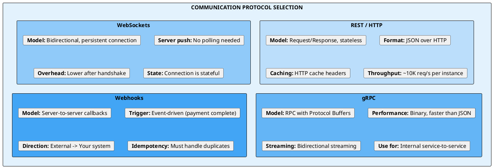

#### When to Use Each Protocol

| Protocol | Use When | Examples |
|----------|----------|----------|
| **REST** | Standard CRUD, public APIs, browser clients | URL Shortener, Coupon system |
| **WebSockets** | Real-time bidirectional, live updates | Auctions, Chat, Live sports |
| **gRPC** | Internal microservices, high throughput | Service mesh, ML inference |
| **Webhooks** | 3rd party integrations, event notifications | Payment confirmation, GitHub events |
| **Polling** | Simple, firewall-friendly, fallback | Payment status check, legacy systems |

---

### 4. Database Selection

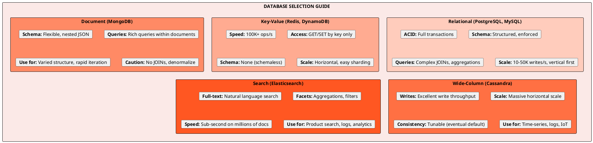

#### Database Decision Tree

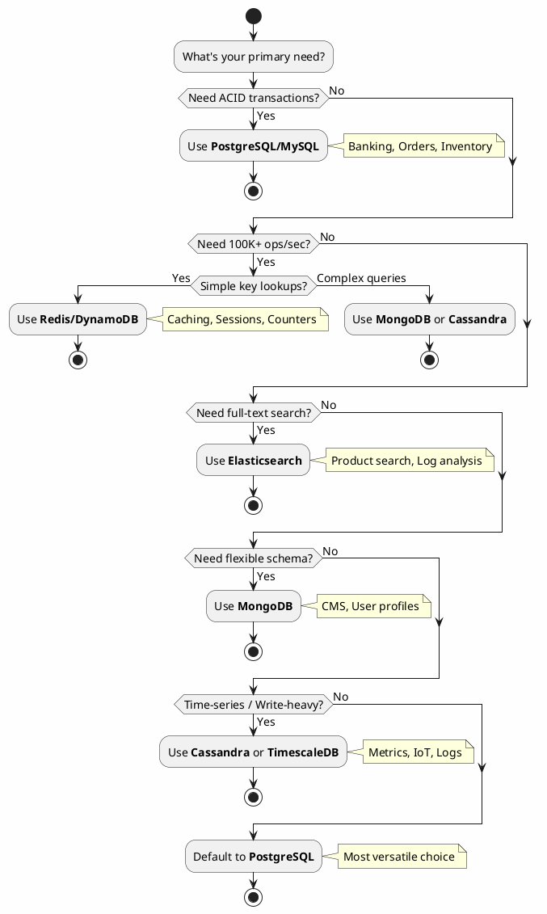

---

### 5. Caching Strategy

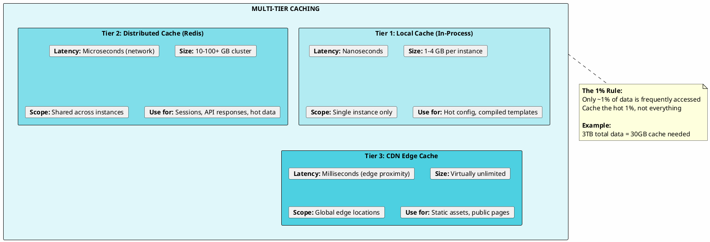

#### Cache Patterns

| Pattern | How It Works | Use When |
|---------|--------------|----------|
| **Cache-Aside** | App checks cache, if miss -> query DB -> populate cache | Most common, flexible |
| **Write-Through** | Write to cache, cache writes to DB synchronously | Need consistency |
| **Write-Behind** | Write to cache, async batch write to DB | High write throughput |
| **Read-Through** | Cache fetches from DB on miss automatically | Simpler app code |

---

### 6. Message Queues & Async Processing

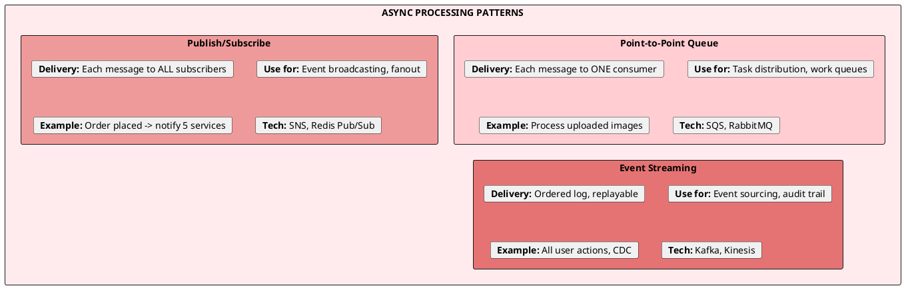

#### Queue Technology Comparison

| Technology | Throughput | Ordering | Durability | Best For |
|------------|------------|----------|------------|----------|
| **Kafka** | 100K+ msg/s | Per-partition | Persistent log | Event streaming, logs |
| **RabbitMQ** | 20K msg/s | Per-queue | Configurable | Complex routing, RPC |
| **SQS** | 3K msg/s | Best-effort | Managed | Simple async tasks |
| **Redis Pub/Sub** | 100K+ msg/s | None | None (fire-forget) | Real-time notifications |

---

### 7. Scaling Patterns

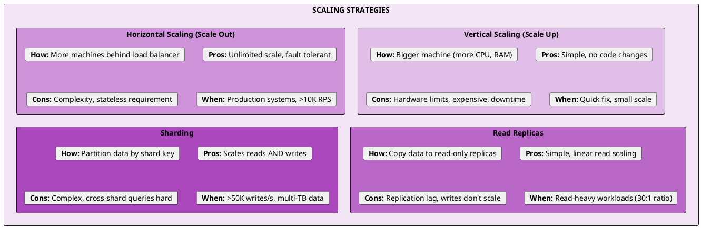

#### Sharding Strategies

| Strategy | How It Works | Best For |
|----------|--------------|----------|
| **Hash-based** | `hash(key) % N` shards | Even distribution, no hotspots |
| **Range-based** | Key ranges per shard | Time-series, range scans |
| **Geographic** | By region/country | Low latency, data residency |
| **Directory** | Lookup table for routing | Maximum flexibility |

---

### 8. Concurrency Control

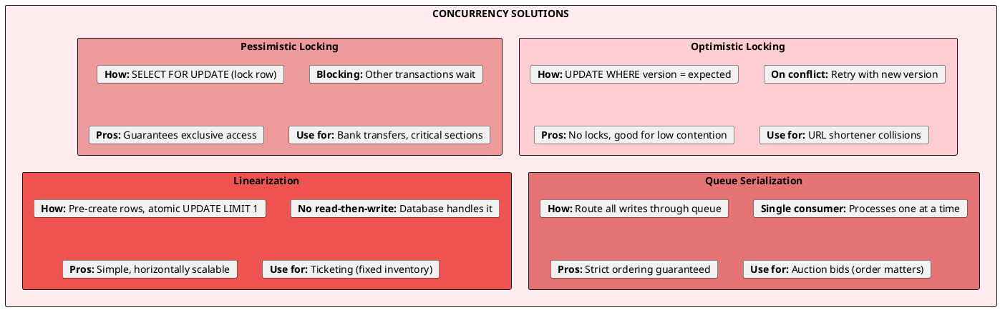

---

### 9. External Integrations

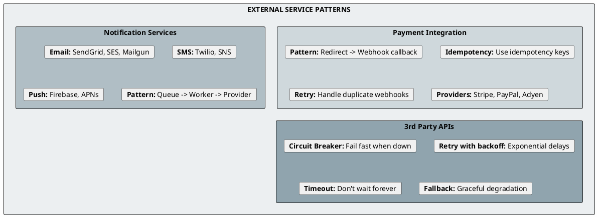

---

### 10. Observability Stack

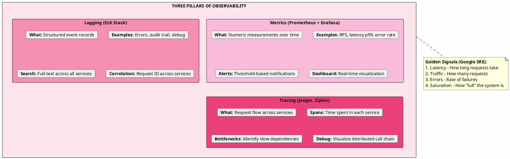

---

## Quick Reference: When to Use What

### Communication

| Need | Solution |
|------|----------|
| Standard API | REST |
| Real-time updates | WebSockets |
| High-perf internal | gRPC |
| 3rd party events | Webhooks |
| Simple fallback | Polling |

### Database

| Need | Solution |
|------|----------|
| Transactions (ACID) | PostgreSQL |
| 100K+ ops/sec | Redis / DynamoDB |
| Flexible schema | MongoDB |
| Time-series at scale | Cassandra |
| Full-text search | Elasticsearch |

### Scaling

| Bottleneck | Solution |
|------------|----------|
| Read-heavy | Read replicas + Cache |
| Write-heavy | Sharding |
| Compute | Horizontal scaling |
| Storage | Object storage (S3) |

### Concurrency

| Scenario | Solution |
|----------|----------|
| Low contention | Optimistic locking |
| High contention | Pessimistic locking |
| Ordering required | Queue serialization |
| Fixed inventory | Linearization |

---

## System Benchmarks (Memorize These)

| Component | Throughput |
|-----------|------------|
| PostgreSQL | 10-50K writes/sec |
| Redis | 100K+ ops/sec |
| Kafka | 100K+ msgs/sec per broker |
| Service instance | 1-10K RPS |
| SSD read | 200K+ IOPS |
| Network (1Gbps) | 100K+ small packets/sec |

---

*Based on patterns from: URL Shortener, News Feed, Ticketing, Auction, Coupon, and Web Crawler system designs.*
