# System Design Reference Architecture Poster

> **Format**: A2 Landscape (594mm x 420mm) | **Pages**: 10 | **Print**: Color recommended

---

# PAGE 1: CLIENT COMMUNICATION

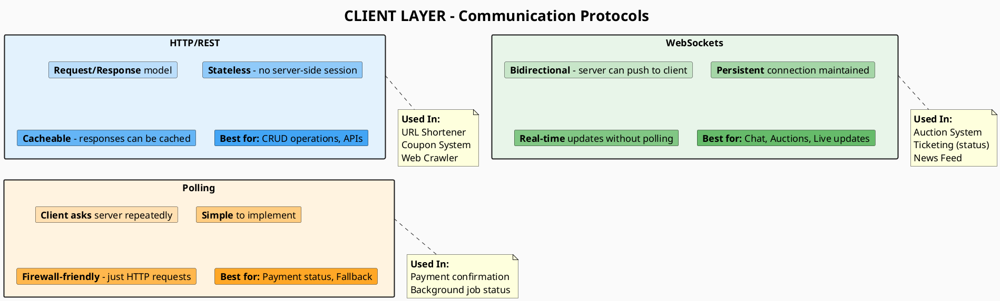

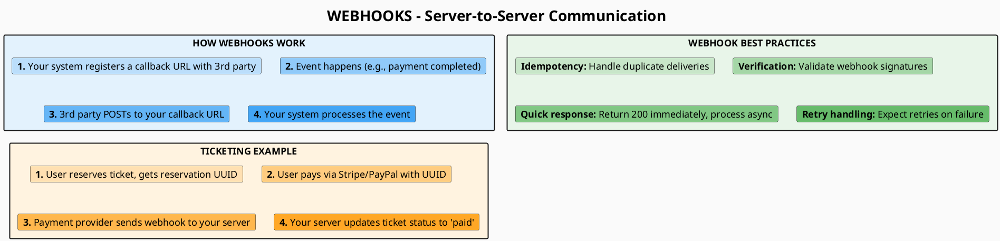

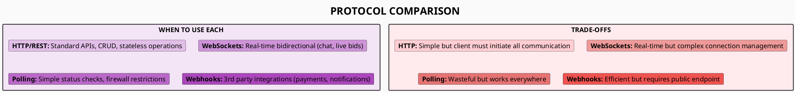

---

# PAGE 2: LOAD BALANCING

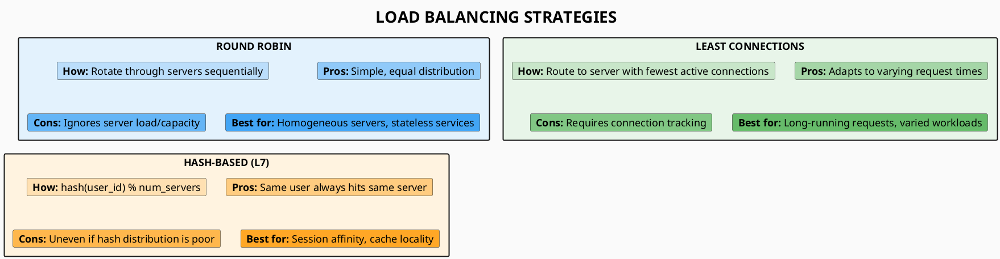

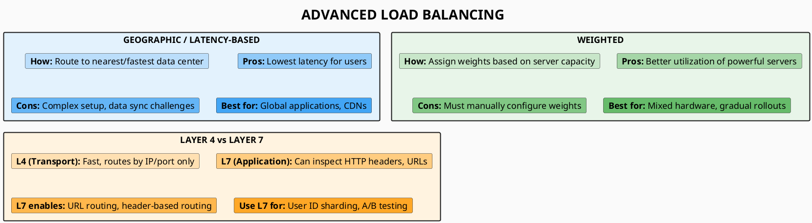

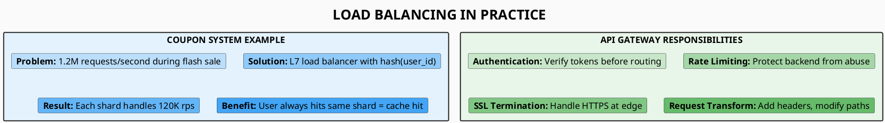

---

# PAGE 3: CACHING STRATEGIES

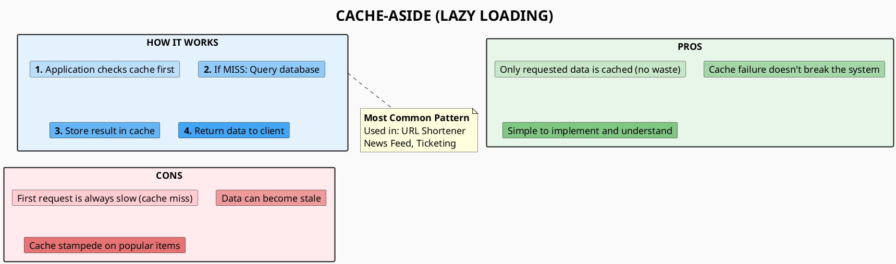

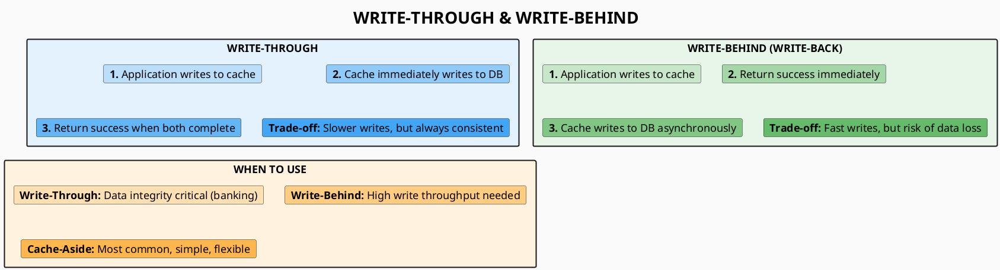

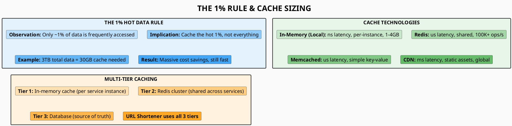

---

# PAGE 4: DATABASE SELECTION

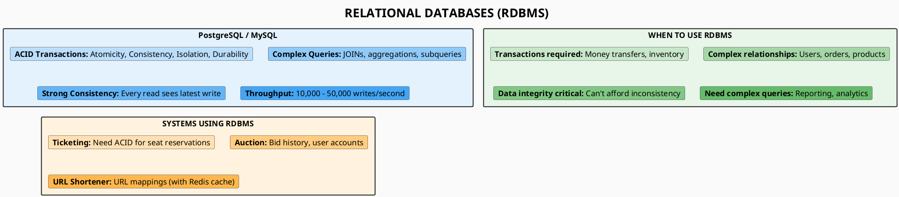

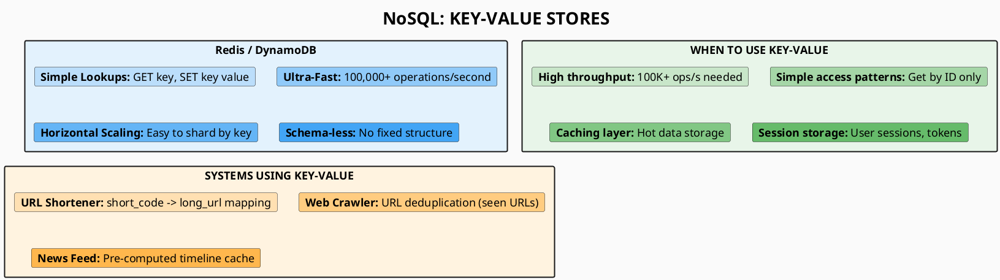

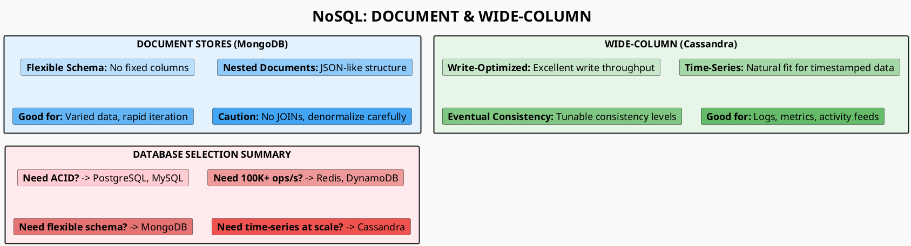

---

# PAGE 5: SCALING PATTERNS

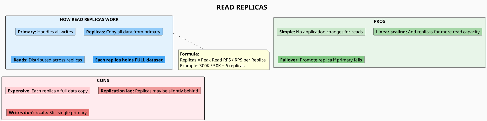

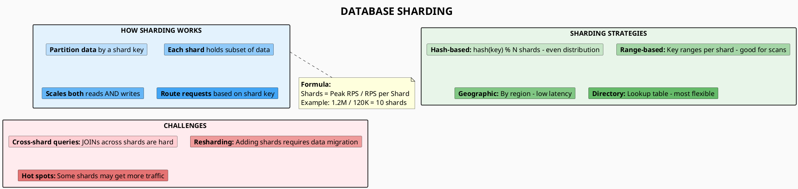

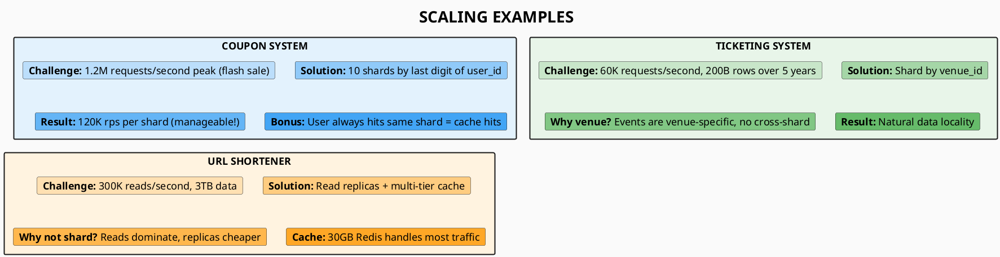

---

# PAGE 6: MESSAGE QUEUES

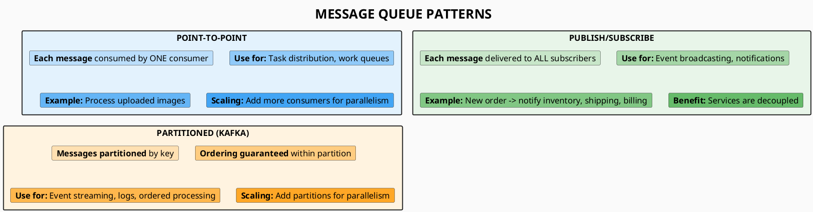

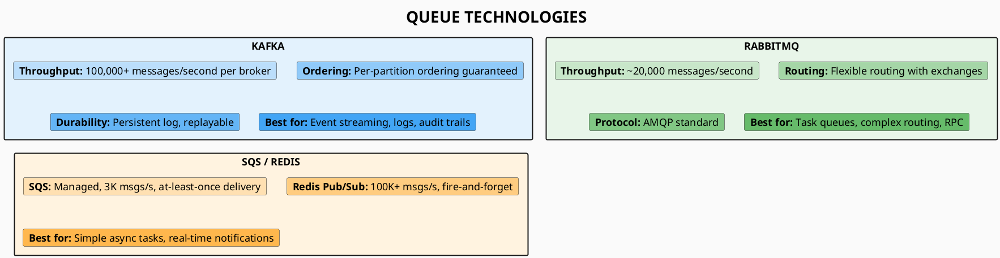

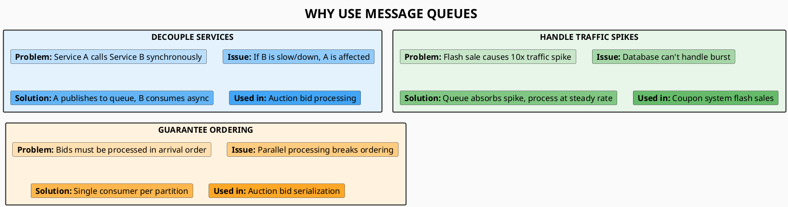

---

# PAGE 7: CONCURRENCY CONTROL

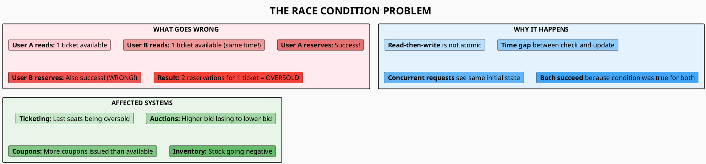

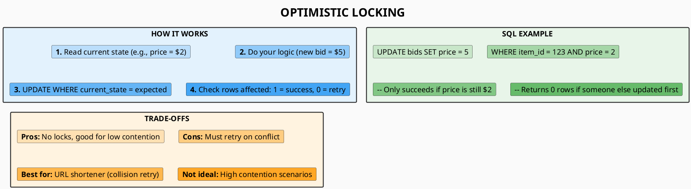

```plantuml
@startuml
skinparam backgroundColor #FAFAFA
skinparam defaultFontSize 18
skinparam titleFontSize 28
skinparam rectangleBorderThickness 2

title **QUEUE SERIALIZATION**

rectangle "HOW IT WORKS" as how #E3F2FD {
    card "**1.** All writes go to a message queue" as h1 #BBDEFB
    card "**2.** Single consumer processes sequentially" as h2 #90CAF9
    card "**3.** No race conditions - one at a time" as h3 #64B5F6
    card "**4.** Results published to response queue" as h4 #42A5F5
}

rectangle "AUCTION EXAMPLE" as auction #E8F5E9 {
    card "**Rick bids $5**, **Morty bids $3** (concurrent)" as a1 #C8E6C9
    card "**Queue:** Rick's bid enters first" as a2 #A5D6A7
    card "**Process:** Rick's $5 > current $2 -> Accept" as a3 #81C784
    card "**Process:** Morty's $3 < current $5 -> Reject" as a4 #66BB6A
}

rectangle "TRADE-OFFS" as tradeoffs #FFF3E0 {
    card "**Pros:** Strict ordering, fair processing" as t1 #FFE0B2
    card "**Cons:** Single point of failure, latency" as t2 #FFCC80
    card "**Best for:** Auctions (bid ordering matters)" as t3 #FFB74D
    card "**Scaling:** Multiple queues per auction item" as t4 #FFA726
}

@enduml
```

---

# PAGE 8: LINEARIZATION (BEST FOR TICKETING)

```plantuml
@startuml
skinparam backgroundColor #FAFAFA
skinparam defaultFontSize 18
skinparam titleFontSize 28
skinparam rectangleBorderThickness 2

title **LINEARIZATION - THE BEST SOLUTION FOR TICKETING**

rectangle "THE KEY INSIGHT" as insight #E3F2FD {
    card "**Don't count** available tickets" as i1 #BBDEFB
    card "**Pre-create** all ticket records" as i2 #90CAF9
    card "**Atomic claim:** UPDATE WHERE status='free' LIMIT 1" as i3 #64B5F6
    card "**Database handles** concurrency automatically" as i4 #42A5F5
}

rectangle "STEP 1: PRE-CREATE TICKETS" as step1 #E8F5E9 {
    card "INSERT INTO tickets (id, status) VALUES" as s1a #C8E6C9
    card "(1, 'free'), (2, 'free'), (3, 'free')..." as s1b #A5D6A7
    card "Create ALL tickets upfront with status='free'" as s1c #81C784
}

rectangle "STEP 2: ATOMIC CLAIM" as step2 #FFF3E0 {
    card "UPDATE tickets" as s2a #FFE0B2
    card "SET user_id = ?, status = 'reserved'" as s2b #FFCC80
    card "WHERE status = 'free' LIMIT 1" as s2c #FFB74D
    card "**Only ONE user can claim each ticket!**" as s2d #FFA726
}

@enduml
```

```plantuml
@startuml
skinparam backgroundColor #FAFAFA
skinparam defaultFontSize 18
skinparam titleFontSize 28
skinparam rectangleBorderThickness 2

title **WHY LINEARIZATION IS BEST**

rectangle "NO RACE CONDITIONS" as norace #E3F2FD {
    card "**UPDATE ... WHERE status='free'** is atomic" as n1 #BBDEFB
    card "Database locks the row during update" as n2 #90CAF9
    card "Only ONE transaction sees 'free' and updates" as n3 #64B5F6
    card "Others get 0 rows affected = ticket taken" as n4 #42A5F5
}

rectangle "HORIZONTAL SCALING" as scale #E8F5E9 {
    card "**Shard by venue_id** - each venue is independent" as s1 #C8E6C9
    card "No coordination needed between shards" as s2 #A5D6A7
    card "Add shards as venues grow" as s3 #81C784
    card "No single point of failure" as s4 #66BB6A
}

rectangle "SIMPLER ARCHITECTURE" as simple #FFF3E0 {
    card "**No message queue** for serialization needed" as si1 #FFE0B2
    card "**No distributed locks** required" as si2 #FFCC80
    card "**No retry logic** - just check rows affected" as si3 #FFB74D
    card "**Database does the hard work**" as si4 #FFA726
}

@enduml
```

```plantuml
@startuml
skinparam backgroundColor #FAFAFA
skinparam defaultFontSize 18
skinparam titleFontSize 28
skinparam rectangleBorderThickness 2

title **TICKET STATUS STATE MACHINE**

rectangle "STATUS FLOW" as flow #E3F2FD {
    card "**FREE** -> Initial state, available for reservation" as f1 #BBDEFB
    card "**RESERVED** -> User claimed, awaiting payment" as f2 #90CAF9
    card "**PAID** -> Payment confirmed, ticket issued" as f3 #64B5F6
    card "**REVERSED** -> Payment failed or timeout" as f4 #42A5F5
}

rectangle "STATE TRANSITIONS" as trans #E8F5E9 {
    card "**free -> reserved:** Atomic UPDATE claim" as t1 #C8E6C9
    card "**reserved -> paid:** Payment webhook received" as t2 #A5D6A7
    card "**reserved -> reversed:** Timeout or payment failed" as t3 #81C784
    card "**reversed -> free:** Ticket released back to pool" as t4 #66BB6A
}

rectangle "CONCURRENCY PATTERN SUMMARY" as summary #FFEBEE {
    card "**Linearization:** Fixed resources (tickets, coupons)" as su1 #FFCDD2
    card "**Queue Serialization:** Strict ordering (bids)" as su2 #EF9A9A
    card "**Optimistic Locking:** Low contention (URLs)" as su3 #E57373
}

@enduml
```

---

# PAGE 9: FAN-OUT STRATEGIES

```plantuml
@startuml
skinparam backgroundColor #FAFAFA
skinparam defaultFontSize 18
skinparam titleFontSize 28
skinparam rectangleBorderThickness 2

title **FAN-OUT ON WRITE (PUSH)**

rectangle "HOW IT WORKS" as how #E3F2FD {
    card "**When user posts:**" as h0 #BBDEFB
    card "**1.** Store the post in database" as h1 #90CAF9
    card "**2.** Find all followers (e.g., 100 users)" as h2 #64B5F6
    card "**3.** Copy post to EACH follower's timeline cache" as h3 #42A5F5
    card "**4.** Done - feeds are pre-computed!" as h4 #2196F3
}

rectangle "PROS" as pros #E8F5E9 {
    card "**Reads are O(1):** Just fetch pre-built timeline" as p1 #C8E6C9
    card "**No computation** at read time" as p2 #A5D6A7
    card "**Consistent fast** response for all users" as p3 #81C784
}

rectangle "CONS" as cons #FFEBEE {
    card "**Writes are O(N):** N = number of followers" as c1 #FFCDD2
    card "**Write amplification:** Same data copied N times" as c2 #EF9A9A
    card "**VIP problem:** 1M followers = 1M writes!" as c3 #E57373
}

@enduml
```

```plantuml
@startuml
skinparam backgroundColor #FAFAFA
skinparam defaultFontSize 18
skinparam titleFontSize 28
skinparam rectangleBorderThickness 2

title **FAN-OUT ON READ (PULL)**

rectangle "HOW IT WORKS" as how #E3F2FD {
    card "**When user opens app:**" as h0 #BBDEFB
    card "**1.** Find everyone they follow (e.g., 50 users)" as h1 #90CAF9
    card "**2.** Fetch recent posts from EACH followed user" as h2 #64B5F6
    card "**3.** Merge and sort all posts by timestamp" as h3 #42A5F5
    card "**4.** Return the feed" as h4 #2196F3
}

rectangle "PROS" as pros #E8F5E9 {
    card "**Writes are O(1):** Just store the post once" as p1 #C8E6C9
    card "**No write amplification**" as p2 #A5D6A7
    card "**VIPs don't cause spikes**" as p3 #81C784
}

rectangle "CONS" as cons #FFEBEE {
    card "**Reads are O(N):** N = number of followed users" as c1 #FFCDD2
    card "**Computation on every read**" as c2 #EF9A9A
    card "**Slower, inconsistent response times**" as c3 #E57373
}

@enduml
```

```plantuml
@startuml
skinparam backgroundColor #FAFAFA
skinparam defaultFontSize 18
skinparam titleFontSize 28
skinparam rectangleBorderThickness 2

title **HYBRID FAN-OUT (BEST APPROACH)**

rectangle "THE STRATEGY" as strategy #E3F2FD {
    card "**Regular users (< 10K followers):** Use PUSH" as s1 #BBDEFB
    card "**Pre-compute** their followers' timelines" as s2 #90CAF9
    card "**VIPs/Celebrities (1M+ followers):** Use PULL" as s3 #64B5F6
    card "**Fetch VIP posts** at read time, merge with timeline" as s4 #42A5F5
}

rectangle "WHY HYBRID WORKS" as why #E8F5E9 {
    card "**Regular users:** 100 followers x 10K users = 1M writes (fine)" as w1 #C8E6C9
    card "**VIP tweet:** Would be 1M writes = 2x normal load spike!" as w2 #A5D6A7
    card "**Solution:** Don't fan-out VIP tweets at all" as w3 #81C784
    card "**Only ~25 accounts** have 50M+ followers (Wikipedia)" as w4 #66BB6A
}

rectangle "NEWS FEED IMPLEMENTATION" as impl #FFF3E0 {
    card "**Timeline cache:** Pre-computed from regular users" as i1 #FFE0B2
    card "**VIP list:** Track which followed users are VIPs" as i2 #FFCC80
    card "**At read time:** Fetch timeline + merge VIP posts" as i3 #FFB74D
    card "**Result:** Fast reads, no VIP spikes" as i4 #FFA726
}

@enduml
```

---

# PAGE 10: INTERVIEW CHECKLIST

```plantuml
@startuml
skinparam backgroundColor #FAFAFA
skinparam defaultFontSize 18
skinparam titleFontSize 28
skinparam rectangleBorderThickness 2

title **STEP 1: CLARIFY REQUIREMENTS (5 min)**

rectangle "QUESTIONS TO ASK" as questions #E3F2FD {
    card "**Scale:** How many users? Requests per second?" as q1 #BBDEFB
    card "**Data:** How much storage? Retention period?" as q2 #90CAF9
    card "**Ratio:** Read-heavy or write-heavy?" as q3 #64B5F6
    card "**Latency:** Real-time needed? Eventual consistency OK?" as q4 #42A5F5
    card "**Consistency:** Can we show stale data?" as q5 #2196F3
}

rectangle "STEP 2: BACK-OF-ENVELOPE (5 min)" as boe #E8F5E9 {
    card "**RPS** = Total requests / time window" as b1 #C8E6C9
    card "**Peak** = Average x 10 (rule of thumb)" as b2 #A5D6A7
    card "**Storage** = Records x size x retention" as b3 #81C784
    card "**Identify bottleneck:** What will fail first?" as b4 #66BB6A
}

rectangle "STEP 3: HIGH-LEVEL DESIGN (10 min)" as hld #FFF3E0 {
    card "**Draw:** Client, LB, Services, Cache, DB" as h1 #FFE0B2
    card "**Show data flow** with labeled arrows" as h2 #FFCC80
    card "**Define APIs:** POST /resource, GET /resource/:id" as h3 #FFB74D
    card "**Choose database** with reasoning" as h4 #FFA726
}

@enduml
```

```plantuml
@startuml
skinparam backgroundColor #FAFAFA
skinparam defaultFontSize 18
skinparam titleFontSize 28
skinparam rectangleBorderThickness 2

title **STEP 4: DEEP DIVE (15 min)**

rectangle "DATABASE DESIGN" as db #E3F2FD {
    card "**Schema:** Tables, columns, types" as d1 #BBDEFB
    card "**Indexes:** What queries need to be fast?" as d2 #90CAF9
    card "**Relationships:** Foreign keys, denormalization" as d3 #64B5F6
}

rectangle "CACHING STRATEGY" as cache #E8F5E9 {
    card "**What to cache:** Hot data, computed results" as c1 #C8E6C9
    card "**Cache pattern:** Cache-aside, write-through" as c2 #A5D6A7
    card "**Invalidation:** TTL, event-based, manual" as c3 #81C784
}

rectangle "SCALING & CONCURRENCY" as scale #FFF3E0 {
    card "**Read scaling:** Replicas, cache tiers" as s1 #FFE0B2
    card "**Write scaling:** Sharding strategy" as s2 #FFCC80
    card "**Concurrency:** Optimistic, serialization, linearization" as s3 #FFB74D
    card "**Failure handling:** Retry, fallback, circuit breaker" as s4 #FFA726
}

@enduml
```

```plantuml
@startuml
skinparam backgroundColor #FAFAFA
skinparam defaultFontSize 18
skinparam titleFontSize 28
skinparam rectangleBorderThickness 2

title **STEP 5: TRADE-OFFS & COMMON MISTAKES**

rectangle "TRADE-OFFS TO DISCUSS" as tradeoffs #E3F2FD {
    card "**Consistency vs Availability:** Which matters more?" as t1 #BBDEFB
    card "**Latency vs Throughput:** Optimize for which?" as t2 #90CAF9
    card "**Cost vs Performance:** Where to invest?" as t3 #64B5F6
    card "**Complexity vs Simplicity:** Is it worth it?" as t4 #42A5F5
}

rectangle "COMMON MISTAKES" as mistakes #FFEBEE {
    card "**Jumping to solution** without clarifying requirements" as m1 #FFCDD2
    card "**Skipping calculations** - always do back-of-envelope" as m2 #EF9A9A
    card "**Over-engineering** for scale you don't need" as m3 #E57373
    card "**Ignoring failures** - discuss what breaks" as m4 #EF5350
    card "**No trade-offs** - everything has pros/cons" as m5 #F44336
}

rectangle "SYSTEM BENCHMARKS (MEMORIZE)" as bench #E8F5E9 {
    card "**PostgreSQL:** 10-50K writes/s" as b1 #C8E6C9
    card "**Redis:** 100K+ ops/s" as b2 #A5D6A7
    card "**Kafka:** 100K+ msgs/s per broker" as b3 #81C784
    card "**Service instance:** 1-10K RPS" as b4 #66BB6A
}

@enduml
```

---

## PRINT INSTRUCTIONS

| Page | Content |
|------|---------|
| **1** | Client Communication (HTTP, WebSockets, Polling, Webhooks) |
| **2** | Load Balancing (Round Robin, Hash, Geographic, L4/L7) |
| **3** | Caching Strategies (Cache-Aside, Write-Through, 1% Rule) |
| **4** | Database Selection (RDBMS, Key-Value, Document, Wide-Column) |
| **5** | Scaling Patterns (Read Replicas, Sharding, Examples) |
| **6** | Message Queues (Patterns, Technologies, Use Cases) |
| **7** | Concurrency Control (Race Conditions, Optimistic, Serialization) |
| **8** | Linearization (Best for Ticketing, State Machine) |
| **9** | Fan-Out Strategies (Push, Pull, Hybrid) |
| **10** | Interview Checklist (5 Steps, Trade-offs, Benchmarks) |

**Export Settings:**
- Format: PNG or SVG at 300 DPI
- Size: A2 Landscape (594mm x 420mm)
- Background: Light (#FAFAFA)
- Font: 18px uniform throughout

---

*Based on "Pragmatic System Design" by Alexey Soshin*
*Systems: Web Crawler, Auction, Coupon, URL Shortener, News Feed, Ticketing*
