# Ticketing System Design

## Table of Contents
1. [Introduction](#introduction)
2. [Requirements Gathering](#requirements-gathering)
3. [User Perspective](#user-perspective)
4. [Basic Design](#basic-design)
5. [Database Schema](#database-schema)
6. [Checking Ticket Availability](#checking-ticket-availability)
7. [Handling Payment Failures](#handling-payment-failures)
8. [Payment Integration](#payment-integration)
9. [Scaling the System](#scaling-the-system)
10. [Conflict Resolution](#conflict-resolution)
11. [Final Architecture](#final-architecture)

---

## Introduction

A **Ticketing System** allows users to purchase tickets for events at various venues. Think of platforms like Ticketmaster, Eventbrite, or concert booking systems. The core challenge is handling high concurrency when thousands of users compete for limited tickets, while ensuring no overselling occurs.

### The Core Problem

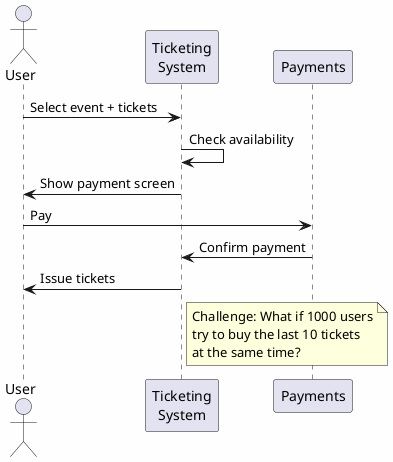

---

## Requirements Gathering

Before designing, we need to understand the scale and constraints:

| Question | Answer | Impact |
|----------|--------|--------|
| How many venues? | **1,000** | Determines sharding strategy |
| Max tickets per venue? | **100,000** | Affects storage and query design |
| Ticket type? | **Entrance tickets** (all same) | Simplifies logic (no seat selection) |
| Payment handling? | **3rd-party integration** | Async webhook-based flow |

### Key Insight: Entrance vs Seat Tickets

- **Entrance tickets**: All tickets are identical (like festival entry)
- **Seat tickets**: Each ticket is unique (like cinema, airplane)

For entrance tickets, we don't need to track individual seats - just the count of available tickets.

---

## User Perspective

The user experience is straightforward:

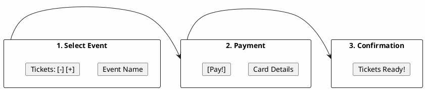

**User Flow:**
1. Browse events and select number of tickets
2. Enter payment details
3. Receive ticket confirmation

---

## Basic Design

### Initial Booking Flow

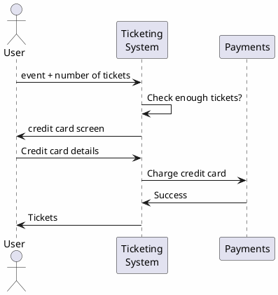

### Initial Database Schema

We start with a simple two-table design:

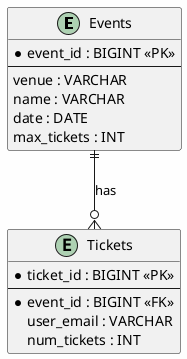

**Problem**: How do we know if enough tickets are available?

---

## Database Schema

### Evolution: Adding Venues

Since venues host multiple events, we normalize the schema:

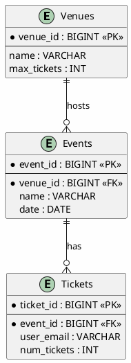

---

## Checking Ticket Availability

The fundamental check before any booking:

```
current_tickets_count + booked_tickets <= max_tickets
```

### Approach 1: Counter Field (Denormalized)

Add `curr_tickets` field to Events table:

| Column | Source |
|--------|--------|
| `max_tickets` | Events table |
| `booked_tickets` | User request |
| `curr_tickets` | **New field** - running count |

**Pros**: Fast reads (single row lookup)
**Cons**: Must keep in sync with Tickets table

### Approach 2: Aggregate Query (Normalized)

Calculate from Tickets table:

```sql
SELECT SUM(num_tickets)
FROM Tickets
WHERE event_id = ?
GROUP BY event_id
```

**Pros**: Always accurate, no sync issues
**Cons**: Slower (aggregation on every request)

---

## Handling Payment Failures

### The Problem

What happens when payment fails after we've already counted the tickets?

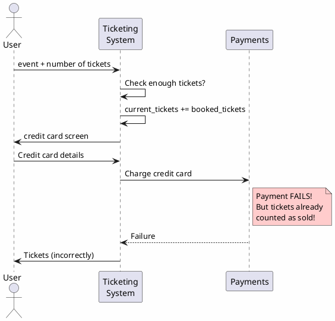

### Solution: Status Field

Add a `status` field to track ticket state:

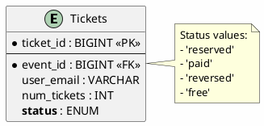

Now our availability query becomes:

```sql
SELECT SUM(num_tickets)
FROM Tickets
WHERE event_id = ?
  AND status IN ('reserved', 'paid')
GROUP BY event_id
```

---

## Payment Integration

### The Challenge of 3rd-Party Payments

Payment processing is asynchronous. The user leaves our site, pays externally, and we receive confirmation via webhook.

### Reservation UUID Pattern

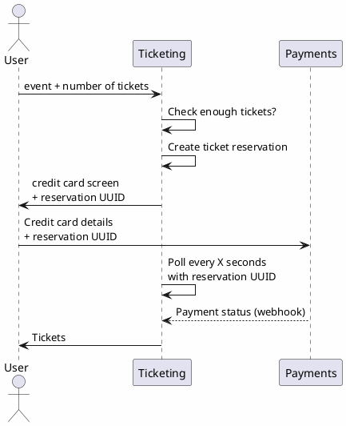

**Key Points:**
1. System creates a **reservation** with unique UUID
2. UUID is passed to payment provider
3. Webhook returns with same UUID to correlate payment
4. User polls system for status updates

---

## Scaling the System

### Back-of-Envelope Calculations

```
Storage over 5 years:
  100,000 (max venue size)
  x 365 x 5 (five years)
  = 182,500,000 => ~200M per venue
  x 1,000 (venues)
  = 200 BILLION rows
```

### Traffic Calculations

| Question | Answer |
|----------|--------|
| People competing per ticket? | 100 people |
| Total users for max venue | 100 x 100,000 = 10M users |
| Time to sell out? | 30 minutes |

```
10M users / 30 minutes
= 10M users / 1,800 seconds
= ~6K requests/second (average)
```

### Handling Peak Load (10x)

What if we have a 10x peak? That's **60K requests/second**.

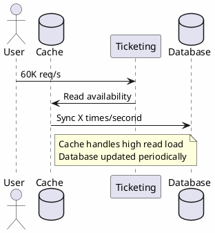

### Architecture with DB Writer

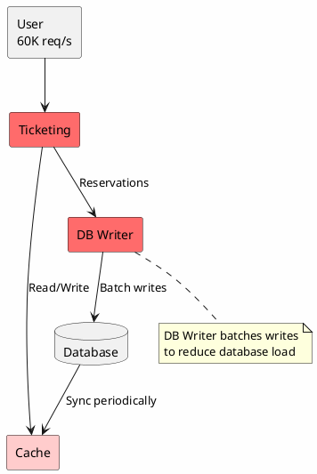

### Sharding by Venue

With 200B rows, we need to shard. Venue is a natural shard key:

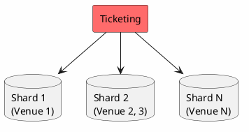

---

## Conflict Resolution

### The Race Condition Problem

What happens when Alice and Bob both try to buy the last ticket?

| Time | Alice | Bob |
|------|-------|-----|
| T1 | Check enough tickets? | |
| T2 | | Check enough tickets? |
| T3 | Make Reservation | |
| T4 | | Make Reservation |
| T5 | | Make Payment |
| T6 | **Make Payment (FAILS!)** | |

Both users see 1 ticket available, both reserve, but only one can actually buy!

### Solution 1: Serialization (Single DB Writer)

Route all writes through a single DB Writer to serialize operations:

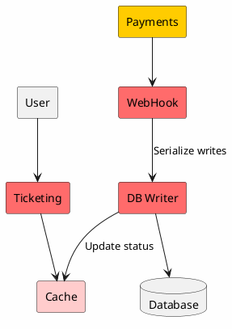

**How it works:**
- All reservation and payment confirmations go through DB Writer
- DB Writer processes requests sequentially
- No two users can reserve the same ticket simultaneously

### Solution 2: Linearization (Pre-created Tickets)

Instead of counting tickets, **pre-create individual ticket records**:

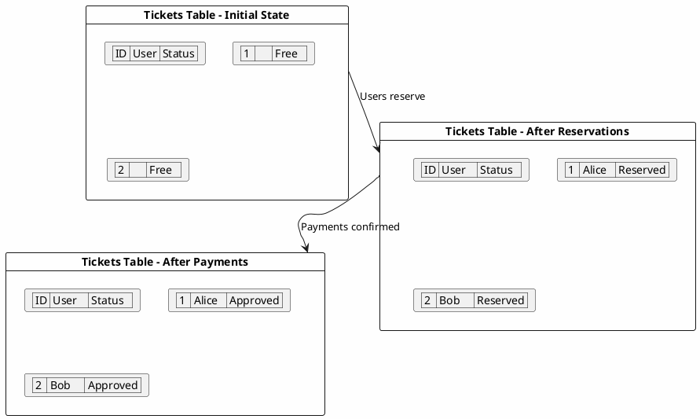

**The Magic: Optimistic Locking**

```sql
UPDATE Tickets
SET user = 'Alice', status = 'Reserved'
WHERE id = 1 AND status = 'Free'
```

- Only ONE user can successfully update a ticket
- If `status != 'Free'`, update affects 0 rows
- Application checks rows affected and handles failure

### Ticket Status State Machine

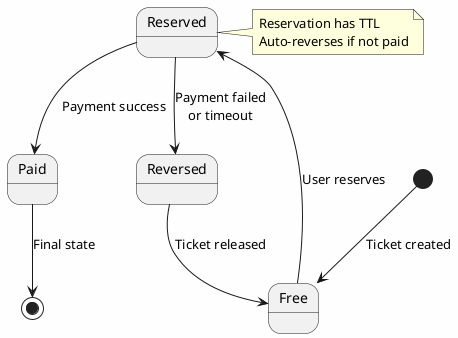

### Linearization Trade-offs

| Pros | Cons |
|------|------|
| No overbooking possible | Waste of space (pre-created rows) |
| Easy optimistic locking | Less efficient for group reservations |
| Simple concurrent handling | Requires ticket pre-population |

---

## Final Architecture

The complete system combines all components:

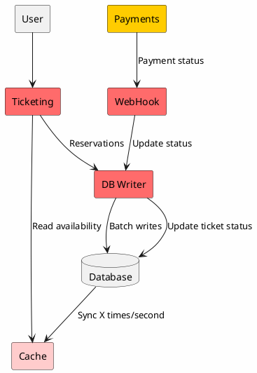

### Component Summary

| Component | Purpose | Technology |
|-----------|---------|------------|
| Ticketing Service | API, business logic | Stateless microservice |
| Cache | Fast reads, ticket availability | Redis |
| DB Writer | Serialize writes, conflict resolution | Worker service |
| Database | Persistent storage | PostgreSQL (sharded by venue) |
| WebHook Handler | Receive payment confirmations | HTTP endpoint |
| Payments | 3rd-party payment processing | Stripe, PayPal, etc. |

### Key Design Decisions

1. **Caching** for high read throughput (60K req/s peak)
2. **DB Writer** for serialized writes and conflict resolution
3. **Sharding by venue** for horizontal scaling
4. **Status field** to handle payment failures gracefully
5. **Reservation UUID** for payment correlation
6. **Webhook-based** async payment confirmation
7. **Linearization** or **Serialization** for race condition handling

---

## Key Takeaways

| Challenge | Solution |
|-----------|----------|
| 60K requests/second peak | Cache + DB Writer pattern |
| 200B rows over 5 years | Shard by venue |
| Payment failures | Status field (reserved/paid/reversed) |
| Race conditions | Serialization (DB Writer) or Linearization (optimistic locking) |
| 3rd-party payments | Reservation UUID + Webhook pattern |
| Availability checking | Aggregate query with status filter |

### Trade-offs Accepted

- **Eventual consistency**: Cache may lag behind database briefly
- **Complexity**: Multiple components (cache, DB writer, webhook handler)
- **Storage overhead**: Linearization pre-creates empty ticket records

This design handles concert-scale load while preventing overselling and gracefully handling payment failures.
