# URL Shortener System Design

A comprehensive guide to designing a URL shortening service like bit.ly or TinyURL.

## Table of Contents

1. [Problem Introduction](#problem-introduction)
2. [Requirements & Capacity Planning](#requirements--capacity-planning)
3. [Short Identifier Generation](#short-identifier-generation)
4. [Basic Design](#basic-design)
5. [Scaling Reads](#scaling-reads)
6. [Caching Strategies](#caching-strategies)
7. [Final Architecture](#final-architecture)

---

## Problem Introduction

A URL shortener converts long URLs into short, memorable links that redirect users to the original destination.

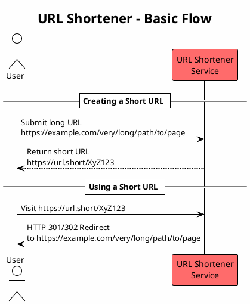

### Benefits of Short URLs

| Benefit | Description |
|---------|-------------|
| **Easier to type** | Short codes are memorable and quick to enter |
| **Space efficient** | Ideal for character-limited platforms (Twitter, SMS) |
| **Trackable** | Can collect analytics on link clicks |
| **Clean appearance** | More professional in marketing materials |

---

## Requirements & Capacity Planning

### Clarifying Questions

Before designing, we need to understand the scale:

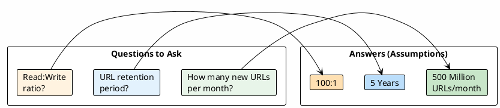

### Back-of-Envelope Calculations

#### Total URLs Over 5 Years

```
500M URLs/month x 12 months x 5 years = 30 Billion URLs
```

#### Write Throughput

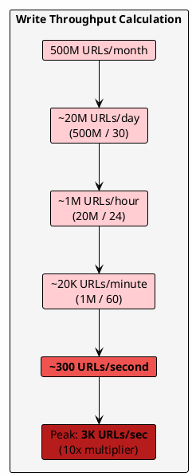

#### Read Throughput

With a 100:1 read-to-write ratio:

| Metric | Average | Peak (10x) |
|--------|---------|------------|
| Writes | 300/sec | 3K/sec |
| Reads | 30K/sec | 300K/sec |

#### Storage Requirements

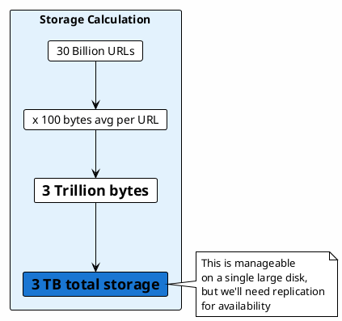

---

## Short Identifier Generation

The core challenge: generating unique, short, human-readable identifiers.

### Requirements for Short IDs

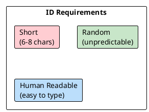

### Option Analysis

#### Option 1: UUID

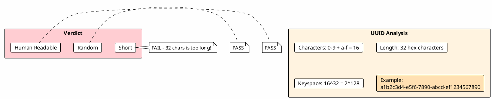

**UUID Verdict**: Too long to type manually.

#### Option 2: MD5 Hash

```
MD5(URL) -> 128 bits -> Same size as UUID

Approach: substring(Base58(MD5(URL)), 8)

Problem: Same URL always produces same hash - NOT RANDOM!
         Different users shortening same URL get same ID.
```

**MD5 Verdict**: Not random, causes conflicts for same URLs.

#### Option 3: Base62 Encoding

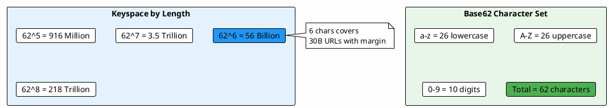

**Base62 Problem**: Characters like `0` vs `O` and `l` vs `1` are confusing!

#### Option 4: Base58 (Recommended)

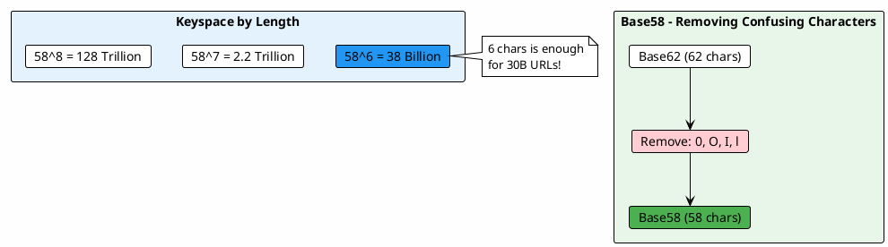

### Comparison Summary

| Method | Short | Random | Human Readable | Verdict |
|--------|:-----:|:------:|:--------------:|---------|
| UUID | No | Yes | Yes | Too long |
| MD5 | No | No | Yes | Not random |
| Base62 | Yes | Yes | No | Confusing chars |
| **Base58** | **Yes** | **Yes** | **Yes** | **Recommended** |

### Base58 Generation Algorithm

Two approaches to generate Base58 IDs:

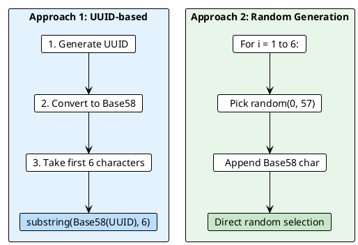

---

## Basic Design

### URL Shortening Flow

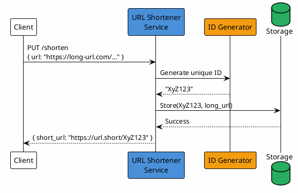

### URL Redirection Flow

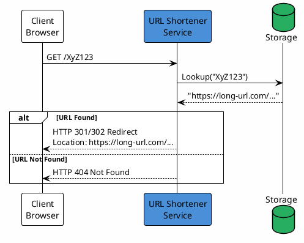

### Redirect Types: 301 vs 302

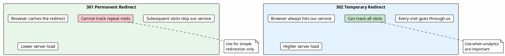

---

## Scaling Reads

With 30K reads/second (300K peak), we need to scale our read path.

### Option 1: Read Replicas

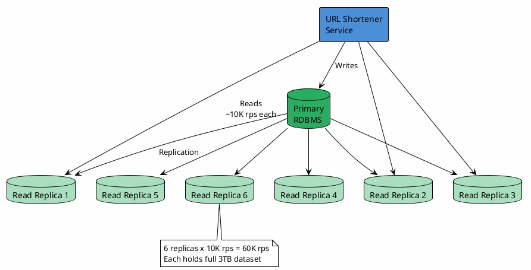

**Trade-off**: Each replica stores 3TB - expensive!

### Option 2: Redis Cluster

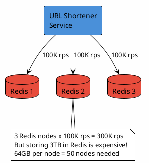

**Trade-off**: Redis is fast but storing 3TB is expensive.

### Option 3: DynamoDB (Managed NoSQL)

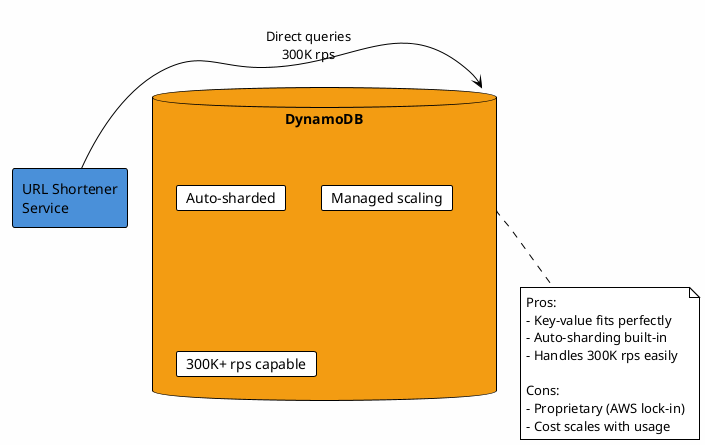

---

## Caching Strategies

### The 1% Rule

Most URL shorteners follow a power law distribution - a small percentage of URLs receive most of the traffic.

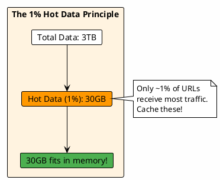

### Multi-Tier Caching Architecture

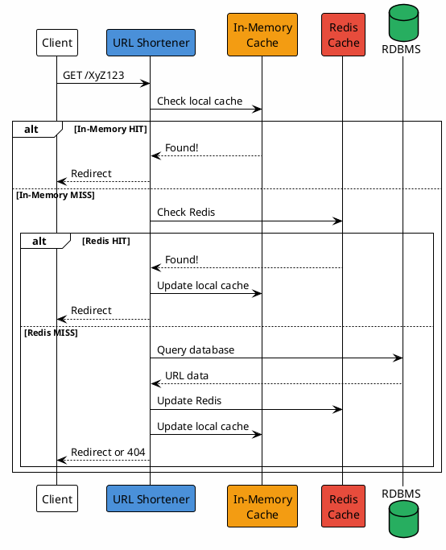

### Cache Sizing

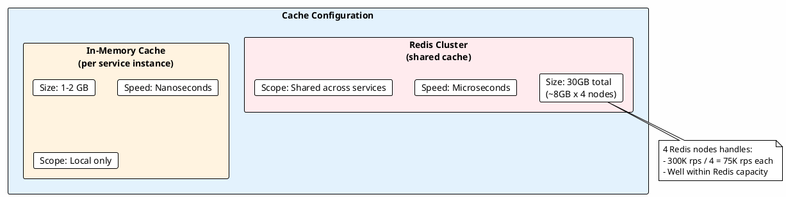

---

## Final Architecture

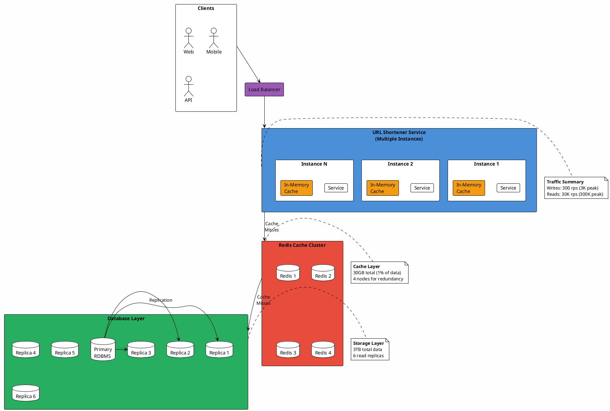

### System Specifications Summary

| Component | Specification | Purpose |
|-----------|--------------|---------|
| **ID Format** | Base58, 6 characters | Human-readable short codes |
| **Writes** | 300 rps (3K peak) | URL creation |
| **Reads** | 30K rps (300K peak) | URL redirection |
| **Storage** | 3TB (30B URLs) | Persistent URL storage |
| **Cache** | 30GB Redis (1% hot data) | Fast reads |
| **Replicas** | 6x read replicas | Read scaling |

---

## Advanced Topics (Interview Deep Dives)

### Topics Not Covered in This Design

The following are important for senior-level interviews:

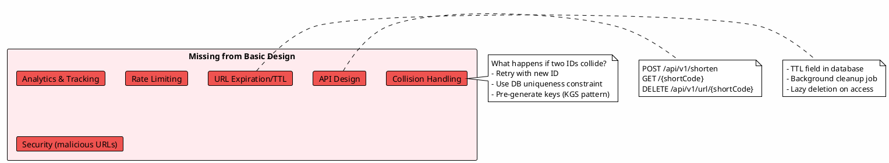

### Key Generation Service (Advanced Pattern)

For guaranteed uniqueness without collision checks:

```plantuml
@startuml kgs-pattern
!theme plain
skinparam backgroundColor #FEFEFE

rectangle "Key Generation Service (KGS)" #E8F5E9 {
    database "Unused Keys\nTable" as unused #C8E6C9
    database "Used Keys\nTable" as used #FFCDD2
    rectangle "KGS Server" as kgs #4CAF50
}

rectangle "URL Shortener\nService" as service #4A90D9

kgs -> unused : Pre-generate\nmillions of keys
service -> kgs : Request key
kgs -> unused : Mark as used
kgs -> used : Move to used table
kgs --> service : Return key "XyZ123"

note bottom of kgs
    Benefits:
    - No collision possible
    - No duplicate checks needed
    - Pre-computed = fast
end note

@enduml
```

---

## Interview Checklist

Use this checklist to ensure comprehensive coverage:

- [ ] **Requirements**: Clarify scale (URLs/month, retention, read:write ratio)
- [ ] **Back-of-envelope**: Calculate storage, throughput, bandwidth
- [ ] **ID Generation**: Explain Base58 choice and alternatives
- [ ] **API Design**: Define REST endpoints with parameters
- [ ] **Database**: Choose SQL vs NoSQL with justification
- [ ] **Caching**: Multi-tier strategy with sizing
- [ ] **Scaling**: Read replicas, sharding considerations
- [ ] **Collision Handling**: Retry logic or KGS pattern
- [ ] **Analytics**: Click tracking, geographic data
- [ ] **Security**: Rate limiting, malicious URL detection
- [ ] **Availability**: Failover, cross-region replication
