# Web Crawler System Design

> Based on "Design a web crawler" by Alexey Soshin (2021-2023)

## Table of Contents

1. [Problem Introduction](#problem-introduction)
2. [Core Concepts](#core-concepts)
3. [URL Handling](#url-handling)
4. [Basic Design](#basic-design)
5. [Content Fetching](#content-fetching)
6. [URL Uniqueness](#url-uniqueness)
7. [Priority and Scheduling](#priority-and-scheduling)
8. [Final Architecture](#final-architecture)

---

## Problem Introduction

### Web Crawler in a Nutshell

A web crawler is a system that systematically browses the internet to index web content. The basic operation cycle is:

1. **Get a URL** from the queue
2. **Fetch contents** from the web
3. **Store** the content
4. **Extract new URLs** from the content
5. **Repeat** the process

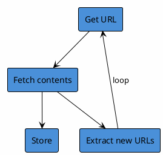

### Key Questions & Answers

| Question | Answer |
|----------|--------|
| How many links to crawl? | Entire Internet (~1.5 Billion sites) |
| Where to start? | Provided reference pages (seed URLs) |
| When does crawl end? | Never (continuous operation) |
| What's the result? | All pages sent to an indexer |

---

## Core Concepts

### URL Anatomy

Understanding URL structure is critical for the crawler:

```
https://www.gothamnews.com/2020/01/20?id=834131#comments
|_____|  |_________________| |_________| |_________| |_______|
protocol       host             path     parameters   anchor
```

**Important for crawling:**
- **Host + Path** are the key components for uniqueness
- **Protocol** matters (http vs https)
- **Parameters** may indicate different content
- **Anchor** typically ignored (same page content)

### When is a URL "New"?

The same URL can have different content at different times:

```
Date: 01/01/2020          Date: 31/12/2020
https://medium.com   vs   https://medium.com
      ^                         ^
   Different content (dynamic pages)
```

This leads to the need for **re-crawling** strategies based on content change frequency.

---

## Basic Design

### URL Queuing System

The crawler needs a queue to manage URLs to be processed:

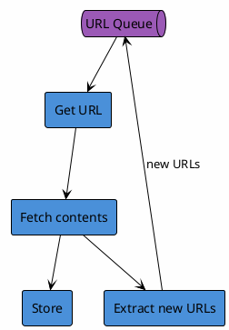

### Adding Page Content Queue

To decouple fetching from indexing, we add a content queue:

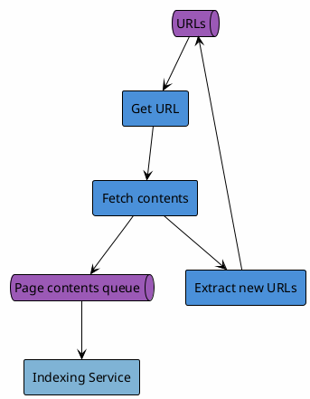

---

## Content Fetching

### Content Fetcher Component

The Content Fetcher is responsible for:
- DNS resolution
- HTTP requests
- Content retrieval

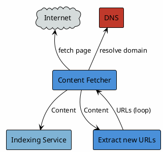

### DNS Resolution

Converting domain names to IP addresses:

```
Input:  medium.com
Output: 104.16.121.127
```

DNS lookups can be a bottleneck - consider caching DNS results.

### Headless Browser

For JavaScript-rendered content, a headless browser is needed:

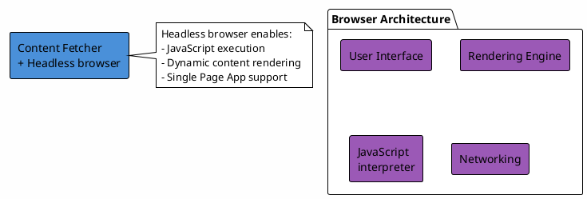

**Browser Components:**
- User Interface (not needed in headless mode)
- Rendering Engine
- JavaScript Interpreter
- Networking Layer

---

## URL Uniqueness

### The Uniqueness Problem

With 15 billion URLs to track, we need efficient deduplication:

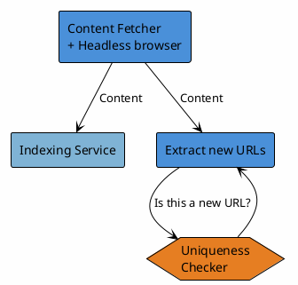

### Solution Comparison

#### Option 1: Bloom Filter

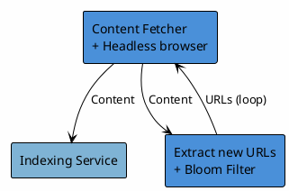

**Bloom Filter Analysis:**

| Aspect | Value |
|--------|-------|
| Memory for 15B URLs | ~50GB RAM |
| False positive rate | 1 in 1,000,000 |
| Pages never indexed | ~15,000 |

**Pros:**
- Very fast lookups O(k) where k = number of hash functions
- Space efficient compared to storing actual URLs

**Cons:**
- Memory requirements still significant
- False positives mean some URLs never crawled
- Cannot delete entries

#### Option 2: Key-Value Store (Redis)

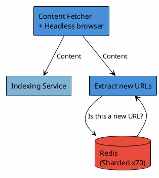

**Storage Calculation:**
- Average URL: 50 bytes
- 15B URLs = 750,000,000,000 bytes = **~700 GB**
- Requires ~70 Redis instances (10GB each)

**Pros:**
- No false positives
- Can store metadata (last crawl time, etc.)
- Supports deletion

**Cons:**
- Higher infrastructure cost
- Network latency for lookups

#### Option 3: Traditional Database (RDBMS)

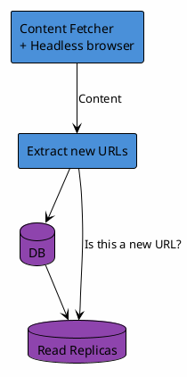

### Uniqueness Solution Summary

| Solution | Throughput | Consistency | Best For |
|----------|------------|-------------|----------|
| Bloom Filter | High | Weak | Maximum speed, tolerable misses |
| Redis | Medium | Medium | Balanced approach |
| RDBMS | Low | High | Accuracy-critical scenarios |

---

## Priority and Scheduling

### Requirements for the URL Queue

1. **Politeness** - Don't overwhelm any single domain
2. **Frequency** - Different domains need different crawl rates

### Politeness Implementation

The Prioritiser ensures we don't crawl the same domain too frequently:

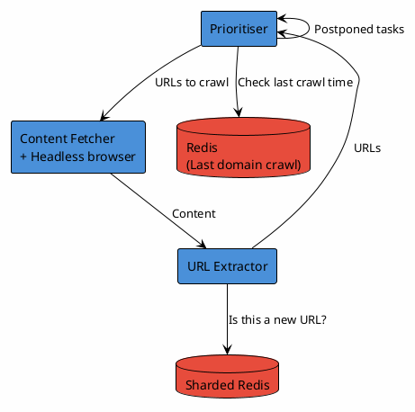

**Politeness Rules:**
- Track last crawl time per domain
- Delay crawling if domain was recently visited
- Postpone tasks that would violate politeness

### Frequency Adaptation

Adjust crawl frequency based on content change patterns:

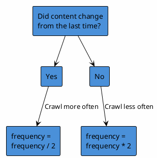

**Frequency Logic:**
- If content **changed**: Decrease crawl interval (crawl more often)
- If content **unchanged**: Increase crawl interval (crawl less often)

### Update Notifier

Track content changes to adjust frequency:

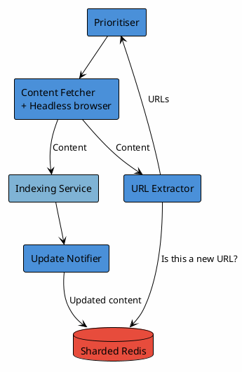

---

## Final Architecture

### Complete System Diagram

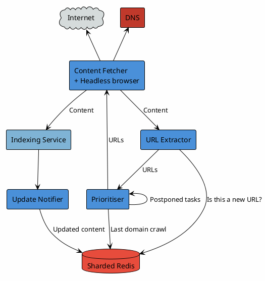

### Component Summary

| Component | Responsibility |
|-----------|---------------|
| **Prioritiser** | Manages URL queue, enforces politeness, handles scheduling |
| **Content Fetcher** | DNS resolution, HTTP requests, headless browser rendering |
| **URL Extractor** | Parses content, extracts links, checks uniqueness |
| **Sharded Redis** | Stores URL uniqueness data, domain crawl times, content hashes |
| **Indexing Service** | Processes and indexes crawled content |
| **Update Notifier** | Detects content changes, updates crawl frequency |

### Scalability Considerations

1. **Horizontal Scaling**
   - Multiple Content Fetcher instances
   - Sharded Redis cluster
   - Distributed URL queue (e.g., Kafka)

2. **Data Storage**
   - ~700GB for URL uniqueness (sharded across ~70 Redis nodes)
   - Consider bloom filters for initial filtering before Redis lookup

3. **Rate Limiting**
   - Per-domain rate limits
   - Respect robots.txt
   - Adaptive throttling based on server response times

4. **Fault Tolerance**
   - Queue persistence
   - Checkpoint/resume capability
   - Dead letter queue for failed URLs

---

## Key Takeaways

1. **Queue-based architecture** enables decoupling and scalability
2. **Politeness is mandatory** to avoid overwhelming servers and getting blocked
3. **Adaptive frequency** optimizes resources by focusing on changing content
4. **Choose storage wisely** based on throughput vs. consistency requirements
5. **Headless browsers** are necessary for modern JavaScript-heavy websites
6. **DNS caching** can significantly reduce latency

---

*Document generated from "Design a web crawler" presentation by Alexey Soshin (c) 2021-2023*
