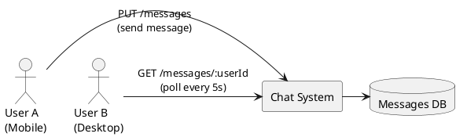
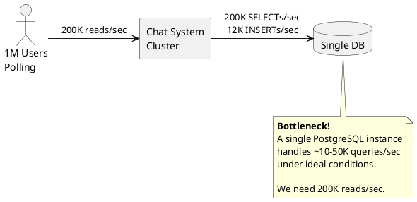
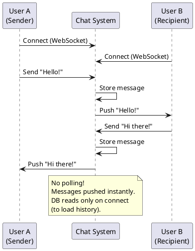
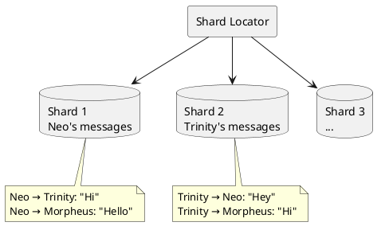
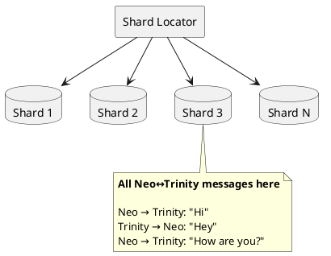
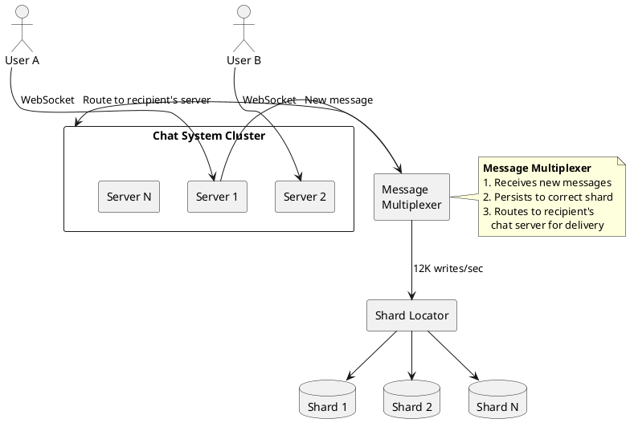
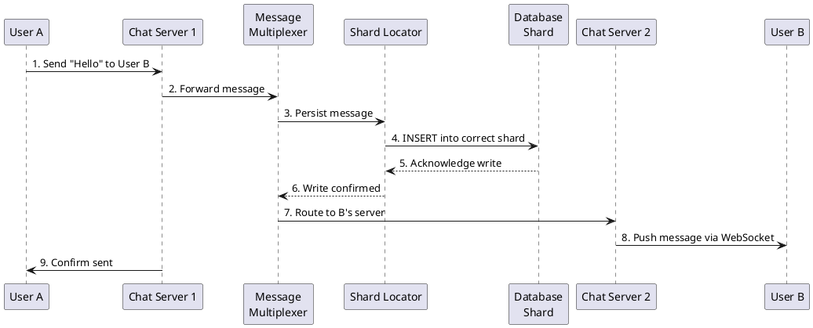
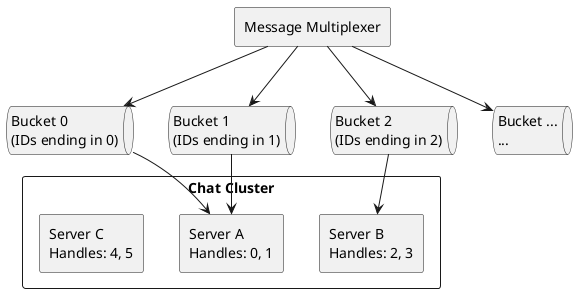
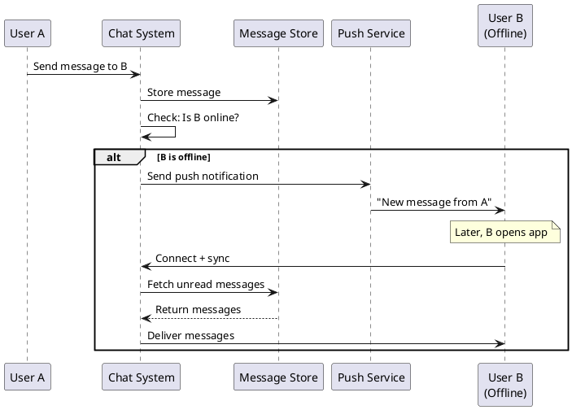

# Designing a Chat System at Scale

This document walks through the design of a 1:1 messaging system capable of handling 100 million users and 1 billion messages per day. We'll start from a naive approach and iteratively improve it, explaining the reasoning behind each architectural decision.

---

## Table of Contents

1. [Requirements & Scale Estimation](#1-requirements--scale-estimation)
2. [Starting Simple: The Polling Approach](#2-starting-simple-the-polling-approach)
3. [Identifying Bottlenecks](#3-identifying-bottlenecks)
4. [Scaling Reads: From Polling to Push](#4-scaling-reads-from-polling-to-push)
5. [Sharding the Database](#5-sharding-the-database)
6. [The Final Architecture](#6-the-final-architecture)
7. [Deep Dive: Message Routing](#7-deep-dive-message-routing)
8. [What's Missing: Production Considerations](#8-whats-missing-production-considerations)

---

## 1. Requirements & Scale Estimation

Before designing anything, we must understand what we're building.

### Functional Requirements

| Question | Answer |
|----------|--------|
| How many active users? | 100 million |
| Concurrent open chats? | 1 million |
| Messages per day? | 1 billion |
| Platforms supported? | Mobile and Web |
| Group chats? | No (1:1 only) |

### Deriving Throughput Numbers

These requirements translate into concrete engineering constraints:

**Write throughput (sending messages):**

```
1 billion messages/day
= 1,000,000,000 / 24 hours
= 41,666,667 messages/hour
= 694,444 messages/minute
≈ 12,000 messages/second
```

**Read throughput (if using polling):**

```
1 million open chats × (60 seconds / 5 second refresh interval) / 60 seconds
= 1,000,000 × 12 / 60
= 200,000 reads/second
```

This immediately tells us something important: **reads outnumber writes by 17:1**. Any design that requires polling will be dominated by read load.

---

## 2. Starting Simple: The Polling Approach

Let's begin with the simplest possible design and see where it breaks.

### Basic Architecture



### Database Schema

A minimal schema for storing messages:

| Column | Type | Description |
|--------|------|-------------|
| `id` | UUID | Unique message identifier |
| `from_user_id` | UUID | Sender's user ID |
| `to_user_id` | UUID | Recipient's user ID |
| `message` | TEXT | Message content |
| `sent_at` | TIMESTAMP | When the message was sent |

### Query Pattern

To fetch a conversation between Neo and Trinity:

```sql
SELECT *
FROM messages
WHERE (from_user_id = 'neo' AND to_user_id = 'trinity')
   OR (from_user_id = 'trinity' AND to_user_id = 'neo')
ORDER BY sent_at DESC
LIMIT 10;
```

**Problem with this query:** The `OR` clause prevents efficient index usage. Even with an index on `(from_user_id, to_user_id)`, the database must scan two index ranges and merge results.

---

## 3. Identifying Bottlenecks

Let's visualize where the load concentrates:



### The Numbers Don't Work

| Operation | Required | Typical DB Capacity | Gap |
|-----------|----------|---------------------|-----|
| Reads | 200,000/sec | 10,000-50,000/sec | 4-20x short |
| Writes | 12,000/sec | 5,000-20,000/sec | Marginal |

The read load from polling is unsustainable. We need a fundamentally different approach.

---

## 4. Scaling Reads: From Polling to Push

The insight: **most polls return nothing new**. If a user checks every 5 seconds but only receives a message every few minutes, 99% of polls are wasted work.

### Solution: WebSockets

Instead of clients asking "any new messages?", the server tells clients when messages arrive.



### Impact on Database Load

| Scenario | Reads/Second |
|----------|--------------|
| Polling every 5 seconds | 200,000 |
| WebSockets (read on connect only) | ~3,000* |

*Assuming average session length of 5 minutes with 1M concurrent users: 1M / 300 seconds = ~3,300 new connections/second needing history.

**This is a 60x reduction in read load.**

---

## 5. Sharding the Database

Even with WebSockets, we still have 12K writes/second and need to store billions of messages. A single database won't suffice long-term. We need to **shard** (horizontally partition) the data.

### Choosing a Shard Key

The shard key determines which database instance stores each message. A good shard key should:

1. **Distribute load evenly** across shards
2. **Keep related data together** (all messages in a conversation on one shard)
3. **Be deterministic** (same input always maps to same shard)

#### Attempt 1: Shard by Sender



**Problem:** A conversation between Neo and Trinity is split across two shards. To load their chat history, we must query both shards and merge results. This is slow and complex.

#### Attempt 2: Shard by Conversation (Naive)

What if we hash both participants?

```python
shard = hash(sender + receiver) % num_shards
```

**Problem:** Order matters!

```python
hash("Neo" + "Trinity")    → Shard 3
hash("Trinity" + "Neo")    → Shard 7  # Different shard!
```

Messages in the same conversation would scatter across shards.

#### Attempt 3: Shard by Conversation (Correct)

**Solution:** Sort participant IDs before hashing.

```python
def get_shard(user_a, user_b):
    # Sort ensures consistent ordering
    participants = sorted([user_a, user_b])
    conversation_key = participants[0] + ":" + participants[1]
    return hash(conversation_key) % num_shards
```

Now:
```python
get_shard("Neo", "Trinity")    → Shard 3
get_shard("Trinity", "Neo")    → Shard 3  # Same shard!
```



### Improved Query

With conversation-based sharding, we can add a `conversation_id` column:

```sql
-- conversation_id = sorted_hash(user_a, user_b)
SELECT *
FROM messages
WHERE conversation_id = 'neo:trinity'
ORDER BY sent_at DESC
LIMIT 10;
```

This query hits a single shard and uses a simple index lookup—much faster than the OR-based query.

---

## 6. The Final Architecture

Combining all our improvements:



### Component Responsibilities

| Component | Role |
|-----------|------|
| **Chat System Cluster** | Maintains WebSocket connections with users. Handles message send/receive. |
| **Message Multiplexer** | Decouples message ingestion from delivery. Ensures persistence before acknowledging. Routes messages to correct chat server. |
| **Shard Locator** | Computes which shard stores a conversation. Routes reads/writes to correct database. |
| **Sharded DB** | Horizontally partitioned message storage. Each shard handles a subset of conversations. |

### Data Flow: Sending a Message



---

## 7. Deep Dive: Message Routing

A critical question: **How does the Message Multiplexer know which Chat Server holds User B's connection?**

### The Problem

With multiple Chat Servers, users connect to different instances:

```
User A → Chat Server 1
User B → Chat Server 2
User C → Chat Server 1
User D → Chat Server 3
```

When User A sends a message to User B, the system must route it to Server 2.

### Solution: Handler Buckets

Each Chat Server subscribes to a subset of "buckets" based on user ID hashing:



**How it works:**

1. Message Multiplexer computes `bucket = hash(recipient_id) % num_buckets`
2. Publishes message to that bucket's queue
3. The Chat Server responsible for that bucket receives and delivers the message

**Benefits:**
- No central routing table needed
- Servers can be added/removed by reassigning buckets
- Each server only processes messages for its users

---

## 8. What's Missing: Production Considerations

The design above handles the happy path. A production system needs more:

### Offline Message Delivery

What if User B isn't connected?



### Presence Service

Track which users are online and on which server:

```
Redis:
  user:neo -> {server: "chat-server-1", last_seen: 1704387600}
  user:trinity -> {server: "chat-server-2", last_seen: 1704387590}
```

### Message Ordering

With distributed systems, messages can arrive out of order. Solutions include:

- **Sequence numbers per conversation**: Each message gets an incrementing ID
- **Timestamps with conflict resolution**: Use server timestamps, client reorders on display
- **Vector clocks**: For complex multi-device scenarios

### Delivery Receipts

Users expect sent/delivered/read indicators:

| Status | Triggered When |
|--------|----------------|
| Sent ✓ | Server acknowledges receipt |
| Delivered ✓✓ | Recipient's device acknowledges |
| Read (blue) | Recipient opens conversation |

### Technology Choices

| Component | Recommended Technology | Why |
|-----------|----------------------|-----|
| Message Store | Cassandra / ScyllaDB | High write throughput, natural sharding by partition key |
| Presence/Routing | Redis Cluster | Sub-millisecond lookups, pub/sub for routing |
| Message Queues | Kafka / Redis Streams | Durable, ordered message delivery |
| Chat Servers | Custom (Go/Rust/Java) | High connection count, low latency |

---

## Summary

We evolved from a naive polling design to a scalable push-based architecture:

| Version | Reads/sec | Writes/sec | Scalability |
|---------|-----------|------------|-------------|
| Polling + Single DB | 200,000 | 12,000 | ❌ Fails |
| WebSockets + Single DB | 3,000 | 12,000 | ⚠️ Limited |
| WebSockets + Sharded DB | 3,000 distributed | 12,000 distributed | ✅ Scales |

**Key takeaways:**

1. **Push beats pull** — WebSockets eliminate 98% of read load
2. **Shard key design matters** — Sorting participants ensures conversation locality
3. **Decouple ingestion from delivery** — Message Multiplexer enables independent scaling
4. **Plan for offline** — Real chat systems spend half their complexity on offline handling

This design handles 1 billion messages/day. For larger scale (WhatsApp/Messenger level), you'd add:
- Geographic distribution (regional clusters)
- Edge caching for media
- End-to-end encryption infrastructure
- More sophisticated presence and sync protocols
