# System Design — Answers & Explanations
## Batch 2: Q51–Q100

---

## Topic 4: SQL vs NoSQL Tradeoffs (continued)

---

### Q51. Append-Only Event Log Storage

**Correct Answer: B**

**Why B is correct:**
Cassandra's LSM tree is architecturally ideal for append-only workloads. Inserts are sequential log writes, not random B-tree updates — write amplification is minimal at 100K events/sec. Two partition strategies serve the two query patterns: `(user_id)` + `timestamp` clustering key for per-user queries; `(event_type)` + `timestamp` for per-type queries (dual write or materialized view). At 7-year retention with linear compaction and compression, Cassandra scales horizontally as data grows without operational rearchitecting.

**Why not A:**
PostgreSQL can handle this with aggressive time-based partitioning (monthly partitions, range constraint exclusion), but the operational burden of managing 84 monthly partitions over 7 years (creating, archiving, managing indexes) is significant. TimescaleDB handles this automatically — but the question is about general relational vs wide-column, and at 100K writes/sec, Cassandra's horizontal scaling and LSM writes are a better structural fit.

**Why not C:**
MySQL InnoDB B-tree index causes write amplification: each INSERT updates clustered index + secondary indexes. At 100K events/sec, InnoDB's random I/O during B-tree rebalancing saturates disk bandwidth on a single node. Partitioning helps but doesn't change the storage engine.

**Why not D:**
Elasticsearch as the only store is an operational anti-pattern: no ACID, eventual consistency with risk of data loss (translog settings-dependent), not designed for 7-year primary storage. Use Elasticsearch as a secondary search index synchronized from a durable primary (Cassandra or PostgreSQL).

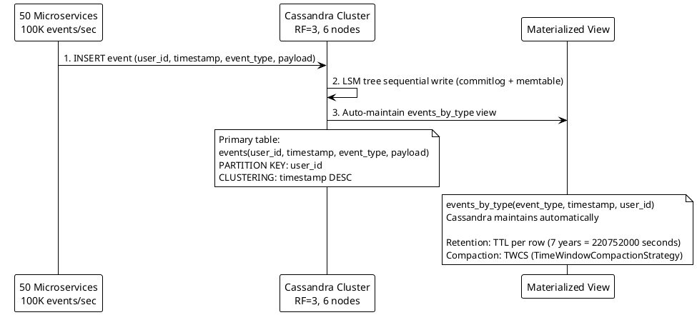

**Interview tip:** For append-only, time-ordered workloads at high write throughput, Cassandra's LSM tree is the architectural argument. Always state the partition key strategy — that's what the interviewer is testing.

---

### Q52. Inventory Count Under Flash Sale

**Correct Answer: B**

**Why B is correct:**
Redis Lua scripts execute atomically — Redis processes Lua as a single command, no interleaving with other clients. The script checks the current count, decrements only if > 0, and returns the result. At 500K concurrent requests, Redis queues them in its single-threaded event loop and processes each in microseconds. Latency: <1ms per decrement. No DB row lock, no retry storm. The result (remaining stock) is returned immediately to the caller, who can proceed or show "sold out."

**Why not A:**
`UPDATE ... WHERE stock > 0` is atomic at the SQL level, but the row lock under 500K concurrent writers causes extreme queuing. PostgreSQL's lock manager serializes 500K lock acquisitions — P99 latency would be measured in seconds, violating the 50ms budget. The semantics are correct; the performance at this concention level is not.

**Why not C:**
DynamoDB conditional writes are atomic and correct, but at 500K writes per second on a single item, the WCU cost is 500K × $0.00065 = $325/second = $19,500/minute during the flash sale. For a 30-minute sale: $585,000. Redis is dramatically more cost-effective for high-contention counters.

**Why not D:**
Optimistic locking generates a version mismatch on almost every request at 500K:10K contention. Near-100% retry rate means 500K retries → more retries → explosive database load. Optimistic locking assumes low contention — the exact opposite of a flash sale.

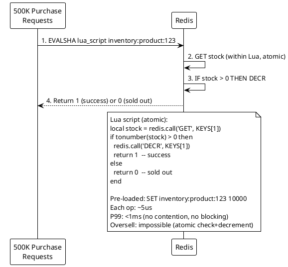

**Interview tip:** Flash sale inventory is the canonical Redis atomic counter question. Name the Lua script pattern explicitly — it's more specific than just "Redis." Interviewers expect you to know why Lua makes the check-then-decrement atomic.

---

### Q53. Geospatial Query Performance

**Correct Answer: B (Redis) or C (MongoDB) — context-dependent**

**Correct Answer: B for the stated requirements (sub-200ms reads, 100K writes/sec)**

**Why B is correct:**
Redis GEOADD stores driver locations as sorted set members using Geohash encoding. `GEORADIUS` (or the newer `GEOSEARCH`) returns members within a radius in O(N+log(M)) where N is members in the radius. At 100K writes/sec, Redis cluster handles location updates trivially (simple ZADD). `GEORADIUS` queries return in sub-millisecond — well under the 200ms target. This is the simplest architecture with the lowest latency for the stated access pattern.

**Why not A:**
PostGIS with GIST index is the correct relational answer and is used in production systems. However, 100K writes/sec of location updates on a single PostgreSQL node is challenging — each update is an indexed INSERT/UPDATE with GIST index rebalancing. Requires read/write splitting, possibly partitioning, and more operational overhead than Redis for this pure key-value geo access pattern.

**Why not C:**
MongoDB with 2dsphere index is correct and used in production at companies like Uber historically. It's a stronger primary store than Redis (persistence, richer data model) but has higher write latency per operation compared to Redis for pure location updates. Correct answer at larger scale where driver metadata (vehicle type, ratings) is also needed alongside location.

**Why not D:**
MySQL bounding box is an approximation. A 5km radius becomes a bounding box that includes corner points that are actually up to 5km × √2 = 7km away. Requires a second distance filter in application code. No native spatial index in standard MySQL (MariaDB has it). Performance is poor.

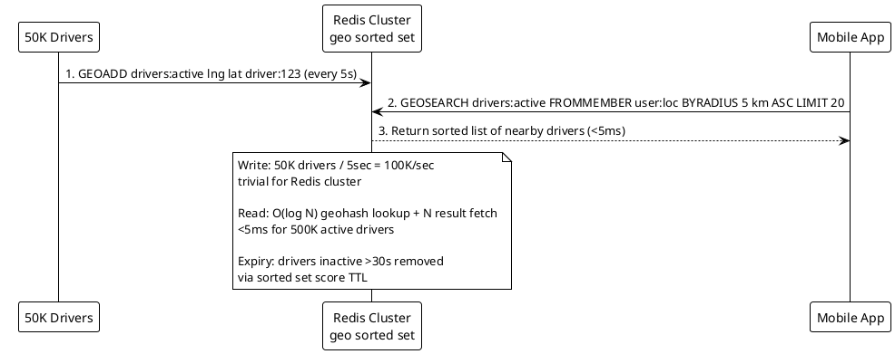

**Interview tip:** Redis GEOADD/GEOSEARCH is the canonical ride-sharing location query answer. For the follow-up "what if you need richer driver data alongside location?" — answer: Redis for location, PostgreSQL/MongoDB for driver profiles, join in application layer.

---

### Q54. Document Versioning Pattern

**Correct Answer: C**

**Why C is correct:**
The two-table approach separates the hot path (current version) from the cold path (version history). The `documents` table holds the current content — O(1) lookup. The `document_versions` table is append-only with `(doc_id, version, content, created_at)` — version history is never updated, only appended. Diffs between versions are computed in the application by fetching two specific version rows and comparing them. Storage: 100K × 500 × 50KB = 2.5TB, same as append-only, but queries are simpler and faster.

**Why not A:**
Overwriting loses history — violates the audit requirement explicitly.

**Why not B:**
A single append-only table works but "current version" requires a `MAX(version) GROUP BY doc_id` or subquery on every read. At 90% read traffic being for current versions, this is inefficient. Option C solves this with a direct current-document lookup.

**Why not D:**
Git-style delta compression reduces storage but requires replaying deltas to reconstruct historical versions — O(N) operations where N is the number of patches since the base. For a 500-version document, reconstructing version 250 requires applying 249 diffs. Acceptable for source code (small patches), expensive for 50KB legal documents with large diffs.

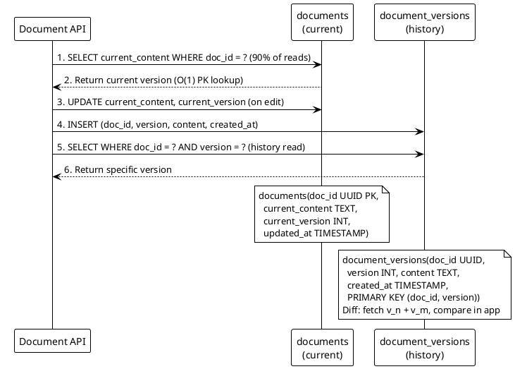

**Interview tip:** Two-table versioning (current + history) is the standard pattern when you have a mix of hot (current) and cold (historical) reads. Name the tradeoff: atomic update requires a transaction that writes both the `documents` row and inserts into `document_versions`.

---

### Q55. Multi-Tenant Data Isolation

**Correct Answer: C**

**Why C is correct:**
Tiered isolation matches the isolation requirement to the tenant tier's business value and compliance needs. Small tenants get shared schema (row-level isolation via `tenant_id` column) — operationally manageable and cost-efficient for 5,000 tenants. Medium tenants get schema-per-tenant in a shared cluster — logical isolation, schema changes scoped to one tenant's schema, no cross-tenant query risk. Enterprise tenants get dedicated database instances — physical isolation satisfies compliance audits, dedicated resources for performance predictability.

**Why not A:**
Shared schema for enterprise tenants fails their isolation requirement. "Our data is in the same database as 5,000 other customers" is a non-starter for enterprise contracts in regulated industries.

**Why not B:**
Database-per-tenant at 5,520 databases is operationally catastrophic. Connection pooling becomes complex (5,520 connection strings), schema migrations require running against 5,520 databases, monitoring 5,520 instances, and idle database overhead for 5,000 small tenants that could share a schema.

**Why not D:**
Schema-per-tenant (5,520 schemas in PostgreSQL) is a middle ground but impractical at the stated scale. PostgreSQL's catalog tables become very large with 5,520 schemas; `pg_class`, `pg_attribute` queries slow down; connection routing per schema is complex. Enterprise requirement of "separate DB" is also unmet.

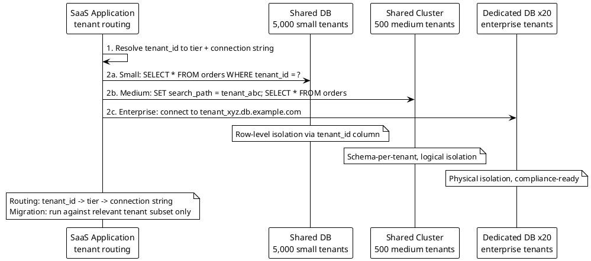

**Interview tip:** Multi-tenant isolation tiers are a Principal-level design topic. Know all three patterns and their tradeoffs. The correct answer for any specific scenario depends on the tenant's compliance requirements and the team's operational capacity.

---

### Q56. Write Amplification in Wide-Column Store

**Correct Answer: B**

**Why B is correct:**
In Cassandra, the only way to serve a query pattern that doesn't match the primary partition key is to maintain a separate table (materialized view or manually via dual write) with the desired partition key. Partitioning `events_by_type` on `(event_type)` makes Query B a native partition scan: `WHERE event_type = 'purchase' AND event_date = today`. Every event write goes to two tables — storage doubles, write throughput requirement doubles, but both queries are served efficiently with no cluster scan.

**Why not A:**
Cassandra local secondary indexes are maintained per-node. A query on a secondary index hits ALL nodes (one lookup per node) because the index is local, not distributed. For a high-cardinality column like `event_type`, this performs nearly as poorly as a full scan — and at 200K writes/sec, secondary index maintenance adds significant I/O overhead on every node.

**Why not C:**
Elasticsearch as a secondary read index is correct architecture — sync via Kafka CDC, Query B goes to Elasticsearch, Query A stays on Cassandra. It's operationally heavier than a Cassandra materialized view but avoids the dual-write complexity at the application level. Both B and C are valid; B is simpler if the team is already operating Cassandra.

**Why not D:**
Adding `event_type` to the partition key as a composite `(user_id, event_type)` changes the partition key for ALL queries. Query A `WHERE user_id = ?` now requires knowing event_type — no longer a simple partition lookup. You'd need a separate table for Query A too. This solves nothing and breaks the existing working query.

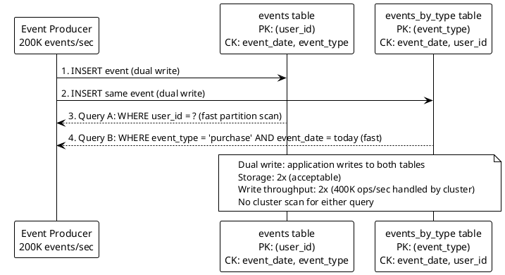

**Interview tip:** The canonical Cassandra rule: "Design your tables around your queries." For every distinct query pattern, you may need a separate table. State this rule explicitly — it's what the interviewer is testing.

---

### Q57. Consistency Level Tradeoffs in Cassandra

**Correct Answer: A**

**Why A is correct:**
QUORUM consistency means a majority of replicas (2 out of 3 at RF=3) must acknowledge. Write QUORUM: data written to 2 replicas before ACK. Read QUORUM: data read from 2 replicas, latest wins. Since W + R = 2 + 2 = 4 > RF (3), at least one node in the read quorum must have seen the latest write — strong consistency guaranteed. Single node failure tolerance: QUORUM requires 2 out of 3; losing 1 node still leaves 2 healthy nodes satisfying QUORUM for both reads and writes.

**Why not B:**
Write ONE + Read ALL: writes go to 1 replica (fast write), reads go to all 3 replicas. Read fails if any single node is down — violates "read available with 1 node down." W + R = 1 + 3 = 4 > RF: strong consistency, but read availability is fragile.

**Why not C:**
Write ALL + Read ONE: writes go to all 3 replicas (strong durability), reads go to 1 (fast). Write fails if any single node is down — violates "write available with 1 node down." W + R = 3 + 1 = 4 > RF: strong consistency, but write availability is fragile.

**Why not D:**
Write ONE + Read ONE: W + R = 2 ≤ RF (3). No overlap guaranteed — a read may go to a replica that hasn't received the latest write. Stale reads are possible. Neither strong consistency nor quorum availability guaranteed.

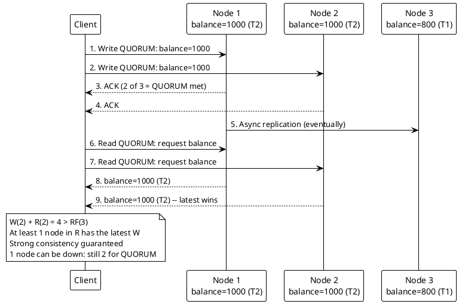

**Interview tip:** Know the formula W + R > RF = strong consistency. Know the single-node failure tolerance: QUORUM on RF=3 tolerates 1 failure. ALL tolerates 0 failures. ONE tolerates N-1 failures but gives up consistency.

---

### Q58. Time-Series Downsampling

**Correct Answer: B**

**Why B is correct:**
Continuous queries (InfluxDB Tasks, TimescaleDB Continuous Aggregates) automatically roll up raw data into progressively coarser resolutions as data ages. The architecture: raw 10-second data → 1-minute rollup (auto-computed) → 1-hour rollup → 1-day rollup. Dashboard queries the appropriate rollup based on the requested time range: last 1 hour → raw data (360 points); last 24 hours → 1-minute rollup (1,440 points); last 30 days → 1-hour rollup (720 points); last 1 year → 1-day rollup (365 points). All queries return <1,000 points regardless of time range → sub-50ms at all zoom levels.

**Why not A:**
Downsampling in application means the 8-second raw data scan still happens server-side. The computation moves from DB to application — latency is similar. The DB is still doing the heavy work. The application now adds serialization + transmission overhead on top.

**Why not C:**
Larger InfluxDB instance provides more CPU for aggregation but the bottleneck is I/O — scanning 3.1M raw time-series points. More CPU doesn't reduce the scan volume. Latency improvement is linear at best.

**Why not D:**
Pre-generated dashboard images eliminate query latency but also eliminate interactivity. Users can't zoom, pan, adjust time ranges, or apply filters. Not a data system solution — it's a degraded user experience.

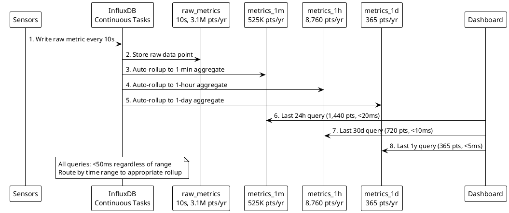

**Interview tip:** Downsampling/rollup architectures are a monitoring/observability staple. Know the terminology: "continuous aggregates" in TimescaleDB, "continuous queries" / "tasks" in InfluxDB, "rollup tables" in custom implementations. Show you know this is a standard pattern, not something you're inventing.

---

### Q59. Choosing Between DynamoDB and PostgreSQL

**Correct Answer: B**

**Why B is correct:**
The access pattern is a textbook DynamoDB use case: single-table, fixed schema, always query by primary key (user_id), no JOINs, no aggregations, high read throughput, latency-sensitive. DynamoDB's architecture — SSD-backed, consistent single-digit millisecond reads, automatic partitioning across nodes, no connection pool limits — is purpose-built for this pattern. At 50M users × 200 bytes, the table is ~10GB — trivially small. 200K reads/sec = 200K RCUs on-demand — provisioned in minutes.

**Why not A:**
PostgreSQL can serve this workload with read replicas, but requires connection pool management at 200K reads/sec (PgBouncer), replica lag monitoring, instance sizing, and failover configuration. DynamoDB eliminates this operational overhead for a use case that doesn't benefit from SQL capabilities.

**Why not C:**
Redis as a primary store for 50M user records requires persistence (AOF/RDB), backup strategy, and careful memory sizing (~10GB). Redis lacks the managed durability, point-in-time recovery, and operational simplicity of DynamoDB for a primary data store. Redis is better as a cache layer on top of DynamoDB for this scenario.

**Why not D:**
Cassandra's linear scale-out is a strength for write-heavy, multi-region workloads. For 200K reads/sec on a fixed schema with single-key access, Cassandra's operational overhead (multi-node cluster management, repair operations, compaction tuning) is disproportionate to the simplicity of the access pattern. DynamoDB is operationally simpler for this exact use case.

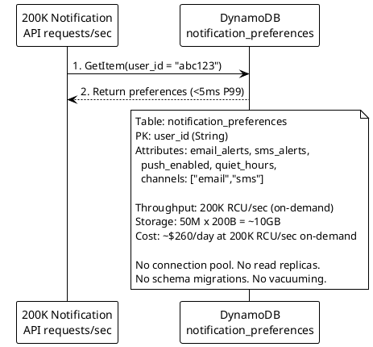

**Interview tip:** DynamoDB is correct when: single-table, key-value access, no JOIN, high throughput, low latency, and you don't need SQL. Know when PostgreSQL wins back: complex queries, transactions, JOINs, reporting. State the access pattern first, then justify the choice.

---

## Topic 5: Message Queues & Event Streaming

---

### Q60. At-Least-Once vs Exactly-Once Delivery

**Correct Answer: B**

**Why B is correct:**
At-least-once delivery with consumer-side idempotency is the pragmatic industry standard. Kafka guarantees at-least-once by default — messages may be redelivered on failure. The email service naturally handles duplicates (annoying but acceptable). The ledger service uses a `processed_payments` deduplication table: before processing, check if `payment_id` already exists; if yes, skip; if no, process and insert. This is cheaper and simpler than exactly-once semantics while providing the same effective guarantee.

**Why not A:**
Kafka transactions (exactly-once) across both consumers is the highest consistency guarantee, but requires: transactional producer configuration, consumer `isolation.level=read_committed`, and committing consumer offsets within the producer transaction. Added latency (typically 2–5ms per message) and complexity is unnecessary for the email service which doesn't need it.

**Why not C:**
At-most-once delivery acknowledges before processing. A consumer crash between ACK and processing means the ledger entry is permanently missing — an unrecoverable financial error.

**Why not D:**
At-most-once for the ledger is catastrophically wrong — missing ledger entries = lost transactions. At-least-once for email + at-most-once for ledger reverses the correct assignments.

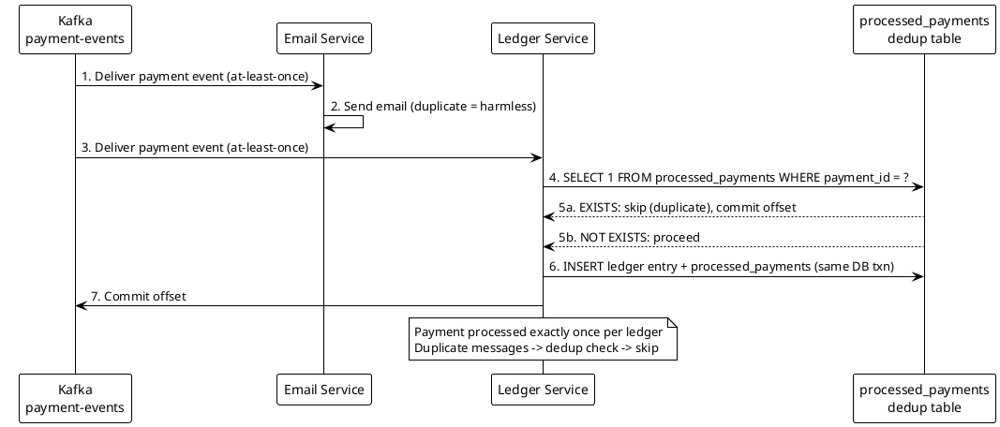

**Interview tip:** "Idempotent consumer" is the keyword. For any "exactly-once" requirement, ask: can we make the consumer idempotent instead of relying on the broker? Usually yes, and it's simpler.

---

### Q61. Kafka Partition Strategy

**Correct Answer: B**

**Why B is correct:**
Kafka guarantees ordering within a single partition. By using `customer_id` as the partition key, all orders for a given customer hash to the same partition consistently (murmur2 hash). Since one consumer instance owns each partition, all of customer ABC's orders are processed by the same consumer in the order they arrived. Different customers hash to different partitions and are processed in parallel. 10M customers distributed across partitions ensures even distribution across 100 consumers.

**Why not A:**
Round-robin (no key) distributes messages evenly but randomly. Order 1 for customer ABC lands on partition 3, order 2 on partition 7 — different consumers process them without coordination. Ordering is lost.

**Why not C:**
Random `order_id` has no semantic relationship to customer — distribution is even but ordering per customer is lost.

**Why not D:**
Timestamp-based partition key creates extreme hotspots: all orders in the same second (at 50K orders/sec) land on the same partition, processed by one consumer. The other 99 consumers are idle. Load distribution collapses.

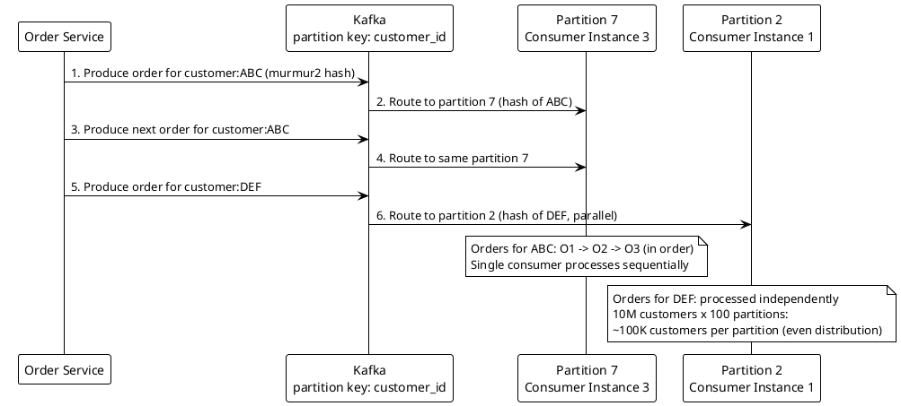

**Interview tip:** The partition key is the ordering unit. Always state: "ordering is guaranteed within a partition, not across partitions." Then map that to the business requirement: "per-customer ordering = customer_id as key."

---

### Q62. Dead Letter Queue Design

**Correct Answer: B**

**Why B is correct:**
Exponential backoff gives transient errors (DB timeout, network blip) time to resolve: first retry after 1 second, second after 5 seconds, third after 30 seconds. If all three retries fail, the message moves to the DLQ. Poison pills (malformed JSON) fail all retries and land in the DLQ after ~36 seconds — queue processing is unblocked. Business errors also go to DLQ where a human can review. The DLQ is monitored separately with alerting and a replay mechanism for recoverable business errors.

**Why not A:**
Dropping all failed messages means transient errors lose data permanently. Unacceptable for any production system where messages have value.

**Why not C:**
Infinite retry with backoff handles transient errors but poisons the system with poison pills that retry forever (just slowly). The DLQ never populates, there's no operational visibility into permanently broken messages, and the retry queue grows unboundedly.

**Why not D:**
Failure classification at publish time is impossible — the producer doesn't know the message is malformed until the consumer tries to parse it. Classification happens at consumption time.

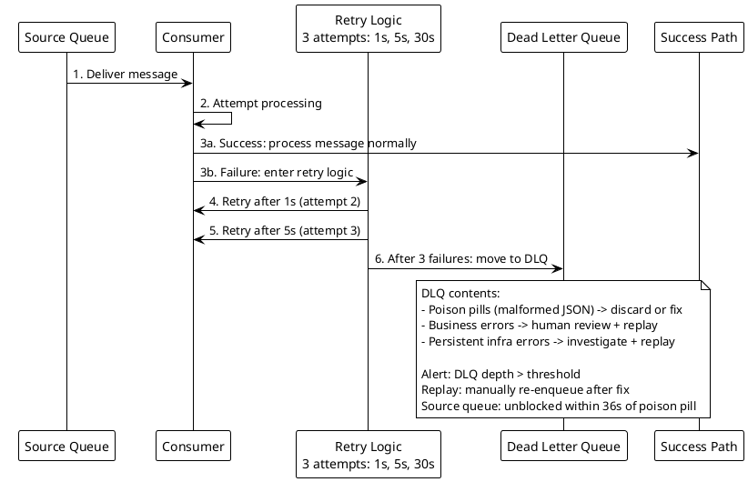

**Interview tip:** DLQ design always includes three components: retry policy, DLQ itself, and DLQ monitoring/replay. Name all three. Interviewers probe: "how do you know something is in the DLQ?" — answer: alerting on DLQ depth metric.

---

### Q63. Kafka Consumer Lag Alerting

**Correct Answer: B**

**Why B is correct:**
The gap is 100K messages/minute = ~1,667 messages/second. Consumer throughput is 400K/sec vs produce rate 500K/sec — a 100K/sec deficit. Adding 10 more consumer instances increases total throughput proportionally (assuming the bottleneck is consumer count, not external I/O). With 20 consumers at 40K/sec each = 800K/sec total > 500K/sec produce rate — lag begins closing. Critical prerequisite: the topic must have ≥20 partitions (one consumer per partition max). Long-term: profile the 5ms/message bottleneck — database writes, external calls, heavy computation — and optimize or offload async.

**Why not A:**
Restart doesn't increase throughput. If consumers are running normally (heartbeating, processing), restart is disruptive with no benefit. Restart is for stuck or crashed consumers, not throughput problems.

**Why not C:**
Kafka retention is a storage concern, not a throughput concern. Increasing retention keeps messages available longer but doesn't speed up consumption. Lag continues growing.

**Why not D:**
Throttling producers reduces supply to match consumption — at the cost of degrading the upstream system's throughput. The root problem (consumer under-provisioned) remains; you've just hidden it by slowing down the producer.

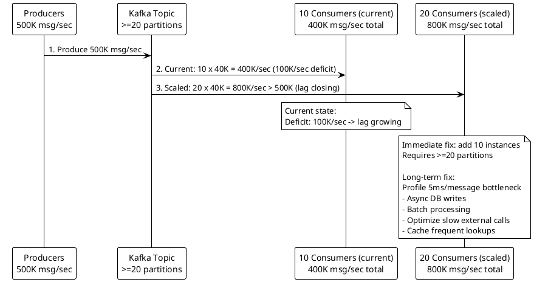

**Interview tip:** Consumer lag = produce_rate - consume_rate. The fix is always either: (1) increase consume rate (scale out consumers, optimize processing), or (2) decrease produce rate (throttle producers). Always prefer option 1 unless producers are actually overproducing relative to what the system can handle.

---

### Q64. Topic Compaction vs Retention

**Correct Answer: B**

**Why B is correct:**
Log compaction keeps the latest message for each key indefinitely, regardless of time. With `user_id` as the message key, Kafka retains the most recent profile update for every user — even users who haven't updated in years. A new downstream service reads the compacted topic from offset 0 and gets the current state of all 50M users. This is the "event sourcing with compaction" pattern: the compacted topic is a durable, replayable changelog that always reflects current state.

**Why not A:**
Increasing retention to 365 days helps but users who haven't updated in over a year are still missing. Any finite time-based retention window has the same fundamental problem: inactive users' state is lost.

**Why not C:**
External snapshot bootstrap is operationally correct but requires maintaining a separate snapshot mechanism (S3 export, database dump, etc.) in addition to Kafka. Log compaction eliminates the need for this because Kafka itself becomes the snapshot — the compacted topic IS the current state.

**Why not D:**
Dual-write to Kafka + key-value store is the correct pattern when Kafka compaction isn't used, but it adds a storage system that exists solely to compensate for missing compaction. Enabling compaction is simpler.

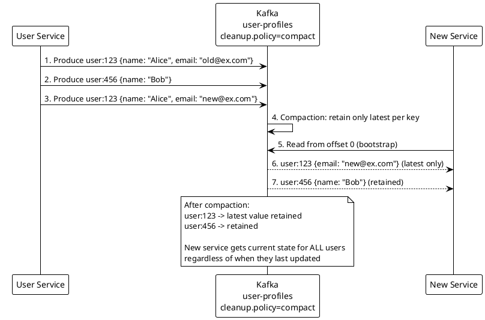

**Interview tip:** Log compaction turns Kafka into a distributed key-value changelog. The phrase to use: "Kafka becomes the system of record for current state." This is a powerful pattern that eliminates the bootstrap problem for new consumers.

---

### Q65. Pub/Sub vs Queue for Task Distribution

**Correct Answer: B**

**Why B is correct:**
A work queue (point-to-point messaging) delivers each message to exactly one consumer. Workers compete for messages — when worker 1 picks up an image, workers 2 and 3 don't see it. If worker 1 crashes mid-processing, the message visibility timeout expires and the message is returned to the queue for another worker. This is competitive consumption — the standard pattern for task distribution. SQS, RabbitMQ work queues, and Kafka consumer groups all implement this.

**Why not A:**
Pub/Sub delivers every message to every subscriber. With 3 worker subscribers, all 3 workers would process every image. 3× compute wasted, 3 thumbnails generated per image. Not the intended behavior.

**Why not C:**
Workers coordinating via shared state to avoid double-processing is reimplementing a queue with extra steps. The complexity of distributed coordination (who decides which worker skips?) is exactly what a queue provides for free.

**Why not D:**
Direct HTTP to a worker is synchronous: upload service blocks waiting for thumbnailing to complete. Worker downtime means uploads fail. No durability: if the worker is busy, the request is rejected or queued in-process (in-memory, not durable).

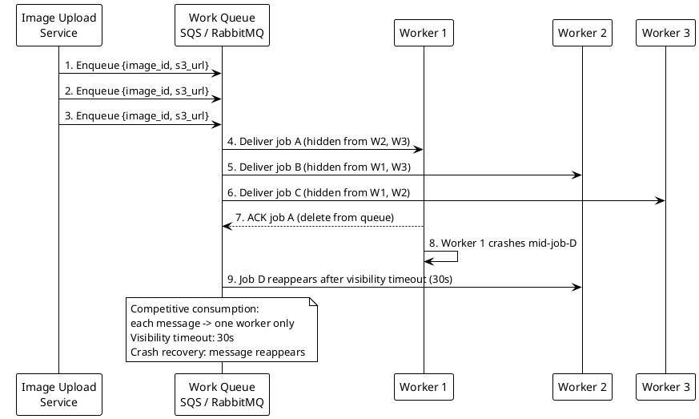

**Interview tip:** Queue vs Pub/Sub is a fundamental distinction. Queue: one consumer per message (competing consumers, task distribution). Pub/Sub: all consumers get every message (event fan-out, notifications). Get this distinction wrong in an interview and it's a red flag.

---

### Q66. Kafka vs RabbitMQ Selection

**Correct Answer: B**

**Why B is correct:**
Kafka's log-based storage enables independent consumer groups at different offsets — billing reads at its own pace, analytics can replay from 30 days ago, shipping processes in real-time. 500K events/sec is a standard Kafka throughput. Long-term retention is native. Use Case A maps perfectly to Kafka's design. RabbitMQ's routing exchanges (topic, direct, fanout, headers) provide flexible message routing that Kafka doesn't have natively — directing different email types to different worker queues is natural in RabbitMQ. At 100 tasks/sec, RabbitMQ's simpler operational model (no partition management, no offset tracking) is appropriate.

**Why not A:**
Kafka handles both technically, but Kafka's routing model (partition key-based) is less flexible than RabbitMQ's exchange/binding model for Use Case B's routing requirements. The question asks for the correct match, not just what works.

**Why not C:**
RabbitMQ at 500K events/sec with multiple consumer groups at different replay positions is outside its design. RabbitMQ deletes messages after consumption — replay from 30 days ago is impossible without a separate archive.

**Why not D:**
SQS lacks consumer groups with independent offsets. All consumers on an SQS queue compete for messages — different consumers cannot replay from different positions independently. SNS is pub/sub, not a task queue.

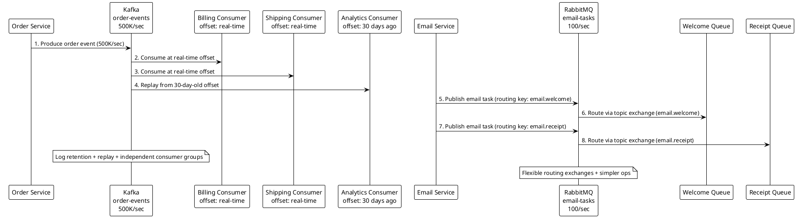

**Interview tip:** Know the core differentiators: Kafka = log retention + replay + multiple independent consumer groups + high throughput. RabbitMQ = complex routing + simpler ops + push-based delivery + message TTL. Match the strength to the use case.

---

### Q67. Saga Pattern for Distributed Transactions

**Correct Answer: B**

**Why B is correct:**
The Orchestration Saga uses a central Saga Orchestrator (often implemented as a state machine in the Order Service) that explicitly sequences commands and handles compensating transactions. When shipping fails: the orchestrator knows the current state (inventory reserved, payment charged, shipping failed) and issues compensating commands in reverse order: `CancelShipping` (no-op since it failed), `RefundPayment`, `ReleaseInventory`. The failure handling logic is in one place — the orchestrator — making it auditable, debuggable, and testable.

**Why not A:**
Choreography Saga works but creates implicit coupling through events. When shipping fails, it publishes a `ShippingFailed` event. Payment Service must listen for this event and know to refund. Inventory Service must listen and know to release. The compensation logic is distributed across services — hard to trace, hard to test, hard to change. For complex flows with multiple compensation paths, choreography becomes a distributed spaghetti of event reactions.

**Why not C:**
2PC requires all services to implement the XA protocol and coordinate through a transaction coordinator. Services with separate databases cannot participate in a single distributed transaction without XA support. Even if implemented, coordinator failure locks all participants indefinitely.

**Why not D:**
Retrying until all succeed doesn't handle the case where a service is permanently unavailable or the business operation is genuinely impossible (user's card declined). Without compensation, partial state (reserved inventory, charged payment, no shipment) is permanent.

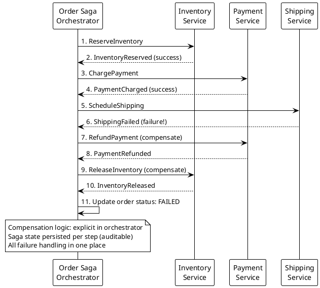

**Interview tip:** Orchestration vs Choreography Saga: orchestration = explicit coordinator, easier to understand and debug; choreography = implicit event reactions, simpler infrastructure but harder to trace. For complex multi-step workflows, orchestration is the safer choice.

---

### Q68. Outbox Pattern for Reliable Event Publishing

**Correct Answer: B**

**Why B is correct:**
The transactional outbox pattern leverages database ACID transactions to solve dual-write atomicity. Within a single database transaction: INSERT the order row AND INSERT an outbox record `{event_type: "OrderCreated", payload: {...}, published: false}`. Both succeed or both fail atomically. A separate outbox relay process (Debezium CDC on the outbox table, or a polling process) reads unpublished outbox records and publishes them to Kafka, then marks them as published. If the relay crashes after publishing but before marking published, the event is republished — idempotent consumer handles the duplicate.

**Why not A:**
Application-level try/catch retries Kafka publish on failure — correct for transient failures. But if the JVM crashes after `db.commit()` and before `kafka.send()`, the try/catch is gone. No retry will ever happen. The outbox pattern survives JVM crashes because the unpublished outbox record persists in the database.

**Why not C:**
Kafka transactions ensure atomic writes across multiple Kafka topics. They don't extend to external database writes. The database commit is outside the Kafka transaction boundary — it's a different system. Kafka EOS doesn't help here.

**Why not D:**
Kafka and most relational databases don't implement the XA protocol for distributed 2PC. Even if they did, 2PC has known coordinator failure issues and significant performance overhead.

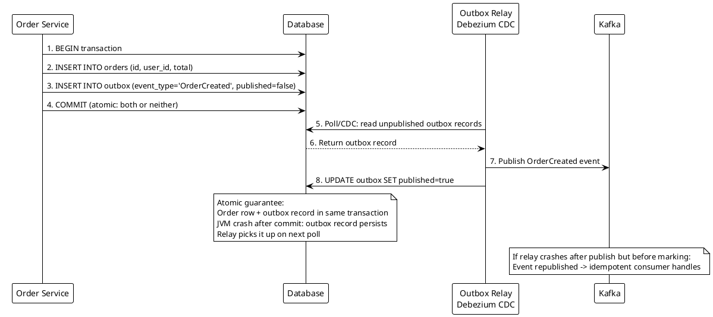

**Interview tip:** The outbox pattern is the canonical solution for "how do you atomically write to DB and publish to Kafka?" It comes up constantly in microservices interviews. Know the two relay approaches: (1) polling (simple, adds latency), (2) CDC (Debezium reads WAL, near real-time, operationally complex).

---

### Q69. Message Ordering in Distributed Systems

**Correct Answer: C**

**Why C is correct:**
Kafka guarantees ordering within a partition — consuming messages sequentially from partition 1 means Consumer B processes them in order. The ordering is broken when Consumer B uses internal parallelism: a thread pool inside the consumer where multiple threads process different messages concurrently. If thread 1 processes `AccountOpened` and thread 2 simultaneously processes `WithdrawalMade` (which arrived later), the withdrawal may complete before the account is opened in the state machine. Solution: process partition 1 in a single thread, OR use a per-key thread pool where `account_id: ABC-123` always maps to thread N, ensuring sequential processing for each account while still parallelizing across different accounts.

**Why not A:**
This answer describes the correct steady-state design (single consumer per partition, sequential processing). But the question asks "what breaks it" — the answer is internal consumer parallelism, not the partition assignment.

**Why not B:**
More consumers than partitions means extra consumers are idle (no partition to own). It doesn't break ordering for active partitions — each partition still has exactly one consumer.

**Why not D:**
Repartitioning does break ordering for in-flight messages — valid concern. But the question scenario doesn't describe repartitioning; it describes a static 3-partition, 3-consumer setup. This is a real concern for partition count changes but not the answer to this question.

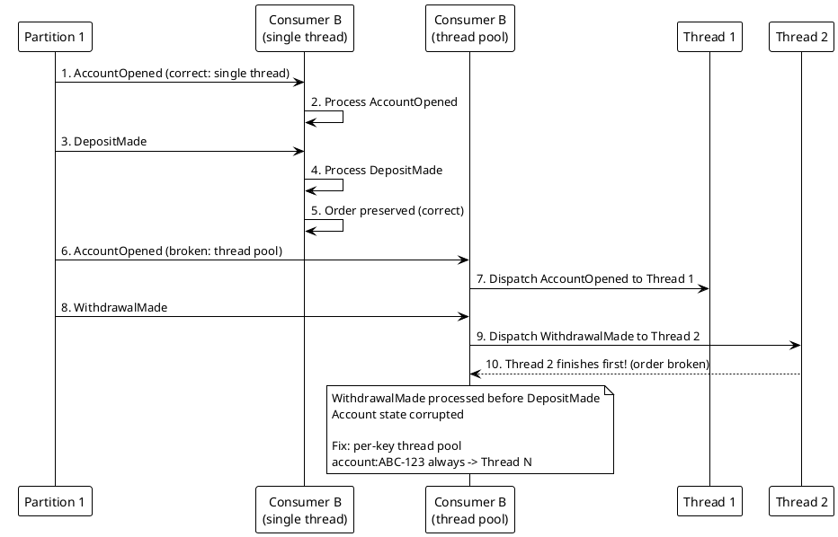

**Interview tip:** Kafka ordering guarantee is "within a partition, sequential." The failure mode is always parallelism inside the consumer — thread pools, coroutines, async processing. Always ask: "does the consumer process messages from the same partition concurrently?"

---

### Q70. Backpressure in Streaming Pipelines

**Correct Answer: B**

**Why B is correct:**
Flink's backpressure mechanism is built into its network stack. When a downstream operator (sink writing to the database) slows down, its input buffers fill. Flink propagates this buffer pressure upstream through the operator chain by slowing input consumption from the network (which slows the upstream operator). Eventually, the source operator reduces its Kafka poll rate — Kafka consumer lag grows (messages accumulate in Kafka safely), but the processor never buffers more than its configured capacity. This is credit-based flow control: operators signal "I can accept N more records" upstream.

**Why not A:**
Kafka retention keeps messages safe for longer, but doesn't prevent the processor from buffering records it has already consumed. The OOM is in the processor's in-flight buffers, not in Kafka.

**Why not C:**
Dropping events prevents OOM but violates the "no data loss" requirement. Events are in the processor (already consumed from Kafka) — dropping them means they're permanently lost.

**Why not D:**
More memory buys time. The fundamental throughput mismatch (source > sink) causes the same crash on the next traffic spike. Memory is not a solution, it's a delay.

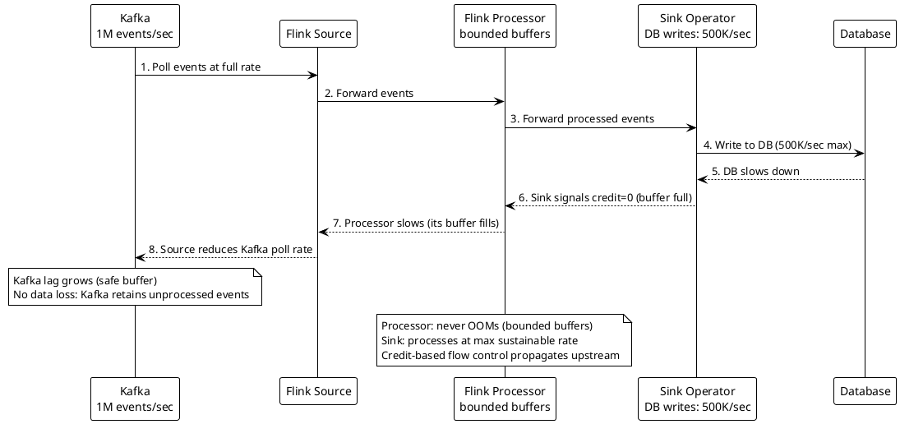

**Interview tip:** Backpressure is the mechanism that prevents "fast producer → slow consumer → OOM." The correct answer always involves propagating pressure upstream, not dropping messages or increasing memory. Name Flink's credit-based flow control if you know Flink; otherwise describe the concept: "slow the upstream consumption rate, don't buffer infinitely."

---

### Q71. Kafka Consumer Group Rebalancing

**Correct Answer: B**

**Why B is correct:**
The default eager rebalancing protocol (`RangeAssignor` or `RoundRobinAssignor`) revokes ALL partition assignments from ALL consumers at the start of a rebalance, then reassigns. Every consumer stops processing for the duration of the rebalance (the "stop-the-world" pause). `CooperativeStickyAssignor` implements incremental cooperative rebalancing: only the partitions that actually need to move are revoked and reassigned. Consumers that keep their partitions continue processing without interruption. A rolling deployment that stops one consumer only triggers reassignment of that consumer's 3 partitions — not a full-group stop.

**Why not A:**
Longer `session.timeout.ms` delays rebalance trigger after a consumer crashes. It doesn't change the rebalancing protocol itself — when a rebalance does trigger, the same stop-the-world eager approach applies. Also, 5-minute crash detection is operationally unacceptable.

**Why not C:**
Reducing consumer count reduces the number of restarts but each restart still causes a full eager rebalance. The processing pause per restart is unchanged.

**Why not D:**
Simultaneous deployment of all consumers creates a single large rebalance instead of 8 small ones. Eliminates the rolling rebalance issue but introduces higher deployment risk (all consumers down simultaneously if deployment fails).

```plantuml
@startuml
!theme plain
skinparam backgroundColor white

participant "Consumer 1\n(restarting)" as C1
participant "Kafka Broker\nGroup Coordinator" as GC
participant "Consumers 2-8\n(running)" as C28

== Eager Rebalancing (BEFORE) ==
C1 -> GC: 1. Leave group (restart)
GC -> C28: 2. Revoke ALL 24 partitions from ALL consumers
C28 -> C28: 3. All 8 consumers stop processing (30s pause)
GC -> C28: 4. Reassign all 24 partitions
C28 -> C28: 5. Resume processing

== CooperativeStickyAssignor (AFTER) ==
C1 -> GC: 6. Leave group (restart)
GC -> C28: 7. Revoke only 3 partitions (Consumer 1's)
C28 -> C28: 8. Other 7 consumers continue processing (no pause)
GC -> C28: 9. Reassign 3 partitions to remaining consumers

note over GC
  Cooperative: minimal disruption
  Only moved partitions experience brief pause
  Config: partition.assignment.strategy=
  CooperativeStickyAssignor
end note
@enduml
```

**Interview tip:** Know both rebalancing protocols by name: eager (default) = stop-the-world, cooperative (incremental) = minimal disruption. The config: `partition.assignment.strategy=org.apache.kafka.clients.consumer.CooperativeStickyAssignor`. This is a Kafka-specific but high-value interview answer.

---

### Q72. Event Sourcing vs Message Queue

**Correct Answer: B**

**Why B is correct:**
Message queues (SQS, RabbitMQ) are designed for workflow pipelines: durable, at-least-once delivery, retry on failure, messages deleted after consumption. Need A (order fulfillment pipeline) is exactly this pattern — pick, pack, ship is a sequential workflow where each step notifies the next, no replay needed, 24-hour TTL is fine. Event sourcing stores every state change as an immutable event, enabling rebuild, replay, and point-in-time query. Need B (account balance with audit) requires all three of these capabilities — an event store is the correct tool.

**Why not A:**
Message queues delete messages after consumption. Need B requires replaying all events to reconstruct state, answer point-in-time queries, and onboard new reporting services with full history. Queues cannot serve this use case.

**Why not C:**
Event sourcing for a fulfillment pipeline means each workflow step must project its state from events rather than simply receiving "do this next task." The complexity (projections, snapshot management, event versioning) is disproportionate to the requirement (simple sequential workflow notification).

**Why not D:**
A shared Kafka topic with long retention can serve both, but without compaction, Need B's state reconstruction requires replaying potentially years of uncompacted history. With compaction (as in Q64), Kafka + compaction approximates an event store. The cleaner architecture is a dedicated event store for Need B.

```plantuml
@startuml
!theme plain
skinparam backgroundColor white

participant "Order Placed" as OP
participant "SQS Queue\nfulfillment" as SQS
participant "Pick Service" as Pick
participant "Pack Service" as Pack

OP -> SQS: 1. Enqueue fulfillment task
SQS -> Pick: 2. Deliver: pick items
Pick -> SQS: 3. Enqueue pack task
SQS -> Pack: 4. Deliver: pack items

participant "Account Activity" as AA
participant "Event Store\nEventStoreDB" as ES
participant "Balance Projection" as BP
participant "Audit Report" as AR
participant "New Reporting Service" as NR

AA -> ES: 5. Append AccountDebited event
AA -> ES: 6. Append AccountCredited event
ES -> BP: 7. Project current balance (subscribe)
ES -> AR: 8. Replay events to date X (audit)
ES -> NR: 9. Replay from beginning (bootstrap new service)

note over SQS: Need A: workflow pipeline\nMessages deleted after consumption\n24-hour TTL sufficient
note over ES: Need B: audit trail + time-travel\nImmutable event log, replay, rebuild
@enduml
```

**Interview tip:** Event sourcing is not a better message queue — it's a different tool for a different job. Queue: workflow coordination, task distribution, fire-and-forget notifications. Event store: audit trails, time-travel queries, state reconstruction, consumer replay.

---

### Q73. SQS vs SNS vs EventBridge

**Correct Answer: B**

**Why B is correct:**
SNS fan-out to SQS queues is the AWS-native standard for event-driven fan-out with per-consumer retry. SNS publishes to multiple SQS subscriptions simultaneously. Each service has its own SQS queue with its own retry policy, DLQ, visibility timeout, and processing rate. SNS subscription filter policies enable Fraud Service to subscribe with `{ "amount": [{ "numeric": [">", 500] }] }` — only orders over $500 are delivered to that queue. Adding a new service = create SQS queue + add SNS subscription. Order Service is unchanged.

**Why not A:**
Single SQS queue with all consumers competing means each message is processed by exactly one consumer (competitive consumption). Each service won't receive every message — they share messages. Wrong pattern for fan-out.

**Why not C:**
EventBridge is correct and more powerful (content-based routing, schema registry, cross-account delivery, event archiving), but for straightforward fan-out with filtering, SNS+SQS is simpler and cheaper. EventBridge is the better answer when routing rules are complex or events come from SaaS partners.

**Why not D:**
SQS FIFO supports ordering within message groups, but consumers on the same queue still share messages. Multiple services can't independently receive every message from one FIFO queue without a fan-out mechanism.

```plantuml
@startuml
!theme plain
skinparam backgroundColor white

participant "Order Service" as OS
participant "SNS Topic\norder-placed" as SNS
participant "SQS: Email Queue" as EQ
participant "SQS: Inventory Queue" as IQ
participant "SQS: Analytics Queue" as AQ
participant "SQS: Fraud Queue\nfilter: amount > 500" as FQ

OS -> SNS: 1. Publish order-placed event
SNS -> EQ: 2. Fan-out to Email Queue (all orders)
SNS -> IQ: 3. Fan-out to Inventory Queue (all orders)
SNS -> AQ: 4. Fan-out to Analytics Queue (all orders)
SNS -> FQ: 5. Fan-out to Fraud Queue (filter: amount > 500)

note over SNS
  Each SQS queue:
  - Own retry policy (3 retries)
  - Own DLQ
  - Own consumer scaling
  - Own processing rate

  Adding new service:
  1. Create new SQS queue
  2. Add SNS subscription
  3. Order Service unchanged
end note
@enduml
```

**Interview tip:** The SNS+SQS pattern is called "SNS fan-out." Know it by name. The key benefits: decoupled consumers, independent retry, per-consumer filtering, extensible without producer changes. This pattern appears in almost every AWS architecture interview.

---

### Q74. Kafka Exactly-Once Semantics

**Correct Answer: C**

**Why C is correct:**
Kafka's exactly-once semantics requires both sides: idempotent producer (prevents producer-side duplicates from network retries) AND transactional consumption (consumer reads only committed messages, commits its offset atomically with its processing output). The Kafka transaction API allows: begin transaction → consume from input topic → produce to output topic (or update state) → commit offsets + transaction atomically. If the consumer crashes after processing but before committing, the transaction is rolled back — message is reprocessed. With `isolation.level=read_committed`, downstream consumers only see committed messages. This is true end-to-end EOS within Kafka.

**Why not A:**
Producer idempotence (`enable.idempotence=true`) prevents producer retries from creating duplicates. But if the consumer commits its offset and then crashes before updating the ledger (or vice versa), reprocessing still occurs — consumer-side duplication is not handled.

**Why not B:**
Idempotent producer + consumer deduplication table is pragmatic and often sufficient. It handles both failure modes but requires a separate deduplication store (additional infrastructure, additional query per message). For financial systems requiring the strongest guarantee within Kafka, option C is more rigorous.

**Why not D:**
`acks=all, retries=0` = at-most-once. The producer doesn't retry on transient failures — messages are permanently lost if the initial send fails. This is the worst outcome for a payment system.

```plantuml
@startuml
!theme plain
skinparam backgroundColor white

participant "Payment Processor\ntransactional producer" as PP
participant "Kafka\ntransactions topic" as KIn
participant "Kafka\nledger topic" as KOut
participant "Downstream Consumer\nread_committed" as DC

PP -> PP: 1. producer.beginTransaction()
PP -> KIn: 2. consumer.poll() -- read payment event
PP -> PP: 3. Process payment
PP -> KOut: 4. Produce to ledger-topic (within txn)
PP -> KIn: 5. consumer.commitSync() (within txn)
PP -> PP: 6. producer.commitTransaction()

KOut -> DC: 7. Deliver committed messages only

PP -> PP: 8. Crash after process but before commit
PP -> PP: 9. Transaction aborted, message reappears
PP -> PP: 10. Reprocessed exactly once per ledger

note over PP
  Producer: enable.idempotence=true
  transactional.id=payment-producer
  Consumer: isolation.level=read_committed
end note
@enduml
```

**Interview tip:** Kafka EOS is complex. In most interviews, answer B (idempotent producer + consumer dedup table) is sufficient and pragmatic. Reserve the full Kafka transaction API explanation (answer C) for when the interviewer explicitly asks about "Kafka exactly-once semantics" or pushes for the strongest guarantee.

---

## Topic 6: Microservices vs Monolith

---

### Q75. When to Stay Monolith

**Correct Answer: B**

**Why B is correct:**
The monolith is the correct architecture for a 4-person team with an evolving domain. Microservices add: service discovery, network failure handling, distributed tracing, inter-service authentication, independent deployment pipelines, and distributed data management — each requires specialized knowledge and operational tooling. A 4-person team cannot effectively operate and develop this infrastructure while also shipping product. More critically, the domain model is still changing weekly — stable service boundaries are the prerequisite for microservices. Premature extraction creates services whose boundaries will need to be redrawn as the domain matures, with all the distributed data migration cost that implies.

**Why not A:**
"Avoiding the big bang migration" is a false economy at this stage. The cost of prematurely extracted services with wrong boundaries (re-merging, redrawing boundaries) is higher than a future planned migration from a stable monolith with stable domain boundaries.

**Why not C:**
Billing is the worst starting point. It's deeply coupled to orders, users, and products. Extracting it first creates the most cross-service dependencies and the most complex distributed transaction scenarios. The correct first extraction is the most isolated, least-coupled service.

**Why not D:**
Serverless doesn't eliminate service boundaries — it distributes logic across functions. Function choreography in AWS Lambda has the same distributed systems complexity as microservices, often with worse observability and harder local development.

```plantuml
@startuml
!theme plain
skinparam backgroundColor white

participant "Developer" as Dev
participant "Spring Boot\nModular Monolith" as Mono
participant "billing module" as Bill
participant "products module" as Prod
participant "users module" as User
participant "orders module" as Order

Dev -> Mono: 1. Single deployment artifact
Mono -> Bill: 2. In-process call (no network)
Mono -> Prod: 3. In-process call (no network)
Bill -> Order: 4. Direct method call (same JVM)
User -> Order: 5. Direct method call (same JVM)

note over Mono
  Benefits:
  - Single deployment
  - In-process module calls (no network)
  - Clear module boundaries (enforced by build)
  - Extract when boundary is proven stable
  - 4-person team: manageable operational burden
end note
@enduml
```

**Interview tip:** The "modular monolith" is the correct intermediate answer for teams not yet ready for microservices. It enforces module boundaries through package/build structure while avoiding distributed systems complexity. Name it explicitly — interviewers appreciate the nuance.

---

### Q76. Service Boundary Identification

**Correct Answer: B**

**Why B is correct:**
Extracting Payment first addresses the concrete, non-negotiable business requirement (PCI-DSS isolation) and has the clearest boundary: payment APIs are well-defined, the domain is relatively small, and PCI-DSS scope reduction provides immediate business value. Establishing patterns with a well-bounded, lower-risk service (payment is isolated, not deeply entangled in other flows) before tackling more complex extractions (User Auth, Cart) is the correct sequencing.

**Why not A:**
Big bang migration: all services must be built and tested before any can go live. Teams block on shared integration work. Failure in one service delays all. High deployment risk.

**Why not C:**
Reporting extraction is the lowest operational risk (read-only) but lowest business priority. PCI-DSS is a compliance deadline; reporting latency is not. Extract what matters first.

**Why not D:**
Auth is the highest blast radius: every service calls it synchronously. If the extracted Auth Service has a 5-minute outage, every service in the monolith (which now calls Auth via HTTP instead of in-process) is partially or fully unavailable. The monolith's availability is now bounded by Auth Service's SLA. Extract it last, not first.

```plantuml
@startuml
!theme plain
skinparam backgroundColor white

participant "Monolith" as M
participant "Payment Service\n(Phase 1)" as Pay
participant "Notification Service\n(Phase 2)" as Notif
participant "Product Catalog\n(Phase 3)" as Prod
participant "User Auth\n(Phase 4)" as Auth

M -> Pay: 1. Extract first: PCI-DSS requirement
Pay --> M: 2. Clearest boundary, smallest blast radius

M -> Notif: 3. Extract second: stateless, fire-and-forget
Notif --> M: 4. Minimal coupling, low risk

M -> Prod: 5. Extract third: read-heavy, cacheable
Prod --> M: 6. Decoupled from transactions

M -> Auth: 7. Extract LAST: highest blast radius
Auth --> M: 8. All services depend on it, must be rock-solid

note over Pay: Establishes service patterns\nfor subsequent extractions
note over Auth: Last: every service depends on it\nMust be proven reliable before extraction
@enduml
```

**Interview tip:** Service extraction sequencing: start with the most isolated, least-coupled service. End with the most-coupled, highest-blast-radius service. Always state the blast radius reasoning — it shows you think about failure modes, not just technical boundaries.

---

### Q77. Strangler Fig Pattern

**Correct Answer: B**

**Why B is correct:**
The Strangler Fig pattern works by introducing a routing proxy that gradually redirects traffic from the legacy system to the new system, route by route. The proxy is the "strangler" — it sits in front of both systems and controls traffic split. New Product Service is built independently, tested, and when ready, the proxy config changes to route `/api/products/**` to it. Rollback is a single config change (seconds). The monolith is never touched. Other routes continue to the monolith unchanged. This is the textbook implementation of Martin Fowler's Strangler Fig Application pattern.

**Why not A:**
Updating all clients simultaneously requires coordinated deployment across all client teams. Rollback requires re-coordinating all clients to revert. With mobile apps, "all clients" includes app versions you can't force-update. Not instant rollback.

**Why not C:**
Shared database between old and new creates schema coupling. The new Product Service cannot evolve its schema independently. This is the "Integration Database" anti-pattern masquerading as a migration strategy.

**Why not D:**
The monolith cannot be safely modified — stated explicitly. Feature flags inside the monolith require modifying it.

```plantuml
@startuml
!theme plain
skinparam backgroundColor white

participant "Client Traffic" as Client
participant "Routing Proxy\nNginx / API Gateway" as Proxy
participant "New Product Service\nv1 - in production" as New
participant "Legacy Monolith\nall other routes" as Legacy

Client -> Proxy: 1. Request /api/products/123
Proxy -> New: 2. Route /api/products/** to new service
New --> Proxy: 3. Return product data
Proxy --> Client: 4. Forward response

Client -> Proxy: 5. Request /api/orders/456
Proxy -> Legacy: 6. Route /api/orders/** to monolith (unchanged)
Legacy --> Proxy: 7. Return order data
Proxy --> Client: 8. Forward response

note over Proxy
  Routing rules:
  /api/products/** -> New Product Service
  /api/orders/**   -> Legacy Monolith
  /api/users/**    -> Legacy Monolith
  /api/*           -> Legacy Monolith

  Rollback: change one line in proxy config
  Time to rollback: <10 seconds
  Monolith: untouched throughout
end note
@enduml
```

**Interview tip:** The Strangler Fig pattern always requires a routing intermediary (proxy, API Gateway, or facade). The key insight: the routing layer is where the "strangling" happens — not inside the monolith or the new service. Name Martin Fowler when explaining the pattern.

---

### Q78. Inter-Service Communication Pattern

**Correct Answer: B**

**Why B is correct:**
The inventory check requires a synchronous response — the order cannot proceed without knowing if the item is in stock. Synchronous REST is correct here. Notification and analytics are fire-and-forget: the order is placed whether or not the email is immediately sent. Decoupling via message queue means: notification/analytics failures don't affect order placement latency or reliability; Notification Service can be down for hours and messages queue up safely; analytics can replay from the queue.

**Why not A:**
Synchronous REST for all three couples Order Service availability and latency to Notification and Analytics Service health. A 2-second Notification Service timeout directly adds 2 seconds to order placement time. A Notification Service outage fails all orders.

**Why not C:**
Async inventory check means the order service acknowledges "order received" before knowing if the item is in stock. If inventory is unavailable, the order must be compensated (cancelled and refunded) — a much more complex flow than a synchronous "out of stock" response at order time.

**Why not D:**
Synchronous notification couples order placement success to email sending. An email service failure during a high-traffic sale would fail all orders. This is exactly the failure mode fire-and-forget messaging prevents.

```plantuml
@startuml
!theme plain
skinparam backgroundColor white

participant "Order Service" as OS
participant "Inventory Service" as Inv
participant "Message Queue" as MQ
participant "Notification Service" as Notif
participant "Analytics Service" as Analytics

OS -> Inv: 1. GET /inventory/{sku} (synchronous)
Inv --> OS: 2. 200: in-stock OR 409: out-of-stock

OS -> OS: 3. Create order (if in-stock)

OS -> MQ: 4. Publish notification-event (async, fire-and-forget)
OS -> MQ: 5. Publish analytics-event (async, fire-and-forget)

MQ -> Notif: 6. Deliver: send email (eventual, within seconds)
MQ -> Analytics: 7. Deliver: record event (eventual, within minutes)

note over Inv: Fail fast (synchronous)\nbefore order creation
note over MQ: Decouple (async)\nafter order creation\nService downtime = messages queue safely
@enduml
```

**Interview tip:** The decision rule: "Does the caller need the answer to proceed?" Yes → synchronous. No → async. Apply this to each integration in the system, not globally. Mixed patterns are correct and common.

---

### Q79. Service Mesh vs API Gateway

**Correct Answer: B**

**Why B is correct:**
API Gateway handles north-south (external) concerns: it's the single public entry point, terminates external TLS, enforces API keys/auth, rate limits external clients, handles API versioning, and provides developer portal functionality. Service Mesh handles east-west (internal) concerns: mTLS certificate rotation, per-service retry policies, circuit breaking, distributed tracing via sidecar injection, and traffic shaping for canary deployments — all without code changes to services. These are complementary tools solving different problems.

**Why not A:**
Routing ALL internal traffic through a central API Gateway creates a bottleneck: every service-to-service call must traverse the gateway. At high internal RPS, the gateway becomes the slowest link. It's also a single point of failure for all internal communication. Service meshes use sidecars (Envoy proxies running on the same pod) — no central bottleneck.

**Why not C:**
Service mesh ingress handles north-south traffic but lacks the API management features of a purpose-built gateway: developer portals, API key management, billing integration, API versioning, external rate limiting per API consumer. For internal use only, service mesh ingress is sufficient; for public APIs with external consumers, a purpose-built API Gateway is better.

**Why not D:**
Load balancers provide traffic distribution and basic health checking. They don't provide mTLS (beyond TLS termination at L7), circuit breaking, distributed tracing, or the advanced traffic policies a service mesh offers.

```plantuml
@startuml
!theme plain
skinparam backgroundColor white

participant "External Clients" as Ext
participant "API Gateway\nKong / AWS API GW" as GW
participant "Service A\n+ Envoy sidecar" as A
participant "Service B\n+ Envoy sidecar" as B
participant "Service C\n+ Envoy sidecar" as C

Ext -> GW: 1. HTTPS request (north-south)
GW -> GW: 2. Auth, rate limit, TLS termination
GW -> A: 3. Route to Service A
GW -> B: 4. Route to Service B

A -> C: 5. Internal call via sidecar (east-west, mTLS)
B -> C: 6. Internal call via sidecar (east-west, mTLS)
C --> A: 7. Response (retry, circuit breaker via mesh)

note over GW
  North-south: Auth (API keys, JWT)
  External rate limiting, TLS termination
  API versioning, Developer portal
end note

note over C
  East-west (Istio Service Mesh):
  mTLS: automatic cert rotation
  Retry: 3x with 100ms backoff
  Circuit breaker: 50% error threshold
  Tracing: x-b3-traceid injected
  All via sidecar, zero code changes
end note
@enduml
```

**Interview tip:** North-south vs east-west is the key framing. State it first. Interviewers want to hear you distinguish the two traffic types before recommending tools.

---

### Q80. Circuit Breaker Implementation

**Correct Answer: A**

**Why A is correct:**
Resilience4j CircuitBreaker with the described configuration correctly implements the three-state machine: CLOSED (normal operation), OPEN (fail fast), HALF-OPEN (probe recovery). When error rate hits 50% over 10 calls, the breaker opens — subsequent calls to Payment Service fail immediately (without waiting 5 seconds), freeing the thread pool instantly. After 30 seconds, one test call is allowed (HALF-OPEN). If 2/3 test calls succeed, the breaker closes. This breaks the cascading failure chain.

**Why not B:**
Retrying amplifies load on a degraded service. At 5-second timeouts, each retry holds a thread for 5 more seconds. Three retries per request × 5 seconds = 15 seconds per request. Thread exhaustion accelerates, not slows.

**Why not C:**
A 200ms timeout kills slow requests fast but still sends 100% of traffic to the failing Payment Service. The Payment Service gets 100% of the load — overload continues. The circuit breaker's value is reducing load on the downstream service by failing fast before even making the call.

**Why not D:**
Service discovery health check removal is a binary kill switch — zero traffic reaches Payment Service, including the percentage of calls that were succeeding. Graceful degradation (some orders process, some fail fast) is better than total Payment Service isolation.

```plantuml
@startuml
!theme plain
skinparam backgroundColor white

participant "Order Service" as OS
participant "Resilience4j\nCircuitBreaker" as CB
participant "Payment Service" as PS

== CLOSED State (normal) ==
OS -> CB: 1. Call payment
CB -> PS: 2. Forward request
PS --> CB: 3. Response (tracking error rate)
CB --> OS: 4. Return response

== Error rate hits 50% over 10 calls ==
CB -> CB: 5. STATE: OPEN

== OPEN State (fail fast) ==
OS -> CB: 6. Call payment
CB --> OS: 7. Immediate 503 "payment unavailable" (no call to PS)

== After 30 seconds: HALF-OPEN ==
OS -> CB: 8. Call payment (test call 1 of 3)
CB -> PS: 9. Forward test request
PS --> CB: 10. Response (tracking test results)
CB -> CB: 11. 2/3 succeed: STATE = CLOSED

note over CB
  slidingWindowSize: 10
  failureRateThreshold: 50
  waitDurationInOpenState: 30s
  permittedCallsInHalfOpenState: 3

  OPEN state: zero load on Payment Service
  Thread pool: freed instantly (no 5s wait)
end note
@enduml
```

**Interview tip:** Know the three states by name: CLOSED → OPEN → HALF-OPEN → CLOSED. Know what triggers each transition. Know the Java library: Resilience4j (modern, lightweight) or Hystrix (Netflix, deprecated). Interviewers expect you to name the implementation, not just the pattern.

---

### Q81. Data Consistency Across Services

**Correct Answer: B**

**Why B is correct:**
Event-driven data distribution eliminates synchronous inter-service queries. Each service publishes domain events when its data changes. Consuming services subscribe and maintain local projections of the data they need. Recommendation Service subscribes to `UserPreferencesUpdated` events — its local preference cache is updated within seconds, eliminating the User Service REST call. Search Service maintains its own user history projection. Both services are fully decoupled: if User Service is down, Recommendation and Search continue serving from their local projections. The User Service's load from other services drops to zero.

**Why not A:**
Adding User Service instances scales the bottleneck — operational cost grows with consumer traffic. The fundamental coupling (every consumer call = User Service call) remains. A User Service outage still affects all consumers.

**Why not C:**
Direct database access couples services through shared schema. User Service schema changes break all consuming services. The database becomes a shared integration point, not an encapsulated service concern.

**Why not D:**
GraphQL federation reduces over-fetching but doesn't eliminate synchronous dependency. Every request to Recommendation Service still requires a call to User Service for preferences. The load pattern is unchanged.

```plantuml
@startuml
!theme plain
skinparam backgroundColor white

participant "User Service" as US
participant "Kafka\nuser-events" as K
participant "Recommendation Service\nlocal preference cache" as Rec
participant "Search Service\nlocal history projection" as Search
participant "Analytics Service\nlocal event store" as Analytics

US -> K: 1. Publish UserPreferencesUpdated event
K -> Rec: 2. Deliver event (subscribe)
Rec -> Rec: 3. Update local preference cache
K -> Search: 4. Deliver event (subscribe)
Search -> Search: 5. Update local history projection
K -> Analytics: 6. Deliver event (subscribe)

note over US
  User Service: zero external read load
  Events published on data change only
end note

note over Rec
  Serve from local projections
  Lag: seconds (acceptable per requirement)

  User Service outage:
  Kafka buffers events
  Consumers serve stale data temporarily
  Consumers catch up when service recovers
end note
@enduml
```

**Interview tip:** "Don't query, subscribe" is the microservices data distribution principle. When a service is overwhelmed by reads from other services, the answer is almost always event-driven projection, not more instances. State the consistency tradeoff: "consuming services see user data with seconds of lag — acceptable within the stated requirements."

---

### Q82. Distributed Tracing Setup

**Correct Answer: B**

**Why B is correct:**
OpenTelemetry (OTel) is the vendor-neutral, CNCF-standard for distributed tracing, metrics, and logs. Language SDKs exist for Java, Go, Python, and 10+ others. A trace_id is generated at the API Gateway on first request. Each service creates a span, records timing, and propagates the trace context via HTTP headers (`traceparent: 00-{trace_id}-{span_id}-01`). Jaeger (or Zipkin) collects spans via OTLP and renders the full distributed trace as a waterfall diagram. The 8-second request appears as a timeline showing exactly which service contributed how much latency.

**Why not A:**
Centralized logging with `order_id` in every log line allows correlation of logs for a known request. It doesn't show causality (which service called which), timing relationships (did Payment call Fraud synchronously or async?), or the full call graph. You see all log lines but not why the 8 seconds elapsed.

**Why not C:**
Per-service APM tools (Datadog for Java, Prometheus for Go, New Relic for Python) provide excellent per-service visibility. But cross-service trace correlation requires all tools to share a trace ID format — different tools use different formats. A single distributed trace across 5 services in 3 APM systems requires manual stitching.

**Why not D:**
Start/end timing logs show each service's own duration but not the call graph. If Order Service calls Payment and Fraud in parallel, the logs don't show which call was on the critical path. Structured timing data without trace context is a partial solution.

```plantuml
@startuml
!theme plain
skinparam backgroundColor white

participant "API Gateway\ngenerate trace_id" as GW
participant "Order Service\nspan: 8000ms" as Order
participant "Inventory Service\nspan: 50ms" as Inv
participant "Payment Service\nspan: 7800ms" as Pay
participant "Fraud Service\nspan: 7750ms" as Fraud
participant "Jaeger" as J

GW -> Order: 1. Request (traceparent: trace_id=abc)
Order -> Inv: 2. Check inventory (propagate trace_id)
Inv --> Order: 3. 50ms response
Order -> Pay: 4. Charge payment (propagate trace_id)
Pay -> Fraud: 5. Check fraud (propagate trace_id)
Fraud --> Pay: 6. 7750ms response (BOTTLENECK)
Pay --> Order: 7. 7800ms response
Order --> GW: 8. 8000ms total response

Order -> J: 9. Report span (async)
Pay -> J: 10. Report span (async)
Fraud -> J: 11. Report span (async)

note over J
  Jaeger waterfall view:
  API Gateway: 8000ms
    Order Service: 8000ms
      Inventory: 50ms (ok)
      Payment: 7800ms (investigate)
        Fraud: 7750ms (ROOT CAUSE)

  Time to identify: 30 seconds
end note
@enduml
```

**Interview tip:** OpenTelemetry is the answer to "how do you instrument a polyglot microservices system for tracing?" Know the three signals: traces (request flows), metrics (aggregated measurements), logs (structured events). OTel handles all three with a single SDK.

---

### Q83. API Versioning in Microservices

**Correct Answer: A**

**Why A is correct:**
URL path versioning (`/api/v1/`, `/api/v2/`) is the most widely adopted strategy for managing breaking API changes across long-lived clients. It's explicit (visible in logs, monitoring, documentation), easily routable at the API Gateway, independently deployable, and simple to explain to mobile developers. The 18-month support window for v1 is manageable with clear deprecation notices. v1 returns `username`, v2 returns `handle` — the API Gateway or backend controller handles version routing.

**Why not B:**
Header versioning works correctly but is less visible. Mobile developers often forget to set custom headers, leading to support burden. Custom headers don't appear in browser URL bars, making manual testing harder. Less tooling support (Postman, curl, browser testing all require extra configuration).

**Why not C:**
Consumer-driven contracts (Pact) verify compatibility between known, controlled services. They don't solve the problem of unknown mobile app versions in the wild — millions of v1.x app installs that cannot be updated immediately.

**Why not D:**
Backwards-compatible additions (`handle` + `username` coexisting) are correct for non-breaking changes. But the scenario is a rename — maintaining both `username` and `handle` permanently is technical debt. Future consumers see both and are confused. URL versioning creates a clean break.

```plantuml
@startuml
!theme plain
skinparam backgroundColor white

participant "Mobile Client\n(old app version)" as OldClient
participant "Mobile Client\n(new app version)" as NewClient
participant "API Gateway" as GW
participant "v1 Controller\n/api/v1/users/{id}" as V1
participant "v2 Controller\n/api/v2/users/{id}" as V2

OldClient -> GW: 1. GET /api/v1/users/123
GW -> V1: 2. Route to v1 controller
V1 --> GW: 3. {"username": "johndoe", "email": "john@ex.com"}
GW --> OldClient: 4. Return v1 response

NewClient -> GW: 5. GET /api/v2/users/123
GW -> V2: 6. Route to v2 controller
V2 --> GW: 7. {"handle": "johndoe", "email": "john@ex.com"}
GW --> NewClient: 8. Return v2 response

note over V1: Supported until: 18 months\nSunset header included\nDeprecation: Sunset: Tue, 01 Jun 2027
note over V2: Latest version: all new clients
@enduml
```

**Interview tip:** Know all three versioning strategies: URL path (explicit, most common), header (clean URLs, less visible), content negotiation (purist REST, hard to cache). State why you'd choose URL path for mobile APIs specifically: logging, debugging, and simplicity matter in mobile SDK environments.

---

### Q84. Service Discovery

**Correct Answer: B**

**Why B is correct:**
Kubernetes Service with ClusterIP provides stable DNS-based service discovery out of the box. Each Service gets a DNS entry: `{service-name}.{namespace}.svc.cluster.local`. kube-proxy maintains iptables rules that load-balance traffic across healthy pods (health check failures remove pods from endpoints). Pod IP changes are transparent to callers — they always call the Service DNS name. No additional infrastructure (no Eureka, no Consul) required.

**Why not A:**
Hardcoded IPs change on every pod restart, deployment, or scaling event. This is not a viable pattern in any dynamic environment.

**Why not C:**
Spring Cloud Eureka provides client-side service discovery — each service registers with Eureka and discovers others by querying it. Valid outside Kubernetes; redundant inside Kubernetes where the platform already provides DNS-based discovery. Adding Eureka means operating an additional service for a problem Kubernetes solves natively.

**Why not D:**
Direct Kubernetes API calls for pod IP lookup: each call requires RBAC permissions, involves an API server round-trip, and exposes internal Kubernetes implementation details to application code. The Service abstraction exists precisely to avoid this.

```plantuml
@startuml
!theme plain
skinparam backgroundColor white

participant "Order Service Pod" as OS
participant "Kubernetes Service\ninventory-service\nClusterIP: 10.0.0.15" as KS
participant "Pod 1\n192.168.1.10" as P1
participant "Pod 2\n192.168.1.11" as P2

OS -> KS: 1. http://inventory-service.default.svc.cluster.local/api/inventory
KS -> KS: 2. kube-proxy resolves DNS, load-balance via iptables
KS -> P1: 3. Route to healthy pod (round-robin)
P1 --> KS: 4. Response
KS --> OS: 5. Forward response

KS -> KS: 6. Pod 3 terminated, removed from endpoints
KS -> KS: 7. Pod restart: new IP 192.168.1.15 added automatically

note over KS
  DNS resolution unchanged for callers
  Endpoints controller auto-updates on:
  - Pod restart (new IP)
  - Health check failure (removed)
  - Scaling event (pods added/removed)
end note
@enduml
```

**Interview tip:** Kubernetes-native answers win in Kubernetes contexts. Kubernetes Service + DNS is simpler, more reliable, and zero operational overhead compared to any service registry. Know when to say "Kubernetes already handles this."

---

### Q85. Bulkhead Pattern

**Correct Answer: B**

**Why B is correct:**
The Bulkhead pattern isolates resource pools so that one consumer (bulk exports) cannot exhaust resources needed by another (premium API). Separate thread pools enforce the isolation: bulk exports get a pool of 50 threads — they can use all 50 without touching the premium pool. Premium API gets 150 threads — a traffic spike of 200 premium requests finds 150 threads available (not 200, but bounded gracefully). Resilience4j `ThreadPoolBulkhead` in Spring Boot implements this with minimal code change.

**Why not A:**
Rate-limiting bulk exports to 10 concurrent reduces the risk but doesn't eliminate it. If the 10 bulk exports consume 10 threads from a shared 200-thread pool, and 195 premium requests arrive, 195 - (200-10) = 5 premium requests are queued. Better, but still shared pool = still vulnerable.

**Why not C:**
Async bulk export processing reduces thread-holding time within bulk endpoints. But without separate pools, the async coordination (event loops, CompletableFuture chains) still competes for underlying resources at some layer (DB connections, event loop threads). Bulkhead is a cleaner isolation.

**Why not D:**
Horizontal scaling (more servers) means each new server still has the same contention between bulk exports and premium API on its own thread pool. You've replicated the problem, not solved it.

```plantuml
@startuml
!theme plain
skinparam backgroundColor white

participant "Premium API\nRequests (200)" as PReq
participant "Premium Thread Pool\n150 threads\nBulkhead A" as PPool
participant "Bulk Export\nRequests (50)" as BReq
participant "Bulk Export Thread Pool\n50 threads\nBulkhead B" as BPool
participant "Shared Backend" as Backend

PReq -> PPool: 1. 200 premium requests arrive
PPool -> Backend: 2. 150 served immediately
PPool --> PReq: 3. 50 queued briefly (acceptable)

BReq -> BPool: 4. 50 bulk export requests arrive
BPool -> Backend: 5. All 50 use Bulkhead B threads

note over PPool
  Bulkhead A: 150 threads
  Bulk exports: 0 impact on this pool
end note

note over BPool
  Bulkhead B: 50 threads
  Premium API: 0 impact on this pool

  @Bulkhead(name="bulk-export",
  type=THREADPOOL)
end note
@enduml
```

**Interview tip:** The bulkhead metaphor: ship compartments — a leak in one doesn't sink the whole ship. Apply it to thread pools, connection pools, and memory regions. Resilience4j is the standard Spring Boot implementation. Name the annotation: `@Bulkhead`.

---

### Q86. Microservice Testing Strategy

**Correct Answer: B**

**Why B is correct:**
Consumer-driven contract testing (Pact) is the industry standard for catching integration regressions between microservices without deploying all services together. The Order Service defines its expectations of Inventory and Payment API responses as a Pact contract file. The Inventory and Payment Services' CI pipelines verify they satisfy the Order Service's contract. If Inventory Service changes `stock_quantity` to `available_count`, its Pact verification fails — before the change is deployed. Embedded Kafka (EmbeddedKafkaBroker in Spring Boot Test) tests the Kafka producer/consumer without a real cluster.

**Why not A:**
Unit tests mock all external dependencies — they can't detect contract drift between services. If Inventory Service changes its response schema, unit tests with hand-written mocks pass but runtime breaks.

**Why not C:**
Staging integration tests catch real integration issues but inherits the 45-minute provisioning time and 20% flakiness. Flaky tests erode developer trust and slow CI. They should exist but not be the primary regression detection mechanism.

**Why not D:**
Mocks replicate the behavior of the real service at the time the mock was written. As the real service evolves, the mock diverges — tests pass but production breaks. This is identical to pure unit tests for cross-service contracts.

```plantuml
@startuml
!theme plain
skinparam backgroundColor white

participant "Order Service CI" as OCI
participant "Pact Broker" as PB
participant "Inventory Service CI" as ICI
participant "Payment Service CI" as PSCI

OCI -> OCI: 1. Run unit tests (fast, mock external)
OCI -> OCI: 2. Pact consumer test: define expectations
OCI -> PB: 3. Publish Pact contracts
OCI -> OCI: 4. Embedded Kafka: test event publishing

PB -> ICI: 5. Inventory CI fetches Order Service contract
ICI -> ICI: 6. Pact provider verification: does API satisfy contract?
ICI --> PB: 7. FAILS if response schema changed

PB -> PSCI: 8. Payment CI fetches Order Service contract
PSCI -> PSCI: 9. Pact provider verification

note over ICI
  Catches contract drift WITHOUT
  deploying Order Service
  No shared environment needed
end note

note over OCI
  Post-deploy: smoke test only
  1 test, no provisioning
  Catch deployment issues, not contract issues
end note
@enduml
```

**Interview tip:** Consumer-driven contracts invert the testing direction: the consumer defines what it needs, the provider proves it delivers. This is the key insight. "Provider tests" run in the provider's CI against the consumer's contract file — no shared environment needed.

---

## Topic 7: API Design

---

### Q87. REST vs gRPC Selection

**Correct Answer: B**

**Why B is correct:**
REST/JSON for mobile/browser APIs: universal client support (browsers have fetch API, mobile has HTTP libraries), human-readable JSON for debugging, OpenAPI tooling for documentation. gRPC for internal Java-Python service calls: protobuf binary encoding is 3–5× smaller than JSON (important for 4KB float vectors at 50K calls/sec), HTTP/2 multiplexing reduces connection overhead, strongly typed proto contracts catch schema mismatches at compile time, and code generation eliminates manual JSON serialization in both Java and Python.

**Why not A:**
JSON serialization of float arrays at 50K calls/sec: a 4KB float array in JSON (ASCII numbers with commas) is 12–20KB. A 4KB float array in protobuf (fixed-width binary floats) is 4KB. 3–5× larger payload × 50K calls/sec = significant bandwidth difference. Also, JSON serialization/deserialization of float arrays is CPU-intensive.

**Why not C:**
gRPC is not natively supported in browsers. `grpc-web` proxy is required, adding infrastructure complexity. For a mobile/browser API, REST is the correct choice — native HTTP support everywhere.

**Why not D:**
GraphQL is designed for flexible client-driven queries (useful when clients need different field subsets). An internal ML service calling an embedding API is a simple RPC pattern — the request and response are fixed. GraphQL's query flexibility adds overhead (query parsing, field resolution) with no benefit.

```plantuml
@startuml
!theme plain
skinparam backgroundColor white

participant "iOS / Android\nBrowser" as Client
participant "REST API\nJSON/HTTP 1.1" as REST
participant "Java Backend" as Java
participant "gRPC API\nProtobuf/HTTP 2" as GRPC
participant "Python ML Service" as ML

Client -> REST: 1. GET /api/products (JSON)
REST --> Client: 2. JSON response (human-readable, CDN-cacheable)

Java -> GRPC: 3. GetEmbedding(vector) (binary protobuf)
GRPC -> ML: 4. Forward protobuf (3-5x smaller than JSON)
ML --> GRPC: 5. Return embedding (type-safe, code-generated)
GRPC --> Java: 6. Deserialized response (compile-time schema check)

note over REST: Universal client support\nHuman-readable debugging\nOpenAPI documented\nNo client library needed
note over GRPC: Binary: 3-5x smaller than JSON\nHTTP/2: multiplexed, header compression\nCode gen: type-safe client in Java+Python\nStreaming: native bidirectional support
@enduml
```

**Interview tip:** The REST vs gRPC decision is client-type-driven: browser/mobile → REST; internal service-to-service → gRPC. State both rationales — the binary encoding advantage AND the code generation advantage. Interviewers want to see you reason about the tradeoffs, not just pick gRPC because it's faster.

---

### Q88. GraphQL vs REST for Mobile

**Correct Answer: B**

**Why B is correct:**
GraphQL's core value proposition for mobile: one endpoint, one round trip, exactly the fields needed. iOS requests `{ user { name } orders(limit:3) { id total } notifications { unread } }` in a single query — no over-fetching, no multiple requests. Android requests `{ user { name } recommendations(limit:5) { productId } }` — different shape from the same endpoint. As client requirements evolve, clients change their query, not the backend. This eliminates the BFF maintenance burden and the coordination overhead of managing multiple REST endpoint variants.

**Why not A:**
BFF is also a correct answer for this problem (and is what GraphQL is often implementing internally). The distinction: BFF requires maintaining iOS-specific and Android-specific endpoint code that must be updated when client needs change. GraphQL delegates schema traversal to the client — the backend exposes the full schema, clients query what they need. GraphQL is the more flexible and maintainable solution when client diversity is high.

**Why not C:**
`?fields=name,email` field filtering reduces over-fetching on a single endpoint but doesn't eliminate multiple round-trips (you still need three separate REST calls for user + orders + notifications). It also requires custom implementation per endpoint.

**Why not D:**
gRPC streaming is server-push (continuous data flow). A home screen loads data once per page view — this is request/response, not streaming. gRPC also requires native browser support (grpc-web proxy needed).

```plantuml
@startuml
!theme plain
skinparam backgroundColor white

participant "iOS Home Screen" as iOS
participant "GraphQL\nPOST /graphql" as GQL
participant "Android Home Screen" as Android

iOS -> GQL: 1. query { user { name avatar } orders(limit:3) { id total status } notifications { unreadCount } }
GQL --> iOS: 2. Single response: 3 data sources, exactly needed fields

Android -> GQL: 3. query { user { name } recommendations(limit:5) { productId imageUrl } }
GQL --> Android: 4. Different shape, same endpoint, no backend change

note over GQL
  REST alternative: 3 requests for iOS, 2 for Android
  Mobile latency: 3x worse on poor connections

  GraphQL: 1 request always
  Client schema changes: zero backend coordination
end note
@enduml
```

**Interview tip:** GraphQL's value is "client-driven queries eliminate over-fetching and under-fetching." Use this phrase. The tradeoff: GraphQL adds server-side complexity (resolver N+1, query complexity limits, schema stitching). Always mention the N+1 problem (covered in Q97) when discussing GraphQL.

---

### Q89. API Pagination Strategy

**Correct Answer: B**

**Why B is correct:**
Keyset pagination uses the last record's stable identifier (id or created_at) as a cursor. `WHERE id > :cursor ORDER BY id LIMIT 100` uses the B-tree primary key index — O(log N) lookup regardless of how deep into the dataset the cursor points. At 50M rows, page 500,000 (if using offset) scans 50M rows; keyset pagination scans 0 rows before the cursor and returns 100 rows from the index. Additionally, new inserts don't cause drift: the cursor is an immutable record ID, not a page number. Records inserted between page fetches don't shift existing cursors.

**Why not A:**
Larger page size reduces total requests but doesn't fix the O(N) scan at large offsets. `LIMIT 10000 OFFSET 40000000` still scans 40M rows.

**Why not C:**
Total count caching: with 5K inserts/sec, the count changes 5,000 times per second. Caching is invalidated constantly. Page boundaries shift with every insert. Drift is not solved.

**Why not D:**
Elasticsearch's `search_after` parameter implements keyset pagination. Adding Elasticsearch for pagination alone (not search) adds significant infrastructure overhead — Elasticsearch cluster, sync pipeline, operational complexity — for a feature that can be added to PostgreSQL with a single index and query change.

```plantuml
@startuml
!theme plain
skinparam backgroundColor white

note left
  BEFORE: Offset pagination
  GET /api/orders?limit=100&offset=49900000
  
  DB: LIMIT 100 OFFSET 49900000
  → scans 49.9M rows to find offset position
  → 45 seconds
  → page drift: 5K new inserts shift positions
end note

note right
  AFTER: Keyset (cursor) pagination
  GET /api/orders?limit=100&after=order_id:abc123
  
  DB: WHERE id > 'abc123' ORDER BY id LIMIT 100
  → B-tree seek to 'abc123': O(log 50M) = microseconds
  → Read 100 rows: fast
  → Response includes next cursor: last_id
  → No drift: cursor anchored to specific record ID
  
  Response: {
    data: [...],
    next_cursor: "order_id:xyz789"
  }
end note
@enduml
```

**Interview tip:** Know when keyset pagination doesn't work: when users need to jump to arbitrary pages (page 100 of 500) or sort by non-unique columns. For these cases, add a secondary sort by unique ID to make the key stable. Most real-world APIs don't need arbitrary page jumping.

---

### Q90. Rate Limiting Algorithm Selection

**Correct Answer: B**

**Why B is correct:**
Token bucket accumulates tokens over time (one token per request unit, up to bucket capacity). An API key that hasn't made requests for 30 minutes has 500+ accumulated tokens — it can burst at 50 requests/second briefly before the bucket empties. This is the desired behavior for Case A (organic bursting within the hourly limit). For Case B (payment API), a sliding window counter counts requests in the last 1-second window. At 10 requests, the 11th is rejected regardless of timing. No burst credit accumulates — the limit is enforced as a hard ceiling per rolling second.

**Why not A:**
Token bucket for both: token bucket allows bursting by design. A payment user who hasn't transacted for 10 minutes has 100 tokens accumulated — they can burst 100 transactions in a second. The fraud prevention hard limit of 10/second is violated.

**Why not C:**
Fixed window counter: resets at second boundaries. A user can make 10 requests at 0.9 seconds into the window, then 10 more at 1.0 seconds (new window). 20 requests in 100ms — the hard limit is violated at window boundaries.

**Why not D:**
Leaky bucket smooths all traffic to a constant rate (requests drip out at a fixed rate). For Case A, a public API user who bursts with legitimate traffic is artificially smoothed even if their hourly total is within limits. Over-restrictive for Case A.

```plantuml
@startuml
!theme plain
skinparam backgroundColor white

note left
  Case A: Token Bucket
  Capacity: 50 tokens
  Refill: 50/3600 tokens/sec (= hourly rate)
  
  Idle user (30 min) → 25 tokens accumulated
  Burst: 25 requests in 1 second → allowed
  After burst: bucket empty → 0.014 req/sec
  
  Total for hour: ≤1,000 (bucket cap enforces)
  Burst within hourly limit: ✓
end note

note right
  Case B: Sliding Window
  Window: 1 second rolling
  Limit: 10 requests
  
  Requests at t=0.1, 0.2, ..., 1.0: 10 requests
  Request at t=1.1: window slides
    → only count requests > t=0.1
    → 9 still in window → allow (10th)
    → request at t=1.2: 10 in window → REJECT
  
  No burst accumulation: ✓
  Hard 10/sec limit: ✓
end note
@enduml
```

**Interview tip:** Know all four rate limiting algorithms: Fixed Window (simple, boundary burst problem), Sliding Window (precise, more memory), Token Bucket (burst-friendly, most common), Leaky Bucket (smooth output, strict). The question always includes specific burst requirements — map the requirement to the algorithm.

---

### Q91. API Gateway Authentication Flow

**Correct Answer: C**

**Why C is correct:**
Local JWT signature validation eliminates the Auth Service round-trip for 200K req/sec. The gateway validates the JWT signature using the Auth Service's public key (fetched once and cached). A Redis revocation cache (`SET revoked:{jti} 1 EX {jwt_ttl}`) holds token IDs that have been revoked (logout, security incident). The gateway checks: (1) JWT signature valid → (2) token JTI not in Redis revocation set → allow request. Revocation is immediate (add to Redis on logout). The only latency added over pure local validation is one Redis lookup per request — sub-millisecond at Redis cluster scale.

**Why not A:**
Auth Service at 200K req/sec: Auth Service becomes a 200K TPS service that must be available for all requests. It's a synchronous bottleneck and single point of failure. Any Auth Service degradation directly impacts all API calls.

**Why not B:**
5-minute JWT expiry reduces the revocation window to 5 minutes — acceptable for some threat models. But it requires all clients to refresh tokens every 5 minutes, increasing Auth Service load (200K req/sec of refresh calls every 5 minutes). The approach is correct but C is superior: immediate revocation + minimal Auth Service load.

**Why not D:**
Session cookies validated against a session store per request is the pre-JWT architecture. At 200K reads/sec, the session store must be a high-performance Redis cluster — operationally similar to option C but with additional session management overhead (session creation, expiry, cleanup) that JWTs eliminate.

```plantuml
@startuml
!theme plain
skinparam backgroundColor white

[Client Request\n+Bearer JWT] --> [API Gateway]
[API Gateway] --> [Step 1: Verify JWT signature\n<<public key cached locally>>]
[Step 1: Verify JWT signature\n<<public key cached locally>>] --> [Step 2: Check Redis\nSET revoked:{jti} exists?]
[Step 2: Check Redis\nSET revoked:{jti} exists?] --> [Allow / Reject]

note right of [Step 2: Check Redis\nSET revoked:{jti} exists?]
  Cache hit (revoked): reject 401
  Cache miss (valid): allow request
  
  Revocation (logout):
  Auth Service → Redis SET revoked:{jti} 1 EX {ttl}
  Next request: cache hit → immediate 401
  
  Auth Service load: zero reads
  Redis: 200K reads/sec (trivial for Redis cluster)
  Revocation: immediate ✓
end note
@enduml
```

**Interview tip:** JWT authentication has a fundamental tension: local validation (fast, no revocation) vs. centralized validation (slow, immediate revocation). The revocation cache pattern resolves it. Know the acronym: JTI = JWT ID (the unique identifier per token used as the revocation cache key).

---

### Q92. WebSocket vs Server-Sent Events vs Long Poll

**Correct Answer: B**

**Why B is correct:**
SSE for Case A: sports scores update server→client only. SSE is a unidirectional HTTP/2 stream — clients connect and receive a stream of events. Auto-reconnect on disconnect is built into the EventSource API. HTTP-based (no firewall issues), lower overhead than WebSocket for one-way push at 500K clients. WebSocket for Case B: collaborative editing requires bidirectional communication — client sends edits, server pushes other users' edits simultaneously. WebSocket is the correct choice for low-latency bidirectional real-time. Long Poll for Case C: order status changes 3–5 times over hours. Long polling opens an HTTP connection, server holds it until an update occurs, client reconnects. For infrequent updates over long time periods, long polling's connection overhead (one request per update) is far more efficient than maintaining 1M persistent SSE or WebSocket connections with almost no data flowing.

**Why not A:**
WebSocket for all: WebSocket is overkill for server-only push (Case A) and for infrequent updates (Case C). 1M persistent WebSocket connections for order tracking that sends 5 messages over 3 hours is wasteful — each connection occupies server memory with no activity.

**Why not C:**
Long Poll for Case A: sports scores update ~5 times/minute. Long polling reconnects after each update. At 500K viewers × 5 reconnects/minute = 2.5M HTTP requests/minute. SSE holds one persistent connection per viewer with data pushed as-needed — 500K connections, 2.5M data frames. SSE is more efficient.

**Why not D:**
gRPC streaming requires grpc-web for browsers. Not browser-native without a proxy. More appropriate for mobile apps or backend-to-backend streaming.

```plantuml
@startuml
!theme plain
skinparam backgroundColor white

note left
  Case A: SSE (Server-Sent Events)
  GET /api/sports/scores (EventSource)
  ← HTTP/2 stream of events →
  
  event: score-update
  data: {"game": "LAL vs GSW", "score": "98-95"}
  
  Auto-reconnect: built into EventSource API
  Firewall: HTTP (no special config)
  500K connections: one SSE stream each
end note

note right
  Case B: WebSocket
  ws://collab/documents/{id}
  
  Client → Server: {type: "edit", delta: {...}}
  Server → Client: {type: "edit", user: "alice", delta: {...}}
  
  Bidirectional: ✓
  <50ms latency: WebSocket frame overhead ~2 bytes
  10K editors: managed via connection registry
end note

note below
  Case C: Long Polling
  GET /api/orders/{id}/status?since={timestamp}
  → Server holds connection until status changes
  → Returns when changed: {status: "SHIPPED"}
  → Client immediately reconnects
  
  1M connections: but mostly idle (minutes between updates)
  Resource: connection held, no data flowing (acceptable)
end note
@enduml
```

**Interview tip:** Know the three protocols and their use cases cold: SSE = server→client push, HTTP-based, auto-reconnect; WebSocket = bidirectional, persistent, low-latency; Long Poll = infrequent updates, HTTP-based, compatible with all infrastructure. The question always includes directionality — that's the primary filter.

---

### Q93. Idempotency Keys in REST APIs

**Correct Answer: B**

**Why B is correct:**
Store the idempotency key + full response before returning to the client. On every incoming request: check the idempotency key in the store first. If found, return the stored response immediately without processing. If not found, process the payment, store `{key, status, response_body, created_at}` atomically with the payment record, then return. All three retries with the same UUID return the same stored response — payment processed exactly once. Key TTL (24 hours) ensures storage doesn't grow unbounded.

**Why not A:**
Server-assigned payment_id doesn't exist until after the payment is created. It can't be used as a pre-check before creation.

**Why not C:**
A database unique constraint on idempotency_key is correct defense-in-depth but not the primary mechanism. The constraint fires at INSERT time — after the payment processing logic has already run. Two concurrent requests with the same key can both pass the check (before either inserts) and both attempt to process. The unique constraint prevents double-insert but may not prevent double-charging if payment is processed before the INSERT.

**Why not D:**
Client-side deduplication can't prevent the network from delivering a request twice. The client sends once, the network delivers twice (rare but possible in distributed systems). Server-side idempotency is the correct layer.

```plantuml
@startuml
!theme plain
skinparam backgroundColor white

[Client\nIdempotency-Key: uuid-abc] --> [POST /api/payments]

note right of [POST /api/payments]
  Request handler:
  
  1. Lookup idempotency_key = "uuid-abc"
     in idempotency_store
  
  IF FOUND:
  → return stored response immediately
     (201 Created, payment_id: xyz)
  → no payment processing
  
  IF NOT FOUND:
  → process payment (charge card)
  → atomic insert:
     idempotency_store(key=uuid-abc,
                       response=201_xyz,
                       expires=now+24h)
     + payment record
  → return 201 Created, payment_id: xyz
  
  Retry 2 & 3: FOUND → return stored 201_xyz
  Charge happens: exactly once ✓
end note
@enduml
```

**Interview tip:** Idempotency key implementation has two components: storage of the key+response, and lookup-before-process. Know the TTL reasoning: why 24 hours? Long enough for all reasonable retries to find the cached response; short enough to not grow unbounded. Stripe uses 24 hours — cite it.

---

### Q94. REST API Error Response Design

**Correct Answer: C**

**Why C is correct:**
RFC 7807 "Problem Details for HTTP APIs" is the IETF standard for structured error responses. It provides: machine-parseable `type` URI for programmatic error handling, `status` code mirroring the HTTP status, human-readable `detail` for display, `instance` for the specific request URI, extensible fields for validation errors, and `correlation_id` for log correlation. This satisfies all stated requirements: client knows what failed (`type`), why it failed (`detail`), how to fix it (`errors[].code` maps to i18n strings), and support can correlate to server logs (`correlation_id`).

**Why not A:**
Plain text: not parseable by client code. Client can display it but can't branch logic based on error type. Not localizable without string matching.

**Why not B:**
Status code only: 422 tells the client "unprocessable entity" but not which field failed or why. Insufficient for displaying actionable UI error messages.

**Why not D:**
200 OK with error in body: HTTP infrastructure treats this as success. CDNs cache it as successful content. Load balancers don't remove unhealthy servers based on 200 responses. Monitoring tools don't alert on 200 responses. Retry logic can't distinguish error from success by status code. This is an anti-pattern that breaks HTTP semantics at every layer.

```plantuml
@startuml
!theme plain
skinparam backgroundColor white

note right
  RFC 7807 Error Response:
  
  HTTP/1.1 422 Unprocessable Entity
  Content-Type: application/problem+json
  
  {
    "type": "https://api.example.com/errors/validation",
    "title": "Validation Failed",
    "status": 422,
    "detail": "One or more fields failed validation",
    "instance": "/api/users/register",
    "correlation_id": "req-550e8400-e29b",
    "errors": [
      {
        "field": "email",
        "code": "EMAIL_INVALID_FORMAT",
        "detail": "Must be a valid email address"
      }
    ]
  }
  
  Client:
  - type → programmatic error handling
  - errors[].code → i18n string lookup
  - correlation_id → support ticket reference
end note
@enduml
```

**Interview tip:** Name RFC 7807 explicitly. Most engineers know structured error responses are good; fewer know the standard by name. It signals you've thought about API design beyond just "return JSON."

---

### Q95. API Backward Compatibility

**Correct Answer: B**

**Why B is correct:**
Only adding optional response fields is backward-compatible in REST APIs. Existing clients use Postel's Law: "be liberal in what you accept, be conservative in what you send." Well-written clients ignore unknown fields. Adding `middle_name` to a response adds data that existing clients safely ignore. All other changes break at least one client type:
- B (rename): clients reading `username` get `undefined`
- C (type change): clients expecting a string get an object; parsing breaks
- D (field removal): clients reading `legacy_id` get `undefined`
- E (new required request field): servers return 400 when field is missing

**Why not A:**
All five changes includes breaking changes B, C, D, E. Shipping breaking changes without version bumping breaks existing clients.

**Why not C:**
Renaming `username` to `handle` breaks all clients that read `response.username`. The field returns `undefined`/`null` depending on the client's null-handling. This is a breaking change.

**Why not D:**
Adding a required field to POST body (E) breaks clients that don't send it — they receive 400 Bad Request on what was previously a valid request. Breaking.

```plantuml
@startuml
!theme plain
skinparam backgroundColor white

note left
  BACKWARD COMPATIBLE CHANGES
  (safe in minor version):
  
  ✓ Add optional response field ("middle_name")
  ✓ Add optional request field with default
  ✓ Add new endpoint
  ✓ Add new enum value (if client ignores unknown)
  ✓ Increase field length limit
  ✓ Relax validation rule
end note

note right
  BREAKING CHANGES
  (require major version bump):
  
  ✗ Rename field (B: username → handle)
  ✗ Change field type (C: string → object)
  ✗ Remove field (D: remove legacy_id)
  ✗ Add required request field (E: user_tier)
  ✗ Change HTTP method
  ✗ Change URL structure
  ✗ Add required header
  ✗ Change error response format
end note
@enduml
```

**Interview tip:** Backward compatibility rules are a seniority signal — engineers who have maintained public APIs know these by heart. The mnemonic: additions are safe, changes and removals are breaking. Required fields in requests are always breaking.

---

### Q96. Versioning Strategy for Internal APIs

**Correct Answer: B**

**Why B is correct:**
Expand-contract (also called "parallel change") is the correct pattern when you control all consumers. The three-phase approach: (1) expand — add new field/behavior while keeping old; (2) migrate — update all consumers to use new field; (3) contract — remove old field. No URL version proliferation, no maintaining two parallel implementations, no infrastructure to translate between versions. The migration window is an organizational coordination exercise (team agreements, migration tickets), not a technical one. For internal APIs where all consumer teams are reachable, this is simpler and cleaner than URL versioning.

**Why not A:**
URL versioning is the correct public API strategy, but for internal APIs with controlled consumers, it creates permanent version proliferation. `/v1/` and `/v2/` both need to be maintained, monitored, and eventually deprecated — for a problem that could be solved with a coordinated migration.

**Why not C:**
Pact contracts are excellent for regression testing — they verify the contract is met. But they don't define the migration strategy. Use Pact to validate that expand-contract migrations don't break consumers.

**Why not D:**
API Gateway translation layers are the correct fallback when consumer migration is genuinely impossible (third-party SDK clients, legacy systems). For internal teams, they add a permanent maintenance burden for something that can be solved through coordination.

```plantuml
@startuml
!theme plain
skinparam backgroundColor white

|Phase 1: Expand|
:User Service adds "handle" field\nKeeps "username" field;
note right: Both fields present\nv1.0 and v1.1 consumers both work\nNo breaking change

|Phase 2: Migrate|
:Service A: update to use "handle";
:Service B: update to use "handle";
:Service C: update to use "handle";
note right: Coordinated, agreed timeline\n(e.g., 2-week window)

|Phase 3: Contract|
:User Service removes "username" field;
note right: All consumers on "handle"\nClean removal\nNo version proliferation
@enduml
```

**Interview tip:** Expand-contract is the internal API evolution pattern. URL versioning is the external API versioning pattern. Distinguish them explicitly — using URL versioning for internal services is a common but unnecessary pattern.

---

### Q97. GraphQL N+1 Problem

**Correct Answer: B**

**Why B is correct:**
DataLoader is a utility that batches and caches per-request data loading. When 100 order resolvers each call `userLoader.load(order.userId)`, DataLoader collects all 100 `userId` values and fires a single batched query: `SELECT * FROM users WHERE id IN (uuid1, uuid2, ..., uuid100)`. Same for items: 100 order IDs → one batched `SELECT * FROM items WHERE order_id IN (...)`. Total queries: 3 (orders, users batch, items batch). DataLoader also caches: if two orders have the same user, the second lookup hits the per-request cache — zero additional DB calls.

**Why not A:**
Adding indexes reduces query execution time but not query count. 201 queries × 2ms = 402ms — still above the 100ms target. N+1 is a count problem, not a speed problem.

**Why not C:**
A single SQL JOIN across orders, users, and items solves N+1 at the resolver level. It's technically correct but has a different problem: items create a cartesian product (if an order has 5 items, the join returns 5 rows per order, all identical except for the item columns). Result set processing at the application layer must deduplicate. DataLoader's batched approach is cleaner and more composable across different resolver types.

**Why not D:**
Response caching caches the complete GraphQL query result. Helps for identical repeated queries (same query, same arguments). Doesn't help for the first execution. Also, GraphQL responses often include real-time data (user-specific, session-specific) that can't be cached.

```plantuml
@startuml
!theme plain
skinparam backgroundColor white

note left
  WITHOUT DataLoader:
  1 query: SELECT * FROM orders LIMIT 100
  100 queries: SELECT * FROM users WHERE id = ? (per order)
  100 queries: SELECT * FROM items WHERE order_id = ? (per order)
  Total: 201 queries × 5ms = 1,005ms
end note

note right
  WITH DataLoader:
  1 query: SELECT * FROM orders LIMIT 100
  → DataLoader collects 100 user IDs
  1 batch query: SELECT * FROM users WHERE id IN (...)
  → DataLoader collects 100 order IDs
  1 batch query: SELECT * FROM items WHERE order_id IN (...)
  
  Total: 3 queries × 5ms = 15ms ✓
  
  DataLoader cache:
  If order 1 and order 50 have same user:
  → 2nd lookup: cache hit, zero DB call
end note
@enduml
```

**Interview tip:** DataLoader solves N+1 in GraphQL. Know the two mechanisms: batching (collect IDs within a tick, fire one batched query) and caching (per-request in-memory cache to avoid duplicate loads). If you mention GraphQL in an interview, expect the N+1 follow-up.

---

### Q98. REST Idempotent HTTP Methods

**Correct Answer: B**

**Why B is correct:**
HTTP specification defines idempotency: an operation is idempotent if making it N times has the same effect as making it once. GET: read-only, no side effects — always safe to retry. PUT: replaces the entire resource with the request body — applying the same PUT twice produces the same server state. DELETE: removes a resource — the first call deletes it (200), subsequent calls find it already gone (404 or 204) — server state is the same (resource is absent). POST: creates a new resource — each call creates a new one. PATCH: semantically depends on implementation. RFC 5789 notes PATCH "is neither safe nor idempotent" by default (though idempotent PATCH is possible with careful design like JSON Patch with test conditions).

**Why not A:**
POST is explicitly non-idempotent. Retrying POST without an idempotency key creates duplicate resources.

**Why not C:**
GET, PUT, and DELETE are all idempotent per HTTP spec. There's no reason to exclude PUT and DELETE from safe retry candidates.

**Why not D:**
DELETE is idempotent. A second DELETE on the same resource returns 404 (or 204 in some implementations) — the resource is still absent. The HTTP spec explicitly lists DELETE as idempotent.

```plantuml
@startuml
!theme plain
skinparam backgroundColor white

note left
  IDEMPOTENT (safe to retry):
  
  GET /orders/123
  → Same response every time
  → No server state change
  
  PUT /orders/123 {status: "SHIPPED"}
  → Order 123 status = SHIPPED (same result)
  → Second PUT: same state
  
  DELETE /orders/123
  → First call: 200 OK (deleted)
  → Second call: 404 Not Found
  → Server state: order 123 absent (same)
end note

note right
  NON-IDEMPOTENT (require idempotency key):
  
  POST /orders
  → First call: order 1001 created
  → Second call: order 1002 created (new!)
  → Use Idempotency-Key header
  
  PATCH /orders/123 {add_note: "fragile"}
  → First call: 1 note added
  → Second call: 2nd note added (duplicate!)
  → Use idempotency key OR ensure PATCH is
    idempotent by design (JSON Merge Patch)
end note
@enduml
```

**Interview tip:** HTTP idempotency is a foundational REST concept. Know the spec-defined list: GET, HEAD, PUT, DELETE, OPTIONS are idempotent. POST and PATCH are not (by default). A common interview mistake: claiming DELETE is not idempotent because the second call returns 404. The 404 is a different status code but the same server state — resource is gone. That's idempotent.

---

### Q99. OpenAPI Contract-First Design

**Correct Answer: B**

**Why B is correct:**
Contract-first API design defines the OpenAPI spec as the single source of truth before any code is written. Both teams contribute to the spec — backend understands implementation constraints, frontend understands consumption needs. The spec is agreed upon and frozen (or versioned). Backend generates Spring Boot controller stubs from the spec (`openapi-generator-maven-plugin`). Frontend generates TypeScript client SDK from the same spec. Frontend runs a mock server (Prism or WireMock with spec-generated stubs) to develop against. Both teams work in parallel without coordination beyond the agreed spec. Integration testing validates the real implementation against the spec — any drift is caught immediately.

**Why not A:**
Wiki documentation diverges from implementation the moment the first code change happens without updating the wiki. No tooling enforces consistency. Frontend is still blocked until implementation is ready.

**Why not C:**
Frontend-only API design (consumer-driven without a formal process) leads to backend pushback on impractical requirements and negotiation delays. A formal spec review process with both teams is the correct mechanism — not frontend-unilateral definition.

**Why not D:**
GraphQL doesn't eliminate coordination — the schema still needs to be designed and agreed upon. GraphQL shifts schema ownership to the backend's type system but doesn't provide the mock server, code generation, and validation tooling that OpenAPI provides out of the box.

```plantuml
@startuml
!theme plain
skinparam backgroundColor white

|Week 1|
:Both teams define OpenAPI spec\n(endpoint paths, request/response schemas);
:Spec reviewed and agreed;

|Week 2-4 (parallel)|
fork
:Backend:\nopenapi-generator → Spring stubs\nImplement business logic\nCI validates: impl matches spec;
fork again
:Frontend:\nopenapi-generator → TypeScript client\nPrism mock server from spec\nDevelop UI against mock;
end fork

|Week 5|
:Integration: frontend calls real backend\nExpected: zero surprises (spec was the contract)\nValidation: Dredd/Schemathesis runs spec tests against API;
@enduml
```

**Interview tip:** "Contract-first" is the keyword. The alternative is "code-first" (generate spec from annotations after implementation). Contract-first forces the design conversation before code is written, when changes are cheap. Code-first documents what was built, not what was intended.

---

### Q100. HTTP Caching Headers

**Correct Answer: B**

**Why B is correct:**
Product endpoint: `public` (CDN-cacheable), `max-age=3600` (browser caches 1 hour), `stale-while-revalidate=86400` (serve stale content for up to 24 hours while revalidating in background — eliminates cache expiry latency spikes). Balance endpoint: `no-store` prevents any storage in any cache (CDN, browser, proxy). `no-cache` would allow storage with mandatory revalidation — `no-store` is stronger and correct for financial data. Featured endpoint: `public` (shared across users, CDN-cacheable), `max-age=60` (browser freshness), `s-maxage=3600` (CDN caches 1 hour — overrides `max-age` for shared/CDN caches).

**Why not A:**
`no-cache` for all disables effective caching everywhere. Product pages that could be cached for hours hit the origin 200K/sec unnecessarily.

**Why not C:**
Product marked `private` prevents CDN caching — product data is public (same for all users), `public` is correct. Balance `no-cache` allows caching with revalidation — for an account balance, `no-store` is the correct directive (no storage, period).

**Why not D:**
Applying 5-minute TTL to account balance means CDN could serve a 5-minute stale balance to users. This is a potential financial data exposure issue. Financial data must never be cached at shared caches.

```plantuml
@startuml
!theme plain
skinparam backgroundColor white

note left
  GET /api/products/{id}
  Cache-Control: public, max-age=3600, stale-while-revalidate=86400
  
  Browser: caches 1 hour
  CDN: caches 1 hour
  After expiry: serves stale, revalidates in background
  
  Admin update → purge CDN key manually
end note

note right
  GET /api/account/balance
  Cache-Control: no-store
  Pragma: no-cache  (HTTP/1.0 compat)
  
  Browser: nothing stored
  CDN: nothing stored
  Every request hits origin
  Financial data: never cached anywhere
end note

note below
  GET /api/products/featured
  Cache-Control: public, max-age=60, s-maxage=3600
  Vary: Accept-Encoding  (not by user)
  
  Browser: caches 60 seconds
  CDN: caches 3600 seconds (s-maxage overrides max-age)
  Shared across all users (not personalized)
end note
@enduml
```

**Interview tip:** Know the Cache-Control directive hierarchy: `s-maxage` overrides `max-age` for shared caches (CDN). `no-store` is stronger than `no-cache`. `public` allows CDN caching; `private` restricts to browser only. Know when to use each — financial data is always `no-store`.

---

*End of Batch 2 (Q51–Q100). Request Batch 3 (Q101–Q150) to continue.*
