# System Design — Answers & Explanations
## Batch 3: Q101–Q150

---

## Topic 7: API Design (continued)

---

### Q101. gRPC Streaming Patterns

**Correct Answer: B**

**Why B is correct:**
gRPC provides four communication patterns matched to data flow directionality. Client streaming (Case A): client sends multiple messages, server sends one response — file upload in chunks is the textbook example. Server streaming (Case B): client sends one request, server sends multiple responses — stock price subscription is the canonical example. Bidirectional streaming (Case C): both sides send messages simultaneously — chat requires concurrent send/receive from both parties. Unary (Case D): one request, one response — standard DB lookup has no streaming requirement.

**Why not A:**
Unary for all adds unnecessary complexity in one direction: sending a 500MB file as a single unary request requires buffering the entire file before sending and adds request timeout constraints. Streaming is the correct tool for large or continuous data flows.

**Why not C:**
Cases A and B are reversed. File upload is client → server (client streaming, not server streaming). Price feed is server → client (server streaming, not client streaming).

**Why not D:**
Chat (Case C) is bidirectional — users send AND receive messages concurrently. Server streaming only allows server → client, which would prevent users from sending messages.

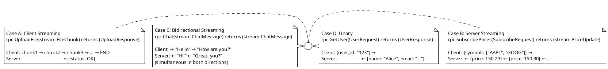

**Interview tip:** Know all four gRPC patterns by name and their proto syntax: `rpc Method(Request) returns (Response)` (unary), `rpc Method(stream Request) returns (Response)` (client streaming), `rpc Method(Request) returns (stream Response)` (server streaming), `rpc Method(stream Request) returns (stream Response)` (bidirectional).

---

## Topic 8: Consistency, Availability & Partition Tolerance

---

### Q102. CAP Theorem Application

**Correct Answer: B**

**Why B is correct:**
CAP theorem: in the presence of a network partition (P), a system must choose between Consistency (C) and Availability (A). Bank balance is CP: under partition, the system rejects reads it can't guarantee are fresh (returns an error) rather than return potentially stale data. A bank showing a wrong balance enables overdraft and fraud — correctness is mandatory. Distributed lock is CP: split-brain (two nodes both believing they're leader) is catastrophic; under partition, a node without quorum must step down. Social media likes are AP: showing 9,999 vs 10,000 likes is acceptable; the system remains available even if replicas diverge temporarily.

**Why not A:**
Making likes CP means the system returns errors during network partitions rather than serving potentially stale like counts. This sacrifices availability for data nobody cares about being perfectly accurate.

**Why not C:**
Banking as AP would allow a partitioned node to serve reads without knowing the latest balance — enabling fraudulent overdraft. Distributed lock as AP allows split-brain — two nodes simultaneously believing they're leader, potentially corrupting shared state.

**Why not D:**
Distributed lock as AP is the critical failure case — split-brain is the exact problem consistent hashing and leader election algorithms (Raft, ZooKeeper) are designed to prevent. AP distributed locks cannot exist safely.

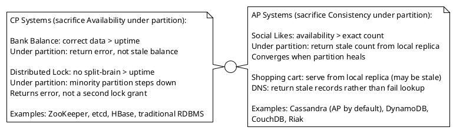

**Interview tip:** CAP theorem is often misapplied. Key clarification: CP doesn't mean "always consistent" — it means "consistent when a partition occurs." AP doesn't mean "always available" — it means "available (possibly serving stale data) when a partition occurs." Normal operation with no partition, both properties hold.

---

### Q103. Eventual Consistency in Practice

**Correct Answer: B**

**Why B is correct:**
Session-based read routing is the standard implementation of read-your-writes in systems with replication lag. After a write, store the write timestamp (or replication position) in the user's session. For subsequent reads, the routing layer checks the session's last-write-timestamp. If the assigned replica's replication position is past that timestamp, route to the replica. Otherwise, route to primary. This degrades gracefully: most users (who don't read immediately after writing) always hit replicas; only users who write and immediately read hit the primary for a brief window.

**Why not A:**
Primary-only reads after writes is correct but crude — it sends all reads to primary for a full session duration, not just the window until the replica catches up. At a 90:10 read:write ratio with a 200ms replication lag, only 200ms of reads need to go to primary after each write. This is significantly more targeted than "all reads after any write."

**Why not C:**
Synchronous replication adds latency to every write to wait for all replicas. At 1K writes/sec, this is overhead on every single write to eliminate a problem that only affects reads in the 200ms window after a write. Disproportionate cost.

**Why not D:**
Client-side caching of the just-written post works for the writing device, but breaks if the user opens a second browser tab, uses a different device, or shares the link. Server-side consistency is the correct layer for this guarantee.

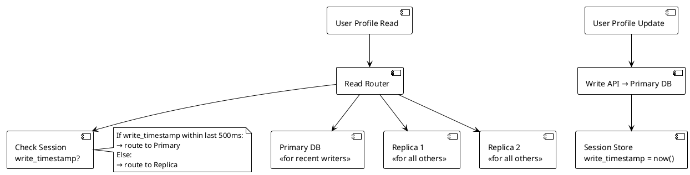

**Interview tip:** "Read-your-writes" is a consistency model. Name it explicitly. The session-based routing implementation is the standard answer — not sticky sessions (which don't solve replication lag) and not synchronous replication (which is too expensive).

---

### Q104. Two-Phase Commit Failure Modes

**Correct Answer: B**

**Why B is correct:**
The blocking problem is 2PC's fundamental and well-known limitation. If the coordinator crashes after Phase 1 (all participants voted YES) but before delivering the COMMIT decision to all participants, the undecided participants are stuck in a blocked state. They've locked their resources and committed to the decision, but without the coordinator's message, they don't know whether to commit or abort. The coordinator restart may recover the decision from its transaction log — but if the coordinator's disk is also corrupt, the participants block indefinitely. Saga avoids this: no participant holds a distributed lock waiting for a coordinator; compensating transactions handle rollback, and the Saga state machine can resume from any persisted state.

**Why not A:**
Active-passive coordinator failover partially mitigates the blocking problem if the new coordinator can recover the transaction log from shared storage. But if the coordinator crashes before writing the decision to its log (between deciding and broadcasting), the new coordinator can't recover the decision either. The blocking problem is inherent to the protocol, not just implementation.

**Why not C:**
At-most-once delivery is a message delivery semantic, not a distributed transaction solution. It doesn't address the coordinator crash scenario.

**Why not D:**
Eventual consistency is incompatible with the requirement for atomicity across services. If atomicity (all or nothing) is required, eventual consistency doesn't provide it.

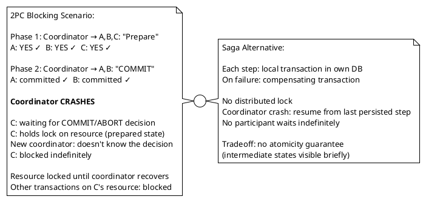

**Interview tip:** 2PC's blocking problem is a standard distributed systems interview topic. Name the problem precisely: "blocking problem" — not just "coordinator failure." The Saga pattern is the standard alternative; know both choreography and orchestration variants (Q67).

---

### Q105. CRDT for Conflict-Free Collaboration

**Correct Answer: B**

**Why B is correct:**
A G-Counter (Grow-only Counter) is a CRDT (Conflict-free Replicated Data Type). Each node maintains a vector of per-node increment counts: `{A: 5, B: 3, C: 0, ...}`. The merge operation is component-wise max: `merge({A:5, B:0}, {A:0, B:3}) = {A:5, B:3}`. Total value = sum of all components = 5 + 3 = 8. This merge is commutative, associative, and idempotent — properties that guarantee convergence regardless of merge order. No conflict possible: both nodes' increments are preserved. This is the mathematical foundation for conflict-free distributed data.

**Why not A:**
Last-write-wins discards concurrent writes based on timestamp. User A's 5 offline increments are lost if User B's timestamp is newer. Total becomes 3, not 8.

**Why not C:**
Two-phase commit requires network connectivity for the atomic increment. User A is offline — 2PC cannot participate. Not applicable to offline scenarios.

**Why not D:**
Operational Transform is the algorithm Google Docs uses for collaborative text editing. It transforms concurrent operations relative to each other (insert at position 5 + delete at position 3 = adjust insert to position 4). OT requires a server to mediate transformations and doesn't work offline. Not designed for counter semantics.

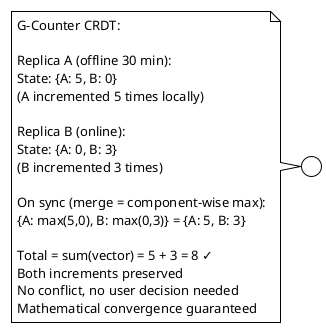

**Interview tip:** Know the CRDT acronym and concept: "mathematically proven to converge without coordination." G-Counter (increment only), PN-Counter (increment and decrement), LWW-Register (last-write-wins), OR-Set (add/remove). CRDTs are used in Redis CRDT, Riak, Apple Notes offline sync.

---

### Q106. Linearizability vs Sequential Consistency

**Correct Answer: B**

**Why B is correct:**
Linearizability (strong consistency): every operation appears to execute atomically at some point between its invocation and completion, and that point is visible to all processes in real-time global order. CAS (compare-and-swap), distributed locks, and leader election require this — two clients must never both believe they hold a lock. Sequential consistency (weaker): all processes see operations in the same total order, but the order doesn't need to match real-time. Collaborative document editing within a session and social media feeds can tolerate this — users see a consistent view that may lag real-time by seconds.

**Why not A:**
Most distributed databases (Cassandra, DynamoDB) don't provide linearizability — they provide sequential consistency or weaker. Stating "all distributed systems require linearizability" is incorrect and would cause significant design over-specification.

**Why not C:**
Compare-and-swap (used in distributed locking) is broken under sequential consistency: two processes can both observe the old value and both successfully perform the CAS, both believing they won the lock. Linearizability's real-time ordering is what prevents this.

**Why not D:**
Financial systems require linearizability for balance reads: a read must reflect all writes that completed before the read began. Social media feeds can tolerate sequential consistency: seeing a feed that's slightly out of real-time order is acceptable.

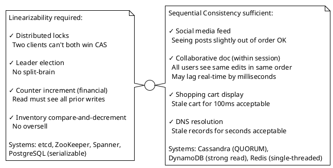

**Interview tip:** "Linearizable" and "strongly consistent" are often used interchangeably in interviews. The technical distinction: strong consistency in ACID databases usually means serializability (transaction-level); linearizability is operation-level. Know both terms and be ready to clarify.

---

### Q107. Read Your Writes in a Distributed System

**Correct Answer: B**

**Why B is correct:**
At a 200:1 read:write ratio with 1K writes/sec, only a tiny fraction of reads need to be routed to the primary. The 500ms window (greater than max replication lag of 200ms) after a write ensures the user's next read sees their write. After that window, replica reads resume. Primary receives: 1K writes/sec + (1K writes/sec × fraction of reads within 500ms window) — minimal additional primary load. This is the optimal balance: correctness for the user who just wrote, replica offloading for everyone else.

**Why not A:**
Sticky sessions route all of a user's reads to the same replica. If that replica is consistently 150ms behind and the user reads 50ms after writing, they still see stale data. Sticky sessions solve a different problem (stateful session affinity) and don't guarantee read-your-writes.

**Why not C:**
Synchronous replication at 1K writes/sec adds round-trip time (50-200ms) to every write to wait for replica acknowledgment. The 200:1 ratio means there are 200K reads/sec — the optimization should be on the read path, not adding latency to the write path.

**Why not D:**
Vector clocks are a distributed systems primitive for tracking causality. They're correct in theory (client sends its vector clock with each read; replica checks if it's seen all the writes in that vector) but operationally complex — vector clocks must be stored per-user, included in every request, and compared at every read. The session-timestamp approach achieves the same correctness with simpler implementation.

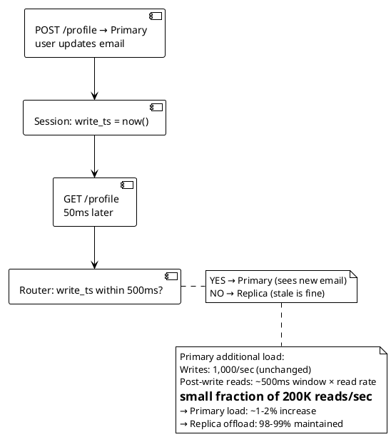

**Interview tip:** "Read-your-writes" is one of the four session guarantees defined by Vogels (Amazon CTO). Know all four: read-your-writes, monotonic reads, monotonic writes, writes-follow-reads. Interviewers at distributed systems companies may ask about all four.

---

### Q108. Conflict Resolution in Multi-Region Writes

**Correct Answer: B**

**Why B is correct:**
Hybrid Logical Clocks (HLCs) combine physical clock time with a logical counter. HLCs are monotonically increasing even when physical clocks drift — they advance to `max(local_time, received_message_time)` plus a counter. For user profile updates, the most recent user intent should prevail. An HLC timestamp reliably identifies "last writer" without the risk of wall clock skew reversing the decision. LWW-by-HLC is the standard conflict resolution strategy for simple scalar fields like names, preferences, and settings.

**Why not A:**
Wall clock timestamps in distributed systems are unreliable: clock skew between regions (easily ±100ms), leap seconds, and NTP corrections can cause T=0ms to have a higher wall clock timestamp than T=10ms. "Last write wins by wall clock" can silently discard the actual last write.

**Why not C:**
Surfacing conflicts to the user (Amazon Dynamo's approach for shopping carts) is appropriate when both versions have equal business validity and the user must choose. For a profile name field, asking a user "which of these two names do you want?" is poor UX. LWW is the correct semantic: the user's most recent intentional update wins.

**Why not D:**
Rejecting concurrent writes during an 80ms replication lag window would reject any two writes within 80ms of each other, globally. Users who update their profile would frequently get 409 errors requiring retries. For a user-facing profile update, this is an unacceptably restrictive policy.

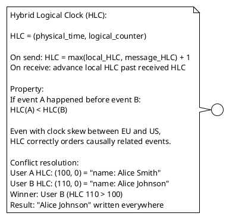

**Interview tip:** Know the three conflict resolution strategies: LWW (last write wins — simple, loses concurrent writes), multi-version (surface conflict to user — correct for shopping carts), CRDT (mathematically merge — correct for counters/sets). Match the strategy to the data semantics.

---

### Q109. BASE vs ACID

**Correct Answer: B**

**Why B is correct:**
ACID (Atomicity, Consistency, Isolation, Durability) for systems where partial state is catastrophic. Banking transfer: money deducted from A but not credited to B = money destroyed. Inventory reservation: two concurrent reservations for the same last item = oversell (legal liability). BASE (Basically Available, Soft state, Eventually consistent) for systems where temporary inconsistency is acceptable. Watch history: missing one episode event for a few seconds doesn't cause business harm. User preference (dark mode): syncing to a second device with 10-second lag is not a user-facing problem.

**Why not A:**
ACID for watch history and dark mode preference adds unnecessary operational overhead. These are single-row operations with no multi-service atomicity requirement. BASE is correct.

**Why not C:**
Inventory reservation with BASE risks oversell. If two concurrent reservations each read "1 unit available" before either commits, both proceed — both succeed in a BASE system. The last unit is reserved twice. ACID prevents this.

**Why not D:**
Banking transfer without ACID: transfer debits A, crashes before crediting B. B is never credited. Money is permanently lost. No compensation mechanism in pure BASE restores this without application-level Saga.

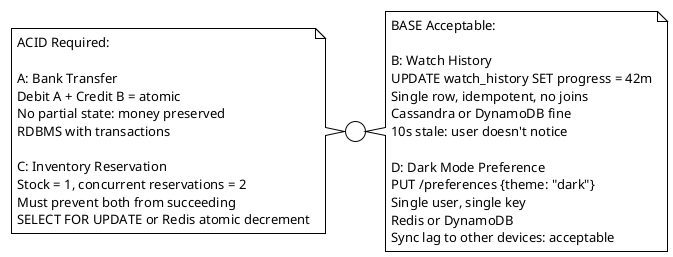

**Interview tip:** ACID vs BASE is not just about database selection — it's about business requirements. Ask "what is the cost of temporary inconsistency?" If the answer is "catastrophic" (financial loss, legal liability, data corruption), use ACID. If the answer is "minor UX inconvenience," BASE is fine.

---

### Q110. Lease-Based Distributed Locking

**Correct Answer: B**

**Why B is correct:**
A watchdog thread (background renewal thread) is the standard solution for jobs that may outlast their lock TTL. The watchdog runs on a separate thread alongside the job, sends `EXPIRE lock:job1 30` (reset TTL to 30 seconds) every 10 seconds. If the job completes, the watchdog stops and the lock is explicitly released. If the worker crashes (JVM crash, OOM, network split), the watchdog stops with it — the lock's TTL is not renewed and expires in at most 30 seconds, freeing the lock for other workers. Redisson's lock implementation uses exactly this pattern ("Redisson Watchdog").

**Why not A:**
10-minute TTL means a worker crash holds the lock for up to 10 minutes. All competing workers wait 10 minutes before one can acquire the lock. For any time-sensitive processing, this is unacceptably long recovery time.

**Why not C:**
Fencing tokens are the correct solution for a different problem: preventing stale lock holders from corrupting data after their lock has expired. The scenario is a job that legitimately needs the lock for longer than the TTL — fencing tokens don't extend the TTL. Both watchdog AND fencing tokens should ideally be used together in production.

**Why not D:**
ZooKeeper ephemeral nodes expire when the client session dies. If the ZooKeeper client loses connectivity to ZooKeeper (not to the actual work it's doing), the ephemeral node expires and the lock is released — even though the worker is still running. Same session-heartbeat problem exists.

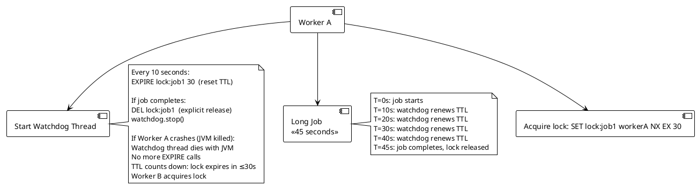

**Interview tip:** The watchdog pattern is the Redisson answer. If asked "how do you implement a distributed lock that works for long-running jobs?" — answer: watchdog renewal thread + fencing tokens for write protection. Know both the renewal mechanism and the crash-recovery behavior.

---

### Q111. Gossip Protocol

**Correct Answer: B**

**Why B is correct:**
The SWIM (Scalable Weakly-consistent Infection-style Membership) gossip protocol solves decentralized failure detection at scale. Each node periodically sends heartbeats to K random peers (K=3 typically). If a direct heartbeat fails, the node asks other peers to attempt indirect contact (piggybacking). If indirect contact also fails after a timeout, the node is marked as suspected, then failed. Membership state (who's alive/dead) spreads through the cluster in O(log N) rounds — exponential dissemination. At N=1,000 nodes: failure detection within ~O(log 1000) = ~10 gossip rounds × gossip interval = seconds. No central coordinator. Cassandra, Consul, and Kubernetes' etcd all use gossip for cluster membership.

**Why not A:**
Leader-based heartbeat creates a single point of failure. If the leader dies, no other node can detect failures — the failure detection system itself is down.

**Why not C:**
All-to-all heartbeats: N=100 → N(N-1)/2 = 4,950 heartbeat pairs; N=1,000 → 499,500 pairs. Each heartbeat per second = 499,500 messages/second at N=1,000. Bandwidth and CPU are exhausted. O(N²) is unscalable.

**Why not D:**
Passive failure detection has unbounded detection time: if node X fails and nobody sends a request to X for 24 hours, X's failure goes undetected for 24 hours. Not appropriate for any cluster that needs timely failure detection for load balancing or leader election.

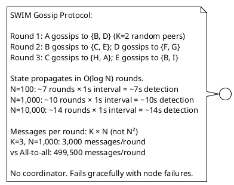

**Interview tip:** Gossip protocol = O(log N) propagation, no coordinator, linear message complexity. Know these three properties. Cassandra uses gossip for cluster membership — citing a real system that uses it is more credible than abstract description.

---

### Q112. Quorum Reads and Writes

**Correct Answer: A**

**Why A is correct:**
W=3, R=3 on N=5 satisfies W+R > N (6 > 5) — strong consistency guaranteed. The overlap: any set of 3 nodes for write and any set of 3 nodes for read must share at least 1 node (since 3+3=6 > 5). That shared node has the latest write, ensuring reads always see it. Failure tolerance: with 5 nodes and W=3, can lose 2 nodes and still write (5-3=2). With R=3, can lose 2 nodes and still read (5-3=2). Balanced — equal write and read failure tolerance.

**Why not B:**
W=5, R=1: W+R=6 > 5, strong consistency guaranteed. But W=5 means ALL nodes must confirm writes — zero write failure tolerance. Losing 1 node makes writes impossible. Impractical for high availability systems.

**Why not C:**
W=1, R=5: W+R=6 > 5, strong consistency guaranteed. But R=5 means ALL nodes must respond to reads — zero read failure tolerance. Losing 1 node makes reads impossible. Impractical.

**Why not D:**
W=3, R=2: W+R=5 = N=5. NOT strictly greater than N — the quorum overlap is not guaranteed. It's possible (in degenerate network conditions) for 3 write nodes and 2 read nodes to have zero overlap. Stale reads are possible.

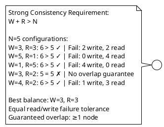

**Interview tip:** The quorum formula W+R > N is fundamental. Know it by heart. The interview question will give you N and ask which (W,R) pairs provide strong consistency. Run the formula on each option.

---

### Q113. Consistency in Microservices Data

**Correct Answer: B**

**Why B is correct:**
The Saga with compensation and persisted orchestrator state is the correct pattern. The Saga Orchestrator writes its state before each step: `{saga_id, step: "RESERVE_INVENTORY", status: "COMPLETED"}`. Before issuing the payment command: `{step: "CHARGE_PAYMENT", status: "IN_PROGRESS"}`. If the Order Service crashes here, on recovery the orchestrator reads its state (`CHARGE_PAYMENT:IN_PROGRESS`) and either retries the payment command or, if payment is known failed, issues compensating commands in reverse. The compensating command `ReleaseInventory` is idempotent — safe to retry.

**Why not A:**
Synchronous REST rollback: the Order Service calls Inventory to release on payment failure. This works if Order Service is alive. But if Order Service crashes between the payment failure and the rollback call, no rollback ever happens. The inventory is permanently locked.

**Why not C:**
Retry payment 3× is a transient error mitigation, not a saga pattern. If payment genuinely fails (card declined, fraud block), retrying doesn't help. Inventory is still locked.

**Why not D:**
TTL-based release is a safety net, not a compensation pattern. 5 minutes of locked inventory during a flash sale (100K concurrent users) causes a significant UX problem. It's better than no release at all, but not a substitute for event-driven compensation.

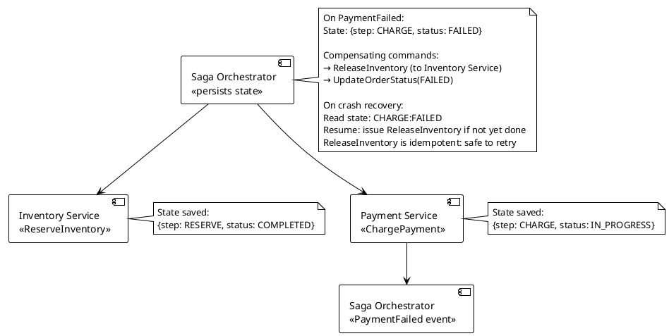

**Interview tip:** The Saga orchestrator's durable state is what makes crash recovery possible. "The saga persists its state before each step" is the sentence that shows you understand the recovery mechanism, not just the happy path.

---

## Topic 9: Distributed Systems Patterns

---

### Q114. CQRS Implementation

**Correct Answer: B**

**Why B is correct:**
CQRS (Command Query Responsibility Segregation) separates the write model from the read model at the data store level, not just the code level. Write model: PostgreSQL, normalized schema, ACID transactions, optimized for 5K writes/sec. Read model: denormalized projection in a read-optimized store (Elasticsearch for search, or a pre-joined PostgreSQL schema). Domain events published by the write service are consumed by the read model projector, which maintains the denormalized view asynchronously. The 1-2 second lag is the async propagation time — acceptable per requirements. Read queries hit only the read model; write contention is eliminated.

**Why not A:**
Synchronous replication makes the read model a synchronous dependency of writes. Every write must wait for the read model to update before completing. This defeats the purpose of CQRS (decoupling write and read concerns) and adds latency to the write path.

**Why not C:**
Read replicas share the same normalized schema and storage engine as the write database. A 5-table JOIN on a read replica executes the same query plan as on the primary — query complexity is unchanged. CQRS's value is maintaining a different schema for reads, not just different servers.

**Why not D:**
GraphQL is a query language that sits on top of data stores. It doesn't change how data is stored or how queries are executed. A GraphQL schema resolving a 5-table JOIN still executes 5 SQL joins (or N+1 queries without DataLoader). Not a data model solution.

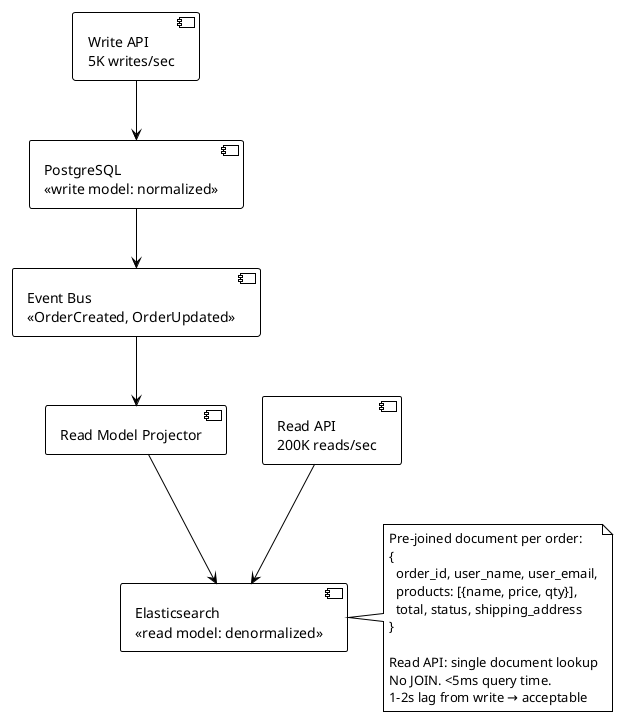

**Interview tip:** CQRS is not about separating read and write code — it's about separating read and write data models. The read model can be a completely different schema, in a completely different database, optimized for reads. The event pipeline is the synchronization mechanism.

---

### Q115. Event Sourcing Snapshots

**Correct Answer: B**

**Why B is correct:**
Snapshots are the standard solution to the event replay performance problem in event-sourced systems. Every N events (commonly 100-1,000), the current aggregate state is serialized and stored as a snapshot alongside the event stream. On a balance query: load the latest snapshot (O(1) lookup), then replay only events with sequence number > snapshot's sequence (worst case N-1 events). At N=1,000 events per snapshot and 0.08ms per event: worst case 999 × 0.08ms = 79ms — close to target. Tune snapshot frequency: every 500 events → 499 × 0.08ms = 39ms — within 50ms target.

**Why not A:**
Redis caching of current balance is an optimization on top of event sourcing, not a replacement for snapshots. On cache miss (cold start, cache eviction), the full replay must still happen (8 seconds). Snapshots solve the replay problem at the storage layer; caching solves the hot-path problem at the application layer. Both are used together in production.

**Why not C:**
Deleting old events eliminates the audit trail — the primary reason for using event sourcing. Auditors, compliance teams, and "what happened on March 3?" queries all require full event history. Snapshots preserve history while improving query performance.

**Why not D:**
Hardware scaling: replay time is O(N) where N = number of events. Faster hardware reduces the constant factor but doesn't change the algorithm. At 10× faster hardware: 100K events × 0.8ms → 80 seconds. Still far over the 50ms target. Algorithm improvement (O(1) snapshot + O(K) delta) is required, not hardware.

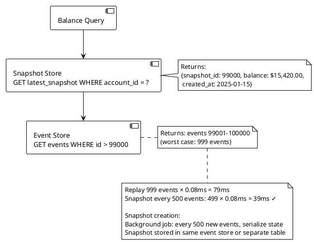

**Interview tip:** When recommending event sourcing, immediately follow with "and we need snapshots." State the formula: snapshot_latency = snapshot_events × replay_time. Calculate whether it meets the SLA. Interviewers expect you to quantify the tradeoff.

---

### Q116. Saga vs 2PC Decision

**Correct Answer: B**

**Why B is correct:**
Saga is the correct pattern for distributed business transactions across independently-deployed microservices with heterogeneous databases. Each service has its own local transaction (ACID within its own DB). The Saga Orchestrator coordinates the sequence and issues compensating transactions on failure. MongoDB compatibility is not required — each service uses its own DB technology natively. Teams are decoupled — Saga commands are domain events over a message bus, not protocol-level XA calls.

**Why not A:**
MongoDB doesn't support XA protocol. Even if it did, XA requires a global transaction coordinator that all participants must be tightly coupled to. The scenario has 4 independent teams with independent deployments — XA coupling would require all teams to coordinate on transaction management, adding operational dependency.

**Why not C:**
Single database for 4 independently-deployed microservices violates the database-per-service principle. Schema changes in one service's domain require coordinating with 4 teams. Any service's slow query can lock rows accessed by others. Deployment independence is lost.

**Why not D:**
CockroachDB provides distributed ACID across its own cluster. Migrating the existing Notification Service (stateless) and MongoDB service to CockroachDB is a major rewrite — each service's data model, queries, and ORM configurations must change. This is an organizational and technical burden that doesn't justify the consistency benefit.

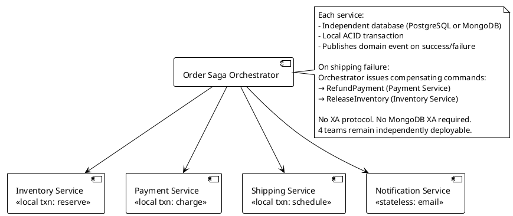

**Interview tip:** The rule: "Use Saga when services have heterogeneous databases or are independently deployed. Use 2PC only when all participants can implement XA and tight coupling is acceptable." In modern microservices, 2PC is almost always wrong.

---

### Q117. Circuit Breaker States

**Correct Answer: A**

**Why A is correct:**
The circuit breaker state machine has three states with specific transition conditions. CLOSED: normal operation, all calls pass through; error rate tracked over a sliding window (10 calls minimum). OPEN: triggered when error rate exceeds threshold (50% over 10 calls); all calls fail immediately without attempting Service B; fast failure protects caller's thread pool. HALF-OPEN: triggered after wait duration (30 seconds); probe state; allows limited test calls (3); if success rate sufficient (2/3), transition to CLOSED; if failure rate still high, transition back to OPEN.

**Why not B:**
Automatic routing to a fallback service on OPEN is an optional pattern (fallback behavior) layered on top of the circuit breaker, not part of the state machine itself. The circuit breaker's OPEN state fails fast; what the caller does with that failure (fallback, queue, error to user) is application logic.

**Why not C:**
Opening on the first failure is too aggressive. A circuit breaker with minimum calls = 10 won't open until 10 calls have been sampled. This prevents false opens during cold start (first 9 calls all fail due to startup issues, not sustained degradation).

**Why not D:**
Routing 10% of calls through in OPEN state is the HALF-OPEN behavior, not OPEN behavior. OPEN state routes zero calls to Service B — it fails fast for all callers. HALF-OPEN allows limited test calls.

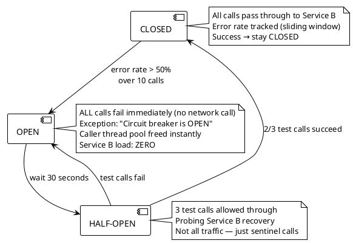

**Interview tip:** Know the state names (CLOSED, OPEN, HALF-OPEN) and what each does. The counterintuitive naming: CLOSED = operational (circuit is closed = current flows). OPEN = failed (circuit is open = current doesn't flow). The electrical metaphor is inverted from intuition.

---

### Q118. Retry with Exponential Backoff

**Correct Answer: B**

**Why B is correct:**
Exponential backoff with jitter is the standard retry strategy for transient failures. Exponential spacing (100ms → 200ms → 400ms) gives the downstream service increasing recovery time between attempts. Jitter (±25%) prevents retry synchronization: 10,000 callers all backing off to exactly 200ms would hit Service B with a synchronized wave at T=200ms. With jitter, retries spread across 150ms–250ms, dramatically reducing the peak retry load. This is the AWS recommended pattern (documented in their "Exponential Backoff and Jitter" blog post).

**Why not A:**
No retry means transient failures return errors to users. At 5% transient failure rate, 5% of all requests fail. Transient failures by definition would succeed on retry — giving up on them wastes availability.

**Why not C:**
Fixed delay retry (500ms exactly) creates synchronized retry waves when multiple callers start simultaneously (e.g., a traffic spike). All 10,000 callers that failed at T=0 all retry at T=500ms, T=1000ms, T=1500ms — perfectly synchronized thundering herd.

**Why not D:**
Exponential backoff without jitter: 10,000 callers all back off to exactly 100ms, 200ms, 400ms. The synchronized wave is smaller than fixed-delay (spacing increases between waves), but the first wave at T=100ms is still 10,000 simultaneous retries. Jitter is the critical addition.

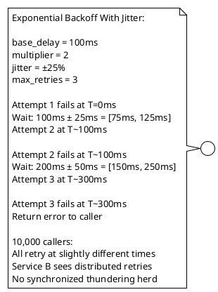

**Interview tip:** Three components of a correct retry strategy: (1) exponential backoff for increasing recovery time, (2) jitter for desynchronization, (3) max retries to bound total wait time. Know all three. AWS's recommendation is "full jitter" (random value between 0 and cap) rather than ±25%.

---

### Q119. Leader Election

**Correct Answer: B**

**Why B is correct:**
Raft consensus algorithm prevents split-brain through majority quorum. A leader must receive votes from a majority of nodes (2/3 in a 3-node cluster) to be elected. Under partition: Node 1 (isolated) is in the minority — it cannot receive votes from the majority and cannot maintain leadership. Its term eventually expires when it can't heartbeat the majority. Nodes 2 and 3 (majority partition) elect a new leader with quorum. Exactly one leader at all times — mathematical guarantee of the Raft protocol.

**Why not A:**
Bully algorithm: highest-ID node becomes leader. Node 1 (if highest ID) believes it's still leader even when isolated. No quorum check. Both Node 1 and the new leader (elected by Nodes 2+3) simultaneously believe they're leader. Split-brain.

**Why not C:**
Heartbeat-based election: followers detect missed heartbeats and start election. Works for symmetric partitions (Node 1 can't receive heartbeats from 2+3). Fails for asymmetric partitions: Node 1 sends heartbeats to 2+3 (they arrive), but 2+3's heartbeats to Node 1 don't arrive. Node 1 thinks it's still connected; doesn't step down. 2+3 detect missed heartbeats and elect new leader. Split-brain.

**Why not D:**
Timestamp-based election: newest node becomes leader. Doesn't account for network partitions. No quorum requirement. Split-brain possible.

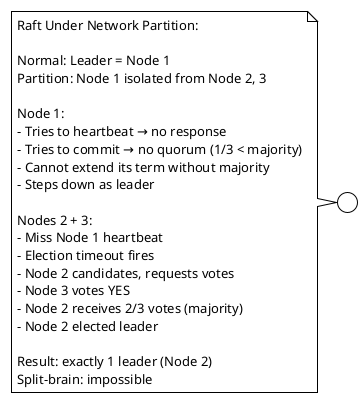

**Interview tip:** Raft is the modern consensus algorithm (2014, Diego Ongaro). Paxos is the older, harder-to-understand version. etcd (Kubernetes' backing store) uses Raft. Know the key properties: leader elected by majority quorum, log replication to majority before commit, split-brain impossible by design.

---

### Q120. Anti-Entropy and Repair

**Correct Answer: B**

**Why B is correct:**
Anti-entropy repair with Merkle trees is Cassandra's primary mechanism for detecting and fixing inconsistencies between replicas. Each node builds a Merkle tree (hash tree) over its data: leaf nodes hash individual rows, parent nodes hash their children. Comparing Merkle trees between replicas identifies divergent subtrees without comparing individual rows — only the divergent ranges are streamed. For a node returning from 2-week downtime, `nodetool repair` runs Merkle tree comparison and streams the 1M missing writes. This is the scheduled maintenance operation that should always follow a long downtime.

**Why not A:**
Read repair is triggered by QUORUM reads that detect inconsistency. It fixes the inconsistency for keys that are actually read. Keys that are never read are never repaired. A node missing 1M writes from 2 weeks ago won't be repaired by reads alone — most of those writes may never be read again (old orders, historical records).

**Why not C:**
Hinted handoff stores short-term "hints" (metadata pointing to missed writes) on other nodes when the target is down. Default hint storage: 3 hours. After 2 weeks, all hints are long expired. The hints for the 2-week downtime are completely gone. Hinted handoff is designed for minutes-to-hours downtime, not weeks.

**Why not D:**
Bootstrap is the process of adding a brand-new node to a Cassandra cluster — it streams all data for the node's token range from existing replicas. Bootstrapping an existing node would first delete its existing data, then stream fresh data — a costly and unnecessary full data movement when the node only needs to repair the delta of 2 weeks.

```plantuml
@startuml
!theme plain
skinpantic backgroundColor white

[Node 1\n<<current data>>] --> [Merkle Tree A\n<<hash of data ranges>>]
[Node 2\n<<2-week drift>>] --> [Merkle Tree B\n<<hash of data ranges>>]

[Merkle Tree A\n<<hash of data ranges>>] --> [Tree Comparison\n<<nodetool repair>>]
[Merkle Tree B\n<<hash of data ranges>>] --> [Tree Comparison\n<<nodetool repair>>]

note right of [Tree Comparison\n<<nodetool repair>>]
  Compare root hashes: differ → drill down
  Compare left subtrees: differ → drill down
  Compare right subtrees: match → skip
  
  Find: specific token ranges with divergent hashes
  Stream: only the divergent ranges from Node 1 to Node 2
  
  Full table scan: not needed
  Streaming: only missing 1M writes, not all data
  
  Schedule: after any long downtime
  Also: weekly scheduled repair for all nodes
end note
@enduml
```

**Interview tip:** Know the Cassandra repair hierarchy: read repair (per-read), hinted handoff (short downtime), anti-entropy repair (long downtime/weekly maintenance). An interviewer asking "how do you handle data inconsistency in Cassandra?" expects all three, in order of use.

---

### Q121. Consistent Hashing

**Correct Answer: A**

**Why A is correct:**
Consistent hashing places nodes at positions on a circular hash ring. Each key is assigned to the first node clockwise from the key's hash position. When a new node is added, it takes ownership of the range between its position and its predecessor on the ring. Only keys in that range remap to the new node — all other keys stay on their existing nodes. For a ring with N nodes adding a 1/(N+1) range: approximately 1/(N+1) = 25% of keys remap when adding a 4th node to a 3-node ring. With modulo hashing (`key % 3` → `key % 4`), keys remap to `(key % 3) ≠ (key % 4)` for 3/4 of all keys = 75% remapping.

**Why not B:**
Pre-allocation of positions is the virtual nodes feature — each physical node is pre-assigned multiple positions on the ring. It improves distribution uniformity but is an enhancement of consistent hashing, not the core mechanism.

**Why not C:**
Using the full hash is true but incomplete. The ring structure is what limits remapping. With modulo hashing, you also use the full hash before taking modulo — the difference is the ring-based assignment, not the hash function.

**Why not D:**
Routing tables are an implementation detail of some distributed systems (Chord DHT uses finger tables). Consistent hashing's defining feature is the ring, not the routing table.

```plantuml
@startuml
!theme plain
skinparam backgroundColor white

note left
  Modulo Hashing (before Node D):
  Node assignments: key % 3
  Key 1 → Node 1
  Key 2 → Node 2
  Key 3 → Node 3 (alias: Node 0)
  ...
  
  After adding Node D:
  key % 4 → different for 75% of keys
  Key 1 (1%3=1 → 1%4=1): Node 1 ✓
  Key 5 (5%3=2 → 5%4=1): Node 2 → Node 1 ✗
  Key 6 (6%3=0 → 6%4=2): Node 3 → Node 2 ✗
  Key 7 (7%3=1 → 7%4=3): Node 1 → Node D ✗
  Cache miss storm on ~75% of keys
end note

note right
  Consistent Hashing (adding Node D):
  D is placed between B and C on ring.
  
  Only keys in range (B, D] remap to D.
  That range: ~1/4 of all keys (25%).
  
  All other keys: unchanged
  A: unchanged, B: unchanged, C loses 25%
  
  Cache miss storm: ~25% of keys (not 75%)
end note
@enduml
```

**Interview tip:** Consistent hashing is used by: Redis Cluster (hash slots are consistent-hashing-like), Cassandra (virtual nodes on a ring), Memcached client libraries, Dynamo-style databases. Know both the mechanism and where it's used in production.

---

### Q122. Sidecar Pattern

**Correct Answer: B**

**Why B is correct:**
The sidecar pattern deploys a proxy process (Envoy) as a co-located container in the same Kubernetes pod as the service. The service makes plain HTTP/gRPC calls to localhost — the sidecar intercepts them and applies the cross-cutting concerns (mTLS, tracing, retries, circuit breaking). The service code is completely unaware of these mechanisms. All services — Java, Python, Go — get identical behavior from the same sidecar binary, configured via a control plane (Istio, Linkerd). Library version drift is eliminated: one Envoy version serves all languages. This is the service mesh architecture.

**Why not A:**
Shared library per language: Java gets a Resilience4j library, Python gets a tenacity library, Go gets its own retry library. Three implementations to maintain. When circuit breaker logic changes (new threshold, new algorithm), update three libraries. When a bug is found, patch three libraries. Library version drift between services is likely. No single control plane.

**Why not C:**
Central API Gateway for cross-cutting concerns: every inter-service call routes through the gateway. At high internal RPS (50K/sec), the gateway is a bottleneck and single point of failure. Sidecars are co-located — no additional network hop. The gateway is a north-south tool (Q79).

**Why not D:**
"Platform service" for cross-cutting: all services call a central service for tracing/mTLS initiation. Each call adds a network round-trip overhead for the platform service call. The platform service itself needs HA, scaling, and monitoring. Its failure breaks all services' cross-cutting behavior.

```plantuml
@startuml
!theme plain
skinparam backgroundColor white

[Pod: Java Service] --> [Pod: Envoy Sidecar]
note right of [Pod: Envoy Sidecar]: Service A → localhost:8080 (plain HTTP)\nEnvoy intercepts → applies mTLS, tracing, retries\nEnvoy → Service B sidecar (mutual TLS)

[Pod: Python Service] --> [Pod: Envoy Sidecar 2]
note right of [Pod: Envoy Sidecar 2]: Service B → localhost:8080 (plain HTTP)\nSame Envoy binary, same configuration\nNo Python-specific library

[Pod: Go Service] --> [Pod: Envoy Sidecar 3]
note right of [Pod: Envoy Sidecar 3]: Service C → localhost:8080 (plain HTTP)\nSame Envoy binary, same configuration\nNo Go-specific library

note bottom
  Istio Control Plane:
  Configures all sidecars uniformly.
  One update → all 3 services get new circuit breaker logic.
  No library version drift.
end note
@enduml
```

**Interview tip:** Sidecar pattern = zero library code in the service, all cross-cutting concerns in the proxy. The service is "unaware" of its infrastructure. This is the key benefit — describe it as "concern separation at the process level, not the library level."

---

### Q123. Competing Consumers Pattern

**Correct Answer: B**

**Why B is correct:**
Required workers = (total_jobs × processing_time_per_job) / deadline = (10,000 × 2 seconds) / 3,600 seconds = 5.56 → round up to 6 workers. Each worker independently pulls jobs from the queue. No coordinator assigns work — workers compete for messages. If a worker crashes mid-job, the message visibility timeout expires and the job returns to the queue for another worker. Adding workers linearly reduces total processing time (6 workers = 3,333 seconds → ~56 minutes). The pattern is called "Competing Consumers" in enterprise integration patterns.

**Why not A:**
1 worker at 0.3s per job = 10,000 × 0.3s = 3,000 seconds = 50 minutes. Barely meets the 60-minute target with zero headroom. Any variance in processing time or a single job failure causes a breach. Also, the question asks which pattern is used — not just the worker count.

**Why not C:**
100 workers can complete 10K jobs in 10,000 × 2 / 100 = 200 seconds (3.3 minutes). Correct answer but over-provisioned by 17×. The formula gives exactly 6 workers needed.

**Why not D:**
Pub/Sub delivers each message to ALL subscribers. With 10,000 subscribers, each message is processed 10,000 times — 10,000× the required compute. Not competing consumers — competing consumers means each message is processed by exactly one consumer.

```plantuml
@startuml
!theme plain
skinparam backgroundColor white

[Image Queue\n10,000 jobs] --> [Worker 1\n<<competing>>]
[Image Queue\n10,000 jobs] --> [Worker 2\n<<competing>>]
[Image Queue\n10,000 jobs] --> [Worker 3\n<<competing>>]
[Image Queue\n10,000 jobs] --> [Worker 4\n<<competing>>]
[Image Queue\n10,000 jobs] --> [Worker 5\n<<competing>>]
[Image Queue\n10,000 jobs] --> [Worker 6\n<<competing>>]

note right
  Required workers:
  total_work = 10,000 × 2s = 20,000 sec
  deadline = 3,600 sec
  workers = 20,000 / 3,600 = 5.56 → 6 workers
  
  Each worker: independently polls queue
  Message visibility timeout: 30s
  Worker crash: message reappears in 30s
  
  Total time: 10,000 × 2s / 6 = 3,333s = 55.5 min ✓
end note
@enduml
```

**Interview tip:** Competing consumers = one message processed by one consumer. The formula: workers = (jobs × time_per_job) / deadline. Know this by heart. It appears in capacity planning questions at every level.

---

### Q124. Backoff and Retry Budget

**Correct Answer: B**

**Why B is correct:**
Retry amplification in deep call chains is O(retry_count^depth). At 3 retries per service and 3 services: 3^3 = 27× amplification on Service C. The solution: retry at the outermost layer only. When Service B's call to Service C fails, Service B returns the error immediately to Service A. Service A returns the error to the Client. Client retries the entire chain. Total amplification: 3× (client's retries), not 27×. Error context propagates cleanly — the client sees the specific error from Service C, not a generic retry exhaustion.

**Why not A:**
This describes the problem, not the solution. Retries at every layer create exponential amplification.

**Why not C:**
Retry budget is also a correct answer — it limits the total number of retries across all layers within a time window. When the budget is exhausted, all services in the chain fail fast. This is complementary to option B (outer-only retry) and is used in production (e.g., Google's retry budget pattern). Both C and B are valid; B is simpler and more commonly recommended.

**Why not D:**
Longer timeouts before each retry reduce false-positive timeout errors (transient slowness vs. failure). But at 5% genuine error rate, amplification still occurs — the retries just wait longer before amplifying.

```plantuml
@startuml
!theme plain
skinparam backgroundColor white

note left
  Current (wrong): Retries at every layer
  
  C fails → B retries C 3×
  B fails → A retries B 3×
  
  A→B calls: 3×
  B→C calls: 3 × 3 = 9×
  
  C under load: 9× amplification
  C degrades → more failures → more retries
  → cascading failure
end note

note right
  Fix: Retry only at outermost layer
  
  C fails → B propagates error immediately (no retry)
  B fails → A propagates error immediately (no retry)
  A fails → Client retries entire call
  
  A→B calls: 3× (client retries)
  B→C calls: 3× (same as A→B, B doesn't retry)
  
  C under load: 3× amplification (bounded)
  
  Tradeoff: slower overall retry (full chain timeout × 3)
  vs. correctness (no exponential amplification)
end note
@enduml
```

**Interview tip:** Retry amplification in deep call chains is a real production failure mode. Uber, Netflix, and Google have all documented cascading failures caused by synchronized retries. The rule: "Don't retry inside a service that is itself called by a retrying caller."

---

### Q125. Idempotent Producer Pattern

**Correct Answer: B**

**Why B is correct:**
Kafka idempotent producer assigns a Producer ID (PID) and a monotonically increasing sequence number to each message. When the producer retries after a timeout, the broker checks the sequence number — if it's already been stored (same PID + sequence), the duplicate is silently discarded. The producer receives an ACK as if the message was accepted. From the producer's perspective: exactly-once delivery of each logical message. Automatically configured when `enable.idempotence=true`: forces `acks=all` (all replicas must confirm) and limits in-flight requests to 5 (allows pipelining while maintaining order on retry).

**Why not A:**
`acks=0` means the producer doesn't wait for any broker acknowledgment. No durability guarantee. Data loss on broker failure. Not even at-least-once — at-most-once at best.

**Why not C:**
`acks=all` ensures all replicas in the ISR (in-sync replicas) acknowledge before the producer gets an ACK. This prevents data loss on broker failure but doesn't deduplicate. If the producer times out waiting for the ACK (the ACK was in-flight when the network dropped), the producer retries. The broker received the message (stored successfully), sends the ACK again — producer receives the second ACK — but the message is already in the log. The retry is a duplicate. `acks=all` + `enable.idempotence=true` together solve both.

**Why not D:**
`max.in.flight.requests.per.connection=1` limits one in-flight request at a time, ensuring message ordering on retry (if retry-then-continue could create out-of-order delivery). It doesn't deduplicate — a successful retry still results in the broker storing the message twice (it doesn't track whether the producer has sent this before).

```plantuml
@startuml
!theme plain
skinparam backgroundColor white

[Producer\nPID=42, seq=1001] --> [Kafka Broker]
note right of [Kafka Broker]: Receive: PID=42, seq=1001\n→ Store message\n→ ACK sent (network drop before delivery)

[Producer\nPID=42, seq=1001] --> [Kafka Broker] : retry (timeout)
note right of [Kafka Broker]: Receive: PID=42, seq=1001\n→ Already stored (duplicate detection)\n→ ACK sent (without storing again)

note bottom
  Producer sees: normal ACK flow
  Broker has: exactly 1 copy of the message
  
  enable.idempotence=true automatically:
  - Assigns PID on session start
  - Tracks sequence numbers per partition
  - Silently deduplicates retries
  - Sets acks=all
  - Sets max.in.flight=5 (ordered batching)
end note
@enduml
```

**Interview tip:** Idempotent producer solves producer-side duplicates. Consumer-side deduplication (Q60) solves consumer-reprocessing duplicates. Kafka transactions (Q74) solve end-to-end exactly-once within Kafka. Know which layer each mechanism operates at.

---

### Q126. Rate Limiting with Token Bucket

**Correct Answer: B**

**Why B is correct:**
Token bucket is configured by two parameters: capacity (max burst size) and refill rate (sustained throughput). Capacity=500 means a client can send 500 requests immediately if the bucket is full. Refill rate=100/sec means after the burst, the client can send 100 requests per second sustainably. After a 500-request burst, the bucket empties completely. It takes 500/100 = 5 seconds to refill fully. During refill, the client can still send at 100 req/sec (each refilled token is immediately consumable). This matches: burst allowance of 500 + sustained rate of 100 req/sec.

**Why not A:**
Capacity=100: a burst of 500 requests would deplete the bucket in 1 second (consuming 100 tokens), then the next 400 requests get 429. The burst allowance of 500 is not met.

**Why not C:**
Refill rate=500/sec: after the initial burst depletes the bucket, it refills at 500 tokens/sec — sustained throughput becomes 500 req/sec, not the required 100 req/sec.

**Why not D:**
Capacity=100, refill rate=10/sec: sustained rate = 10 req/sec (not 100). Burst = 100 (not 500). Both requirements violated.

```plantuml
@startuml
!theme plain
skinparam backgroundColor white

note left
  Token Bucket Configuration:
  Capacity: 500 tokens (burst allowance)
  Refill rate: 100 tokens/sec (sustained rate)
  
  Timeline:
  T=0: bucket full (500 tokens)
  T=0: burst of 500 requests → 500 tokens consumed
  T=0: bucket empty → subsequent requests rejected (429)
  
  T=1s: 100 tokens refilled → 100 requests allowed
  T=2s: 100 more tokens → 100 requests allowed
  T=5s: 500 tokens (bucket full again)
  T=5s: client can burst again (if bucket full)
  
  Sustained throughput: 100 req/sec ✓
  Burst allowance: 500 requests ✓
end note
@enduml
```

**Interview tip:** Token bucket parameters: capacity controls burst size, refill rate controls sustained throughput. These are independent — you can have a large burst with a low sustained rate (capacity=1000, refill=10/sec) or vice versa. Understand both parameters and their independent effects.

---

### Q127. Chaos Engineering

**Correct Answer: B**

**Why B is correct:**
The chaos experiment succeeded in its primary purpose: revealing a real production failure mode (webhook retry amplification) that wasn't previously understood or mitigated. The correct response is to document the finding, analyze the root cause, and implement fixes (webhook rate limiting, consumer auto-scaling policy) before this failure mode occurs naturally during a real outage. Chaos engineering is not a testing failure — it's a success when it finds unknown failure modes.

**Why not A:**
Disabling chaos engineering after finding a problem defeats the purpose. The problem was there before the experiment — chaos engineering made it visible in a controlled setting. Finding it during a real outage (without the controlled conditions) would be far more damaging.

**Why not C:**
Increasing Kafka partition count improves consumer throughput — a correct mitigation for the symptom (consumer lag). But it doesn't address the root cause (webhook retry amplification). Both the root cause fix (webhook rate limiting) and the mitigation (consumer scaling) are needed. Treating only the symptom leaves the system vulnerable to the same failure mode under different conditions.

**Why not D:**
Adding Payment Service instances doesn't affect webhook retry behavior. Webhooks are callbacks from the third-party payment processor — they're not generated by the Payment Service instances. More instances don't reduce the number of webhook retries arriving at the system.

```plantuml
@startuml
!theme plain
skinparam backgroundColor white

|Experiment|
:Inject: Payment Service network failure (30s);
:Observe: circuit breaker opens ✓;
:Observe: Kafka consumer handles backlog ✓;
:Observe: webhook retry storm → Kafka lag 10× ← UNEXPECTED;

|Analysis|
:Root cause: 10,000 webhook retries land simultaneously;
:Webhook retry storm exceeds consumer capacity;
:Kafka consumer lag: 10× in 60 seconds;

|Remediation|
:Fix 1: Webhook rate limiting (accept max 1,000/sec);
:Fix 2: Kafka consumer auto-scaling policy;
:Fix 3: Webhook retry deduplication (idempotency key);
:Validate: rerun chaos experiment with fixes in place;
@enduml
```

**Interview tip:** Chaos engineering success = finding a failure mode before users do. Know the Netflix Chaos Monkey origin story. The Chaos Engineering principle: "inject failure, observe system behavior, find unknown weaknesses, fix proactively." The correct response to any finding is always "fix and verify," never "stop experimenting."

---

### Q128. Service Level Objectives

**Correct Answer: B**

**Why B is correct:**
P99 and error rate SLOs correctly capture what users experience. A P99 latency of 4,500ms means 1% of users wait 4.5 seconds — user-visible, unacceptable. The error rate SLO captures hard failures (5xx errors). Together, these two SLOs measure: latency (are we fast enough for all users?), availability (are we returning successful responses?). Average latency (option B in the question, answer A here) is misleading — it hides tail latency. A service with P50=10ms and P99=5,000ms has an average of ~60ms (looks fine) but 1% of users are experiencing severe degradation.

**Why not A:**
Average latency masks P99 spikes. This is one of the most common monitoring anti-patterns. If the current monitoring uses average latency, replacing it with P99 is the most impactful single change.

**Why not C:**
Including average latency alongside percentile SLOs is redundant and misleading. Percentile SLOs subsume average latency information. Average latency causes false confidence ("average is fine") while P99 is violated.

**Why not D:**
Error rate alone misses latency failures. A service that returns 200 OK after 10 seconds has a 0% error rate but a terrible user experience. SLOs must cover both availability (error rate) and performance (latency percentiles).

```plantuml
@startuml
!theme plain
skinparam backgroundColor white

note left
  Bad SLO:
  Average latency < 500ms
  
  Current metrics:
  - P50: 120ms → average contribution: low
  - P99: 4,500ms → average contribution: 1% × 4500 = 45ms
  Average: ~165ms ← looks fine!
  
  1% of users: 4,500ms timeout
  SLO: passes (165ms < 500ms)
  User experience: failing
end note

note right
  Good SLOs:
  1. P99 latency < 500ms
     Current: 4,500ms → VIOLATION ✗
     Alert fires, team investigates
     
  2. Error rate < 0.1%
     Current: 0.05% → OK ✓
     
  SLO 1 correctly identifies the problem.
  Users experiencing 4,500ms are not hidden
  by the average of faster requests.
end note
@enduml
```

**Interview tip:** The four common SLI types: latency (P50, P99, P999), traffic (requests/sec), errors (error rate %), saturation (CPU, memory, queue depth). SLOs should be set at percentiles that reflect user experience, not averages. Google's SRE Book defines this framework.

---

### Q129. Blue-Green vs Canary vs Rolling

**Correct Answer: B**

**Why B is correct:**
Blue-green for Black Friday: instant 100% cutover + instant rollback by flipping LB weight. During the highest-stakes window, having any users on the new code (canary) risks exposing the defect to real Black Friday traffic. Blue-green lets you validate the new version in a pre-production-like environment, then commit. Rollback is a single LB config change (<60 seconds). Canary for ML model: model regression can only be measured against real user behavior (conversion rate, click-through, accuracy on real data). 5% exposure lets you measure before committing. Rollback target of 5 minutes is acceptable for a model update. Rolling for Java 17→21: routine runtime upgrade, high confidence, no behavioral change. Rolling deployment replaces pods one at a time with health checks — zero downtime, no infrastructure duplication, simple and appropriate for routine upgrades.

**Why not A:**
Blue-green for ML model validation means 100% traffic switches to the new model immediately. You can't incrementally measure accuracy regression — all users are on the new model before you have statistically significant A/B data.

**Why not C:**
Canary for Black Friday: 5-10% of users on new code during the highest-revenue day. If the canary has a defect, 5-10% of Black Friday orders fail. Better to validate with blue-green first, then commit 100%. Instant rollback is more valuable than gradual exposure during high-stakes periods.

**Why not D:**
Rolling for Black Friday risks having multiple code versions serving traffic simultaneously. During a rolling deployment, both old and new versions are live — if the new version has a defect, rolling back means re-rolling all pods (slow). Blue-green's instant LB flip is the correct rollback mechanism for high-stakes deployments.

```plantuml
@startuml
!theme plain
skinparam backgroundColor white

note left
  Blue-Green (Scenario A: Black Friday):
  
  LB: 100% → Blue (v2.0)
  Green (v2.1): idle, pre-warmed
  
  Validation: load test Green at same traffic level
  Cutover: flip LB → 100% → Green
  Rollback: flip LB → 100% → Blue (<60s)
  
  No mixed versions during Black Friday
  Instant rollback: ✓
end note

note right
  Canary (Scenario B: ML Model):
  
  v1.0 (stable): 95% traffic
  v2.0 (new model): 5% traffic
  
  Measure: conversion rate, accuracy, errors
  Promote if: metrics within acceptable range
  Rollback: set canary weight → 0 (<5min)
  
  Real user behavior validates model: ✓
  Gradual exposure: ✓
end note

note below
  Rolling (Scenario C: Java Runtime):
  
  Pod 1: v17 → v21 (health check ✓)
  Pod 2: v17 → v21 (health check ✓)
  ...
  Pod 20: v17 → v21 (health check ✓)
  
  Zero downtime. No extra infrastructure.
  Appropriate for high-confidence runtime upgrades.
end note
@enduml
```

**Interview tip:** Match deployment strategy to risk profile: Blue-green = high-stakes, instant rollback needed. Canary = measuring real-world impact, gradual exposure. Rolling = routine updates, zero downtime, no rollback speed requirement. State the risk profile before naming the strategy.

---

### Q130. Sharding Strategy Selection

**Correct Answer: A**

**Why A is correct:**
Hash sharding with `hash(user_id) % 4` distributes users pseudo-randomly across shards. Sequential user IDs (1, 2, 3, ...) produce uniformly distributed hash values — new users land on different shards, not all on the "highest" shard. At 50M new users per year, each shard grows uniformly. The access pattern (always by user_id) is perfectly served — hash routing is deterministic: `hash(user_id) % 4` always gives the same shard. Consistent hashing (using a ring instead of modulo) is the enhancement for handling shard addition without cache invalidation storms.

**Why not B:**
Range sharding by sequential user_id: new users (highest IDs) all land on the last range shard. At 50M new users/year, shard 4 (375M–500M+) receives all new writes. Shard 4 is the write hotspot. Shards 1–3 are read-only for existing users. Extreme write load imbalance.

**Why not C:**
Directory sharding (lookup table): every query consults the lookup table to find the shard for a given user_id. At 200K reads/sec, the lookup table must handle 200K queries/sec — it's a hot-path bottleneck. The lookup table itself must be distributed and highly available. Adds latency and operational complexity.

**Why not D:**
Geographic sharding: correct for GDPR (EU data stays in EU) and latency optimization. But the question specifies the access pattern is always by user_id, not by location. Geographic sharding doesn't help if users travel (user from EU accessing US region). The hotspot risk remains if EU user growth outpaces US growth.

```plantuml
@startuml
!theme plain
skinparam backgroundColor white

note left
  Hash Sharding:
  shard = hash(user_id) % 4
  
  user_id=1: hash=0x3f → shard 3
  user_id=2: hash=0x7a → shard 2
  user_id=3: hash=0x12 → shard 0
  user_id=4: hash=0xc8 → shard 0 (collision OK)
  ...
  user_id=50000001: hash=0x4b → shard 3
  
  New users: pseudo-random distribution
  No sequential hotspot: ✓
  Even write distribution over time: ✓
  
  Enhancement: consistent hashing (ring)
  → Adding shard 5: ~20% of keys remap
  → Not 80% as with modulo
end note
@enduml
```

**Interview tip:** For sequential primary keys (auto-increment or time-based UUIDs), range sharding always creates write hotspots. Hash sharding is the correct choice. Know when to use consistent hashing (elastic scaling) vs. simple modulo hashing (fixed shard count).

---

### Q131. Consistent Hashing with Virtual Nodes

**Correct Answer: A**

**Why A is correct:**
Virtual nodes (vnodes) solve two problems: load distribution imbalance and concentrated data migration. With 3 physical nodes on a ring, each node owns one arc — if the arcs are unequal (they often are due to hash distribution), some nodes hold more data than others. With 150 virtual nodes per physical node (450 total positions), the load distribution converges to near-equal across physical nodes by the law of large numbers. When Node D is added and takes 150 virtual positions, those positions come proportionally from all existing nodes (A, B, C each lose ~37.5 virtual positions) — migration load is distributed across all nodes, not concentrated on one neighbor.

**Why not B:**
Virtual nodes are a distribution mechanism, not a replication mechanism. Replication factor (RF=3 in Cassandra) determines how many physical copies of data exist. Virtual nodes determine which node is responsible for a range — a separate concept.

**Why not C:**
Virtual nodes are an enhancement within consistent hashing, built on top of the ring structure. They improve the consistent hashing distribution, not replace it.

**Why not D:**
Virtual nodes don't guarantee perfectly equal distribution — they make it statistically likely with high confidence as vnode count increases. With 150 vnodes per node, the standard deviation of load imbalance is approximately 1/√150 ≈ 8% — much better than 3 physical nodes but not perfect.

```plantuml
@startuml
!theme plain
skinparam backgroundColor white

note left
  Without Virtual Nodes (3 physical nodes):
  
  Ring: A----B----C----A
  Unequal arc lengths possible
  
  Add Node D between B and C:
  D takes all keys from B to D position
  = 40% of ring from C (if C's arc is largest)
  C: overwhelmed with data movement
  A, B: minimal data movement
  
  Uneven migration load: operational risk
end note

note right
  With Virtual Nodes (150 vnodes/node):
  
  Ring: A3-B7-C2-A1-B3-C8-A6-B1-C4-...
  (interleaved positions for A, B, C)
  
  Add Node D (150 new positions):
  D takes 50 positions from A (random selection)
  D takes 50 positions from B (random selection)
  D takes 50 positions from C (random selection)
  
  Equal migration from all nodes: operational safety
  Each physical node: loses ~25% of its data
end note
@enduml
```

**Interview tip:** Virtual nodes (vnodes) solve the "uneven migration" problem on node addition and the "uneven load" problem in steady state. Cassandra defaults to 256 vnodes per node. Know the tradeoff: more vnodes = better distribution but more gossip metadata overhead.

---

## Topic 10: Rate Limiting, Throttling & Backpressure

---

### Q132. Distributed Rate Limiting

**Correct Answer: B**

**Why B is correct:**
A centralized Redis counter is the standard solution for distributed rate limiting. Each API server performs an atomic `INCR` on the shared counter `rate_limit:{api_key}:{minute_bucket}`. Redis's single-threaded command execution ensures atomicity — no two servers can race on the same counter. If the returned count exceeds 100, the server rejects the request with 429. The `EXPIRE` TTL ensures counters auto-expire. Redis Cluster scales the counter storage horizontally across API keys. Lua script can combine the INCR and threshold check atomically in a single round-trip.

**Why not A:**
Sticky sessions route each API key to the same server. One server handles all requests for that API key — server-local counter IS the global counter. But: sticky sessions create hotspots for popular API keys; if the sticky server fails, the counter is lost; load balancing benefits are reduced. Technically correct but operationally inferior to Redis.

**Why not C:**
Gossip-based counter synchronization has eventual consistency lag. During the gossip propagation window, a client distributing requests across servers can exceed the limit temporarily. For rate limiting, "eventually consistent" means "occasionally wrong" — the limit is briefly exceeded before gossip propagates. Not suitable for strict enforcement.

**Why not D:**
API Gateway rate limiting is also correct — the API Gateway has a single counter regardless of backend server count. This is how AWS API Gateway and Kong implement rate limiting. The difference from B: this requires a stateful API Gateway with persistent rate limit state, which IS essentially "a centralized counter" (option B at a different layer).

```plantuml
@startuml
!theme plain
skinparam backgroundColor white

[API Client] --> [API Server 1]
[API Client] --> [API Server 2]
[API Client] --> [API Server 3]

[API Server 1] --> [Redis\nINCR rate_limit:key123:202501151430]
[API Server 2] --> [Redis\nINCR rate_limit:key123:202501151430]
[API Server 3] --> [Redis\nINCR rate_limit:key123:202501151430]

note right of [Redis\nINCR rate_limit:key123:202501151430]
  Lua script (atomic):
  local count = redis.call('INCR', KEYS[1])
  if count == 1 then
    redis.call('EXPIRE', KEYS[1], 60)
  end
  return count
  
  All 3 servers share the same counter.
  Client sends 30+25+35=90 requests total.
  Redis counter = 90.
  At request 101: counter=101 → reject with 429.
  Global limit enforced correctly.
end note
@enduml
```

**Interview tip:** Distributed rate limiting with Redis is the canonical answer. Know the Lua script pattern for atomic INCR+EXPIRE. The alternative (API Gateway) is also correct — state both, then choose based on whether a centralized gateway already exists in the architecture.

---

### Q133. Throttling Strategy for Shared Infrastructure

**Correct Answer: B**

**Why B is correct:**
Per-tenant rate buckets with priority queues provide both isolation and fairness. Each tenant has an independent rate bucket — Tenant C exhausting its 10 RPS limit doesn't affect Tenant A's 1,000 RPS bucket. When infrastructure is under load (total demand > capacity), a priority queue ensures Tenant A's requests are processed before Tenant B's, and Tenant C's are processed last (or shed). Immediate 429 rejection for Tenant C beyond 10 RPS is critical — queuing Tenant C's excess at the expense of Tenant A defeats isolation. The architecture: per-tenant token bucket + priority-based request queue + immediate rejection beyond tenant limit.

**Why not A:**
Global rate limit: Tenant C's 500 RPS request consumes 500/10,000 of total capacity, leaving 9,500 for A and B. But Tenant C's requests are served before the throttle kicks in — during the initial spike, Tenant C's traffic degrades infrastructure before the global limit triggers.

**Why not C:**
Dedicated infrastructure per tenant: correct for enterprise SLA guarantees but prohibitively expensive for free-tier tenants at scale. A SaaS platform with 10,000 free-tier tenants cannot provision dedicated servers for each.

**Why not D:**
Reactive throttling: by the time the aggregate load threshold triggers, paid tenants have already experienced degradation. Proactive per-tenant limits at the request level (before infrastructure saturation) are the correct approach.

```plantuml
@startuml
!theme plain
skinparam backgroundColor white

[Tenant A\n1,000 RPS limit] --> [Token Bucket A\n<<1,000 tokens/sec capacity>>]
[Tenant B\n100 RPS limit] --> [Token Bucket B\n<<100 tokens/sec capacity>>]
[Tenant C\n10 RPS limit] --> [Token Bucket C\n<<10 tokens/sec capacity>>]

[Token Bucket A\n<<1,000 tokens/sec capacity>>] --> [Request\nQueue]
[Token Bucket B\n<<100 tokens/sec capacity>>] --> [Request\nQueue]
[Token Bucket C\n<<10 tokens/sec capacity>>] --> [Request\nQueue] : within limit
[Token Bucket C\n<<10 tokens/sec capacity>>] --> [429\nToo Many Requests] : excess requests

note right of [Request\nQueue]
  Priority:
  1. Tenant A (highest priority)
  2. Tenant B
  3. Tenant C (lowest priority)
  
  Infrastructure saturated:
  Tenant C requests shed first
  Tenant A always gets full capacity
end note
@enduml
```

**Interview tip:** Multi-tenant rate limiting requires two layers: (1) per-tenant isolation (independent buckets), (2) priority under resource contention (paying customers first). State both layers. Interviewers expect you to think about the fairness problem, not just the limit enforcement.

---

### Q134. Adaptive Rate Limiting

**Correct Answer: B**

**Why B is correct:**
Adaptive concurrency limiting uses TCP congestion control principles applied to distributed systems. The system measures downstream response latency. When latency increases (indicating DB is under load), the concurrency limiter reduces the number of in-flight requests (like TCP reducing window size on packet loss). When latency drops, concurrency increases. The algorithm (AIMD: Additive Increase, Multiplicative Decrease) is self-tuning — no fixed limit to configure. The system automatically finds the optimal concurrency point for current DB health. Netflix's "Concurrency Limiter" library (part of resilience4j and Netflix Hystrix) implements this.

**Why not A:**
Manual adjustment has minutes of delay between alert and operator action. Database degrades in seconds. By the time an operator adjusts the limit, the database has either recovered or cascaded to failure. Automation is required.

**Why not C:**
Circuit breaker opens when error rate exceeds threshold — by that point, the database is already returning errors (highly degraded). The circuit breaker is a last-resort mechanism, not a proactive protection. Adaptive rate limiting reduces load before errors occur.

**Why not D:**
Larger DB instance provides more headroom but the same fundamental problem: unlimited traffic will saturate any fixed capacity. Adaptive limiting adjusts to whatever capacity exists at any point in time.

```plantuml
@startuml
!theme plain
skinparam backgroundColor white

note left
  Adaptive Concurrency Limiter:
  
  Feedback loop:
  Measure: DB response latency (moving avg)
  
  If latency increasing:
  → Reduce max concurrency (multiplicative decrease)
  → Fewer requests to DB
  → DB has time to recover
  
  If latency decreasing:
  → Increase max concurrency (additive increase)
  → Use recovered DB capacity
  
  No fixed limit needed:
  System finds optimal concurrency automatically
  Self-adjusts to DB health in real-time
  
  Implementation:
  Netflix ConcurrencyLimiter (resilience4j)
  AIMD algorithm (TCP congestion control)
end note
@enduml
```

**Interview tip:** Adaptive rate limiting is a Principal/Staff-level topic. Know the TCP analogy: TCP congestion control reduces window size on packet loss; adaptive concurrency limiter reduces in-flight requests on latency increase. AIMD (Additive Increase Multiplicative Decrease) is the algorithm name.

---

### Q135. Request Hedging

**Correct Answer: B**

**Why B is correct:**
Request hedging sends a second request to a different server instance only after a timeout threshold (P95 latency = 100ms). 5% of requests exceed 100ms and trigger a hedge. The first response (from either the original or the hedge) is used; the other is cancelled. P99 drops from 2,000ms to approximately 100ms (hedge threshold) + small hedge response time. Total server load increase: ~5% (only the requests that exceed the threshold trigger hedges). This is the Google-recommended strategy for reducing tail latency in distributed systems ("Tail at Scale" paper, Dean and Barroso, 2013).

**Why not A:**
Simultaneous dual requests from the start doubles server load for 100% of requests. For a 1% tail latency problem, this is 100× more load than necessary. The problem is solved correctly but at 20× the cost of hedging.

**Why not C:**
100% load increase is only true when hedging threshold is 0ms (always hedge). With a 100ms threshold (P95), ~5% of requests hedge → ~5% load increase. This is the critical distinction that makes hedging practical.

**Why not D:**
Hedging adds load (extra requests). It reduces latency. These are the correct directions. Reversing them misunderstands the tradeoff.

```plantuml
@startuml
!theme plain
skinparam backgroundColor white

note left
  Request Hedging (P95=100ms threshold):
  
  T=0ms: Request sent to Server Instance 1
  
  T=100ms: No response yet (exceeded P95)
  → Send hedge request to Server Instance 2
  
  T=105ms: Instance 2 responds (was fast)
  → Use Instance 2 response
  → Cancel Instance 1 request
  
  User sees: 105ms response
  vs. 2,000ms without hedging
  
  Cost: 5% of requests trigger hedge
  (those that exceed P95=100ms threshold)
  Load increase: ~5% (not 100%)
end note
@enduml
```

**Interview tip:** Request hedging is from Google's "The Tail at Scale" paper (2013). Know the paper and the concept. The key insight: "the cost of hedging is proportional to the fraction of requests that exceed the threshold, not to total traffic." This makes it practical for tail latency reduction.

---

### Q136. Queue Depth as Backpressure Signal

**Correct Answer: B**

**Why B is correct:**
Backpressure propagates load from the queue back to the producers. When queue depth exceeds the threshold (1M messages), the system signals producers to slow down. Implementation options: (1) HTTP 503 Service Unavailable response from the API layer (producers retry later), (2) TCP flow control (reduce TCP window size, slowing the sender), (3) Kafka consumer-side backpressure (reduce poll rate, allowing Kafka lag to grow safely in Kafka rather than in the processor). Producers experience the backpressure signal and reduce their publish rate until the queue drains.

**Why not A:**
Infinite disk prevents disk exhaustion but allows unbounded queue growth. At 20K messages/second growth rate, even a 100TB disk fills in weeks. Disk cost grows linearly with the throughput mismatch. Not a solution.

**Why not C:**
Dropping newest messages is load shedding — useful when messages have a time value (stale data is worthless) but the scenario states events have business value. Dropping is a last resort, not a preferred backpressure strategy.

**Why not D:**
Scaling consumers is the correct long-term fix but takes minutes (pod startup, warm-up, JVM startup). In the immediate term (5 minutes before the queue hits 6M messages), backpressure provides instant relief. Both are needed: backpressure now, consumer scaling for sustained correction.

```plantuml
@startuml
!theme plain
skinparam backgroundColor white

[Producer A] --> [API Layer\n<<backpressure gate>>]
[Producer B] --> [API Layer\n<<backpressure gate>>]
[Producer C] --> [API Layer\n<<backpressure gate>>]

[API Layer\n<<backpressure gate>>] --> [Queue\n<<depth monitor>>]
[Queue\n<<depth monitor>>] --> [Consumer\n80K events/sec]

note right of [API Layer\n<<backpressure gate>>]
  Queue depth < 500K: accept all
  Queue depth 500K-1M: return 503 for 10% of requests
  Queue depth > 1M: return 503 for 50% of requests
  Queue depth > 2M: return 503 for 90% of requests
  
  Producers: implement retry with backoff on 503
  
  Effect: publish rate drops to match consume rate
  Queue depth stabilizes
  No disk exhaustion
end note
@enduml
```

**Interview tip:** Backpressure is the mechanism that prevents unbounded queue growth by signaling producers to slow down. It's distinct from load shedding (dropping messages) and rate limiting (enforcing a per-client limit). Know all three and when each is appropriate.

---

### Q137. API Throttle vs Rate Limit

**Correct Answer: B**

**Why B is correct:**
Rate limiting and throttling describe different behaviors for excess traffic. Rate limiting: hard reject — excess requests get 429 immediately; client is responsible for retry. Throttling: flow control — excess requests are queued and served when capacity allows; client waits but doesn't retry. Throttling can be implemented as a leaky bucket at the server (smooth output rate) or as a request queue with a timeout. Rate limiting is a hard ceiling enforced by the server; throttling is traffic shaping that accommodates excess demand with delay.

**Why not A:**
Rate limiting and throttling are distinct patterns with different client experiences. Rate limiting causes immediate 429; client retries. Throttling causes delay; client waits. These produce different latency and retry behaviors.

**Why not C:**
Reversed: Scenario A (immediate 429) is rate limiting (hard reject), not throttling. Scenario B (queued, served with delay) is throttling (flow control), not rate limiting.

**Why not D:**
Throttling originally referred to flow control (shaping), not rejection. The confusion arises because some systems use "throttle" to mean "slow down" (correct) while others use it loosely to mean "rate limit" (imprecise).

```plantuml
@startuml
!theme plain
skinparam backgroundColor white

note left
  Rate Limiting (Scenario A):
  
  Client → 150 req/min (limit: 100/req/min)
  
  Requests 1-100: accepted → served
  Requests 101-150: → 429 Too Many Requests
  
  Client: must implement retry logic
  Server: immediate rejection
  Latency: unaffected for accepted requests
  Use case: API access control, cost protection
end note

note right
  Throttling (Scenario B):
  
  Client → 500 req/min (limit: 100 req/min)
  
  Requests 1-100: accepted → served immediately
  Requests 101-500: queued internally
  → served at 100/min rate
  → client waits (up to timeout)
  → no 429 unless queue full
  
  Client: no retry needed (just waits)
  Server: smoothed output rate
  Latency: increases proportionally to queue depth
  Use case: smoothing traffic spikes, protecting downstream
end note
@enduml
```

**Interview tip:** In practice, many engineers use "rate limiting" and "throttling" interchangeably. If your interviewer does too, gently clarify the distinction and ask which behavior they need. The distinction matters for client retry design: rate limiting requires retry; throttling requires patience.

---

### Q138. Token Bucket vs Sliding Window Counter

**Correct Answer: B**

**Why B is correct:**
Sliding window counter counts requests in a rolling time window (last 60 seconds at any point in time). When the client makes 50 requests at T=0:59, those 50 requests are in the window `[T=−0:01, T=0:59]`. When the client then makes 50 requests at T=1:01, the window is now `[T=0:01, T=1:01]`. The 50 requests from T=0:59 are still in the 60-second window (60 - 2 seconds = 58 seconds ago). Counter = 50 + 50 = 100 → at the 50th new request, limit is reached. The boundary exploit is closed: you can't double your rate by crossing a window boundary.

**Why not A:**
Token bucket allows burst by design (that's its feature). At T=0:59, the bucket has accumulated 59/60 × 100 ≈ 98 tokens. The client sends 50 requests (50 tokens consumed, 48 remain). At T=1:00, 1 more token added (49 total). Client sends 49 more requests. Not exactly the described exploit, but token bucket doesn't prevent bursts — it's designed for them.

**Why not C:**
Smaller fixed windows (1-second, 1.67 req/sec limit): at every second boundary, a client can double their rate briefly (1.67 at end + 1.67 at start = 3.33 in 2 seconds). The exploit amplitude is smaller but the mechanism is unchanged. Doesn't eliminate the problem.

**Why not D:**
Leaky bucket smooths all traffic to a constant drip rate — no burst allowed at all. Correct prevention of the described exploit, but overly strict. Many legitimate APIs want to allow short bursts without a hard ceiling.

```plantuml
@startuml
!theme plain
skinparam backgroundColor white

note left
  Fixed Window Exploit:
  
  Window: [0:00, 1:00), [1:00, 2:00)
  Limit: 100/window
  
  T=0:59: 50 requests → allowed (50/100 used)
  Window resets at T=1:00
  T=1:01: 50 requests → allowed (50/100 used in new window)
  
  100 requests in 2 seconds!
  No window exceeded, but rate = 3,000/min
end note

note right
  Sliding Window Counter:
  
  Window: always last 60 seconds
  
  T=0:59: window [−0:01, 0:59]
           50 requests → counter=50 → allowed
  
  T=1:01: window [0:01, 1:01]
           50 requests from 0:59 still in window
           (0:59 was 2 seconds ago, still < 60s)
           counter = 50 (old) + 50 (new) = 100
           → limit reached at request 50 → 429
  
  Boundary exploit: closed ✓
end note
@enduml
```

**Interview tip:** The sliding window counter is the most accurate rate limiting algorithm for preventing boundary exploits. Implementation: Redis sorted set with `ZADD rate_limit:{key} {timestamp} {uuid}` + `ZREMRANGEBYSCORE rate_limit:{key} 0 {now-60s}` + `ZCARD rate_limit:{key}`. The sorted set stores request timestamps; expired ones are removed each check.

---

### Q139. Rate Limiting Granularity

**Correct Answer: B**

**Why B is correct:**
Two threats require two layers of protection. Threat 1: misbehaving API consumer (one API key sends 50K requests overwhelming the backend) — mitigated by per-client (API key) rate limit. Threat 2: individual user making too many payment attempts (fraud, accidental double-submission, account testing) — mitigated by per-user rate limit. The two limits are independent: a user making 10 payments across 5 different API clients would be limited individually per user regardless of which client they use. Defense in depth: both layers must be breached simultaneously to bypass the system.

**Why not A:**
Global limit: one misbehaving client consumes all capacity. The other 9 clients share whatever remains. No isolation between clients.

**Why not C:**
Per-endpoint only: correct for protecting specific endpoints from overload. But a client with 50K users, each under the per-user limit, can collectively send unlimited requests. No client-level protection.

**Why not D:**
Per-user only: protects against individual fraud. A compromised API key with 100K users, each making 10 payments/minute = 1M payments/minute collectively. No aggregate client-level limit.

```plantuml
@startuml
!theme plain
skinparam backgroundColor white

[User X] --> [Client A\n<<API key: key_A>>]
[Client A\n<<API key: key_A>>] --> [Rate Limiter Layer 1\nper-client: 1,000 RPS]
[Rate Limiter Layer 1\nper-client: 1,000 RPS] --> [Rate Limiter Layer 2\nper-user: 10 payments/min]
[Rate Limiter Layer 2\nper-user: 10 payments/min] --> [Payment API]

note right
  Layer 1 (API key level):
  Protects against: misbehaving integration partner
  Key_A: 1,000 RPS max regardless of user count
  
  Layer 2 (user level):
  Protects against: individual fraud/abuse
  User X: 10 payments/min across ALL clients
  
  Both layers enforced independently:
  - Client A at 999 RPS: Layer 1 OK
    User X at 9 payments/min: Layer 2 OK
  - Client A at 1,001 RPS: Layer 1 429
  - User X at 11 payments/min: Layer 2 429
end note
@enduml
```

**Interview tip:** Rate limiting granularity is a security design question. State the threat model first: "We need to protect against two different threat actors: a misbehaving integration partner (API key level) and an individual user engaging in fraud (user level)." Then map each threat to the appropriate rate limit layer.

---

### Q140. Backpressure with Reactive Streams

**Correct Answer: B**

**Why B is correct:**
Reactive Streams (the specification implemented by Project Reactor, RxJava, Akka Streams) defines demand-based flow control. The subscriber signals how many items it can handle: `subscription.request(N)`. The publisher produces at most N items before waiting for the next `request()` call. If the processor can handle 10K items/sec, it calls `request(10000)` every second. The source produces exactly 10K items — no more. Memory usage is bounded by the demand signal and the internal buffer size. This is true backpressure: downstream tells upstream how fast to go.

**Why not A:**
Reactor doesn't silently drop items when the processor is slow — it throws `MissingBackpressureException` (or uses one of the explicit overflow strategies: DROP, LATEST, BUFFER, ERROR). Silent dropping is an opt-in strategy (`onBackpressureDrop()`), not the default.

**Why not C:**
A fixed-size internal buffer is one implementation component of backpressure handling. When the buffer fills, the demand signal to upstream stops — upstream production is suspended. This is how bounded buffers implement backpressure, but it's the mechanism, not the complete description.

**Why not D:**
`publishOn` and `subscribeOn` control thread scheduling for reactive pipeline stages. Parallelism (via `flatMap` with concurrency parameter) increases throughput within a stage. Neither directly implements backpressure — they're orthogonal concepts within the reactive programming model.

```plantuml
@startuml
!theme plain
skinparam backgroundColor white

note left
  Without Backpressure:
  
  Source.produce(100K/sec)
  → Buffer grows
  → Buffer → OOM
  
  No coordination between source and processor.
  Source produces regardless of consumer speed.
end note

note right
  Reactive Streams Backpressure:
  
  Processor → request(10000)
  Source produces: exactly 10,000 items
  Source waits for next request()
  
  Processor processes 10,000 at 10K/sec (1 second)
  Processor → request(10000)
  Source produces next 10,000
  
  Memory: bounded by request(N)
  No unbounded buffering
  Source rate = Processor rate (10K/sec)
  Not source rate (100K/sec)
  
  Project Reactor:
  Flux.create(sink -> ...)
    .onBackpressureBuffer(10000)  // bounded buffer
    .subscribe(item -> process(item),
      sub -> sub.request(10000)); // initial demand
end note
@enduml
```

**Interview tip:** Reactive Streams backpressure = demand-based flow control. The subscriber controls the production rate via `request(N)`. This is the core innovation of Reactive Streams over reactive extensions (RxJava 1.x didn't have backpressure). Know the distinction for Java interviews.

---

### Q141. SLA vs SLO vs SLI

**Correct Answer: B**

**Why B is correct:**
SLI (Service Level Indicator): the actual measured metric. Request success rate and P99 latency are measurements — quantitative observations of system behavior. SLO (Service Level Objective): the internal engineering target for an SLI. "99.9% success rate" is what the team targets internally — it's tighter than the customer commitment to provide a safety buffer. SLA (Service Level Agreement): the customer-facing contractual commitment. "99.5% uptime/month" is the SLA — if breached, contractual penalties apply. The hierarchy: SLO > SLA (tighter internal target protects against SLA breach). SLI is the measurement; SLO is the target; SLA is the contract.

**Why not A:**
SLI = target, SLO = measurement reverses the correct relationship. SLI is always the measurement; SLO is always the target.

**Why not C:**
All three definitions are wrong.

**Why not D:**
SLA and SLO are distinct: SLO is an internal engineering target (no customer commitment, no penalties on breach). SLA is a customer contract (breach triggers penalties, credits, or remedies). Setting SLO = SLA removes the safety buffer — the first time the system hits the SLO, it simultaneously breaches the customer contract. The buffer (SLO tighter than SLA) is intentional.

```plantuml
@startuml
!theme plain
skinparam backgroundColor white

note left
  Reliability Hierarchy:

  SLI (Measurement):
  "Request success rate: 99.95%"
  "P99 latency: 180ms"
  "Uptime: 99.97%"
  
  → Measured every minute by monitoring
  → Objective, quantitative
  → No target, just measurement
end note

note right
  SLO (Internal Target):
  "Success rate ≥ 99.9%"
  "P99 latency ≤ 200ms"
  
  → Internal engineering commitment
  → Tighter than SLA (safety buffer)
  → Alert fires when SLO at risk
  → No external obligation
  
  SLA (Customer Contract):
  "Uptime ≥ 99.5% per calendar month"
  
  → Customer-facing legal commitment
  → Breach triggers penalties/credits
  → Looser than SLO (10× buffer here)
  → 0.5% downtime = 3.65 hours/month allowed
end note
@enduml
```

**Interview tip:** SLI → SLO → SLA is the reliability engineering hierarchy. Know Google's SRE Book terminology. The safety buffer between SLO and SLA is intentional: "we target 99.9% internally so we have headroom before breaching the 99.5% SLA." This is called the "error budget."

---

## Topic 11: Data Partitioning & Sharding

---

### Q142. Hotspot Shard Problem

**Correct Answer: B**

**Why B is correct:**
Moving hot accounts to dedicated shards or a dedicated hot-account shard addresses the root cause without a full reshard. The routing logic adds an override check: `if hot_accounts.contains(account_id): return hot_shard_routing(account_id); else: return account_id % 4;`. The 10 hot accounts generating 80% of writes are moved off Shard 1 to balanced dedicated shards. Shard 1's write load drops from 80% to ~5% (its remaining fair share). Hot accounts get dedicated resources. No downtime for other accounts.

**Why not A:**
Read replicas absorb read load. The hotspot is on writes. More replicas don't reduce write throughput on the primary of Shard 1. Write operations still serialize through the primary.

**Why not C:**
Vertical scaling (larger Shard 1 instance) provides more CPU and I/O. But 95% CPU means Shard 1 is saturated now — the hot accounts will saturate the new instance too, just at a higher ceiling. It's a temporary fix with increasing cost and no architectural improvement.

**Why not D:**
Write-behind cache (Redis buffer) absorbs write bursts but at sustained 80% of all writes, Redis Shard 1's equivalent becomes saturated. Additionally, write-behind introduces data loss risk (Q26) — inappropriate for high-value account data.

```plantuml
@startuml
!theme plain
skinparam backgroundColor white

note left
  Before: 10 hot accounts on Shard 1
  
  Routing: account_id % 4 → shard
  10 hot accounts → all hash to shard 1
  
  Shard 1: 80% of all writes (SATURATED)
  Shards 2-4: 20% of writes (idle)
end note

note right
  After: hot accounts → dedicated shard
  
  Routing:
  if hot_accounts.contains(account_id):
    → hot_shard (dedicated for these 10)
  else:
    → account_id % 4 → shard
  
  Hot Shard: 80% of writes (10 accounts)
  Shard 1: ~5% of writes (now fair share)
  Shards 2-4: ~5% each
  
  Hot accounts: dedicated resources ✓
  No full reshard required ✓
  Routing logic: hot-account override table
end note
@enduml
```

**Interview tip:** Hotspot solutions without resharding: (1) split hot accounts to dedicated shards, (2) application-level caching for read hotspots, (3) Redis atomic counters for write hotspots (with sync to DB), (4) shard splitting (a form of partial resharding). Know at least two options and when each applies.

---

### Q143. Cross-Shard Query Problem

**Correct Answer: B**

**Why B is correct:**
OLAP separation is the correct architectural pattern for cross-shard analytical queries. A columnar data warehouse (Redshift, BigQuery, Snowflake) receives change events from all shards via CDC (Debezium → Kafka → warehouse). Cross-shard queries run against the warehouse with a single query — no fan-out to 100 shards. Columnar compression and vectorized execution reduce query time by 10–100× compared to row-oriented shard queries. OLTP shards handle transactional writes; warehouse handles analytical reads.

**Why not A:**
More shards increase parallelism: 100 parallel queries instead of 4. Each query is faster (smaller shard), but now there are 100 result sets to merge. Merge overhead grows with shard count. At 1,000 shards, merge of 1,000 result sets becomes the bottleneck. Shard count scaling is not the solution for cross-shard queries.

**Why not C:**
Scatter-gather with result caching: first execution is still slow (fan-out to all shards + merge). Repeated identical queries benefit from the cache. But with different date ranges, filters, or query types, cache hit rates are low. The fundamental query complexity problem remains.

**Why not D:**
Elasticsearch handles cross-shard search via distributed index queries. For complex aggregations with JOINs across order + user + product + payment data, Elasticsearch's document model requires denormalized documents at write time. Maintaining denormalized Elasticsearch documents for analytics is operationally complex. Columnar warehouses are purpose-built for this use case.

```plantuml
@startuml
!theme plain
skinparam backgroundColor white

[Order Shard 1] --> [Debezium CDC]
[Order Shard 2] --> [Debezium CDC]
[Order Shard 3] --> [Debezium CDC]
[Order Shard 4] --> [Debezium CDC]

[Debezium CDC] --> [Kafka\n<<orders-changes>>]
[Kafka\n<<orders-changes>>] --> [Data Warehouse\n<<Redshift / BigQuery>>]

[Analytics API] --> [Data Warehouse\n<<Redshift / BigQuery>>]

note right of [Data Warehouse\n<<Redshift / BigQuery>>]
  Single query (no fan-out):
  SELECT * FROM orders
  WHERE amount > 1000
    AND created_at > now() - interval '7 days'
  
  Columnar scan: processes only amount + created_at columns
  Vectorized execution: SIMD operations on columns
  
  Query time: 3 seconds (vs 4× scatter-gather)
  Scales to 100 shards: still 1 warehouse query
end note
@enduml
```

**Interview tip:** "Cross-shard queries don't scale" is the fundamental sharding tradeoff. The standard solution is OLAP separation. Know the CDC pipeline: Debezium reads WAL → Kafka → data warehouse. This is the modern data architecture pattern (also called the "data lakehouse").

---

### Q144. Shard Rebalancing

**Correct Answer: B**

**Why B is correct:**
Virtual nodes distribute the ring positions evenly across physical nodes. When Node D is added with 150 virtual positions, those 150 positions are taken proportionally from all existing nodes — each of A, B, C loses approximately 150/3 = 50 virtual positions. Each physical node migrates approximately 50/150 = 33% of its data to Node D. With 3 physical nodes, each loses ~25% of data (1/4 of total goes to D). The migration load is spread across all nodes, not concentrated on a single neighbor.

**Why not A:**
More physical nodes improve steady-state distribution. But during Node D addition, the key movement pattern depends on ring position, not node count. The uneven redistribution (40% from C, 3% from B, 7% from A) happens because C happens to be Node D's predecessor on the ring — it loses its entire predecessor range. Virtual nodes distribute predecessors across all physical nodes.

**Why not C:**
Consistent hashing with physical nodes (few ring positions) does NOT guarantee even redistribution. The scenario explicitly demonstrates uneven redistribution (40/3/7 split). Virtual nodes are required to achieve even distribution.

**Why not D:**
Pre-assigning Node D's position to be equidistant from A, B, C can help with one addition. But it doesn't generalize: the next node addition would need to be equidistant from A, B, C, D — harder to achieve. Virtual nodes are a systematic solution, not a one-time placement optimization.

```plantuml
@startuml
!theme plain
skinparam backgroundColor white

note left
  Without Virtual Nodes:
  
  Ring: ---A---B---C---A---
  Add D between B and C:
  
  D takes entire (B, C] range
  = 40% of keys (if C arc is 40% of ring)
  A: 0% moved, B: 0% moved
  C: 40% moved to D
  
  C overwhelmed with data streaming
  Network: C→D bandwidth saturated
end note

note right
  With Virtual Nodes (150 per node):
  
  Ring: A12-B3-C87-A45-B91-C23-A67-...
  (interleaved evenly)
  
  Add D with 150 vnodes:
  D takes ~50 positions from A
  D takes ~50 positions from B
  D takes ~50 positions from C
  
  Migration:
  A→D: ~33% of A's data (~8% of total)
  B→D: ~33% of B's data (~8% of total)
  C→D: ~33% of C's data (~8% of total)
  
  Total moved to D: 25% of all data
  Migration load: distributed across A, B, C equally
end note
@enduml
```

**Interview tip:** Virtual nodes solve two problems: (1) uneven load distribution at steady state, (2) concentrated migration during node addition. Know both problems and how virtual nodes solve both. Cassandra uses 256 vnodes per physical node by default.

---

### Q145. Functional Partitioning

**Correct Answer: B**

**Why B is correct:**
Functional partitioning separates workloads with different characteristics to their optimal storage technologies. Sessions at 100K writes/sec with TTL-based expiry → Redis (in-memory, native TTL, sub-millisecond). Audit logs at 5B rows, append-only → Cassandra (write-optimized, compaction handles large scale) or S3 (object storage, archival). Products at 2M items, rarely updated → dedicated PostgreSQL with aggressive caching (cache-friendly small dataset). Orders at 5K writes/sec with complex queries → dedicated PostgreSQL cluster (OLTP). Users → dedicated PostgreSQL (ACID, relational). By separating these workloads, session writes no longer cause replication lag on the order primary, and audit log growth no longer fills the shared backup volume.

**Why not A:**
Horizontal sharding within a workload (e.g., sharding orders by user_id) addresses scale within one workload. It doesn't separate workloads with different characteristics. Session writes at 100K/sec still compete with order writes on the same shard's I/O.

**Why not C:**
Larger single instance: sessions at 100K writes/sec + audit logs + orders all compete for the same I/O, WAL, replication bandwidth, and backup window. More I/O capacity helps but doesn't eliminate the fundamental resource contention between incompatible workloads.

**Why not D:**
Read replicas offload reads from the primary. Write contention remains on the primary. Sessions at 100K writes/sec still saturate the primary, causing replication lag on order replicas. Read replicas don't address write-path contention.

```plantuml
@startuml
!theme plain
skinparam backgroundColor white

[Sessions\n100K writes/sec, TTL] --> [Redis Cluster\n<<in-memory, TTL native>>]
[Audit Logs\n5B rows, append-only] --> [Cassandra\n<<LSM write-optimized>>]
[Products\n2M items, rarely updated] --> [PostgreSQL (small)\n<<+ aggressive caching>>]
[Orders\n5K writes/sec, complex] --> [PostgreSQL (dedicated)\n<<OLTP optimized>>]
[Users\n500K writes/day, ACID] --> [PostgreSQL (dedicated)\n<<ACID, relational>>]

note bottom
  Before: all on one DB
  Sessions cause replication lag on orders ✗
  Audit logs fill shared disk ✗
  One backup window for all workloads ✗
  
  After: each workload on its optimal store
  Independent scaling per workload ✓
  Failures isolated per store ✓
  Backups independent ✓
end note
@enduml
```

**Interview tip:** Functional partitioning is the precursor to microservices' database-per-service pattern. Know the principle: "separate workloads with different access patterns, consistency requirements, and scale needs." The session/audit/product/order example is a classic.

---

### Q146. Time-Based Partitioning

**Correct Answer: B**

**Why B is correct:**
Monthly range partitioning aligns with the temporal access pattern. Recent data (last 30 days) is in the current-month partition — small, hot, likely in the database buffer pool. Reporting queries with date filters (`WHERE order_date > '2024-01-01'`) trigger partition exclusion: the query planner scans only partitions overlapping the date range, not the full 500M-row table. Old partitions can be moved to cheaper tablespaces (HDD vs SSD) or archived to S3, implementing hot/cold tiering automatically. Writes go only to the current-month partition — no contention with reads on historical partitions.

**Why not A:**
Hash partitioning by order_id distributes rows evenly but without temporal locality. The last 30 days of orders are spread across all partitions — there's no "hot" partition; all partitions must be scanned for recent data. Reporting query with date filter: query planner can't exclude partitions (order_id hash doesn't correlate with date).

**Why not C:**
Partitioning by user_id range distributes users across partitions. Reporting queries (no user filter) still scan all partitions. Time-based access patterns (recent vs. old) don't align with user ranges — recent orders for all users are spread across all user partitions.

**Why not D:**
Application-level table routing (separate tables per year) works but requires application code changes for every query to determine which table to query. No native query planner optimization. Schema migrations must be applied to each year-table individually. Database-level partitioning (PostgreSQL `PARTITION BY RANGE`) provides query planner optimization automatically.

```plantuml
@startuml
!theme plain
skinparam backgroundColor white

note left
  Monthly Range Partitions:
  
  orders_2023_01 (cold: 1% reads, SSD or archive)
  orders_2023_02 (cold)
  ...
  orders_2025_01 (warm: 9% reads)
  orders_2025_02 (hot: 90% reads, fast SSD)
  
  Write: always to current month partition
  Read: partition exclusion based on date filter
end note

note right
  Query: WHERE order_date > '2024-01-01'
  
  Partition exclusion:
  orders_2023_01 through orders_2023_12: excluded ✓
  orders_2024_01 through orders_2025_02: scanned
  
  Scanned: ~14 months × avg rows/month
  = ~58M rows (vs 500M without partitioning)
  Query time: ~10× faster ✓
  
  Storage tiering:
  Partitions > 1 year: move to S3 / cold storage
  Automated via pg_partman or application job
end note
@enduml
```

**Interview tip:** Time-based partitioning is the correct approach when the dominant query filter is time. The query planner uses partition exclusion to skip entire partitions that don't match the time range. Name "partition exclusion" explicitly — it's the technical mechanism that makes this fast.

---

### Q147. Partition Key Selection

**Correct Answer: B**

**Why B is correct:**
The dominant query pattern (Q1: 80%, Q4: subset of Q1) uses `user_id` as the primary filter. Partitioning by `user_id` ensures: Q1 scans only the partition containing that user's orders; Q4 scans only the same user's partition then filters by date within it; Q2 (order_id lookup at 10%) requires a cross-partition lookup but is only 10% of queries — acceptable; Q3 (10%, full date range scan) requires scanning all partitions — acceptable given it's 10% and can be offloaded to a read replica or warehouse. The 80% dominant case drives the partition key choice.

**Why not A:**
Partitioning by order_id (UUID): Q2 (10%) is served optimally. Q1 (80%, user_id filter) has no partition pruning — must scan all partitions. Wrong choice for dominant query.

**Why not C:**
`order_status` has 4 distinct values. 4 partitions, all orders in 'PENDING' or 'PROCESSING' go to 2 partitions — active write hotspot. Abandoned 'COMPLETE' partition: read-only, no new writes. Terrible partition key for any write-heavy workload.

**Why not D:**
`created_at` (month): Q3 (date range scan, 10%) is served well. Q1 (80%, user_id) requires full scan — user's orders span multiple months, spread across partitions. Wrong for dominant query.

```plantuml
@startuml
!theme plain
skinparam backgroundColor white

note left
  Partition by user_id:
  
  Q1: WHERE user_id = ? (80%)
  → Partition pruning: 1 partition scanned ✓
  → Fast index seek within partition ✓
  
  Q4: WHERE user_id = ? AND created_at > ? (subset)
  → Partition pruning by user_id ✓
  → Date filter within partition ✓
  
  Q2: WHERE order_id = ? (10%)
  → No partition pruning (UUID, not user_id)
  → Cross-partition lookup (scatter-gather)
  → 10% of queries: acceptable ✓
  
  Q3: WHERE created_at > ? (10%)
  → No partition pruning (no user_id filter)
  → Full scan across all partitions
  → 10% of queries, can use read replica ✓
end note
@enduml
```

**Interview tip:** Partition key selection rule: "choose the partition key that matches the dominant query filter." Then quantify the impact on secondary queries. Trade off: the 20% non-dominant queries (Q2, Q3) perform cross-partition scans — acceptable if they're a small fraction of traffic and can be offloaded.

---

### Q148. Resharding Without Downtime

**Correct Answer: A**

**Why A is correct:**
Double-write during migration is the zero-downtime resharding pattern. During migration, all writes go to both old (4-shard) and new (8-shard) configurations. Historical data is backfilled from 4-shard to 8-shard in the background with rate limiting (to avoid overwhelming the old shards). Once 8-shard is fully caught up (backfill complete + real-time writes synced), flip reads to 8-shard. Monitor for correctness. Stop writing to 4-shard. Old shards are decommissioned. Zero downtime: reads served from old shards until cutover; writes go to both throughout.

**Why not B:**
Cassandra auto-rebalancing on node addition is automatic in Cassandra clusters. For a Redis cluster or custom sharding layer, adding nodes and rebalancing is not automatic — the application's shard routing logic must be updated. Also, at 50% key movement (doubling shards), even Cassandra's rebalancing takes hours and generates significant I/O load.

**Why not C:**
Stop writes → migrate → resume = downtime. Explicitly ruled out by requirements.

**Why not D:**
Read replicas don't change shard topology. Promoting replicas creates HA within a shard, not new shards.

```plantuml
@startuml
!theme plain
skinparam backgroundColor white

|Phase 1: Dual Write|
:Application writes to 4-shard AND 8-shard;
note right: Both shard configs receive writes\nHistorical data backfill starts (background, rate-limited)

|Phase 2: Backfill|
:Background job: copy historical data from 4 → 8 shards;
note right: Rate-limited to not overwhelm old shards\n8-shard catching up to 4-shard

|Phase 3: Verification|
:Compare checksums: 4-shard vs 8-shard;
:8-shard fully caught up: ✓;
note right: All historical data present\nReal-time writes in sync

|Phase 4: Read Cutover|
:Flip read traffic to 8-shard;
note right: Reads served from 8-shard\nWrites still going to both (safety period)

|Phase 5: Write Cutover|
:Stop writing to 4-shard;
:Decommission 4-shard after validation;
note right: Zero downtime throughout\nRollback: stop writing to 8-shard at any phase
@enduml
```

**Interview tip:** Zero-downtime resharding always involves a dual-write period. The challenge is managing the transition: when to flip reads, how to verify correctness, when to stop writing to the old shards. The pattern is called "online schema migration" or "live data migration" in the industry. Stripe has documented their approach publicly.

---

## Topic 12: CDN, DNS & Edge Computing

---

### Q149. CDN Cache Invalidation

**Correct Answer: B**

**Why B is correct:**
CDN purge API is the correct mechanism for urgent cache invalidation. Cloudflare's Purge API, Fastly's surrogate key purging, and AWS CloudFront's invalidation API all support immediate removal of specific URLs or tag-based groups from all edge nodes globally within seconds. For a breaking news correction where incorrect information is actively being served to millions of users, this is the only correct response. The tradeoff: CDN purges are rate-limited (AWS CloudFront: 1,000 free invalidations/month, then $0.005/path) and should be used sparingly for urgent cases only.

**Why not A:**
24 hours of wrong information is unacceptable for a news platform. Breaking news corrections are time-sensitive — a wrong fact about an ongoing event can cause real harm.

**Why not C:**
URL versioning (`?v=2`) creates a new URL. Old URL is still cached and served to users who haven't refreshed or clicked through to the "corrected" version. Users with the old URL cached in their browser or bookmarked never see the correction. Not a true invalidation.

**Why not D:**
`Surrogate-Control: max-age=300` sets a 5-minute CDN TTL for new requests. It doesn't affect already-cached content. The 24-hour TTL content already in the CDN edge cache stays there until its TTL expires. Surrogate-Control is a proactive strategy for future caches, not a retroactive invalidation tool.

```plantuml
@startuml
!theme plain
skinparam backgroundColor white

[News Editor\n"Article corrected: wrong facts"] --> [CMS\nPublish correction]
[CMS\nPublish correction] --> [Origin Server\nUpdated article]
[CMS\nPublish correction] --> [CDN Purge API\nPOST /purge {urls: ["/articles/breaking-news"]}]

note right of [CDN Purge API\nPOST /purge {urls: ["/articles/breaking-news"]}]
  Cloudflare API:
  POST /zones/{zone_id}/purge_cache
  {"files": ["https://news.example.com/articles/breaking-news"]}
  
  Response: {"success": true, "purged": 1}
  Propagation: all edge nodes within ~5 seconds
  
  Next user request after purge:
  Edge cache: MISS → Origin → fresh article
  User: sees corrected article ✓
end note

note bottom
  Proactive strategy for future:
  Use Surrogate-Control: max-age=300 for mutable content
  Use Cache-Tag: article-123 for group invalidation
  (one purge removes all pages containing this article)
end note
@enduml
```

**Interview tip:** CDN invalidation strategies: TTL-based (proactive, preferred), API purge (reactive, for urgent cases), surrogate keys/cache tags (group invalidation by tag). Know all three. For breaking news, API purge is the only option — state the rate limit tradeoff.

---

### Q150. GeoDNS and Failover

**Correct Answer: B**

**Why B is correct:**
Route 53 health check-based failover with reduced TTL is the AWS-native pattern for geographic failover. Health checks poll the EU-West endpoint every 10 seconds (configurable). After 3 consecutive failures (~30 seconds), Route 53 removes EU-West from DNS responses for EU clients and returns US-East instead. A 30-second TTL ensures cached records expire in 30 seconds. Total failover time: ~60 seconds (30s detection + 30s TTL propagation). This is dramatically better than the current 5-minute TTL configuration.

**Why not A:**
Zero TTL is not reliably respected. RFC 1035 allows resolvers to cache records for a minimum of 0 seconds, but many resolvers (ISPs, corporate DNS) enforce a minimum cache time of 30-300 seconds regardless of TTL value. Also, zero TTL causes a DNS lookup on every request — adds 20-100ms latency to every request globally.

**Why not C:**
Anycast routing is the highest availability option: IP-level routing (BGP) reroutes in seconds when a region fails, no DNS involvement. But anycast requires network infrastructure (BGP peering, IP address management) that most applications don't have. CDN providers (Cloudflare, Fastly) use anycast; application teams typically use DNS-based failover.

**Why not D:**
1-hour TTL makes failover slower (1-hour cached records). Longer TTL reduces DNS server load and improves performance in normal operation but at the cost of slower failover. Wrong direction for reducing failover time.

```plantuml
@startuml
!theme plain
skinparam backgroundColor white

[Route 53\n<<GeoDNS + health checks>>] --> [EU-West\n<<health check: every 10s>>]
[Route 53\n<<GeoDNS + health checks>>] --> [US-East\n<<health check: every 10s>>]

note right of [Route 53\n<<GeoDNS + health checks>>]
  Normal state:
  EU clients → EU-West (50ms)
  US clients → US-East (30ms)
  TTL: 30 seconds
  
  EU-West failure:
  T=0: EU-West starts failing
  T=30s: 3 failed health checks → EU-West unhealthy
  Route 53: EU queries → US-East
  
  EU client DNS cache TTL: 30 seconds
  T=60s: EU clients resolve US-East → failover complete
  
  Failover time: ~60 seconds (vs 5 minutes before)
  
  EU client latency after failover:
  EU → US-East: ~100ms (acceptable for failover)
end note
@enduml
```

**Interview tip:** Route 53 health check-based failover is the AWS-native pattern. Know the components: health check interval (10s), failure threshold (3 checks), DNS TTL (30s). Total failover = detection time + TTL. State both components when calculating failover SLA.

---

*End of Batch 3 (Q101–Q150). Request Batch 4 (Q151–Q200) to continue.*
