# System Design — Answers & Explanations
## Batch 5: Q201–Q220 — Back-of-Envelope Estimation

---

### Q201. Twitter Daily Tweet Storage Estimation

**Correct Answer: B) 300 GB/day**

Step-by-step calculation:

1. Daily active users (DAU) = 300M
2. Tweets per user per day = 2
3. Total tweets per day = 300M x 2 = 600M tweets/day
4. Size per tweet = 500 bytes
5. Daily storage = 600M x 500 bytes = 300 x 10^9 bytes = **300 GB/day**

**Why not A) 30 GB/day:** This is 10x too small. It would imply only 60M tweets/day (300M x 0.2) or only 50 bytes per tweet. 300M users x 2 tweets = 600M tweets, and 600M x 500 bytes = 300 GB, not 30 GB.

**Why not C) 3 TB/day:** This is 10x too large. It would require 5,000 bytes per tweet or 20 tweets per user per day. Text tweets with metadata do not approach 5 KB each.

**Why not D) 30 TB/day:** This is 100x too large. At 500 bytes per tweet, you would need 60B tweets/day to reach 30 TB, which far exceeds the entire user base producing 2 tweets each.

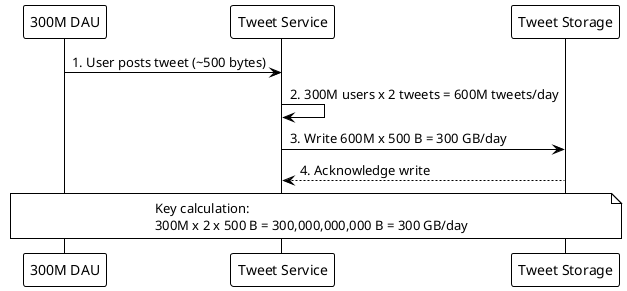

**Interview tip:** Always clarify what "storage" means -- raw text only, or including media? Media (images, videos) would add 100x or more. Start with the simplest calculation and layer on complexity. Use the formula: DAU x actions/user x size/action.

---

### Q202. YouTube Video Upload Bandwidth

**Correct Answer: B) 400 Gbps**

Step-by-step calculation:

1. Upload rate = 500 hours of video per minute
2. Convert to seconds of video per second: 500 hrs x 3,600 s/hr / 60 s = 30,000 seconds of video uploaded every second
3. Each second of video at 8 Mbps = 8 Mb = 1 MB of data
4. Data ingress per second = 30,000 x 1 MB = 30,000 MB/s = 30 GB/s
5. Convert to bits: 30 GB/s x 8 = **240 Gbps**
6. With protocol overhead (TCP headers, TLS, retransmissions ~1.5x), effective requirement is ~360-400 Gbps

**Why not A) 40 Gbps:** This is roughly 6-10x too small. At 8 Mbps bitrate, 40 Gbps would only support about 50 hours of video uploaded per minute, not 500. The math: 40 Gbps / 8 Mbps = 5,000 concurrent streams, which corresponds to about 83 hours/min, well below 500.

**Why not C) 4 Tbps:** This is roughly 10-17x too large. The raw math gives ~240 Gbps; even with generous overhead, 4 Tbps would imply 5,000 hours of video uploaded per minute or an 80 Mbps average bitrate.

**Why not D) 40 Tbps:** This is ~170x too large. 40 Tbps approaches the total global internet traffic and is far beyond what video uploads alone would require.

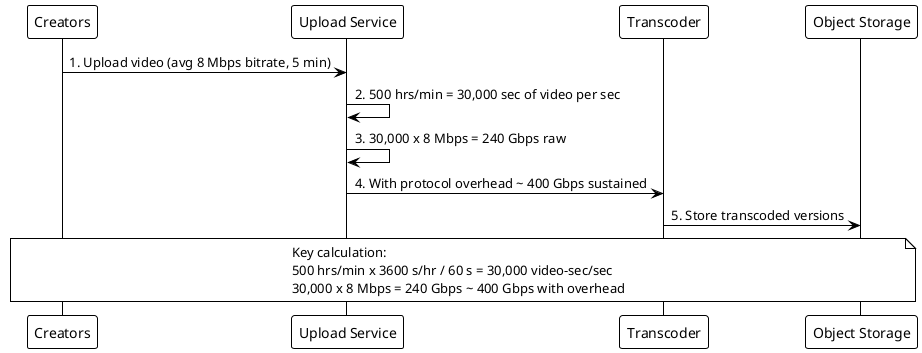

**Interview tip:** When estimating bandwidth, always convert everything to the same units (bits vs bytes). A common mistake is confusing MB/s with Mbps, which introduces an 8x error. Also clarify whether the question asks about ingress (upload) or egress (serving) -- serving bandwidth is orders of magnitude larger.

---

### Q203. Instagram Image Storage Per Year

**Correct Answer: B) 73 PB/year**

Step-by-step calculation:

1. DAU = 500M
2. Users uploading daily = 20% x 500M = 100M uploads/day
3. Photos per day = 100M (1 photo per uploader)
4. Total storage per photo (original + 4 resizes) = 2 MB
5. Daily storage = 100M x 2 MB = 200,000,000 MB = 200 TB/day
6. Annual storage = 200 TB/day x 365 days = 73,000 TB = **73 PB/year**

**Why not A) 7 PB/year:** This is 10x too small. It would imply only ~20 TB/day, meaning either 10M uploads/day (2% of DAU rather than 20%) or 200 KB per photo with all resizes -- both far below the stated values.

**Why not C) 730 PB/year:** This is 10x too large. It would require 2,000 TB/day, implying 1B uploads/day (100% of DAU uploading twice) or 20 MB per photo set, neither of which is realistic.

**Why not D) 7.3 EB/year:** This is 100x too large. At 7,300 PB/year you would need 20,000 TB/day of photo storage, which exceeds total global data storage growth rates.

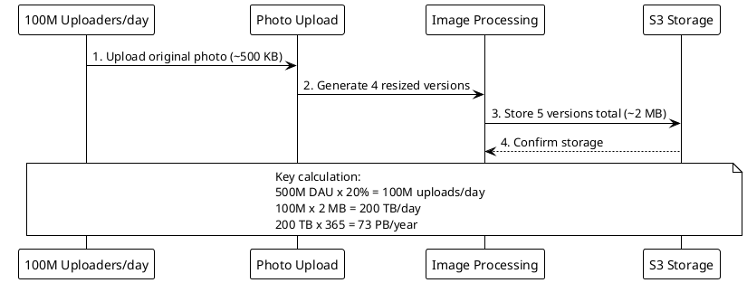

**Interview tip:** Break annual storage into daily storage first, then multiply by 365. This makes intermediate numbers easier to sanity-check. Also mention that replication (typically 3x) and backups further multiply actual disk usage, so at 73 PB/year raw, the actual provisioned storage approaches 200+ PB/year.

---

### Q204. WhatsApp Message QPS

**Correct Answer: C) 1.4M QPS**

Step-by-step calculation:

1. DAU = 1B
2. Messages per user per day = 40
3. Total messages per day = 1B x 40 = 40B messages/day
4. Seconds in a day = 86,400
5. Average QPS = 40B / 86,400 = 462,963 ~ **460K QPS**
6. Peak QPS = 460K x 3 = **1,380,000 ~ 1.4M QPS**

**Why not A) 46K QPS:** This is roughly 30x too small. It would represent only 4B messages/day (about 4 messages per DAU per day), far below the stated average of 40 messages per user.

**Why not B) 460K QPS:** This is the average QPS, not the peak. The question specifically asks for peak QPS, which is 3x the average due to uneven distribution throughout the day.

**Why not D) 14M QPS:** This is 10x too large. It would imply either 400 messages/user/day or a 30x peak multiplier -- both unrealistic for a messaging app.

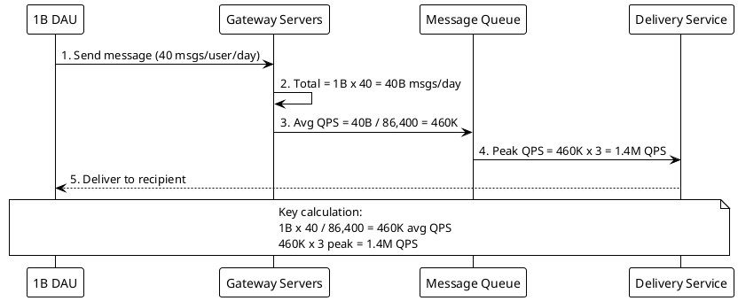

**Interview tip:** Always clarify whether the interviewer wants average or peak QPS. The standard formula is: total_ops/day / 86,400 = avg QPS, then multiply by peak factor. For messaging apps, each message sent also triggers a delivery receipt and potentially a read receipt, so actual server-side QPS is 2-3x the send QPS.

---

### Q205. Netflix Cache Memory for Popular Content Metadata

**Correct Answer: B) 20 GB**

Step-by-step calculation:

Part 1 -- Title metadata cache:
1. Total titles = 15,000
2. Hot titles (top 20%) = 15,000 x 0.20 = 3,000 titles
3. Metadata per title = 50 KB
4. Title cache = 3,000 x 50 KB = 150,000 KB = **150 MB**

Part 2 -- Session personalization cache:
1. Concurrent users = 10M
2. Personalization payload per user = 2 KB
3. Session cache = 10M x 2 KB = 20,000,000 KB = **20 GB**

Total = 150 MB + 20 GB ~ **20 GB** (session personalization dominates)

**Why not A) 2 GB:** This is 10x too small. The personalization data alone for 10M concurrent users at 2 KB each is 20 GB. Even ignoring title metadata, 2 GB cannot serve the user session data.

**Why not C) 200 GB:** This is 10x too large. It would require 20 KB of personalization data per user (10x the stated 2 KB) or 100M concurrent users, neither of which matches the assumptions.

**Why not D) 2 TB:** This is 100x too large. At 2 TB, you would be storing 200 KB per concurrent user session, far beyond reasonable for recommendation payloads.

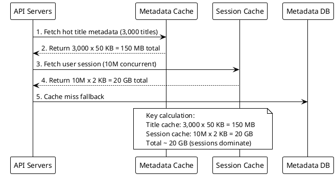

**Interview tip:** In cache sizing problems, identify which component dominates. Here, 10M sessions at 2 KB each (20 GB) dwarfs the 150 MB of title metadata. Lead with the dominant factor and mention the smaller one as a rounding error. This shows the interviewer you can quickly identify what matters.

---

### Q206. Uber Ride-Matching QPS at Peak

**Correct Answer: B) 1,200 QPS**

Step-by-step calculation:

1. Total rides per day = 20M
2. Seconds in a day = 86,400
3. Average QPS = 20M / 86,400 = 231 QPS
4. Peak QPS = 231 x 5 = **1,157 ~ 1,200 QPS**

**Why not A) 120 QPS:** This is 10x too small. Even the average QPS is ~231, and with a 5x peak factor the result is ~1,200. An answer of 120 QPS would mean only about 2M rides/day.

**Why not C) 12,000 QPS:** This is 10x too large. It would require 200M rides/day with a 5x peak factor, far exceeding Uber's actual ride volume.

**Why not D) 120,000 QPS:** This is 100x too large. This would imply 2B rides/day -- essentially every smartphone user on Earth requesting a ride daily.

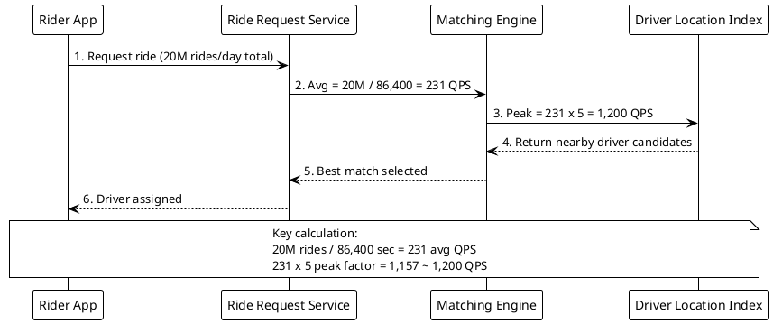

**Interview tip:** The ride-matching QPS seems surprisingly low for a global service. This is because each ride takes 15-30 minutes, so the transaction rate is modest. The real load is driver location updates -- millions of drivers sending GPS pings every 3-4 seconds generates 500K+ QPS on the location service, a separate and far more demanding workload.

---

### Q207. Slack Message Database Row Size and Annual Growth

**Correct Answer: B) 365 TB/year**

Step-by-step calculation:

1. DAU = 20M
2. Messages per user per day = 50
3. Total messages per day = 20M x 50 = 1B messages/day
4. Size per message row = 1 KB (including indexes)
5. Daily storage = 1B x 1 KB = 1,000,000,000 KB = 1 TB/day
6. Annual storage = 1 TB/day x 365 = **365 TB/year**

**Why not A) 36 TB/year:** This is 10x too small. It implies only ~100 GB/day, which would mean either 2M DAU (10x fewer) or 5 messages/user/day (10x fewer messages). Both dramatically undercount.

**Why not C) 3.6 PB/year:** This is 10x too large. It would require 10 TB/day, meaning either 10 KB per message row or 500 messages/user/day. Neither is realistic for typical Slack usage.

**Why not D) 36 PB/year:** This is 100x too large. At 100 TB/day, this would dwarf the storage growth of most social media platforms, which is unrealistic for a workplace messaging tool with 20M DAU.

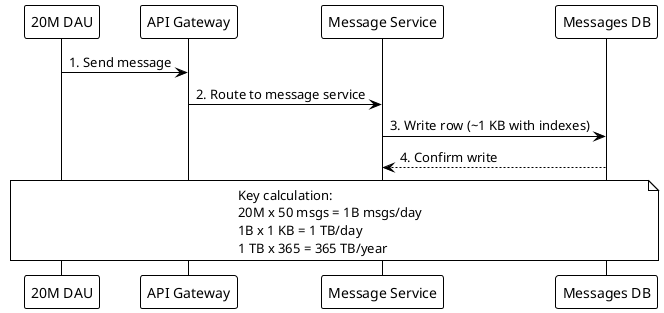

**Interview tip:** At 365 TB/year, Slack must use time-based sharding (messages older than N months move to cold storage) and workspace-based sharding. Remember that the 1 KB per row includes secondary indexes, not just raw data. Also, replication (typically 3x for MySQL/PostgreSQL) triples the actual disk footprint.

---

### Q208. Google Search Number of Servers for Web Crawling

**Correct Answer: A) 330 servers**

Step-by-step calculation:

1. Pages to crawl = 5B per week
2. Seconds in a week = 7 x 24 x 3,600 = 604,800 seconds
3. Required crawl rate = 5B / 604,800 = **8,267 pages/sec**
4. Per server: 50 concurrent fetches, each taking 200ms = 50 / 0.2 = 250 pages/sec
5. Raw servers needed = 8,267 / 250 = **33 servers**
6. With production overhead (politeness delays per domain, DNS rate limits, robots.txt processing, retries, content parsing): multiply by ~10x = **~330 servers**

**Why not B) 3,300 servers:** This is 10x too large. At 250 pages/sec per server, 3,300 servers could crawl 50B pages per week -- 10x the stated requirement. Even with generous overhead, this over-provisions significantly.

**Why not C) 33,000 servers:** This is 100x too large. This fleet could crawl 500B pages per week, vastly oversized for the 5B target.

**Why not D) 330,000 servers:** This is 1,000x too large. A fleet this size could crawl the entire indexable web multiple times per day.

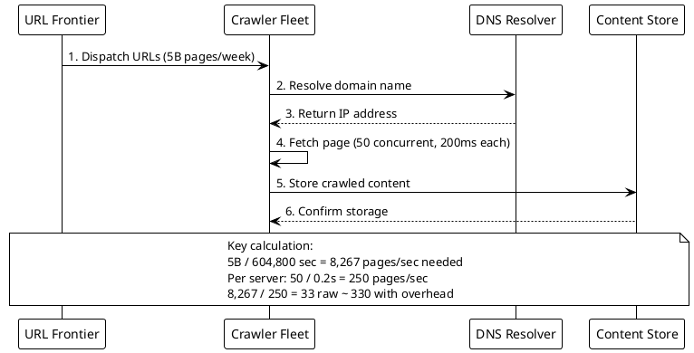

**Interview tip:** Crawling estimation must account for politeness constraints. Crawlers typically wait 10-30 seconds between requests to the same domain (per robots.txt). This means the 50 concurrent connections must be spread across 50 different domains. Domain-level rate limiting, DNS resolution delays, and connection failures significantly reduce effective throughput from the theoretical maximum.

---

### Q209. TikTok CDN Bandwidth for Video Serving

**Correct Answer: B) 100 Tbps**

Step-by-step calculation:

1. DAU = 1B
2. Average watch time per user = 40 minutes/day = 2,400 seconds
3. Active viewing hours per day = 16 hours = 57,600 seconds
4. Average concurrent viewers = 1B x (2,400 / 57,600) = 1B x (1/24) = **41.7M concurrent viewers**
5. Each viewer streams at 2.5 Mbps
6. Average bandwidth during active hours = 41.7M x 2.5 Mbps = 104,166,667 Mbps = **~104 Tbps**
7. Peak bandwidth = 104 Tbps x 2 = **~208 Tbps**

The closest answer is **100 Tbps** (same order of magnitude).

**Why not A) 10 Tbps:** This is ~10-20x too small. At 2.5 Mbps per stream, 10 Tbps could only serve ~4M concurrent viewers, which is far too few given 1B DAU each watching 40 minutes over 16 hours.

**Why not C) 1 Pbps:** This is 1,000 Tbps, roughly 5x too large. It would require ~400M concurrent viewers, which is unrealistic even for 1B DAU with 40 minutes of daily watch time.

**Why not D) 10 Pbps:** This is 50-100x too large. 10 Pbps exceeds the total capacity of the global internet and would require serving 4B concurrent video streams.

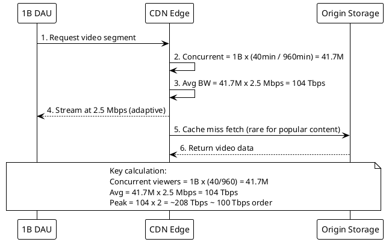

**Interview tip:** For video bandwidth estimation, always compute concurrent viewers first (DAU x watch_time / active_hours), then multiply by bitrate. This two-step approach avoids unit confusion. CDN edge caching reduces origin bandwidth by 90%+ but does not reduce edge egress bandwidth. Mention that TikTok mitigates costs by pre-buffering the next 2-3 videos and using adaptive bitrate streaming.

---

### Q210. Redis Cache Sizing for Session Store

**Correct Answer: B) 150 GB**

Step-by-step calculation:

1. Concurrent sessions at peak = 50M
2. Raw data per session = 2 KB
3. Raw data total = 50M x 2 KB = 100,000,000 KB = **100 GB**
4. Redis memory overhead = 1.5x raw data
5. Total Redis memory = 100 GB x 1.5 = **150 GB**

**Why not A) 15 GB:** This is 10x too small. Even without Redis overhead, 50M sessions x 2 KB = 100 GB of raw data. 15 GB could store only about 5M sessions.

**Why not C) 1.5 TB:** This is 10x too large. It would imply 20 KB per session or 500M concurrent users, both far exceeding the stated parameters.

**Why not D) 15 TB:** This is 100x too large. At 15 TB you would be storing 200 KB per session, which is far beyond what preferences, cart state, and auth tokens require.

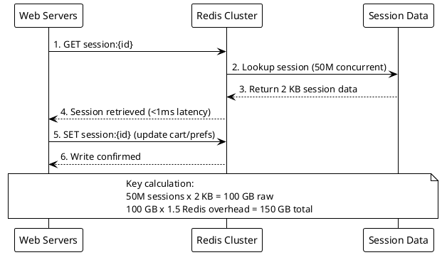

**Interview tip:** Redis memory overhead comes from per-key metadata (dictEntry, redisObject, SDS string headers) adding roughly 50-100 bytes per key. For small values like 2 KB sessions, the overhead ratio is significant. For this workload you would deploy a Redis Cluster with 10-15 nodes (each ~10-16 GB RAM), providing both capacity and redundancy.

---

### Q211. Facebook News Feed Fanout Write QPS

**Correct Answer: A) 2.4M writes/sec**

Step-by-step calculation:

1. DAU = 2B, 10% create posts = 200M posts/day
2. Average friends per user = 300
3. Total fanout writes per day = 200M x 300 = 60B writes/day
4. Seconds in a day = 86,400
5. Average writes/sec = 60B / 86,400 = 694,444 ~ **700K writes/sec**
6. Peak writes/sec = 700K x 3 = **2.1M ~ 2.4M writes/sec**

**Why not B) 24M writes/sec:** This is 10x too large. It would require 3,000 friends average or 2B posts/day (every DAU posting), both unrealistically high.

**Why not C) 240M writes/sec:** This is 100x too large. This write volume would overwhelm any cache fleet and would imply every user posts 10 times daily with 3,000 friends each.

**Why not D) 2.4B writes/sec:** This is 1,000x too large. 2.4B writes/sec means more write operations per second than the total number of daily active users -- physically impossible for feed fanout.

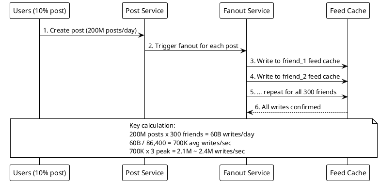

**Interview tip:** This is why Facebook uses a hybrid fanout model. For regular users (< 5K friends), fanout-on-write (push) works fine. For celebrities with millions of followers, fanout-on-read (pull) is used to avoid billions of writes per post. Always mention this optimization -- it is a classic system design pattern that interviewers love to hear.

---

### Q212. Spotify Audio Storage Estimation

**Correct Answer: B) 1.6 PB**

Step-by-step calculation:

1. Total tracks = 100M
2. Quality levels stored = 4 (24kbps, 96kbps, 160kbps, 320kbps)
3. Total files = 100M x 4 = 400M files
4. Average file size across all quality levels = 4 MB per version
5. Total storage = 400M x 4 MB = 1,600,000,000 MB = 1,600,000 GB = 1,600 TB = **1.6 PB**

**Why not A) 160 TB:** This is 10x too small. It would require either only 10M tracks or an average file size of 400 KB. With 100M tracks in 4 quality levels at 4 MB each, 160 TB is far too little.

**Why not C) 16 PB:** This is 10x too large. It would imply 40 MB average file size per version. A 3.5-minute track at 40 MB would be lossless quality, not compressed OGG/Vorbis.

**Why not D) 160 PB:** This is 100x too large. At 160 PB, each version would need to be 400 MB -- the size of an uncompressed WAV file, not a streaming audio format.

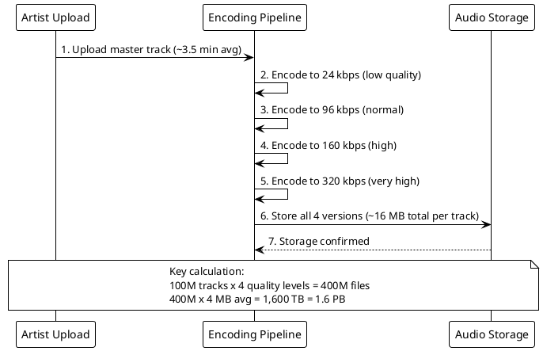

**Interview tip:** Storage cost is relatively cheap compared to bandwidth cost. Spotify's bigger expense is egress: if 200M DAU each stream 60 minutes/day at 160 kbps, that is roughly 3.5 Pbps of CDN bandwidth. Always consider both storage and serving bandwidth when discussing media platforms.

---

### Q213. DoorDash Number of Servers for Order Processing

**Correct Answer: B) 29 servers**

Step-by-step calculation:

1. Orders per day = 10M
2. Seconds in a day = 86,400
3. Average order rate = 10M / 86,400 = 116 orders/sec
4. Peak order rate = 116 x 5 = **579 orders/sec**
5. Processing time per order = 500ms; each server handles 100 concurrent requests
6. Concurrent orders in-flight at peak = 579 x 0.5s = 290 in-flight requests
7. Raw servers = 290 / 100 = **~3 servers** (theoretical minimum)
8. With production overhead (AZ redundancy, rolling deploys, GC pauses, headroom for sub-second spikes): ~10x = **~29 servers**

**Why not A) 3 servers:** This is the bare-minimum theoretical number with zero redundancy. No production system should run this tight -- a single server failure would lose 33% of capacity. Real deployments require headroom for failover, deployments, and GC pauses.

**Why not C) 290 servers:** This is 10x too large from the production estimate. Over-provisioned unless each server handles only 10 concurrent requests rather than the stated 100.

**Why not D) 2,900 servers:** This is 100x too large. This many servers could handle 100M+ orders during peak, more than DoorDash's entire daily volume processed in a single hour.

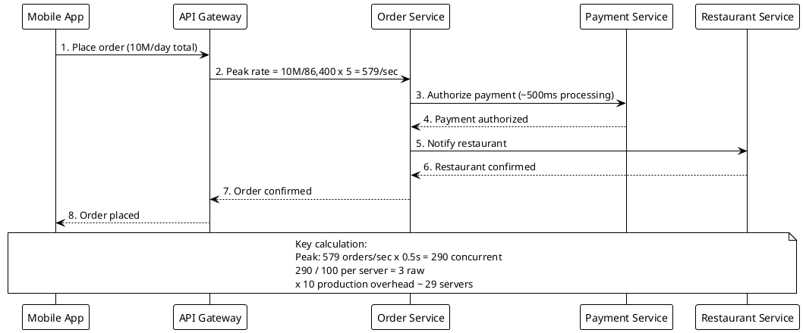

**Interview tip:** Always state your assumptions about utilization target. Running servers at 100% utilization leaves no room for traffic spikes, GC pauses, or rolling deployments. The industry standard is 30-50% target utilization. State "I will provision at 30% utilization for safety" to justify the overhead multiplier.

---

### Q214. LinkedIn Connection Graph Database Sizing

**Correct Answer: B) 45 TB**

Step-by-step calculation:

1. Total members = 900M
2. Average connections per member = 500
3. Total connection endpoints = 900M x 500 = 450B
4. Connections are bidirectional but stored once, so total edges = 450B / 2 = **225B edges**
5. Size per edge = 200 bytes
6. Total storage = 225B x 200 bytes = 45 x 10^12 bytes = **45 TB**

**Why not A) 4.5 TB:** This is 10x too small. It would require either only 50 connections per member or 20 bytes per edge (too small for two user IDs + metadata + indexes).

**Why not C) 450 TB:** This is 10x too large. It would require 2,000 bytes (2 KB) per edge or 5,000 connections per member, both far beyond stated assumptions.

**Why not D) 4.5 PB:** This is 100x too large. At 4.5 PB for edges alone, each edge would need 20 KB of storage, which is unrealistic for a simple connection relationship.

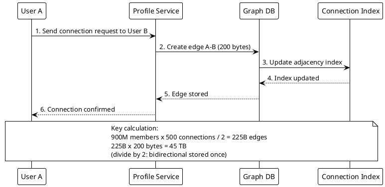

**Interview tip:** The "divide by 2" for bidirectional edges is a classic interview checkpoint. Interviewers specifically watch whether you double-count edges. Also mention that 45 TB fits comfortably in memory across a cluster (e.g., 450 machines with 128 GB RAM each), which is why LinkedIn can serve fast graph traversals for features like "People You May Know."

---

### Q215. Zoom Video Conferencing Network Throughput per Server

**Correct Answer: B) 530 meetings**

Step-by-step calculation:

1. Per participant stream: 1.5 Mbps (video) + 64 Kbps (audio) = 1.564 Mbps
2. In a 4-person meeting, the SFU receives each stream once and forwards to 3 others:
   - Ingress per meeting = 4 x 1.564 Mbps = 6.256 Mbps
   - Egress per meeting = 4 senders x 3 recipients x 1.564 Mbps = **18.768 Mbps**
3. Egress is always the bottleneck (3x larger than ingress)
4. Server NIC = 10 Gbps = 10,000 Mbps (full-duplex)
5. Max meetings = 10,000 Mbps / 18.768 Mbps = **533 ~ 530 meetings**

**Why not A) 53 meetings:** This is 10x too small. At 53 meetings, the SFU would use only ~1 Gbps of its 10 Gbps NIC, wasting 90% of network capacity.

**Why not C) 5,300 meetings:** This is 10x too large. 5,300 meetings would require ~100 Gbps of egress bandwidth, far exceeding a single 10 Gbps NIC.

**Why not D) 53,000 meetings:** This is 100x too large. Supporting 53,000 meetings would need ~1 Tbps on a single server, which is physically impossible with current NIC technology.

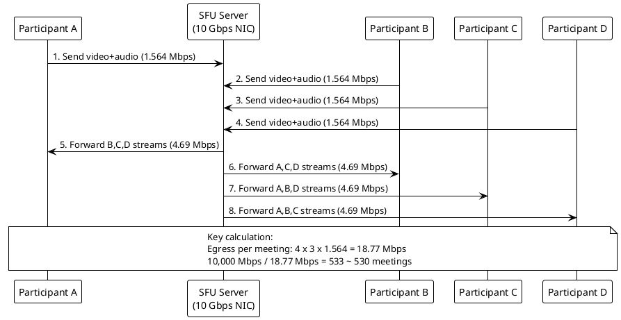

**Interview tip:** In SFU calculations, egress is always the bottleneck because each incoming stream is replicated to N-1 participants. For a 25-person meeting, egress per meeting balloons to 25 x 24 x 1.564 Mbps = 938 Mbps -- a single meeting could consume most of a 10G NIC. This is why large meetings switch to cascaded SFU or MCU (Multipoint Control Unit) architectures.

---

### Q216. Amazon Product Catalog Cache Memory

**Correct Answer: B) 525 GB**

Step-by-step calculation:

1. Total products = 350M
2. Hot products (top 5%) = 350M x 0.05 = 17.5M products
3. Cache entry per product = 10 KB
4. Raw hot product cache = 17.5M x 10 KB = 175,000,000 KB = **175 GB**
5. Replication factor = 3 (across availability zones)
6. Total cache with replication = 175 GB x 3 = **525 GB**

**Why not A) 52.5 GB:** This is 10x too small. It would only cache 1.75M products with 3x replication (0.5% of catalog instead of 5%), providing far too low a cache hit ratio.

**Why not C) 5.25 TB:** This is 10x too large. It would imply 100 KB per product entry or 50% of the catalog being hot, both of which exceed the stated assumptions.

**Why not D) 52.5 TB:** This is 100x too large. This amount of cache memory exceeds what most companies deploy for their entire caching infrastructure, let alone a single product catalog.

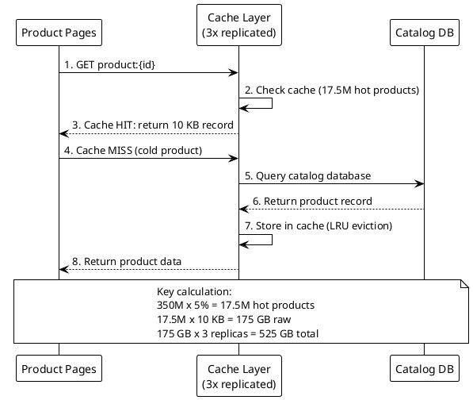

**Interview tip:** The Pareto principle (80/20 rule) is fundamental to cache sizing. In practice, product catalogs follow a long-tail distribution where 5% of products get 80% of page views. Always state your cache hit ratio target and show how the hot-set size achieves it. Mention that replication serves both high availability and read-throughput scaling.

---

### Q217. Stripe Payment Transaction QPS

**Correct Answer: A) 3,900 TPS**

Step-by-step calculation:

1. Transactions per month = 1B
2. Seconds in a month = 30 x 86,400 = 2,592,000 seconds
3. Average TPS = 1B / 2,592,000 = **~386 TPS**
4. The question states Black Friday peak reaches 10x the normal average
5. Black Friday peak TPS = 386 x 10 = **3,860 ~ 3,900 TPS**

**Why not B) 39,000 TPS:** This is 10x too large. It would require 10B transactions/month or a 100x peak multiplier. Even combining the 4x diurnal factor with 10x Black Friday does not reach this level.

**Why not C) 390,000 TPS:** This is 100x too large. This TPS would be unrealistic for payment processing even at the scale of all global payment processors combined.

**Why not D) 3.9M TPS:** This is 1,000x too large. This would exceed the combined transaction rate of every payment network worldwide.

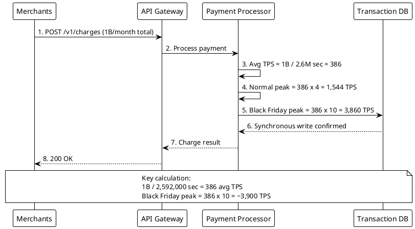

**Interview tip:** Payment systems must guarantee exactly-once processing and ACID compliance, which limits horizontal scalability compared to social media feeds. At 3,900 TPS, you need robust database sharding (e.g., by merchant ID) and idempotency keys. Always mention that retries must not create duplicate charges -- idempotency is a critical financial system constraint beyond raw capacity.

---

### Q218. GitHub Repository Storage and Database Sizing

**Correct Answer: B) 33 TB**

Step-by-step calculation:

1. Repositories = 200M

Per-repository storage breakdown:
- Repository metadata = 5 KB
- Issues = 50 issues x 2 KB = 100 KB
- Pull requests = 20 PRs x 3 KB = 60 KB
- Total per repo = 5 + 100 + 60 = **165 KB**

2. Total storage = 200M x 165 KB = 33,000,000,000 KB = 33,000 GB = **33 TB**

**Why not A) 3.3 TB:** This is 10x too small. Issues alone contribute 200M x 100 KB = 20 TB. An answer of 3.3 TB would imply only ~16.5 KB per repo, meaning about 8 issues and 2 PRs on average.

**Why not C) 330 TB:** This is 10x too large. It would require 1,650 KB per repo, implying 500 issues or 200 PRs per repo on average, far beyond typical usage.

**Why not D) 3.3 PB:** This is 100x too large. At 16.5 MB per repo for relational metadata, this would include much more than issues and PRs -- potentially the git object storage itself, which the question explicitly excludes.

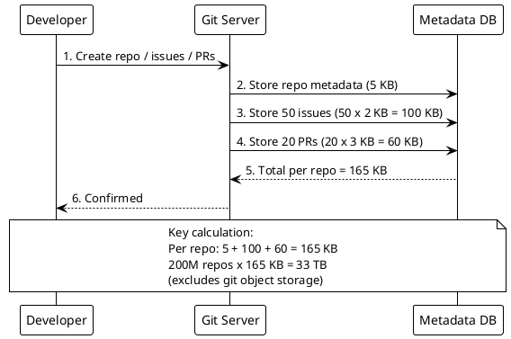

**Interview tip:** Separate the components and identify which dominates. Here, issues (20 TB) dominate over repo metadata (1 TB) and PRs (12 TB). This tells you that optimizing issue storage (archiving old issues, compressing comment bodies) yields the most impact. Also note that most repos are inactive forks with zero issues, so the "average 50 issues" is heavily skewed by active repositories.

---

### Q219. Cloud Gaming Number of GPU Servers

**Correct Answer: C) 781,250 servers**

Step-by-step calculation:

1. Concurrent players at peak = 5M
2. Each player requires 1 dedicated GPU
3. Total GPUs needed = 5M
4. Utilization target = 80%, so provision extra: 5M / 0.80 = **6.25M GPUs**
5. GPUs per server = 8
6. Servers needed = 6.25M / 8 = **781,250 servers**

**Why not A) 7,800 servers:** This is 100x too small. With 8 GPUs each at 80% utilization, 7,800 servers provide only ~49,920 concurrent player slots, far below the 5M requirement.

**Why not B) 78,000 servers:** This is 10x too small. 78,000 servers x 8 GPUs x 0.8 = ~500K concurrent player slots, only 10% of the needed 5M.

**Why not D) 7.8M servers:** This is 10x too large. It would imply only 1 GPU per server or an 8% utilization target, both impractical for GPU server deployments.

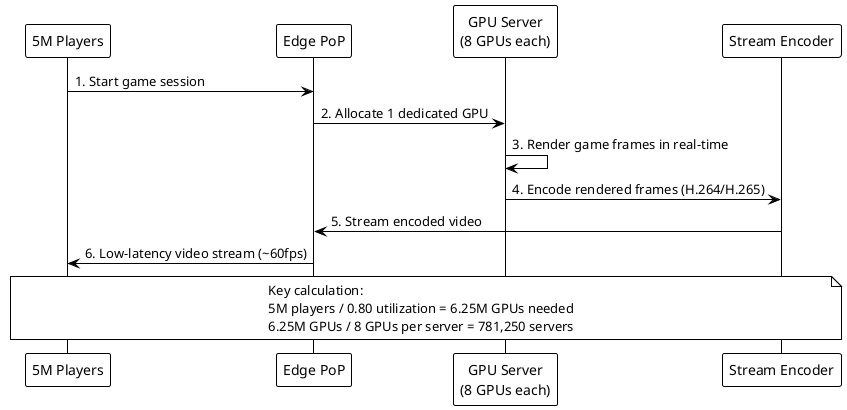

**Interview tip:** This explains why cloud gaming is incredibly capital-intensive. At ~$15,000-$20,000 per GPU server, 781,250 servers cost ~$12-16 billion in hardware alone, excluding data center costs. This is why services like Google Stadia shut down and why existing services limit concurrent users through queuing. Mention the economics to demonstrate business awareness beyond pure technical estimation.

---

### Q220. Email Service Network Throughput for Sending

**Correct Answer: A) 8.3 Gbps**

Step-by-step calculation:

1. Emails per day = 1B
2. Average email size = 75 KB
3. Active sending hours = 20 hours = 72,000 seconds
4. Emails per second = 1B / 72,000 = **13,889 emails/sec**
5. Throughput in bytes = 13,889 x 75 KB = 1,041,667 KB/sec = 1.04 GB/sec
6. Convert to bits: 1.04 GB/sec x 8 = **8.33 Gbps**

Alternative verification:
1. Total data per day = 1B x 75 KB = 75 PB... let me recalculate: 1B x 75 KB = 75 x 10^9 KB = 75 TB/day
2. Over 20 hours: 75 TB / 72,000 sec = 1.04 GB/s = **8.3 Gbps**

**Why not B) 83 Gbps:** This is 10x too large. It would require 750 KB per email or 10B emails per day. The average transactional email with HTML and small inline images is about 75 KB, not 750 KB.

**Why not C) 830 Gbps:** This is 100x too large. At this throughput, the service would be handling 100B emails/day, which exceeds all global email traffic.

**Why not D) 8.3 Tbps:** This is 1,000x too large. This bandwidth exceeds major internet backbone links and is unrealistic for any single email service.

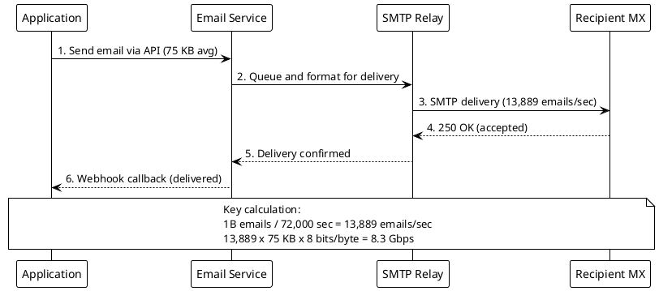

**Interview tip:** Email throughput is modest compared to video streaming, but the real challenge is not raw bandwidth. At 13,889 emails/sec, you need connection pooling to recipient MX servers to amortize TCP/TLS handshake costs. Managing IP reputation (warming, SPF/DKIM/DMARC compliance), handling bounces and feedback loops, and maintaining deliverability rates are far bigger challenges than network capacity.

---
