# System Design — Answers & Explanations
## Batch 6: Q221–Q270 — Pragmatic System Design Patterns

---

### Q221. Concurrent Bidding Race Condition

**Correct Answer: B) Optimistic locking using UPDATE WHERE version = expected, retrying on conflict**

Optimistic locking prevents the lost-update problem by including a version check in the UPDATE statement. When Bidder A reads version=1 and Bidder B reads version=1, only the first UPDATE succeeds (atomically changing version to 2). The second bidder's UPDATE matches zero rows (version is now 2, not 1), triggering a retry with the fresh state. This is the standard pattern for low-to-moderate contention scenarios like auctions, where most bids target different auctions and conflicts are infrequent within any single auction.

**Why not A)** Pessimistic locking with row-level locks held for the entire bid evaluation would work for correctness, but holding locks during evaluation degrades throughput dramatically at 100K auctions. Lock contention causes queueing delays and potential deadlocks. Pessimistic locking is reserved for cases where retries are unacceptable (e.g., bank transfers), not high-throughput bidding.

**Why not C)** Application-level mutex synchronized across all service instances requires a distributed lock manager (e.g., Redis or ZooKeeper). This adds a single point of failure, network round-trips for lock acquisition, and does not scale horizontally. It also creates a global bottleneck when the locking is only needed per-auction.

**Why not D)** Eventual consistency with last-write-wins is exactly the problem described. Last-write-wins means the $55 bid could overwrite the $60 bid simply because it arrived later at the database. This violates auction correctness — the highest bid must always win.

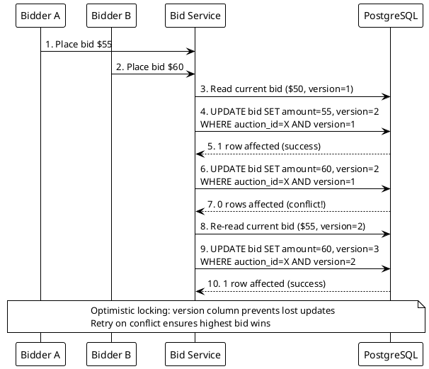

**Interview tip:** Always distinguish between lost updates (two writes, one silently overwritten) and dirty reads. Optimistic locking is the default concurrency strategy for web applications — mention it first, then discuss when you would escalate to pessimistic locking.

---

### Q222. Coupon Claim Atomicity

**Correct Answer: B) Use a single atomic UPDATE: `UPDATE coupons SET user_id=? WHERE status='free' LIMIT 1`**

The TOCTOU bug occurs because check (SELECT) and act (UPDATE) are separate operations. Between them, another request can claim the same coupon. A single atomic UPDATE eliminates the gap entirely — the database engine atomically finds a free coupon and assigns it in one statement. At 1.2M req/sec, this is the most scalable solution because it requires no external coordination, no lock management, and no queuing infrastructure.

**Why not A)** A distributed lock around the check-then-act sequence works but introduces a lock manager as a dependency and bottleneck. At 1.2M req/sec, the lock service itself becomes a scaling challenge. Lock acquisition and release add latency. The atomic UPDATE achieves the same correctness without any external coordination.

**Why not C)** Queuing all requests and processing sequentially in a single thread eliminates concurrency entirely, but 1.2M req/sec cannot be processed by a single thread. Even at 1 microsecond per operation, a single thread handles only 1M ops/sec. This creates a bottleneck and unacceptable latency for users.

**Why not D)** Optimistic locking with version numbers would work but is unnecessarily complex for this case. Each coupon would need a version column, and under extreme contention (1.2M req/sec all targeting the same pool), retry rates would be very high. The atomic UPDATE is simpler and more efficient.

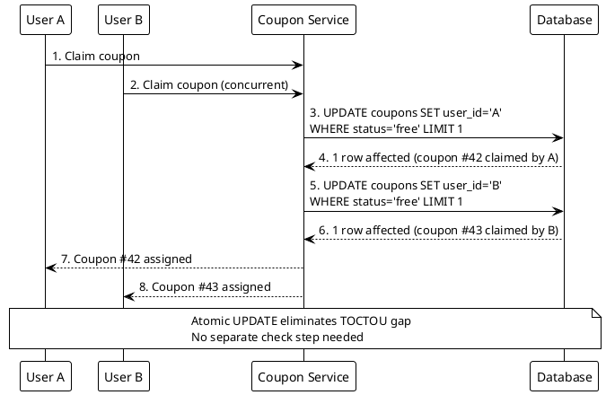

**Interview tip:** Whenever you see a check-then-act pattern, immediately flag it as a TOCTOU vulnerability. The fix is always to merge the two operations into one atomic step — either via a conditional UPDATE, a compare-and-swap, or a database constraint.

---

### Q223. Ticket Reservation Linearization

**Correct Answer: A) Linearization: pre-created rows with atomic UPDATE to claim a free ticket**

Linearization leverages pre-created ticket rows (100K per venue, created at event setup time). Each ticket row has a status column. Claiming a ticket is a single atomic UPDATE: `UPDATE tickets SET status='reserved', user_id=? WHERE venue_id=? AND seat=? AND status='free'`. Only one user can succeed because the WHERE clause atomically checks and transitions the state. This pattern is specifically designed for fixed, pre-known inventory.

**Why not B)** Optimistic locking with retry loops works but adds unnecessary complexity when the inventory is pre-created. Version-based retries mean every failed attempt must re-read and retry, increasing latency under contention. Linearization achieves the same result with a single atomic operation and no retries needed — if the UPDATE affects 0 rows, the seat is taken.

**Why not C)** Distributed lock per seat with 30-second TTL introduces Redis/ZooKeeper as a dependency. At 60K rps across 1K venues, managing millions of lock keys adds operational complexity. Lock expiry edge cases (user holds lock but crashes) require careful handling. The database already provides atomicity — no need for external locking.

**Why not D)** Queuing all reservations into a single Kafka partition per venue serializes all requests, limiting throughput to sequential processing speed. At 60K rps, even distributed across 1K venues, each partition handles 60 requests/sec — manageable, but the added latency of Kafka (publish, consume, process) is unnecessary when an atomic UPDATE provides the same correctness with lower latency.

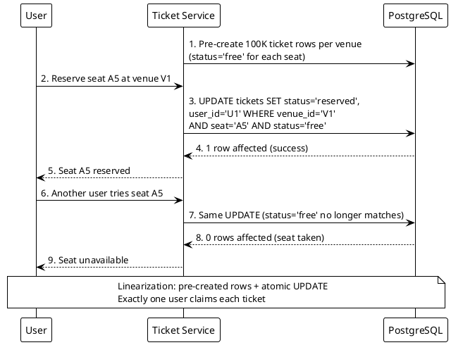

**Interview tip:** Linearization is the go-to pattern for fixed inventory (tickets, coupons, limited-edition items). Mention that pre-creating rows shifts the complexity to setup time and makes the hot path (claiming) as simple as a single atomic UPDATE.

---

### Q224. Auction Write Volume Sizing

**Correct Answer: B) PostgreSQL — supports UPDATE WHERE version = expected with ACID guarantees**

PostgreSQL handles 8K writes/sec comfortably on modern hardware (SSDs, connection pooling). It natively supports optimistic locking via `UPDATE ... WHERE version = expected` with full ACID guarantees, ensuring no lost updates. The 500M writes/day translates to ~5.8K writes/sec average, peaking at 8K — well within PostgreSQL's capacity. Its mature ecosystem, tooling, and strong consistency model make it the default choice for workloads that need ACID.

**Why not A)** Redis handles 100K+ ops/sec, but it is an in-memory store not designed as a primary database for durable auction data. Redis persistence (RDB/AOF) does not provide the same ACID guarantees as PostgreSQL. Auction bid history needs durable, queryable storage with relational integrity — Redis is better suited as a cache or for real-time leaderboard views.

**Why not C)** Cassandra is optimized for write-heavy workloads but uses eventual consistency by default. Optimistic locking with `UPDATE WHERE version = expected` requires strong consistency (linearizable reads and conditional writes). Cassandra's lightweight transactions (LWT) can provide this but at significant performance cost, negating its write throughput advantage.

**Why not D)** Elasticsearch is a search engine, not a transactional database. It provides near-real-time indexing but does not support ACID transactions or conditional updates needed for optimistic locking. Using Elasticsearch as a primary store for auction bids would risk data loss and inconsistency.

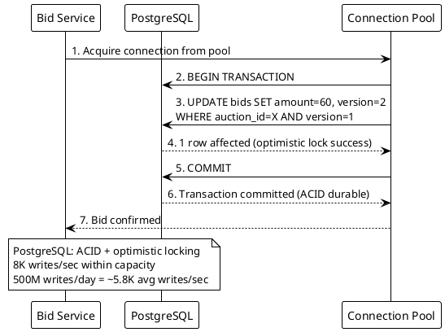

**Interview tip:** PostgreSQL is the default database choice — always start there and only move to specialized stores when PostgreSQL cannot meet specific requirements (e.g., sub-ms latency needs Redis, write-heavy eventual consistency needs Cassandra). State the throughput numbers to show you have sized the workload.

---

### Q225. Queue-Based Bid Serialization Trade-off

**Correct Answer: A) Kafka adds write latency, which may cause bids to arrive after auction close**

Switching from direct database writes to Kafka-based serialization adds latency at every step: publish to Kafka (network hop + disk fsync), consumer poll interval, and processing delay. In a time-sensitive auction where bids arrive in the final seconds, this added latency (typically 10-100ms) can mean the difference between a bid arriving before or after auction close. The 40% retry rate with optimistic locking is painful but at least bids are processed in near-real-time.

**Why not B)** Kafka easily handles 8K writes/sec. A single Kafka partition can sustain 50K+ messages/sec, and the system can use multiple partitions (one per auction). Throughput is not the limitation — latency is.

**Why not C)** Kafka does guarantee message ordering within a partition. This is one of its core design properties. Messages published to the same partition are consumed in exactly the order they were written.

**Why not D)** Kafka does not require all bidders to share a single consumer. The system can use one partition per auction (or hash auction_id to partitions), allowing parallel processing across auctions. Only bids within the same auction need serialization.

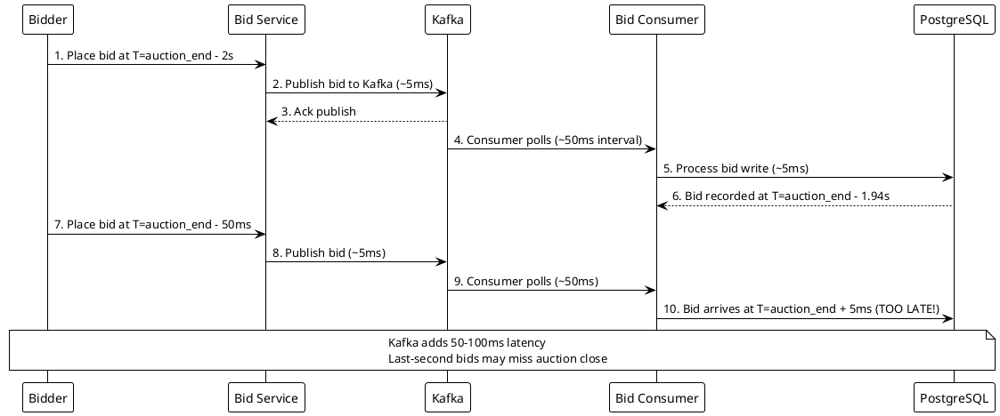

**Interview tip:** When evaluating trade-offs, always identify the primary constraint. For auctions, the constraint is time-sensitivity — bids have a hard deadline. Kafka trades latency for ordering guarantees, which is the wrong trade-off for auction systems. Mention that the 40% retry rate can be mitigated by partitioning auctions across database shards.

---

### Q226. Optimistic vs Pessimistic Locking Selection

**Correct Answer: B) Optimistic locking — it is the default for low contention**

Optimistic locking is the default concurrency strategy when conflicts are rare. It works by allowing all writes to proceed without locks, detecting conflicts only at commit time via a version check. With fewer than 1% conflicts, 99%+ of writes succeed on the first attempt — no lock overhead, no waiting, no deadlock risk. This maximizes throughput and minimizes latency for the common case.

**Why not A)** Pessimistic locking guarantees no conflicts, but at a cost: every write acquires a lock, even the 99% that would never conflict. This adds latency (lock acquisition), reduces concurrency (other writers must wait), and risks deadlocks. Pessimistic locking is justified only when conflicts are frequent or retries are unacceptable.

**Why not C)** Queue serialization enforces strict ordering by funneling all writes through a queue. This is extreme overkill for a low-contention scenario. It adds infrastructure complexity (queue management) and latency (publish/consume cycle) to solve a problem that barely exists at <1% conflict rate.

**Why not D)** Ignoring conflicts entirely is dangerous. Even at <1% conflict rate, 1% of 2K writes/sec means 20 lost updates per second. Over a day, that is 1.7M corrupted records. Low contention does not mean zero contention — optimistic locking handles the rare conflicts gracefully.

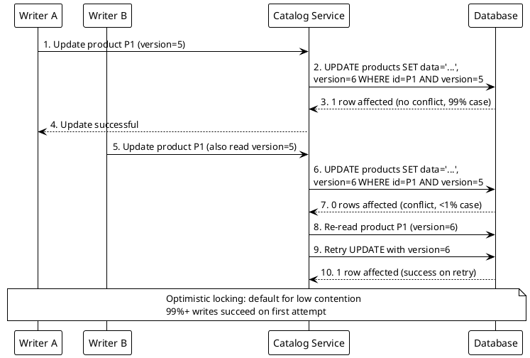

**Interview tip:** Present locking as a spectrum: optimistic (default, low contention), pessimistic (high contention or no-retry scenarios), and queue serialization (strict ordering required). Always state the contention rate before choosing.

---

### Q227. Ticket Status Machine Reversal

**Correct Answer: A) Transition to Reversed state, then back to Free for re-availability**

The status machine should include a Reversed state to maintain a complete audit trail. When a reservation times out, the ticket transitions from Reserved to Reversed (recording why it was released), then to Free (making it available again). This two-step transition preserves the history of what happened — the ticket was reserved, the reservation expired, and it was returned to the pool. This is critical for debugging, analytics, and compliance.

**Why not B)** Deleting the reservation row and re-creating a free ticket destroys audit history. You lose the record of who reserved it, when, and why it was released. In ticketing systems, this history is essential for fraud detection, customer support, and regulatory compliance. Never delete — always transition state.

**Why not C)** Keeping Reserved status indefinitely locks the ticket forever if the user abandons the flow. This is a resource leak — tickets become permanently unavailable without any mechanism for recovery. Timeouts exist precisely to prevent this scenario.

**Why not D)** Transitioning from Reserved to Final as a no-sale record marks the ticket as permanently consumed. It would never return to the available pool. This makes sense for canceled-after-payment scenarios but not for a simple timeout where the ticket should be resold.

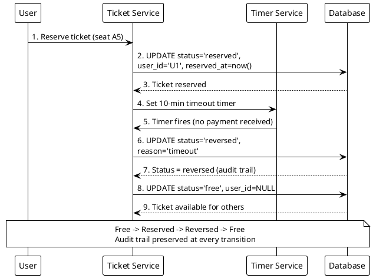

**Interview tip:** State machines should always move forward — never delete rows or skip states. Every transition should be recorded for auditability. Mention that the timeout value (e.g., 10 minutes) should be configurable and that the timer can be implemented via a scheduled job or a delayed message queue.

---

### Q228. Fixed Inventory Concurrency Pattern

**Correct Answer: B) Linearization: pre-create rows and use atomic claims**

Linearization is specifically designed for fixed, pre-known inventory. The pattern is: (1) pre-create all inventory rows at setup time (e.g., 10M coupon rows or 100K ticket rows per venue), (2) each row has a status column initialized to 'free', (3) claiming is a single atomic UPDATE that transitions status from 'free' to 'claimed'. Because the rows already exist, there is no insert contention, no sequence generation, and no need for external coordination.

**Why not A)** Optimistic locking with version-based retries is a general-purpose concurrency pattern, not specific to fixed inventory. It works but requires retry logic and version management. For fixed inventory where rows are pre-created, linearization is simpler and more efficient — a single UPDATE with no retries needed (if the row is already claimed, return "sold out").

**Why not C)** Pessimistic locking with SELECT FOR UPDATE acquires row-level locks, blocking other transactions. Under high concurrency (e.g., 1.2M req/sec for coupons), lock contention becomes severe. Linearization achieves the same correctness without holding locks — the atomic UPDATE is non-blocking.

**Why not D)** Saga pattern with compensating transactions is for multi-step distributed transactions (e.g., reserve ticket, charge payment, send confirmation). It is an orchestration pattern, not a concurrency control pattern. Fixed inventory claiming is a single-step operation that does not need saga coordination.

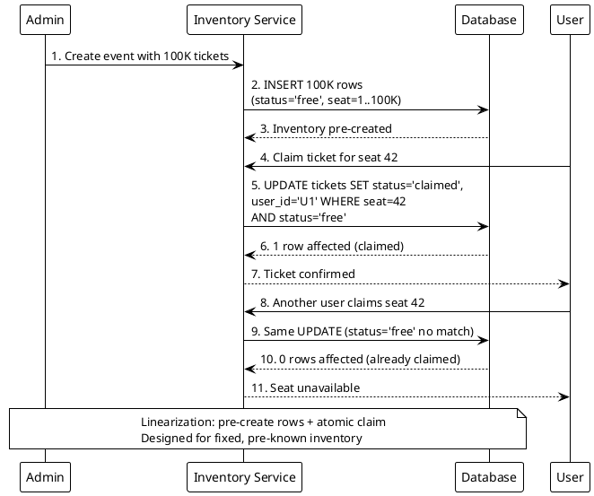

**Interview tip:** When the interviewer mentions fixed inventory (tickets, coupons, limited items), immediately say "linearization" — pre-create the rows and use atomic claims. This shows you know the specific pattern rather than reaching for generic concurrency tools.

---

### Q229. Coupon Sharding Strategy

**Correct Answer: A) Shard by coupon_id to co-locate coupon state for atomic updates**

Sharding by coupon_id ensures each coupon's state lives on exactly one shard. The atomic UPDATE (`UPDATE coupons SET user_id=? WHERE coupon_id=? AND status='free'`) hits a single shard, maintaining atomicity without cross-shard coordination. At 1.2M req/sec with 10M coupons distributed across shards, the load is evenly distributed because coupon IDs are uniformly assigned.

**Why not B)** Sharding by user_id means a coupon's state could be accessed from any shard (since different users on different shards try to claim the same coupon). This requires cross-shard queries or distributed transactions to check and update coupon status atomically — defeating the purpose of sharding. L7 load balancer hashing by user_id helps with session affinity, but does not solve the coupon atomicity problem.

**Why not C)** Sharding by timestamp creates hot shards — all current requests hit the same time-range shard. It also does not co-locate coupon state, since a coupon created at time T1 could be claimed at time T2, landing on different shards. Timestamp-based sharding is useful for time-series data, not transactional claims.

**Why not D)** A single unsharded database cannot handle 1.2M req/sec. Even with connection pooling, a single PostgreSQL instance typically tops out at 50-100K queries/sec. The workload requires horizontal scaling via sharding.

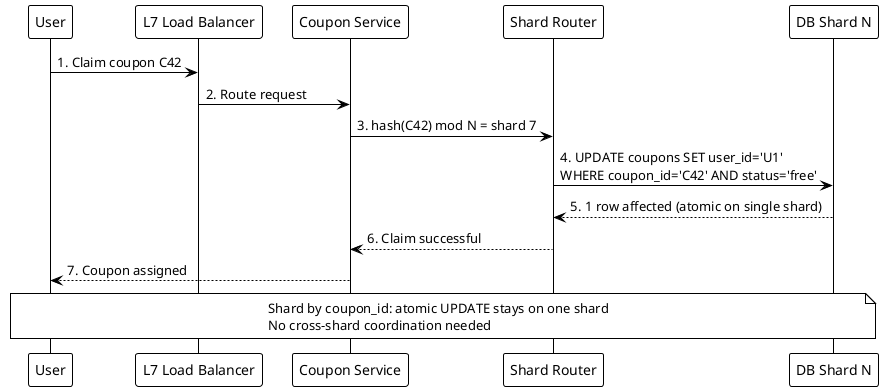

**Interview tip:** The shard key should match the entity being mutated atomically. If you are atomically updating a coupon, shard by coupon_id. If you are atomically updating a user profile, shard by user_id. The rule is: shard by the entity that needs single-shard atomicity.

---

### Q230. Strict Ordering Requirement

**Correct Answer: B) Queue serialization — Kafka partition per account guarantees ordering**

When operations must be processed in exact arrival order with no reordering allowed, queue serialization is the correct strategy. Kafka guarantees ordering within a partition. By using account_id as the partition key, all transactions for a given account land on the same partition and are consumed in order. This is the only strategy among the options that provides strict total ordering per entity.

**Why not A)** Optimistic locking with version-based retries prevents lost updates but does not enforce ordering. Two concurrent transactions with the same version could be retried in any order. Optimistic locking ensures correctness (no conflicts), not ordering (first-in-first-out processing).

**Why not C)** Linearization with pre-created rows is for fixed inventory claims (tickets, coupons). Financial transactions are dynamic — new transactions are created continuously. There are no pre-created rows to atomically claim. Linearization solves a different problem than strict ordering.

**Why not D)** Pessimistic locking with row-level locks prevents concurrent access but does not guarantee the order in which waiting transactions acquire the lock. Two transactions waiting for the same lock may be granted access in arbitrary order depending on the database scheduler. Pessimistic locking ensures isolation, not ordering.

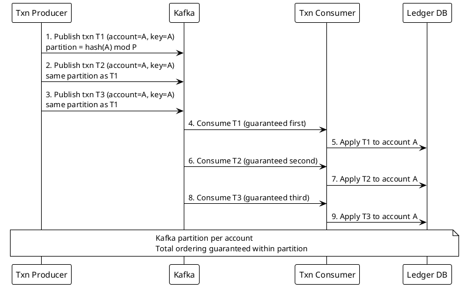

**Interview tip:** Map the concurrency requirement to the right tool: prevent lost updates = optimistic locking, prevent concurrent access = pessimistic locking, enforce ordering = queue serialization. State this decision framework explicitly in your interview.

---

### Q231. Reservation UUID Correlation

**Correct Answer: B) Generate a reservation UUID and use it as the payment correlation ID**

A reservation UUID is a purpose-generated unique identifier created when the reservation is made. This UUID is sent to the payment gateway as a reference, and the gateway includes it in the webhook callback. The ticket service uses it to look up the exact reservation. This decouples the internal ticket ID from the external payment flow, supports multiple payment attempts per reservation, and is immune to collisions or ambiguity.

**Why not A)** Using the ticket ID as the payment reference exposes internal database IDs to an external system. If a reservation is retried or the ticket is re-assigned, the ticket ID may no longer correspond to the same context. Internal IDs should not leak to external systems — they create coupling and potential security issues.

**Why not C)** Matching by user email address is fragile. Users may have multiple reservations, the email could be misspelled, or the payment gateway may not include the email in the webhook. Email is not a unique identifier for a specific reservation — it identifies a person, not a transaction.

**Why not D)** Polling the payment gateway every second is wasteful and does not scale. With thousands of concurrent reservations, polling generates massive unnecessary traffic. It also adds latency (up to 1 second delay) and couples the ticket service to the gateway's availability. Webhooks are the standard pattern for async notification.

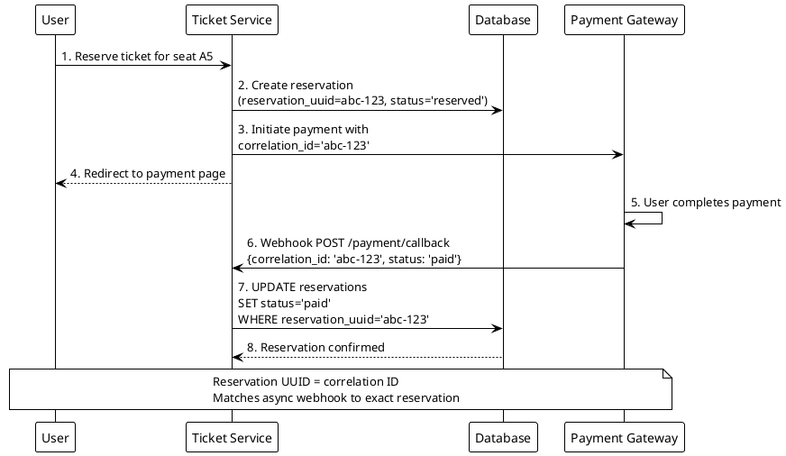

**Interview tip:** Always use a dedicated correlation ID for async flows. This is a general pattern beyond payments — it applies to any request-callback cycle (order fulfillment, third-party API calls, background job completion). Mention that the UUID should be indexed for fast lookup when the webhook arrives.

---

### Q232. Pessimistic Locking Use Case

**Correct Answer: B) When the operation must not fail and retries are not acceptable**

Pessimistic locking is the right choice when failure or retry would cause inconsistency or unacceptable user experience. In a bank transfer, a failed optimistic lock retry could lead to a scenario where the debit succeeds but the credit is retried — potentially double-crediting or leaving the accounts in an inconsistent state. Pessimistic locking (SELECT FOR UPDATE) acquires exclusive access to both accounts before making changes, guaranteeing the operation completes atomically without any retry logic.

**Why not A)** Write throughput exceeding 100K ops/sec is actually a reason to avoid pessimistic locking, not use it. At that scale, lock contention becomes severe. High throughput favors optimistic locking or queue serialization, where most operations proceed without waiting.

**Why not C)** Low contention where most operations succeed is the ideal scenario for optimistic locking, not pessimistic. If 99% of writes succeed without conflict, paying the overhead of lock acquisition on every write is wasteful.

**Why not D)** Eventual consistency is the opposite of what pessimistic locking provides. If the system uses eventual consistency, there is no need for row-level locking at all. Pessimistic locking enforces strong consistency — the two concepts are mutually exclusive.

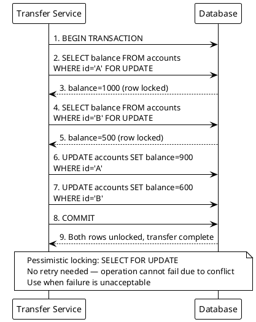

**Interview tip:** Present the locking decision as a trade-off: optimistic locking optimizes for the common case (no conflict) but requires retry logic; pessimistic locking guarantees success but reduces concurrency. Use pessimistic when the cost of failure exceeds the cost of reduced throughput.

---

### Q233. Default Database Selection

**Correct Answer: B) PostgreSQL as the default relational database**

PostgreSQL is the default choice for any new service without extreme requirements. It provides ACID transactions, relational queries with joins, strong typing, mature indexing (B-tree, GIN, GiST), and an enormous ecosystem of tools, ORMs, and monitoring. At under 10K ops/sec, a single PostgreSQL instance handles the workload comfortably. Start with PostgreSQL and only move to specialized stores when you have a specific requirement that PostgreSQL cannot meet.

**Why not A)** Redis is an in-memory cache/store optimized for sub-millisecond latency and simple data structures. It lacks relational queries, joins, and full ACID transaction support. Using Redis as a primary database means sacrificing queryability and durability (even with persistence, it is not designed for primary storage).

**Why not C)** Cassandra is designed for distributed, write-heavy workloads with eventual consistency. A standard CRUD service at 10K ops/sec does not need Cassandra's distributed architecture. Cassandra's query model is restrictive (no joins, limited WHERE clauses) and its operational complexity is higher than PostgreSQL.

**Why not D)** MongoDB provides schema flexibility but sacrifices relational integrity. For standard CRUD with well-defined schemas and relational queries, PostgreSQL is more appropriate. MongoDB's document model shines when the data is truly semi-structured, not for typical relational workloads.

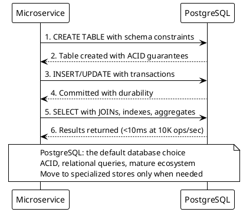

**Interview tip:** Always start with "PostgreSQL is my default database" and then justify deviations. This shows pragmatism. Interviewers are looking for you to avoid premature optimization — choosing Cassandra or Redis without a specific need signals over-engineering.

---

### Q234. High-Throughput Cache Selection

**Correct Answer: B) Redis as a distributed cache for hot data**

Redis delivers sub-millisecond latency with 100K+ ops/sec per node. For a 30GB working set (1% of 3TB), a small Redis cluster (3-4 nodes with replication) handles 300K reads/sec easily. Redis supports key-value lookups, TTL-based expiration, and cluster mode for horizontal scaling. It is the standard choice for caching hot data in front of a primary database.

**Why not A)** PostgreSQL with read replicas can scale reads but cannot achieve sub-millisecond latency consistently. Disk-based storage, even with buffer pools, adds 1-10ms latency per query. At 300K reads/sec, you would need many replicas, and replication lag introduces consistency challenges. PostgreSQL is the source of truth, not the cache.

**Why not C)** Elasticsearch with in-memory segments is a search engine, not a key-value cache. It adds indexing overhead, has higher latency than Redis for simple lookups, and is not optimized for point queries by key. Elasticsearch is for full-text search, not URL-to-destination mapping.

**Why not D)** Cassandra with local quorum reads provides single-digit millisecond latency, not sub-millisecond. Its strength is write throughput and multi-region replication, not read speed for a caching use case. The operational complexity of a Cassandra cluster is unjustified when Redis solves the problem more simply.

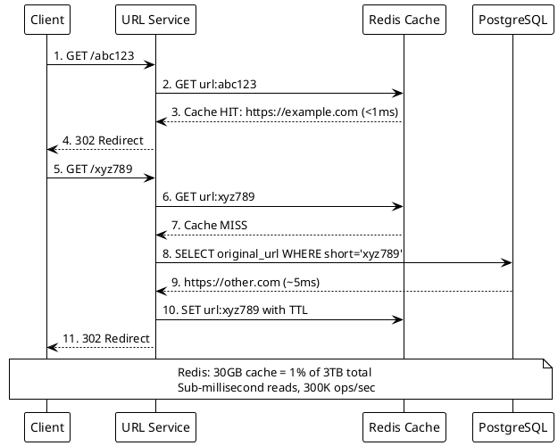

**Interview tip:** Use the 1% rule for cache sizing: cache 1% of total data to cover the hot working set. Mention specific Redis capabilities (cluster mode, TTL, eviction policies) to show operational familiarity.

---

### Q235. Write-Heavy Database Selection

**Correct Answer: C) Cassandra — designed for write-heavy workloads with eventual consistency**

Cassandra uses an LSM-tree storage engine where writes go to an in-memory memtable and are flushed to disk as immutable SSTables. This makes writes extremely fast — append-only with no random I/O. Its peer-to-peer architecture allows linear horizontal scaling by adding nodes. For a web crawler storing 15B URLs with eventual consistency acceptable (crawl freshness varies by hours anyway), Cassandra is the ideal fit.

**Why not A)** PostgreSQL with write-ahead log tuning can improve write throughput, but its B-tree-based storage requires random I/O for updates. At millions of writes/sec, a single PostgreSQL instance would be overwhelmed, and sharding PostgreSQL adds significant operational complexity. Cassandra scales writes horizontally with minimal configuration.

**Why not B)** Redis with append-only file persistence is an in-memory store. Storing 15B URLs in Redis would require terabytes of RAM — prohibitively expensive. Redis is a cache, not a primary store for massive datasets. The AOF persistence mode also does not provide the query flexibility needed for crawl management.

**Why not D)** Elasticsearch with bulk indexing handles writes well but is a search engine, not a primary database. It lacks the durability guarantees and storage efficiency of Cassandra for simple key-value or wide-column writes. Elasticsearch is appropriate when you need to search crawl results, not as the primary crawl data store.

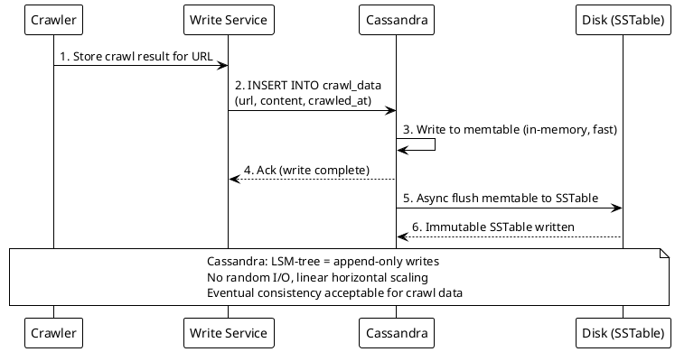

**Interview tip:** Match the consistency requirement to the database. If eventual consistency is acceptable and writes dominate, say "Cassandra." If strong consistency is needed, say "PostgreSQL." Always state why eventual consistency is acceptable for the specific use case (e.g., "crawl freshness varies by hours, so stale reads are fine").

---

### Q236. Full-Text Search Database

**Correct Answer: B) Elasticsearch — purpose-built for full-text search**

Elasticsearch is built on Apache Lucene and provides inverted indexes, BM25 relevance scoring, stemming, typo tolerance (fuzzy matching), and distributed search across shards. It is the standard choice for full-text search across millions or billions of documents. Its near-real-time indexing means new posts appear in search results within seconds.

**Why not A)** PostgreSQL with GIN indexes on tsvector columns supports basic full-text search, but it lacks Elasticsearch's relevance tuning, fuzzy matching, synonym handling, and horizontal scaling for search workloads. PostgreSQL's full-text search is adequate for simple use cases but not for a news feed where relevance ranking and typo tolerance are critical.

**Why not C)** Redis with sorted sets and prefix matching can support autocomplete but not full-text search. Redis has no inverted index, no stemming, no relevance scoring, and no typo tolerance. It is a key-value store, not a search engine.

**Why not D)** Cassandra with SASI indexes provides basic secondary indexes but does not support full-text search. SASI is limited to prefix matching and exact lookups on indexed columns. It has no relevance ranking, no stemming, and no fuzzy matching.

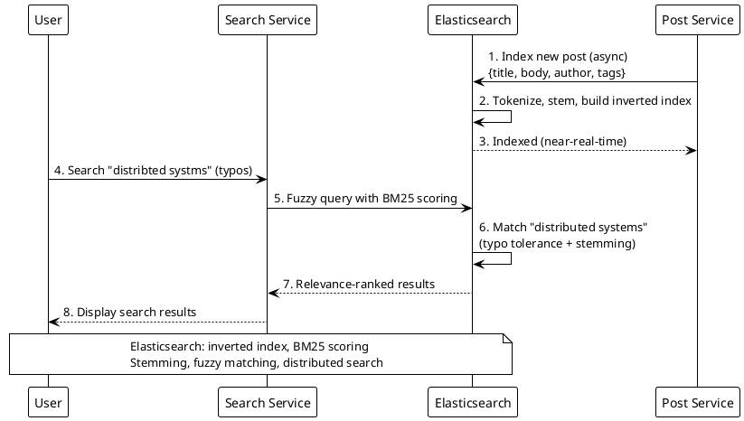

**Interview tip:** Elasticsearch is typically used as a secondary index alongside a primary database (PostgreSQL). Mention this dual-write pattern: writes go to the primary DB and are asynchronously indexed into Elasticsearch. Never use Elasticsearch as the sole data store.

---

### Q237. Ticketing System Shard Key

**Correct Answer: B) Shard by venue — natural partition since queries are venue-scoped**

Since most queries are scoped to a single venue (list available seats, reserve a seat), sharding by venue ensures all tickets for a venue live on the same shard. This means queries never cross shard boundaries — no scatter-gather needed. With 1K venues, the load distributes across shards naturally (60K rps / 1K venues = 60 rps per venue average). Hot venues may need further optimization, but the partition key aligns perfectly with the access pattern.

**Why not A)** Hash-based distribution by ticket_id would spread a venue's tickets across all shards. Listing available seats for a venue would require a scatter-gather query across every shard — dramatically increasing latency and load. The even distribution benefit is irrelevant when queries are venue-scoped.

**Why not C)** Sharding by user_id distributes users evenly but makes venue-scoped queries (the dominant access pattern) require scatter-gather across all shards. A user browsing available seats would hit every shard. The shard key must match the query pattern, not the requestor.

**Why not D)** Timestamp-based range partitioning creates hot shards (all current writes hit the latest partition) and makes venue-scoped queries span multiple time ranges. Ticketing queries are venue-scoped, not time-scoped.

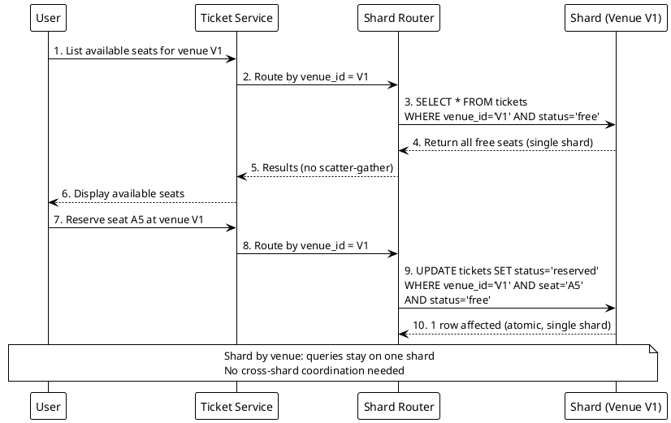

**Interview tip:** The golden rule of shard key selection: shard by the entity that scopes your most frequent queries. If 90% of queries filter by venue, shard by venue. State this rule, then apply it to the specific scenario.

---

### Q238. Hash vs Range Sharding

**Correct Answer: B) Hash-based sharding — even distribution for point lookups**

Hash-based sharding computes hash(short_code) mod N to determine the shard. This distributes keys uniformly across shards regardless of key patterns (no hot spots from sequential IDs or alphabetical clustering). For point lookups (given a short code, find the URL), hash sharding provides O(1) routing to the correct shard. Since no range queries are needed, the inability to do efficient range scans is not a drawback.

**Why not A)** Range-based sharding is optimized for sequential scans and range queries (e.g., "all URLs created between date X and Y"). For point lookups by short code, range sharding offers no advantage and can create hot spots if short codes are generated sequentially (all new codes hit the latest range partition).

**Why not C)** Directory-based sharding uses a lookup table to map keys to shards. This adds an extra hop (check directory, then query shard) and the directory itself becomes a bottleneck and single point of failure. It provides flexibility for rebalancing but is unnecessarily complex for a uniform hash distribution.

**Why not D)** Entity-based sharding co-locates related data on the same shard (e.g., all messages in a conversation). URL shortener lookups are independent — there is no related data to co-locate. Each short code maps to exactly one URL, making hash-based distribution the natural fit.

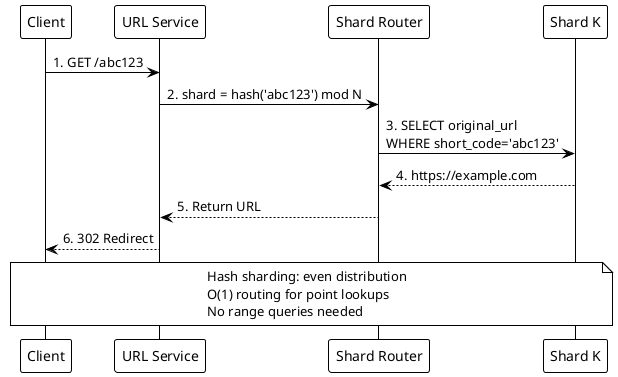

**Interview tip:** Always ask "do I need range queries?" before choosing a sharding strategy. If yes, use range-based. If no, use hash-based for even distribution. This simple decision tree covers most sharding scenarios.

---

### Q239. Consistent Hashing Benefit

**Correct Answer: B) Consistent hashing — only affected keys rehash on node failure**

Consistent hashing maps both keys and nodes onto a circular hash ring. When a node fails, only the keys assigned to that node need to be redistributed to the next node on the ring — roughly 1/N of total keys (where N is the number of nodes). With 10 nodes, only ~10% of keys are affected, compared to modulo hashing where removing a node changes the modulo value and rehashes nearly all keys.

**Why not A)** Modulo hashing (hash(key) mod N) is simple but catastrophic on node changes. When N changes from 10 to 9, the modulo for almost every key changes, causing ~90% of keys to map to different nodes. This triggers a cache stampede where most lookups become misses, overwhelming the backend database.

**Why not C)** Random assignment with a lookup directory requires maintaining a mapping of every key to its assigned node. With 300K reads/sec, the directory becomes a bottleneck and single point of failure. It also requires O(keys) storage in the directory, which does not scale.

**Why not D)** Range-based partitioning with manual rebalancing requires operator intervention when a node fails. This is too slow for a cache cluster that needs to recover in seconds. Consistent hashing provides automatic, minimal redistribution without human involvement.

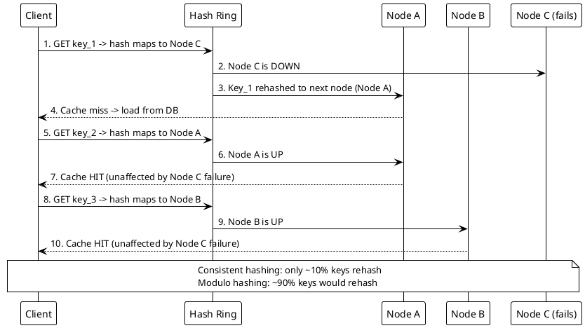

**Interview tip:** When discussing cache clusters, always mention consistent hashing and explain the ring concept. Bonus points for mentioning virtual nodes (vnodes) — each physical node maps to multiple points on the ring, improving distribution uniformity.

---

### Q240. Bloom Filter vs Redis for URL Dedup

**Correct Answer: B) When memory efficiency matters more than eliminating rare false positives**

A Bloom filter uses 50GB to track 15B URLs with a ~1 in 1M false positive rate. Redis stores exact URLs but requires 700GB (14x more memory). For a web crawler, a false positive means occasionally re-crawling a URL that was already visited — a minor inefficiency. The 14x memory savings (50GB vs 700GB) is a massive cost reduction. Choose the Bloom filter when the cost of rare false positives is low and memory savings are significant.

**Why not A)** If zero false positives are required, you cannot use a Bloom filter — you need exact membership testing (Redis SET or database lookup). But crawlers tolerate false positives because re-crawling a page is cheap compared to the memory cost of exact dedup at 15B URLs.

**Why not C)** Standard Bloom filters do not support deletion. If you need to remove individual URLs from the set (e.g., marking a URL for re-crawl), you need a Counting Bloom Filter or Redis. This is a valid reason to choose Redis, not the Bloom filter.

**Why not D)** If the URL set fits in available memory, Redis provides exact dedup with no false positives. The Bloom filter's advantage is specifically for cases where the data is too large for exact in-memory storage, or where the cost savings of smaller memory footprint matter.

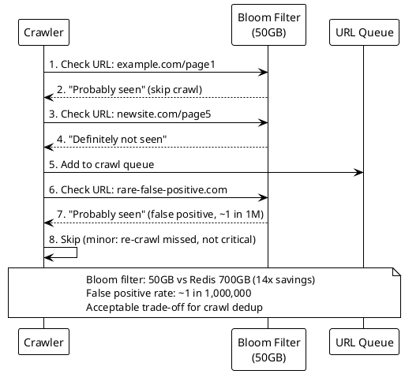

**Interview tip:** Frame Bloom filters as a memory-accuracy trade-off. State the specific numbers: "50GB Bloom filter vs 700GB Redis, with 1-in-a-million false positive rate." This shows you can reason quantitatively about probabilistic data structures.

---

### Q241. Entity-Based Sharding

**Correct Answer: B) Entity-based sharding by conversation — natural partition for co-located data**

Entity-based sharding uses the conversation_id (or a derived key like sorted participant IDs) as the shard key. This ensures all messages in a conversation land on the same shard, enabling efficient ordered reads (no scatter-gather), atomic operations within a conversation, and simplified consistency guarantees. With 1B messages/day distributed across many conversations, the load spreads naturally.

**Why not A)** Hash by message_id distributes messages evenly but scatters a conversation's messages across all shards. Reading a conversation thread requires querying every shard and merging results — a scatter-gather anti-pattern that increases latency and load. Even distribution is meaningless if every read touches every shard.

**Why not C)** Range by timestamp puts all recent messages on the same shard (hot spot) and makes conversation reads span multiple time-range shards. A conversation spanning days would require queries across multiple shards. Timestamp-based sharding works for time-series analytics, not conversational data.

**Why not D)** Random distribution with a lookup table requires a separate directory mapping each message to its shard. This adds a lookup step to every read/write, the directory becomes a bottleneck, and it does not provide the co-location benefit that conversation-based sharding offers.

```plantuml
@startuml
!theme plain
skinparam backgroundColor white

participant "User A" as UA
participant "Chat Service" as CS
participant "Shard Router" as SR
participant "Shard (Conv C1)" as S

UA -> CS: 1. Send message to conversation C1
CS -> SR: 2. shard = hash(conv_id='C1') mod N
SR -> S: 3. INSERT INTO messages\n(conv_id='C1', sender='A', text='Hello')
S --> SR: 4. Message stored
SR --> CS: 5. Write confirmed

UA -> CS: 6. Load conversation C1 history
CS -> SR: 7. shard = hash(conv_id='C1') mod N
SR -> S: 8. SELECT * FROM messages\nWHERE conv_id='C1' ORDER BY ts
S --> SR: 9. All messages (single shard, ordered)
SR --> CS: 10. Return conversation thread

note over UA,S
  Entity-based sharding: all messages for C1 on one shard
  Efficient ordered reads, no scatter-gather
end note
@enduml
```

**Interview tip:** Entity-based sharding is the default when data has a natural grouping (conversations, orders, user profiles). State the rule: "shard by the entity that is always queried together." This eliminates cross-shard joins and scatter-gather reads.

---

### Q242. One-Percent Cache Sizing Rule

**Correct Answer: B) 30GB — 1% of 3TB total data**

The 1% rule is a practical heuristic based on the Pareto principle (power-law distribution). In most systems, a small fraction of data (1-5%) accounts for the majority of access (80-99%). For a URL shortener with 3TB total data, caching 1% (30GB) captures the hot working set. A Redis cluster with 30GB capacity (2-3 nodes) is operationally simple and cost-effective, serving 300K reads/sec at sub-millisecond latency.

**Why not A)** 300GB (10% of total) is over-provisioned. Caching 10% of data wastes memory and money. The power-law distribution means the 90th to 99th percentile of URLs are accessed so infrequently that caching them provides negligible hit rate improvement. Start at 1% and increase only if the cache hit rate is below target.

**Why not C)** 3GB (0.1% of total) is under-provisioned. This would cache only the most extreme hot spots, resulting in a lower cache hit rate and more database queries. While some systems with extreme concentration might work at 0.1%, 1% is the standard starting point.

**Why not D)** 150GB (5% of total) is unnecessarily large for a power-law workload. It provides diminishing returns beyond the 1% mark. The incremental hit rate gain from 1% to 5% is small compared to the 5x cost increase.

```plantuml
@startuml
!theme plain
skinparam backgroundColor white

participant "Client" as C
participant "URL Service" as US
participant "Redis (30GB)" as R
participant "PostgreSQL (3TB)" as PG

C -> US: 1. GET /popular_url (hot path)
US -> R: 2. Cache lookup
R --> US: 3. HIT (95%+ of requests)
US --> C: 4. Sub-millisecond response

C -> US: 5. GET /rare_url (cold path)
US -> R: 6. Cache lookup
R --> US: 7. MISS (5% of requests)
US -> PG: 8. Query database
PG --> US: 9. Result (~5ms)
US -> R: 10. Populate cache with TTL
US --> C: 11. Response

note over C,PG
  1% rule: 30GB cache for 3TB data
  Power-law distribution: 1% data serves 95%+ reads
end note
@enduml
```

**Interview tip:** Always state the 1% rule explicitly: "I would start with 1% of total data as cache size, which gives us 30GB." Then mention you would monitor cache hit rate and adjust. This shows you use heuristics as starting points, not dogma.

---

### Q243. Default API Protocol

**Correct Answer: C) REST — the default for standard request-response APIs**

REST over HTTP is the default protocol for external-facing APIs. It is universally supported by browsers, mobile clients, and third-party integrations. REST uses standard HTTP methods (GET, POST, PUT, DELETE), status codes, and JSON serialization — all well-understood by developers. For standard request-response patterns without streaming or real-time requirements, REST is the simplest, most interoperable choice.

**Why not A)** WebSockets are designed for bidirectional real-time communication (chat, live updates). For standard request-response APIs, WebSockets add unnecessary complexity — connection management, heartbeats, and reconnection logic. Use WebSockets only when you need persistent, bidirectional communication.

**Why not B)** gRPC uses Protocol Buffers for efficient binary serialization and is excellent for internal service-to-service calls. However, gRPC has limited browser support (requires grpc-web proxy), is not human-readable for debugging, and is less familiar to external API consumers. Use gRPC internally, REST externally.

**Why not D)** Server-Sent Events are for one-way server push (e.g., live notifications). They do not support client-to-server communication within the same connection. For standard CRUD APIs where the client initiates requests, SSE is the wrong pattern.

```plantuml
@startuml
!theme plain
skinparam backgroundColor white

participant "Mobile Client" as MC
participant "API Gateway" as GW
participant "Backend Service" as BS

MC -> GW: 1. GET /api/v1/products\n(Accept: application/json)
GW -> BS: 2. Route to product service
BS --> GW: 3. 200 OK\n{products: [...]}
GW --> MC: 4. JSON response

MC -> GW: 5. POST /api/v1/orders\n{product_id: 123, qty: 1}
GW -> BS: 6. Route to order service
BS --> GW: 7. 201 Created\n{order_id: 456}
GW --> MC: 8. JSON response

note over MC,BS
  REST: default for external APIs
  HTTP methods + JSON + status codes
  Universal client support
end note
@enduml
```

**Interview tip:** Start every API discussion with "REST is my default for external-facing APIs." Only switch to other protocols when you identify a specific need: bidirectional real-time -> WebSockets, internal high-throughput -> gRPC, one-way push -> SSE.

---

### Q244. Real-Time Bid Updates Protocol

**Correct Answer: B) WebSockets — bidirectional real-time communication**

WebSockets provide a persistent, full-duplex connection between client and server. Bidders send bids upstream and receive real-time price updates downstream over the same connection. The persistent connection eliminates the overhead of HTTP request/response cycles, providing sub-100ms latency for bid updates. With 1K bidders per auction, the WebSocket server maintains 1K connections per auction — well within capacity of modern servers.

**Why not A)** REST with polling every 500ms introduces latency (up to 500ms delay for updates) and generates massive unnecessary traffic. With 100K auctions and 1K bidders each, polling would produce 200M requests/sec (100K x 1K x 2/sec) — most returning "no change." WebSockets eliminate this waste by pushing updates only when they occur.

**Why not C)** Server-Sent Events support one-way server-to-client push. An auction system needs bidirectional communication — clients must send bids (upstream) and receive updates (downstream). SSE would require a separate HTTP channel for bid submission, complicating the architecture.

**Why not D)** gRPC unary calls with client polling has the same problems as REST polling — unnecessary traffic and latency. While gRPC server streaming could push updates, it lacks native browser support (requires grpc-web proxy) and is less suited for consumer-facing real-time applications.

```plantuml
@startuml
!theme plain
skinparam backgroundColor white

participant "Bidder A" as BA
participant "WebSocket Server" as WS
participant "Bid Service" as BS
participant "Bidder B" as BB

BA -> WS: 1. WS connect (upgrade from HTTP)
BB -> WS: 2. WS connect (upgrade from HTTP)
WS --> BA: 3. Connection established
WS --> BB: 4. Connection established

BA -> WS: 5. Send bid: $60 (upstream)
WS -> BS: 6. Process bid (optimistic lock)
BS --> WS: 7. Bid accepted
WS --> BA: 8. Push: "Your bid $60 accepted"
WS --> BB: 9. Push: "New highest bid: $60"

BB -> WS: 10. Send bid: $65 (upstream)
WS -> BS: 11. Process bid
BS --> WS: 12. Bid accepted
WS --> BA: 13. Push: "Outbid! New high: $65"
WS --> BB: 14. Push: "Your bid $65 accepted"

note over BA,BB
  WebSocket: bidirectional, real-time
  Bids up, updates down — single connection
end note
@enduml
```

**Interview tip:** When the interviewer says "real-time" and "bidirectional," immediately say "WebSocket." Then quantify: "1K connections per auction, 100K auctions = 100M total connections across the server fleet." This shows you think about scale, not just protocol choice.

---

### Q245. Chat Polling vs WebSockets

**Correct Answer: B) WebSockets reduce read overhead by 60x, from 200K to 3K reads/sec**

With HTTP polling, every client checks for new messages every 3 seconds. Most polls return empty (no new messages), wasting server resources on empty responses. WebSockets flip the model: the server pushes messages only when they arrive. This reduces read overhead from 200K reads/sec (polling) to 3K reads/sec (actual message delivery) — a 60x reduction. The savings translate directly to fewer servers, lower latency, and lower operational cost.

**Why not A)** WebSockets do not encrypt messages more securely than HTTP. Both use TLS (wss:// and https://). Security is identical — the difference is in communication pattern (push vs pull), not encryption.

**Why not C)** WebSockets are not simpler to implement than polling. They require connection management, heartbeats, reconnection logic, and stateful server infrastructure. Polling is simpler to implement but wastes resources. The reason to choose WebSockets is efficiency, not simplicity.

**Why not D)** WebSocket message batching is not the primary benefit. While WebSockets can batch messages, the key advantage is eliminating the 98.5% of empty poll responses. The overhead reduction comes from push-based delivery, not packet batching.

```plantuml
@startuml
!theme plain
skinparam backgroundColor white

participant "Chat Client" as CC
participant "Polling Server" as PS
participant "WebSocket Server" as WS

== HTTP Polling (wasteful) ==
CC -> PS: 1. GET /messages (every 3s)
PS --> CC: 2. 204 No Content (empty)
CC -> PS: 3. GET /messages (3s later)
PS --> CC: 4. 204 No Content (empty)
CC -> PS: 5. GET /messages (3s later)
PS --> CC: 6. 200 OK: 1 new message
note right: 200K reads/sec, 98.5% empty

== WebSocket (efficient) ==
CC -> WS: 7. WS connect (once)
WS --> CC: 8. Push: new message (only when available)
WS --> CC: 9. Push: new message
note right: 3K reads/sec, 0% empty

note over CC,WS
  WebSocket: 60x reduction in read overhead
  Push-based: no wasted empty responses
end note
@enduml
```

**Interview tip:** Quantify the waste: "Polling generates 200K reads/sec, but 98.5% are empty. WebSockets reduce this to 3K actual message deliveries." Interviewers love concrete numbers that justify architectural decisions.

---

### Q246. Internal Service Communication Protocol

**Correct Answer: C) gRPC — efficient binary serialization for internal services**

gRPC uses Protocol Buffers for binary serialization (10x smaller than JSON, 5-10x faster to parse), provides strongly-typed service contracts (.proto files), supports bidirectional streaming, and generates client/server code in multiple languages. For internal service-to-service communication where both teams own the contract and browser compatibility is not needed, gRPC is the optimal choice.

**Why not A)** REST with JSON is the default for external APIs but adds overhead for internal calls: JSON serialization/deserialization is slower than Protobuf, text-based payloads are larger, and there is no built-in code generation or type safety. REST is fine internally for simple cases, but gRPC is better when throughput and type safety matter.

**Why not B)** WebSockets are for persistent bidirectional communication (chat, real-time updates). Service-to-service calls are typically request-response, not persistent connections. gRPC can use HTTP/2 multiplexing for efficient connection reuse without the complexity of WebSocket connection management.

**Why not D)** GraphQL provides flexible queries for frontend clients that need to fetch varying shapes of data. For internal service-to-service communication with fixed contracts, GraphQL adds unnecessary query parsing overhead. gRPC's fixed schema is more efficient and provides stronger guarantees.

```plantuml
@startuml
!theme plain
skinparam backgroundColor white

participant "Service A" as SA
participant "gRPC Client\n(generated)" as GC
participant "gRPC Server\n(generated)" as GS
participant "Service B" as SB

SA -> GC: 1. Call getUser(userId=123)
GC -> GC: 2. Serialize to Protobuf (binary, compact)
GC -> GS: 3. HTTP/2 request (multiplexed)
GS -> SB: 4. Deserialize Protobuf, invoke handler
SB --> GS: 5. Return User object
GS -> GC: 6. Serialize response to Protobuf
GC --> SA: 7. Typed User object (compile-time safe)

note over SA,SB
  gRPC: binary Protobuf, type-safe contracts
  Code generation, HTTP/2 multiplexing
  Ideal for internal service-to-service calls
end note
@enduml
```

**Interview tip:** Use the protocol decision tree: external API -> REST, internal service -> gRPC, bidirectional real-time -> WebSocket, one-way server push -> SSE. State this framework explicitly and then apply it to the specific scenario.

---

### Q247. One-Way Server Push Protocol

**Correct Answer: B) Server-Sent Events (SSE) — designed for one-way server push**

SSE is purpose-built for server-to-client push over HTTP. The client opens an HTTP connection, and the server sends events as text/event-stream. SSE handles reconnection automatically (with Last-Event-ID), works natively in browsers (EventSource API), and uses standard HTTP infrastructure (load balancers, proxies). For a monitoring dashboard where the server pushes updates and the client never sends data back, SSE is the simplest and most appropriate choice.

**Why not A)** WebSockets support bidirectional communication, but using WebSockets for one-way push is over-engineering. WebSockets require upgrade negotiation, custom reconnection logic, and stateful connection management. SSE provides the same push capability with simpler implementation and automatic reconnection.

**Why not C)** REST with long polling simulates server push but with significant overhead: each response requires a new HTTP request, there is no built-in reconnection or event ID tracking, and the server must manage pending connections. SSE provides a cleaner abstraction for the same pattern.

**Why not D)** gRPC server streaming works for server push but lacks native browser support (requires grpc-web proxy). For a dashboard consumed by browsers, SSE is simpler and universally supported. gRPC streaming is better for internal service-to-service scenarios.

```plantuml
@startuml
!theme plain
skinparam backgroundColor white

participant "Dashboard Client" as DC
participant "SSE Endpoint" as SSE
participant "Metrics Service" as MS

DC -> SSE: 1. GET /metrics/stream\n(Accept: text/event-stream)
SSE --> DC: 2. HTTP 200 (connection held open)

MS -> SSE: 3. New CPU metric: 72%
SSE --> DC: 4. event: cpu\ndata: {"value": 72}

MS -> SSE: 5. New memory metric: 8.2GB
SSE --> DC: 6. event: memory\ndata: {"value": 8.2}

DC -> DC: 7. Connection drops
DC -> SSE: 8. Auto-reconnect with Last-Event-ID
SSE --> DC: 9. Resume from last event

note over DC,MS
  SSE: one-way server push over HTTP
  Auto-reconnect, Last-Event-ID tracking
  Native browser support (EventSource API)
end note
@enduml
```

**Interview tip:** Distinguish SSE from WebSocket by directionality. SSE = unidirectional (server to client), WebSocket = bidirectional. If the interviewer says "the client never sends data back," SSE is the answer. Mention the auto-reconnect feature as a key advantage over raw WebSockets.

---

### Q248. Chat Shard Key for Conversations

**Correct Answer: B) Hash by hash(sorted([user_a, user_b])) to ensure both users map to the same shard**

By sorting the two user IDs and hashing the sorted pair, you get a deterministic shard assignment regardless of who sends the message. If user_a=5 and user_b=3, sorted=[3,5], hash([3,5]) always maps to the same shard. This ensures all messages between these two users land on the same shard, enabling efficient reads and ordered queries without scatter-gather.

**Why not A)** Hashing by sender user_id means messages from user_a to user_b land on shard X, but messages from user_b to user_a land on shard Y. Reading the full conversation requires querying two shards and merging results. The sorted-pair approach eliminates this by making both directions deterministic to the same shard.

**Why not C)** Hash by message_id distributes messages evenly but scatters a conversation across all shards. Loading a conversation thread requires scatter-gather across every shard — the worst-case query pattern for chat systems.

**Why not D)** Round-robin across shards provides balanced writes but makes conversation reads impossible without scatter-gather. There is no way to determine which shard holds which messages. This approach ignores the access pattern entirely.

```plantuml
@startuml
!theme plain
skinparam backgroundColor white

participant "User 5" as U5
participant "Chat Service" as CS
participant "Shard Router" as SR
participant "Shard K" as SK

U5 -> CS: 1. Send message to User 3
CS -> SR: 2. sorted_pair = [3, 5]\nhash([3,5]) mod N = shard K
SR -> SK: 3. INSERT message (from=5, to=3)
SK --> SR: 4. Stored

U5 -> CS: 5. User 3 sends reply to User 5
CS -> SR: 6. sorted_pair = [3, 5] (same!)\nhash([3,5]) mod N = shard K
SR -> SK: 7. INSERT message (from=3, to=5)
SK --> SR: 8. Stored on same shard

U5 -> CS: 9. Load conversation with User 3
CS -> SR: 10. hash([3,5]) mod N = shard K
SR -> SK: 11. SELECT * WHERE conv=[3,5] ORDER BY ts
SK --> CS: 12. Full conversation (single shard)

note over U5,SK
  hash(sorted([user_a, user_b])): deterministic
  Both directions map to same shard
end note
@enduml
```

**Interview tip:** For 1:1 chat, the sorted-pair trick is a classic pattern. For group chats, use a conversation_id instead. Mention both scenarios to show you have thought about the full design space.

---

### Q249. Message Multiplexer Pattern

**Correct Answer: B) Message Multiplexer — decouples ingestion from delivery**

The Message Multiplexer pattern separates message writing (fast, synchronous) from message delivery (variable, may involve offline storage or push notification). The write path stores the message in the database and publishes to a message bus. A separate delivery service consumes from the bus and routes to online users (via WebSocket) or stores for offline users (for later retrieval). This decoupling prevents the write path from blocking on slow delivery operations.

**Why not A)** Synchronous write-then-deliver blocks the sender's request on delivery. If the recipient is offline, the request must wait for offline storage logic. If the WebSocket push fails, the sender sees an error. Coupling ingestion to delivery creates latency spikes and failure cascading.

**Why not C)** Fan-out on write to all recipient queues at ingestion time works for news feeds (where posts are immutable) but is heavyweight for chat. Each message would be duplicated to every recipient's queue, wasting storage for group chats. The multiplexer pattern stores once and routes on delivery.

**Why not D)** Client-side polling for new messages generates massive unnecessary traffic (as shown in Q245). It also does not handle the online/offline routing decision — the server must know whether to push or store regardless of how the client retrieves messages.

```plantuml
@startuml
!theme plain
skinparam backgroundColor white

participant "Sender" as S
participant "Write Service" as WS
participant "Database" as DB
participant "Message Bus" as MB
participant "Delivery Service" as DS
participant "Recipient (Online)" as RO
participant "Offline Store" as OS

S -> WS: 1. Send message
WS -> DB: 2. Store message (durable write)
DB --> WS: 3. Ack stored
WS -> MB: 4. Publish message event
WS --> S: 5. Send confirmed (fast return)

MB -> DS: 6. Consume message event
DS -> DS: 7. Check recipient status
DS -> RO: 8a. Online: push via WebSocket
DS -> OS: 8b. Offline: store for later retrieval

note over S,OS
  Message Multiplexer: decouple ingestion from delivery
  Write path is fast; delivery is async
end note
@enduml
```

**Interview tip:** The Multiplexer pattern is a form of CQRS (Command Query Responsibility Segregation) applied to messaging. Mention that the write path is optimized for speed (confirm to sender ASAP) while the delivery path handles the complexity of routing, retries, and offline storage.

---

### Q250. Message Delivery Status Design

**Correct Answer: B) When the recipient's device acknowledges receipt of the message**

"Delivered" means the message has reached the recipient's device — not just the server or a queue. The recipient's client application must send an explicit acknowledgment back to the server indicating it has received and stored the message locally. This is the semantics users expect: a single check means the server has the message (Sent), double checks mean the recipient's phone has it (Delivered), blue means they opened and read it (Read).

**Why not A)** Writing to the database means the message is stored server-side — this corresponds to "Sent" status (single check). The message has not reached the recipient yet. Marking as "Delivered" at database write time would be semantically incorrect.

**Why not C)** Entering the delivery queue means the message is queued for delivery but has not been delivered yet. The queue is an internal implementation detail — the recipient has not received anything. This would prematurely mark messages as "Delivered."

**Why not D)** Processing the send request is the earliest stage — the server has just received the sender's message. This corresponds to "Sent" at best. The recipient is not involved at this point.

```plantuml
@startuml
!theme plain
skinparam backgroundColor white

participant "Sender" as S
participant "Chat Server" as CS
participant "Database" as DB
participant "Recipient Device" as RD

S -> CS: 1. Send message
CS -> DB: 2. Store message (status='sent')
CS --> S: 3. Single check (Sent)

CS -> RD: 4. Push message via WebSocket
RD -> RD: 5. Store message locally
RD -> CS: 6. ACK: message received
CS -> DB: 7. UPDATE status='delivered'
CS --> S: 8. Double check (Delivered)

RD -> RD: 9. User opens conversation
RD -> CS: 10. ACK: message read
CS -> DB: 11. UPDATE status='read'
CS --> S: 12. Blue indicator (Read)

note over S,RD
  Sent = server stored
  Delivered = recipient device ACK
  Read = recipient opened conversation
end note
@enduml
```

**Interview tip:** Delivery status is a common interview topic for chat systems. Map each status to a specific event: Sent = server ACK, Delivered = client ACK, Read = UI open event. Mention that delivery ACKs should be batched to reduce overhead in high-volume chats.

---

### Q251. 301 vs 302 Redirect for URL Shortener

**Correct Answer: B) 302 Temporary Redirect — every click hits the server for analytics tracking**

A 302 (Temporary Redirect) tells the browser that the redirect is temporary — the browser must check with the server every time. This ensures every click is recorded for analytics. With a 301 (Permanent Redirect), the browser caches the redirect and never contacts the server again, making click tracking impossible. Since the product requires click analytics, 302 is the correct choice despite the higher server load.

**Why not A)** 301 Permanent Redirect is optimal for performance (browser caches the redirect, reducing server load) but incompatible with analytics requirements. Once a browser caches a 301, subsequent clicks bypass the server entirely — you lose all click data for returning visitors. Use 301 only when analytics are not needed.

**Why not C)** 307 Temporary Redirect preserves the HTTP method (a POST remains a POST after redirect). This is relevant for form submissions but not for URL shortener GET requests. 302 is the standard choice for URL shorteners because GET semantics are already preserved.

**Why not D)** 304 Not Modified is for conditional caching with ETags, not for URL redirection. It tells the client the cached version is still valid. It does not redirect to a different URL and has no application in URL shortening.

```plantuml
@startuml
!theme plain
skinparam backgroundColor white

participant "Browser" as B
participant "URL Shortener" as US
participant "Analytics" as AN
participant "Original URL" as OU

== 302 Temporary Redirect (correct for analytics) ==
B -> US: 1. GET /abc123
US -> AN: 2. Record click (timestamp, IP, referrer)
US --> B: 3. 302 Redirect to https://example.com
B -> OU: 4. GET https://example.com

B -> US: 5. GET /abc123 (same user, later)
US -> AN: 6. Record click again (counted!)
US --> B: 7. 302 Redirect to https://example.com

note over B,OU
  302: browser always contacts server
  Every click recorded for analytics
  301 would be cached — clicks lost
end note
@enduml
```

**Interview tip:** This is a product-driven technical decision. Always ask the interviewer: "Do we need click analytics?" If yes, use 302. If no, use 301 for better performance. This shows you make technical decisions based on product requirements, not just engineering preference.

---

### Q252. WebSocket Connection Scaling

**Correct Answer: B) Use sticky sessions or consistent hashing to route users to their assigned server**

WebSocket connections are stateful — each connection is bound to a specific server instance. When scaling horizontally, new connections must be routed to the correct server, and reconnections after failure must find the same server (or a deterministic alternative). Sticky sessions (via load balancer) or consistent hashing (by user_id) ensure a user always reaches the server holding their connection state.

**Why not A)** A stateless load balancer with round-robin distributes connections randomly. If a user disconnects and reconnects, they may hit a different server that has no record of their session. This breaks message delivery — the server holding queued messages is not the server the user reconnected to.

**Why not C)** Converting all WebSocket connections to HTTP polling eliminates the statefulness problem but reintroduces the 60x overhead problem from Q245. This is a regression, not a solution. The goal is to scale WebSockets, not abandon them.

**Why not D)** Vertical scaling (single large server) has hard limits. A single server can typically handle 100K-500K concurrent connections. At 1M connections, you need multiple servers regardless. Vertical scaling also creates a single point of failure with no redundancy.

```plantuml
@startuml
!theme plain
skinparam backgroundColor white

participant "User A" as UA
participant "L7 Load Balancer" as LB
participant "WS Server 1" as WS1
participant "WS Server 2" as WS2

UA -> LB: 1. WS connect (user_id=A)
LB -> LB: 2. hash(user_id='A') mod 2 = server 1
LB -> WS1: 3. Route to Server 1
WS1 --> UA: 4. Connection established

UA -> UA: 5. Connection drops (network issue)
UA -> LB: 6. WS reconnect (user_id=A)
LB -> LB: 7. hash(user_id='A') mod 2 = server 1 (same!)
LB -> WS1: 8. Route to Server 1 (reconnect)
WS1 --> UA: 9. Connection restored, pending messages delivered

note over UA,WS2
  Consistent hashing: user always maps to same server
  Sticky sessions ensure reconnection to correct server
end note
@enduml
```

**Interview tip:** When discussing WebSocket scaling, mention three layers: (1) sticky routing to the correct server, (2) a pub/sub backbone (Redis Pub/Sub) for cross-server message routing, (3) connection state recovery for reconnections. This shows you understand the full picture, not just the routing piece.

---

### Q253. Cache-Aside Pattern

**Correct Answer: B) Cache-Aside — application checks cache, loads from DB on miss**

In the Cache-Aside pattern (also called "Lazy Loading"), the application is responsible for cache management: (1) check cache, (2) on miss, query the database, (3) populate the cache with the result, (4) return to caller. The cache is a passive store — it does not interact with the database directly. This gives the application full control over what gets cached, TTL policies, and cache invalidation.

**Why not A)** Write-Through writes to both cache and database simultaneously on every write. It is a write-path pattern, not a read-path pattern. The question describes the read behavior of checking cache first and loading from DB on miss — that is Cache-Aside.

**Why not C)** Write-Behind (Write-Back) writes to the cache first and asynchronously flushes to the database. This is also a write-path pattern and introduces durability risk (data in cache but not yet in DB could be lost). The question describes read behavior.

**Why not D)** Read-Through looks similar to Cache-Aside but has a key difference: the cache itself loads from the database transparently. The application only interacts with the cache, not the database. In Cache-Aside, the application orchestrates both cache and database interactions. The question specifies "the application should check the cache first and only query the database on a cache miss" — this is application-managed, which is Cache-Aside.

```plantuml
@startuml
!theme plain
skinparam backgroundColor white

participant "Client" as C
participant "URL Service" as US
participant "Redis Cache" as RC
participant "PostgreSQL" as PG

C -> US: 1. GET /abc123
US -> RC: 2. GET url:abc123
RC --> US: 3. Cache HIT: return URL
US --> C: 4. 302 Redirect (fast path)

C -> US: 5. GET /xyz789
US -> RC: 6. GET url:xyz789
RC --> US: 7. Cache MISS
US -> PG: 8. SELECT original_url\nWHERE short_code='xyz789'
PG --> US: 9. Return URL
US -> RC: 10. SET url:xyz789 (populate cache)
US --> C: 11. 302 Redirect (slow path, cached for next time)

note over C,PG
  Cache-Aside: application manages cache
  Check cache -> miss -> load DB -> populate cache
end note
@enduml
```

**Interview tip:** Know the four caching patterns: Cache-Aside (app manages reads), Read-Through (cache manages reads), Write-Through (sync write to cache + DB), Write-Behind (async write to DB). Cache-Aside is the most common — default to it unless you have a reason for the others.

---

### Q254. Cache Tier Selection

**Correct Answer: B) Redis — microsecond latency, supports 10-100GB distributed cache**

Redis supports distributed caching with cluster mode, handling 10-100GB+ across multiple nodes. For a 30GB working set, a Redis cluster with 3-4 primary nodes (plus replicas for HA) provides microsecond latency, high availability, and consistent views across all service instances. Redis is the standard middle tier between in-process caches (small, per-instance) and CDNs (static assets, edge caching).

**Why not A)** In-process cache (e.g., Caffeine, Guava) supports only 1-4GB per instance and is local to each service replica. A 30GB working set would require each of the N service instances to cache the full 30GB — requiring 30GB x N total memory. Additionally, in-process caches are not shared, so cache invalidation across instances is complex and error-prone.

**Why not C)** CDN caches static assets (images, CSS, JS) at edge locations. URL mappings are dynamic data that changes on writes and must be consistent. CDN caching of dynamic data introduces cache invalidation complexity, stale reads, and is not designed for key-value lookups with sub-millisecond latency requirements.

**Why not D)** Database query cache caches query results inside the database engine. It does not reduce database load for cache misses (the query still runs), and it is not distributed across service instances. A dedicated Redis cache provides better control over eviction, TTL, and cache warming.

```plantuml
@startuml
!theme plain
skinparam backgroundColor white

participant "Service Instance 1" as S1
participant "Service Instance 2" as S2
participant "Redis Cluster\n(30GB)" as RC
participant "PostgreSQL" as PG

S1 -> RC: 1. GET url:abc123
RC --> S1: 2. HIT: https://example.com (<1ms)

S2 -> RC: 3. GET url:abc123
RC --> S2: 4. HIT: same value (shared cache)

S1 -> RC: 5. GET url:new789
RC --> S1: 6. MISS
S1 -> PG: 7. Query database
PG --> S1: 8. Return URL
S1 -> RC: 9. SET url:new789 (populate shared cache)

S2 -> RC: 10. GET url:new789
RC --> S2: 11. HIT (populated by S1)

note over S1,PG
  Redis: shared distributed cache
  30GB across cluster, microsecond latency
  All service instances share the same cache
end note
@enduml
```

**Interview tip:** Present caching as a three-tier hierarchy: L1 = in-process (ns, GB), L2 = Redis (us, 10-100GB), L3 = CDN (ms, unlimited for static). For dynamic data like URL mappings, Redis (L2) is the right tier. Mention the 1% rule to size the cache.

---

### Q255. Circuit Breaker Configuration

**Correct Answer: B) 5 failures, then OPEN for 30 seconds, then HALF-OPEN with 1 test request**

The circuit breaker pattern has three states: CLOSED (normal, requests flow through), OPEN (fast-fail, no requests sent), and HALF-OPEN (test recovery with 1 probe request). After 5 consecutive failures, the circuit opens for 30 seconds, preventing further requests from timing out and exhausting the thread pool. After 30 seconds, the circuit enters HALF-OPEN and sends 1 test request. If it succeeds, the circuit closes (recovery). If it fails, the circuit reopens for another 30 seconds.

**Why not A)** 3 failures is too aggressive — transient network blips could trigger the circuit breaker unnecessarily. 60 seconds is too long for OPEN state — the payment gateway might recover in 10 seconds, but you would wait a full minute before testing. The 5/30/1 configuration balances sensitivity with recovery speed.

**Why not C)** 10 failures is too lenient — the payment service would exhaust significant resources (10 timeouts x thread pool threads) before the circuit opens. A 10-second OPEN window might not give the gateway enough time to recover from a genuine outage.

**Why not D)** 1 failure and 120-second OPEN is extremely aggressive and slow. A single failure (which could be a random network error) triggers 2 minutes of fast-fail. This means legitimate payment requests are rejected for 2 minutes after a single transient error. Unacceptable for a payment system.

```plantuml
@startuml
!theme plain
skinparam backgroundColor white

participant "Payment Service" as PS
participant "Circuit Breaker" as CB
participant "Payment Gateway" as PG

PS -> CB: 1. Call payment gateway
CB -> PG: 2. Request (CLOSED state)
PG --> CB: 3. Timeout (failure 1 of 5)

PS -> CB: 4. Calls 2-5 also fail
CB -> CB: 5. Failure count = 5\nTransition to OPEN

PS -> CB: 6. New payment request
CB --> PS: 7. Fast-fail (circuit OPEN)\nNo request sent to gateway

CB -> CB: 8. 30 seconds elapsed\nTransition to HALF-OPEN
PS -> CB: 9. New payment request
CB -> PG: 10. Test request (1 probe)
PG --> CB: 11. Success!
CB -> CB: 12. Transition to CLOSED
CB --> PS: 13. Payment processed

note over PS,PG
  Circuit Breaker: CLOSED -> OPEN (5 fails)
  -> HALF-OPEN (30s) -> test 1 request
  -> CLOSED (success) or OPEN (failure)
end note
@enduml
```

**Interview tip:** Draw the state machine: CLOSED -> OPEN -> HALF-OPEN -> CLOSED. State specific thresholds (5 failures, 30 seconds, 1 test request) rather than vague "some failures." Mention that these values are configurable and should be tuned based on the dependency's SLA.

---

### Q256. Retry Policy Design

**Correct Answer: B) Retry max 3 times with exponential backoff (100/200/400ms), jitter of plus/minus 50%, only on 5xx**

This configuration follows three best practices: (1) limited retries (max 3) prevent infinite retry loops, (2) exponential backoff (100ms, 200ms, 400ms) gives the dependency progressively more time to recover, (3) jitter (randomizing each delay by +/-50%) prevents thundering herd where all clients retry at the exact same time. Retrying only on 5xx (server errors) avoids wasting retries on 4xx (client errors) that will never succeed.

**Why not A)** Retrying 5 times with fixed 1-second delay on any HTTP error has three problems: (1) fixed delay causes thundering herd (all clients retry at T+1s), (2) retrying on 4xx errors (bad request, unauthorized) is pointless — the request will fail every time, (3) 5 retries with 1s delay means 5+ seconds added latency.

**Why not C)** Retrying indefinitely until success can loop forever if the downstream is permanently broken or the request is malformed. It also prevents the caller from ever returning an error to the user. Unbounded retries consume resources and mask failures.

**Why not D)** Retrying once immediately then failing permanently is too aggressive. A single transient failure (network blip, brief GC pause) causes a permanent error to the user. One retry with no backoff does not give the dependency time to recover.

```plantuml
@startuml
!theme plain
skinparam backgroundColor white

participant "Service A" as SA
participant "Retry Handler" as RH
participant "Service B (degraded)" as SB

SA -> RH: 1. Call Service B
RH -> SB: 2. Request attempt 1
SB --> RH: 3. 503 Service Unavailable

RH -> RH: 4. Wait 100ms (+/- jitter)
RH -> SB: 5. Request attempt 2
SB --> RH: 6. 503 Service Unavailable

RH -> RH: 7. Wait 200ms (+/- jitter)
RH -> SB: 8. Request attempt 3
SB --> RH: 9. 200 OK (recovered!)
RH --> SA: 10. Success

note over SA,SB
  Exponential backoff: 100 / 200 / 400ms
  Jitter: +/- 50% to prevent thundering herd
  Only retry on 5xx (server errors)
end note
@enduml
```

**Interview tip:** Always mention three elements: max retries (bounded), exponential backoff (progressive delay), and jitter (randomization). Explain why each matters: bounded prevents infinite loops, backoff gives recovery time, jitter prevents stampede. Also mention retry budgets — some systems limit total retries across all callers.

---

### Q257. Timeout Hierarchy

**Correct Answer: B) HTTP 5s, DB 3s, Cache 100ms**

Timeouts should form a hierarchy matching each layer's expected latency. Cache (Redis) responds in microseconds — a 100ms timeout catches failures without false positives. Database queries typically return in 1-50ms — a 3s timeout accommodates complex queries while catching hangs. HTTP calls to external services are the slowest — a 5s timeout covers network latency, TLS negotiation, and processing. The outer timeout must always exceed the sum of inner timeouts to avoid premature cancellation.

**Why not A)** HTTP 30s is far too generous — users will not wait 30 seconds for a response. DB 10s allows queries to run for 10 seconds before failing, which likely indicates a missing index or runaway query. Cache 1s is 10x too long for an in-memory store. These values would mask performance issues.

**Why not C)** HTTP 1s is too aggressive for calls to external services that may have variable latency. DB 500ms may be too tight for legitimate complex queries. Cache 10ms is tight but workable for in-process caches — for Redis (network hop), it might cause false timeouts under load.

**Why not D)** Using the same timeout for all layers ignores the fundamental latency differences. A 5s timeout on a cache lookup means a cache failure takes 5 seconds to detect — during which the request is blocked. Layer-specific timeouts enable faster failure detection where possible.

```plantuml
@startuml
!theme plain
skinparam backgroundColor white

participant "Client" as C
participant "Service" as S
participant "Redis Cache" as RC
participant "PostgreSQL" as PG
participant "External API" as EA

C -> S: 1. Request (overall timeout: 5s)
S -> RC: 2. Cache lookup (timeout: 100ms)
RC --> S: 3. Response or timeout at 100ms

S -> PG: 4. DB query (timeout: 3s)
PG --> S: 5. Response or timeout at 3s

S -> EA: 6. External call (timeout: 5s)
EA --> S: 7. Response or timeout at 5s

S --> C: 8. Final response

note over C,EA
  Timeout hierarchy: Cache 100ms < DB 3s < HTTP 5s
  Each layer matches expected latency
  Outer timeout > sum of inner timeouts
end note
@enduml
```

**Interview tip:** Present timeouts as a hierarchy and explain the reasoning for each value. Mention that timeouts should be set based on P99 latency observations, not arbitrary numbers. Also mention deadline propagation — passing remaining time budget to downstream calls so they can short-circuit early.

---

### Q258. VIP Fan-Out Problem

**Correct Answer: B) Hybrid: push for regular users (<1M followers), pull at read time for VIPs**

The hybrid approach uses fan-out on write (push) for regular users with manageable follower counts and fan-out on read (pull) for VIPs with millions of followers. When a VIP tweets, the system does not push to 10M follower timelines. Instead, when a follower reads their timeline, the system merges their pre-built timeline (from pushed tweets) with a real-time pull of VIP tweets. This caps write amplification while maintaining fast reads for the common case.

**Why not A)** Pushing to all 10M followers generates a 10M write spike. At 8K writes/sec average capacity, flushing a single VIP tweet takes 20+ minutes. During this time, subsequent tweets queue up, creating cascading delays. The write path cannot absorb this spike without massive over-provisioning.

**Why not C)** Switching entirely to fan-out on read means every timeline read must query all followed users' recent posts and merge them. For a user following 500 accounts, this means 500 queries per timeline load. At 300K reads/sec, this generates 150M internal queries/sec — far worse than the write amplification from push.

**Why not D)** Rate-limiting VIP posts to one per hour is a product constraint that punishes the most valuable users. VIPs generate engagement — limiting their posts reduces platform value. The engineering solution should not constrain product capabilities.

```plantuml
@startuml
!theme plain
skinparam backgroundColor white

participant "VIP (10M followers)" as VIP
participant "Tweet Service" as TS
participant "Fan-Out Service" as FO
participant "Timeline DB" as TDB
participant "Reader" as R

VIP -> TS: 1. VIP posts tweet
TS -> TS: 2. Check follower count: 10M > 1M threshold
TS -> TDB: 3. Store tweet in VIP tweets table\n(NO fan-out write)

R -> TS: 4. Load my timeline
TS -> TDB: 5. Read pre-built timeline (pushed tweets)
TS -> TDB: 6. Read VIP tweets from followed VIPs
TS -> TS: 7. Merge and sort by timestamp
TS --> R: 8. Combined timeline

note over VIP,R
  Hybrid fan-out: push for regular users
  Pull at read time for VIPs (>1M followers)
  Caps write amplification at 1M
end note
@enduml
```

**Interview tip:** The hybrid fan-out model is Twitter's actual architecture (documented in their engineering blog). Mention the 1M follower threshold as the documented cutoff. This shows you have studied real-world systems, not just textbook patterns.

---

### Q259. Fan-Out on Write vs Read

**Correct Answer: B) Fan-out on write (push) — O(1) read, O(N followers) write**

Fan-out on write pre-computes each follower's timeline at write time. When a user tweets, the system writes the tweet reference to all N followers' timeline lists. Reading a timeline is then a simple O(1) lookup of a pre-built list — no real-time computation needed. At 300K reads/sec, this O(1) read performance is critical. The write cost (10K tweets/sec x 100 followers = 1M writes/sec) is manageable with proper infrastructure.

**Why not A)** Fan-out on read computes the timeline at read time by querying all followed users' recent posts. This makes reads O(N followed), which is expensive at 300K reads/sec. Each read requires fetching from ~100 user feeds and merging — adding latency and database load.

**Why not C)** Querying all followed users' posts at read time is effectively fan-out on read without even using an optimized fan-out pattern. It is the slowest approach, requiring N queries per timeline load with no pre-computation.

**Why not D)** Batch fan-out every 5 minutes means timelines are stale for up to 5 minutes. Users expect near-real-time updates. A tweet posted now would not appear in followers' timelines for 5 minutes — unacceptable for a social media platform where freshness drives engagement.

```plantuml
@startuml
!theme plain
skinparam backgroundColor white

participant "Author" as A
participant "Tweet Service" as TS
participant "Fan-Out Workers" as FO
participant "Timeline Cache" as TC
participant "Reader" as R

A -> TS: 1. Post tweet
TS -> FO: 2. Fan-out to 100 followers
FO -> TC: 3. LPUSH tweet_ref to follower_1 timeline
FO -> TC: 4. LPUSH tweet_ref to follower_2 timeline
FO -> TC: 5. ... repeat for all 100 followers
FO --> TS: 6. Fan-out complete

R -> TC: 7. GET my_timeline (O(1) lookup)
TC --> R: 8. Pre-built timeline returned instantly

note over A,R
  Fan-out on write: O(N) write, O(1) read
  10K tweets x 100 followers = 1M writes/sec
  300K reads/sec served from pre-built timelines
end note
@enduml
```

**Interview tip:** Frame the trade-off explicitly: "Fan-out on write trades write amplification for read speed. With 10K tweets/sec and 100 average followers, that is 1M timeline writes/sec — achievable with Redis. The payoff is 300K reads/sec at O(1) latency." Always quantify both sides.

---

### Q260. Tiered Storage for News Feed

**Correct Answer: B) Tiered storage: Redis cache for hot data, S3/HDFS for cold storage**

Tiered storage separates data by access frequency. Hot data (last 24 hours, 1% of total) lives in Redis for sub-millisecond reads. Cold data (older than 24 hours, 99% of total) moves to cheap object storage (S3) or distributed file systems (HDFS). This optimizes both cost (cold storage is 10-100x cheaper per GB) and performance (hot data is served from memory). A background job migrates data from hot to cold tier based on age.

**Why not A)** Storing all data in Redis would require enormous memory. If hot data is 1% and fits in Redis, storing 100% means 100x the memory cost. Redis is $10-50/GB/month; S3 is $0.02/GB/month. Storing cold data in Redis wastes money on data that is rarely accessed.

**Why not C)** Storing all data in S3 with CDN makes hot data slow. S3 provides ~50ms latency for reads, and CDN caching of dynamic timeline data is complex to invalidate. The 100x more frequent access to recent posts demands in-memory caching, not object storage with CDN.

**Why not D)** Deleting older data eliminates historical content. Users may scroll back in their timeline, search old conversations, or need historical analytics. Deletion is a product decision, not an engineering optimization. Tiered storage preserves data while optimizing cost.

```plantuml
@startuml
!theme plain
skinparam backgroundColor white

participant "User" as U
participant "Feed Service" as FS
participant "Redis (Hot)" as R
participant "S3/HDFS (Cold)" as S3
participant "Migration Job" as MJ

U -> FS: 1. Load recent timeline
FS -> R: 2. GET timeline (last 24h)
R --> FS: 3. Return hot data (<1ms)
FS --> U: 4. Display recent posts

U -> FS: 5. Scroll to older posts
FS -> S3: 6. GET timeline (>24h ago)
S3 --> FS: 7. Return cold data (~50ms)
FS --> U: 8. Display older posts

MJ -> R: 9. Scan for posts > 24h old
MJ -> S3: 10. Move aged posts to cold storage
MJ -> R: 11. Delete migrated entries from Redis

note over U,MJ
  Hot tier (Redis): 1% data, 100x access rate
  Cold tier (S3): 99% data, cheap storage
  Migration job moves data based on age
end note
@enduml
```

**Interview tip:** Tiered storage is a universal pattern — mention it whenever you see a hot/cold access disparity. State the cost difference: "Redis costs $10-50/GB/month, S3 costs $0.02/GB/month — a 500x-2500x difference." This quantifies the business value of the architectural decision.

---

### Q261. Key Generation Service for URL Shortener

**Correct Answer: B) Use a Key Generation Service (KGS) that pre-generates and distributes unique keys**

A KGS pre-generates millions of unique Base58 short codes and stores them in a key pool. When a URL shortener instance needs a key, it requests a batch (e.g., 1000 keys) from the KGS. This guarantees uniqueness (the KGS is the single authority for key allocation), avoids collision checks at write time, and amortizes the generation cost across batches. At 300 writes/sec, a batch of 1000 keys lasts ~3 seconds per instance.

**Why not A)** Random Base58 generation with collision retry works but has a growing collision probability as the keyspace fills. With 30B URLs in a 38B keyspace (79% full), collisions become frequent — requiring multiple database lookups per write. The KGS eliminates collisions entirely by pre-allocating unique keys.

**Why not C)** Auto-incrementing database IDs create sequential short codes (1, 2, 3...) that are predictable and enumerable. Attackers can iterate through all URLs by incrementing the ID. Additionally, a single database sequence becomes a bottleneck for distributed writes and reveals business metrics (total URL count).

**Why not D)** UUID v4 truncated to 6 characters has an unacceptable collision rate. A full UUID v4 has 122 random bits; truncating to 6 Base58 characters leaves only ~35 bits of entropy (58^6 = 38B possibilities but only 6 characters of a UUID used). Collisions would be extremely frequent.

```plantuml
@startuml
!theme plain
skinparam backgroundColor white

participant "URL Service Instance" as US
participant "Key Generation Service" as KGS
participant "Key Pool DB" as KP
participant "URL Database" as DB

KGS -> KP: 1. Pre-generate 10M unique Base58 keys
KP --> KGS: 2. Keys stored (status='available')

US -> KGS: 3. Request batch of 1000 keys
KGS -> KP: 4. SELECT 1000 keys WHERE status='available'\n(atomic claim)
KP --> KGS: 5. Return 1000 unique keys
KGS -> KP: 6. Mark 1000 keys as 'assigned'
KGS --> US: 7. Batch of 1000 keys

US -> US: 8. User submits URL to shorten
US -> DB: 9. INSERT (short_code=next_key, url=...)
DB --> US: 10. URL created (guaranteed unique, no collision check)

note over US,DB
  KGS: pre-generates unique keys in batches
  Zero collision risk at write time
  Amortized cost across batch requests
end note
@enduml
```

**Interview tip:** The KGS pattern separates key generation (offline, batched) from key usage (online, per-request). Mention that if a KGS instance crashes, its allocated keys are simply lost — acceptable waste given the 38B keyspace. This shows you understand failure modes.

---

### Q262. 10-Layer Reference Architecture

**Correct Answer: B) Async layer — decouples synchronous requests from background processing**

The Async layer sits between the Service layer (synchronous request handling) and the Cache/Data layers. It handles background processing via message queues (Kafka, RabbitMQ, SQS), enabling the service to return quickly to the client while heavy processing happens asynchronously. Examples include: sending emails after user registration, processing uploaded images, and fan-out writes to follower timelines. The 10 layers are: Client, Edge, Gateway, Service, Async, Cache, Data, Storage, External, Observability.

**Why not A)** Validation layer for input sanitization is part of the Service layer or Gateway layer (API validation). It does not need its own layer in the reference architecture. Validation happens synchronously within request processing, not between Service and Cache.

**Why not C)** Authorization layer for access control is typically handled at the Gateway layer (API gateway with auth middleware) or within the Service layer. It is synchronous and part of request processing, not a separate layer for background processing.

**Why not D)** Transformation layer for data mapping is part of the Service layer's business logic. Data transformation (DTOs, serialization) happens within request processing. It does not decouple synchronous from asynchronous processing.

```plantuml
@startuml
!theme plain
skinparam backgroundColor white

participant "Client" as C
participant "Service Layer" as SL
participant "Async Layer\n(Message Queue)" as AL
participant "Background Worker" as BW
participant "Cache Layer" as CL
participant "Data Layer" as DL

C -> SL: 1. POST /api/orders (create order)
SL -> DL: 2. Write order to database
DL --> SL: 3. Order saved
SL -> AL: 4. Publish "order_created" event\n(async, non-blocking)
SL --> C: 5. 201 Created (fast response)

AL -> BW: 6. Consume "order_created" event
BW -> BW: 7. Send confirmation email
BW -> BW: 8. Update analytics
BW -> CL: 9. Invalidate related caches

note over C,DL
  Async layer decouples sync request from background work
  10 layers: Client, Edge, Gateway, Service, Async,
  Cache, Data, Storage, External, Observability
end note
@enduml
```

**Interview tip:** Memorize the 10-layer reference architecture and be able to sketch it quickly. When designing any system, map your components to these layers. This demonstrates structured thinking and ensures you do not miss critical infrastructure (e.g., observability, edge caching).

---

### Q263. Web Crawler Politeness

**Correct Answer: B) Track last crawl time per domain and respect robots.txt/Crawl-Delay directives**

Politeness requires two mechanisms: (1) parsing and obeying robots.txt rules (which pages to crawl, Crawl-Delay between requests), and (2) tracking the last crawl time per domain to enforce rate limits. This prevents overwhelming small websites while allowing the crawler to run at full speed on domains without restrictions. The crawler maintains a per-domain timestamp and delays subsequent requests to that domain until the Crawl-Delay has elapsed.

**Why not A)** Ignoring robots.txt violates web crawling ethics and may lead to legal issues. Many sites use robots.txt to protect sensitive endpoints or limit crawler load. Ignoring it can also get the crawler's IP addresses blocked, reducing crawl effectiveness. Respecting robots.txt is both ethical and practical.

**Why not C)** A global 1-second delay between all requests is too slow for large domains (Google, Wikipedia) that can handle thousands of requests/sec and too fast for small blogs that may crash under 1 req/sec. Politeness must be per-domain, not global. A global delay also severely limits overall crawl throughput.

**Why not D)** Only crawling domains without robots.txt would skip the majority of the web. Most significant websites have robots.txt files. The presence of robots.txt means the site owner has set crawling rules — the correct behavior is to follow those rules, not avoid the site.

```plantuml
@startuml
!theme plain
skinparam backgroundColor white

participant "Crawler" as CR
participant "Politeness Module" as PM
participant "robots.txt Cache" as RC
participant "Target Domain" as TD

CR -> PM: 1. Request to crawl example.com/page1
PM -> RC: 2. Check robots.txt for example.com
RC --> PM: 3. Crawl-Delay: 10s\nDisallow: /admin/*
PM -> PM: 4. Check last crawl time for example.com
PM -> PM: 5. Last crawl was 12s ago (> 10s delay)
PM -> TD: 6. GET example.com/page1
TD --> PM: 7. 200 OK (page content)
PM -> PM: 8. Record crawl time = now()

CR -> PM: 9. Request to crawl example.com/page2
PM -> PM: 10. Last crawl was 1s ago (< 10s delay)
PM --> CR: 11. Delay 9 more seconds (respecting Crawl-Delay)

note over CR,TD
  Per-domain politeness: track last crawl time
  Respect robots.txt and Crawl-Delay directives
end note
@enduml
```

**Interview tip:** Politeness is a non-negotiable requirement for any web crawler design. Mention it early and unprompted — interviewers expect candidates to raise ethical and operational concerns. State that robots.txt is cached (not fetched before every request) with a refresh interval (e.g., every 24 hours).

---

### Q264. Crawl Frequency Adaptation

**Correct Answer: B) Increase frequency for pages that changed recently; decrease for unchanged pages**

Adaptive crawl frequency uses change history to predict future changes. Pages that change frequently (news sites) are recrawled more often (hourly), while pages that rarely change (archived content) are recrawled less often (weekly or monthly). This optimizes crawl budget — spending resources on pages likely to have new content. The algorithm typically uses exponential backoff for unchanged pages and exponential increase for recently changed pages.

**Why not A)** Crawling all pages at the same fixed interval wastes bandwidth on unchanged pages and under-crawls frequently changing pages. A single interval cannot accommodate the vast difference in change rates across the web (some pages change every minute, others every year).

**Why not C)** User-triggered recrawling does not scale — users do not know which pages have changed. A search engine must proactively discover new content. Relying on user requests would leave the index stale for pages that users do not explicitly request.

**Why not D)** Stopping crawls for pages unchanged for 7 days is too aggressive. Many valuable pages (product pages, documentation, reference material) may be updated monthly or quarterly. A 7-day cutoff would permanently remove these pages from the crawl schedule, leading to stale index entries.

```plantuml
@startuml
!theme plain
skinparam backgroundColor white

participant "Crawler Scheduler" as CS
participant "Change Detector" as CD
participant "Crawl Queue" as CQ
participant "Target Page" as TP

CS -> CQ: 1. Schedule news.com/front (last changed: 1h ago)
CQ -> TP: 2. Crawl news.com/front
TP --> CD: 3. Content returned
CD -> CD: 4. Compare with previous crawl: CHANGED
CD -> CS: 5. Increase frequency -> crawl every 30min

CS -> CQ: 6. Schedule archive.com/old-post (unchanged 90 days)
CQ -> TP: 7. Crawl archive.com/old-post
TP --> CD: 8. Content returned
CD -> CD: 9. Compare with previous: UNCHANGED
CD -> CS: 10. Decrease frequency -> crawl every 30 days

note over CS,TP
  Adaptive frequency: more crawls for active pages
  Fewer crawls for static pages
  Optimizes crawl budget across 15B URLs
end note
@enduml
```

**Interview tip:** Mention the concept of "crawl budget" — the total number of pages the crawler can process per day. Adaptive frequency allocates this budget intelligently. Bonus: mention using HTTP conditional requests (If-Modified-Since, ETag) to detect changes without downloading full page content.

---

### Q265. JavaScript-Rendered Page Crawling

**Correct Answer: B) Use a headless browser to render JavaScript and extract the final DOM**

A headless browser (e.g., Puppeteer with Chromium, Playwright) loads the page, executes JavaScript, waits for the DOM to stabilize, and then extracts the fully rendered HTML. This captures content that only appears after client-side rendering — product listings, search results, and dynamic content in single-page applications. The crawler pipes the rendered DOM through its normal HTML parsing pipeline.

**Why not A)** Parsing only raw HTML misses all JavaScript-rendered content. Modern SPAs return a minimal HTML shell (a div and a script tag). Without executing JavaScript, the crawler indexes nothing meaningful — losing visibility into a significant portion of the web.

**Why not C)** Skipping JavaScript-heavy pages entirely would exclude most modern web applications. Major e-commerce sites, social platforms, and web apps use client-side rendering. A competitive search engine cannot afford to ignore these pages.

**Why not D)** Downloading and executing JavaScript directly in the crawler process is dangerous and impractical. JavaScript may contain malicious code, infinite loops, or memory leaks. A headless browser provides sandboxed execution with resource limits, security isolation, and standard DOM APIs.

```plantuml
@startuml
!theme plain
skinparam backgroundColor white

participant "Crawler" as CR
participant "Headless Browser\n(Puppeteer)" as HB
participant "SPA Website" as SPA
participant "Content Extractor" as CE

CR -> HB: 1. Render https://spa-app.com/products
HB -> SPA: 2. GET /products (raw HTML)
SPA --> HB: 3. Return HTML shell\n(<div id="root"></div>)
HB -> SPA: 4. Execute JavaScript bundles
SPA --> HB: 5. API calls fetch product data
HB -> HB: 6. Wait for DOM to stabilize
HB -> CE: 7. Extract rendered DOM\n(full product listings visible)
CE --> CR: 8. Return structured content

note over CR,SPA
  Headless browser: renders JavaScript
  Extracts final DOM with all dynamic content
  Sandboxed execution for security
end note
@enduml
```

**Interview tip:** Mention that headless browser rendering is expensive (2-5 seconds per page vs 100ms for HTML parsing). Design the crawler to use headless rendering only for pages that need it (detected by checking if raw HTML has minimal content). This shows cost-awareness in architecture decisions.

---

### Q266. Snowflake vs UUID for ID Generation

**Correct Answer: B) Snowflake IDs — time-sortable with embedded timestamp**

Snowflake IDs embed a timestamp in the most significant bits, making them naturally sortable by creation time. A typical Snowflake format is: 41 bits timestamp + 10 bits machine ID + 12 bits sequence number = 64-bit integer. This provides chronological ordering (critical for chat message queries like "get messages after timestamp T"), uniqueness across distributed nodes, and compact storage (8 bytes vs 16 bytes for UUID).

**Why not A)** UUID v4 generates 122 random bits, providing universal uniqueness but no time ordering. Sorting UUID v4 values does not produce chronological order. For a chat system querying "recent messages in order," UUID v4 requires a separate timestamp column and index, adding storage and query complexity.

**Why not C)** Auto-incrementing integers from a single database sequence create a centralized bottleneck. At 1B messages/day (~11.5K inserts/sec), a single sequence generator becomes a scaling limitation. It also creates a single point of failure and requires cross-datacenter coordination for uniqueness.

**Why not D)** Hash of message content produces content-addressable IDs where identical messages get identical IDs. Two users sending "hello" at different times would collide. Chat messages are not deduplicated by content — each message is unique regardless of text.

```plantuml
@startuml
!theme plain
skinparam backgroundColor white

participant "Chat Service\n(Node 7)" as CS
participant "Snowflake Generator" as SG
participant "Database" as DB

CS -> SG: 1. Generate message ID
SG -> SG: 2. timestamp = current_ms (41 bits)\nmachine_id = 7 (10 bits)\nsequence = next++ (12 bits)
SG --> CS: 3. ID = 1710432000007_0001\n(time-sortable 64-bit integer)

CS -> DB: 4. INSERT message (id=snowflake_id,\nconv_id=C1, text='Hello')
DB --> CS: 5. Stored

CS -> DB: 6. SELECT * FROM messages\nWHERE conv_id='C1'\nORDER BY id ASC
DB --> CS: 7. Messages in chronological order\n(no separate timestamp sort needed)

note over CS,DB
  Snowflake: timestamp + machine_id + sequence
  Time-sortable, distributed, 64-bit compact
  ORDER BY id = ORDER BY time
end note
@enduml
```

**Interview tip:** Know the Snowflake ID bit layout: 41 bits for timestamp (69 years), 10 bits for machine ID (1024 nodes), 12 bits for sequence (4096 IDs per millisecond per node). This shows you understand the engineering behind the pattern, not just the name.

---

### Q267. Webhook-Based Payment Confirmation

**Correct Answer: B) Webhook-based async callback — the gateway notifies the ticket service when done**

Webhooks are the standard pattern for receiving asynchronous notifications from external services. The ticket service registers a callback URL with the payment gateway. When payment completes, the gateway sends an HTTP POST to the callback URL with the payment result. This is efficient (no polling), scalable (no open connections), and the industry standard for payment integrations (Stripe, PayPal, Square all use webhooks).

**Why not A)** Polling the payment gateway every second wastes resources. With thousands of concurrent reservations, polling generates massive traffic to the gateway API. It also introduces up to 1 second of latency per payment confirmation. Most payment gateways rate-limit API calls, making polling impractical at scale.

**Why not C)** Holding the HTTP connection open (long polling or HTTP keep-alive) for minutes is fragile. Load balancers, proxies, and firewalls may terminate idle connections. The user's browser may timeout. Connection pools are exhausted by waiting connections. Payment processing can take minutes — too long for a held connection.

**Why not D)** Asking users to manually confirm payment creates a terrible user experience and introduces fraud risk. Users may claim to have paid without actually completing payment. The confirmation must come from the payment gateway, not the user.

```plantuml
@startuml
!theme plain
skinparam backgroundColor white

participant "User" as U
participant "Ticket Service" as TS
participant "Payment Gateway" as PG

U -> TS: 1. Reserve ticket, initiate payment
TS -> PG: 2. Create payment session\n(callback_url=/webhooks/payment,\ncorrelation_id=abc-123)
PG --> TS: 3. Payment URL returned
TS --> U: 4. Redirect to payment page

U -> PG: 5. User completes payment form
PG -> PG: 6. Process payment (seconds to minutes)

PG -> TS: 7. POST /webhooks/payment\n{correlation_id: 'abc-123',\nstatus: 'paid', amount: 50.00}
TS -> TS: 8. Verify webhook signature (HMAC)
TS -> TS: 9. Update reservation status to 'paid'
TS --> PG: 10. 200 OK (acknowledge webhook)

note over U,PG
  Webhook: gateway calls back when payment completes
  Industry standard for async payment confirmation
  Always verify webhook signature for security
end note
@enduml
```

**Interview tip:** Always mention webhook security: verify the signature (HMAC-SHA256) to ensure the webhook came from the real payment gateway, not an attacker. Also mention idempotency — webhooks may be delivered multiple times, so the handler must be idempotent (processing the same payment twice should not double-charge).

---

### Q268. URL Shortener Base58 Keyspace

**Correct Answer: B) Base58 encoding — excludes 0/O and 1/l, 58^6 = 38B keyspace**

Base58 uses 58 characters: uppercase A-Z (26) + lowercase a-z (26) + digits 2-9 (8) = 60, minus 0, O, 1, l = 58 characters. This avoids visual confusion in URLs (is that a zero or an O?). With 6 characters, the keyspace is 58^6 = 38,068,692,544 (~38B), comfortably exceeding the 30B requirement for 5 years. The codes are human-readable and URL-safe.

**Why not A)** Base64 includes special characters (+, /, =) that are not URL-safe without encoding. It also includes 0, O, 1, l which cause visual confusion. While Base64 provides a larger keyspace per character, the special characters create problems in URLs and when users manually type or share short codes.

**Why not C)** Base36 uses only lowercase alphanumerics (a-z, 0-9 = 36 characters). With 6 characters, the keyspace is 36^6 = 2.17B — insufficient for 30B URLs. You would need 7 characters (36^7 = 78B) for adequate keyspace, making codes longer. Base58 achieves the required keyspace with shorter codes.

**Why not D)** Base16 (hexadecimal) uses only 16 characters (0-9, a-f). With 6 characters, the keyspace is 16^6 = 16.7M — far too small. Even 10 hex characters (16^10 = 1T) produces longer, less readable codes than 6 Base58 characters.

```plantuml
@startuml
!theme plain
skinparam backgroundColor white

participant "URL Service" as US
participant "KGS" as KGS
participant "Base58 Encoder" as BE
participant "Database" as DB

US -> KGS: 1. Request new short code
KGS -> BE: 2. Generate Base58 code (6 chars)
BE -> BE: 3. Charset: A-Z, a-z, 2-9\n(minus 0, O, 1, l = 58 chars)
BE --> KGS: 4. Code: "x7Kp3Q"
KGS --> US: 5. Unique code assigned

US -> DB: 6. Store mapping:\nx7Kp3Q -> https://example.com/long/path
DB --> US: 7. Stored

note over US,DB
  Base58: 58 chars, no confusing characters
  58^6 = 38B keyspace > 30B requirement
  Human-readable, URL-safe
end note
@enduml
```

**Interview tip:** Walk through the math: "We need 30B codes. Base58 with 6 characters gives 58^6 = 38B, which provides 27% headroom. If we need more, 7 characters gives 58^7 = 2.2T." This shows you can size the keyspace and choose the minimal code length.

---

### Q269. News Feed Hybrid Fan-Out Threshold

**Correct Answer: C) 1M followers — the documented threshold for hybrid fan-out**

The 1M follower threshold is the established engineering guideline (documented in Twitter's architecture discussions) for switching from push to pull. Below 1M followers, fan-out on write is manageable — 1M writes per tweet can be processed in seconds. Above 1M, the write spike becomes disruptive: a 10M-follower VIP generates a 10M write spike that takes minutes to process, competing with other tweets for write capacity. At 1M, the write cost is bounded at an acceptable level.

**Why not A)** 10K followers is too low for switching to pull. Fan-out on write to 10K followers generates just 10K writes per tweet — trivial for any system. Switching to pull at 10K would make most active users use the more complex pull path unnecessarily, degrading read performance for their followers.

**Why not B)** 100K followers is a reasonable consideration but lower than the documented threshold. At 100K writes per tweet, fan-out on write is still fast (completes in seconds). The operational overhead of the hybrid pull path is only justified when write spikes become truly disruptive, which happens at the 1M+ scale.

**Why not D)** 10M followers means only the absolute top accounts (a handful) use pull. Between 1M and 10M followers, you would still experience millions-of-writes spikes that can overwhelm the write path. The 1M threshold catches accounts that cause disruptive write amplification, not just the extreme outliers.

```plantuml
@startuml
!theme plain
skinparam backgroundColor white

participant "Post Service" as PS
participant "Fan-Out Decision" as FD
participant "Push Workers" as PW
participant "VIP Store" as VS
participant "Timeline" as TL

PS -> FD: 1. User posts tweet\n(follower_count = 500K)
FD -> FD: 2. 500K < 1M threshold -> PUSH
FD -> PW: 3. Fan-out to 500K followers
PW -> TL: 4. Write to 500K timelines
PW --> PS: 5. Complete (manageable load)

PS -> FD: 6. VIP posts tweet\n(follower_count = 5M)
FD -> FD: 7. 5M > 1M threshold -> PULL
FD -> VS: 8. Store in VIP tweets table\n(NO fan-out)
VS --> PS: 9. Stored (fast, 1 write)

PS -> TL: 10. Reader loads timeline:\nmerge pushed tweets + pull VIP tweets

note over PS,TL
  Threshold: 1M followers
  Below 1M: push (fan-out on write)
  Above 1M: pull (fan-out on read)
end note
@enduml
```

**Interview tip:** Cite the source: "Twitter's engineering team documented the 1M follower threshold for their hybrid fan-out model." This shows you study real-world architectures. Also mention that the threshold can be tuned based on the system's write capacity — 1M is a starting point, not a universal constant.

---

### Q270. Auction System End-to-End Architecture

**Correct Answer: B) WebSocket for real-time updates + optimistic locking (UPDATE WHERE version = expected) on PostgreSQL**

This combination addresses both requirements: (1) WebSockets provide bidirectional real-time communication — bidders send bids and receive live updates over persistent connections, and (2) optimistic locking on PostgreSQL prevents lost updates — the UPDATE WHERE version = expected pattern ensures only one bid succeeds when two bidders target the same auction simultaneously. PostgreSQL handles 8K writes/sec comfortably, and WebSocket servers maintain 1K connections per auction efficiently.

**Why not A)** REST polling + pessimistic locking has two problems: REST polling generates massive unnecessary traffic (100K auctions x 1K bidders x 2 polls/sec = 200M requests/sec), and pessimistic locking reduces throughput by holding row locks during bid processing. Neither component is optimal for this use case.

**Why not C)** Server-Sent Events only support one-way server-to-client push. Bidders need to send bids (client-to-server), which SSE does not support — it would require a separate HTTP endpoint for bid submission. Queue serialization via Kafka adds latency that could cause bids to arrive after auction close (as discussed in Q225).

**Why not D)** gRPC streaming has limited browser support (requires grpc-web proxy for browser clients). Distributed lock per auction with Redis adds an external dependency (Redis) as a single point of failure for auction correctness. If Redis goes down, no bids can be placed. PostgreSQL's optimistic locking provides the same correctness guarantees without the additional infrastructure.

```plantuml
@startuml
!theme plain
skinparam backgroundColor white

participant "Bidder Client" as BC
participant "WebSocket Server" as WS
participant "Bid Service" as BS
participant "PostgreSQL" as PG

BC -> WS: 1. WS connect to auction A1
WS --> BC: 2. Connection established

BC -> WS: 3. Send bid: $60 (via WebSocket)
WS -> BS: 4. Process bid
BS -> PG: 5. UPDATE bids SET amount=60,\nversion=version+1\nWHERE auction_id='A1'\nAND version=current_version
PG --> BS: 6. 1 row affected (no conflict)
BS --> WS: 7. Bid accepted
WS --> BC: 8. Push: "Your bid $60 accepted"
WS --> BC: 9. Push to all bidders:\n"New high bid: $60"

BC -> WS: 10. Send bid: $55 (concurrent)
WS -> BS: 11. Process bid
BS -> PG: 12. UPDATE (version mismatch!)
PG --> BS: 13. 0 rows affected (conflict)
BS --> WS: 14. Bid rejected (outbid)

note over BC,PG
  WebSocket: bidirectional real-time (bids + updates)
  Optimistic locking: prevents lost updates
  PostgreSQL: ACID at 8K writes/sec
end note
@enduml
```

**Interview tip:** This question tests your ability to combine multiple patterns into a coherent architecture. Walk through the layers: "Client connects via WebSocket for real-time, bids flow to the Bid Service which uses optimistic locking on PostgreSQL for consistency." Show how each component addresses a specific requirement — do not just name technologies, explain why each one fits.

---
