# System Design — Answers & Explanations
## Batch 7: Q271–Q320 — Applied System Design & Trade-offs

---

### Q271. Pre-Created Inventory for Flash Sale

**Correct Answer: B)** `UPDATE coupons SET user_id=?, status='claimed' WHERE status='free' LIMIT 1` as a single atomic statement. This leverages the database engine's row-level locking to handle concurrency natively. The single atomic UPDATE claims exactly one free row and assigns it to the user in one operation -- no application-level locking or coordination is needed. The database's internal locking mechanism ensures that two concurrent requests cannot claim the same row. This is the linearization pattern: pre-create inventory rows and let the DB atomically transition their state.

**Why not:**
- A) SELECT then UPDATE in a separate transaction creates a classic race condition (TOCTOU). Two users could SELECT the same free coupon, and both attempt to UPDATE it.
- C) A distributed lock service adds unnecessary complexity and becomes a bottleneck at 1.2M rps. The DB engine already handles row-level concurrency.
- D) INSERT and DELETE in two steps is not atomic and risks double-claiming or orphaned rows if the process crashes between steps.

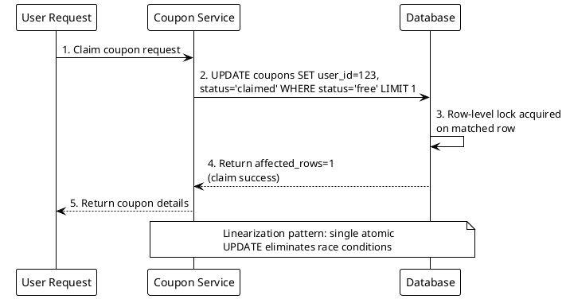

**Interview tip:** Emphasize that the linearization pattern avoids distributed locks by pushing concurrency control to the database engine. Mention that the WHERE clause acts as a built-in guard, and the DB guarantees only one transaction wins per row.

---

### Q272. Sharding a Coupon Pool

**Correct Answer: B)** 10 shards, each handling 120K rps. The math is straightforward: 1.2M rps / 120K rps per shard = 10 shards. This evenly distributes the coupon pool so that each shard handles a manageable fraction of the total load while meeting the throughput target exactly.

**Why not:**
- A) 5 shards at 240K rps means each shard handles double the target (120K), which may exceed individual shard capacity.
- C) 20 shards at 60K rps provides extra headroom but doubles infrastructure cost unnecessarily. Over-provisioning should be intentional, not the default.
- D) 1 shard with Redis caching does not address write throughput for coupon claims. Redis caching helps reads, but coupon claims are write operations that must hit the database.

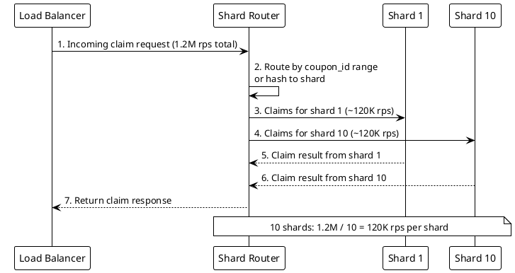

**Interview tip:** Show the math explicitly: total RPS / target per shard = number of shards. Mention that you should add 20-30% headroom in production, but the baseline calculation determines minimum shard count.

---

### Q273. Ticket Reservation Timeout

**Correct Answer: B)** Release after 15 minutes if the payment webhook has not confirmed. This is the standard reservation timeout pattern. 15 minutes gives legitimate users enough time to complete payment while preventing abandoned reservations from locking inventory indefinitely. The system checks for stale reservations via a scheduled job and transitions them back to free status.

**Why not:**
- A) Releasing immediately on page navigation is unreliable -- the browser may not fire the event (crash, network loss), and legitimate users may briefly navigate away.
- C) Manual handling by customer support does not scale. Thousands of abandoned reservations per minute would overwhelm support.
- D) 24 hours locks inventory far too long. High-demand events would lose significant sales to abandoned reservations.

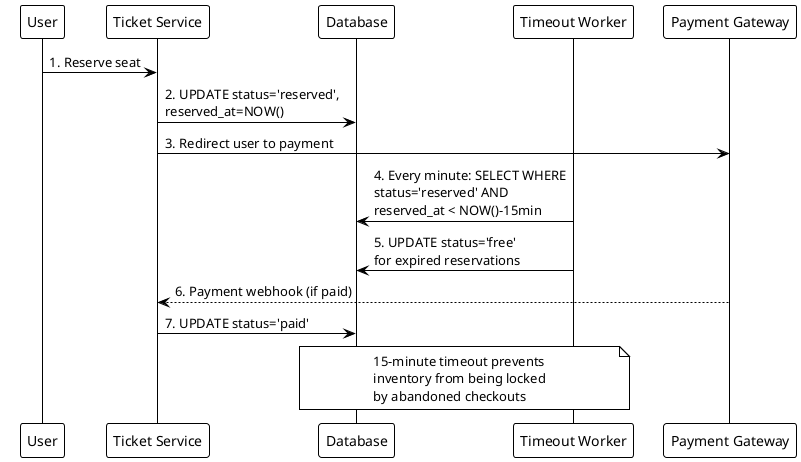

**Interview tip:** Mention that 15 minutes is a common industry standard (Ticketmaster, airline booking). The timeout worker should be idempotent -- re-running it on already-freed tickets has no side effect.

---

### Q274. Ticket Sharding by Venue

**Correct Answer: B)** Shard by venue_id so all seats for the same venue are on the same shard. Seat availability queries need to scan all tickets for a given venue to determine which seats are free. If tickets for the same venue were spread across multiple shards, availability queries would require cross-shard scatter-gather operations, adding latency and complexity.

**Why not:**
- A) Sharding by user_id co-locates a user's reservations but scatters venue seats across shards, making availability queries expensive.
- C) Sharding by reservation_id gives even distribution but destroys data locality for venue-based queries.
- D) Sharding by timestamp distributes by time, not by venue, making seat availability queries cross all shards.

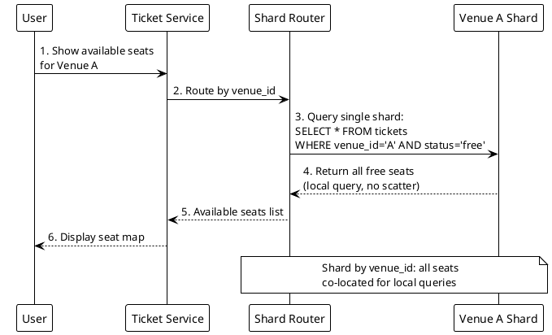

**Interview tip:** The shard key should align with the most common query pattern. For ticketing, the dominant query is "show available seats for venue X," so venue_id is the natural shard key.

---

### Q275. Coupon Counter with Redis vs DB

**Correct Answer: B)** When durability matters more than speed, since Redis DECR risks data loss on crash. Redis is an in-memory store and, even with AOF persistence, can lose the last few seconds of writes on a crash. For coupons with real monetary value, losing even one write could mean issuing more coupons than intended. The DB linearization approach (pre-created rows with atomic UPDATE) provides ACID durability -- each claim is persisted to disk before acknowledgment.

**Why not:**
- A) When latency is the top priority, Redis DECR would actually be the better choice. This answer describes when to use Redis, not the DB approach.
- C) The number of coupons does not determine the choice between Redis and DB. Durability vs speed is the deciding factor.
- D) Geographic distribution of users is irrelevant to the durability vs speed trade-off.

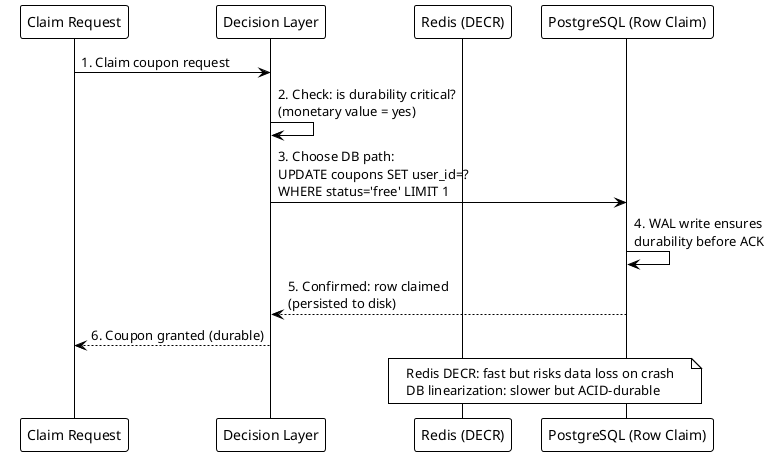

**Interview tip:** Frame this as a trade-off discussion. Redis DECR is great for best-effort counters (rate limiting, analytics), but monetary inventory requires ACID guarantees. Know when to pick each.

---

### Q276. Ticket Pre-Creation Schema

**Correct Answer: B)** Pre-create one row per seat with `INSERT INTO tickets (venue_id, seat_id, status)` for all seats. The linearization pattern requires that inventory exists as physical rows before the first claim. The atomic UPDATE query (`WHERE status='free' LIMIT 1`) can only claim rows that already exist. Without pre-creation, there are no rows to match the WHERE clause.

**Why not:**
- A) A counter table tracks quantity but does not support atomic row-level claims. Two concurrent requests could both decrement the counter, causing overselling.
- C) A single row with total remaining has the same race condition problem as a counter table.
- D) Lazily creating rows on demand defeats the purpose of linearization. Under 1.2M rps, lazy creation would cause massive contention on INSERT operations.

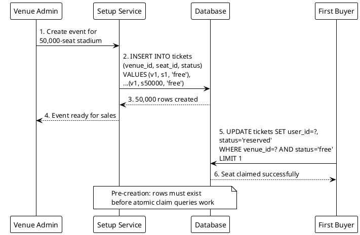

**Interview tip:** Pre-creation is the setup phase of the linearization pattern. Mention that batch INSERT is a one-time cost before sales open, and it eliminates all contention at claim time.

---

### Q277. Reservation ID for Payment Tracking

**Correct Answer: B)** A UUID reservation_id stored on the ticket row and passed to the payment gateway. The reservation_id serves as a correlation token between the reservation and the payment callback. When the payment gateway sends a webhook, it includes this reservation_id, allowing the system to look up and confirm the exact ticket reservation.

**Why not:**
- A) Email addresses are not unique per reservation (a user can have multiple reservations) and are PII that should not be passed to external services unnecessarily.
- C) Seat numbers are unique within a venue but not globally, and coupling the payment flow to seat-level details creates fragile dependencies.
- D) Sequential auto-increment IDs are guessable and enable enumeration attacks. Exposing them in URLs is a security risk.

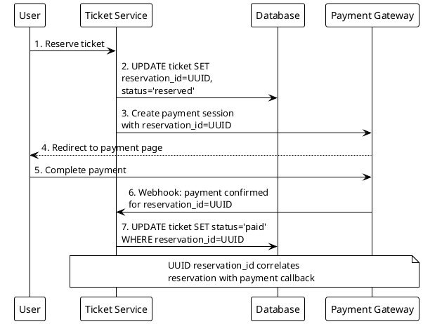

**Interview tip:** Always use opaque, non-guessable identifiers (UUIDs) for external system correlation. Mention that the reservation_id should be indexed for fast webhook lookup.

---

### Q278. Linearization vs Optimistic Locking Decision

**Correct Answer: C)** Linearization for fixed inventory (pre-create rows, atomic claim), optimistic locking for the auction (version column, retry on conflict). These are different concurrency challenges. Fixed-price limited items have a known, finite inventory -- perfect for pre-created rows with atomic claims. Auctions have a single mutable row (current price) that is updated competitively -- optimistic locking with a version column detects conflicts and retries.

**Why not:**
- A) Linearization for both ignores that auctions do not have pre-created inventory rows. The auction has one row being updated, not many rows being claimed.
- B) This reverses the correct mapping. Optimistic locking is for variable-state updates, not fixed inventory claims.
- D) Pessimistic locking (SELECT FOR UPDATE) creates bottlenecks at high concurrency. It serializes all requests through a single lock.

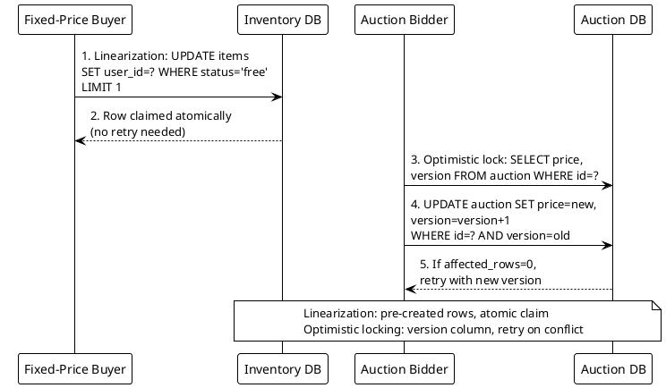

**Interview tip:** Know the distinction: linearization is for claiming one of N identical items (inventory). Optimistic locking is for updating a shared mutable resource (auction price, account balance). Match the pattern to the problem shape.

---

### Q279. Payment Flow State Machine

**Correct Answer: B)** A scheduled job that checks for reservations older than 15 minutes without a payment confirmation. Users may not explicitly cancel -- they might close the browser, lose connectivity, or simply abandon the flow. A backend scheduled job (cron or timer-based worker) reliably sweeps stale reservations regardless of client behavior, transitioning them from reserved back to free.

**Why not:**
- A) A cancel button depends on client-side action, which cannot be relied upon. Users who close the tab or lose connectivity never click cancel.
- C) Payment gateways do not always send failure webhooks immediately, and some never send them at all for abandoned sessions.
- D) Most relational databases do not natively support TTL-based row expiration. This is a Cassandra/Redis concept, not standard SQL.

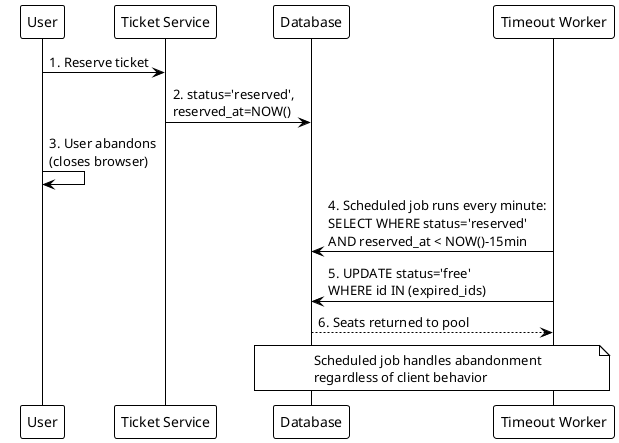

**Interview tip:** State machines in ticketing should never depend on client cooperation. Always have a server-side mechanism to enforce state transitions. Mention that the timeout job should be idempotent.

---

### Q280. Queue Serialization for Auction Bids

**Correct Answer: B)** Use auction_id as the partition key so all bids for the same auction go to the same partition and are processed by a single consumer. Kafka guarantees ordering within a partition, and each partition is consumed by exactly one consumer in a consumer group. By partitioning on auction_id, all bids for the same auction are serialized, preventing race conditions on price updates.

**Why not:**
- A) Random partition keys distribute load evenly but destroy ordering guarantees for bids on the same auction. Two bids for auction X could land on different partitions and be processed out of order.
- C) User_id groups bids by bidder, not by auction. Bids from different users on the same auction would be on different partitions, breaking per-auction ordering.
- D) Round-robin distributes messages evenly but provides no ordering guarantees per auction.

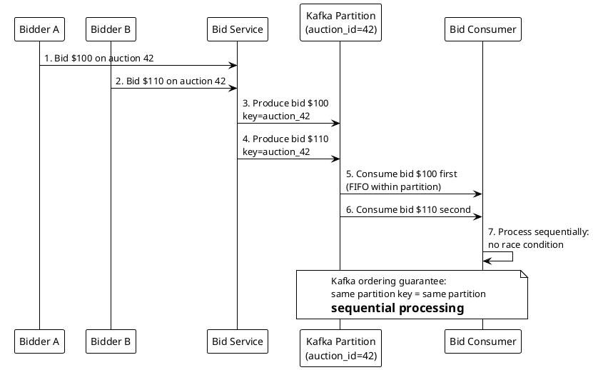

**Interview tip:** When you need ordering guarantees for a subset of messages, use the entity ID (auction_id, order_id, user_id) as the Kafka partition key. This is the fundamental Kafka ordering pattern.

---

### Q281. Push vs Pull Feed Model

**Correct Answer: B)** Push model: iterate the follower list and write post_id to each follower's timeline cache. In the push (fan-out-on-write) model, when a user publishes a post, the system immediately writes the post_id into each follower's precomputed timeline. This means reads are fast -- a follower just reads their timeline cache -- but writes are amplified by the follower count.

**Why not:**
- A) The pull model fetches at read time, not write time. The question asks which model writes at post time.
- C) The hybrid model that only pushes to online followers would miss offline users entirely, creating inconsistent feeds.
- D) Batch distribution once per hour is far too slow for a social feed. Users expect near-real-time post visibility.

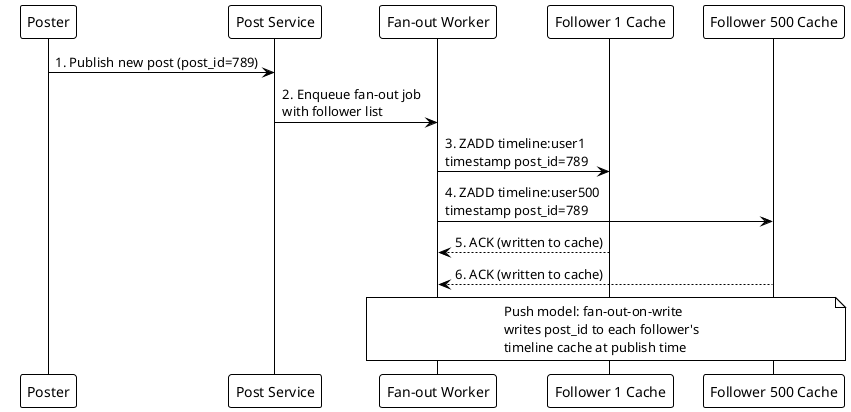

**Interview tip:** Clearly distinguish push (fan-out-on-write, fast reads, write amplification) from pull (fan-out-on-read, slow reads, no write amplification). The push model is Instagram's approach for normal users.

---

### Q282. Celebrity Fan-out Threshold

**Correct Answer: B)** Switch to pull model for those users so followers fetch their posts at read time. Writing to 1M+ timeline caches on every celebrity post creates a massive write storm that delays post visibility and consumes enormous resources. Instead, celebrity posts are stored once and fetched at read time -- when a follower loads their feed, the system pulls the celebrity's recent posts and merges them in.

**Why not:**
- A) Throttling writes over hours means followers see the post with hours of delay, defeating the purpose of a real-time feed.
- C) Dropping posts when fan-out exceeds a threshold loses content, which is unacceptable.
- D) Pushing to only the first 1M and ignoring the rest means some followers never see the post.

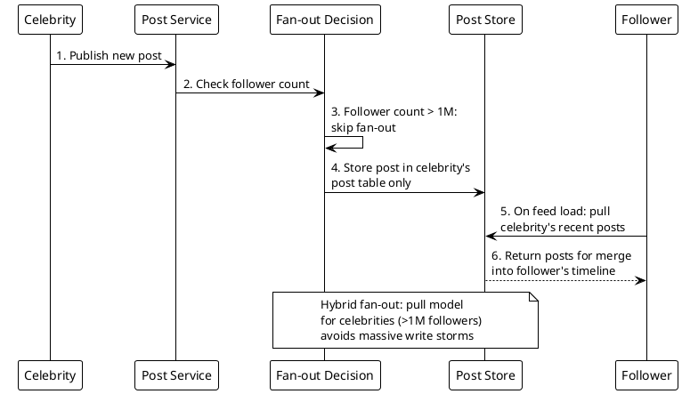

**Interview tip:** This is the hybrid fan-out model used by Twitter. The threshold (often around 500K-1M followers) is configurable. Mention that the read path merges pushed posts (from regular users) with pulled posts (from celebrities).

---

### Q283. Feed Cache Data Structure

**Correct Answer: B)** A Redis sorted set per user with timestamp as score, using ZREVRANGE for latest posts. Sorted sets maintain elements ordered by score, making them ideal for timeline data. ZREVRANGE efficiently retrieves the top N posts by descending timestamp, and ZADD inserts new posts in O(log N). The score-based ordering is maintained automatically by Redis.

**Why not:**
- A) A Redis hash stores key-value pairs but has no inherent ordering. You would need to sort on every read, which is inefficient.
- C) A Redis list with LPUSH/LTRIM maintains insertion order but does not support score-based ordering or efficient mid-list insertions (e.g., backfilling older posts).
- D) A serialized JSON array requires deserializing, modifying, and re-serializing on every update -- expensive and not atomic.

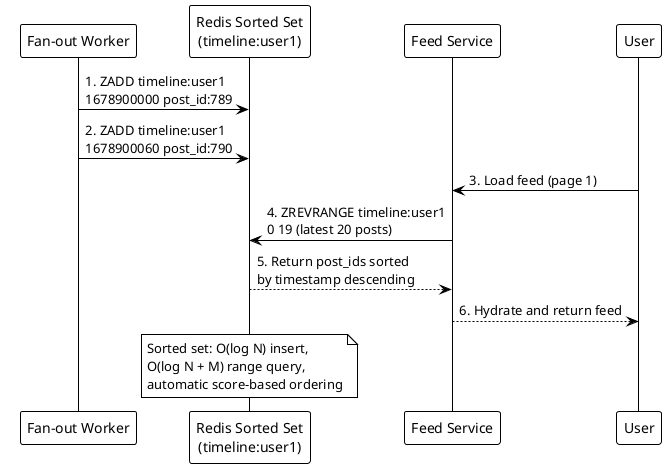

**Interview tip:** Redis sorted sets are the go-to for any timeline or leaderboard. Know the key operations: ZADD (insert), ZREVRANGE (top N), ZRANGEBYSCORE (time range), and ZREMRANGEBYRANK (eviction).

---

### Q284. Cold Storage Eviction Policy

**Correct Answer: B)** After 5 days, balancing recency with cost. Most social feed engagement happens within the first few days of a post. Keeping 5 days in Redis provides a high cache hit rate (users rarely scroll back further) while controlling memory costs. Older posts are evicted to cold storage (S3/HDFS) and fetched on demand for the rare deep-scroll case.

**Why not:**
- A) 1 day is too aggressive. Users commonly scroll back 2-3 days, and a 1-day eviction would cause frequent cache misses, increasing cold storage reads.
- C) 30 days keeps far too much data in expensive Redis memory. The marginal hit rate improvement beyond 5-7 days is minimal.
- D) Never evicting is prohibitively expensive at scale. With millions of users, Redis memory would grow unboundedly.

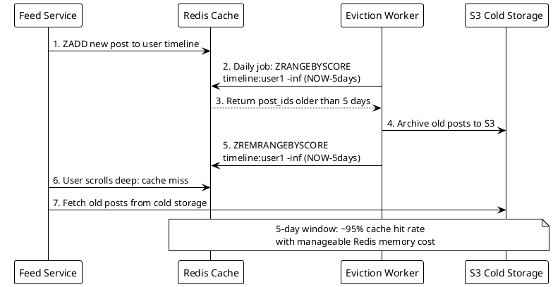

**Interview tip:** Frame this as a cost-performance trade-off. Know the access pattern: 80-90% of feed reads are within the last 2-3 days. Choose the eviction window based on your access distribution data.

---

### Q285. Pull Model Merge Strategy

**Correct Answer: B)** Merge-sort by timestamp across the pre-sorted lists from each followed user. Each followed user's post list is already sorted by timestamp. A k-way merge (using a min-heap/priority queue) efficiently combines k sorted lists into one sorted output in O(N log k) time, where N is total posts and k is the number of followed users. This avoids the O(N log N) cost of dumping everything into one array and re-sorting.

**Why not:**
- A) Fetching all posts into a single array and sorting wastes the fact that each source list is already sorted. It is O(N log N) instead of O(N log k).
- C) Random selection does not produce a chronological feed.
- D) Grouping by author is not a chronological timeline -- users expect interleaved posts by time.

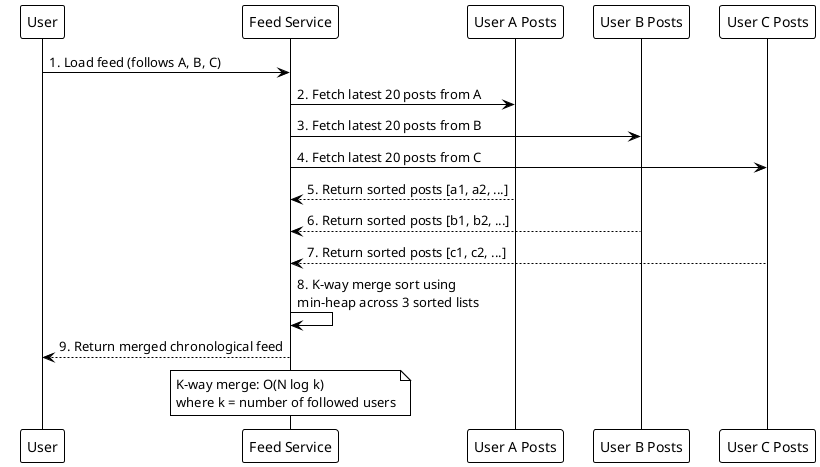

**Interview tip:** The k-way merge is a classic algorithm question that appears in system design when discussing pull-based feeds. Mention the min-heap approach and its time complexity.

---

### Q286. Hybrid Feed: Write Path Decision

**Correct Answer: B)** Check if the poster's follower count exceeds the 1M threshold; if so, skip fan-out. This is the decision point in a hybrid feed system. At write time, the system looks up the poster's follower count and decides: below 1M, push the post to all follower timelines; above 1M, store the post once and let followers pull it at read time. The follower count check is a simple metadata lookup.

**Why not:**
- A) Post content length is irrelevant to the fan-out decision. The fan-out cost is driven by follower count, not content size.
- C) Always pushing but with smaller payloads does not solve the write amplification problem. Writing to 10M timelines is expensive regardless of payload size.
- D) Time-of-day-based decisions create inconsistent user experience and do not address the core problem of write amplification for high-follower accounts.

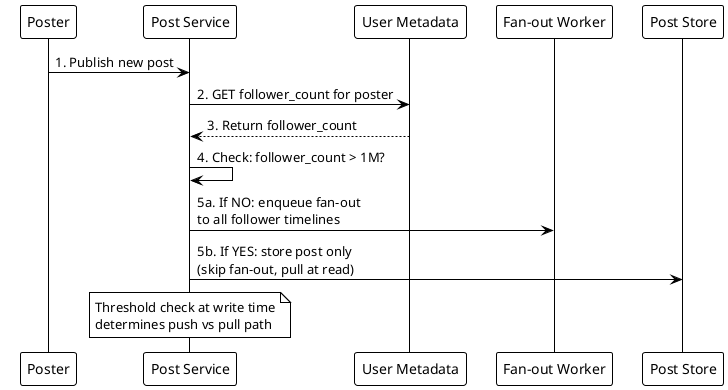

**Interview tip:** The threshold is a tunable parameter. In production, it might be adjusted based on system capacity. Some systems also consider posting frequency -- a celebrity posting 50 times a day is more expensive to fan out than one posting once a week.

---

### Q287. Notification Fan-out for Group Events

**Correct Answer: B)** Fan-out to all group members asynchronously via a message queue, with group data co-located on the same shard. Sending 10K notifications synchronously would block the request for too long. An async message queue (Kafka, SQS) handles the fan-out in the background. Because the group is sharded by group_id, the member list is local to one shard, making the initial member list lookup efficient.

**Why not:**
- A) Synchronous notification of 10K members would take too long, causing request timeouts and poor user experience.
- C) A single notification row with polling creates a thundering herd when all 10K members poll simultaneously, and wastes resources for members who are not active.
- D) Sending only to online members means offline members miss notifications. Users expect to see notifications when they return.

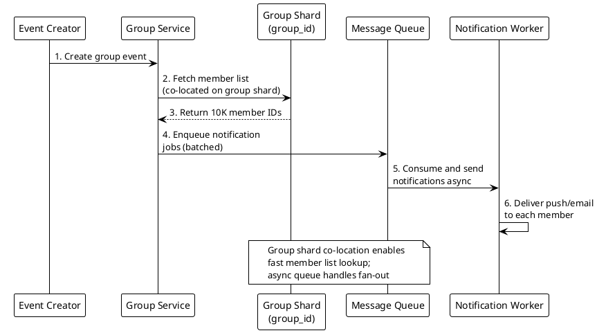

**Interview tip:** The combination of sharding for data locality and async processing for fan-out is a recurring pattern. Mention batching notification jobs (e.g., 100 members per message) to reduce queue overhead.

---

### Q288. Feed Consistency: Push Model Drawback

**Correct Answer: B)** The delete must fan out to all 500 follower caches to remove the stale post_id, which is expensive and may leave stale data. In the push model, the post_id was written to 500 individual timeline caches. Deleting the post requires a reverse fan-out: iterating through all 500 follower caches and removing the post_id from each sorted set. If any cache operation fails or is delayed, followers may still see the deleted post.

**Why not:**
- A) Posts do not disappear automatically from caches. Each cache is independent and has no knowledge of the source post's deletion.
- C) The original poster's cache is just one of 501 caches containing the post_id. All follower caches must also be updated.
- D) Redis caches have no foreign key constraints. There is no automatic cascading delete mechanism.

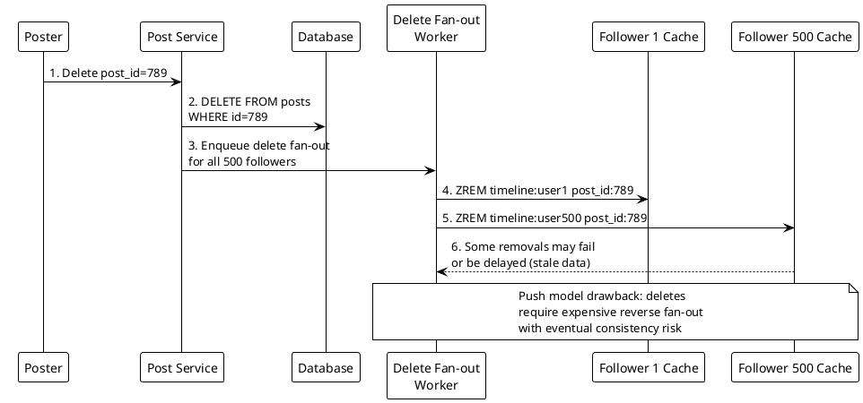

**Interview tip:** This is a key trade-off of the push model: writes are fast for reads, but mutations (edits, deletes) are expensive. Mention that some systems solve this by storing only post_ids in caches and checking post existence at read time (tombstone check).

---

### Q289. Feed Ranking: Beyond Chronological

**Correct Answer: B)** Apply a ranking/re-ranking layer in the application after fetching candidates from the timestamp-sorted cache. The cache layer stores candidates in chronological order (timestamp as score). The application fetches a larger candidate set (e.g., top 200 posts) and then applies a ranking model (engagement score, relevance, ML-based) to select and order the final feed (e.g., top 20). This separates storage concerns from ranking logic.

**Why not:**
- A) Changing the sorted set score to engagement breaks chronological retrieval and requires updating scores whenever engagement metrics change, which is very expensive.
- C) Client-side ranking exposes the ranking algorithm, wastes bandwidth by sending unranked data, and creates inconsistent experiences across clients.
- D) An unsorted set with sort-on-read is O(N log N) on every read, which does not scale.

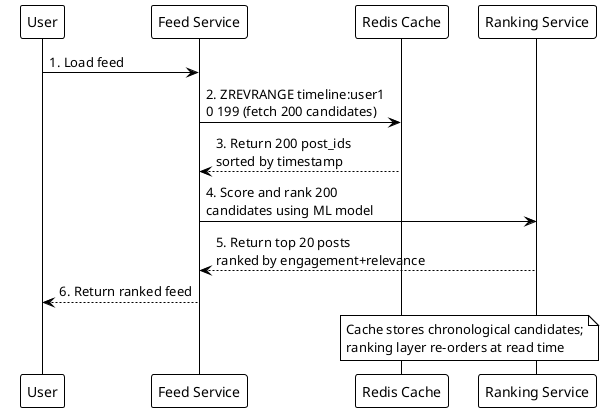

**Interview tip:** This is the two-phase approach used by major platforms: candidate generation (cache) followed by ranking (ML model). Mention that over-fetching candidates (200 for a feed of 20) gives the ranker enough diversity to work with.

---

### Q290. Feed Load: Avoiding Thundering Herd

**Correct Answer: B)** Cache the celebrity's recent posts in Redis so follower feed loads read from cache instead of hitting the DB repeatedly. In the pull model, millions of followers all query the celebrity's recent posts. Without caching, this creates a read storm on the database. By caching the celebrity's posts in Redis, all follower reads hit the cache, protecting the database. The cache is populated once when the celebrity posts and serves millions of reads.

**Why not:**
- A) Rate-limiting all followers degrades user experience. Users would see stale feeds or get errors.
- C) Converting to push model for a 1M+ follower account causes the exact write storm the hybrid model was designed to avoid.
- D) Delaying the post for 1 hour defeats the purpose of a real-time social feed.

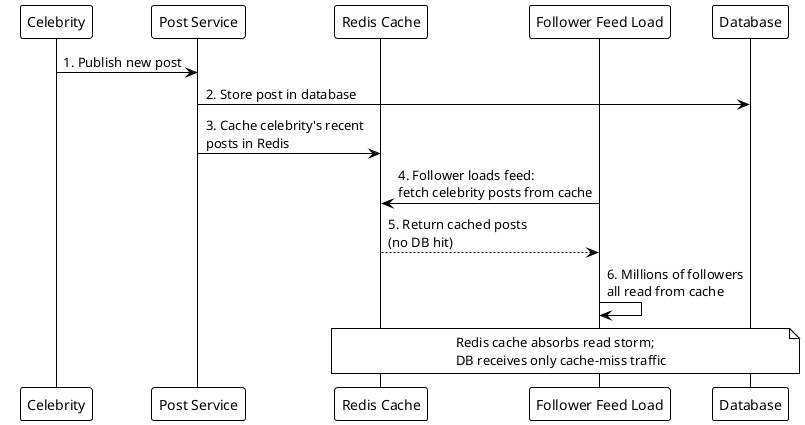

**Interview tip:** The thundering herd problem is common in pull-based systems. The solution is always caching. Mention cache warming (pre-populate on post creation) and request coalescing (deduplicate concurrent cache-miss requests) as additional techniques.

---

### Q291. Base58 vs Base62 Encoding

**Correct Answer: B)** Base58 which removes 0, O, I, and l to avoid confusion. Base58 uses a 58-character alphabet that excludes visually ambiguous characters: 0 (zero) vs O (capital O), I (capital I) vs l (lowercase L). This encoding was popularized by Bitcoin addresses for exactly this reason -- when users manually copy or read codes, these character pairs are easily confused.

**Why not:**
- A) Base62 uses the full alphanumeric set (a-z, A-Z, 0-9) which includes the ambiguous characters 0, O, I, and l.
- C) Base32 uses only 32 characters, producing longer codes. It also typically uses uppercase only, which is less URL-friendly.
- D) Hexadecimal uses only 16 characters, producing significantly longer codes (a 7-char Base58 code would need ~11 hex chars).

```plantuml
@startuml
!theme plain
skinparam backgroundColor white

participant "User" as U
participant "URL Shortener" as US
participant "Base58 Encoder" as B58
participant "Database" as DB

U -> US: 1. Shorten URL request
US -> DB: 2. Get next numeric ID\n(e.g., 7,462,913)
US -> B58: 3. Encode ID to Base58\n(excludes 0, O, I, l)
B58 --> US: 4. Return code: "aB3xYz"\n(no ambiguous characters)
US --> U: 5. Short URL: sho.rt/aB3xYz

note over B58
  Base58 alphabet:
  123456789ABCDEFGH
  JKLMNPQRSTUVWXYZab
  cdefghijkmnopqrstuvwxyz
  (no 0, O, I, l)
end note
@enduml
```

**Interview tip:** Base58 is a small but important detail that shows you think about user experience. Mention it was created for Bitcoin addresses and explain that it reduces support tickets from users mistyping codes.

---

### Q292. Key Generation Service Design

**Correct Answer: B)** A Key Generation Service (KGS) that pre-generates a batch of unique keys and hands them out on request. The KGS pre-computes millions of unique short keys and stores them in a database (with used/unused status). When the URL shortener needs a key, it takes one from the unused pool. This eliminates collision checks entirely because each key is pre-verified as unique before it enters the pool.

**Why not:**
- A) Auto-incrementing DB IDs work but create a single point of failure and expose sequential ordering, making URLs predictable.
- C) Truncating UUIDs to 6 characters loses uniqueness guarantees and will cause frequent collisions (birthday paradox).
- D) Hashing with retry on collision adds latency and becomes increasingly expensive as the key space fills up.

```plantuml
@startuml
!theme plain
skinparam backgroundColor white

participant "URL Shortener" as US
participant "KGS" as KGS
participant "Key Pool DB" as KDB
participant "Main DB" as MDB

KGS -> KDB: 1. Pre-generate batch of\n1M unique 7-char keys
KGS -> KDB: 2. Store all as status='unused'
US -> KGS: 3. Request a key for new URL
KGS -> KDB: 4. SELECT key WHERE status='unused'\nLIMIT 1; UPDATE status='used'
KDB --> KGS: 5. Return key "aB3xYz"
KGS --> US: 6. Hand out key (no collision check)
US -> MDB: 7. INSERT (key, original_url)

note over KGS,KDB
  KGS eliminates collision checks:
  all keys pre-verified unique
end note
@enduml
```

**Interview tip:** The KGS pattern is a classic system design optimization. Mention that the KGS can hand out keys from an in-memory buffer (loaded in batches from DB) for even lower latency. Discuss how multiple KGS instances can each claim a batch to avoid contention.

---

### Q293. Redirect Status Code for Analytics

**Correct Answer: B)** 302 Found, which always hits the server and enables analytics on every click. A 302 (temporary redirect) tells the browser that the redirect is temporary and the browser should not cache it. Every subsequent click on the short URL will hit the server, allowing the system to log the click for analytics. This is essential for tracking click counts, referrers, geolocation, and device data.

**Why not:**
- A) 301 Moved Permanently tells the browser to cache the redirect. After the first click, the browser redirects directly without hitting the server, losing all subsequent analytics data.
- C) A 200 with JavaScript redirect adds latency (page load + JS execution) and does not work if JavaScript is disabled.
- D) 307 Temporary Redirect preserves the HTTP method but is semantically correct only for method-sensitive cases. 302 is the standard choice for URL shorteners.

```plantuml
@startuml
!theme plain
skinparam backgroundColor white

participant "User" as U
participant "Browser" as B
participant "Short URL Server" as S
participant "Analytics" as A
participant "Original URL" as O

U -> B: 1. Click sho.rt/aB3xYz
B -> S: 2. GET /aB3xYz
S -> A: 3. Log click (IP, referrer,\nuser-agent, timestamp)
S --> B: 4. HTTP 302 Found\nLocation: https://original.com/page
B -> O: 5. Follow redirect to original URL
U -> B: 6. Click same short URL again
B -> S: 7. GET /aB3xYz (not cached,\nhits server again)

note over S,A
  302 = temporary redirect
  Browser does NOT cache,
  every click hits the server
end note
@enduml
```

**Interview tip:** This is a frequently asked detail in URL shortener interviews. Know the difference: 301 = permanent (browser caches), 302 = temporary (browser always asks server). If analytics are not needed, 301 reduces server load.

---

### Q294. URL Shortener Read Path

**Correct Answer: B)** Check in-memory cache, then Redis, then DB, then cache the result at each miss level. This is the standard multi-tier caching pattern for read-heavy systems. In-memory cache (local to the server process) is the fastest; Redis is shared across servers; the database is the source of truth. On a miss at any level, the result is populated into that cache for subsequent requests. This minimizes latency for hot URLs.

**Why not:**
- A) Database first defeats the purpose of caching. Every read hits the DB, which does not scale for read-heavy workloads.
- C) Always going to the database is even worse than A, with no caching at all.
- D) Redis-only misses hot URLs that could be served from faster in-memory cache, and has no fallback if Redis is unavailable.

```plantuml
@startuml
!theme plain
skinparam backgroundColor white

participant "Click Request" as CR
participant "In-Memory Cache" as IMC
participant "Redis" as R
participant "Database" as DB

CR -> IMC: 1. Check in-memory cache\n(fastest, ~0.1ms)
IMC --> CR: 2a. HIT: return original URL
CR -> R: 2b. MISS: check Redis\n(~1ms)
R --> CR: 3a. HIT: cache in memory,\nreturn original URL
CR -> DB: 3b. MISS: query database\n(~5-10ms)
DB --> CR: 4. Return original URL
CR -> R: 5. Cache result in Redis
CR -> IMC: 6. Cache result in memory

note over IMC,DB
  Multi-tier cache: each layer
  filters traffic from the next,
  cache-aside pattern at each level
end note
@enduml
```

**Interview tip:** The multi-tier caching strategy is fundamental to read-heavy systems. Know the latency of each tier (in-memory: microseconds, Redis: ~1ms, DB: ~5-10ms) and explain why you populate on miss (cache-aside pattern).

---

### Q295. Bloom Filter for URL Deduplication

**Correct Answer: B)** A Bloom filter, sized using m = -n*ln(p)/(ln2)^2 where n is the number of URLs and p is the target false positive rate. A Bloom filter is a probabilistic data structure that can tell you "definitely not in set" or "probably in set." For a web crawler with billions of URLs, a Bloom filter uses far less memory than a hash set. A false positive means occasionally re-crawling a URL (minor waste), but a false negative never occurs (no missed URLs).

**Why not:**
- A) A standard hash map storing all URLs requires O(n) memory proportional to URL string length. For billions of URLs, this requires terabytes of RAM.
- C) A B-tree index requires disk I/O and is much slower than an in-memory Bloom filter. It also uses more storage per URL.
- D) A trie stores all URL prefixes, which is extremely memory-intensive for billions of varied URLs.

```plantuml
@startuml
!theme plain
skinparam backgroundColor white

participant "Crawler Worker" as CW
participant "Bloom Filter" as BF
participant "URL Frontier" as UF

CW -> BF: 1. Check: is url_X in\nBloom filter?
BF --> CW: 2a. "Definitely NOT seen":\nadd to frontier
BF --> CW: 2b. "Probably seen":\nskip (may be false positive)
CW -> UF: 3. Enqueue new URL for crawling
CW -> BF: 4. After crawling: add url_X\nto Bloom filter
BF -> BF: 5. Hash url_X with k hash\nfunctions, set k bits

note over BF
  Bloom filter formula:
  m = -n*ln(p) / (ln2)^2
  n=1B URLs, p=0.01 -> ~1.2GB
  (vs ~100GB+ for hash set)
end note
@enduml
```

**Interview tip:** Know the Bloom filter formula and be ready to calculate size. For 1 billion URLs with 1% false positive rate: m = -1e9 * ln(0.01) / (ln2)^2 = approximately 1.2 GB. Compare this to storing full URLs in a hash set at ~100+ GB.

---

### Q296. Crawler Politeness and URL Frontier

**Correct Answer: B)** A priority queue combined with a per-domain politeness queue that rate-limits requests to each domain. The URL frontier has two layers: a priority layer that orders URLs by importance (PageRank, freshness, depth), and a politeness layer that ensures the crawler does not overwhelm any single domain. Each domain gets its own sub-queue with a rate limit (e.g., 1 request per second per domain).

**Why not:**
- A) A single FIFO queue has no prioritization and no per-domain rate limiting. Important pages may wait behind millions of low-priority URLs.
- C) Random shuffling provides no priority ordering and does not guarantee per-domain spacing.
- D) Queues per content type do not address domain-level politeness or priority ordering.

```plantuml
@startuml
!theme plain
skinparam backgroundColor white

participant "URL Discovered" as UD
participant "Priority Queue" as PQ
participant "Politeness Router" as PR
participant "Domain Queue\n(example.com)" as DQ
participant "Crawler Worker" as CW

UD -> PQ: 1. Enqueue URL with\npriority score
PQ -> PR: 2. Dequeue highest\npriority URL
PR -> DQ: 3. Route to per-domain\npoliteness queue
DQ -> DQ: 4. Enforce rate limit:\n1 req/sec for this domain
DQ -> CW: 5. Release URL to worker\nwhen rate limit allows
CW -> CW: 6. Crawl page, extract\nnew URLs

note over PQ,DQ
  Two-layer frontier:
  1. Priority queue (importance)
  2. Politeness queue (rate limit per domain)
end note
@enduml
```

**Interview tip:** The URL frontier is one of the most important components of a web crawler. Be ready to explain both layers and how they interact. Mention robots.txt crawl-delay directive as an input to the politeness rate limit.

---

### Q297. DNS Caching for Crawlers

**Correct Answer: B)** Cache DNS results per domain to avoid repeated lookups for the same domain. DNS resolution adds 10-100ms of latency per lookup. When crawling thousands of pages from the same domain, caching the DNS result eliminates redundant lookups. The cache should respect TTL values from DNS responses to pick up IP changes while still avoiding unnecessary re-resolution.

**Why not:**
- A) A new DNS resolver per request is wasteful and adds unnecessary latency.
- C) Hard-coding IP addresses is brittle. IPs change, CDNs rotate endpoints, and multi-region sites use geo-DNS.
- D) DNS over HTTPS (DoH) adds privacy but does not reduce redundant lookups. It actually adds more overhead per request.

```plantuml
@startuml
!theme plain
skinparam backgroundColor white

participant "Crawler Worker" as CW
participant "DNS Cache" as DC
participant "DNS Resolver" as DR
participant "Target Server" as TS

CW -> DC: 1. Resolve example.com
DC --> CW: 2a. CACHE HIT: return\n93.184.216.34 (0ms)
DC -> DR: 2b. CACHE MISS: query DNS
DR --> DC: 3. Return IP with TTL=3600
DC -> DC: 4. Cache IP for TTL duration
DC --> CW: 5. Return 93.184.216.34
CW -> TS: 6. Fetch page at cached IP
CW -> DC: 7. Next page same domain:\ncache hit (no DNS query)

note over DC
  DNS cache eliminates redundant
  lookups for same domain;
  respects TTL for freshness
end note
@enduml
```

**Interview tip:** DNS caching is a simple but effective optimization. Mention that the standard library in most languages already caches DNS, but a large-scale crawler may need a dedicated local DNS cache (like dnsmasq) or an in-process cache with configurable TTL.

---

### Q298. Content Deduplication Strategy

**Correct Answer: B)** SimHash or MinHash for near-duplicate detection that tolerates minor differences. These locality-sensitive hashing algorithms produce similar hash values for similar content. SimHash computes a fingerprint where pages with small differences (different ads, headers, or timestamps) produce fingerprints that differ by only a few bits. Comparing Hamming distance between SimHash values quickly identifies near-duplicates.

**Why not:**
- A) MD5 is a cryptographic hash where even a single-byte difference produces a completely different hash. It cannot detect near-duplicates at all.
- C) Comparing byte sizes is extremely crude. Two completely different pages could have the same size, and minor template changes barely affect size.
- D) Comparing only the title tag misses body content entirely. Many near-duplicate pages have identical titles.

```plantuml
@startuml
!theme plain
skinparam backgroundColor white

participant "Crawled Page" as CP
participant "SimHash Engine" as SH
participant "Fingerprint Store" as FS
participant "Index Service" as IS

CP -> SH: 1. Extract text content\nfrom crawled page
SH -> SH: 2. Compute SimHash fingerprint\n(64-bit value)
SH -> FS: 3. Compare Hamming distance\nwith existing fingerprints
FS --> SH: 4a. Distance > 3 bits:\nunique content -> index
FS --> SH: 4b. Distance <= 3 bits:\nnear-duplicate -> discard
SH -> IS: 5. Index only unique pages

note over SH,FS
  SimHash: similar content produces
  similar fingerprints;
  Hamming distance detects near-dupes
end note
@enduml
```

**Interview tip:** SimHash is Google's approach to web-scale deduplication. Be ready to explain that it converts document features into a fixed-size fingerprint where similar documents have similar fingerprints. The Hamming distance threshold (e.g., 3 bits out of 64) is tunable.

---

### Q299. Robots.txt Handling

**Correct Answer: B)** Fetch once per domain, cache it, and refresh periodically. Robots.txt files change infrequently, so fetching once and caching is efficient. Periodic refresh (e.g., every 24 hours) ensures the crawler picks up rule changes. This respects website owners' crawl directives while minimizing unnecessary HTTP requests.

**Why not:**
- A) Ignoring robots.txt violates web standards, risks legal issues, and may get the crawler's IP blocked.
- C) Fetching robots.txt before every page request wastes bandwidth and adds latency. The file rarely changes between page fetches.
- D) Robots.txt rules can apply to specific paths, not just the homepage. Checking only for the homepage misses path-specific Disallow directives.

```plantuml
@startuml
!theme plain
skinparam backgroundColor white

participant "Crawler Worker" as CW
participant "Robots Cache" as RC
participant "Target Domain" as TD

CW -> RC: 1. Check robots.txt\nfor example.com/page
RC --> CW: 2a. CACHE HIT (< 24hrs old):\nreturn cached rules
RC -> TD: 2b. CACHE MISS or EXPIRED:\nGET /robots.txt
TD --> RC: 3. Return robots.txt content
RC -> RC: 4. Parse and cache rules\nwith 24hr TTL
RC --> CW: 5. Return rules for /page
CW -> CW: 6. Check if path is allowed
CW -> TD: 7. If allowed: crawl page

note over RC
  Cache robots.txt per domain;
  refresh every 24 hours
  to pick up rule changes
end note
@enduml
```

**Interview tip:** Robots.txt compliance is both ethical and practical. Mention the Robots Exclusion Protocol standard, the crawl-delay directive, and that non-compliance can lead to IP bans or legal action.

---

### Q300. JavaScript-Heavy Page Rendering

**Correct Answer: B)** Use headless Chrome (dynamic rendering) for JavaScript-heavy sites to execute JS and capture the rendered DOM. Modern single-page applications (React, Angular, Vue) load an empty HTML shell and render content via JavaScript. A standard HTML parser sees only the shell. Headless Chrome executes the JavaScript, waits for the DOM to stabilize, and then captures the fully rendered HTML for indexing.

**Why not:**
- A) Parsing only raw HTML misses all JavaScript-rendered content, which is the majority of the page for SPAs.
- C) Skipping all JS-rendered sites would exclude a large and growing portion of the web.
- D) Fetching JavaScript bundle files and indexing them would index source code, not rendered content -- useless for search.

```plantuml
@startuml
!theme plain
skinparam backgroundColor white

participant "Crawler Worker" as CW
participant "Content Detector" as CD
participant "HTML Parser" as HP
participant "Headless Chrome" as HC

CW -> CD: 1. Fetch page, detect\nif JavaScript-heavy
CD --> CW: 2a. Static HTML: use\nstandard parser
CD --> CW: 2b. JS-heavy SPA detected
CW -> HC: 3. Load URL in headless Chrome
HC -> HC: 4. Execute JavaScript,\nwait for DOM to stabilize
HC -> HC: 5. Capture rendered DOM\n(fully hydrated HTML)
HC --> CW: 6. Return rendered HTML
CW -> CW: 7. Extract and index\nrendered content

note over HC
  Headless Chrome executes JS
  and captures the final DOM,
  enabling crawling of SPAs
end note
@enduml
```

**Interview tip:** Mention that dynamic rendering is expensive (each page requires a full browser instance), so crawlers typically detect whether a page needs it and only use headless Chrome for JS-heavy sites. Google's crawler uses a two-phase approach: initial crawl for static content, then a render queue for JS-heavy pages.

---

### Q301. User-to-Server Routing with Redis

**Correct Answer: B)** On connect, `SET user:456 server:xyz` in Redis; to route, `GET user:456` returns the target server. This is a simple presence-and-routing pattern. When a user connects to a chat server, the server registers the mapping in Redis. When a message needs to reach that user, the system looks up which server holds their connection and routes the message there. Redis provides O(1) lookups and handles the distributed state.

**Why not:**
- A) Broadcasting to all servers is wasteful and does not scale. With 100 servers, every message generates 100 deliveries, 99 of which are discarded.
- C) A SQL database is too slow for per-message routing lookups. Chat systems require sub-millisecond routing.
- D) DNS does not map user IDs to server addresses. It resolves domain names to IPs.

```plantuml
@startuml
!theme plain
skinparam backgroundColor white

participant "User 456" as U456
participant "Chat Server XYZ" as CSX
participant "Redis" as R
participant "User 123" as U123
participant "Chat Server ABC" as CSA

U456 -> CSX: 1. WebSocket connect
CSX -> R: 2. SET user:456 server:xyz
U123 -> CSA: 3. Send message to user 456
CSA -> R: 4. GET user:456
R --> CSA: 5. Return "server:xyz"
CSA -> CSX: 6. Forward message to server XYZ
CSX -> U456: 7. Deliver message via WebSocket

note over R
  Redis routing table:
  SET on connect, GET to route,
  DEL on disconnect
end note
@enduml
```

**Interview tip:** This is the simplest routing approach for chat systems. Mention that on disconnect, the server must DEL the key to prevent stale routing. Also mention TTL as a safety net for crashed servers that fail to clean up.

---

### Q302. Bucket-Based Connection Management

**Correct Answer: A)** It requires no external state store; the bucket computation is deterministic from the user ID. With bucket-based routing, the target server is computed purely from the user ID using a hash function -- no Redis lookup is needed. This eliminates a network round-trip per message and removes the dependency on an external state store. The trade-off is less flexibility (adding/removing servers requires remapping buckets).

**Why not:**
- B) Bucket-based routing does not guarantee cross-user message ordering. It only determines which server handles which user.
- C) WebSocket connections are still needed for real-time delivery. Bucket routing determines which server to connect to, not the connection protocol.
- D) Users must connect to their assigned server (determined by bucket), not any arbitrary server.

```plantuml
@startuml
!theme plain
skinparam backgroundColor white

participant "User 123" as U123
participant "Message Multiplexer" as MM
participant "Chat Server A\n(buckets 0-9)" as CSA
participant "Chat Server B\n(buckets 10-19)" as CSB

U123 -> MM: 1. Send message to user 456
MM -> MM: 2. Compute bucket:\nhash(456) % 20 = 14
MM -> MM: 3. Bucket 14 -> Server B\n(deterministic, no lookup)
MM -> CSB: 4. Route message to Server B
CSB -> CSB: 5. Deliver to user 456\n(connected to this server)

note over MM
  Bucket routing: O(1) computation,
  no external state store needed,
  deterministic from user ID
end note
@enduml
```

**Interview tip:** Compare Redis-based routing (flexible, extra hop) with bucket-based routing (fast, deterministic, less flexible). Bucket-based is better for predictable workloads; Redis-based is better when server topology changes frequently.

---

### Q303. Offline Message Storage

**Correct Answer: B)** Store in Cassandra and deliver all pending messages on next connection. Cassandra is designed for high-throughput writes and efficient range reads by partition key. Offline messages can be partitioned by recipient_id, and when the user reconnects, all pending messages are fetched in a single partition scan. This ensures no messages are lost regardless of how long the user is offline.

**Why not:**
- A) Keeping messages in the sender's outbox with periodic retries wastes resources and does not scale with many offline recipients.
- C) Dropping messages is unacceptable for a chat system. Users expect reliable delivery.
- D) Buffering in server memory is not durable. If the server crashes, all buffered messages are lost.

```plantuml
@startuml
!theme plain
skinparam backgroundColor white

participant "User 123" as U123
participant "Chat Server" as CS
participant "Routing Check" as RC
participant "Cassandra" as C
participant "User 456 (offline)" as U456

U123 -> CS: 1. Send message to user 456
CS -> RC: 2. Check if user 456 is online
RC --> CS: 3. User 456 is OFFLINE
CS -> C: 4. INSERT INTO offline_messages\n(recipient_id=456, msg, timestamp)
U456 -> CS: 5. User 456 reconnects
CS -> C: 6. SELECT * FROM offline_messages\nWHERE recipient_id=456
C --> CS: 7. Return all pending messages
CS -> U456: 8. Deliver pending messages\nin order

note over C
  Cassandra: partition by recipient_id
  for efficient range scan on reconnect
end note
@enduml
```

**Interview tip:** Cassandra's wide-column model with partition key = recipient_id and clustering key = timestamp is ideal for offline message storage. Mention that after delivery, messages can be marked as delivered or deleted to free space.

---

### Q304. Presence Detection via Heartbeat

**Correct Answer: B)** Heartbeat every 30 seconds; if missed, mark the user as offline. Heartbeats are a reliable mechanism for detecting connectivity loss. The client sends a lightweight ping every 30 seconds. If the server does not receive a heartbeat within the expected window (e.g., 30 seconds + grace period), it marks the user as offline. This handles all disconnection scenarios: network loss, app crash, phone sleep.

**Why not:**
- A) Last message timestamp is unreliable. A user could be online and reading without sending messages for hours.
- C) TCP connection state alone cannot detect all failures. Half-open connections (where one side does not know the other has disconnected) are common, especially on mobile networks.
- D) Manual status setting does not reflect actual connectivity. A user marked "online" could have lost network connectivity.

```plantuml
@startuml
!theme plain
skinparam backgroundColor white

participant "Client App" as CA
participant "Chat Server" as CS
participant "Presence Service" as PS
participant "Contact's Screen" as CON

CA -> CS: 1. Heartbeat ping\n(every 30 seconds)
CS -> PS: 2. Update last_heartbeat\ntimestamp for user
PS -> CON: 3. User status: ONLINE
CA -> CA: 4. Network lost\n(no more heartbeats)
CS -> CS: 5. No heartbeat received\nfor 60 seconds
CS -> PS: 6. Mark user as OFFLINE
PS -> CON: 7. User status: OFFLINE

note over CS,PS
  Heartbeat: 30s interval
  Timeout: 60s (2 missed beats)
  Handles all disconnect scenarios
end note
@enduml
```

**Interview tip:** The heartbeat interval is a trade-off: shorter intervals detect disconnections faster but increase network traffic. 30 seconds is a common industry choice. Mention that mobile apps may use longer intervals to conserve battery.

---

### Q305. Group Chat Fan-out and Sharding

**Correct Answer: B)** Fan out to all group members, with the member list co-located on the group_id shard for efficient reads. When a group message arrives, the system reads the member list from the group_id shard (local read, no cross-shard query), then fans out the message to each member's chat server. Co-locating group metadata and member lists on the same shard ensures the fan-out source data is fast to access.

**Why not:**
- A) Polling wastes resources. 200 members polling every second generates 200 rps per group, and most polls return empty results.
- C) Relay-based distribution is unreliable. If the first 50 members go offline, the remaining 150 never receive the message.
- D) Broadcasting to all servers is wasteful when members are on specific servers. It scales poorly with server count.

```plantuml
@startuml
!theme plain
skinparam backgroundColor white

participant "Sender" as S
participant "Group Shard\n(group_id=42)" as GS
participant "Fan-out Worker" as FW
participant "Member 1 Server" as M1
participant "Member 200 Server" as M200

S -> GS: 1. New message for group 42
GS -> GS: 2. Read member list\n(local to group shard)
GS -> FW: 3. Enqueue fan-out with\n200 member IDs
FW -> M1: 4. Route message to\nmember 1's chat server
FW -> M200: 5. Route message to\nmember 200's chat server

note over GS,FW
  Group shard co-location:
  member list read is local,
  fan-out is async via workers
end note
@enduml
```

**Interview tip:** Conversation sharding by group_id keeps all group-related data (members, metadata, settings) on the same shard. This is the same pattern used in Q274 for venues -- shard key should match the primary access pattern.

---

### Q306. Message Multiplexer Routing

**Correct Answer: B)** Compute `bucket = hash(recipient_id) % num_buckets` to determine which chat server handles user 456. The Message Multiplexer uses a deterministic hash function to map recipient IDs to server buckets. This is a pure computation with no external lookup, making it very fast. The multiplexer is a stateless component that can be horizontally scaled.

**Why not:**
- A) SQL database lookups are too slow for per-message routing in a real-time chat system. Each message would add several milliseconds of latency.
- C) Random server selection would almost never hit the correct server, wasting resources and failing to deliver messages.
- D) Forwarding to all servers is a broadcast approach that does not scale with server count.

```plantuml
@startuml
!theme plain
skinparam backgroundColor white

participant "Chat Server A\n(User 123)" as CSA
participant "Message Multiplexer" as MM
participant "Chat Server B\n(Bucket 14)" as CSB

CSA -> MM: 1. Message from user 123\nto user 456
MM -> MM: 2. hash(456) % 20 = 14
MM -> MM: 3. Lookup: bucket 14 =\nChat Server B
MM -> CSB: 4. Forward message to\nChat Server B
CSB -> CSB: 5. Find user 456's\nWebSocket connection
CSB -> CSB: 6. Push message to user 456

note over MM
  Stateless computation:
  hash(recipient_id) % num_buckets
  No external state store needed
end note
@enduml
```

**Interview tip:** The multiplexer pattern separates routing logic from connection management. Each chat server handles connections for its bucket range; the multiplexer routes between them. This is a scalable architecture used by WhatsApp and similar systems.

---

### Q307. Chat System: WebSocket vs Polling

**Correct Answer: B)** WebSocket, which maintains a persistent bidirectional connection for instant server-to-client pushes. WebSocket upgrades an HTTP connection to a persistent, full-duplex channel. The server can push messages to the client the instant they arrive, without waiting for the client to request them. This provides sub-second latency for message delivery.

**Why not:**
- A) HTTP polling every 5 seconds has up to 5-second latency between message send and receive, and generates wasted requests when there are no new messages.
- C) HTTP long-polling is better than short polling but still requires re-establishing the connection after each message, adding overhead.
- D) Periodic REST API calls are equivalent to short polling with the same latency and waste issues.

```plantuml
@startuml
!theme plain
skinparam backgroundColor white

participant "Client A" as CA
participant "Chat Server" as CS
participant "Client B" as CB

CA -> CS: 1. HTTP Upgrade to WebSocket
CS --> CA: 2. WebSocket connection\nestablished (persistent)
CB -> CS: 3. HTTP Upgrade to WebSocket
CS --> CB: 4. WebSocket connection\nestablished (persistent)
CA -> CS: 5. Send message via WebSocket\n(instant, no HTTP overhead)
CS -> CB: 6. Server pushes message\nto Client B immediately
CB --> CS: 7. ACK received

note over CA,CB
  WebSocket: persistent bidirectional
  connection, sub-millisecond
  server-to-client push
end note
@enduml
```

**Interview tip:** WebSocket is the standard for real-time chat. Mention the initial HTTP upgrade handshake, the persistent full-duplex connection, and that it eliminates the overhead of HTTP headers on every message. Also mention fallback to long-polling for environments where WebSocket is blocked.

---

### Q308. Presence at Scale: Reducing Fan-out

**Correct Answer: B)** Only send presence updates to contacts who currently have the user's chat window open or who are on their contact list screen. This dramatically reduces fan-out by limiting presence notifications to contacts who are actively viewing the user's status. Instead of broadcasting to 10K contacts, the system only notifies the subset who are actively looking -- typically a small fraction.

**Why not:**
- A) Broadcasting to all 10K contacts on every status change creates unsustainable fan-out, especially for users who frequently toggle online/offline (e.g., flaky mobile connections).
- C) Disabling presence for users with many contacts is too restrictive and degrades user experience.
- D) Hourly batches make presence information stale and useless for real-time chat.

```plantuml
@startuml
!theme plain
skinparam backgroundColor white

participant "User X\n(comes online)" as UX
participant "Presence Service" as PS
participant "Subscription Manager" as SM
participant "Contact A\n(viewing X's chat)" as CA
participant "Contact B\n(app backgrounded)" as CB

UX -> PS: 1. User X status: ONLINE
PS -> SM: 2. Who is subscribed to\nUser X's presence?
SM --> PS: 3. Only Contact A has\nX's chat window open
PS -> CA: 4. Push: User X is ONLINE
PS -> CB: 5. Skip: Contact B is not\nactively viewing X

note over SM
  Subscription-based presence:
  only notify contacts who have
  actively subscribed (chat open)
end note
@enduml
```

**Interview tip:** This is how WhatsApp and similar apps handle presence at scale. The key insight is that presence is only useful to contacts who are actively looking at it. Lazy presence (fetch on demand when opening a chat) further reduces load.

---

### Q309. Message Ordering in Group Chat

**Correct Answer: B)** It ensures all messages for the same group are processed on the same shard, enabling sequential ordering within that group. When all messages for a group land on the same shard (database partition or Kafka partition), they can be serialized using that shard's local ordering mechanism (auto-increment ID, Kafka offset, or timestamp). Cross-shard ordering would require complex coordination.

**Why not:**
- A) Sharding by group_id provides ordering within a group, not global ordering across all groups. Global ordering would require a single serialization point.
- C) Timestamps are still needed for display purposes. Sharding provides processing order, but timestamps provide the user-visible order.
- D) The entire point of sharding by group_id is to enable ordered processing. Parallel processing without ordering would cause race conditions.

```plantuml
@startuml
!theme plain
skinparam backgroundColor white

participant "User A" as UA
participant "User B" as UB
participant "Group Shard\n(group_id=42)" as GS

UA -> GS: 1. Message "Hello" to group 42
UB -> GS: 2. Message "Hi" to group 42\n(arrives concurrently)
GS -> GS: 3. Single shard serializes:\nmsg_1 = "Hello" (seq=1)\nmsg_2 = "Hi" (seq=2)
GS --> UA: 4. Deliver both in order:\nseq=1, seq=2
GS --> UB: 5. Deliver both in order:\nseq=1, seq=2

note over GS
  Same shard = single writer
  = sequential ordering guaranteed
  within this group
end note
@enduml
```

**Interview tip:** This is the conversation sharding pattern. By routing all messages for a group to a single shard, you get free ordering without distributed coordination. The trade-off is that one very active group cannot be split across shards.

---

### Q310. Handling Server Failure in Chat

**Correct Answer: B)** Users reconnect to a new server, their routing entry is updated, and pending offline messages stored in Cassandra are delivered. When a chat server crashes, affected users' WebSocket connections drop. The client automatically reconnects to a different server (via load balancer). The new server updates the routing entry (Redis or bucket reassignment), then fetches any messages that arrived while the user was disconnected from Cassandra's offline message store.

**Why not:**
- A) Messages should not be lost because they are persisted in Cassandra before or during delivery. In-flight messages on the crashed server are recoverable from the durable store.
- C) Modern chat clients handle reconnection automatically. Users should not need to restart the app.
- D) Requiring users to reconnect to the specific crashed server creates a dependency on that server being restored, which could take minutes or hours.

```plantuml
@startuml
!theme plain
skinparam backgroundColor white

participant "User 456" as U456
participant "Chat Server X\n(crashed)" as CSX
participant "Load Balancer" as LB
participant "Chat Server Y\n(new)" as CSY
participant "Redis / Routing" as R
participant "Cassandra" as C

CSX -> CSX: 1. Server X crashes
U456 -> LB: 2. Auto-reconnect attempt
LB -> CSY: 3. Route to healthy Server Y
CSY -> R: 4. Update routing:\nSET user:456 server:Y
CSY -> C: 5. Fetch offline messages\nfor user 456
C --> CSY: 6. Return pending messages
CSY -> U456: 7. Deliver missed messages\nvia new WebSocket

note over CSY,C
  Durable message store (Cassandra)
  ensures no message loss on
  server failure
end note
@enduml
```

**Interview tip:** The key principle is that messages must be persisted to a durable store (Cassandra) before being considered "sent." This decouples delivery from server uptime. Mention that message delivery should be idempotent (using message IDs) to handle duplicate delivery on reconnection.

---

### Q311. Circuit Breaker State Transitions

**Correct Answer: B)** Transition to OPEN, rejecting all requests for 30 seconds before testing with HALF-OPEN. After detecting 5 consecutive failures, the circuit breaker opens to prevent cascading failures. In the OPEN state, all requests are immediately rejected (fail fast) without hitting the downstream service. After a cooldown period (typically 30 seconds), it transitions to HALF-OPEN to test if the downstream has recovered.

**Why not:**
- A) Staying CLOSED and continuing to send requests would keep hammering a failing downstream, wasting resources and potentially causing cascading failures.
- C) Transitioning directly to HALF-OPEN skips the cooldown period, not giving the downstream service time to recover.
- D) Permanently removing the downstream is an overreaction. Services recover; the circuit breaker pattern is designed for transient failures.

```plantuml
@startuml
!theme plain
skinparam backgroundColor white

participant "Service A" as SA
participant "Circuit Breaker" as CB
participant "Downstream B" as DB

SA -> CB: 1. Request to downstream B
CB -> DB: 2. Forward (CLOSED state)
DB --> CB: 3. Failure #5 (consecutive)
CB -> CB: 4. Transition: CLOSED -> OPEN\n(start 30s timer)
SA -> CB: 5. Next request
CB --> SA: 6. OPEN: reject immediately\n(fail fast, no call to B)
CB -> CB: 7. 30 seconds elapsed:\nOPEN -> HALF-OPEN
CB -> DB: 8. Allow 1 test request

note over CB
  Circuit breaker states:
  CLOSED -> OPEN (on failure threshold)
  OPEN -> HALF-OPEN (after cooldown)
  HALF-OPEN -> CLOSED or OPEN
end note
@enduml
```

**Interview tip:** Know all three states and their transitions. CLOSED = normal operation; OPEN = fail fast; HALF-OPEN = testing recovery. The failure threshold and cooldown period are configurable. Mention that the circuit breaker pattern prevents cascading failures in microservice architectures.

---

### Q312. HALF-OPEN Circuit Breaker Test

**Correct Answer: B)** Transition back to OPEN for another 30-second cooldown period. If the test request in HALF-OPEN state fails, the downstream is still unhealthy. The circuit breaker returns to OPEN state for another cooldown period, preventing further requests from reaching the failing service. If the test had succeeded, it would transition to CLOSED (normal operation).

**Why not:**
- A) Transitioning to CLOSED after a failure would resume sending all traffic to a service that just demonstrated it is still failing.
- C) Immediately retrying in HALF-OPEN without a cooldown does not give the downstream time to recover and could contribute to its overload.
- D) Permanently disabling the circuit breaker removes a critical resilience mechanism.

```plantuml
@startuml
!theme plain
skinparam backgroundColor white

participant "Service A" as SA
participant "Circuit Breaker\n(HALF-OPEN)" as CB
participant "Downstream B" as DB

CB -> DB: 1. HALF-OPEN: send test request
DB --> CB: 2. Test request FAILS
CB -> CB: 3. Transition: HALF-OPEN -> OPEN\n(restart 30s cooldown)
SA -> CB: 4. Next request during cooldown
CB --> SA: 5. OPEN: reject immediately
CB -> CB: 6. 30 seconds elapsed:\nOPEN -> HALF-OPEN again
CB -> DB: 7. New test request
DB --> CB: 8. Test request SUCCEEDS
CB -> CB: 9. Transition: HALF-OPEN -> CLOSED\n(resume normal traffic)

note over CB
  HALF-OPEN outcome:
  Success -> CLOSED (recovered)
  Failure -> OPEN (still broken)
end note
@enduml
```

**Interview tip:** The HALF-OPEN state acts as a probe. Emphasize that only a limited number of requests (often just one) are allowed through to test recovery. This prevents overwhelming a recovering service with a sudden flood of traffic.

---

### Q313. Retry Policy: Which Errors to Retry

**Correct Answer: B)** No, never retry 4xx errors; only retry 5xx and timeouts since 4xx indicates a client-side problem that will not resolve on retry. A 400 Bad Request means the request itself is malformed -- the same request will produce the same error every time. Retrying wastes resources and adds unnecessary load to the downstream. Only transient errors (5xx server errors, timeouts, connection resets) should be retried because the server may recover.

**Why not:**
- A) Retrying a 400 error with exponential backoff is pointless. The request is invalid; waiting longer will not make it valid.
- C) Retrying only 400 but not other 4xx codes is arbitrary and backwards. 400 is the least retryable of all errors.
- D) Retrying all errors indiscriminately wastes resources and can amplify failures (retry storms).

```plantuml
@startuml
!theme plain
skinparam backgroundColor white

participant "Service A" as SA
participant "Retry Policy" as RP
participant "Downstream B" as DB

SA -> RP: 1. Request to downstream B
RP -> DB: 2. Forward request
DB --> RP: 3. HTTP 400 Bad Request
RP -> RP: 4. 4xx = client error:\nDO NOT RETRY
RP --> SA: 5. Return error immediately\n(fail fast)

SA -> RP: 6. Different request
RP -> DB: 7. Forward request
DB --> RP: 8. HTTP 503 Service Unavailable
RP -> RP: 9. 5xx = server error:\nRETRY with backoff
RP -> DB: 10. Retry after 100ms
DB --> RP: 11. HTTP 200 OK

note over RP
  Retry only transient errors:
  5xx, timeouts, connection reset
  Never retry 4xx client errors
end note
@enduml
```

**Interview tip:** Distinguish between retryable and non-retryable errors. 4xx = client's fault (fix the request), 5xx = server's fault (retry may succeed). Exception: 429 Too Many Requests is a 4xx that should be retried after the Retry-After delay.

---

### Q314. Bulkhead Pattern Configuration

**Correct Answer: B)** Max 10 concurrent calls to downstream B, queue up to 20, timeout at 500ms. The bulkhead pattern isolates resources per downstream dependency. By capping concurrent calls to downstream B at 10 with a queue of 20, you ensure that even if B becomes slow, at most 10 threads are occupied waiting for B. The remaining threads are free to handle calls to other downstreams. The 500ms timeout prevents threads from being held indefinitely.

**Why not:**
- A) No concurrency limits with only timeouts still allows all threads to be consumed by slow calls. Timeouts help but do not prevent thread exhaustion.
- C) Unlimited concurrency defeats the purpose of bulkheading. A slow downstream could still consume all threads even with a timeout.
- D) A single shared thread pool provides no isolation. One slow downstream drains the pool for all others.

```plantuml
@startuml
!theme plain
skinparam backgroundColor white

participant "Service A" as SA
participant "Bulkhead\n(Downstream B)" as BH
participant "Downstream B\n(slow)" as DB
participant "Downstream C\n(healthy)" as DC

SA -> BH: 1. Call downstream B\n(slot 1 of 10)
BH -> DB: 2. Forward (concurrent=1)
SA -> BH: 3. Calls 2-10 to B\n(fill all 10 slots)
SA -> BH: 4. Call 11-30 to B\n(queued, up to 20)
SA -> BH: 5. Call 31 to B:\nREJECTED (bulkhead full)
SA -> DC: 6. Calls to C still succeed\n(separate thread pool)

note over BH
  Bulkhead: max 10 concurrent,
  queue 20, timeout 500ms
  Isolates blast radius of slow B
end note
@enduml
```

**Interview tip:** The bulkhead pattern is named after ship compartments that prevent flooding from sinking the entire ship. Know the three parameters: max concurrent, queue size, and timeout. Mention that this pairs well with circuit breakers for comprehensive resilience.

---

### Q315. Consistent Hashing: Adding a Node

**Correct Answer: B)** Only K/N keys move to the new node, where K is total keys and N is total nodes. Consistent hashing's key advantage is minimal disruption when adding or removing nodes. When a new node is added, it takes ownership of a portion of the ring, and only the keys in that portion (approximately K/N) need to move from their current owner to the new node. All other keys remain in place.

**Why not:**
- A) Redistributing all keys is what happens with simple modular hashing (key % N). Consistent hashing avoids this by design.
- C) Exactly half the keys moving is not consistent hashing behavior. The fraction is approximately 1/N, not 1/2.
- D) The new node starts empty, but keys in its range must be migrated to it for correct routing. It does not passively fill over time.

```plantuml
@startuml
!theme plain
skinparam backgroundColor white

participant "Shard Manager" as SM
participant "Hash Ring" as HR
participant "Existing Node A" as NA
participant "New Node D" as ND

SM -> HR: 1. Add Node D to ring\n(N nodes -> N+1 nodes)
HR -> HR: 2. Place Node D on ring\nbetween Node A and Node B
HR -> NA: 3. Identify keys in D's range\n(~K/N keys from Node A)
NA -> ND: 4. Migrate only those keys\nto Node D
NA --> SM: 5. Migration complete\n(only K/N keys moved)

note over HR
  Consistent hashing: adding 1 node
  moves only K/N keys (~1/N fraction)
  vs modular hashing: all keys move
end note
@enduml
```

**Interview tip:** The K/N formula is fundamental to consistent hashing interviews. Contrast it with modular hashing where adding a node remaps nearly all keys. Mention that virtual nodes further smooth the redistribution by spreading each node across multiple ring positions.

---

### Q316. Virtual Nodes for Even Distribution

**Correct Answer: B)** Map each physical node to multiple virtual positions on the ring, spreading keys more evenly across nodes. With only 3 physical nodes, each occupies one point on the ring, creating large uneven segments. Virtual nodes (vnodes) map each physical node to, say, 150 positions on the ring, creating 450 evenly spaced points. This statistical smoothing ensures each physical node gets approximately 1/3 of the keys.

**Why not:**
- A) Adding more physical servers is expensive and does not solve the mathematical problem of uneven hash distribution with few ring positions.
- C) A different hash function does not help. The issue is too few points on the ring, not the hash function's uniformity.
- D) Manual key range assignment defeats the purpose of consistent hashing and requires ongoing manual management as data changes.

```plantuml
@startuml
!theme plain
skinparam backgroundColor white

participant "Key Request" as KR
participant "Hash Ring" as HR
participant "Physical Node A\n(150 vnodes)" as PA
participant "Physical Node B\n(150 vnodes)" as PB

KR -> HR: 1. Hash key to ring position
HR -> HR: 2. Find nearest vnode\n(450 points on ring)
HR -> HR: 3. Map vnode to physical node:\nvnode_237 -> Node A
HR -> PA: 4. Route to Physical Node A
KR -> HR: 5. Different key
HR -> PB: 6. Route to Physical Node B\n(via its vnode)

note over HR
  3 physical nodes x 150 vnodes
  = 450 ring positions
  Much more even key distribution
  than 3 positions
end note
@enduml
```

**Interview tip:** Virtual nodes are essential for production consistent hashing. The typical vnode count is 100-200 per physical node. Also mention that vnodes enable heterogeneous hardware: a more powerful node can have more vnodes to receive proportionally more keys.

---

### Q317. Directory-Based Shard Rebalancing

**Correct Answer: B)** Directory-based sharding, where a lookup table maps shard IDs to physical nodes and can be updated without rehashing. Instead of computing the target node from a hash function, the system maintains a directory (lookup table) that maps each shard to a physical node. To move a shard, you migrate the data and update the directory entry. No keys need to be rehashed -- only the directory pointer changes.

**Why not:**
- A) Rehashing all keys is disruptive and causes a large data migration. This is the problem directory-based sharding solves.
- C) Stopping all traffic for migration causes downtime, which is unacceptable for most production systems.
- D) Range-based partitioning with range splitting is a valid approach but different from directory-based sharding. It requires splitting data, not just moving it.

```plantuml
@startuml
!theme plain
skinparam backgroundColor white

participant "Client" as CL
participant "Shard Directory" as SD
participant "Old Node A" as ONA
participant "New Node D" as NND

CL -> SD: 1. Where is shard 7?
SD --> CL: 2. Shard 7 -> Node A
CL -> ONA: 3. Read/write shard 7 data
SD -> SD: 4. Rebalance: migrate shard 7\nfrom Node A to Node D
ONA -> NND: 5. Copy shard 7 data\nto Node D
SD -> SD: 6. Update directory:\nshard 7 -> Node D
CL -> SD: 7. Where is shard 7?
SD --> CL: 8. Shard 7 -> Node D (updated)

note over SD
  Directory-based: update pointer
  to move shards without rehashing
  any keys
end note
@enduml
```

**Interview tip:** Directory-based sharding trades a lookup step for flexibility. The directory can be cached for performance. This approach is used by systems like MongoDB (config servers) and Vitess (topology service). Compare with consistent hashing, which avoids the directory but has less flexible rebalancing.

---

### Q318. L4 vs L7 Load Balancer Selection

**Correct Answer: B)** L7 load balancer, which can inspect HTTP headers, cookies, and URLs for content-based routing. An L7 (application layer) load balancer understands the HTTP protocol and can make routing decisions based on URL path, headers, cookies, query parameters, and request body. This enables content-based routing like sending `/api` requests to API servers and `/static` requests to CDN origins.

**Why not:**
- A) An L4 load balancer operates at TCP/IP level and sees only IP addresses and port numbers. It cannot inspect HTTP content for routing decisions.
- C) DNS-based load balancing resolves at connection time and cannot route based on URL path or headers within a request.
- D) Client-side load balancing with a service mesh is a valid approach but does not describe the load balancer type -- the question asks about L4 vs L7.

```plantuml
@startuml
!theme plain
skinparam backgroundColor white

participant "Client" as CL
participant "L7 Load Balancer" as L7
participant "API Server Pool" as API
participant "Static Server Pool" as ST

CL -> L7: 1. GET /api/users\nHost: example.com
L7 -> L7: 2. Inspect URL path: /api/*\n-> route to API pool
L7 -> API: 3. Forward to API server
API --> L7: 4. JSON response

CL -> L7: 5. GET /static/logo.png
L7 -> L7: 6. Inspect URL path: /static/*\n-> route to static pool
L7 -> ST: 7. Forward to static server
ST --> L7: 8. Image response

note over L7
  L7: inspects HTTP layer
  (URL, headers, cookies)
  L4: only sees TCP/IP
  (IP, port)
end note
@enduml
```

**Interview tip:** Know the key differences: L4 is faster (no protocol parsing) and handles any TCP protocol; L7 is smarter (content-based routing, SSL termination, request modification). Most production systems use L7 (NGINX, HAProxy, ALB) for HTTP traffic.

---

### Q319. ID Generation: Sortable vs Uncoordinated

**Correct Answer: B)** Snowflake IDs, which embed a timestamp component making them time-sortable, though they require coordination for worker ID assignment. Snowflake IDs encode a timestamp (41 bits), worker/datacenter ID (10 bits), and sequence number (12 bits) into a 64-bit integer. The timestamp prefix means IDs are naturally sortable by creation time, enabling efficient range queries and ordered indexes. The worker ID component requires one-time coordination to assign unique worker IDs.

**Why not:**
- A) UUID v4 is randomly generated and has no time component. While globally unique without coordination, UUIDs cannot be sorted by creation time and fragment B-tree indexes.
- C) Auto-incrementing integers from a single database create a bottleneck and single point of failure. They are sortable but do not scale across distributed nodes.
- D) Random 64-bit integers have no structure, no time-sortability, and a collision risk without coordination.

```plantuml
@startuml
!theme plain
skinparam backgroundColor white

participant "Node 1" as N1
participant "Snowflake Generator" as SG
participant "Database" as DB

N1 -> SG: 1. Generate new ID
SG -> SG: 2. Compose 64-bit ID:\n[timestamp: 41 bits]\n[worker_id: 10 bits]\n[sequence: 12 bits]
SG --> N1: 3. Return ID: 1678900000-001-0001
N1 -> DB: 4. INSERT with Snowflake ID
DB -> DB: 5. B-tree index stays ordered\n(IDs are time-sorted)
DB -> DB: 6. Range query by time:\nefficient index scan

note over SG
  Snowflake: time-sortable, 64-bit,
  ~4096 IDs/ms per worker,
  no central coordination per ID
end note
@enduml
```

**Interview tip:** Compare Snowflake vs UUID v4: Snowflake is sortable, compact (64-bit vs 128-bit), and index-friendly, but requires worker ID coordination. UUID v4 requires zero coordination but is unsortable and creates fragmented indexes. Choose based on whether you need time-ordering.

---

### Q320. Message Queue Selection for High Throughput

**Correct Answer: C)** Kafka, which handles 100K+ msg/sec with persistent storage and ordering per partition. Kafka is designed for high-throughput, persistent, ordered event streaming. It achieves high throughput through sequential disk I/O, zero-copy transfers, and partition-level parallelism. Each partition maintains strict message ordering, and messages are durably stored on disk with configurable retention.

**Why not:**
- A) RabbitMQ at ~20K msg/sec cannot meet the 100K+ msg/sec requirement. It is better suited for complex routing patterns with lower throughput needs.
- B) Amazon SQS at ~3K msg/sec is far below the throughput requirement. SQS also provides at-least-once delivery with no ordering guarantee (standard queues) or limited throughput with ordering (FIFO queues).
- D) A custom Redis pub/sub queue is not persistent -- if the subscriber is down, messages are lost. Redis pub/sub has no replay capability.

```plantuml
@startuml
!theme plain
skinparam backgroundColor white

participant "Event Producer" as EP
participant "Kafka Broker" as KB
participant "Partition 0" as P0
participant "Partition N" as PN
participant "Consumer Group" as CG

EP -> KB: 1. Produce event\n(key=entity_id)
KB -> P0: 2. Route to partition\nby key hash
KB -> PN: 3. Other events to\nother partitions
P0 -> P0: 4. Append to commit log\n(sequential disk write)
CG -> P0: 5. Consume in order\n(one consumer per partition)
CG -> PN: 6. Parallel consumption\nacross partitions

note over KB
  Kafka: 100K+ msg/sec,
  persistent commit log,
  strict ordering per partition,
  horizontal scaling via partitions
end note
@enduml
```

**Interview tip:** Know the throughput characteristics of major queue systems: Kafka (~100K-1M+ msg/sec), RabbitMQ (~20-50K msg/sec), SQS (~3K msg/sec standard, 300 msg/sec FIFO). Choose based on throughput needs, ordering requirements, and operational complexity tolerance. Kafka excels at high-throughput ordered streaming; RabbitMQ at complex routing; SQS at managed simplicity.

---
