# System Design — Answers & Explanations
## Batch 1: Q1–Q50

---

## Topic 1: Load Balancing & Reverse Proxies

---

### Q1. High-Frequency Trading Gateway

**Correct Answer: B**

**Why B is correct:**
Layer 4 load balancing operates at the TCP level with no HTTP parsing overhead, keeping forwarding latency under 100 microseconds. IP hash routing maps each client's source IP to a deterministic server, satisfying the stateful session requirement without cookie overhead. Sub-millisecond P99 is achievable because L4 LBs forward bytes, not HTTP frames.

**Why not A:**
ALB is a Layer 7 HTTP load balancer — it must parse HTTP headers before routing, adding 1–5ms of overhead that violates the <1ms P99 requirement. Cookie-based sticky sessions also require HTTP, which doesn't apply to raw TCP trading protocols.

**Why not C:**
Layer 7 inspection with custom header parsing adds latency and introduces SSL/HTTP parsing overhead. The trading protocol is TCP, not HTTP — there are no headers to inspect.

**Why not D:**
DNS TTL-based routing has minute-to-hour propagation delays. A failed server isn't removed from DNS resolution quickly enough. Client-side retry adds latency spikes. DNS provides no session affinity.

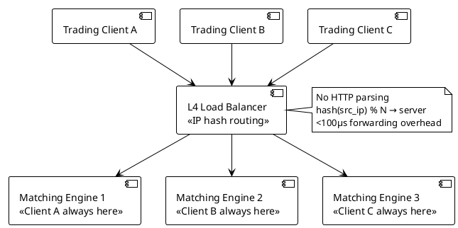

**Interview tip:** Lead with the L4/L7 distinction and why TCP-level routing eliminates HTTP parsing overhead — then connect IP hash to the stateful session requirement. Show you understand why sticky sessions via cookies don't apply to non-HTTP protocols.

---

### Q2. Long-Polling API Server

**Correct Answer: C**

**Why C is correct:**
Least connections routes each new request to the server with the fewest active connections at that moment. Because long-poll requests hold connections for 30 seconds, servers accumulate connections unevenly under round-robin. Least connections dynamically compensates — a server holding 10,000 long-poll connections won't receive new requests until others catch up, preventing any single server from being overwhelmed.

**Why not A:**
Round-robin ignores connection duration. If server 1 happens to receive the first wave of long-poll requests, it accumulates more open connections than servers 2 and 3. Over time, servers diverge drastically in active connection count.

**Why not B:**
Random with jitter reduces synchronization spikes but doesn't account for connection duration. It's better than round-robin for burst correlation but still ignores current server load.

**Why not D:**
Weighted round-robin assigns static weights based on a configuration attribute (memory). It doesn't react to real-time connection state. A high-memory server will still be overloaded if it's assigned the long-poll burst.

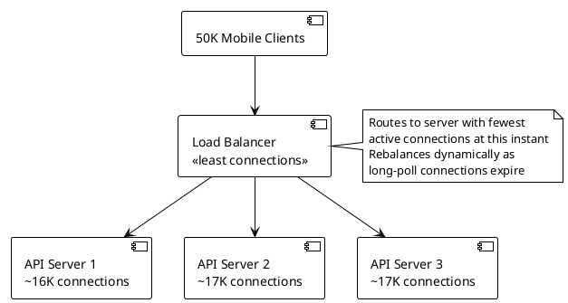

**Interview tip:** Explain that round-robin assumes equal request duration — correct for stateless APIs, wrong for long-held connections. Least connections is the standard answer for connection-duration-sensitive workloads like WebSockets, SSE, and long-polling.

---

### Q3. Shopping Cart Checkout Flow

**Correct Answer: B**

**Why B is correct:**
When session state is stored in-memory on application servers (no external session store), the only way to guarantee users reach the same server is cookie-based sticky sessions. The load balancer sets a session cookie on first request; subsequent requests from that user are routed to the same server for the cookie lifetime. This matches the 15-minute session TTL.

**Why not A:**
Round-robin will route users to different servers across requests. With in-memory session state, this means cart data is only on server 1 but the next request might go to server 2. Cart lost.

**Why not C:**
IP hash is deterministic but breaks when users are behind NAT (entire office appears as one IP, overloading one server) or when using mobile networks that change IP mid-session. Cookie-based affinity is more reliable.

**Why not D:**
Least connections routes to the server with the fewest connections, but this is a real-time metric — a new user starting a session might not go to their old server. It doesn't provide session affinity.

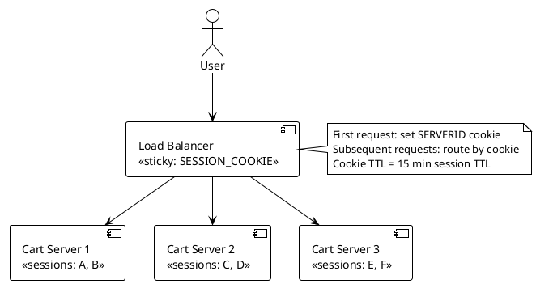

**Interview tip:** Sticky sessions are a workaround for architectural debt — the real fix is externalizing session state to Redis. But when asked "given this architecture," answer the question asked, not the architecture you wish they had.

---

### Q4. Internal Microservices API Gateway

**Correct Answer: C**

**Why C is correct:**
Envoy-based service meshes (Istio, Linkerd) are purpose-built for Kubernetes internal service traffic. They handle mTLS certificate rotation automatically, inject distributed tracing headers at the sidecar level (no code change), support path-based routing via VirtualService resources, and enforce per-service rate limits via RateLimitService. This eliminates custom Lua scripts, separate cert management, and one-off tooling.

**Why not A:**
HAProxy is excellent for high-performance L4/L7 proxying but requires manual certificate management, custom rate limiting implementation, and no native Kubernetes integration. Configuration is static file-based, not Kubernetes-native.

**Why not B:**
AWS ALB is managed and reduces operational burden, but mTLS between pods inside a Kubernetes cluster is awkward through an external ALB. It's also cloud-vendor-specific and doesn't provide the header injection and rate limiting natively for internal service mesh traffic.

**Why not D:**
Nginx with Lua scripting works but requires significant custom development for rate limiting, certificate rotation, and tracing header injection. Maintenance burden is high; the team effectively builds a bespoke service mesh.

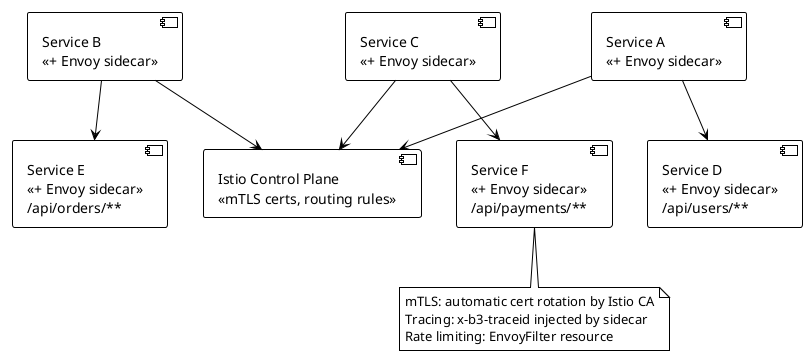

**Interview tip:** Distinguish between north-south traffic (external → cluster, handled by Ingress or ALB) and east-west traffic (service to service, handled by service mesh). This question is east-west — the service mesh is the right layer.

---

### Q5. Zero-Downtime Health Check Strategy

**Correct Answer: B**

**Why B is correct:**
Kubernetes and modern load balancers support separate liveness and readiness probes (AWS ALB, GCP LB all support this pattern). The liveness check confirms the JVM is alive; the readiness check confirms the application is ready to serve traffic. A startup delay of 50 seconds on the readiness probe prevents premature traffic during the 45-second Spring Boot startup. Crucially, the readiness check's timeout should be tuned to the payment API's P99 (2s), and a failing payment API should not remove the server from rotation if the core app is healthy — the readiness check should have a lenient threshold or exclude flaky external dependencies.

**Why not A:**
A single health endpoint checking all dependencies with a 500ms timeout means the slow payment API (2s P99) will regularly fail the health check, causing the load balancer to incorrectly remove healthy servers from rotation. This is a false positive removal scenario.

**Why not C:**
TCP health check only verifies the port is open. A Spring Boot app binds the port during framework startup, well before the application context is fully loaded. The server would receive traffic while still initializing.

**Why not D:**
Increasing timeout to 5 seconds to accommodate the payment API means every health check takes up to 5 seconds. At a 10-second interval, 50% of the time is consumed waiting. More importantly, a slow external payment API would still trigger server removal — an operational hazard unrelated to the server's health.

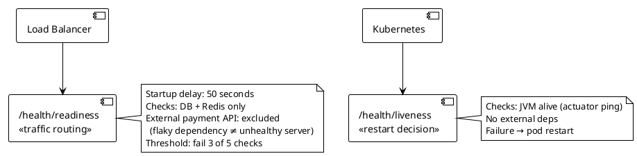

**Interview tip:** Explain the startup probe vs readiness probe distinction. The key insight: external dependency failures should not mark your server as unhealthy for load balancing — that transfers their outage to your SLA.

---

### Q6. Multi-Region User Latency

**Correct Answer: B**

**Why B is correct:**
GeoDNS resolves users to their nearest regional endpoint, putting reads within 20–50ms of the regional servers. Read replicas in each region serve 95% of traffic locally. Writes are directed to US-East by the client library (or a write-through API in each region) — a round-trip from EU to US-East (~90ms) on 5% of traffic is acceptable. This correctly separates read and write routing.

**Why not A:**
Round-robin routes EU users to US-East or APAC randomly. 100ms P95 is violated when EU users traverse the Atlantic to US-East (100–120ms network latency alone).

**Why not C:**
A CDN can cache truly static API responses, but analytics dashboard data is user-specific and dynamic. A 5-minute CDN TTL on dashboard data returns stale analytics — unacceptable for an analytics product.

**Why not D:**
Active-active with synchronous replication means every write to EU must synchronously confirm at US-East and APAC before returning. Cross-region synchronous replication adds 100–300ms to every write — worse than the baseline problem.

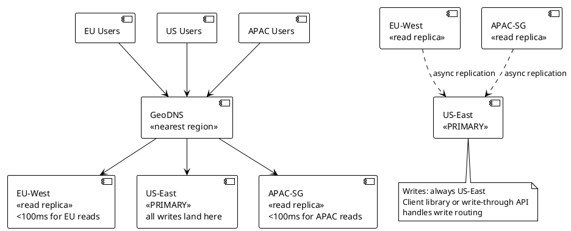

**Interview tip:** The key tradeoff to name: eventual consistency on reads (replicas lag primary by 50–200ms). For a read-heavy analytics dashboard, stale data for seconds is usually acceptable. State this explicitly — interviewers want to hear you reason about the consistency tradeoff, not just pick GeoDNS.

---

### Q7. Blue-Green Deployment with Database Migration

**Correct Answer: B**

**Why B is correct:**
The three-phase expand-contract migration is the industry standard for zero-downtime schema changes when blue and green share a database. Phase 1: add the column as nullable and update v1.3 to write it but tolerate its absence in reads (backward compatible). Phase 2: backfill nulls, then add the NOT NULL constraint (zero application changes). Phase 3: remove the v1.2 compatibility code in v1.4 (shrink phase). This allows v1.0 and v1.1/v1.3 to coexist safely on the same schema during the transition window.

**Why not A:**
`ALTER TABLE ADD COLUMN NOT NULL DEFAULT` may be instant on modern PostgreSQL (11+) but creates a forward-compatibility problem: v1.2 doesn't know about `user_tier` and writes rows without it. The NOT NULL + DEFAULT means v1.2 inserts succeed (the default fills in), but this only works if the default value is semantically correct for all legacy inserts — a business assumption that may not hold.

**Why not C:**
A maintenance window means downtime. Zero downtime was required. This is the safe fallback for teams that can't implement expand-contract.

**Why not D:**
Feature flags can gate the new code path but don't solve the schema migration problem. If v1.3's feature flag is off, the NOT NULL column still breaks v1.2 inserts if the column exists without a default.

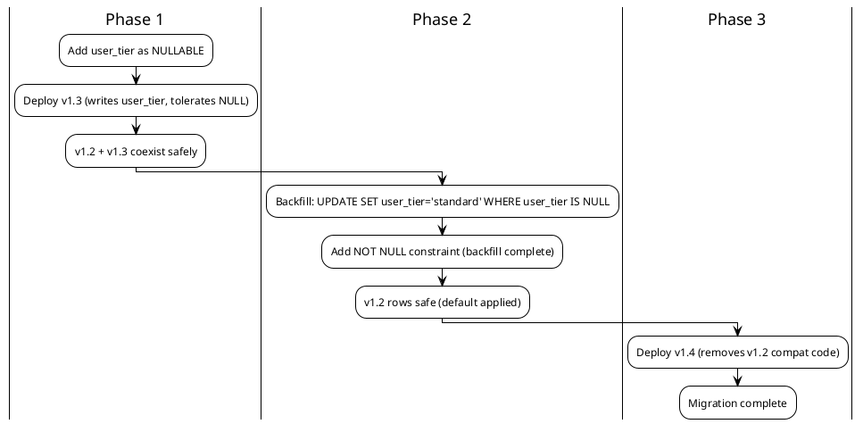

**Interview tip:** Name the pattern: "expand-contract" or "parallel change." Interviewers want to hear that you understand the shared database problem in blue-green and that the migration sequence must be backward-compatible with the old version during the transition window.

---

### Q8. Connection Draining During Scale-Down

**Correct Answer: B**

**Why B is correct:**
A 5-minute draining timeout stops new connections from reaching the server while allowing in-flight requests to complete. File uploads up to 5 minutes will complete within the window. Fast API calls (<200ms) complete nearly instantly. WebSocket connections are long-lived by design and must reconnect anyway — all WebSocket clients implement reconnection logic. The operational contract: uploads are preserved, WebSocket clients reconnect to remaining servers, no requests are dropped mid-transfer.

**Why not A:**
Immediate termination drops active file uploads. Users who are mid-upload lose their data. Not acceptable when the SLA requires no dropped uploads.

**Why not C:**
A 30-minute draining timeout to wait for WebSocket connections is operationally unacceptable. Auto-scaling would never complete scale-down events efficiently. WebSocket clients reconnect — draining them is wasteful.

**Why not D:**
Separating HTTP and WebSocket draining is a reasonable concept but requires load balancer support to filter by protocol. The practical solution is a unified drain timeout sized to the longest legitimate HTTP operation (5 minutes = file upload), with WebSocket clients expected to handle reconnection.

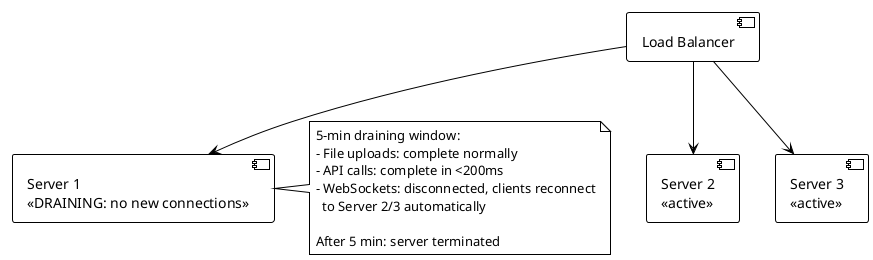

**Interview tip:** The question tests whether you distinguish between graceful termination (correct) and instant termination (data loss). The follow-up an interviewer will probe: "what about WebSocket connections?" Answer: they reconnect — that's part of WebSocket protocol design.

---

### Q9. SSL Termination Placement

**Correct Answer: C**

**Why C is correct:**
Terminating TLS at the load balancer and re-encrypting only for PCI-DSS (payments) and GDPR (PII) services balances compliance, operational overhead, and performance. The private VPC isolates internal plain-HTTP traffic from internet exposure. Payment and PII services get end-to-end encryption satisfying auditors. Non-sensitive services (45 out of 50) use plain HTTP internally, dramatically reducing certificate management burden. This is the most common pattern in regulated financial services.

**Why not A:**
End-to-end TLS at every hop (terminate and re-encrypt at load balancer, API gateway, and each service) requires TLS certificate management for all 50 services. This is the maximum security posture but also the maximum operational complexity. VPC network isolation makes this level of internal encryption redundant for non-sensitive services.

**Why not B:**
Plain HTTP everywhere inside the VPC simplifies operations but fails PCI-DSS requirements for payment data in transit. Auditors require encryption for cardholder data regardless of network boundary.

**Why not D:**
mTLS at the API Gateway for specific paths is technically correct for payment/PII but mixes two approaches (gateway-level mTLS and service-level handling), increasing complexity without clear benefit over option C.

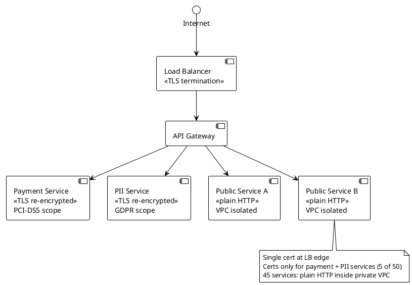

**Interview tip:** Lead with the compliance framing — "PCI-DSS requires encryption for cardholder data in transit." Then explain why VPC isolation justifies plain HTTP for non-sensitive services. Interviewers in financial services want to hear you name PCI-DSS explicitly.

---

### Q10. Canary Deployment Traffic Split

**Correct Answer: B**

**Why B is correct:**
Weighted target groups at the load balancer are the standard mechanism for canary deployments: 95% of traffic to stable, 5% to canary. Setting the canary weight to 0 achieves rollback in under 60 seconds (a single API call or console click). Running the index migration before any traffic reaches v2.2 means no data incompatibility. Error rate and latency metrics from the canary target group are collected before full rollout.

**Why not A:**
DNS TTL of 30 seconds means rollback takes 30 seconds per cached lookup plus propagation time. Modern browsers and operating systems cache DNS aggressively. Actual rollback time is unpredictable and likely exceeds 60 seconds. DNS-based split also has limited granularity.

**Why not C:**
Application-level feature flags route requests internally without infrastructure changes. This is valid but routes all traffic through all instances of the new version — not a true canary where only 5% of server instances run v2.2. If v2.2 has a memory leak or crash bug, it affects all servers.

**Why not D:**
Shadow mode (mirroring) is excellent for testing without user impact, but it doesn't validate that users can successfully complete operations on v2.2 — it only tests that v2.2 can process requests without crashing. It's a pre-canary step, not a canary replacement.

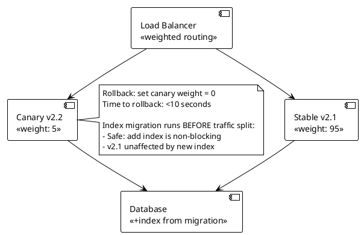

**Interview tip:** Always separate the migration from the deployment in your answer. "Run the migration first, then flip traffic" is the correct sequencing — show you know that schema changes and code deployments are independent operations.

---

### Q11. WebSocket Load Balancing

**Correct Answer: B**

**Why B is correct:**
WebSocket connections are long-lived; any routing algorithm (round-robin, least-connections) distributes new connections evenly across servers. The cross-server fan-out problem is solved by Redis Pub/Sub: when server 1 receives a message for room "sports," it publishes to `chat:room:sports` in Redis. Servers 2 and 3 — which have other members of that room — receive the message via their Redis subscription and deliver it to their local connections. The routing algorithm doesn't matter because the message delivery doesn't rely on users being on the same server.

**Why not A:**
IP hash affinity cannot guarantee room members are on the same server. Users join rooms dynamically; you cannot predict which server their IP will hash to relative to other room members' IPs.

**Why not C:**
Cookie-based sticky sessions ensure a user's requests go to the same server, but WebSocket is a single persistent connection — there are no repeated requests. The session affinity doesn't help with cross-server room fan-out.

**Why not D:**
Single-server WebSocket handling is a vertical scaling dead end. A single server at 30K connections is at risk; at 300K connections, it's impossible. Horizontal scaling with a shared message bus is the standard production architecture.

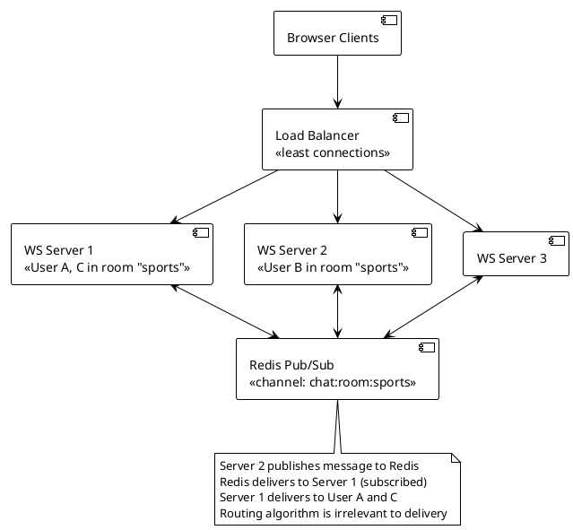

**Interview tip:** The routing strategy is a distractor — the real answer is the fan-out mechanism. Lead with Redis Pub/Sub before discussing routing. This shows you understand the actual architectural problem (cross-server delivery) vs. the surface problem (routing).

---

### Q12. Path-Based Routing for Microservices

**Correct Answer: C**

**Why C is correct:**
Layer 7 reverse proxies and API gateways (Nginx, Envoy, AWS ALB) inspect the HTTP request after TLS termination and route based on the URL path. This is a fundamental L7 capability: one public IP, one TLS certificate, path-based routing to multiple upstream services. This is the standard single-entry-point pattern for microservices.

**Why not A:**
DNS CNAME records create separate domains per service (users.api.com, products.api.com). This violates the "single public IP" requirement and requires multiple TLS certificates. DNS cannot route based on URL path on a single hostname.

**Why not B:**
A Layer 4 load balancer routes based on IP/port, not URL path. Port 443 is a single TCP endpoint — L4 cannot distinguish `/api/users` from `/api/orders` without reading the HTTP payload, which is L7 work.

**Why not D:**
Client-side load balancing requires clients to know the internal port mappings (8081, 8082, 8083). This exposes internal service topology to external clients, makes port management a public API concern, and doesn't allow TLS termination at a single point.

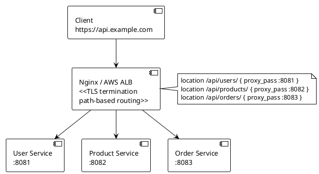

**Interview tip:** This is a foundational question testing whether you know the difference between L4 and L7. Answer quickly: "L7 proxy, path-based routing, TLS termination at the gateway." Save your depth for harder questions.

---

## Topic 2: Caching Strategies

---

### Q13. Product Catalog Read Pattern

**Correct Answer: B**

**Why B is correct:**
Cache-aside (lazy loading) is the lowest-complexity pattern for a predominantly read-heavy workload with infrequent writes. The application checks the cache first; on a miss, it queries the database and populates the cache with a 5-minute TTL. At 80K reads/sec with only 50 updates/minute, the cache hit rate will be extremely high. Cache-aside doesn't require infrastructure changes to the database or cache layer — the application controls when and what to cache.

**Why not A:**
Write-through updates the cache on every write. With 50 updates per minute, this is virtually zero write overhead. It's not wrong, but it's more complex than cache-aside with no meaningful benefit for this workload: the cache gets updated on writes, but the 5-minute TTL on cache-aside already handles the eventual consistency window.

**Why not C:**
Read-through delegates cache population to the cache layer (requires a cache plugin or proxy). It's functionally equivalent to cache-aside but requires more infrastructure — the cache must know how to call the database. Adds operational complexity without benefit for a simple key-value product lookup.

**Why not D:**
Write-behind is for high-write workloads where you need to absorb write bursts. With 50 writes/minute, write-behind introduces async complexity and data loss risk for no performance benefit.

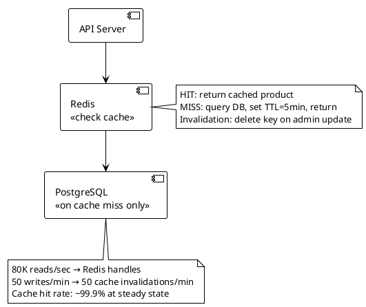

**Interview tip:** Cache-aside is the default answer for read-heavy workloads. Know when to use the others: write-through for read-your-writes consistency, write-behind for write-burst absorption. State the TTL and invalidation strategy — interviewers always ask.

---

### Q14. Financial Ledger Write Pattern

**Correct Answer: B**

**Why B is correct:**
Write-through writes to both the cache and the database synchronously before acknowledging the client. The write is only ACKed when both the cache and DB confirm persistence. This guarantees no data loss (DB is durable) and read-your-writes consistency (cache is immediately updated). The 50ms write latency budget accommodates a synchronous DB write — 5,000 writes/sec on a properly configured PostgreSQL with connection pooling is well within range.

**Why not A:**
Write-behind acknowledges the client after the cache write, before the DB write. If the cache node fails between ACK and flush, those writes are permanently lost. Zero data loss tolerance rules this out categorically.

**Why not C:**
Async DB write has the same problem as write-behind: the client is acknowledged before DB persistence. A JVM crash or cache failure before the background thread persists = data loss.

**Why not D:**
Writing directly to the database at 5K TPS with no cache is valid (PostgreSQL handles 10K+ TPS with WAL tuning). It's not wrong, but it misses the consistency benefit of having the cache warm for reads. The question asks about write caching strategy — write-through is the correct answer within the caching context.

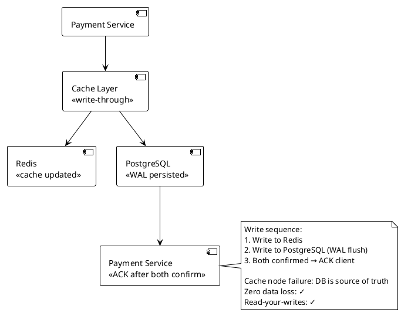

**Interview tip:** In financial services, "zero data loss" immediately eliminates all async write patterns. State this first: "write-behind is ruled out by the zero-data-loss requirement" — then explain write-through.

---

### Q15. News Feed Eviction Policy

**Correct Answer: C**

**Why C is correct:**
LFU evicts items with the lowest access frequency, not the least recently accessed. Celebrity posts are read millions of times — LFU assigns them a very high frequency count and they stay in cache indefinitely. Posts older than 48 hours that were read a few hundred times get evicted over time as their frequency count is surpassed by newer high-traffic posts. This naturally prioritizes structural popularity over recency, which matches the 80/20 read distribution described.

**Why not A:**
TTL-only removes posts after 48 hours regardless of read frequency. A celebrity post with 10M reads gets evicted at 48 hours despite still being heavily requested. Cache miss rate spikes on high-traffic posts.

**Why not B:**
LRU evicts the least recently used item. A celebrity post could be displaced by a burst of reads for a different post, even if the celebrity post has 100× more total reads. LRU doesn't account for structural read frequency differences.

**Why not D:**
Random eviction has no awareness of access patterns. It will randomly evict the most-read posts as often as the least-read ones. Cache hit rate will be suboptimal.

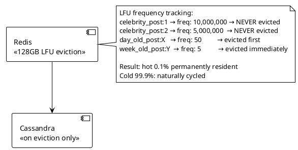

**Interview tip:** LRU vs LFU is a classic distinction. LRU is correct for recency-biased workloads (recently viewed items). LFU is correct for frequency-biased workloads (viral content, celebrity posts). State the access pattern distribution before naming the policy.

---

### Q16. Session Storage Selection

**Correct Answer: A**

**Why A is correct:**
Redis Cluster is the standard answer for session storage at this scale. Sub-millisecond reads, native TTL support for session expiry, in-memory storage (1GB fits easily), replication for HA, and horizontal scaling for 150K reads/sec. Redis is purpose-built for exactly this access pattern: key-value lookup by session ID with TTL-based expiry.

**Why not B:**
Memcached lacks replication and persistence. A Memcached node failure loses all sessions on that node — users are logged out. "Sessions must survive individual server failures" is an explicit requirement, which Memcached fails.

**Why not C:**
PostgreSQL can store sessions but adds unnecessary write latency (disk I/O, B-tree index updates) for what is fundamentally a hot-path in-memory key-value access pattern. At 150K reads/sec, PostgreSQL will require significant infrastructure to match Redis's performance, with higher operational cost.

**Why not D:**
JWT tokens move session state to the client. This is a valid pattern for stateless auth but not for traditional session management with server-side revocation. The question specifies session data — something that must be stored server-side. Revoking a JWT before expiry requires a denylist, which brings back the server-side storage problem.

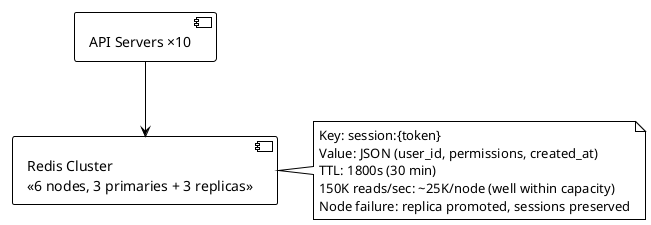

**Interview tip:** Know the Redis vs Memcached comparison cold: Redis adds persistence, replication, richer data structures, and Pub/Sub. Memcached is faster for pure throughput on a single node with no HA requirement. Session storage almost always needs HA → Redis wins.

---

### Q17. Local vs Distributed Cache

**Correct Answer: B**

**Why B is correct:**
5MB of configuration data fits trivially in JVM heap. With a 60-second TTL per server, each server independently refreshes from the database once per minute. 200K reads/sec across 3 servers = 66K reads/sec per server, all served from local memory at nanosecond latency (no network round-trip). The 1-hour update frequency means each server sees at most 60 seconds of stale config after an admin change — well within the stated 60-second tolerance. This eliminates Redis entirely for this use case, reducing operational complexity and cost.

**Why not A:**
Redis is correct when you need instant cross-server consistency. For a 60-second stale tolerance on a 1-hour update cadence, the network round-trip (1ms) × 200K reads/sec = $200ms/sec of unnecessary latency overhead compared to L1 memory reads. Redis adds infrastructure and cost without benefit here.

**Why not C:**
JGroups cluster replication adds network overhead for config changes between 3 servers. Given that 60 seconds of staleness is acceptable, full replication is overengineered.

**Why not D:**
Reading from the database on every request at 200K reads/sec would require a database capable of serving 200K QPS — orders of magnitude more expensive than caching. No caching for a 200K read/sec access pattern is an anti-pattern.

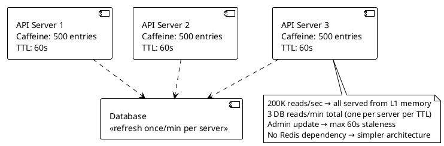

**Interview tip:** Know when NOT to use distributed cache. Small, infrequently-changing data with tolerable staleness = local cache. The failure to recognize this leads to over-engineered solutions. Show the math: 200K reads × 0ns (local) vs 200K reads × 1ms (Redis) = real throughput difference.

---

### Q18. Cache Stampede Prevention

**Correct Answer: B**

**Why B is correct:**
Two mechanisms work together. The mutex (Redis `SETNX` or Java `ReentrantLock`) ensures only one request rebuilds the cache when the key expires — all other concurrent requests wait and then read the freshly populated key. Probabilistic early expiration (XFetch algorithm) proactively recomputes the cache before it expires, based on recomputation cost and remaining TTL. Together: XFetch prevents most stampedes by recomputing early, and the mutex handles the case where the key does expire before XFetch triggers.

**Why not A:**
Increasing TTL to 10 minutes reduces stampede frequency by 10× but doesn't eliminate it. At 10K concurrent users, every 10-minute expiry triggers the same 10K simultaneous misses, now hitting the database with a 3-second rebuild during business hours. The problem recurs, less frequently.

**Why not C:**
TTL jitter distributes expiry events across a ±10 second window, reducing the simultaneous miss count. But with 10K users hitting the same key at 10K req/sec, even a 1-second window produces ~1,000 simultaneous DB calls. The database at 5 concurrent max is still overwhelmed.

**Why not D:**
Read-through cache delegates cache population to the cache layer but doesn't inherently serialize concurrent misses. Without a mutex, multiple threads in the read-through cache still call the database concurrently on expiry.

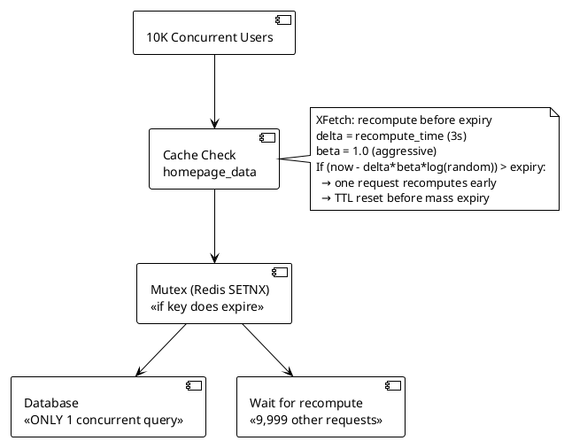

**Interview tip:** Name both mechanisms separately. XFetch = probabilistic prevention. Mutex = deterministic serialization on actual miss. Combined, you get defense-in-depth. If you only know one, say the mutex — it's the simpler and more common interview answer.

---

### Q19. CDN Cache Strategy for Personalized Content

**Correct Answer: B**

**Why B is correct:**
Personalized content — containing a specific user's account balance and recent orders — cannot be cached at a shared CDN layer. A CDN serves the same cached response to all users requesting the same URL. Caching user-specific data at a CDN would serve user A's account balance to user B. `Cache-Control: no-store` correctly instructs the CDN and all intermediary caches to not store this response. All requests reach the origin.

**Why not A:**
Ignoring the Authorization header and caching at the CDN is a critical security failure. The CDN serves the first user's response to all subsequent users requesting the same URL. Account balances, order history, and financial data would be cross-contaminated. This is a data breach.

**Why not C:**
Keying the cache by Authorization token creates a separate cache entry per user. At 500K unique users/day, this generates 500K CDN cache entries. The "cache" provides no hit ratio benefit (each entry is used exactly once per user per 30-second TTL). CDN storage costs explode. This is the anti-pattern of mistaking personalization for caching.

**Why not D:**
Serving a shell response from CDN and loading personalized data client-side (API calls from browser JS) is a valid architecture but describes a page rendering strategy, not a caching strategy. It also adds a second API call on every page load. The question asks specifically about the `/api/dashboard` endpoint caching — the answer is no-store.

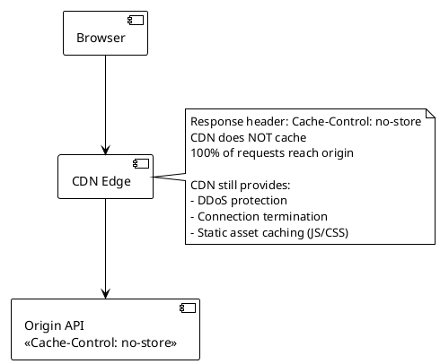

**Interview tip:** CDN caching is for shared, non-personalized content. The moment a response is user-specific, cache-control should be `no-store` or `private`. Confusing these is a security bug, not a performance tradeoff.

---

### Q20. Cache Invalidation on Write

**Correct Answer: B**

**Why B is correct:**
Delete-on-write (cache invalidation) is the safest cache strategy for read-your-writes consistency. After a user updates their profile, the cache key `user:{id}` is deleted. The next read (from the same user or any other) hits the database, gets fresh data, and repopulates the cache. Simple, correct, and no risk of stale-write-then-update inconsistency.

**Why not A:**
TTL-only means a user updates their profile and then immediately sees their old profile in the UI for up to 10 minutes. This explicitly violates the read-your-writes requirement stated in the scenario.

**Why not C:**
Write-through updates the cache synchronously on write. The risk: if the DB write succeeds but the cache write fails (network partition, Redis down), the cache still holds the old value. Subsequent reads return stale data. The double-write atomicity problem is subtle but real. Delete-on-write avoids this: if the cache delete fails, the TTL will eventually expire it anyway.

**Why not D:**
Double-delete pattern (delete before and after write with delay) was designed to handle replication lag between read replicas. If writes go to the primary and reads come from a replica, the first delete removes the cached value, the write happens on primary, the replica catches up, and the second delete (after 500ms) removes any stale value the replica might have served in the interim. Valid for replica architectures but overkill for a single primary setup.

```plantuml
@startuml
!theme plain
skinparam backgroundColor white

[Write Request\nPUT /users/{id}] --> [User Service]
[User Service] --> [PostgreSQL\n<<UPDATE users>>]
[User Service] --> [Redis\n<<DEL user:{id}>>]

[Read Request\nGET /users/{id}] --> [Redis\n<<MISS→DB→SET>>]
[Redis\n<<MISS→DB→SET>>] --> [PostgreSQL\n<<SELECT users>>]

note bottom
  Post-write read:
  1. Cache key deleted
  2. Next GET → cache miss
  3. DB returns fresh data
  4. Cache repopulated
  → read-your-writes satisfied
end note
@enduml
```

**Interview tip:** Cache invalidation is one of the two hard problems in CS. Know the three strategies cold: TTL (eventual), delete-on-write (safe consistency), write-through (synchronous). Be ready to explain the double-delete pattern and when it's needed (read replica lag).

---

### Q21. Multi-Level Cache Architecture

**Correct Answer: A**

**Why A is correct:**
L1 Caffeine with 50,000 entries at 1-hour TTL holds the entire hot set in-process. With 10 servers, each serving the same 50K products, L1 absorbs ~90% of reads at nanosecond latency (no network). L2 Redis at 5M entries, 1-hour TTL handles the long tail (5M products not in L1). The batch update every hour aligns with the 1-hour TTL on both layers — both invalidate simultaneously via TTL, matching the batch refresh cycle. The hierarchy is correct: L1 hit (ns) → L2 hit (1ms) → DB query (15ms).

**Why not B:**
Redis-only handles the load but foregoes the L1 optimization. At 500K reads/sec across 10 servers (50K reads/sec/server), each read adds 1ms Redis round-trip overhead. Total unnecessary latency: 50K reads/sec × 1ms = 50 seconds/sec of cumulative L1 savings lost per server. For a read-intensive recommendation engine, L1 is significant.

**Why not C:**
Unlimited L1 means the JVM heap holds all 5M products. At even 1KB per entry, that's 5GB per server — likely exceeding heap capacity and causing GC pressure. Bounded L1 at 50K entries (the hot set) with L2 fallback for the long tail is the correct design.

**Why not D:**
L1 at 5-minute TTL means hot products are evicted and re-fetched from Redis every 5 minutes. With a 1-hour batch cycle, data doesn't change during the hour — 5-minute TTL causes 12× unnecessary L1 misses per batch cycle. Match TTL to update frequency.

```plantuml
@startuml
!theme plain
skinparam backgroundColor white

[Recommendation API] --> [L1: Caffeine\n50K entries, 1-hour TTL\n~200MB heap]
[L1: Caffeine\n50K entries, 1-hour TTL\n~200MB heap] --> [L2: Redis Cluster\n5M entries, 1-hour TTL\n~64GB]
[L2: Redis Cluster\n5M entries, 1-hour TTL\n~64GB] --> [PostgreSQL Read Replica\n<<long tail, 15ms>>]

note bottom
  L1 hit rate: ~90% (hot 50K products)
  L2 hit rate: ~9.9% (remaining long tail)
  DB hit rate: ~0.1% (cold products)
  Batch job: refreshes DB at T+0h
  Both cache layers expire at T+1h → auto-refresh
end note
@enduml
```

**Interview tip:** Multi-level cache design is a Principal-level topic. Show you understand the L1 vs L2 tradeoff (memory vs network), that TTL should match update frequency, and that bounded L1 (not unlimited) is the correct design.

---

### Q22. Null/Empty Result Caching

**Correct Answer: B**

**Why B is correct:**
Caching the null result is the cache penetration defense. When the API returns 404 for a non-existent user, it stores a sentinel value `USER_NOT_FOUND` (or an empty string) in Redis with a 60-second TTL. The next 50,000 requests for the same non-existent ID all hit Redis (cache hit returning null) rather than the database. This eliminates the DB query entirely for repeated probes of the same ID. A 60-second TTL ensures the sentinel doesn't permanently block legitimate users if the ID is later created.

**Why not A:**
Rate limiting per IP is a partial defense but requires knowing malicious IPs in advance. Sophisticated bots rotate IPs. Rate limiting at the edge (WAF) is an additional layer but doesn't solve the DB overload for IPs that haven't exceeded per-IP thresholds yet.

**Why not C:**
Scaling the database (read replicas) to handle 50K QPS of non-existent key lookups is cost-prohibitive and treats the symptom, not the cause. The attacker can always send more traffic than you can provision.

**Why not D:**
A Bloom filter is the right tool for this but at a different level. A Bloom filter on all 500M user IDs (described in Q24) requires significant memory (~500MB for 1% false positive rate). Null caching is simpler and applies to the specific IDs being probed. Both can be used together.

```plantuml
@startuml
!theme plain
skinparam backgroundColor white

[Bot: GET /api/users/NONEXISTENT_ID] --> [Redis\n<<check cache>>]
note right of [Redis\n<<check cache>>]
  First request:
    MISS → DB → 404
    SET user:NONEXISTENT_ID = "NOT_FOUND" TTL=60s
  
  Requests 2 through 50,000:
    HIT → return "NOT_FOUND" → 404
    Database never called
end note
[Redis\n<<check cache>>] ..> [Database\n<<only on first miss>>]
@enduml
```

**Interview tip:** Know the three cache attack patterns and their defenses: Cache penetration (non-existent keys) → null caching or Bloom filter. Cache breakdown (key expiry under hot load) → mutex or probabilistic expiry. Cache avalanche (mass expiry) → TTL jitter or warm-up.

---

### Q23. Cache Warming Strategy

**Correct Answer: B**

**Why B is correct:**
Pre-warming before launch is the correct answer. Before switching DNS/LB to the new region, a warming job loads the top 10K products into cache by querying the database at a controlled rate (500 concurrent queries max). This takes under 5 minutes (10K products / 500 concurrent queries × response time). When traffic arrives, 90% of reads hit the warm cache. The database never sees cold-start traffic.

**Why not A:**
Organic cache warming means the first 5 minutes of production traffic hits the database with 100K req/sec of cold misses. The database handles 500 concurrent queries — at 100K req/sec of misses, it's overwhelmed within milliseconds of launch. Organic warming works only when traffic ramps gradually.

**Why not C:**
A dedicated read replica for warming prevents OLTP impact but doesn't solve the warming speed or the cold-start traffic problem. The database (replica or primary) still gets hit with cold traffic at launch if warming isn't complete before DNS flip.

**Why not D:**
Circuit breaker returning stale data or 503 during cold start is a last-resort failure mode, not a deployment strategy. Serving 503 to users at launch is a poor experience and doesn't fix the underlying problem.

```plantuml
@startuml
!theme plain
skinparam backgroundColor white

|Pre-Launch|
:Deploy new region (no traffic yet);
:Warming job: SELECT top 10K products FROM DB;
note right: Rate-limited to 500 concurrent queries\n~2 minutes to warm 10K products
:SET product:{id} in Redis for each product;
:Verify cache hit rate > 90%;

|Launch|
:Flip DNS/LB → new region;
:Traffic hits: 90% cache hit immediately;
:DB sees: ~10% miss rate (long tail only);
note right: 10K req/sec to DB (manageable)\nnot 100K req/sec (would overwhelm)
@enduml
```

**Interview tip:** Interviewer follow-up: "What if the top 10K changes while you're warming?" Answer: the warming job can use yesterday's popularity metrics — good enough. Perfect accuracy isn't the goal; reducing cold-start DB load by 90% is.

---

### Q24. Cache Penetration with Bloom Filter

**Correct Answer: B**

**Why B is correct:**
The Bloom filter is checked as the first gate, before any cache or database lookup. If the Bloom filter returns "definitely does not exist" (no false negatives), the request is rejected with 404 immediately — zero cache or DB involvement. Only requests that the Bloom filter says "might exist" (including false positives for truly non-existent IDs) proceed to cache and potentially database. This caps database load from non-existent ID attacks to the Bloom filter's false positive rate multiplied by attack traffic.

**Why not A:**
Bloom filter as a cache replacement is architecturally wrong. A Bloom filter can only answer "might exist" or "definitely not exist" — it cannot return the actual user data. It's a gate, not a cache.

**Why not C:**
Checking the Bloom filter after the cache miss means non-existent IDs still check the cache first. Redis gets hammered with 200K lookups/sec for non-existent IDs. The Bloom filter at this position reduces DB load but not cache load.

**Why not D:**
Write-only Bloom filter (on registration only) doesn't protect reads. Without read-side checking, every read request for a non-existent ID still hits Redis and potentially the DB. The filter is only half-integrated.

```plantuml
@startuml
!theme plain
skinparam backgroundColor white

[API Request\nGET /api/users/{uuid}] --> [Bloom Filter\n<<500M UUIDs, ~600MB, 1% FP>>]

note right of [Bloom Filter\n<<500M UUIDs, ~600MB, 1% FP>>]
  "Definitely NOT exists" → 404 immediately
  (99% of attacker's 200K/sec requests)
  
  "Might exist" (includes 1% false positives)
  → proceed to cache + DB
  
  DB load from attack: 200K × 1% = 2K req/sec
  Within DB capacity (5K QPS)
end note

[Bloom Filter\n<<500M UUIDs, ~600MB, 1% FP>>] --> [Redis Cache\n<<only for "might exist">>]
[Redis Cache\n<<only for "might exist">>] --> [Database\n<<only for cache misses>>]
@enduml
```

**Interview tip:** Know the Bloom filter false positive/negative properties: can have false positives (says exists when it doesn't), never false negatives (never says not-exists when it does). This is why it's safe as a pre-gate: legitimate users are never blocked.

---

### Q25. Hot Key Problem in Redis

**Correct Answer: D**

**Why D is correct:**
Adding an L1 in-process cache (Caffeine) with a 1-second TTL on each of 50 application servers reduces Redis reads from 200K/sec to 50/sec (each server reads from Redis once per second, caches locally, serves all subsequent requests locally for 1 second). The hot key is no longer a bottleneck — Redis sees 50 reads/sec instead of 200K/sec. The 1-second TTL means cached data is at most 1 second stale — acceptable for trending post metadata.

**Why not B:**
Key replication to all 6 nodes is a valid Redis-level solution, but it requires writes to update all 6 replicas atomically, adding write complexity. It also doesn't eliminate the per-request Redis round-trip (just spreads it). L1 caching eliminates the round-trip entirely, which is a better performance outcome.

**Why not A:**
Vertical scaling a single Redis node doesn't address the architectural issue. The bottleneck is the concentration of traffic on one key, not total node capacity. Scaling up that node buys time but doesn't fix the problem.

**Why not C:**
Moving the hot key to a dedicated Redis instance is an operational workaround that still exposes the dedicated instance to 200K req/sec. The hot key problem follows the key, not the node.

```plantuml
@startuml
!theme plain
skinparam backgroundColor white

[50 App Servers\n<<Caffeine: trending_post:12345 TTL=1s>>] --> [Redis Cluster\n<<50 reads/sec total>>]

note right of [50 App Servers\n<<Caffeine: trending_post:12345 TTL=1s>>]
  Each server:
  - Serves 4,000 reads/sec locally (from Caffeine)
  - Refreshes from Redis once/second
  
  Redis sees:
  - 50 reads/sec (one per server per TTL)
  - Not 200K/sec
  Hot node CPU: 15% (same as others)
end note
@enduml
```

**Interview tip:** L1 in-process cache is the most effective solution for hot key problems when slight staleness is acceptable. Always qualify: "this introduces 1-second eventual consistency." The interviewer will ask — have the answer ready.

---

### Q26. Write-Behind Failure Handling

**Correct Answer: B**

**Why B is correct:**
Write-behind is architecturally incompatible with zero data loss. No matter how you tune it (smaller flush intervals, faster persistence), there is always a window between the cache write (ACK to client) and the database write. If any component fails in that window, data is lost. The only correct answer is to change the write strategy to write-through: synchronous write to the database before ACKing the client. This adds latency per write but is the only guarantee compatible with zero data loss.

**Why not A:**
10ms flush interval reduces the loss window from 100ms to 10ms — still non-zero. At 20K writes/sec, a 10ms window still contains 200 unacknowledged writes at risk.

**Why not C:**
Redis AOF with fsync=always persists every write to disk before ACKing Redis clients. This makes Redis itself durable — but the client is ACKed after the Redis write (before the database write). If Redis is durable but the async DB write hasn't happened and the entire machine fails, the data is in Redis AOF but not in the database. This is durable data, but it still requires Redis AOF recovery — a more complex recovery path than synchronous DB writes.

**Why not D:**
Redis Cluster replication handles Redis node failure (primary writes replicate to replicas). But replication doesn't prevent the write-behind's fundamental problem: the data is in Redis (primary + replicas) but not yet in the database. A database write failure or application crash after Redis replication still loses the write from the database perspective.

```plantuml
@startuml
!theme plain
skinparam backgroundColor white

[Cart Update Request] --> [Cart Service\n<<write-through>>]
[Cart Service\n<<write-through>>] --> [Redis\n<<update cart>>]
[Cart Service\n<<write-through>>] --> [PostgreSQL\n<<persist cart>>]
[PostgreSQL\n<<persist cart>>] --> [Client\n<<ACK after both confirm>>]

note right
  Write latency added: ~5ms (DB write)
  Data loss: ZERO (both stores updated before ACK)
  
  Redis failure: cart still in DB (source of truth)
  DB failure: write fails, client retries
  
  No async window = no loss window
end note
@enduml
```

**Interview tip:** Write-behind is a performance pattern, not a reliability pattern. When the requirements say zero data loss, write-behind is immediately ruled out. State this constraint first, then explain write-through.

---

### Q27. Cache Consistency in Microservices

**Correct Answer: B**

**Why B is correct:**
Event-driven invalidation via message bus is the correct pattern for eventual consistency across many services. When the Price Service updates a price, it publishes a `PriceUpdated` event to Kafka or Redis Pub/Sub. Each of the 20 services subscribes to price events and invalidates the relevant cache key on receipt. Propagation time is milliseconds (Kafka consumer lag). This is decoupled — the Price Service doesn't need to know which services cache prices.

**Why not A:**
1-second TTL with an "acceptable stale window of 0 seconds" is a contradiction. If zero staleness is required, TTL-based expiry cannot satisfy it — there will always be a 0–1 second window of stale data.

**Why not C:**
Synchronous REST fan-out to 20 services per price change couples the Price Service tightly to all consumers. At 500 price changes/day, this means 500 × 20 = 10,000 synchronous HTTP calls/day. If any consumer service is down or slow, the price update is blocked. This is a distributed monolith.

**Why not D:**
No-cache (always query Price Service) moves the load problem from the database to the Price Service. At high read volumes (20 services × their respective traffic), the Price Service becomes a bottleneck. It doesn't solve the problem — it relocates it.

```plantuml
@startuml
!theme plain
skinparam backgroundColor white

[Price Service] --> [PostgreSQL\n<<update price>>]
[Price Service] --> [Kafka\n<<topic: price-updates>>]
[Kafka\n<<topic: price-updates>>] --> [Order Service\n<<DEL price:{product_id}>>]
[Kafka\n<<topic: price-updates>>] --> [Inventory Service\n<<DEL price:{product_id}>>]
[Kafka\n<<topic: price-updates>>] --> [... 18 other services\n<<each invalidates local cache>>]

note bottom
  Price Service: 1 DB write + 1 Kafka publish
  Each consumer: subscribes independently
  Propagation: milliseconds
  Price Service: no knowledge of consumers
  New service added: just subscribe to topic
end note
@enduml
```

**Interview tip:** Event-driven invalidation is the microservices-idiomatic answer for cross-service cache consistency. The key benefits to mention: decoupling (Price Service doesn't know consumers), extensibility (new services just subscribe), and asynchronous fan-out (no blocking chain).

---

## Topic 3: Database Selection & Modeling

---

### Q28. E-Commerce Product Catalog Store

**Correct Answer: B**

**Why B is correct:**
MongoDB's document model is a natural fit for a heterogeneous product catalog where each category has entirely different attributes. Each product is stored as a single self-contained document with its category-specific fields. Compound indexes on `(category, attributes, price)` support filtered queries efficiently. At 50K reads/sec, MongoDB's horizontal scaling and read replica support are appropriate. The flexible schema means adding a new product category requires no schema migration.

**Why not A:**
EAV (Entity-Attribute-Value) in PostgreSQL is the classic anti-pattern for this exact problem. Every attribute becomes a row in a `(product_id, attribute_name, attribute_value)` table. A query filtering Electronics by voltage requires joining EAV rows — the query planner can't use indexes efficiently. At 50K reads/sec, this approach becomes a performance disaster.

**Why not C:**
Cassandra excels at high-cardinality write-heavy workloads (IoT sensor data, event logs). Its query model requires knowing the partition key upfront. Filtering by arbitrary attribute combinations on a product catalog is fundamentally mismatched to Cassandra's data model.

**Why not D:**
Elasticsearch as the only store lacks ACID guarantees, has eventual consistency semantics, and is not designed for transactional writes. It should be a secondary index synchronized from MongoDB (or PostgreSQL), not the primary store.

```plantuml
@startuml
!theme plain
skinparam backgroundColor white

[Product API] --> [MongoDB\n<<product collection>>]

note right of [MongoDB\n<<product collection>>]
  Electronics document:
  { _id, name, category: "electronics",
    voltage: 240, watts: 100, dimensions: {...} }
  
  Clothing document:
  { _id, name, category: "clothing",
    sizes: ["S","M","L"], material: "cotton" }
  
  Indexes:
  { category: 1, price: 1 }
  { category: 1, "attributes.voltage": 1 }
  Full-text: { name: "text", description: "text" }
end note
@enduml
```

**Interview tip:** The EAV anti-pattern comes up specifically for "variable attributes per category" use cases. Know why EAV fails: joins at query time, impossible to index attribute values efficiently, data type enforcement lost. MongoDB's document model solves this natively.

---

### Q29. IoT Sensor Time-Series Storage

**Correct Answer: B**

**Why B is correct:**
TimescaleDB (PostgreSQL extension) and InfluxDB are purpose-built for time-series data: automatic time-based partitioning (hypertables), continuous aggregates that pre-compute hourly averages, columnar compression on historical data (10–20× compression ratio), and native retention policies. The `time_bucket()` aggregation function is purpose-built for the query pattern described. These features would require significant custom development on a general-purpose database.

**Why not A:**
PostgreSQL can handle 5K writes/sec with proper partitioning, but requires manual implementation of time-based partitioning, compression, and retention — all features TimescaleDB adds as extensions. TimescaleDB IS PostgreSQL; the answer to "use TimescaleDB" is effectively "use PostgreSQL with time-series optimizations."

**Why not C:**
Cassandra is write-optimized and handles 5K writes/sec trivially. Its partition model (device ID as partition key, timestamp as clustering key) supports time-range queries per device. However, cross-device aggregations and automatic retention require additional tooling (Spark, manual TTL per column). It's a valid choice but requires more engineering than a purpose-built time-series DB.

**Why not D:**
MongoDB's aggregation pipeline handles time-range queries but at 5K writes/sec with 2-year retention (~2TB), the document model's overhead per row (BSON overhead, index updates per insert) is significantly less efficient than columnar compression. Time-series data is inherently tabular — MongoDB's row-oriented document store is a poor structural fit.

```plantuml
@startuml
!theme plain
skinparam backgroundColor white

[50K IoT Sensors] --> [TimescaleDB\n<<PostgreSQL + time-series extension>>]

note right of [TimescaleDB\n<<PostgreSQL + time-series extension>>]
  Hypertable: readings(device_id, time, value)
  Auto-partitioned by time (1-week chunks)
  Continuous aggregate: hourly_avg per device
  Compression: enabled after 7 days (10× ratio)
  Retention policy: DROP chunks > 2 years
  
  Query:
  SELECT time_bucket('1h', time), avg(value)
  FROM readings
  WHERE device_id = ? AND time > now() - '24h'
  GROUP BY 1
  → sub-100ms on compressed historical data
end note
@enduml
```

**Interview tip:** Know the time-series database landscape: InfluxDB (purpose-built, own query language), TimescaleDB (PostgreSQL extension — best for teams already on Postgres), Apache IoTDB, VictoriaMetrics, Prometheus (short-term metrics only). For IoT at this scale, TimescaleDB or InfluxDB v2 are the standard answers.

---

### Q30. Fraud Detection Graph Queries

**Correct Answer: B**

**Why B is correct:**
Graph databases store entities as nodes and relationships as edges with direct pointer links between them. A 3-hop traversal follows: Account → SharedDevice → Account → SharedIP → Account — each hop follows a pointer, not a JOIN. On 2B relationships in Neo4j, a 3-hop query returns in under 100ms because it traverses only the relevant subgraph, not the entire 2B-row relationship table. This is called "index-free adjacency" — the fundamental advantage of graph databases over relational JOIN-based traversal.

**Why not A:**
PostgreSQL recursive CTEs express graph traversal in SQL, but the execution plan requires repeated JOIN operations across the relationships table. At 200M accounts and 2B relationships, a 3-hop traversal can generate intermediate result sets in the hundreds of millions of rows. Performance degrades exponentially with hop depth — often called the "JOIN explosion" problem.

**Why not C:**
Elasticsearch's document model stores entities as documents. Multi-hop relationship traversal requires multiple query rounds: find connected accounts (query 1), fetch those accounts' connections (query 2), fetch their connections (query 3). Each hop is a separate network call. No native graph traversal; 500ms target is likely violated.

**Why not D:**
Cassandra adjacency lists (storing neighbor IDs in a set column) require multiple application-level reads for each hop: read account A's neighbors (query 1), for each neighbor read their neighbors (query 2, N calls), for each of those read their neighbors (query 3, N² calls). Exponential query count explosion. In-memory joining of 200M nodes is not feasible.

```plantuml
@startuml
!theme plain
skinparam backgroundColor white

[Fraud API] --> [Neo4j\n<<graph database>>]

note right of [Neo4j\n<<graph database>>]
  Cypher query:
  MATCH (a:Account {id: $target})-[:SHARES_IP|SHARES_DEVICE*1..3]-(b:Account)
  RETURN b.id, count(*) as connections
  ORDER BY connections DESC
  LIMIT 100
  
  Execution: pointer traversal, not table scan
  200M accounts, 2B relationships: <200ms
  3-hop: no exponential JOIN explosion
end note
@enduml
```

**Interview tip:** The "index-free adjacency" concept is the key differentiator. In a relational DB, a JOIN scans an index. In a graph DB, traversal follows a pointer — O(1) per hop regardless of total graph size. Name this when explaining why graph databases win for multi-hop traversal.

---

### Q31. Write-Heavy Leaderboard

**Correct Answer: B**

**Why B is correct:**
Redis Sorted Sets are the textbook answer for leaderboards. `ZADD` (score update) is O(log N). `ZRANK` (rank of a player) is O(log N). `ZRANGE` (top 100) is O(log N + M). `ZRANGEBYSCORE` with offset enables ±50 range queries. All operations are sub-millisecond at 10M members. Redis is single-threaded, so 50K updates/sec are serialized without locking — no contention. 10M members at ~64 bytes each = ~640MB — fits in a standard Redis instance.

**Why not A:**
`ORDER BY score DESC` with a SQL index supports the top-100 query well, but `RANK()` function at 10M rows requires either a full table scan or maintaining a rank index that must be recomputed on every update. At 50K updates/sec, maintaining a precomputed rank is untenable.

**Why not C:**
DynamoDB's Global Secondary Index on score enables sorted access but doesn't natively support rank computation. Counting all players with score > X requires a query scan. ±50 rank window queries require two scans. No native rank primitive. Complex workaround required.

**Why not D:**
Elasticsearch aggregations on 10M documents with exact rank computation require a `rank_eval` or `stats` aggregation across the full document set. At 50K score updates/sec, indexing overhead degrades write throughput. Exact rank (not approximate) is the requirement — Elasticsearch approximate aggregations won't satisfy it.

```plantuml
@startuml
!theme plain
skinparam backgroundColor white

[Game Server] --> [Redis\n<<Sorted Set: leaderboard>>]

note right of [Redis\n<<Sorted Set: leaderboard>>]
  ZADD leaderboard 98500 "player:123"  → O(log N)
  ZRANK leaderboard "player:123"       → O(log N) → rank
  ZREVRANGE leaderboard 0 99           → O(log N + 100) → top 100
  ZRANGEBYSCORE leaderboard            → ±50 range
    (myScore-50) (myScore+50) → neighbors
  
  10M members: all fit in ~640MB
  50K updates/sec: single-threaded, no lock contention
end note
@enduml
```

**Interview tip:** Redis Sorted Sets are the canonical leaderboard answer. Know the four key commands: ZADD (update), ZRANK (rank), ZREVRANGE (top N), ZRANGEBYSCORE (range around score). Interviewers expect you to name these, not just say "use Redis."

---

### Q32. Reporting vs Transactional Workload

**Correct Answer: B**

**Why B is correct:**
OLTP (row-oriented) and OLAP (columnar) workloads have fundamentally different optimal storage formats. Row-oriented storage (PostgreSQL, MySQL) optimizes for random row access — fast for single-row INSERT/UPDATE. Columnar storage (Redshift, BigQuery, Snowflake) optimizes for aggregate scans across millions of rows of a few columns — `SUM(amount) GROUP BY category` scans only the `amount` and `category` columns, skipping all others, with compression ratios of 5–10×. CDC replication (Debezium → Kafka → warehouse) delivers OLTP changes to the warehouse with seconds of lag. OLTP is unaffected.

**Why not A:**
A read replica shares the same row-oriented storage engine as the primary. The 45-minute query still runs against row-oriented storage — it just runs on a different server. The analyst SLA (5 minutes) requires columnar storage, not just compute isolation.

**Why not C:**
Table partitioning reduces scan range for date-filtered queries but doesn't change the storage format. JOIN performance doesn't improve. The 5-minute target still unlikely.

**Why not D:**
Elasticsearch excels at search and faceted aggregations but is not a relational query engine. Complex JOINs across order/product/customer/payment tables are not native to Elasticsearch's document model. The analyst's SQL queries would need to be rewritten as aggregation pipelines.

```plantuml
@startuml
!theme plain
skinparam backgroundColor white

[Order Service] --> [PostgreSQL\n<<OLTP: 5K TPS>>]
[PostgreSQL\n<<OLTP: 5K TPS>>] --> [Debezium CDC] : change events
[Debezium CDC] --> [Kafka\n<<orders-cdc topic>>]
[Kafka\n<<orders-cdc topic>>] --> [Redshift / BigQuery\n<<OLAP: columnar>>]
[Analyst Tools] --> [Redshift / BigQuery\n<<OLAP: columnar>>]

note right of [Redshift / BigQuery\n<<OLAP: columnar>>]
  500M rows, columnar compressed
  SELECT category, SUM(revenue)
  FROM orders WHERE date > '2024-01-01'
  GROUP BY category
  → scans only 2 columns
  → compressed scan: <30 seconds
  OLTP PostgreSQL: zero impact
end note
@enduml
```

**Interview tip:** The OLTP vs OLAP distinction is fundamental. Row-oriented: fast point reads/writes, slow full-column scans. Columnar: slow random access, fast aggregate scans. State this distinction before recommending the warehouse — it shows you understand why, not just what.

---

### Q33. Database Connection Pool Sizing

**Correct Answer: B**

**Why B is correct:**
Little's Law: concurrent DB connections needed = throughput × average service time = 2,000 req/sec × 0.005 sec = 10 concurrent connections per server at steady state. With 8 servers, that's 80 total connections — well under PostgreSQL's 200 limit. Setting pool-size to 25 provides 2.5× headroom for traffic spikes. Total connections at peak: 8 × 25 = 200 = PostgreSQL max_connections. The pool is sized to both the actual workload (10 concurrent) and the PostgreSQL ceiling (200 total / 8 servers = 25 each).

**Why not A:**
pool-size = 500 means 8 × 500 = 4,000 connections attempted against a 200-connection PostgreSQL. PostgreSQL will reject connections beyond 200. The HikariCP pool will have 475 threads per server waiting for connections that will never be available — cascading thread starvation.

**Why not C:**
pool-size = 100 means 8 × 100 = 800 connections. PostgreSQL max_connections is 200. Connections 201–800 are rejected. Server startup fails or hits `too many connections` errors.

**Why not D:**
pool-size = 10 is too small for spikes. Little's Law gives 10 concurrent at steady state — but traffic spikes (3–5× above average) would require 30–50 concurrent connections. A pool of 10 would cause thread queuing under load, increasing latency.

```plantuml
@startuml
!theme plain
skinparam backgroundColor white

[Spring Boot Server ×8\nHikariCP pool: 25] --> [PostgreSQL\nmax_connections: 200]

note right
  Little's Law:
  Concurrent connections = throughput × latency
  = 2,000 req/sec × 0.005 sec = 10 connections
  
  Pool sizing:
  Steady state: 10 connections/server
  Headroom (2.5×): 25 connections/server
  Total: 8 × 25 = 200 = PostgreSQL max
  
  No wasted connections.
  No connection rejection.
end note
@enduml
```

**Interview tip:** Memorize Little's Law: L = λW. Concurrent connections (L) = throughput (λ) × service time (W). Apply it every time you're asked about pool sizing. Interviewers love this formula — it shows quantitative reasoning rather than guessing.

---

### Q34. Read Replica Usage

**Correct Answer: C**

**Why C is correct:**
Routing most reads to replicas and implementing read-your-writes for post-write reads is the correct balanced approach. Application-level routing logic: after a successful write, store a timestamp in the user's session. For the next 500ms (greater than maximum replication lag), route reads for that user to the primary. After 500ms, route to replicas. This satisfies both the CPU reduction goal (90% of reads go to replicas) and the read-your-writes guarantee (user sees their own post immediately).

**Why not A:**
Routing ALL reads to replicas with 50–200ms lag means a user who just posted sees their old feed for up to 200ms. In a social media context, "I just posted but can't see my post" is a noticeable UX bug that erodes trust.

**Why not B:**
Option B and C describe overlapping concepts. B specifies routing reads to primary for 500ms after a write — C expresses the same approach more explicitly ("route all writes and post-write reads to primary; route all other reads to replicas"). Either is correct; the framing in B is slightly incomplete.

**Why not D:**
Synchronous replication adds latency to every write (must wait for replica acknowledgment before ACKing the client). For 5,000 write transactions/second on a social media platform (posts, likes, comments), adding 50–100ms of synchronous replication delay severely degrades write performance. The primary CPU problem is also unchanged.

```plantuml
@startuml
!theme plain
skinparam backgroundColor white

[App Server] --> [Read Router]
[Read Router] --> [Primary DB\n<<writes + post-write reads (<500ms)>>]
[Read Router] --> [Replica 1\n<<reads (>500ms after write)>>]
[Read Router] --> [Replica 2\n<<reads (>500ms after write)>>]

note right of [Read Router]
  User writes post → timestamp in session
  Next reads for this user for 500ms → Primary
  After 500ms → Replica (replication caught up)
  All other reads (no recent write) → Replica
  
  Result:
  Primary CPU: ~10% of reads (writes + post-write)
  Replicas: 90% of reads
end note
@enduml
```

**Interview tip:** Read-your-writes is a consistency model — name it. "We need read-your-writes consistency for post-write reads" is the sentence that shows you know the terminology. The 500ms window maps to replication lag P99 — tie your numbers to actual lag values.

---

### Q35. Optimistic vs Pessimistic Locking

**Correct Answer: C**

**Why C is correct:**
Redis distributed locks via `SET NX EX` (atomic compare-and-set with TTL) provide per-seat locking without hitting the database. When user A wants seat 17, the app attempts `SET seat:17 "locked" NX EX 30` — if it returns OK, the seat is reserved for A's booking flow. If it returns nil, the seat is already locked. This prevents overbooking at the seat level and scales better than DB-level locking because Redis is off the critical write path for the database. The 30-second TTL auto-releases abandoned locks (user walked away mid-booking).

**Why not B:**
`SELECT FOR UPDATE` on the seats row acquires a row-level lock in PostgreSQL. With 10,000 concurrent users competing for 500 seats, lock queuing is extreme — the P99 wait time for a lock at 10K:500 contention ratio could be seconds. Users experience significant latency while waiting for their turn to lock a row.

**Why not A:**
Optimistic locking assumes low contention — you read, compute, then update with a version check. If the version has changed, retry. At 10K:500 contention, the retry rate approaches 100% — most users will retry indefinitely, creating a thundering herd of retries against the database.

**Why not D:**
`UPDATE WHERE status='available'` with affected-row-count check is correct for preventing overbooking (it's an atomic check-and-set in SQL). It's actually a valid approach, but under 10K:500 contention, the UPDATE itself becomes a hot row with lock queuing — similar problems to option B. Redis atomic locking isolates the contention to Redis, which handles it much better than PostgreSQL row locks under this contention level.

```plantuml
@startuml
!theme plain
skinparam backgroundColor white

[10K Users\ncompeting for 500 seats] --> [Booking Service]
[Booking Service] --> [Redis\nSET seat:{id} "user:{id}" NX EX 30]

note right of [Redis\nSET seat:{id} "user:{id}" NX EX 30]
  NX = only set if Not eXists (atomic)
  EX 30 = expire in 30s (abandon protection)
  
  Result OK → seat reserved for this user
  Result nil → seat taken, show "unavailable"
  
  Zero database row locking
  Zero overbooking risk
  Abandoned sessions: auto-released after 30s
end note

[Booking Service] --> [Database\n<<complete transaction\nonly after Redis lock>>]
@enduml
```

**Interview tip:** Distinguish the three patterns: optimistic (low contention, high retry on conflict), pessimistic (high contention, serialized access), application-level distributed lock (decouples lock mechanism from DB, scales independently). Ticket booking = high contention → pessimistic or Redis lock.

---

### Q36. Materialized View for Aggregations

**Correct Answer: B**

**Why B is correct:**
A nightly materialized view pre-computes the aggregation and stores the result. Instead of scanning 500M rows at query time, the dashboard reads from a materialized view containing one row per (category, date) combination — a few thousand rows at most. Query time: sub-millisecond. The end-of-day freshness requirement means nightly refresh is sufficient. A `REFRESH MATERIALIZED VIEW CONCURRENTLY` in PostgreSQL (or equivalent in the chosen DB) rebuilds the view without blocking reads.

**Why not A:**
A composite index on `(date, category)` reduces the scan to a date-filtered range, but `GROUP BY category` with `SUM(revenue)` still reads all matching rows in that range. For 3 years of daily orders at 5K/sec, the filtered range can still be tens of millions of rows — 2-second target is still likely to fail.

**Why not C:**
A read replica provides compute isolation from OLTP but uses the same row-oriented storage engine. The 3-minute query time is a function of storage format and scan volume, not compute. Isolation helps but doesn't reduce query time to 2 seconds.

**Why not D:**
Elasticsearch requires replicating 500M rows, ongoing sync infrastructure, and a custom aggregation query mapping for what is fundamentally a pre-computable batch result. The nightly refresh to a materialized view achieves the same goal with no additional infrastructure.

```plantuml
@startuml
!theme plain
skinparam backgroundColor white

|Nightly Batch|
:REFRESH MATERIALIZED VIEW daily_revenue_by_category;
note right: Rebuilds from 500M rows\nRuns at 2am, takes 5 minutes\nCONCURRENTLY: no dashboard blocking

|Dashboard Request|
[Dashboard API] --> [Materialized View\n<<daily_revenue_by_category>>\n<<~1,000 rows>>]
note right of [Materialized View\n<<daily_revenue_by_category>>\n<<~1,000 rows>>]: Query: SELECT * WHERE date > '2024-01-01'\nResult: 365 rows (one per day per category)\nLatency: <5ms

@enduml
```

**Interview tip:** Materialized views are the answer when: the query is expensive, the data doesn't need to be real-time, and the result set is much smaller than the source data. State all three conditions when recommending it.

---

### Q37. Full-Text Search Implementation

**Correct Answer: B**

**Why B is correct:**
Elasticsearch (or OpenSearch) is purpose-built for full-text search. Its inverted index enables term lookups in O(1), fuzzy matching via Levenshtein distance is native, BM25 relevance scoring with recency boost is configurable per field, and faceted filters (by author, category, date range) are implemented as aggregations. At 10M documents with 100ms P99 target, Elasticsearch at a 3-node cluster is well within design parameters. The primary store remains PostgreSQL; Elasticsearch is a synchronized read index.

**Why not A:**
PostgreSQL tsvector GIN index enables full-text search with word stemming and phrase matching, but it has no built-in fuzzy matching (typo tolerance requires `pg_trgm` extension with GIN index — separate from tsvector), and relevance tuning is limited compared to Elasticsearch's BM25 with custom field weights and boosting functions.

**Why not C:**
MySQL FULLTEXT index supports basic full-text search in NATURAL LANGUAGE and BOOLEAN modes, but has no fuzzy matching, limited relevance tuning, and performs poorly at scale on complex multi-filter queries compared to dedicated search engines.

**Why not D:**
`LIKE '%keyword%'` never uses a B-tree index (leading wildcard disables index scan). A full table scan on 10M × 2KB rows = scanning 20GB per query. Latency would be orders of magnitude above 100ms.

```plantuml
@startuml
!theme plain
skinparam backgroundColor white

[Article Write] --> [PostgreSQL\n<<primary: articles>>]
[PostgreSQL\n<<primary: articles>>] --> [Elasticsearch Sync\n<<CDC or batch>>]
[Elasticsearch Sync\n<<CDC or batch>>] --> [Elasticsearch\n<<search index>>]
[Search API] --> [Elasticsearch\n<<search index>>]

note right of [Elasticsearch\n<<search index>>]
  Index settings:
  - analyzer: english (stemming)
  - fuzziness: AUTO (typo tolerance)
  - boost: recency_score * 0.3 + relevance * 0.7
  
  Query: {
    query: { multi_match: { query, fuzziness: "AUTO" }},
    filter: { term: { author }, range: { date }}
  }
  P99: <50ms at 10M documents
end note
@enduml
```

**Interview tip:** The pattern is always: relational DB as source of truth, Elasticsearch as search index, CDC or event pipeline for sync. Never use Elasticsearch as the sole store. State this dual-store architecture explicitly.

---

### Q38. Hot/Cold Data Tiering

**Correct Answer: B**

**Why B is correct:**
Data lifecycle management across storage tiers dramatically reduces cost while meeting retrieval SLAs:
- Hot (SSD, last 30 days): 20% of 5TB = 1TB × $0.25 = $250/month. Sub-second retrieval. ✓
- Warm (HDD, 31–365 days): 30% of 5TB = 1.5TB × $0.05 = $75/month. 2–5 second retrieval. ✓
- Cold (Object storage, >1 year): 50% of 5TB = 2.5TB × $0.02 = $50/month. <30 second retrieval. ✓
- Total: $375/month vs $1,250/month on all-SSD.

Lifecycle policies (S3 Lifecycle, Glacier policies, or application-level date triggers) automate the tiering.

**Why not A:**
All-SSD provides the best performance but at $1,250/month — 3.3× the tiered cost. 50% of the data (rarely accessed archive) on SSD is pure waste.

**Why not C:**
All-HDD at $250/month is cheaper than tiered, but fails the "last 30 days" <2s SLA under concurrent daily access. HDDs at high concurrency (many simultaneous reads) have much higher latency variance than SSDs.

**Why not D:**
All object storage at $100/month is cheapest but fails the hot data SLA. Object storage retrieval from S3 Standard is typically 50–200ms for small files, but for concurrent access during business hours, can spike higher. More importantly, S3 Glacier or similar archival tiers have minute-to-hour retrieval times — clearly violating the <2s hot data requirement.

```plantuml
@startuml
!theme plain
skinparam backgroundColor white

[Email Access] --> [Tier Router\n<<by email date>>]
[Tier Router\n<<by email date>>] --> [SSD Storage\n<<last 30 days: 1TB\n$250/month\n<2s SLA>>]
[Tier Router\n<<by email date>>] --> [HDD Storage\n<<31-365 days: 1.5TB\n$75/month\n<30s SLA>>]
[Tier Router\n<<by email date>>] --> [S3 Standard\n<<>1 year: 2.5TB\n$50/month\n<30s SLA>>]

note bottom
  Total: $375/month (vs $1,250 all-SSD)
  Lifecycle policy automates tiering
  No manual intervention required
end note
@enduml
```

**Interview tip:** Show the math. "$375/month vs $1,250/month for same SLA coverage" is a concrete business outcome. Interviewers at Principal level expect cost reasoning, not just technical correctness.

---

### Q39. Polyglot Persistence Design

**Correct Answer: B**

**Why B is correct:**
Each store is matched to the access pattern it was designed for:
- PostgreSQL for A (ACID relational transactions on orders and accounts)
- MongoDB for B (flexible schema, 150 attributes per product, no joins needed)
- Redis for C (session TTL, sub-ms key-value lookup, 500K concurrent)
- Neo4j for D (graph traversal for "bought together" relationships)
- Elasticsearch for E (fuzzy search, faceted filters, relevance ranking)
- Redis atomic INCRBY for F (atomic decrement under high contention, no locking overhead)

The operational complexity tradeoff (6 different technologies) is the cost — explicitly called out in the answer options.

**Why not A:**
PostgreSQL can substitute for some (JSONB for B, tsvector for E, advisory locks for F) but recommendation graph traversal (D) is genuinely painful with recursive CTEs at depth. Session storage (C) at 500K concurrent with TTL management is suboptimal in a relational table. Using one store forces compromises on performance or feature fit for at least 3 of the 6 patterns.

**Why not C:**
PostgreSQL-only at scale: JSONB for 2M flexible-schema products works but is slower than native document indexing for deeply nested queries. Recursive CTEs for product graph traversal fail at multi-hop depth with large graphs. PostgreSQL for session storage works operationally but requires manual TTL cleanup jobs.

**Why not D:**
DynamoDB for relational order data (A) requires single-table design, complex access patterns, and gives up SQL JOINs. DynamoDB is excellent for high-throughput key-value access but is the wrong fit for complex relational order queries (multi-table joins, aggregations).

```plantuml
@startuml
!theme plain
skinparam backgroundColor white

[E-Commerce Platform] --> [PostgreSQL\nOrders, Accounts, Payments\n<<ACID, relational>>]
[E-Commerce Platform] --> [MongoDB\nProduct Catalog\n<<flexible schema>>]
[E-Commerce Platform] --> [Redis\nSessions + Inventory Counters\n<<TTL, atomic ops>>]
[E-Commerce Platform] --> [Neo4j\nProduct Recommendations\n<<graph traversal>>]
[E-Commerce Platform] --> [Elasticsearch\nProduct Search\n<<full-text, facets>>]

note bottom
  Tradeoff: 5 technologies to operate
  Benefit: each store at optimal performance
  Team requirement: operational expertise across stack
end note
@enduml
```

**Interview tip:** Polyglot persistence questions test whether you understand the tradeoff: better performance/fit vs. operational complexity. State the tradeoff explicitly before recommending it. Interviewers want to hear "the cost is operational overhead — each additional store is a new on-call surface."

---

### Q40. Event Sourcing as Primary Store

**Correct Answer: B**

**Why B is correct:**
Event sourcing is the correct pattern for banking: audit trail is inherent (every state change is an event), point-in-time queries work by replaying events up to a timestamp, and compensating transactions are events themselves (no delete, just a reversal event). The critical requirement that makes it work at production scale is snapshots: periodically materializing the current account balance as a snapshot event. Instead of replaying 10K events/sec × years of history on every balance lookup, replay only events after the last snapshot. Without snapshots, event sourcing is theoretically correct but operationally unusable at this event rate.

**Why not A:**
A soft-delete + audit log table is a valid compliance pattern but doesn't naturally support "what was the balance on this exact date?" queries — you'd need to replay audit log entries in application code, which is essentially reimplementing event sourcing poorly.

**Why not C:**
Replaying all events on every balance query at 10K events/sec × years is untenable. If an account has been active for 5 years and has 10 transactions/day, that's 18,250 events to replay per balance lookup. At 50ms each this is unacceptably slow.

**Why not D:**
A nightly rebuilt read model means balance lookups show yesterday's balance. The scenario requires <50ms current balance — nightly rebuild is wrong.

```plantuml
@startuml
!theme plain
skinparam backgroundColor white

[Transaction Command] --> [Event Store\n<<append-only log>>]
[Event Store\n<<append-only log>>] --> [Snapshot Service\n<<every 1,000 events or 1hr>>]
[Snapshot Service\n<<every 1,000 events or 1hr>>] --> [Snapshot Store\n<<balance at snapshot_id>>]

[Balance Query] --> [Snapshot Store\n<<balance at snapshot_id>>]
[Snapshot Store\n<<balance at snapshot_id>>] --> [Event Store\n<<events since last snapshot>>]
note right: Replay only delta events\n(typically <1,000)\nnot full history

[Point-in-Time Query] --> [Event Store\n<<replay to target timestamp>>]
@enduml
```

**Interview tip:** When recommending event sourcing, immediately follow with "and we need snapshots." The interviewer will probe this — they want to know if you understand the rebuild time problem. Show you do by naming the snapshot pattern without being prompted.

---

### Q41. Schema Migration for Zero Downtime

**Correct Answer: A**

**Why A is correct:**
On PostgreSQL 11+, `ALTER TABLE ADD COLUMN ... NOT NULL DEFAULT <value>` is an instant metadata-only operation — PostgreSQL stores the default in the catalog and serves it for rows that don't have the column physically set, without rewriting the table. This is a significant optimization added in PostgreSQL 11 specifically for this case. During rolling deployment, v1.0 doesn't read or write `email_verified` (it ignores unknown columns), so v1.0 and v1.1 coexist safely on the schema.

**Why not B:**
The three-migration approach is correct for databases where `ALTER TABLE ADD COLUMN NOT NULL DEFAULT` is a table-rewrite (MySQL, older PostgreSQL). On PostgreSQL 11+, the three-migration approach is unnecessary complexity. Know your database.

**Why not C:**
Deploying v1.1 before running the migration causes v1.1 to fail on any INSERT that omits `email_verified` — the column doesn't exist yet. Code before schema = broken deploys.

**Why not D:**
Rename + copy + redirect requires a maintenance window or extremely complex application-level shim. The entire strategy is designed around databases without online DDL. PostgreSQL's instant DDL makes this unnecessary.

```plantuml
@startuml
!theme plain
skinparam backgroundColor white

|Migration (first)|
:ALTER TABLE users
 ADD COLUMN email_verified BOOLEAN NOT NULL DEFAULT false;
note right: PostgreSQL 11+: instant metadata operation\nNo table rewrite\nNo lock beyond milliseconds

|Deploy (second)|
:Rolling deploy: v1.0 → v1.1;
note right: v1.0: ignores email_verified column\nv1.1: reads and writes email_verified\nBoth work on same schema simultaneously
@enduml
```

**Interview tip:** "Know your database version" is the meta-lesson. PostgreSQL 11+ instant DDL is a common interview gotcha — candidates familiar with MySQL or old Postgres still recommend the three-phase approach when it's unnecessary on modern PostgreSQL.

---

### Q42. Serverless Database Connection Management

**Correct Answer: B**

**Why B is correct:**
RDS Proxy is purpose-built for serverless-to-relational-database connection pooling. Lambda instances connect to RDS Proxy (fast, multiplexed), RDS Proxy maintains a small pool of actual database connections (50–100, configurable). 3,000 Lambda connections → 100 database connections. Lambda cold starts open a proxy connection, not a full database TLS handshake — significantly faster. RDS Proxy handles connection multiplexing, prepared statement caching, and automatic failover. This is the AWS-recommended pattern for Lambda + RDS.

**Why not A:**
Persistent connection reuse across warm Lambda invocations helps but each unique Lambda instance still holds one connection. At 3,000 concurrent warm instances, 3,000 connections still exceed RDS max_connections. Reuse helps cold start latency, not the connection limit problem.

**Why not C:**
Reducing Lambda concurrency to 500 caps connections but also caps throughput. If the system needs 3,000 concurrent Lambdas to handle traffic, artificially limiting to 500 means throttling user requests. This is a capacity sacrifice, not a solution.

**Why not D:**
HikariCP inside Lambda: each Lambda invocation starts fresh (cold start = new JVM, new pool). Warm invocations reuse the pool within the same container — but the pool size is still 1 (or small). HikariCP pooling benefits require long-lived JVM instances sharing the pool, which Lambda containers approximate only for warm invocations.

```plantuml
@startuml
!theme plain
skinparam backgroundColor white

[API Gateway] --> [Lambda Functions\n0 to 3,000 concurrent]
[Lambda Functions\n0 to 3,000 concurrent] --> [RDS Proxy\n<<connection pooler>>]
[RDS Proxy\n<<connection pooler>>] --> [Aurora PostgreSQL\n<<50-100 actual DB connections>>]

note right of [RDS Proxy\n<<connection pooler>>]
  3,000 Lambda connections → Proxy
  Proxy maintains 50-100 DB connections
  Multiplexes: N:M connection mapping
  Cold start: proxy conn (fast) ≠ DB conn (slow TLS)
  Aurora sees: constant pool size, not Lambda burst
end note
@enduml
```

**Interview tip:** RDS Proxy is the single correct answer for Lambda + RDS in an AWS interview. Know why: Lambda connections are transient and bursty; databases expect persistent connections; the proxy bridges this impedance mismatch.

---

### Q43. Index Strategy for Composite Queries

**Correct Answer: B**

**Why B is correct:**
Index 1: `(user_id, status, created_at)` — covers Q1 (exact prefix `user_id, status`), Q3 (prefix `user_id` + sort `created_at`). Index 2: `(status, created_at)` — covers Q2 (prefix `status` + sort `created_at`), Q4 (`status IN (...)` prefix + range `created_at`). Two indexes, four query patterns, all use index scans without table-full-scan fallback. Index size: manageable — two composite indexes on a 200M-row table.

**Why not A:**
Index `(user_id, status, created_at)` misses Q2 (which starts with `status` without `user_id` prefix). B-tree indexes require left-prefix matching — a query on `status` alone can't use an index starting with `user_id`.

**Why not C:**
Four single-column indexes can sometimes be combined via bitmap AND scans, but this is less efficient than purpose-built composite indexes. PostgreSQL may choose to use only one index and filter, or combine two via bitmap — optimizer-dependent and slower than composites.

**Why not D:**
An index on `(created_at)` alone allows range scans for Q2 and Q4 but requires filtering `status` as a post-scan step (all rows in the date range are scanned, then filtered by status). Q1 and Q3 require either a full table scan or a separate index on `user_id`.

```plantuml
@startuml
!theme plain
skinparam backgroundColor white

[orders table\n200M rows] --> [Index 1\n(user_id, status, created_at)]
[orders table\n200M rows] --> [Index 2\n(status, created_at)]

note right of [Index 1\n(user_id, status, created_at)]
  Q1: WHERE user_id=? AND status=?
  → prefix (user_id, status) → range scan ✓
  
  Q3: WHERE user_id=? ORDER BY created_at DESC
  → prefix (user_id) + trailing sort ✓
end note

note right of [Index 2\n(status, created_at)]
  Q2: WHERE status='PENDING' ORDER BY created_at
  → prefix (status) + trailing sort ✓
  
  Q4: WHERE created_at > ? AND status IN (...)
  → prefix (status IN) + range (created_at) ✓
end note
@enduml
```

**Interview tip:** The left-prefix rule is the key concept: B-tree composite indexes are only used when queries start from the leftmost columns. Design composite indexes by listing the highest-selectivity equality columns first, then inequality/range columns, then sort columns.

---

### Q44. Normalization vs Denormalization

**Correct Answer: B**

**Why B is correct:**
Denormalizing immutable data is safe and correct. Order records are never modified after creation — there's no risk of update anomalies. Snapshotting product name, price, category, and seller name into `order_items` at creation time solves two problems simultaneously: query performance (single table read vs. 5-table JOIN) and historical accuracy (order shows the price at purchase time, not current price). This is the correct pattern for any immutable record that needs to preserve state at a point in time.

**Why not A:**
Better indexes reduce JOIN cost but don't eliminate it. A 5-table JOIN on 500M rows through foreign key indexes still requires 5 B-tree lookups per row. For dashboard-style queries scanning millions of orders, this is slow. Indexes help point queries, not aggregate scans.

**Why not C:**
A CDC-maintained pre-joined view table is operationally complex: it requires a CDC pipeline, a view rebuild on every source table change, and additional storage. The key insight is that immutability makes denormalization safe — no need for CDC complexity when the data doesn't change after creation.

**Why not D:**
Sharding by user_id reduces table size per shard (which helps range scan) but doesn't change the JOIN depth within a shard. Each shard still requires the same 5-table JOIN.

```plantuml
@startuml
!theme plain
skinparam backgroundColor white

note left
  BEFORE: Normalized
  order_items table:
  (order_id, product_id FK, qty)
  
  Query: 5-table JOIN
  800ms on 500M rows
end note

note right
  AFTER: Denormalized order_items
  (order_id, product_id,
   product_name_at_purchase,
   price_at_purchase,
   category_at_purchase,
   seller_name_at_purchase,
   qty)
  
  Query: SELECT * FROM order_items
         WHERE user_id = ?
         ORDER BY created_at DESC
  Single table read: <10ms
  Historical accuracy: preserved
end note
@enduml
```

**Interview tip:** The key phrase: "denormalization is safe for immutable records." Interviewers test whether you know the condition under which denormalization is acceptable. State it explicitly before recommending it.

---

### Q45. Database-per-Service Microservice Pattern

**Correct Answer: B**

**Why B is correct:**
CQRS with a dedicated reporting read model is the correct pattern for cross-service queries in a microservices architecture. Each service publishes domain events (OrderCreated, InventoryUpdated, PaymentStatusChanged) to a message bus. A reporting service consumes all three event streams and maintains a denormalized read model optimized for the cross-service report query. The report query hits a single database (the read model), completing in milliseconds rather than 8 seconds.

**Why not A:**
Shared database violates database-per-service and reintroduces the coupling that microservices are designed to eliminate. Service B's schema changes break Service A's queries. This is the microservices anti-pattern called "Integration Database."

**Why not C:**
Direct read access to other services' databases creates the same schema coupling problem as a shared database. The service owning the database must never change its schema without coordinating with all readers. This is coupling through a different door.

**Why not D:**
GraphQL federation resolves cross-service data through API calls. The underlying data fetching still requires N service round-trips. The 8-second problem is caused by the volume of data and round-trips, not the query language. GraphQL doesn't eliminate service calls — it orchestrates them.

```plantuml
@startuml
!theme plain
skinparam backgroundColor white

[Order Service] --> [Kafka\n<<order-events>>]
[Inventory Service] --> [Kafka\n<<inventory-events>>]
[Payment Service] --> [Kafka\n<<payment-events>>]

[Kafka\n<<order-events>>] --> [Report Service\n<<event consumer>>]
[Kafka\n<<inventory-events>>] --> [Report Service\n<<event consumer>>]
[Kafka\n<<payment-events>>] --> [Report Service\n<<event consumer>>]

[Report Service\n<<event consumer>>] --> [Report DB\n<<denormalized: orders+inventory+payments>>]
[Analytics API] --> [Report DB\n<<denormalized: orders+inventory+payments>>]

note bottom
  Query: "orders with low inventory AND pending payment"
  Before: 3 service calls + in-memory join = 8 seconds
  After: single SQL query on Report DB = <100ms
  Trade-off: eventual consistency (seconds of lag)
end note
@enduml
```

**Interview tip:** "CQRS with event sourcing for cross-service reporting" is a Principal-level answer. The key insight: instead of querying three services at read time, consume events from three services at write time and pre-join them. State the consistency tradeoff: "the report model lags by seconds."

---

### Q46. Time-to-Live (TTL) vs Hard Delete

**Correct Answer: B**

**Why B is correct:**
DynamoDB TTL is the built-in, purpose-designed solution. Set an `expires_at` attribute on each session item with a Unix timestamp 30 days from last access. DynamoDB's TTL background process scans for expired items and deletes them automatically within 48 hours of expiry. No Lambda function, no scan operations, no write capacity consumed for cleanup. Reads filter expired items automatically (DynamoDB does not return items whose TTL has passed, even if physical deletion is pending). Zero operational overhead.

**Why not A:**
Nightly Lambda scan + delete: DynamoDB Scan reads every item in the table to find expired ones. At 2M sessions × scan cost ($0.25/1M read units at 4KB/read unit), this is expensive. Scan operations consume significant read capacity, impacting production query throughput during the scan window.

**Why not C:**
Soft-delete (`is_expired = true`) requires filtering in every read query, the table grows unboundedly, and storage costs increase indefinitely. The cleanup problem is not solved — it's deferred.

**Why not D:**
Application-level delete on read only processes sessions that receive reads. Abandoned sessions (user never comes back) are never read and never deleted. The table grows with abandoned sessions indefinitely — the original problem is not solved.

```plantuml
@startuml
!theme plain
skinparam backgroundColor white

[Session Update] --> [DynamoDB\n<<sessions table>>]

note right of [DynamoDB\n<<sessions table>>]
  Item structure:
  {
    session_id: "abc123",
    user_id: "user:456",
    data: {...},
    expires_at: 1740000000  ← Unix timestamp (now + 30 days)
  }
  
  TTL attribute: expires_at
  DynamoDB auto-deletes within 48hr of expiry
  No scan. No Lambda. No write capacity.
  Read: expired items filtered automatically.
end note
@enduml
```

**Interview tip:** DynamoDB TTL is a free, zero-overhead feature that every DynamoDB user should know. The common mistake is implementing manual cleanup — always check if the database has a native TTL feature before building cleanup infrastructure.

---

### Q47. Connection Strategy for Serverless to Aurora

**Correct Answer: B**

**Why B is correct:**
RDS Proxy multiplexes Lambda connections to a small, persistent pool of Aurora connections. Lambda at 1,500 concurrent instances → 1,500 proxy connections (fast, no SSL to Aurora) → ~100 actual Aurora connections (managed by proxy). Aurora sees a stable pool regardless of Lambda burst behavior. Cold start latency is reduced because the proxy connection is faster than a direct TLS handshake to Aurora. Idle connections during nighttime (5 concurrent Lambdas) don't waste Aurora connection slots — the proxy closes idle DB connections dynamically. This exactly addresses the burst, idle, and connection limit requirements.

**Why not A:**
Connection reuse across warm Lambda invocations (storing the connection in the Lambda execution environment) reduces cold-start connection overhead but doesn't solve the 1,500 > 1,000 connection limit. At peak, 1,500 warm instances each holding one connection still exceeds the limit.

**Why not C:**
Larger Aurora instance increases max_connections (proportional to RAM), but larger instances are significantly more expensive. At db.r6g.8xlarge (~$2/hour), the cost increase may exceed the value. And a Lambda burst can still exceed the higher limit with enough concurrent invocations.

**Why not D:**
DynamoDB avoids connection management entirely but requires rewriting the data model and application. For an existing relational schema, this is a rewrite, not an optimization. The question asks for the connection strategy, not a data migration.

```plantuml
@startuml
!theme plain
skinparam backgroundColor white

[API Gateway] --> [Lambda\n1,500 concurrent at peak]
[Lambda\n1,500 concurrent at peak] --> [RDS Proxy\n<<1,500 proxy connections>>]
[RDS Proxy\n<<1,500 proxy connections>>] --> [Aurora PostgreSQL\n<<~100 actual DB connections>>]

note right of [RDS Proxy\n<<1,500 proxy connections>>]
  Day: 1,500 Lambda → 100 Aurora connections
  Night: 5 Lambda → 5 Aurora connections (proxy closes idle)
  
  Aurora max_connections: 1,000
  Actual connections used: ~100 (10% of max)
  
  Lambda cold start: connect to proxy (fast)
  Aurora SSL handshake: done by proxy (once, persistent)
end note
@enduml
```

**Interview tip:** RDS Proxy + Lambda is a recurring AWS architecture pattern. Know it cold. Interviewers at cloud-native companies expect you to know RDS Proxy exists and why it exists — it's not obscure, it's the canonical solution.

---

## Topic 4: SQL vs NoSQL Tradeoffs

---

### Q48. High-Cardinality Time-Series Writes

**Correct Answer: B**

**Why B is correct:**
Cassandra's LSM (Log-Structured Merge) tree storage engine is optimized for sequential writes — appending new time-series rows is extremely fast (100K+ writes/sec per node). The partition key `(server_id, metric_name)` maps each time series to a specific node, ensuring writes are evenly distributed (10,000 unique series = 10,000 partition keys = even spread across nodes). The clustering key `timestamp` makes time-range queries native: `WHERE server_id = ? AND metric_name = ? AND timestamp > ? AND timestamp < ?` is a sequential partition scan, not an index lookup. This is exactly the query pattern Cassandra's data model is designed for.

**Why not A:**
TimescaleDB (PostgreSQL with time-series extension) is a valid and correct answer for this scenario. It handles 10K writes/sec with hypertables and provides superior aggregation functions. Both A and B are technically correct. However, B (Cassandra) is architecturally stronger for horizontal scaling past a single node — if the question asks "which fits better," Cassandra's linear scale-out is a differentiator for scenarios where write throughput will grow beyond single-node capacity.

**Why not C:**
MySQL InnoDB uses B-tree indexes that cause significant write amplification for sequential time-series inserts. Each insert updates the B-tree index, causing random I/O and write contention at 10K writes/sec. This is the classic "MySQL is bad for time-series" performance problem.

**Why not D:**
MongoDB documents add BSON overhead per row (~200 bytes per document for metadata). For time-series data where each row is small (sensor_id, timestamp, value), this overhead is disproportionate. More critically, MongoDB's B-tree index on timestamp causes the same write amplification problem as MySQL at sustained high write rates.

```plantuml
@startuml
!theme plain
skinparam backgroundColor white

[200 Servers\n10K writes/sec] --> [Cassandra Cluster\n<<3 nodes, RF=3>>]

note right of [Cassandra Cluster\n<<3 nodes, RF=3>>]
  Table: server_metrics
  PRIMARY KEY ((server_id, metric_name), timestamp)
  
  Write: sequential append to partition
  → LSM tree: fast sequential writes
  → 10K writes/sec trivial for Cassandra
  
  Query: time-range scan on partition
  SELECT timestamp, value
  FROM server_metrics
  WHERE server_id = ? AND metric_name = ?
    AND timestamp > ? AND timestamp < ?
  → sequential partition scan, no index lookup
end note
@enduml
```

**Interview tip:** Cassandra is correct when the access pattern perfectly matches the data model: partition key = what you always filter by, clustering key = what you sort/range-query by. State the partition and clustering key design explicitly — this is what interviewers are testing.

---

### Q49. Flexible Schema Product Configuration

**Correct Answer: A or B — context-dependent**

**Correct Answer: A (PostgreSQL JSONB) for the stated scale**

**Why A is correct:**
The scenario describes 50K customers with single-customer-at-a-time reads. PostgreSQL JSONB stores each customer's config as binary JSON with a GIN index on the `customer_id` primary key. Partial updates use jsonb operators (`jsonb_set`, `jsonb_delete`). At 50K customers growing 10%/month, a single PostgreSQL instance handles this comfortably. JSONB supports schema validation constraints, transactions, and SQL alongside JSON — a versatile combination.

**When B (MongoDB) is better:**
MongoDB becomes the better choice when: customers reach hundreds of thousands with high concurrent write throughput, multi-region deployment with replica sets is needed, or document-level partial update semantics are critical. MongoDB's `$set` partial update is more natural than PostgreSQL's `jsonb_set` syntax. At the described scale (50K customers), PostgreSQL JSONB is operationally simpler.

**Why not C:**
EAV in PostgreSQL: config with 200 keys for customer B means 200 rows in the EAV table per config entry. Partial updates require DELETE + INSERT per key pair. The query `SELECT all config for customer_id = ?` becomes 200 rows to assemble in application code. Awkward for both reads and writes.

**Why not D:**
Redis as primary store: Redis doesn't support partial JSON document updates natively (RedisJSON module required). Without RedisJSON, updating one key in a 200-key config requires GET the whole document, modify in application, SET back. No ACID guarantees without explicit transactions. Redis is a cache/session store, not a config primary store.

```plantuml
@startuml
!theme plain
skinparam backgroundColor white

[Config API] --> [PostgreSQL\n<<customers table: 50K rows>>]

note right of [PostgreSQL\n<<customers table: 50K rows>>]
  Schema:
  customers(
    id UUID PRIMARY KEY,
    config JSONB NOT NULL,
    updated_at TIMESTAMP
  )
  
  Customer A config:
  {"theme": "dark", "timezone": "UTC", "features": ["export"]}
  
  Customer B config:
  {"layout": {"sidebar": true, "columns": 3},
   "integrations": {"slack": {...}, "jira": {...}},
   "limits": {"users": 100, "api_calls": 10000},
   ... 197 more keys}
  
  Partial update:
  UPDATE customers
  SET config = jsonb_set(config, '{theme}', '"light"')
  WHERE id = ?
end note
@enduml
```

**Interview tip:** PostgreSQL JSONB vs MongoDB is often framed as SQL vs NoSQL, but the real distinction is operational simplicity vs horizontal scale-out. For small-to-medium scale with flexible schema, PostgreSQL JSONB is the pragmatic answer. Mention when you'd switch to MongoDB (horizontal write scaling, multi-region).

---

### Q50. Atomic Counter Under High Contention

**Correct Answer: B**

**Why B is correct:**
Redis `INCR` and `INCRBY` are atomic single-threaded operations — no locking, no compare-and-swap, no transaction overhead. Redis processes commands sequentially in a single thread, making `INCR post:{id}:views` a lock-free atomic operation at any throughput. At 50K increments/sec, Redis handles this in microseconds per operation. Periodic sync to PostgreSQL (every 5 seconds via a background job: `GET counter → UPDATE posts SET view_count = view_count + delta`) persists the count durably. The 1-second eventual consistency requirement is satisfied by the sync interval.

**Why not A:**
PostgreSQL `UPDATE posts SET view_count = view_count + 1 WHERE id = ?` acquires a row-level lock on the posts row. At 50K concurrent increments/sec, 50,000 threads queue for the same row lock. PostgreSQL lock manager becomes the bottleneck; P99 latency degrades to seconds as the queue builds.

**Why not C:**
DynamoDB's atomic counter (`ADD #view_count :increment`) is correct and works at this scale. However, at 50K write operations/second on a single item (the viral post), you need 50K WCU/second for that item. DynamoDB charges $0.00065 per WCU → 50K WCU/sec = $32.50/hour = $2,340/month for one counter during viral spike. Redis is dramatically cheaper for this access pattern.

**Why not D:**
Batched in-process writes (collect for 1 second, write `count + N`) reduce DB operations but introduce a data loss window: if the server crashes during the 1-second batch window, up to 1 second of view counts are lost. For view counts, this is acceptable — but the scenario says "eventual consistent within 1 second," which Redis satisfies without data loss risk.

```plantuml
@startuml
!theme plain
skinparam backgroundColor white

[50K View Events/sec] --> [Redis\nINCR post:{id}:views]
note right of [Redis\nINCR post:{id}:views]: Atomic single-threaded op\nNo locking\n<100µs per increment

[Background Job\nevery 5 seconds] --> [Redis\nGET post:{id}:views]
[Background Job\nevery 5 seconds] --> [PostgreSQL\nUPDATE posts SET view_count = ?\nWHERE id = ?]

note bottom
  Redis: real-time counter (1-second consistency)
  PostgreSQL: durable count (5-second sync lag)
  
  Users see Redis counter: always fresh
  DB has eventual durable record
  Server crash: lose at most 5 seconds of counts
end note
@enduml
```

**Interview tip:** Redis `INCR` for counters under contention is a foundational pattern. Know the complement: periodic sync to the relational database for persistence. The interviewer will ask "what happens if Redis goes down?" — answer: "Redis persistence (AOF) or replica failover; worst case, we lose the in-flight count and reload from the last DB sync."

---

*End of Batch 1 (Q1–Q50). Request Batch 2 (Q51–Q100) to continue.*
