# System Design — Decision-Based Questions
## Batch 2: Q51–Q100

---

## Topic 4: SQL vs NoSQL Tradeoffs (continued, Q51–Q59)

---

### Q51. Append-Only Event Log Storage [★★☆]

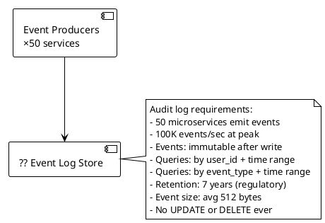

A regulatory audit log receives 100,000 immutable events per second from 50 microservices. Events are never updated or deleted. Queries filter by user_id + time range and by event_type + time range. Retention is 7 years.

**Which storage technology fits this workload?**

- A) PostgreSQL with append-only table — relational ACID, composite indexes on (user_id, timestamp) and (event_type, timestamp); needs aggressive partitioning and archival at 7-year retention
- B) Apache Cassandra — write-optimized LSM tree, partition by (user_id) or (event_type) with timestamp clustering key; time-range queries native; linear horizontal scale; compaction handles 7-year data volume
- C) MySQL with INSERT-only application pattern — works but B-tree write amplification at 100K events/sec will saturate I/O on a single node
- D) Elasticsearch — excellent for search and filtering; but primary store risk (no ACID, data loss possible without careful configuration); better used as secondary index on top of a primary store

---

### Q52. Inventory Count Under Flash Sale [★☆☆]

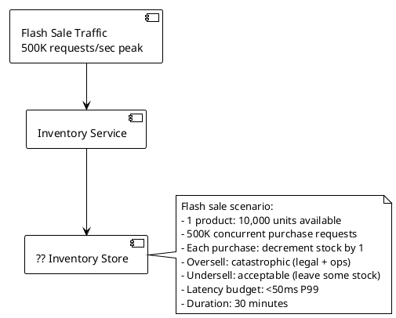

A flash sale has 10,000 units of inventory and 500,000 simultaneous purchase attempts. Overselling is not acceptable. Underselling (selling fewer than 10,000) is acceptable. Latency must be under 50ms P99.

**Which approach prevents oversell without a relational database as the bottleneck?**

- A) PostgreSQL `UPDATE inventory SET stock = stock - 1 WHERE id = ? AND stock > 0` — correct semantics, atomic; row lock contention at 500K concurrent will queue and degrade to seconds of latency
- B) Redis `DECRBY` with Lua script — atomic decrement with floor check: if current value > 0, decrement and return new value; else return 0; single-threaded Redis processes atomically; no oversell possible; <1ms per operation
- C) DynamoDB conditional write with `stock > :zero` condition expression — atomic, serverless scale; but 500K WCU/sec on one item = enormous cost spike during flash sale
- D) Optimistic locking in PostgreSQL with version field + retry — retry storms at 500K:10K contention ratio will saturate the database

---

### Q53. Geospatial Query Performance [★★☆]

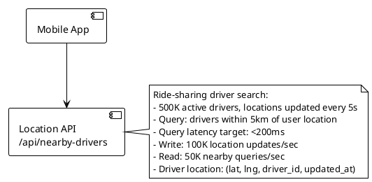

A ride-sharing app tracks 500,000 active drivers updating their location every 5 seconds. The primary query finds drivers within 5km of a given point, with a 200ms latency target.

**Which database and indexing strategy handles this geospatial workload?**

- A) PostgreSQL with PostGIS extension — `ST_DWithin` query with GIST spatial index; handles geospatial queries natively; 100K location updates/sec requires sharding or partitioning
- B) Redis GEOADD/GEORADIUS — built-in geospatial commands using sorted sets with Geohash encoding; `GEORADIUS` returns members within radius in O(N+log(M)); sub-millisecond reads; 100K writes/sec trivial for Redis cluster
- C) MongoDB with 2dsphere index — native geospatial support with `$nearSphere` query; handles both write volume and radius queries; horizontal scaling via sharding
- D) MySQL with manual bounding box query `WHERE lat BETWEEN ? AND ? AND lng BETWEEN ? AND ?` — approximates radius with bounding box; requires two-step filter; no native spatial indexing in standard MySQL

---

### Q54. Document Versioning Pattern [★★☆]

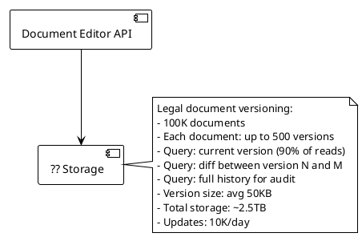

A legal document platform stores up to 500 versions per document. Most reads fetch the current version. Some reads require full version history and diffs between versions. Total storage is ~2.5TB.

**Which storage pattern correctly handles document versioning?**

- A) Single row per document, overwrite on update — fast current read, no history; violates audit requirement
- B) Append-only table: one row per version `(doc_id, version, content, created_at)` — full history, simple schema; but 100K docs × 500 versions × 50KB = 2.5TB in a single table; current version = MAX(version) query
- C) Current table + versions table: `documents(doc_id, current_content)` and `document_versions(doc_id, version, content, created_at)` — current version is O(1) lookup; history is append-only in versions table; diffs computed in application layer from two version fetches
- D) Git-style delta compression in MongoDB — store full content for latest version; store diffs for older versions as patches; reduces storage but requires replay to reconstruct historical versions

---

### Q55. Multi-Tenant Data Isolation [★★☆]

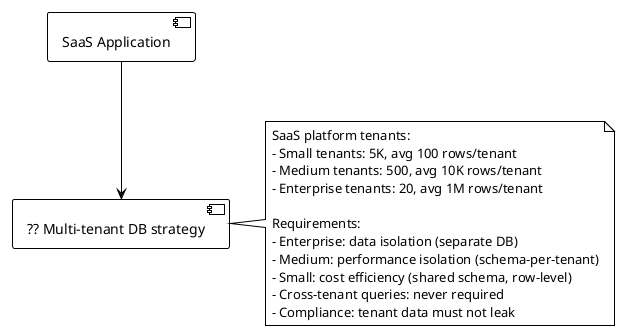

A SaaS platform serves three tiers of tenants with different isolation requirements. Enterprise tenants demand physical isolation. Small tenants require cost efficiency.

**Which multi-tenant database architecture is correct?**

- A) Shared schema (row-level isolation) for all tenants — cheapest; fails enterprise isolation requirement; shared tables mean schema changes affect all tenants simultaneously
- B) Database-per-tenant for all tenants — maximum isolation; at 5,520 tenants, managing 5,520 databases is operationally prohibitive; idle enterprise DBs for small tenants waste resources
- C) Tiered isolation: small tenants → shared schema with `tenant_id` column; medium tenants → schema-per-tenant in a shared cluster; enterprise tenants → dedicated database instance
- D) Schema-per-tenant for all tenants — medium isolation for all; enterprise requirement of "separate DB" is violated; 5,520 schemas in one PostgreSQL instance causes overhead

---

### Q56. Write Amplification in Wide-Column Store [★★★]

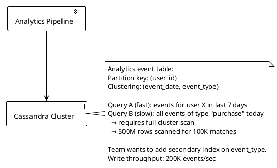

A Cassandra table partitioned by `user_id` supports fast per-user queries but requires a full cluster scan for `event_type`-based queries. The team wants to add a secondary index on `event_type`.

**What is the correct solution for Query B without degrading writes?**

- A) Add a Cassandra secondary index on event_type — secondary indexes in Cassandra are local (per node), so a query still hits all nodes; performance is marginally better than full scan; not suitable for high-cardinality, high-write columns
- B) Materialized table with (event_type) as partition key: duplicate writes to a second table `events_by_type(event_type, event_date, user_id)` — Query B becomes a native partition scan; write path sends each event to both tables (dual write); storage doubles; read performance excellent
- C) Add an Elasticsearch secondary index — sync events to Elasticsearch for event_type queries; decouples read performance from Cassandra's data model; write path unchanged; adds infrastructure
- D) Denormalize event_type into the partition key: composite partition `(user_id, event_type)` — breaks Query A (per-user queries now require knowing the event_type)

---

### Q57. Consistency Level Tradeoffs in Cassandra [★★★]

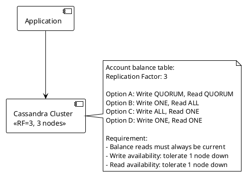

A Cassandra cluster has replication factor 3. Account balances must always return the most current value. The system must tolerate one node failure for both reads and writes.

**Which consistency level combination is correct?**

- A) Write QUORUM (2/3), Read QUORUM (2/3) — W + R > RF ensures overlap; at least one node in the read quorum has the latest write; single node failure tolerance on both paths
- B) Write ONE, Read ALL — write to one replica, read from all three; strong read consistency but read fails if any node is down; violates "tolerate 1 node down for reads"
- C) Write ALL, Read ONE — write to all three replicas, read from one; strong consistency but write fails if any node is down; violates "tolerate 1 node down for writes"
- D) Write ONE, Read ONE — fastest, least durable; no overlap guarantee; stale reads are possible; neither write nor read availability is guaranteed under node failure for consistency

---

### Q58. Time-Series Downsampling [★☆☆]

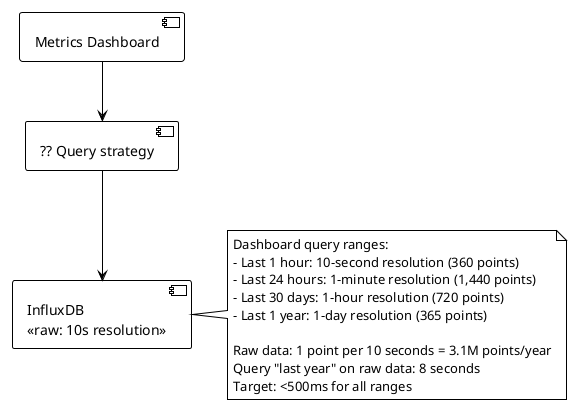

A metrics dashboard queries raw 10-second data (3.1M points/year). Querying a year of raw data takes 8 seconds. Users need four different zoom levels with sub-500ms response.

**What is the correct downsampling architecture?**

- A) Query raw data and downsample in application — correct results but 8-second query for yearly view; target violated
- B) Continuous queries / tasks in InfluxDB — define continuous queries that automatically aggregate raw data into 1-minute, 1-hour, and 1-day rollup measurements; dashboard queries the appropriate rollup based on time range; rollups are tiny (1,440/720/365 points) vs 3.1M raw; each query <50ms
- C) Increase InfluxDB instance size — more CPU speeds aggregation; 3.1M raw points still requires full scan; latency improvement is linear, not sufficient
- D) Pre-generate dashboard images on a schedule — eliminate query time; but dashboards become static, can't pan/zoom dynamically

---

### Q59. Choosing Between DynamoDB and PostgreSQL [★★☆]

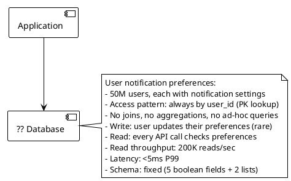

A notification preferences service has a fixed schema, serves 200,000 reads per second, always queries by user_id, and requires under 5ms P99 latency.

**DynamoDB or PostgreSQL — which fits better and why?**

- A) PostgreSQL with `user_id` as primary key, read replicas for 200K reads/sec — works; operational overhead higher; connection pool limits at 200K reads/sec require multiple nodes
- B) DynamoDB — single-digit millisecond latency by design; 200K reads/sec = 200K RCU/sec (easily provisioned or on-demand); no connection pool limits; zero schema flexibility needed (fixed schema is fine in DynamoDB); scales to 50M+ users with no operational changes
- C) Redis — sub-millisecond; but 50M users × ~200 bytes = 10GB; Redis as primary store requires persistence configuration and backup strategy that adds operational overhead compared to a purpose-built database
- D) Cassandra — overkill for a single-table, fixed-schema, key-value access pattern; linear scaling is a strength that's not needed here

---

## Topic 5: Message Queues & Event Streaming (Q60–Q74)

---

### Q60. At-Least-Once vs Exactly-Once Delivery [★☆☆]

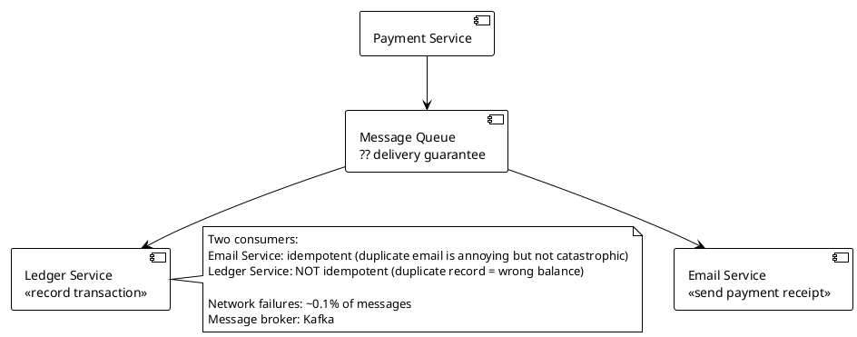

A payment system uses Kafka to fan out to an email service and a ledger service. The email service can tolerate duplicate messages. The ledger service cannot — a duplicate produces an incorrect account balance.

**What delivery and idempotency strategy is correct?**

- A) Exactly-once delivery (Kafka transactions) for both consumers — safest but Kafka transactional producers add latency overhead; overkill for the email service
- B) At-least-once delivery for both; email service accepts duplicates; ledger service uses idempotency key (payment_id) with a `processed_payments` deduplication table — check before insert; only process if payment_id not already recorded
- C) At-most-once delivery — messages may be dropped; unacceptable for either consumer (lost ledger entries = missing transactions)
- D) At-least-once for email service, at-most-once for ledger service — at-most-once risks missing ledger entries (lost payments)

---

### Q61. Kafka Partition Strategy [★★☆]

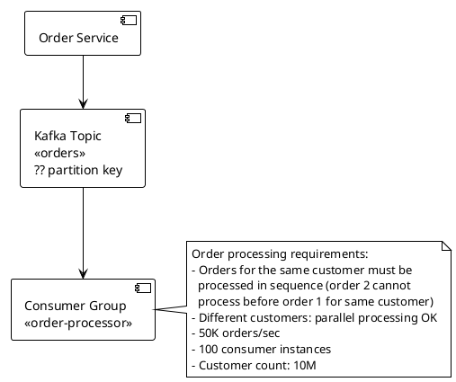

Order events must be processed in sequence per customer, but different customers can be processed in parallel. There are 10 million customers and 50,000 orders per second across 100 consumer instances.

**What is the correct Kafka partition key?**

- A) No partition key (round-robin) — distributes load evenly but orders for the same customer land on different partitions, processed by different consumers; ordering guarantee lost
- B) `customer_id` as partition key — all orders for a given customer hash to the same partition; one consumer handles that partition; per-customer ordering guaranteed; 10M customers distributed across partitions ensures even load
- C) `order_id` as partition key — random distribution, no ordering guarantee per customer; same problem as round-robin
- D) `timestamp` as partition key — chronological ordering within a partition but all orders in the same time window land on the same partition; massive hotspot; even distribution lost

---

### Q62. Dead Letter Queue Design [★☆☆]

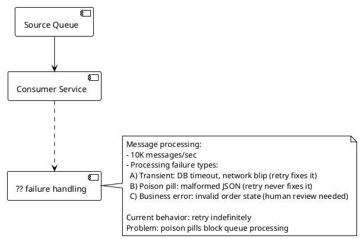

A consumer service processes 10,000 messages per second. Failures fall into three categories: transient (retry-fixable), poison pills (permanently broken), and business errors (need human review). Currently, all failures are retried indefinitely, causing poison pills to block the queue.

**What is the correct retry and DLQ architecture?**

- A) No retry — drop all failed messages; zero blocking but transient failures lose messages permanently
- B) Exponential backoff retry (3 attempts, 1s/5s/30s delays) → Dead Letter Queue after max retries — transient errors recover within 30 seconds; poison pills and business errors move to DLQ after 3 attempts; DLQ is monitored separately; queue processing unblocked
- C) Infinite retry with exponential backoff — transient errors eventually recover; poison pills retry forever (just slowly); queue eventually unblocked but DLQ never populated; no visibility into permanent failures
- D) Separate queues per failure type at publish time — requires producer to classify failures before publishing; classification can't be done before processing fails

---

### Q63. Kafka Consumer Lag Alerting [★★☆]

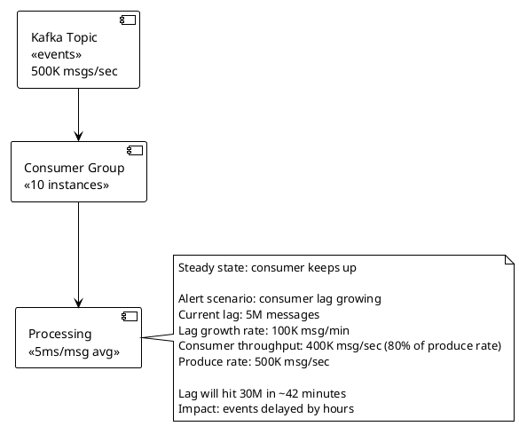

A Kafka consumer group is falling behind by 100,000 messages per minute. Consumer throughput is 400,000/sec against a produce rate of 500,000/sec. Lag will reach 30M messages in ~42 minutes, causing multi-hour delays.

**What is the correct immediate remediation and long-term fix?**

- A) Restart all consumer instances — restarts don't increase throughput if the bottleneck is processing speed, not connectivity
- B) Immediate: add consumer instances (scale out to 20) to increase throughput to match produce rate; the topic must have ≥20 partitions for this to work; long-term: profile the 5ms/msg processing bottleneck — optimize or move slow operations async
- C) Increase Kafka retention — more storage doesn't affect processing throughput; lag continues growing
- D) Reduce produce rate by throttling producers — treats the symptom (consumption gap) by reducing supply; limits system throughput and doesn't fix the underlying consumer performance issue

---

### Q64. Topic Compaction vs Retention [★☆☆]

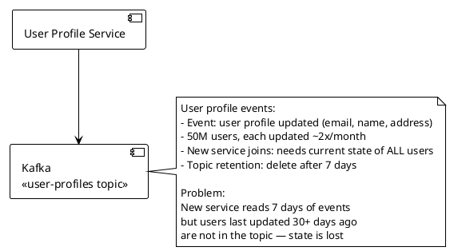

A user-profile topic uses time-based retention (7 days). A new downstream service needs the current state of all 50M users. Users updated more than 7 days ago have no events in the topic — their current state is unavailable.

**What Kafka configuration solves this?**

- A) Increase retention to 365 days — retains more history but still loses users updated >365 days ago; storage grows linearly with retention window
- B) Log compaction (`cleanup.policy=compact`) — Kafka retains the latest message for each key (user_id); old events are compacted away but the most recent update for each user is always available; new consumers read the compacted topic to get current state for all 50M users regardless of when they were last updated
- C) Snapshot the database to S3 daily; new services bootstrap from snapshot — correct but requires out-of-band bootstrap mechanism; new services can't use Kafka for initial state; operational complexity
- D) Dual-write to Kafka and a key-value store; new services read from the key-value store for initial state — correct but adds an infrastructure component that exists solely to compensate for missing log compaction

---

### Q65. Pub/Sub vs Queue for Task Distribution [★☆☆]

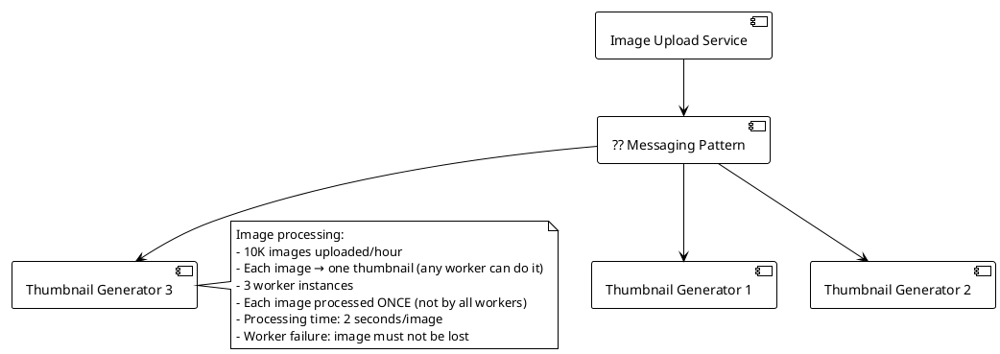

10,000 images per hour must each be thumbnailed exactly once by any one of three workers. Failed workers must not lose images.

**Pub/Sub or Queue — which is correct?**

- A) Pub/Sub — each worker receives every message; all three workers process every image; 3× wasted compute; not "processed once"
- B) Work queue (point-to-point) — each message delivered to exactly one consumer; workers compete for messages; failed message returned to queue after visibility timeout; correct pattern for task distribution
- C) Pub/Sub with deduplication logic in each worker — workers coordinate via shared state to avoid double-processing; complex, fragile, defeats the purpose of pub/sub
- D) Direct HTTP call from upload service to a worker — synchronous coupling; single worker becomes a bottleneck; no durability if the worker is down at upload time

---

### Q66. Kafka vs RabbitMQ Selection [★☆☆]

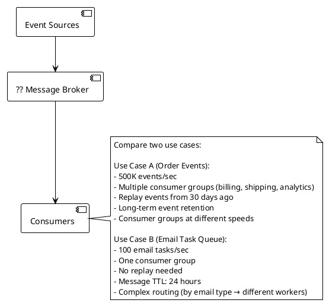

Two use cases have different messaging requirements. Match each to the correct broker.

**Which assignment is correct?**

- A) Kafka for both — Kafka handles both but RabbitMQ's routing flexibility and lower operational overhead is better suited to Use Case B
- B) Kafka for Use Case A (order events), RabbitMQ for Use Case B (email tasks) — Kafka: high throughput, multiple consumer groups at different offsets, replay; RabbitMQ: routing exchanges (topic/direct/fanout), simpler ops for low-volume task queues
- C) RabbitMQ for both — RabbitMQ cannot efficiently handle 500K events/sec with multiple consumer groups at different replay positions; throughput limit and lack of log-based storage
- D) SQS for Use Case A, SNS for Use Case B — AWS-specific; SQS lacks consumer groups with independent offsets; SNS is pub/sub not a task queue

---

### Q67. Saga Pattern for Distributed Transactions [★★☆]

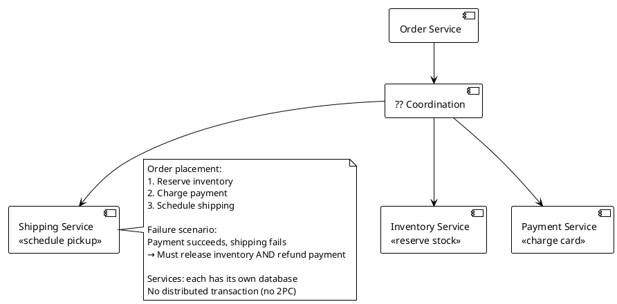

An order placement flow spans three services, each with its own database. If shipping fails after payment succeeds, inventory and payment must be rolled back without distributed transactions.

**Which Saga coordination pattern is correct for this flow?**

- A) Choreography Saga — each service publishes an event on success/failure; downstream services react; no central coordinator; can become complex to trace when failure chains are long
- B) Orchestration Saga — a central Order Saga Orchestrator issues commands to each service and handles compensating transactions on failure: `ReleaseInventory` command if payment fails, `RefundPayment` + `ReleaseInventory` commands if shipping fails; explicit failure handling in one place
- C) Two-phase commit (2PC) — requires all services to participate in a distributed transaction protocol; services with separate databases makes this impractical; coordinator failure = system-wide lock
- D) Idempotent retry until all services succeed — doesn't handle the case where one service cannot be made to succeed; without compensating transactions, partial state is permanent

---

### Q68. Outbox Pattern for Reliable Event Publishing [★★☆]

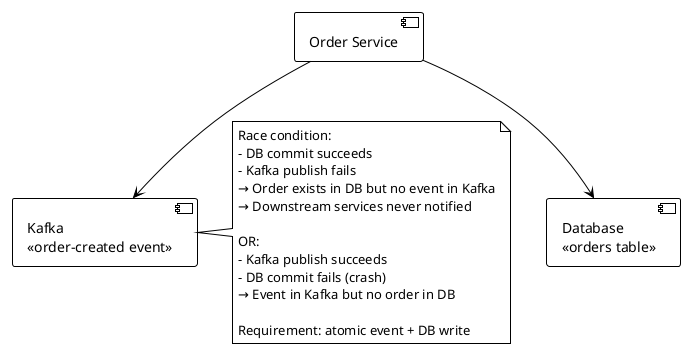

An order service must atomically write an order to the database AND publish an event to Kafka. Currently, the two operations are independent — crashes between them cause inconsistency.

**What pattern solves the dual-write atomicity problem?**

- A) Wrap DB write and Kafka publish in an application-level try/catch — catch failures and retry Kafka; doesn't help if the JVM crashes between the two operations
- B) Transactional outbox pattern — write the order AND an outbox event record in the same database transaction; a separate outbox relay process reads committed outbox records and publishes to Kafka; mark as published; atomicity guaranteed by the database transaction
- C) Kafka transactions (exactly-once semantics) — Kafka transactions ensure exactly-once delivery between topics but don't span to database writes; the DB write is still outside the Kafka transaction boundary
- D) Two-phase commit between DB and Kafka — Kafka does not support XA/2PC coordination with external databases; not practically implementable

---

### Q69. Message Ordering in Distributed Systems [★★☆]

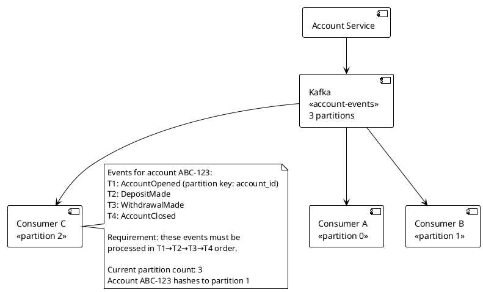

Account lifecycle events must be processed in order per account. Events for account ABC-123 all hash to partition 1. A single consumer (Consumer B) processes partition 1.

**What breaks the ordering guarantee and how do you prevent it?**

- A) Nothing breaks ordering — partition 1 is consumed by Consumer B sequentially; Kafka guarantees order within a partition; this setup is correct as designed
- B) Adding more consumers than partitions breaks ordering — if you scale to 4 consumers but only have 3 partitions, one consumer is idle; doesn't break ordering for active consumers
- C) Consumer B processing messages in parallel threads breaks ordering — if Consumer B uses a thread pool to parallelize processing within partition 1, messages for the same account may be processed out of order; solution: process sequentially within partition or use per-key thread pools where each account maps to a dedicated thread
- D) Repartitioning the topic breaks ordering — increasing partitions causes account ABC-123 to potentially hash to a different partition; in-flight messages land on partition 1 while new messages land on a different partition; consumer continuity is broken; always repartition with a migration plan

---

### Q70. Backpressure in Streaming Pipelines [★★☆]

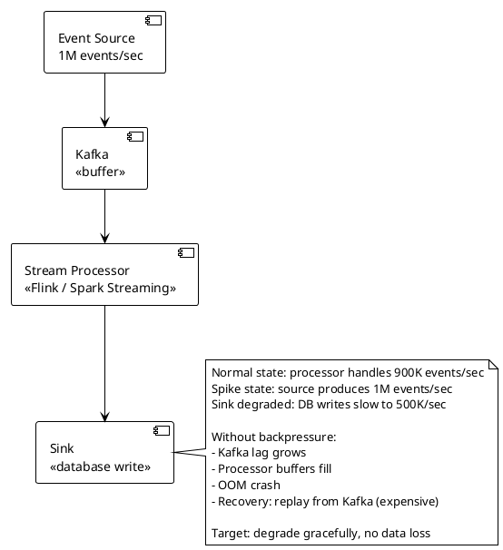

A streaming pipeline processes events from Kafka into a database. The database periodically degrades, reducing sink throughput below source rate. Without backpressure, the processor crashes from memory pressure.

**What backpressure mechanism prevents the OOM crash?**

- A) Increase Kafka retention — keeps events safe in Kafka longer; doesn't prevent OOM in the processor itself
- B) Flink's native backpressure mechanism — Flink monitors buffer fill levels at each operator; when downstream operators (sink) are slow, Flink propagates pressure upstream by slowing input consumption from Kafka (reducing poll rate); processor never buffers more than it can handle; Kafka absorbs the excess as growing lag safely
- C) Drop events when processor buffer exceeds 80% — prevents OOM but loses data; violates "no data loss" requirement
- D) Increase processor memory — buys time but doesn't address the fundamental throughput mismatch; next spike causes the same OOM

---

### Q71. Kafka Consumer Group Rebalancing [★★☆]

```plantuml
@startuml
!theme plain
skinparam backgroundColor white

[Kafka Topic\n<<24 partitions>>] --> [Consumer Group\n<<8 instances>>]

note right
  Each consumer handles 3 partitions.
  
  Rebalance triggers:
  - Consumer added/removed
  - Consumer heartbeat timeout
  - Partition reassignment
  
  Problem observed:
  During rolling deployment (replace one consumer at a time)
  each consumer restart triggers a full rebalance.
  8 consumers × 30-second rebalance = 4 minutes of
  stop-the-world pauses across the group.
  Processing halts during each rebalance.
end note
@enduml
```

A 24-partition Kafka topic is consumed by 8 instances. Rolling deployment causes a full group rebalance on each consumer restart, halting all processing for 30 seconds per restart.

**What configuration reduces rebalance impact during rolling deployments?**

- A) Increase `session.timeout.ms` to 5 minutes — longer timeout means rebalances trigger less frequently on restarts but consumers that actually crash take 5 minutes to be detected as failed; increases recovery time
- B) Cooperative incremental rebalancing (`partition.assignment.strategy=CooperativeStickyAssignor`) — instead of stopping all consumers during rebalance (eager rebalancing), cooperative rebalancing only revokes and reassigns the specific partitions that need to move; consumers not involved in the partition move continue processing; dramatically reduces stop-the-world impact
- C) Reduce consumer count to 4 — fewer consumers = fewer restarts during rolling deploy; but each consumer handles 6 partitions; rebalance overhead per event is similar
- D) Deploy all consumers simultaneously instead of rolling — eliminates the multiple rebalances; but increases risk (all consumers down at once if deployment fails)

---

### Q72. Event Sourcing vs Message Queue [★★☆]

```plantuml
@startuml
!theme plain
skinpantic backgroundColor white

[Command] --> [?? System]

note right
  Compare two needs:
  
  Need A: Order fulfillment pipeline
  - Order created → pick → pack → ship
  - Each step notifies the next
  - No need to replay history
  - At-least-once delivery fine
  
  Need B: Account balance system
  - Every debit/credit must be audited
  - "What was balance on date X?" required
  - New reporting service needs full history
  - Replay all events to rebuild state
end note
@enduml
```

Two systems have different event handling needs. Match each to the correct pattern.

**Which assignment is correct?**

- A) Message queue for both — queues delete messages after consumption; Need B loses history; replay impossible after consumption
- B) Message queue (RabbitMQ/SQS) for Need A; Event store (EventStoreDB / Kafka with compaction) for Need B — pipeline steps are fire-and-forget workflow; account events need durable, replayable, append-only log
- C) Event sourcing for both — event sourcing for a sequential pipeline adds unnecessary complexity; each step must project state from events rather than simply receiving a task
- D) Shared Kafka topic for both — Kafka with long retention handles both; but without compaction, Need B's state reconstruction requires replaying unbounded history

---

### Q73. SQS vs SNS vs EventBridge [★★☆]

```plantuml
@startuml
!theme plain
skinparam backgroundColor white

[Order Placed\nevent source] --> [?? AWS messaging]
[?? AWS messaging] --> [Email Service\n<<send confirmation>>]
[?? AWS messaging] --> [Inventory Service\n<<reserve stock>>]
[?? AWS messaging] --> [Analytics Service\n<<log for reporting>>]
[?? AWS messaging] --> [Fraud Service\n<<risk check>>]

note right
  Requirements:
  - Each service receives every order event
  - Services process independently
  - Retry on failure (per service)
  - New services can subscribe without modifying producer
  - Different services need different filtering:
    Fraud: only orders > $500
    Analytics: all orders
  
  AWS cloud platform
end note
@enduml
```

An order event must be delivered to 4 different AWS services, each independently. Each service needs its own retry queue. New services should be addable without changing the order service.

**Which AWS architecture is correct?**

- A) SQS only — one queue, all consumers compete for messages; each consumer reads each message once (not the behavior needed — each service must receive every message)
- B) SNS topic → SQS queue per service — SNS fans out to multiple SQS queues (one per service); each service reads from its own queue; SQS provides retry, DLQ, and independent processing; SNS supports subscription filter policies (Fraud service: `amount > 500` filter); adding new service = add new SQS subscription; correct AWS-native pattern
- C) EventBridge — correct and more flexible for complex routing/filtering; higher operational complexity and cost than SNS+SQS for this straightforward fan-out pattern; overkill here unless event schema versioning or multiple event buses are needed
- D) SQS FIFO with message groups per service — FIFO queues provide ordering; multiple consumers on one queue still share messages; doesn't provide per-service independent delivery

---

### Q74. Kafka Exactly-Once Semantics [★★☆]

```plantuml
@startuml
!theme plain
skinparam backgroundColor white

[Payment Processor] --> [Kafka Producer\n<<transactions topic>>]
[Kafka Producer\n<<transactions topic>>] --> [Ledger Consumer\n<<balance update>>]

note right
  Payment processing:
  - Producer may retry on network timeout
  - Consumer may reprocess after crash
  - Without EOS: network timeout → producer retries
    → duplicate transaction in Kafka
    → ledger debited twice
  
  Requirement: each payment
  processed exactly once in the ledger
end note
@enduml
```

A payment processor uses Kafka. Network retries can cause duplicate messages at the producer. Consumer crashes can cause reprocessing. The ledger must process each payment exactly once.

**What combination achieves exactly-once semantics?**

- A) Producer idempotence only (`enable.idempotence=true`) — prevents producer-side duplicates from retries; but consumer-side reprocessing after crash still causes duplicate ledger entries
- B) Idempotent producer + consumer-side idempotency key (payment_id in deduplication table) — handles both producer retries and consumer reprocessing independently; simpler than Kafka transactions
- C) Kafka Transactions (`transactional.id`, `isolation.level=read_committed`) — producer atomically writes to Kafka topic; consumer reads only committed transactions; combined with consumer offset commit in the same transaction (read-process-write atomicity); true end-to-end EOS within Kafka; more complex but strongest guarantee
- D) Synchronous acknowledgment with `acks=all` + `retries=0` — `acks=all` ensures durability; `retries=0` prevents producer retries (at-most-once, not exactly-once); message lost on transient failure = worse outcome

---

## Topic 6: Microservices vs Monolith (Q75–Q86)

---

### Q75. When to Stay Monolith [★☆☆]

```plantuml
@startuml
!theme plain
skinparam backgroundColor white

[Startup] --> [?? Architecture]

note right
  Context:
  - Team: 4 engineers
  - Product: B2B SaaS MVP, 6 months old
  - Users: 50 paying customers
  - Domain: complex, still evolving weekly
  - Deployments: twice per week
  - Current: monolith in Spring Boot
  - CTO wants to "start breaking into microservices now
    before it's too late"
end note
@enduml
```

A 4-person startup with 50 customers is considering migrating their 6-month-old Spring Boot monolith to microservices. The domain model is still evolving rapidly.

**What is the correct architectural decision?**

- A) Migrate to microservices now — avoids future "big bang" migration; organizational complexity matches team size poorly but better early than late
- B) Stay monolith — 4 engineers cannot effectively operate distributed systems (service discovery, distributed tracing, inter-service authentication, independent deployments, network failure handling); domain model instability makes service boundaries premature; extract services only after boundaries stabilize; the "modular monolith" is the correct intermediate step
- C) Migrate the most complex domain (billing) to a microservice first — partial migration with an immature domain model creates the worst outcome: all microservice complexity with no stable boundary; billing is the worst starting point (highest coupling)
- D) Use a serverless architecture instead — FaaS doesn't eliminate service boundaries; it shifts the distributed systems complexity to function choreography; doesn't solve the boundary stability problem

---

### Q76. Service Boundary Identification [★★☆]

```plantuml
@startuml
!theme plain
skinparam backgroundColor white

[E-Commerce Monolith] --> [?? Service Decomposition]

note right
  Monolith modules (candidate service boundaries):
  A) User accounts + authentication
  B) Product catalog + search
  C) Shopping cart + checkout
  D) Order management + fulfillment
  E) Payment processing
  F) Notification (email/SMS)
  G) Reporting + analytics
  H) Inventory management
  
  Problem: monolith has 15 developers,
  deploys are risky (whole app per deployment),
  payment team wants PCI-DSS isolation
end note
@enduml
```

A monolith with 15 developers and deployment risk wants to decompose into services. Payment needs PCI-DSS isolation. Reporting queries span multiple domains.

**Which decomposition strategy is correct as a first step?**

- A) Extract all 8 modules simultaneously — "big bang" migration; high risk, all services need to be stable before any can go live; teams blocked on shared integration work
- B) Extract Payment (E) first — PCI-DSS compliance is a business requirement driving this; smallest blast radius (payment is well-bounded, has a clear API); security audit of extracted service is manageable; establishes microservice patterns for the team before tackling more complex extractions
- C) Extract Reporting (G) first — low risk because it's read-only; good for learning patterns but doesn't address the PCI-DSS requirement or reduce deployment risk for core services
- D) Extract User Auth (A) first — authentication is called by every other service; extracting it first creates a synchronous dependency on a new service for every request; highest blast radius if it fails; wrong starting point

---

### Q77. Strangler Fig Pattern [★★☆]

```plantuml
@startuml
!theme plain
skinparam backgroundColor white

[Client Traffic] --> [?? Routing Layer]
[?? Routing Layer] --> [Legacy Monolith\n<<all routes>>]
[?? Routing Layer] --> [New Product Service\n<<in progress>>]

note right
  Migration strategy:
  - Legacy monolith: cannot be modified safely
  - Team builds new Product Service separately
  - Goal: migrate /api/products/** traffic
    from monolith to new service
  - Rollback: must be instant if new service fails
  - Duration: 3-month migration
end note
@enduml
```

A team is migrating product endpoints from a legacy monolith to a new service using the Strangler Fig pattern. The monolith cannot be safely modified. Rollback must be instant.

**How is the Strangler Fig pattern correctly implemented here?**

- A) Deploy new service, update all clients to call it directly — requires coordinating all client changes; rollback means updating all clients again; not instant
- B) Introduce a routing proxy (Nginx, API Gateway, or facade service) in front of both systems — new product service is built and tested; when ready, proxy routes `/api/products/**` to new service (single config change); all other routes still go to monolith; rollback = revert proxy config (seconds); monolith untouched throughout
- C) Run both monolith and new service simultaneously writing to the same database — shared database creates tight coupling between old and new; schema changes in new service break monolith; worst of both worlds
- D) Feature flag inside monolith routing to new service — requires modifying the monolith (explicitly stated as not safely modifiable)

---

### Q78. Inter-Service Communication Pattern [★☆☆]

```plantuml
@startuml
!theme plain
skinparam backgroundColor white

[Order Service] --> [?? Communication]
[?? Communication] --> [Inventory Service]
[?? Communication] --> [Notification Service]

note right
  Order placement actions:
  - Check inventory: MUST succeed before order (synchronous)
  - Send confirmation email: fire-and-forget (async OK)
  - Update analytics: best-effort, not critical
  
  Inventory Service SLA: 99.9% (10min/month downtime)
  Notification Service: tolerate 1-hour delay
end note
@enduml
```

An order placement flow has three downstream actions with different consistency and availability requirements.

**What communication pattern correctly handles each action?**

- A) Synchronous REST for all three — Order Service is coupled to all three; if Notification Service is slow, order placement is slow; notification delay cascades to order latency
- B) Synchronous REST for inventory check; async message queue (Kafka/SQS) for notification and analytics — inventory check requires a synchronous answer (in-stock or not) before proceeding; notification and analytics are decoupled via queue; Notification Service slowness doesn't affect order placement latency
- C) Async message queue for all three — inventory check via async queue means the order service doesn't know if inventory is available when it acknowledges the order; oversell risk
- D) Synchronous REST for inventory; synchronous REST for notification; async for analytics — notification failure blocks order placement; not acceptable for a fire-and-forget action

---

### Q79. Service Mesh vs API Gateway [★★☆]

```plantuml
@startuml
!theme plain
skinparam backgroundColor white

[External Client] --> [?? Entry Point]
[?? Entry Point] --> [Service A]
[?? Entry Point] --> [Service B]
[Service A] --> [Service C\n<<internal>>]
[Service B] --> [Service C\n<<internal>>]

note right
  Two distinct needs:
  
  North-South (external → cluster):
  - Auth, rate limiting, TLS termination
  - Single public entry point
  - API versioning
  
  East-West (service → service):
  - mTLS between services
  - Circuit breaking
  - Distributed tracing
  - Retry policies
end note
@enduml
```

A microservices platform has both external traffic (north-south) and internal service-to-service traffic (east-west) requiring different policies.

**What is the correct tool assignment?**

- A) API Gateway for both north-south and east-west — API Gateways route external traffic centrally; routing ALL internal traffic through a central API gateway creates a bottleneck and single point of failure for internal calls
- B) API Gateway for north-south (external traffic); Service Mesh (Istio/Linkerd) for east-west (internal traffic) — distinct tools for distinct concerns; API Gateway handles auth, rate limiting, and public API versioning; Service Mesh handles per-service mTLS, retries, circuit breaking, and tracing via sidecars without a central bottleneck
- C) Service Mesh for both — service meshes handle east-west natively; north-south through a service mesh ingress is valid but lacks the API management features (developer portal, API keys, versioning, billing) of a purpose-built API Gateway
- D) Load balancer for both — L4/L7 load balancers handle traffic distribution; they don't provide mTLS, circuit breaking, or distributed tracing natively

---

### Q80. Circuit Breaker Implementation [★★☆]

```plantuml
@startuml
!theme plain
skinparam backgroundColor white

[Order Service] --> [Circuit Breaker\n?? state]
[Circuit Breaker\n?? state] --> [Payment Service\n<<50% error rate>>]

note right
  Payment Service behavior:
  - Normal: 20ms avg, <0.1% error rate
  - Degraded: 5-second timeout, 50% errors
  - Recovery: gradual (5 min to stabilize)
  
  Without circuit breaker:
  - Order Service threads block for 5 seconds
  - Thread pool exhaustion in 30 seconds
  - Order Service crashes (cascading failure)
  
  Goal: fail fast when Payment Service is degraded
end note
@enduml
```

The Payment Service is degrading with 50% error rate and 5-second timeouts. Without a circuit breaker, Order Service threads exhaust, causing cascading failure.

**What circuit breaker configuration is correct?**

- A) Resilience4j with: threshold=50% errors over 10 calls → OPEN; wait 30s → HALF-OPEN; allow 3 test calls; if 2/3 succeed → CLOSED — opens quickly when errors hit threshold; waits 30 seconds before attempting recovery; HALF-OPEN probes with limited calls before full recovery
- B) Retry with exponential backoff only — retries amplify load on a degraded service; at 5-second timeouts × retries, thread exhaustion accelerates; retries are the wrong tool for sustained degradation
- C) Timeout only (set to 200ms) — prevents thread blocking but doesn't stop requests to a failing service; still sends 100% of traffic to the failing Payment Service; overload continues
- D) Service discovery health check removal — removing Payment Service from discovery stops all calls (including successful ones); binary kill switch, no graceful degradation

---

### Q81. Data Consistency Across Services [★★☆]

```plantuml
@startuml
!theme plain
skinparam backgroundColor white

[User Service\n<<PostgreSQL>>] --> [?? Sync mechanism]
[?? Sync mechanism] --> [Recommendation Service\n<<needs user preferences>>]
[?? Sync mechanism] --> [Search Service\n<<needs user history>>]
[?? Sync mechanism] --> [Analytics Service\n<<needs user events>>]

note right
  User data needed by 3 services:
  - Recommendation: user preferences (lag OK: 5 min)
  - Search: user history (lag OK: 1 min)
  - Analytics: user events (lag OK: 5 min)
  
  Anti-pattern in use:
  Services query User Service REST API directly
  → User Service has 3K external reads/sec
  → 80% of User Service load is from other services
end note
@enduml
```

The User Service is overwhelmed because 3 other services query it directly via REST, contributing 80% of its load.

**What data distribution pattern eliminates the direct query coupling?**

- A) Add more User Service instances — scales the symptom; other services still depend on User Service for every request; operational cost grows linearly with consuming service traffic
- B) Each consuming service maintains its own local copy of needed user data, updated via User Service events (CDC or domain events) — Recommendation Service subscribes to user-preference-updated events, maintains its own preference cache; Search Service maintains its own history projection; decoupled, no synchronous calls, lag within acceptable window per service
- C) Shared User database — consuming services query the database directly; eliminates REST coupling but creates schema coupling; User Service schema changes break other services
- D) GraphQL federation — consuming services query User Service via GraphQL; reduces some over-fetching but doesn't eliminate synchronous dependency; User Service load pattern unchanged

---

### Q82. Distributed Tracing Setup [★★☆]

```plantuml
@startuml
!theme plain
skinparam backgroundColor white

[Client] --> [API Gateway]
[API Gateway] --> [Order Service]
[Order Service] --> [Inventory Service]
[Order Service] --> [Payment Service]
[Payment Service] --> [Fraud Service]

note right
  Support ticket:
  "Order #12345 took 8 seconds. Why?"
  
  Current state: each service logs independently.
  Can't correlate logs across services.
  Can't identify which service caused the 8-second delay.
  
  5 services, 4 teams, 3 languages (Java, Go, Python)
end note
@enduml
```

An 8-second order request spans 5 services in 3 languages. Without distributed tracing, the slow service cannot be identified.

**What distributed tracing setup is correct?**

- A) Centralized logging (ELK stack) with `order_id` in every log line — helps correlate logs for a known order_id; but doesn't show timing, causality, or which service contributed to the 8-second delay
- B) OpenTelemetry (language-agnostic SDK) for trace context propagation in all 5 services → Jaeger or Zipkin as tracing backend — trace_id generated at API Gateway, propagated via HTTP headers (W3C traceparent); each service creates spans; Jaeger renders the full trace as a waterfall; instantly shows which service caused the 8-second delay and what it was doing
- C) Service-specific APM tools (Datadog for Java, Prometheus for Go, New Relic for Python) — per-service visibility but no cross-service trace correlation; three separate tools for a single request trace
- D) Add timing logs at start and end of each service — shows each service's own duration but not the call chain; parallel vs sequential calls are ambiguous; doesn't attribute latency to the correct node in the call graph

---

### Q83. API Versioning in Microservices [★★☆]

```plantuml
@startuml
!theme plain
skinparam backgroundColor white

[Mobile App v1.x] --> [User Service\n/api/v1/users]
[Mobile App v2.x] --> [User Service\n/api/v?/users]
[Web App] --> [User Service\n/api/v?/users]

note right
  Breaking change: v2 removes "username" field,
  renames to "handle"
  
  - Mobile v1.x: must keep receiving "username"
  - Mobile v2.x: expects "handle"
  - Web App: always on latest
  - Mobile v1.x apps cannot be force-upgraded
    (users must manually update from App Store)
  - Support window: v1 API for 18 months
end note
@enduml
```

A breaking API change must support v1 mobile clients for 18 months alongside v2 clients.

**What versioning strategy handles coexisting client versions?**

- A) URL path versioning (`/api/v1/` and `/api/v2/`) — explicit, visible, easily routable at the API Gateway; v1 returns `username`, v2 returns `handle`; clients control their version; supports parallel versions indefinitely; 18-month deprecation window is manageable
- B) Header versioning (`Accept: application/vnd.api.v2+json`) — correct but requires client headers to be set precisely; mobile apps often don't manage custom headers well; harder to test in browsers; less visible in logs
- C) Consumer-driven contracts with Pact — useful for testing compatibility between known services; doesn't solve the problem of unknown mobile app versions in the wild that cannot be updated
- D) Single endpoint, backwards-compatible field additions only — adding `handle` alongside `username` works for additions; but the change described is a rename (rename = breaking); maintaining both fields permanently is technical debt

---

### Q84. Service Discovery [★☆☆]

```plantuml
@startuml
!theme plain
skinparam backgroundColor white

[Order Service] --> [?? Discovery]
[?? Discovery] --> [Inventory Service\n<<3 instances, IPs change>>]
[?? Discovery] --> [Payment Service\n<<2 instances, IPs change>>]

note right
  Infrastructure: Kubernetes
  Services: auto-scale (instances added/removed)
  IPs: change on pod restart
  
  Order Service needs to call Inventory and Payment
  without hardcoded IPs.
  
  How does Order Service find current instances?
end note
@enduml
```

On Kubernetes, service instances scale dynamically and IPs change on pod restart. The Order Service must discover current instances without hardcoded IPs.

**What service discovery mechanism is correct for Kubernetes?**

- A) Hardcode IP addresses in config — IPs change on pod restart; every restart requires config update and redeploy; not viable
- B) Kubernetes Service (ClusterIP) + DNS — each service gets a stable DNS name (e.g., `inventory-service.default.svc.cluster.local`); kube-proxy load-balances traffic to healthy pods; Order Service calls the DNS name; pod IP changes are transparent; standard Kubernetes-native pattern
- C) Client-side service discovery with Eureka (Netflix OSS) — valid for Spring Cloud outside Kubernetes; redundant when Kubernetes Service DNS already provides discovery; adds infrastructure (Eureka server) for a problem Kubernetes already solves
- D) Direct pod IP lookup via Kubernetes API — works but requires Kubernetes RBAC permissions and API calls on every request; fragile; correctly abstracted by Kubernetes Service

---

### Q85. Bulkhead Pattern [★☆☆]

```plantuml
@startuml
!theme plain
skinparam backgroundColor white

[API Server\n<<single thread pool: 200>>] --> [Premium API\n<<P99: 100ms>>]
[API Server\n<<single thread pool: 200>>] --> [Bulk Export API\n<<P99: 30 seconds>>]

note right
  Problem observed:
  - 50 concurrent bulk export requests
  - Each holds a thread for 30 seconds
  - 50 threads consumed → 150 remaining
  - Traffic spike: 200 premium requests
  - 150 available < 200 needed
  - Premium API requests queue, timeout
  - SLA violation on premium tier
end note
@enduml
```

Bulk export requests hold threads for 30 seconds. A concurrent traffic spike causes premium API requests to queue behind bulk exports, violating the premium SLA.

**What pattern prevents bulk exports from starving premium requests?**

- A) Rate-limit bulk exports to 10 concurrent — helps but still shares the thread pool; premium requests can still be starved if premium traffic spikes while 10 bulk exports run
- B) Bulkhead pattern: separate thread pools for premium API (150 threads) and bulk export (50 threads) — bulk exports can consume their entire 50-thread pool without affecting the 150-thread premium pool; premium requests are isolated; both pools can be independently tuned with Resilience4j `ThreadPoolBulkhead`
- C) Queue bulk export requests asynchronously — reduces thread holding time for bulk endpoints; correct improvement but without a separate pool, the async coordination still shares resources at some layer
- D) Scale horizontally — add more API servers; doesn't address the resource contention within a single server; bulk exports on the new server still starve premium requests there

---

### Q86. Microservice Testing Strategy [★★☆]

```plantuml
@startuml
!theme plain
skinparam backgroundColor white

[Test Suite] --> [?? Test types]

note right
  Testing pyramid for microservices:
  
  Order Service calls:
  - Inventory Service (REST)
  - Payment Service (REST)
  - Kafka (produces events)
  
  Goal: catch integration regressions
  without full end-to-end environment.
  
  Full E2E environment: takes 45 minutes
  to provision, flaky (20% failure rate).
end note
@enduml
```

An order service integrates with two downstream REST services and Kafka. The full E2E environment is slow (45 min) and flaky (20% failure rate).

**What testing strategy catches integration regressions without full E2E?**

- A) Unit tests only — fast but don't catch contract changes between services; if Inventory Service changes its response schema, unit tests pass but runtime fails
- B) Unit tests + contract tests (Pact) — Order Service defines consumer contracts for Inventory and Payment APIs; each service verifies it satisfies consumer contracts in their own CI; catches breaking schema changes without deploying all services; Kafka interactions tested with embedded Kafka; E2E reserved for smoke tests post-deploy
- C) Integration tests against deployed staging environment — catches real integration issues; but inherits the 45-minute provisioning and 20% flakiness; defeats the goal
- D) Mock all external services in unit tests — mocks replicate current behavior but diverge as real services evolve; contract drift undetected; same problem as pure unit tests for catching schema changes

---

## Topic 7: API Design (Q87–Q101)

---

### Q87. REST vs gRPC Selection [★☆☆]

```plantuml
@startuml
!theme plain
skinparam backgroundColor white

[Service A] --> [?? Protocol]
[?? Protocol] --> [Service B]

note right
  Compare two scenarios:

  Scenario A: Mobile app ↔ Backend API
  - Clients: iOS, Android, Web browser
  - Operations: CRUD on user resources
  - Payload: JSON, avg 2KB
  - Latency budget: 200ms
  - Discoverability: important (public API docs)

  Scenario B: Internal microservice ↔ microservice
  - Java backend → Python ML service
  - 50K calls/sec
  - Payload: float arrays (embedding vectors, 4KB)
  - Latency budget: 10ms
  - Strongly typed contract required
end note
@enduml
```

Two integration scenarios have different client types and performance requirements.

**Which protocol fits each scenario?**

- A) REST (JSON/HTTP) for both — REST is universally compatible; 50K calls/sec at 10ms with JSON serialization overhead on 4KB float arrays adds ~2ms serialization latency per call; manageable but suboptimal
- B) REST for Scenario A; gRPC for Scenario B — REST: browser/mobile compatible, JSON, self-documenting via OpenAPI; gRPC: binary protobuf (3-5× smaller than JSON, faster serialization), HTTP/2 multiplexing, strongly typed proto contracts, code generation in any language; correct match for each use case
- C) gRPC for both — gRPC is not natively supported in browsers without a proxy (grpc-web); mobile gRPC requires additional client libraries; REST's human-readability and tooling ecosystem matters for public/mobile APIs
- D) GraphQL for both — GraphQL suits flexible client-driven queries; the internal ML service scenario benefits more from strongly-typed binary protobuf than flexible query language; GraphQL overhead for simple RPC calls is unnecessary

---

### Q88. GraphQL vs REST for Mobile [★☆☆]

```plantuml
@startuml
!theme plain
skinparam backgroundColor white

[Mobile App] --> [?? API]
[?? API] --> [Backend Services]

note right
  Mobile API requirements:
  - iOS and Android clients with different screen sizes
  - iOS home screen: needs user + last 3 orders + notifications
  - Android home screen: needs user + 5 recommendations
  - Current REST: 3 separate API calls for iOS home
  - Network: mobile (variable latency, limited bandwidth)
  - Over-fetching: REST returns 20 fields, mobile uses 5
end note
@enduml
```

Mobile clients require different data combinations per screen. REST causes over-fetching and multiple round-trips on mobile networks.

**What API approach solves the mobile data fetching problem?**

- A) REST with a dedicated BFF (Backend for Frontend) — create iOS-specific and Android-specific REST endpoints that return exactly the data each client needs; eliminates over-fetching and multiple round-trips; correct but requires maintaining two BFF endpoint sets as clients evolve
- B) GraphQL — clients specify exactly what fields they need; iOS queries `{ user { name } orders(limit: 3) { id, total } notifications { unread } }`; Android queries `{ user { name } recommendations(limit: 5) { productId } }`; single endpoint, eliminates over-fetching, single round-trip per screen; client schema changes don't require backend changes
- C) REST with field filtering (`?fields=name,email`) — some REST APIs support field selection; reduces over-fetching but doesn't eliminate multiple round-trips; non-standard, requires per-endpoint implementation
- D) gRPC with server streaming — streaming is for server-push scenarios; mobile home screen data is a single request/response; streaming adds complexity without benefit here

---

### Q89. API Pagination Strategy [★☆☆]

```plantuml
@startuml
!theme plain
skinparam backgroundColor white

[API Client] --> [GET /api/orders?page=?&limit=100]

note right
  Order list pagination:
  - Total orders: 50M rows
  - Page size: 100 rows
  - Offset pagination: LIMIT 100 OFFSET 5000000
  - Query time at offset 5M: 45 seconds
    (DB must scan 5M rows to find offset)
  - Real-time inserts: 5K orders/sec
  - Page drift: records shift between pages
    as new orders are inserted
end note
@enduml
```

Offset-based pagination (`LIMIT 100 OFFSET N`) takes 45 seconds at large offsets because the database scans all N rows. New inserts also cause page drift (records appearing twice or being skipped).

**What pagination strategy solves both problems?**

- A) Offset pagination with a larger page size — reduces total requests; each large-offset request is still slow; doesn't fix drift
- B) Keyset (cursor) pagination — use the last record's `id` or `created_at` as the cursor: `WHERE id > :cursor ORDER BY id LIMIT 100`; B-tree index lookup on id is O(log N) regardless of offset position; no page drift (cursor anchors to a specific record); ideal for large datasets with real-time inserts
- C) Page number + total count caching — cache the total count and page boundaries; invalidated by every insert (5K/sec); cache thrashing; drift still occurs
- D) Elasticsearch for pagination — correctly handles large result set pagination with `search_after`; adding an Elasticsearch cluster for pagination alone is over-engineering if the primary store is relational

---

### Q90. Rate Limiting Algorithm Selection [★☆☆]

```plantuml
@startuml
!theme plain
skinparam backgroundColor white

[API Clients] --> [Rate Limiter\n?? algorithm]
[Rate Limiter\n?? algorithm] --> [API Server]

note right
  API rate limiting requirements:
  
  Case A: Public API, free tier
  - Limit: 1,000 requests/hour per API key
  - Burst: allow up to 50 req/sec briefly
  - No hard per-second limit enforced
  
  Case B: Payment API, fraud prevention
  - Limit: 10 transactions/second per user
  - Hard limit: never allow >10/sec even briefly
  - Burst: must be suppressed
end note
@enduml
```

Two rate limiting scenarios have different burst tolerance requirements.

**Which algorithm fits each case?**

- A) Token bucket for both — token bucket allows bursting up to bucket size; Case B's hard limit requirement means bursting must be suppressed; token bucket allows short bursts above the nominal rate
- B) Token bucket for Case A (allows burst within hourly limit); sliding window or fixed window with no burst allowance for Case B (hard per-second limit, no burst) — token bucket naturally accumulates tokens for bursty public API usage; sliding window counts requests in a rolling 1-second window without burst credit
- C) Fixed window counter for both — resets at window boundary; traffic can double at window boundaries (burst at end of one window + burst at start of next); insufficient for Case B's hard limit
- D) Leaky bucket for both — leaky bucket smooths traffic to a constant rate; correct for Case B but excessively strict for Case A where natural bursts within the hourly limit should be allowed

---

### Q91. API Gateway Authentication Flow [★★☆]

```plantuml
@startuml
!theme plain
skinparam backgroundColor white

[Client] --> [API Gateway]
[API Gateway] --> [Auth Service\n<<JWT validation>>]
[API Gateway] --> [Service A]
[API Gateway] --> [Service B]

note right
  Authentication options:
  
  Option A: API Gateway validates JWT on every request
  → calls Auth Service per request
  → 200K req/sec = 200K Auth Service calls/sec
  
  Option B: API Gateway validates JWT locally
  (verify signature with public key)
  → no Auth Service call per request
  → revoked tokens valid until JWT expiry
  
  JWT expiry: 1 hour
  Token revocation requirement: immediate
end note
@enduml
```

JWT validation choices trade off latency/scalability against revocation capability.

**What authentication architecture meets immediate revocation with high throughput?**

- A) Full Auth Service call per request — real-time revocation; but 200K req/sec → Auth Service becomes a bottleneck and single point of failure
- B) Local JWT signature validation at gateway + short-lived JWT (5-minute expiry) + token refresh — gateway validates signature locally (no Auth Service call); revoked tokens remain valid for up to 5 minutes (acceptable for most threat models); refresh tokens are checked against Auth Service on each 5-minute renewal; balances throughput with revocation window
- C) Local JWT validation with 1-hour expiry + Redis revocation cache at gateway — gateway checks JWT signature (no network call) and then checks a Redis `revoked_tokens` set (1 cache lookup); revocation is immediate (add to Redis set); Auth Service updates Redis on logout/revoke; throughput scales with Redis cluster; correct architecture for immediate revocation + high throughput
- D) No JWT — session cookie validated against session store per request — correct but moves the scalability problem from Auth Service to session store; Redis session store at 200K reads/sec is viable but requires careful scaling

---

### Q92. WebSocket vs Server-Sent Events vs Long Poll [★☆☆]

```plantuml
@startuml
!theme plain
skinparam backgroundColor white

[Server] --> [?? Push mechanism]
[?? Push mechanism] --> [Browser Client]

note right
  Compare three use cases:

  Use Case A: Live sports score updates
  - Server → client only (scores update automatically)
  - Browser client
  - 500K concurrent viewers
  - Update frequency: ~5 updates/minute per game

  Use Case B: Collaborative document editor
  - Both directions: client sends edits, server pushes other users' edits
  - Real-time: <50ms latency
  - 10K concurrent editors per document

  Use Case C: Order status tracking page
  - Server → client only
  - Update frequency: 3-5 updates per order (hours)
  - 1M concurrent tracking pages
end note
@enduml
```

Three real-time communication scenarios have different directionality and frequency requirements.

**Match each use case to the correct protocol.**

- A) WebSocket for all three — WebSocket works for all cases but is overkill for Cases A and C (server → client only); WebSocket connections are more expensive than SSE for unidirectional use
- B) SSE for Case A; WebSocket for Case B; Long Polling for Case C — SSE: simple unidirectional HTTP/2 stream, auto-reconnect, firewall-friendly (HTTP), 500K connections feasible; WebSocket: bidirectional, low latency for collaborative editing; Long Poll: infrequent updates over hours, most efficient for "check occasionally" pattern at 1M connections
- C) Long Poll for Case A; WebSocket for Case B; SSE for Case C — long poll is inefficient for 5 updates/minute at 500K viewers (high connection re-establishment overhead); SSE is more efficient for Case C than suggested
- D) WebSocket for Case A; gRPC streaming for Case B; WebSocket for Case C — gRPC streaming is valid but not browser-native without grpc-web proxy; WebSocket for Case C at 1M connections is expensive for 3-5 updates over hours

---

### Q93. Idempotency Keys in REST APIs [★☆☆]

```plantuml
@startuml
!theme plain
skinparam backgroundColor white

[Client] --> [POST /api/payments\nIdempotency-Key: uuid]
[POST /api/payments\nIdempotency-Key: uuid] --> [Payment Service]

note right
  Problem: network timeout on payment creation
  Client: retries POST /api/payments
  Without idempotency: duplicate payment charged
  
  Idempotency-Key: client-generated UUID
  Key TTL: 24 hours
  
  Scenario: client retries 3× (all within 1 minute)
  Expected: charge happens exactly once
end note
@enduml
```

A payment API must handle client retries without processing payments twice. The client generates a UUID idempotency key and sends it on every retry.

**How is server-side idempotency correctly implemented?**

- A) Check if payment_id exists before creating — payment_id is assigned by the server after creation; it doesn't exist on the first attempt; can't be used as pre-check
- B) Store the idempotency key + response in a database before processing; on retry with same key, return stored response immediately without reprocessing — first request: check key (miss) → process payment → store `{key: uuid, response: 201_created, payment_id: xyz}` → return response; retry: check key (hit) → return stored 201_created response; same response every time, charge happens once
- C) Use database unique constraint on idempotency_key column — catches duplicates at DB level; but the duplicate INSERT still attempts to process the payment before the constraint fires; needs application-level check before processing, not just DB constraint
- D) Client-side deduplication using local storage — client can prevent retries but not network-level duplicate delivery; client can't control server receiving the same request twice

---

### Q94. REST API Error Response Design [★☆☆]

```plantuml
@startuml
!theme plain
skinparam backgroundColor white

[Client] --> [API Server]
[API Server] --> [Error Response\n?? format]

note right
  Error scenarios:
  - Validation error: email format invalid
  - Business error: insufficient funds
  - System error: database unavailable
  - Auth error: token expired
  
  Requirements:
  - Client must know: what failed, why, and how to fix it
  - Logging: must be able to correlate to server logs
  - Localization: error messages must be translatable
end note
@enduml
```

A REST API must return structured, actionable error responses for four categories of errors.

**What error response design is correct?**

- A) Return plain text error message — human readable but not machine-parseable; client can't programmatically handle different error types; not localizable
- B) HTTP status code only — client knows the category (400, 401, 422, 503) but not the specific error; can't display actionable message to user
- C) RFC 7807 Problem Details JSON + correlation ID:
   ```json
   {
     "type": "https://api.example.com/errors/validation",
     "title": "Validation Failed",
     "status": 422,
     "detail": "Email format is invalid",
     "instance": "/api/users/register",
     "correlation_id": "req-abc123",
     "errors": [{"field": "email", "code": "invalid_format"}]
   }
   ```
   Machine-parseable `type` URI; human-readable `title` and `detail`; `code` for localization key lookup; `correlation_id` for log correlation
- D) 200 OK with error in body (`{"success": false, "error": "..."}`) — hides error from HTTP infrastructure (load balancers, CDN, monitoring); breaks HTTP semantics; retry logic can't distinguish success from error by status code

---

### Q95. API Backward Compatibility [★☆☆]

```plantuml
@startuml
!theme plain
skinparam backgroundColor white

[Existing API Clients\n<<cannot be updated>>] --> [User API\nv1.0]
[New API Clients] --> [User API\n?? v1.1]

note right
  Proposed API changes for v1.1:
  
  Change A: Add optional "middle_name" field to response
  Change B: Rename "username" to "handle"
  Change C: Change "phone" from string to object
             {"number": "...", "country_code": "..."}
  Change D: Remove deprecated "legacy_id" field
  Change E: Add new required field "user_tier" to POST body
  
  Existing clients: cannot be updated (SDK in the wild)
  Requirement: existing clients must not break
end note
@enduml
```

An API must evolve while keeping existing SDK clients functional.

**Which changes are backward-compatible (safe to ship in a minor version)?**

- A) All five changes — breaking changes shipped in minor version; existing clients will break on B (field rename), C (type change), D (removal), E (new required field)
- B) Only Change A is backward-compatible — adding an optional response field is safe; existing clients ignore unknown fields; Changes B, C, D, E are all breaking
- C) Changes A and B are backward-compatible — renaming a field (B) breaks clients reading `username`; only addition of optional response fields is safe
- D) Changes A and E are backward-compatible — adding a required POST body field (E) breaks existing clients that don't send it; servers return 400 on missing required field

---

### Q96. Versioning Strategy for Internal APIs [★★☆]

```plantuml
@startuml
!theme plain
skinparam backgroundColor white

[Service A] --> [User Service API\n?? version contract]
[Service B] --> [User Service API\n?? version contract]
[Service C] --> [User Service API\n?? version contract]

note right
  Internal services only (not public API).
  Services A, B, C are owned by same org.
  
  Team wants to make a breaking change to User Service.
  
  Option 1: URL versioning /v1/ → /v2/
  Option 2: Consumer-driven contracts (Pact)
  Option 3: Expand-contract migration
  Option 4: API gateway transformation (translate v1 → v2)
end note
@enduml
```

An internal User Service needs a breaking change. All consumers are internal and controlled by the same organization.

**What is the correct approach for internal service API evolution?**

- A) URL versioning /v1/ → /v2/ — valid for public APIs; for internal services where you control all consumers, maintaining two URL versions simultaneously adds long-term operational burden; coordinate migration instead
- B) Expand-contract migration — add new fields/behaviors without removing old ones (expand phase); update all consumers to use new fields; remove old fields once all consumers are migrated (contract phase); no version proliferation; consumers migrate at their own pace within an agreed window; correct for internal APIs where consumer teams are reachable
- C) Consumer-driven contracts (Pact) — excellent complement for testing; Pact verifies the contract but doesn't define the migration strategy; use alongside expand-contract, not instead
- D) API Gateway v1→v2 translation layer — gateway transforms old requests to new format; decouples migration; but adds an infrastructure component that permanently translates between versions; complexity debt; only justified if consumer migration is genuinely impossible (i.e., public clients you can't update)

---

### Q97. GraphQL N+1 Problem [★☆☆]

```plantuml
@startuml
!theme plain
skinparam backgroundColor white

[GraphQL Query] --> [GraphQL Server]
[GraphQL Server] --> [Database]

note right
  Query:
  { orders(limit: 100) {
      id
      total
      user { name email }
      items { productName qty }
  }}
  
  Naive resolver behavior:
  1 query: SELECT * FROM orders LIMIT 100
  100 queries: SELECT * FROM users WHERE id = ?  (per order)
  100 queries: SELECT * FROM items WHERE order_id = ?
  
  Total: 201 queries for 100 orders
  Query time: 201 × 5ms = 1 second
  Target: <100ms
end note
@enduml
```

A GraphQL query for 100 orders triggers 201 database queries due to N+1 resolver behavior. The target is under 100ms.

**What is the correct solution?**

- A) Add a database index on `user_id` and `order_id` — reduces each query's execution time but doesn't reduce the query count; 201 queries × 2ms = 400ms; target still missed
- B) DataLoader (batching and caching) — GraphQL DataLoader collects all `user_id` values from 100 order resolvers, then fires a single `SELECT * FROM users WHERE id IN (...)` query; same for items; reduces 201 queries to 3 (1 orders + 1 users batch + 1 items batch); target achievable
- C) Eager loading in a single SQL query with JOINs — one query with JOIN across orders, users, and items; correct but produces a cartesian product for items (100 orders × N items per order = large result set); DataLoader's batched approach is cleaner
- D) Response caching at the GraphQL layer — caches complete query results; helps repeated identical queries; doesn't solve N+1 for the first execution of each query

---

### Q98. REST Idempotent HTTP Methods [★☆☆]

```plantuml
@startuml
!theme plain
skinparam backgroundColor white

[Client] --> [API Server]

note right
  HTTP method properties:
  
  Request A: Create a new order
  Request B: Update order status to "SHIPPED"
  Request C: Get order details
  Request D: Delete an order
  Request E: Partially update order (add note)
  
  Network retry policy: retry all failed requests
  Problem: which requests are safe to retry?
end note
@enduml
```

A network retry policy retries all failed requests. Some HTTP methods are idempotent (safe to retry); others are not.

**Which requests are safe to retry without idempotency keys?**

- A) All requests — POST is not idempotent; retrying a POST creates duplicate orders
- B) B (PUT), C (GET), D (DELETE) are safe to retry; A (POST) and E (PATCH) require idempotency keys — GET is read-only (always safe); PUT replaces the entire resource (same result on retry); DELETE removes a resource (subsequent deletes return 404, not a duplicate); POST creates new resources (duplicate on retry); PATCH is partial update (may or may not be idempotent depending on implementation)
- C) C (GET) only is safe — PUT and DELETE are technically idempotent; excluding them is overly conservative
- D) B (PUT) and C (GET) only — DELETE is idempotent (HTTP spec); excluding it is incorrect

---

### Q99. OpenAPI Contract-First Design [★★☆]

```plantuml
@startuml
!theme plain
skinparam backgroundColor white

[Frontend Team] --> [?? Workflow]
[Backend Team] --> [?? Workflow]

note right
  Team coordination problem:
  - Frontend and backend develop in parallel
  - Frontend blocked waiting for backend endpoints
  - Backend changes break frontend (no formal contract)
  - Integration testing only possible at end of sprint
  - Contract disputes: "I thought the field was a string"
  
  Team size: 4 frontend, 6 backend engineers
end note
@enduml
```

Frontend and backend teams are blocked on each other and integration breaks are discovered late in the sprint.

**What contract-first workflow eliminates the coordination problem?**

- A) Backend team writes API first, documents it in a wiki — wiki documentation diverges from implementation; no validation that implementation matches docs; frontend still blocked until implementation is ready
- B) OpenAPI spec defined and agreed by both teams before any implementation — both teams contribute to the spec; backend generates server stubs from spec (Spring's `openapi-generator`); frontend generates client SDK from same spec; frontend mocks server using spec-driven mock server (Prism/WireMock); both teams develop in parallel against the same contract; integration testing validates against the spec
- C) Frontend defines the API they need (consumer-driven) — valid but without a formal spec review, backend may push back on impractical requirements; formal spec process mediates
- D) Skip API design, use GraphQL so frontend can query whatever they need — GraphQL moves the schema definition to the backend's domain types; frontend flexibility is gained but schema design still requires coordination; N+1 and permission problems still need design

---

### Q100. HTTP Caching Headers [★☆☆]

```plantuml
@startuml
!theme plain
skinpantic backgroundColor white

[Browser / CDN] --> [API Server\n?? cache headers]

note right
  Three endpoints with different cache needs:

  GET /api/products/{id}
  - Changes: once per day (admin update)
  - Browser: can cache
  - CDN: can cache
  - Max stale: 1 hour

  GET /api/account/balance
  - Changes: real-time
  - Browser: must not cache
  - CDN: must not cache

  GET /api/products/featured
  - Changes: once per hour
  - Shared across all users (not personalized)
  - CDN: should cache
  - Browser: can cache for 60 seconds
end note
@enduml
```

Three API endpoints require different HTTP caching header configurations.

**What Cache-Control headers are correct for each endpoint?**

- A) `Cache-Control: no-cache` for all three — disables all caching; simplest but defeats the purpose of caching for products and featured endpoints; increases origin load
- B) Product: `Cache-Control: public, max-age=3600, stale-while-revalidate=86400` | Balance: `Cache-Control: no-store` | Featured: `Cache-Control: public, max-age=60, s-maxage=3600` — Product: CDN caches for 1 hour, serves stale while revalidating for up to 24 hours; Balance: no-store prevents any caching anywhere; Featured: browser caches 60 seconds, CDN caches 1 hour (`s-maxage` overrides `max-age` for shared caches)
- C) Product: `Cache-Control: private, max-age=3600` | Balance: `Cache-Control: no-cache` | Featured: `Cache-Control: public, max-age=3600` — Product marked `private` prevents CDN caching (wrong); Balance `no-cache` requires revalidation but doesn't prevent storage (should be `no-store` for financial data)
- D) All: `Cache-Control: public, max-age=300` — applies same caching to balance (financial data cached = security issue); not tailored to update frequency of each endpoint

---
