# System Design — Decision-Based Questions
## Batch 3: Q101–Q150

---

## Topic 7: API Design (continued)

---

### Q101. gRPC Streaming Patterns [★☆☆]

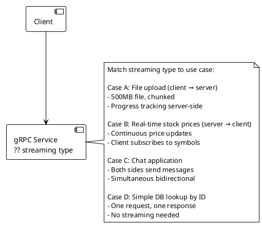

Four gRPC use cases require different streaming patterns.

**Match each case to the correct gRPC streaming type.**

- A) Unary for all four — gRPC unary (one request, one response) handles all cases; streaming adds complexity
- B) Case A → Client streaming; Case B → Server streaming; Case C → Bidirectional streaming; Case D → Unary — each pattern matched to directionality of data flow
- C) Case A → Server streaming; Case B → Client streaming; Case C → Bidirectional; Case D → Unary — A and B reversed; file upload is client→server (client streaming), price feed is server→client (server streaming)
- D) Case A → Bidirectional; Case B → Server streaming; Case C → Server streaming; Case D → Unary — chat is bidirectional, not server-only

---

## Topic 8: Consistency, Availability & Partition Tolerance (Q102–Q113)

---

### Q102. CAP Theorem Application [★☆☆]

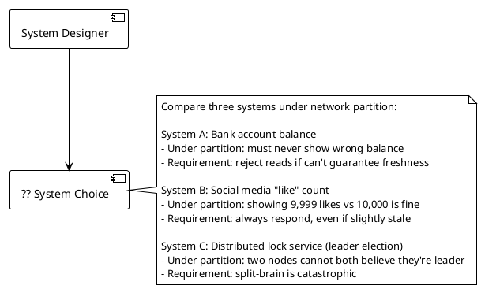

Three systems have different consistency and availability requirements under network partitions.

**Classify each as CP or AP.**

- A) All three CP — maximum safety; but System B (likes) sacrificing availability for strong consistency is unnecessary and costly
- B) System A → CP; System B → AP; System C → CP — bank balance: consistent (wrong balance = fraud); likes: available (stale count acceptable); distributed lock: consistent (split-brain = catastrophe)
- C) System A → AP; System B → CP; System C → AP — wrong classification: bank balance must be consistent, not available-under-partition; distributed locks must be consistent
- D) System A → CP; System B → CP; System C → AP — distributed lock as AP means two nodes can both claim leadership during partition — catastrophic split-brain

---

### Q103. Eventual Consistency in Practice [★★☆]

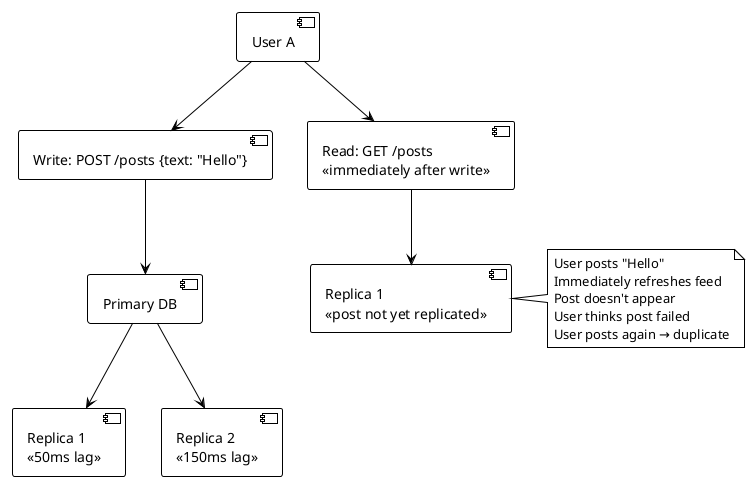

A user posts content and immediately reads from a replica. The post hasn't replicated yet, causing the user to believe it failed and post again.

**Which technique correctly implements read-your-writes consistency?**

- A) Switch all reads to primary after any write — eliminates replica lag entirely; but primary becomes read bottleneck; defeats the purpose of replicas
- B) Session-based read routing: after a write, track the write timestamp in the user's session; route reads to primary until replica lag is estimated to be past that timestamp (or use replication position); fall back to replicas after the window
- C) Increase replication to synchronous — writes wait for all replicas to confirm before ACKing; eliminates lag but adds significant write latency; every write now waits for the slowest replica
- D) Add a client-side cache that includes the just-written post — client always displays recent writes from local state; server reads may still miss; stale-on-refresh if user uses a different device

---

### Q104. Two-Phase Commit Failure Modes [★★★]

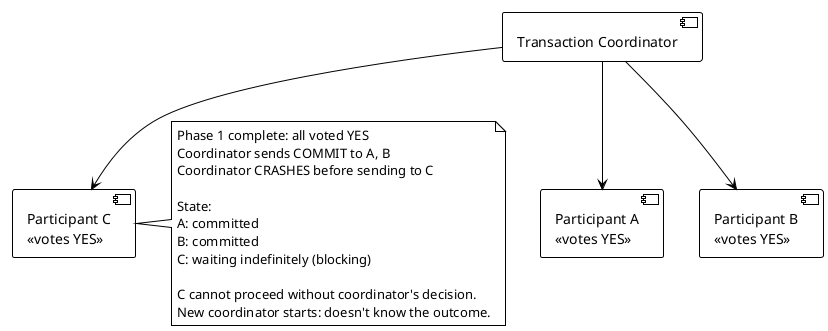

A 2PC transaction coordinator crashes after sending COMMIT to 2 of 3 participants. The third participant is blocked indefinitely.

**What is the fundamental limitation of 2PC demonstrated here and what alternative addresses it?**

- A) 2PC is fine; increase coordinator HA (active-passive failover) — failover coordinator inherits the transaction log; C can recover the COMMIT decision from the new coordinator; this is how production 2PC is deployed
- B) 2PC's fundamental flaw is the blocking problem: if the coordinator crashes after Phase 1 but before all participants receive the decision, participants are blocked indefinitely waiting for a decision they can't make independently; alternative: Saga pattern (no coordinator holds distributed lock; compensation handles rollback) or 3PC (adds a pre-commit phase to reduce blocking, at higher message cost)
- C) 2PC's fundamental flaw is performance; replace with at-most-once delivery — solves a different problem; doesn't address the coordinator crash/blocking scenario
- D) 2PC's fundamental flaw is that it requires all participants to agree; use eventual consistency instead — not applicable when atomicity across multiple services is required

---

### Q105. CRDT for Conflict-Free Collaboration [★★★]

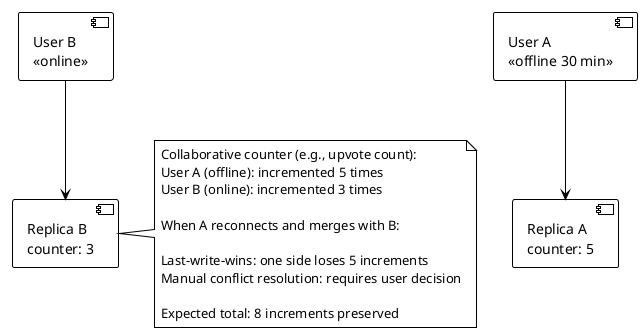

Two replicas have diverged: one has 5 local increments, the other has 3. On merge, all 8 increments must be preserved without manual conflict resolution.

**Which data structure solves this without conflict?**

- A) Last-write-wins (LWW) — the replica with the newer timestamp overwrites the other; the 5 offline increments are lost
- B) G-Counter (Grow-only Counter CRDT) — each replica maintains its own vector of per-replica increment counts; merge is component-wise max; `{A:5, B:3}` merged with `{A:0, B:3}` = `{A:5, B:3}`; total = 8; no conflicts possible; mathematically proven convergent
- C) Two-phase commit — ensures atomic increment across replicas; requires network connectivity; doesn't work for offline users
- D) Operational Transform (OT) — used in document collaboration (Google Docs); not designed for counter semantics; requires server-mediated transformation; doesn't work offline

---

### Q106. Linearizability vs Sequential Consistency [★★★]

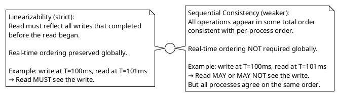

A distributed system must choose between linearizability and sequential consistency.

**Which systems require linearizability vs sequential consistency?**

- A) All distributed systems require linearizability — provides strongest guarantee; most distributed databases trade linearizability for performance
- B) Linearizability required: distributed locks, leader election, compare-and-swap operations, financial ledger reads; Sequential consistency acceptable: social media feeds, collaborative document editing (within session), shopping cart contents displayed to user
- C) Sequential consistency is always sufficient — weaker consistency is easier to implement; but CAS operations, locks, and leader election are broken under sequential consistency (two processes can both believe they acquired the lock)
- D) Sequential consistency required for financial systems; linearizability for social media — reversed; financial systems need linearizability (read must see all committed writes); social media can tolerate reordering

---

### Q107. Read Your Writes in a Distributed System [★★☆]

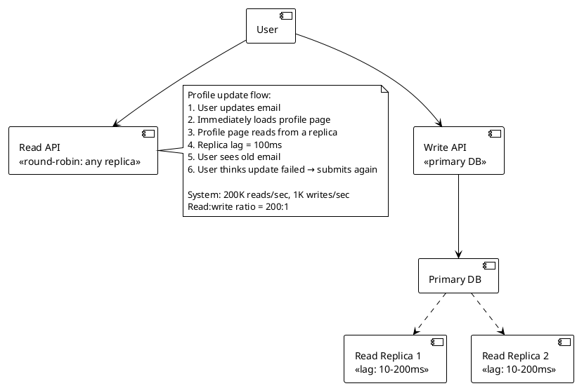

Users see stale data immediately after writes, causing duplicate submissions.

**Which read-your-writes implementation has the lowest performance overhead?**

- A) Sticky sessions — route all reads from a user to the same replica; if that replica is behind, user still sees stale data; doesn't solve the problem
- B) Primary-only reads after write — after any write, route all subsequent reads for that user to primary for 500ms; primary handles 1K writes/sec + some reads; at 200:1 ratio, even routing 1% of reads to primary adds 2K reads/sec to primary (negligible)
- C) Synchronous replication — all replicas must confirm write before ACK; eliminates lag; adds 100-200ms to every write; 200K writes/sec scenario would be devastated; wrong tradeoff here at 1K writes/sec
- D) Vector clocks — track write causality; read includes vector clock from last write; replicas check if they've seen the write; return 503 if not; complex to implement; correct but high implementation overhead

---

### Q108. Conflict Resolution in Multi-Region Writes [★★★]

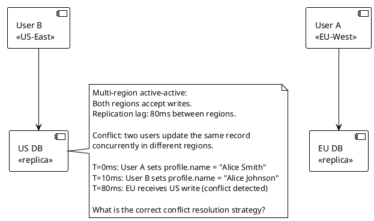

Two users update the same record in different regions within the replication lag window. Both writes are valid.

**What conflict resolution strategy is correct for a user profile update?**

- A) Last-write-wins (LWW) by wall clock — timestamp comparison; User B's write (T=10ms) loses to the one with higher timestamp (clock skew can reverse this unpredictably in distributed systems)
- B) Last-write-wins by Hybrid Logical Clock (HLC) — HLC timestamps are monotonically increasing and account for clock drift; the "last" writer wins deterministically; acceptable for user profile updates where the most recent user intent should prevail
- C) Multi-version conflict: surface both versions to the user — shopping carts (Amazon's Dynamo approach) use this; for a profile name field, asking a user to resolve two name variants is a poor UX; LWW is more appropriate
- D) Reject all concurrent writes — any write that conflicts with an in-flight remote write is rejected with a 409; users must retry; at 80ms replication lag, any write within 80ms of another write to the same record is rejected; too restrictive for user profiles

---

### Q109. BASE vs ACID [★☆☆]

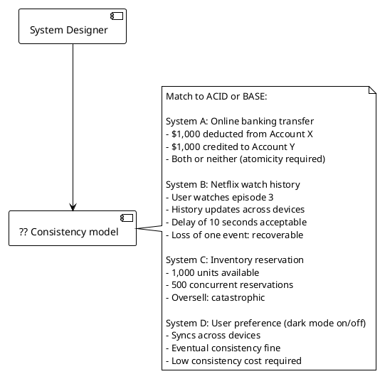

Four systems have different consistency requirements.

**Which systems require ACID and which can use BASE?**

- A) All four require ACID — maximum consistency; over-engineered for B and D; horizontal scaling is harder under ACID
- B) A → ACID; B → BASE; C → ACID; D → BASE — banking transfer and inventory reservation require atomicity/isolation; watch history and preference can tolerate eventual consistency
- C) A → ACID; B → ACID; C → BASE; D → BASE — watch history doesn't require ACID (single-row update, idempotent); inventory reservation (C) requires atomicity — BASE with eventual inventory count could oversell
- D) All four BASE — simplest to scale; but banking transfer without atomicity can result in money deducted with no credit, or credit with no deduction

---

### Q110. Lease-Based Distributed Locking [★★☆]

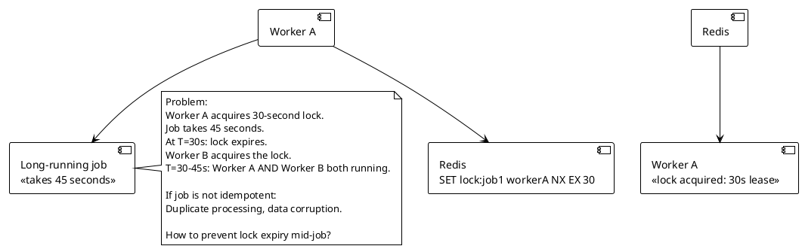

A distributed lock expires before the job completes, allowing a second worker to acquire the lock and run concurrently.

**What is the correct solution?**

- A) Increase lock TTL to 10 minutes — a worker crash holds the lock for 10 minutes; all other workers wait; recovery time is unacceptably long
- B) Lock renewal (watchdog thread) — a background thread in Worker A renews the lock every 10 seconds (`EXPIRE lock:job1 30`) while the job is running; if Worker A crashes, the watchdog stops, the lock expires after 30 seconds, Worker B can acquire it; Redisson implements this as "watchdog" pattern
- C) Use fencing tokens — distributed lock service issues a monotonically increasing token on each acquisition; Worker A gets token 5; when B later acquires with token 6, storage layer rejects Worker A's writes (token 5 < 6); doesn't prevent concurrent execution but prevents stale writes from corrupting data
- D) Use ZooKeeper ephemeral nodes instead of Redis — ZooKeeper ephemeral nodes expire when the client session dies; similar expiry problem exists unless the client actively maintains the session heartbeat

---

### Q111. Gossip Protocol [★★★]

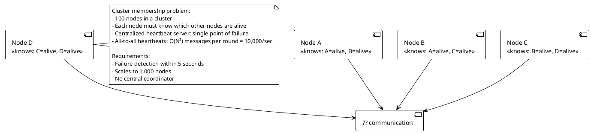

A 100-node cluster needs failure detection without a central coordinator. All-to-all heartbeats don't scale.

**Which failure detection protocol scales correctly?**

- A) Leader-based heartbeat — every node sends heartbeat to leader; leader detects failures; leader failure = no failure detection; single point of failure
- B) Gossip protocol (SWIM) — each node periodically sends heartbeat to K random peers; peers relay information about indirect heartbeats; membership state spreads in O(log N) rounds; failure detection within bounded time without central coordinator; scales linearly with cluster size; used by Cassandra, Consul, Kubernetes etcd
- C) All-to-all heartbeats with compression — N=100: 9,900 heartbeat pairs; N=1,000: 999,000 pairs per interval; compression doesn't change the O(N²) message complexity; doesn't scale
- D) Passive failure detection (no heartbeats) — only detect failures when a node is needed and doesn't respond; failure detection time is unbounded (hours if no request is sent to a failed node)

---

### Q112. Quorum Reads and Writes [★★☆]

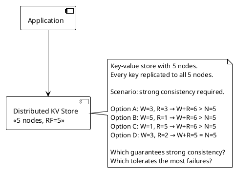

A 5-node cluster with full replication needs strong consistency. Evaluate quorum configurations.

**Which configuration achieves strong consistency with maximum failure tolerance?**

- A) W=3, R=3 — W+R=6 > N=5: strong consistency guaranteed; tolerates 2 write failures (5-3=2), 2 read failures (5-3=2); balanced write/read failure tolerance
- B) W=5, R=1 — W+R=6 > N=5: strong consistency guaranteed; zero write failure tolerance (all 5 must confirm); maximum read failure tolerance (4 nodes can be down during read); impractical for high-write workloads
- C) W=1, R=5 — W+R=6 > N=5: strong consistency guaranteed; maximum write failure tolerance; zero read failure tolerance; impractical for high-read workloads
- D) W=3, R=2 — W+R=5 = N=5: NOT guaranteed strong consistency (W+R must be STRICTLY greater than N); overlap of 0 nodes possible; stale reads allowed

---

### Q113. Consistency in Microservices Data [★★★]

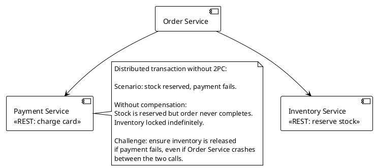

An order service reserves inventory and then charges payment. Payment fails. The reserved inventory must be released even if the Order Service crashes.

**Which pattern ensures inventory is eventually released without 2PC?**

- A) Synchronous REST rollback — on payment failure, call Inventory Service to release; if Order Service crashes before the rollback call, inventory is permanently locked
- B) Saga with compensation — Inventory Service reservation is undone by a compensating `ReleaseInventory` command; the Saga Orchestrator persists its state (which steps completed) before each action; on recovery from crash, the orchestrator resumes from the last persisted state and issues the compensating command; eventual consistency guaranteed
- C) Increase payment service retry — retry payment 3× before declaring failure; doesn't address the inventory lock if all retries fail
- D) Timeout-based release — Inventory Service automatically releases reservations after 5 minutes TTL; works as a safety net but relies on time-based expiry, not event-driven compensation; 5-minute locked inventory during high-demand sale causes UX problems

---

## Topic 9: Distributed Systems Patterns (Q114–Q131)

---

### Q114. CQRS Implementation [★★☆]

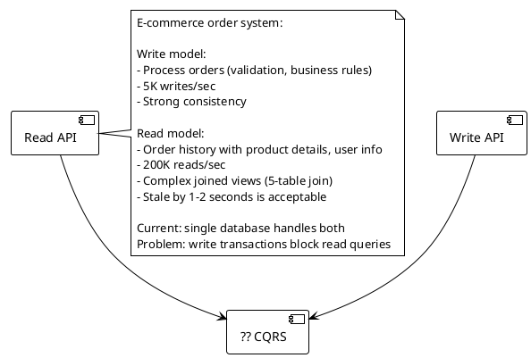

Write transactions are contending with complex read queries on the same database.

**How is CQRS correctly implemented for this scenario?**

- A) CQRS = separate databases with synchronous replication — synchronous replication adds write latency to match the slowest read model update; defeats the purpose of separating concerns
- B) CQRS: separate write model (PostgreSQL, normalized, ACID) and read model (denormalized view in Elasticsearch or a read-optimized PostgreSQL schema); write service publishes domain events; read model projector consumes events and maintains denormalized views; reads never touch the write database; 1-2s eventual consistency acceptable
- C) CQRS = add read replicas — read replicas still use the same schema and storage engine; 5-table JOIN on a replica still takes the same time; doesn't address the query complexity problem
- D) CQRS = move reads to GraphQL — GraphQL is a query language, not a data model; it doesn't change where or how data is stored; query complexity is unchanged

---

### Q115. Event Sourcing Snapshots [★★☆]

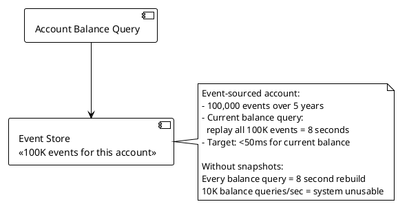

An event-sourced account has 100,000 events. Replaying all events to get current balance takes 8 seconds.

**What snapshot strategy reduces query time to under 50ms?**

- A) Cache the current balance in Redis — cache miss still requires full replay; cache invalidation on every new event; correct for hot path but doesn't solve the fundamental rebuild problem
- B) Periodic snapshots: every 1,000 events, materialize current state as a snapshot event; balance query = load latest snapshot + replay only events after snapshot_id; worst case: 999 events to replay; at 0.08ms/event = 79ms; tune snapshot frequency to meet latency target
- C) Delete old events after snapshotting — destroys the audit trail; event sourcing's primary value proposition is lost
- D) Increase event store read throughput — faster hardware reduces replay time proportionally; 100K events at 0.01ms each = 1 second; still too slow; hardware scaling can't substitute for algorithm improvement (O(N) replay vs O(1) snapshot + O(K) delta)

---

### Q116. Saga vs 2PC Decision [★★☆]

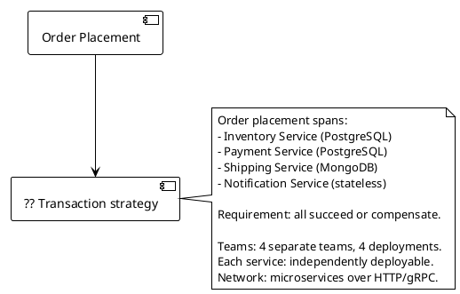

An order involves four services owned by four separate teams.

**2PC or Saga — which is correct for this architecture?**

- A) 2PC — requires all services to implement XA protocol; MongoDB doesn't support XA; blocking on coordinator failure; tightly couples all services to the transaction coordinator; wrong for independently deployed microservices
- B) Saga — each service has its own database and transaction; compensating transactions handle rollback (cancel inventory, refund payment, cancel shipping); services are decoupled; MongoDB compatibility not required; independently deployable; correct pattern for distributed business transactions across microservice boundaries
- C) Single database for all services — eliminates the distributed transaction problem; violates database-per-service principle; tight schema coupling across 4 teams; single point of failure
- D) 2PC with a modern distributed database (CockroachDB) — CockroachDB provides distributed ACID transactions; but the services are already on heterogeneous databases (PostgreSQL + MongoDB); migration to a single DBMS across 4 independent teams is impractical

---

### Q117. Circuit Breaker States [★☆☆]

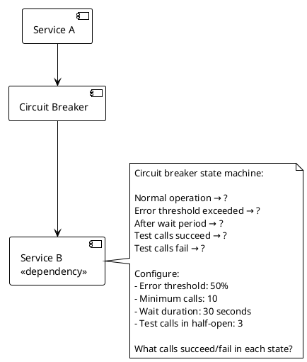

Describe the correct circuit breaker state transitions and behavior in each state.

**Which description is correct?**

- A) CLOSED: all calls pass through; if error rate stays below threshold, stays CLOSED; if error rate exceeds 50% over 10 calls → OPEN; OPEN: all calls fail immediately (fail-fast) without calling Service B; after 30 seconds → HALF-OPEN; HALF-OPEN: allows 3 test calls through; if 2/3 succeed → CLOSED; if 2/3 fail → OPEN
- B) CLOSED: calls pass through; OPEN: routes to fallback service automatically; HALF-OPEN: all traffic gradually restored over 5 minutes — gradual restoration is not standard circuit breaker behavior; test calls are all-or-nothing per probe attempt
- C) CLOSED → OPEN on first failure; OPEN → HALF-OPEN after 30 seconds; HALF-OPEN → CLOSED if next single call succeeds — opening on first failure is too aggressive; minimum call count prevents false opens on cold start
- D) CLOSED: calls pass through; OPEN: 10% of calls pass through to check recovery — OPEN state does not route any calls through; all calls fail fast in OPEN state; HALF-OPEN is the probe state

---

### Q118. Retry with Exponential Backoff [★☆☆]

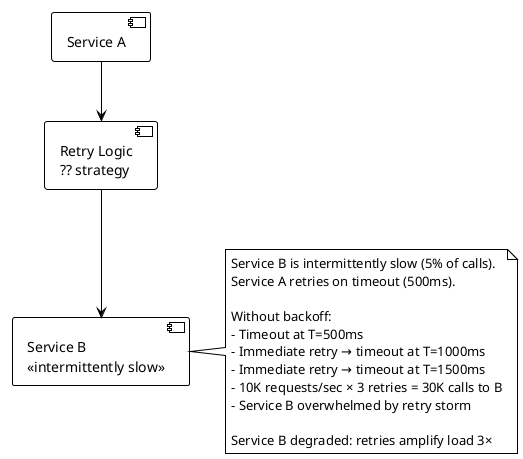

Immediate retries amplify load on a degraded service, worsening the problem.

**What retry strategy prevents the retry storm?**

- A) No retry — guarantees no amplification; but legitimate transient failures return errors to users; 5% transient failure rate = 5% user-visible errors; unacceptable
- B) Exponential backoff with jitter — base delay 100ms, multiplier 2, max 30s, ±25% jitter; retry 1: 100ms ±25ms; retry 2: 200ms ±50ms; retry 3: 400ms ±100ms; jitter prevents synchronized retry waves from multiple callers at the same backoff interval; exponential spacing gives Service B recovery time
- C) Fixed delay retry (500ms between each) — better than immediate; but 10K callers all retry exactly at 500ms intervals creates synchronized retry waves (thundering herd at T=500ms, T=1000ms)
- D) Exponential backoff without jitter — delays space out retries for a single caller; but 10K callers all start at the same time, all back off to the same intervals; synchronized waves still hit Service B at 100ms, 200ms, 400ms intervals

---

### Q119. Leader Election [★★☆]

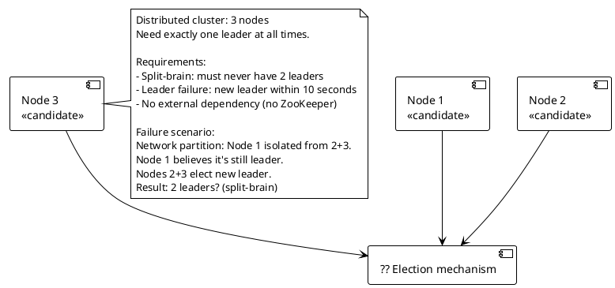

A 3-node cluster must elect exactly one leader without split-brain.

**What leader election mechanism prevents split-brain?**

- A) Bully algorithm — highest-ID node becomes leader; Node 1 (isolated) believes it's still leader; no quorum check; split-brain possible
- B) Raft consensus — leader elected by majority quorum (2/3 nodes); Node 1 (isolated, minority) loses leadership when it can't heartbeat the majority; Nodes 2+3 elect new leader with quorum; Node 1's term expires; exactly one leader at all times; split-brain impossible by design
- C) PING-based heartbeat — leader sends heartbeat to followers; if heartbeat missed, followers start election; Node 1 still sends heartbeats to a network it thinks is working; doesn't account for asymmetric partitions
- D) Timestamp-based election — most recently started node becomes leader; Node 1 doesn't know it's isolated; no quorum requirement; split-brain possible

---

### Q120. Anti-Entropy and Repair [★★☆]

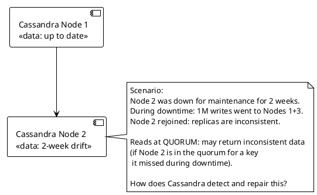

A Cassandra node returns from 2 weeks of downtime with 1M missing writes. Quorum reads may return inconsistent data.

**What mechanism detects and repairs the inconsistency?**

- A) Read repair — when a QUORUM read detects inconsistency (versions differ across nodes), Cassandra repairs the stale node in the background; handles inconsistencies detected during reads but doesn't proactively repair keys that aren't read
- B) Anti-entropy repair (nodetool repair) — runs a Merkle tree comparison between replicas; builds Merkle trees of data ranges; compares tree hashes to find divergent ranges; streams only the missing/divergent data; repairs 1M missing writes efficiently; should be scheduled weekly for nodes that rejoin after long downtime
- C) Hinted handoff — during Node 2's downtime, other nodes stored "hints" (pointers to missed writes); on Node 2's return, hints are replayed; hints are typically stored for only 3 hours by default; 2-week downtime means hints are long gone; insufficient for this scenario
- D) Bootstrap — new node joining the cluster bootstraps all data from existing nodes; Node 2 is rejoining, not new; bootstrap is for new nodes; running bootstrap on an existing node would erase its existing data first

---

### Q121. Consistent Hashing [★☆☆]

```plantuml
@startuml
!theme plain
skinparam backgroundColor white

[Cache Cluster\n<<modulo hashing: key % N>>] --> [Node 1]
[Cache Cluster\n<<modulo hashing: key % N>>] --> [Node 2]
[Cache Cluster\n<<modulo hashing: key % N>>] --> [Node 3]

note right
  Current: 3 nodes, modulo hashing
  key % 3 → node selection
  
  Problem: add Node 4
  key % 4 → different distribution
  
  Almost every key remaps to a different node.
  Cache miss rate: ~75% (3/4 keys remap)
  Database: overwhelmed by cache miss storm
  
  How does consistent hashing solve this?
end note
@enduml
```

Adding a node to a modulo-hashed cache cluster causes ~75% of keys to remap, producing a cache miss storm.

**How does consistent hashing minimize key remapping on node addition?**

- A) Consistent hashing uses sorted hash ring — nodes are placed at positions on a circular ring; keys are assigned to the nearest clockwise node; adding a node takes ownership of a contiguous range from its predecessor; only 1/N keys remap on node addition; for adding a 4th node to a 3-node ring: ~25% of keys remap (vs 75% for modulo)
- B) Consistent hashing requires pre-allocating all node positions — pre-allocation is used for virtual nodes; the core concept is the ring, not pre-allocation
- C) Consistent hashing uses the key's full hash, not modulo — true, but incomplete; the ring structure is what limits key remapping on topology changes
- D) Consistent hashing stores a routing table on every node — routing tables are used in some distributed systems but not the defining feature of consistent hashing; the ring is the key mechanism

---

### Q122. Sidecar Pattern [★★☆]

```plantuml
@startuml
!theme plain
skinparam backgroundColor white

[Service A\n<<Java>>] --> [?? cross-cutting concerns]
[Service B\n<<Python>>] --> [?? cross-cutting concerns]
[Service C\n<<Go>>] --> [?? cross-cutting concerns]

note right
  Cross-cutting concerns needed by all services:
  - mTLS encryption
  - Distributed tracing header injection
  - Circuit breaking
  - Retry logic
  - Metrics collection
  
  Challenge: 3 languages, 3 different library
  implementations needed (Java, Python, Go).
  
  Duplicated effort per language.
  Library versions drift between services.
end note
@enduml
```

Three services in different languages need the same cross-cutting functionality.

**What pattern eliminates per-language library duplication?**

- A) Shared library per language — implement once per language, import as dependency; still requires 3 implementations; version drift problem persists; if the circuit breaker logic changes, update 3 libraries
- B) Sidecar pattern — deploy a proxy (Envoy) as a co-located process in the same pod as each service; service makes plain HTTP/gRPC calls locally (localhost); sidecar handles mTLS, tracing, circuit breaking, retries, and metrics; zero language-specific library code; all services get identical behavior regardless of implementation language; configuration drives sidecar behavior (not code)
- C) API Gateway for all cross-cutting concerns — API Gateway handles north-south traffic; east-west service calls still lack the cross-cutting behavior; centralized gateway is a bottleneck for internal calls
- D) Shared service for cross-cutting concerns — create a "platform service" all others call for tracing/mTLS/retries; adds a network hop per operation; platform service itself becomes a single point of failure; defeats the purpose

---

### Q123. Competing Consumers Pattern [★☆☆]

```plantuml
@startuml
!theme plain
skinparam backgroundColor white

[Image Processing\nQueue: 10K jobs] --> [?? Workers]

note right
  10,000 image processing jobs queued.
  Each job: 2 seconds processing time.
  
  Single worker:
  10K × 2s = 20,000 seconds = 5.5 hours
  
  Target: complete all jobs in 1 hour
  
  How many workers are needed?
  What pattern governs work distribution?
end note
@enduml
```

10,000 jobs at 2 seconds each must complete in 1 hour.

**How many workers are needed and what pattern is used?**

- A) 1 worker, optimize to 0.3s per job — optimization improves throughput but 1 worker at 0.3s × 10K = 3,000 seconds = 50 minutes; barely meets target with no headroom
- B) Competing consumers: ~6 workers needed (10K jobs × 2s / 3600s = 5.56, round up to 6); each worker independently pulls jobs from the queue; no coordinator needed; failed jobs return to queue on visibility timeout; adding workers linearly reduces total time; standard work queue pattern
- C) 100 workers — 100 × 2s processing, 10K/100 = 100 jobs per worker = 200 seconds total; meets target but over-provisioned by 17×; correct logic but inefficient resource allocation
- D) Publisher-subscriber with 10K subscribers — pub/sub delivers each job to ALL subscribers; every subscriber processes every job = 10K duplicate processings; not competing consumers

---

### Q124. Backoff and Retry Budget [★★☆]

```plantuml
@startuml
!theme plain
skinparam backgroundColor white

[Client\n1000 users] --> [Service A\n<<with retry>>]
[Service A\n<<with retry>>] --> [Service B\n<<5% error rate>>]
[Service B\n<<5% error rate>>] --> [Service C\n<<5% error rate>>]

note right
  Call chain: Client → A → B → C
  Each service: 5% error rate
  Each service: retries 3× on error
  
  Probability all three succeed (no retry):
  0.95 × 0.95 × 0.95 = 85.7%
  
  With retries at each level:
  A retries B 3×, B retries C 3×
  
  C under load from A's 3 retries × B's 3 retries
  = 9× traffic amplification on C at failure time
  
  When C degrades: what happens?
end note
@enduml
```

Retries at every layer amplify load exponentially on downstream services.

**What strategy limits retry amplification in deep call chains?**

- A) Add retries at every layer — each layer independently attempts to recover; amplification grows as O(retry_count^depth); the scenario demonstrates the problem
- B) Retry only at the outermost layer (client) — inner services propagate errors immediately without retry; Client A retries the entire call; amplification is bounded by the client's retry count (3×, not 9×); error context is preserved across the full chain
- C) Use a retry budget — each service is allocated a total retry budget (e.g., 10% of requests can be retried per minute); when budget is exhausted, fail fast without retry; limits total retry volume regardless of failure rate
- D) Increase timeout before each retry — longer timeouts reduce false-positive timeout errors but don't reduce retry amplification; at 5% genuine error rate, amplification still occurs

---

### Q125. Idempotent Producer Pattern [★★☆]

```plantuml
@startuml
!theme plain
skinparam backgroundColor white

[Producer] --> [Kafka\n<<broker>>]

note right
  Problem:
  Producer sends message M1.
  Broker receives and stores M1.
  Network times out before broker ACK.
  Producer retries → sends M1 again.
  Broker stores M1 twice.
  
  Consumer sees duplicate M1.
  
  Context:
  - Payment event producer
  - Duplicate payment event = duplicate charge attempt
  - Consumer cannot be made idempotent easily
end note
@enduml
```

Kafka producer retries on network timeout cause duplicate messages.

**What Kafka configuration prevents producer-side duplicates?**

- A) `acks=0` — producer doesn't wait for broker acknowledgment; fastest; but no retry mechanism and no durability guarantee; data loss possible
- B) `enable.idempotence=true` — Kafka assigns a producer ID (PID) and sequence number to each message; broker deduplicates messages with the same PID + sequence number; retry of the same message is recognized as a duplicate and discarded; exactly once at the producer-broker level; automatically sets `acks=all` and `max.in.flight.requests.per.connection=5`
- C) `acks=all` alone — ensures all replicas receive the message before ACK; prevents data loss but doesn't prevent producer retry duplicates; the broker still accepts the same message twice
- D) `max.in.flight.requests.per.connection=1` — limits one in-flight request; prevents message reordering on retry but doesn't deduplicate; duplicate still possible if retry succeeds after timeout

---

### Q126. Rate Limiting with Token Bucket [★☆☆]

```plantuml
@startuml
!theme plain
skinparam backgroundColor white

[API Clients] --> [Token Bucket\n?? configuration]
[Token Bucket\n?? configuration] --> [API Server]

note right
  Requirements:
  - Sustained rate: 100 requests/second
  - Burst allowance: up to 500 requests
    in a short window (within 5 seconds)
  - After burst: back to 100 req/sec sustained
  - Over-limit requests: rejected (429)
  
  Token bucket parameters:
  - Bucket size (capacity)
  - Refill rate
end note
@enduml
```

An API must allow sustained 100 req/sec but accommodate bursts up to 500 requests.

**What token bucket configuration is correct?**

- A) Bucket capacity: 100, refill rate: 100/sec — bucket full = 100 tokens; a burst of 500 requests immediately depletes the bucket in 1 second; only 100 burst, not 500; refill: 1 token/ms
- B) Bucket capacity: 500, refill rate: 100/sec — burst capacity = 500 tokens; sustained rate = 100/sec; a burst of 500 requests is served immediately (bucket empties); after burst, bucket refills at 100 tokens/sec; client can burst again after 5 seconds of idle (500/100=5s); correct
- C) Bucket capacity: 500, refill rate: 500/sec — sustained rate becomes 500/sec, not 100/sec; bucket refills too fast; sustained limit violated
- D) Bucket capacity: 100, refill rate: 10/sec — sustained rate = 10/sec (not 100/sec); burst = 100 (not 500); both parameters wrong

---

### Q127. Chaos Engineering [★★☆]

```plantuml
@startuml
!theme plain
skinparam backgroundColor white

[Chaos Experiment] --> [Production System]

note right
  Pre-experiment hypothesis:
  "If the Payment Service loses network
  connectivity for 30 seconds, the Order Service
  will open its circuit breaker, orders will
  queue in Kafka, and no orders will be lost."
  
  Experiment: inject network failure to Payment Service.
  
  What actually happens:
  - Circuit breaker opens ✓
  - Orders queue in Kafka ✓
  - But: payment webhook callbacks fail
  - 3rd-party payment processor retries webhooks
  - Webhook retry queue fills
  - After 30 seconds: 10,000 webhook retries land
  - Kafka consumer lag grows 10× in 60 seconds
end note
@enduml
```

A chaos experiment reveals an unexpected failure mode: webhook retry amplification.

**What is the correct response to this chaos experiment outcome?**

- A) Disable chaos engineering — the experiment caused a problem; avoid running experiments in production
- B) Document the finding and fix the upstream cause — the chaos experiment succeeded in revealing a real production risk; fix: implement webhook rate limiting and Kafka consumer scaling policy before the failure mode recurs naturally; chaos engineering's value is finding these failure modes in controlled conditions before they occur during real outages
- C) Increase Kafka partition count — more partitions increase consumer parallelism; correct mitigation but treats the symptom (consumer lag) not the cause (webhook retry storm); both fixes are needed
- D) Add more Payment Service instances — the network failure was injected; more instances don't change the webhook behavior; the issue is webhook retry amplification, not Payment Service capacity

---

### Q128. Service Level Objectives [★☆☆]

```plantuml
@startuml
!theme plain
skinparam backgroundColor white

[SLO Definition] --> [Monitoring]

note right
  SLO design for a payment API:
  
  Current monitoring: average latency
  Problem: average masks P99 spikes
  - Average: 120ms (looks fine)
  - P99: 4,500ms (most users fine, 1% timing out)
  
  SLO candidates:
  A) 99.9% of requests complete in <200ms
  B) Average latency < 500ms
  C) Error rate < 0.1%
  D) 99th percentile latency < 500ms
  
  Which SLOs correctly capture user experience?
end note
@enduml
```

Average latency metrics hide P99 spikes. Correct SLOs must capture real user experience.

**Which SLO definitions correctly represent user experience?**

- A) B (average latency) only — average hides tail latency; 1% of users experiencing 4,500ms timeouts is invisible in the average
- B) A (P99 < 200ms) and C (error rate < 0.1%) and D (P99 latency < 500ms) — percentile-based latency SLOs capture what users actually experience; error rate SLO captures availability failures; both dimensions needed; B (average) is misleading and should be replaced by percentile SLOs
- C) All four — including average latency is redundant when percentile SLOs exist; average latency metric is not a useful SLO; it masks the tail latency that users experience
- D) C (error rate) only — error rate captures hard failures but not slow responses (which are soft failures from a user experience perspective); a 4,500ms response is not technically an error but is a functional failure

---

### Q129. Blue-Green vs Canary vs Rolling [★☆☆]

```plantuml
@startuml
!theme plain
skinparam backgroundColor white

[Deployment Strategy\n??] --> [Production Traffic]

note right
  Compare deployment strategies:

  Scenario A:
  - E-commerce site, Black Friday
  - Rollback must complete in <60 seconds
  - Zero downtime required
  - Small defect risk: feature flags deployed

  Scenario B:
  - ML model update: accuracy may regress
  - Need to measure impact on real user behavior
  - Gradual exposure preferred
  - Rollback: <5 minutes acceptable

  Scenario C:
  - Infra upgrade (Java 17→21 runtime)
  - High confidence, just a runtime change
  - 20 pods in Kubernetes
  - Downtime: none; speed: not critical
end note
@enduml
```

Three deployment scenarios have different risk and rollback requirements.

**Match each scenario to the correct deployment strategy.**

- A) Blue-green for all — maximum isolation; but ML model canary (B) can't be validated against real user behavior without gradual exposure; blue-green routes 100% immediately
- B) Scenario A → Blue-green; Scenario B → Canary; Scenario C → Rolling — Blue-green: instant 100% cutover with instant rollback (flip LB weight); Canary: expose 5-10% of traffic to new model, measure conversion/accuracy, gradually increase; Rolling: replace pods one at a time with health checks, no infrastructure duplication needed for routine runtime upgrades
- C) Scenario A → Canary; Scenario B → Blue-green; Scenario C → Rolling — Canary for Black Friday is wrong: gradual exposure means some users hit the new code during the highest-stakes period; instant rollback is better; Blue-green for ML model loses the gradual exposure needed for measurement
- D) Scenario A → Rolling; Scenario B → Canary; Scenario C → Blue-green — Rolling for Black Friday risks mixed versions serving traffic simultaneously; rollback during rolling means re-rolling forward; complex on the highest-stakes day

---

### Q130. Sharding Strategy Selection [★☆☆]

```plantuml
@startuml
!theme plain
skinparam backgroundColor white

[Application] --> [?? Sharding strategy]
[?? Sharding strategy] --> [Shard 1]
[?? Sharding strategy] --> [Shard 2]
[?? Sharding strategy] --> [Shard 3]
[?? Sharding strategy] --> [Shard 4]

note right
  User data: 500M users, 4 shards
  
  Strategy options:
  A) Hash sharding: shard = hash(user_id) % 4
  B) Range sharding: shard by user_id range
     (0-125M, 125M-250M, etc.)
  C) Directory sharding: lookup table maps user_id → shard
  D) Geographic sharding: EU users → EU shard, US → US shard
  
  Access pattern: always by user_id
  Growth: 50M new users/year
  Hotspot risk: new users created sequentially (ID is incremental)
end note
@enduml
```

500M users across 4 shards. Sequential user IDs. Always queried by user_id.

**Which sharding strategy avoids hotspots while supporting growth?**

- A) Hash sharding — `hash(user_id) % 4` distributes users pseudo-randomly across shards; sequential IDs land on different shards; no hotspot on the "latest" shard; rebalancing on shard addition requires rehashing many keys (consistent hashing mitigates this)
- B) Range sharding — sequential IDs mean all new users land on the highest-range shard (e.g., shard 4 gets IDs 375M-500M+); shard 4 is the write hotspot; older shards are read-only; uneven load
- C) Directory sharding — lookup table maps user_id → shard; most flexible (can move users between shards without rehashing); but lookup table becomes a bottleneck and single point of failure at 500M users; adds a network round-trip per query
- D) Geographic sharding — correct for latency optimization (EU data stays in EU); but geographic affinity may not align with user_id range; GDPR compliance benefit is significant; hotspot risk: if EU grows faster than US, EU shard is under more load

---

### Q131. Consistent Hashing with Virtual Nodes [★★★]

```plantuml
@startuml
!theme plain
skinparam backgroundColor white

[Consistent Hash Ring\n<<3 physical nodes>>] --> [Node A\n<<vnodes: 150>>]
[Consistent Hash Ring\n<<3 physical nodes>>] --> [Node B\n<<vnodes: 150>>]
[Consistent Hash Ring\n<<3 physical nodes>>] --> [Node C\n<<vnodes: 150>>]

note right
  Without virtual nodes:
  3 nodes → 3 points on hash ring
  Node failure: 33% of keys remap to one survivor
  Uneven distribution if nodes aren't perfectly spaced
  
  With virtual nodes (vnodes):
  Each physical node → 150 virtual positions on ring
  450 total positions instead of 3
  
  What problem do virtual nodes solve?
end note
@enduml
```

A consistent hash ring with 3 nodes. Evaluate virtual nodes.

**What problem do virtual nodes solve and what is the tradeoff?**

- A) Virtual nodes solve the hotspot problem by placing each node at 150 positions — nodes' responsibility ranges are smaller and more evenly distributed; when a node fails, its 150 virtual ranges are distributed across all remaining nodes (not piled onto one neighbor); new nodes can be added by taking virtual ranges from all existing nodes, not just their neighbors; tradeoff: more memory for the virtual node mapping table; more complexity in membership tracking
- B) Virtual nodes solve the data replication problem — virtual nodes and replication are separate concepts; replication factor determines how many copies of data exist; virtual nodes determine distribution of a single copy
- C) Virtual nodes eliminate the need for consistent hashing — they are a feature of consistent hashing, not a replacement
- D) Virtual nodes ensure exactly equal data distribution — they provide better distribution than 3 physical nodes but not perfectly equal; statistical distribution across 150 virtual nodes per physical node is much better than 3 physical node positions

---

## Topic 10: Rate Limiting, Throttling & Backpressure (Q132–Q141)

---

### Q132. Distributed Rate Limiting [★★☆]

```plantuml
@startuml
!theme plain
skinparam backgroundColor white

[API Client] --> [API Server 1\n<<local counter: 30>>]
[API Client] --> [API Server 2\n<<local counter: 25>>]
[API Client] --> [API Server 3\n<<local counter: 35>>]

note right
  Rate limit: 100 requests/min per API key
  3 API servers, load balanced.
  
  Problem: each server tracks its own counter.
  Client sends 30+25+35 = 90 requests total.
  Each server sees < 100 → all allowed.
  
  Client has effectively bypassed the rate limit.
  True request count: 90 (close to 100, but
  distribution across servers hides it).
end note
@enduml
```

Per-server rate limiting allows clients to exceed global limits by distributing requests across servers.

**What architecture enforces the global rate limit correctly?**

- A) Sticky sessions — route each API key to the same server; server-local counter is the global counter; all requests from one key go to one server; correct but sticky sessions lose load balancing benefits and create server hotspots for popular API keys
- B) Centralized rate limit counter in Redis — each API server atomically increments a shared Redis counter for the API key; `INCR rate_limit:{api_key}:{minute_bucket}` returns current count; if count > 100, reject with 429; TTL=60s auto-expires the counter; atomic Redis operations ensure consistency across servers
- C) Gossip-based counter synchronization — servers share counter state via gossip; eventual consistency means a client can exceed the limit briefly before gossip propagates; not suitable for strict rate limiting
- D) API Gateway rate limiting — rate limiting at the API Gateway (single entry point) ensures all requests for an API key go through one counter regardless of backend server count; correct but requires a robust stateful API Gateway (Kong, NGINX Plus, AWS API GW with usage plans)

---

### Q133. Throttling Strategy for Shared Infrastructure [★★☆]

```plantuml
@startuml
!theme plain
skinparam backgroundColor white

[Tenant A\n<<paid: $1,000/mo>>] --> [Shared API\n<<1,000 RPS limit>>]
[Tenant B\n<<paid: $100/mo>>] --> [Shared API\n<<100 RPS limit>>]
[Tenant C\n<<free tier>>] --> [Shared API\n<<10 RPS limit>>]

note right
  Multi-tenant API with tiered throttling:
  
  Current problem:
  Tenant C (free) is flooding the API at 500 RPS.
  Shared infrastructure is degraded for all tenants.
  Tenant A (paying $1,000/mo) experiences slowness.
  
  Requirements:
  - Tenant C must not impact Tenant A
  - Throttle Tenant C to 10 RPS
  - Tenant A must always get their 1,000 RPS
end note
@enduml
```

A free-tier tenant's traffic surge degrades paid tier performance.

**What throttling architecture correctly isolates tenants?**

- A) Global rate limit for all tenants combined — doesn't distinguish between paying and free tenants; Tenant C's 500 RPS reduces available capacity for A and B
- B) Per-tenant rate limiting with priority queues — each tenant has its own rate bucket; Tenant C throttled at 10 RPS with immediate 429 rejection beyond that; Tenant A and B buckets are unaffected; optionally, implement work queues with priority levels so Tenant A requests are processed first when infrastructure is shared; Tenant C requests deprioritized or shed
- C) Tenant isolation via dedicated infrastructure — highest isolation; each tenant gets dedicated API servers; cost is prohibitive for free tier at scale; correct for enterprise tenants, wrong for free-tier at thousands of tenants
- D) Reactive throttling — allow Tenant C to burst, then throttle when aggregate load exceeds threshold — reactive approach means paid tenants already experienced degradation before throttling kicks in; proactive per-tenant limits are correct

---

### Q134. Adaptive Rate Limiting [★★★]

```plantuml
@startuml
!theme plain
skinparam backgroundColor white

[Traffic Spike] --> [Adaptive Rate Limiter\n?? strategy]
[Adaptive Rate Limiter\n?? strategy] --> [Database\n<<80% CPU>>]

note right
  Database CPU: normally 30%, threshold 80%.
  At 80%: response time degrades.
  
  Current behavior: fixed rate limit (1,000 RPS).
  At 1,000 RPS + traffic spike: DB hits 80%.
  Fixed limit doesn't adjust to DB state.
  
  Desired: reduce allowed RPS automatically
  when DB CPU exceeds 70%.
  Increase allowed RPS when DB CPU drops below 50%.
end note
@enduml
```

A fixed rate limit can't adapt to downstream system health.

**What adaptive rate limiting strategy correctly protects the database?**

- A) Monitor DB CPU; manually reduce rate limit when alert fires — manual intervention has minutes of delay; database has already degraded before the operator adjusts the limit; not reactive enough
- B) Adaptive concurrency limiting (TCP Congestion Control analog) — use a feedback control loop: measure downstream latency or error rate; reduce allowed concurrency when latency increases (AIMD: additive increase, multiplicative decrease); increase when latency drops; Netflix's Concurrency Limiter library implements this; no fixed limit needed
- C) Circuit breaker on database errors — opens when DB errors exceed threshold; by this point, DB has already degraded significantly; circuit breaker is a last resort, not a proactive protection mechanism
- D) Increase DB instance size — more headroom; DB still hits a ceiling under sufficient load; doesn't address the rate limiting design problem

---

### Q135. Request Hedging [★★★]

```plantuml
@startuml
!theme plain
skinparam backgroundColor white

[Client] --> [Request Hedging\n?? strategy]
[Request Hedging\n?? strategy] --> [Server Instance 1\n<<95th percentile: 100ms>>]
[Request Hedging\n?? strategy] --> [Server Instance 2\n<<occasional slow: 2000ms>>]

note right
  Problem: tail latency
  P50: 20ms (fast)
  P99: 2,000ms (occasional slow instance)
  P99 is user-visible and unacceptable.
  
  Observation: 95% of requests complete within 100ms.
  After 100ms, there's a high probability
  the request is on a slow instance.
  
  Request hedging: send request to second server
  after waiting 100ms for first to respond.
end note
@enduml
```

1% of requests hit a slow server instance, causing 2-second P99 latency. 95% complete within 100ms.

**How does request hedging reduce P99 latency and what is the cost?**

- A) Hedging sends all requests to two servers simultaneously — 2× server load for all requests; reduces tail latency but doubles infrastructure cost; not hedging, this is redundant requests
- B) Hedging: send initial request; after 100ms (P95 latency threshold) with no response, send a second request to a different server; first response cancels the second; P99 drops from 2,000ms to ~100ms + small second-request overhead; cost: ~5% of requests trigger a second server call (only those that exceed the P95 threshold); overall load increase ~5%, not 100%
- C) Hedging increases server load by 100% — only true if hedging threshold is 0ms (always send two requests); with a 100ms threshold, ~5% overhead; not 100%
- D) Hedging reduces server load — hedging adds load (extra requests); it reduces latency at the cost of load, not the other way around

---

### Q136. Queue Depth as Backpressure Signal [★★☆]

```plantuml
@startuml
!theme plain
skinparam backgroundColor white

[Producer\n100K events/sec] --> [Queue\n<<depth growing>>]
[Queue\n<<depth growing>>] --> [Consumer\n80K events/sec]

note right
  Queue depth growing:
  Production rate: 100K events/sec
  Consumption rate: 80K events/sec
  Deficit: 20K events/sec
  
  At this rate:
  Queue depth grows 20K per second.
  After 5 minutes: 6M messages queued.
  After 1 hour: at disk capacity.
  
  What backpressure mechanism prevents disk exhaustion?
end note
@enduml
```

A queue fills because producers outpace consumers. Disk exhaustion is 1 hour away.

**What backpressure mechanism prevents queue exhaustion?**

- A) Increase disk size — buys time but doesn't resolve the fundamental throughput mismatch; at infinite disk, queue grows forever
- B) Apply backpressure to producers — when queue depth exceeds a threshold (e.g., 1M messages), signal producers to slow down (return 503 or use TCP backpressure); producers pause or shed load; queue depth stabilizes; this is backpressure: pressure from the queue propagates upstream to the source
- C) Drop newest messages when queue is full — sheds load but loses data; unacceptable if events have business value
- D) Scale consumers — correct long-term fix; but scaling consumers takes minutes (pod startup, warm-up); in the 5-minute window before the queue hits 6M messages, backpressure provides immediate relief

---

### Q137. API Throttle vs Rate Limit [★☆☆]

```plantuml
@startuml
!theme plain
skinparam backgroundColor white

[Client] --> [?? Rate limit or Throttle]
[?? Rate limit or Throttle] --> [API Server]

note right
  Distinguish:
  
  Scenario A:
  Client exceeds 100 req/min.
  Response: 429 Too Many Requests immediately.
  Client must wait and retry.
  
  Scenario B:
  Client sends 500 req/min against 100 req/min limit.
  Excess 400 requests queued internally.
  Served as capacity allows (smoothed output).
  Client waits but doesn't get 429.

  Which is rate limiting and which is throttling?
end note
@enduml
```

Two request management strategies treat excess traffic differently.

**Which is rate limiting and which is throttling?**

- A) Both are rate limiting — rate limiting and throttling are synonyms; no meaningful distinction
- B) Scenario A is rate limiting (reject excess requests immediately with 429); Scenario B is throttling (queue excess requests, serve when capacity allows, smooth traffic); distinction: rate limiting enforces a hard ceiling with rejection; throttling shapes traffic by delaying excess rather than rejecting it
- C) Scenario A is throttling; Scenario B is rate limiting — reversed; throttling is the smoother (queue+delay); rate limiting is the hard reject
- D) Both are throttling — throttling always means rejection; incorrect; throttling originally referred to flow control (shaping), not rejection

---

### Q138. Token Bucket vs Sliding Window Counter [★☆☆]

```plantuml
@startuml
!theme plain
skinparam backgroundColor white

[API Client] --> [Rate Limiter\n?? algorithm]

note right
  API: 100 requests/minute limit
  
  Fixed window counter:
  Window: 1 minute buckets
  
  Client behavior:
  T=0:00 → 50 requests (50 used)
  T=0:59 → 50 more requests (100 used, window resets)
  T=1:00 → 50 more requests (new window, 50 used)
  T=1:01 → 50 more requests (100 in new window)
  
  In 2 seconds (T=0:59 to T=1:01):
  Client sends 100 requests.
  No rate limit exceeded per window.
  But 100 requests in 2 seconds = 3,000/min burst rate.
end note
@enduml
```

A client exploits fixed window boundaries to burst 100 requests in 2 seconds without being rate limited.

**Which algorithm prevents this boundary exploitation?**

- A) Token bucket — allows burst up to bucket size; the described exploit (crossing window boundary) would not be prevented; token bucket allows burst by design
- B) Sliding window counter — count requests in the last 60 seconds at any point in time; at T=1:01, the window covers T=0:01–T=1:01; requests at T=0:59 (50) and T=1:01 (50) are both in the window → 100 requests → limit reached at T=1:00 when adding the 50th new request; boundary exploit prevented
- C) Fixed window counter with smaller buckets (1-second windows, 1.67 req/sec limit) — reduces window boundary burst amplitude; doesn't eliminate it; at every second boundary, client can double their rate briefly
- D) Leaky bucket — output rate is constant (smoothed); prevents any burst above the drip rate; correct prevention but overly strict for an API that should allow some bursting

---

### Q139. Rate Limiting Granularity [★★☆]

```plantuml
@startuml
!theme plain
skinparam backgroundColor white

[API Clients] --> [Rate Limiter\n?? granularity]

note right
  Payment API rate limiting options:

  Option A: Global rate limit (all clients combined)
  - 10,000 RPS total
  - One bad client can consume all capacity

  Option B: Per-client rate limit (by API key)
  - 1,000 RPS per API key
  - 10 clients = 10,000 RPS max
  - Fair isolation

  Option C: Per-endpoint rate limit
  - POST /payments: 100 RPS per key
  - GET /payments/{id}: 1,000 RPS per key

  Option D: Per-user rate limit (by authenticated user)
  - 10 payments/minute per user
  - Prevents individual users from flooding
end note
@enduml
```

A payment API must protect against both misbehaving API consumers and individual users making too many payment attempts.

**Which rate limiting granularity configuration correctly addresses both threats?**

- A) Global rate limit only — one misbehaving API key consumes all capacity; individual user abuse undetected
- B) Per-client (API key) + per-user rate limiting combined — API key limit (1,000 RPS) prevents a single integration partner from overwhelming the service; per-user limit (10 payments/minute) prevents individual users from making excessive payment attempts regardless of which client they use; two complementary layers; defense in depth
- C) Per-endpoint only — protects specific endpoints from overload but doesn't prevent one client from consuming all capacity across endpoints; no user-level protection
- D) Per-user only — protects against individual user abuse; a compromised API key with 10K users can still collectively send 100K requests/minute; no client-level protection

---

### Q140. Backpressure with Reactive Streams [★★★]

```plantuml
@startuml
!theme plain
skinparam backgroundColor white

[Data Source\n<<produces 100K items/sec>>] --> [Reactive Pipeline]
[Reactive Pipeline] --> [Slow Processor\n<<handles 10K items/sec>>]

note right
  Without backpressure:
  Source produces 100K items/sec.
  Processor handles 10K/sec.
  Items buffer in memory between stages.
  Buffer fills → OOM crash.
  
  Reactive Streams (Project Reactor / RxJava):
  How does backpressure work in reactive pipelines?
end note
@enduml
```

A reactive pipeline has a 10× throughput mismatch. Without backpressure, memory is exhausted.

**How does reactive backpressure prevent OOM in this pipeline?**

- A) Reactive Streams drop items automatically when processor is slow — dropping is one backpressure strategy but not the default; Reactor's default is to throw `MissingBackpressureException` when downstream can't keep up, not silently drop
- B) Reactive Streams implement demand-based flow — downstream signals how many items it can handle (e.g., `request(N)`); source only produces N items until downstream requests more; if processor signals `request(10K)`, source produces 10K, waits for next `request()` signal; no unbounded buffering; memory bounded by the demand signal; Project Reactor's `Flux` implements this via `BaseSubscriber.request()`
- C) Reactive Streams use a fixed-size internal buffer — bounded buffer is one implementation; but the backpressure mechanism propagates upstream, not just buffers; when the buffer fills, upstream production is suspended
- D) Reactive Streams process items in parallel automatically — parallelism is orthogonal to backpressure; `publishOn` and `subscribeOn` control threading; parallel processing increases throughput but doesn't create backpressure

---

### Q141. SLA vs SLO vs SLI [★☆☆]

```plantuml
@startuml
!theme plain
skinparam backgroundColor white

[Reliability Engineering] --> [?? Define SLI, SLO, SLA]

note right
  Payment API reliability framework:
  
  Measurements:
  - Request success rate: measured every minute
  - P99 latency: measured every minute
  - Uptime: measured by synthetic monitoring
  
  Targets:
  - Internal target: 99.9% success rate
  - Customer contract: 99.5% uptime/month
  
  Map to SLI, SLO, SLA.
end note
@enduml
```

A payment API needs a reliability framework. Distinguish SLI, SLO, and SLA.

**Which definitions are correct?**

- A) SLI = target, SLO = measurement, SLA = contract — reversed; SLI is the measurement, SLO is the target
- B) SLI (Service Level Indicator) = the measured metric (request success rate, P99 latency, uptime percentage); SLO (Service Level Objective) = the internal target for the SLI (99.9% success rate — internal engineering target); SLA (Service Level Agreement) = the customer-facing contractual commitment (99.5% uptime/month, with penalties for breach); SLO is tighter than SLA to provide a buffer before breaching the customer contract
- C) SLI = contract, SLO = target, SLA = measurement — all three wrong
- D) SLA and SLO are the same; SLI is different — SLA and SLO serve different purposes: SLO is internal (engineering team sets it), SLA is external (customer-facing legal commitment); they're related but distinct

---

## Topic 11: Data Partitioning & Sharding (Q142–Q153)

---

### Q142. Hotspot Shard Problem [★★★]

```plantuml
@startuml
!theme plain
skinparam backgroundColor white

[Write Traffic] --> [Shard 1: 80%\n<<hotspot>>]
[Write Traffic] --> [Shard 2: 10%]
[Write Traffic] --> [Shard 3: 5%]
[Write Traffic] --> [Shard 4: 5%]

note right
  User data sharded by user_id % 4.
  
  Hotspot: 80% of writes go to Shard 1.
  Investigation: top 10 accounts by write volume
  are all mapped to Shard 1.
  These 10 accounts generate 80% of all writes.
  
  Shard 1: CPU 95%, I/O saturated.
  Shards 2-4: CPU 20%.
  
  How to address this WITHOUT resharding?
end note
@enduml
```

A minority of high-write accounts hash to the same shard, causing extreme load imbalance. Resharding is not an option.

**What mitigation addresses the hotspot without resharding?**

- A) Add more replicas to Shard 1 — replicas handle reads; write hotspot is on the primary; more replicas don't reduce write load on the primary
- B) Shard splitting for hotspot accounts — identify the 10 hot accounts; move them to dedicated shards (one shard per hot account or dedicated hot-account shard); update the routing logic to check a "hot account override" table before applying the modulo hash; Shard 1 loses the hot accounts; load redistributes; no full resharding required
- C) Vertical scale Shard 1 — larger instance can handle more load; but 95% CPU on the current instance suggests the hot accounts will exceed the new ceiling eventually; doesn't solve the architectural problem
- D) Cache writes to Shard 1 in Redis — write-behind cache absorbs write bursts; but at sustained 80% of all writes, Redis eventually saturates too; and write-behind introduces data loss risk

---

### Q143. Cross-Shard Query Problem [★★★]

```plantuml
@startuml
!theme plain
skinparam backgroundColor white

[Analytics Query] --> [Shard 1]
[Analytics Query] --> [Shard 2]
[Analytics Query] --> [Shard 3]
[Analytics Query] --> [Shard 4]

note right
  Query: "Find all orders > $1,000 placed in the last 7 days"
  
  Sharded by user_id: orders for user A are on shard 1,
  orders for user B on shard 2, etc.
  
  This query has no user_id filter:
  must scan ALL shards simultaneously.
  
  At 4 shards: 4 parallel queries, merge results.
  At 100 shards: 100 parallel queries, merge 100 results.
  
  Query latency = slowest shard + merge overhead.
end note
@enduml
```

A cross-shard query must scan all shards. As shard count grows, query complexity grows with it.

**What architectural pattern handles cross-shard queries efficiently?**

- A) Increase shard count to improve parallelism — more shards = more parallel queries but also more merge overhead; query latency doesn't improve linearly; at 1,000 shards, merging 1,000 result sets is expensive
- B) Separate OLAP store (data warehouse) — replicate data from all shards into a columnar warehouse (Redshift, BigQuery, Snowflake) via CDC; cross-shard analytics queries run against the warehouse (single query, no fan-out, columnar compression); OLTP shards handle transactional writes; query separation; standard big data architecture
- C) Scatter-gather with result caching — scatter query to all shards, gather and merge results, cache merged results for 1 minute; correct for repeated identical queries; first execution is still slow; doesn't scale with shard count
- D) Reindex all data in Elasticsearch — Elasticsearch handles cross-shard search natively (distributed index); valid for search queries; for complex aggregations with JOINs across order + user + product data, Elasticsearch is less capable than a columnar warehouse

---

### Q144. Shard Rebalancing [★★★]

```plantuml
@startuml
!theme plain
skinparam backgroundColor white

[Consistent Hash Ring\n<<3 nodes>>] --> [Node A\n<<33% of keys>>]
[Consistent Hash Ring\n<<3 nodes>>] --> [Node B\n<<33% of keys>>]
[Consistent Hash Ring\n<<3 nodes>>] --> [Node C\n<<33% of keys>>]

note right
  Scenario: add Node D to the cluster.
  
  Expected key movement (consistent hashing):
  Node D takes ~25% of all keys.
  Keys should come proportionally from A, B, C.
  Each loses ~8.3% of their keys to D.
  
  Problem observed:
  Node D takes 40% of keys from Node C,
  3% from Node B, 7% from Node A.
  Node C is overwhelmed by data movement.
end note
@enduml
```

Adding a node causes uneven key redistribution, overloading one node's data migration.

**What feature of consistent hashing prevents uneven redistribution?**

- A) Increase number of physical nodes to improve distribution — more nodes improve steady-state balance but don't address the key movement pattern during node addition
- B) Virtual nodes (vnodes) — each physical node holds 150 virtual positions on the hash ring; when Node D is added and takes 150 new virtual positions, those positions come from all existing nodes proportionally; Node D takes ~37.5 vnodes from each of A, B, C (~12.5% each); migration load is spread across all nodes, not concentrated on one neighbor
- C) Consistent hashing guarantees even redistribution — consistent hashing with physical nodes only (few ring positions per node) can cause uneven redistribution depending on ring position; vnodes are required for even distribution
- D) Pre-assign Node D's ring position before adding it — ring position determines which keys Node D takes; a well-chosen position helps, but with only 3 physical nodes on the ring, it's hard to find a position that takes evenly from all neighbors

---

### Q145. Functional Partitioning [★☆☆]

```plantuml
@startuml
!theme plain
skinparam backgroundColor white

[Monolith Database\n<<all data in one DB>>] --> [?? Partitioning strategy]

note right
  Monolith database contains:
  - User accounts (10M users, 500K writes/day)
  - Product catalog (2M products, 100 writes/day)
  - Orders (500M orders, 5K writes/sec)
  - Sessions (50M active, 100K writes/sec)
  - Audit logs (5B rows, append-only)
  
  Problem: all traffic on one DB
  Sessions: causing replication lag on order replicas
  Audit logs: filling disk, slowing backups
end note
@enduml
```

A monolith database hosts five workloads with completely different characteristics.

**What functional partitioning strategy is correct?**

- A) Shard all data horizontally — horizontal sharding addresses scale within a workload; doesn't separate workloads with different characteristics
- B) Functional partitioning: separate each workload by its storage needs — Sessions → Redis (in-memory, TTL-based, high write throughput); Audit logs → Cassandra or S3 (append-only, large scale, cold data); Products → separate PostgreSQL (small, rarely updated, cache-friendly); Orders → dedicated high-performance PostgreSQL cluster; Users → dedicated PostgreSQL; each database sized and tuned for its workload; session writes no longer cause replication lag on the order database
- C) Vertical scaling the monolith — larger single DB instance; all workloads still contend for the same I/O, replication bandwidth, and backup window; sessions still cause replication lag; audit logs still fill shared disk
- D) Read replicas per workload — replicas separate read load; write contention on primary remains; sessions at 100K writes/sec still saturate the primary

---

### Q146. Time-Based Partitioning [★☆☆]

```plantuml
@startuml
!theme plain
skinparam backgroundColor white

[Order Table\n<<500M rows, 3 years>>] --> [?? Partitioning strategy]

note right
  Access patterns by data age:
  - Last 30 days: 90% of reads (OLTP, <5ms latency)
  - 31-365 days: 9% of reads (reporting, <1s)
  - >1 year: 1% of reads (audit, <10s acceptable)
  
  Writes: always to current month (no historical updates)
  Retention: 5 years (regulatory)
  
  Current: full table scan for reporting queries = 3 min
  Target: reporting queries <10 seconds
end note
@enduml
```

A 500M-row orders table has time-based access patterns. Old data is rarely read.

**What time-based partitioning strategy optimizes this workload?**

- A) Hash partition by order_id — distributes rows evenly; doesn't separate hot (recent) from cold (old) data; reporting query still scans all partitions
- B) Range partition by order_date (monthly partitions) — each month is a separate partition; recent month: small, hot, in buffer pool; reporting query (`WHERE order_date > '2024-01-01'`) uses partition exclusion (scans only relevant partitions); old partitions can be moved to cheaper storage or archived; writes go only to the current-month partition; PostgreSQL `PARTITION BY RANGE` or TimescaleDB hypertables implement this natively
- C) Partition by user_id range — distributes users across partitions; reporting queries (no user filter) still scan all partitions; doesn't help with the time-based access pattern
- D) Create a separate table for each year — functionally similar to range partitioning but requires application-level table routing; no native query planner optimizations; more complex than database-level partitioning

---

### Q147. Partition Key Selection [★★★]

```plantuml
@startuml
!theme plain
skinparam backgroundColor white

[Data Model] --> [?? Partition key]

note right
  Orders table: 500M rows
  Candidate partition keys:
  
  A) order_id (UUID)
  B) user_id
  C) order_status ('pending','processing','complete','cancelled')
  D) created_at (month)
  E) composite (user_id, created_at_month)
  
  Query patterns:
  Q1: WHERE user_id = ? (most common, 80%)
  Q2: WHERE order_id = ? (10%)
  Q3: WHERE created_at > ? (10%, full range scan)
  Q4: WHERE user_id = ? AND created_at > ?
end note
@enduml
```

Four query patterns with different access requirements on a 500M-row orders table.

**Which partition key best serves the dominant query pattern while supporting others?**

- A) order_id — Q2 (10%) is served optimally; Q1 (80%, by user_id) requires a full-table scan across all partitions; wrong partition key for dominant query
- B) user_id — Q1 (80%) is served optimally (partition pruning); Q4 served optimally (partition pruning by user_id + filter by date within partition); Q2 (order_id) requires cross-partition scatter-gather (but is only 10%); Q3 (full range scan) requires scatter-gather across all partitions (10% of queries); best fit for the dominant 80% query pattern
- C) order_status — only 4 distinct values; all orders in 'pending' status go to one partition; severe hotspot on the active statuses; never use low-cardinality fields as partition keys
- D) created_at (month) — Q3 served well; Q1 (80%) requires full scan if user_id not in filter; wrong for dominant query pattern

---

### Q148. Resharding Without Downtime [★★★]

```plantuml
@startuml
!theme plain
skinparam backgroundColor white

[Current: 4 shards\n<<each at 80% capacity>>] --> [?? Migration]
[?? Migration] --> [Target: 8 shards]

note right
  Current state:
  4 shards, each at 80% capacity.
  No downtime acceptable.
  5K writes/sec during migration.
  
  Naive approach:
  1. Create 8 shards
  2. Stop writes
  3. Copy data
  4. Switch over
  5. Resume writes
  → Requires downtime: rejected
  
  How to migrate from 4 to 8 shards
  with zero downtime?
end note
@enduml
```

A 4-shard cluster must expand to 8 shards without downtime during 5K writes/sec.

**What is the correct zero-downtime resharding process?**

- A) Double-write to both old and new sharding — during migration, application writes to both 4-shard and 8-shard configurations; backfill historical data from 4 to 8 shards in background; once backfill complete and 8 shards are caught up, switch reads to 8 shards; stop writing to 4 shards; no downtime; read serves from either config during migration
- B) Consistent hashing auto-rebalances — consistent hashing reduces key movement on node addition; adding 4 new nodes causes ~50% of keys to move (4→8 doubles nodes); rebalancing is automatic in Cassandra/Redis Cluster; migration takes hours during which data moves in background; reads served from old location until moved
- C) Stop writes, migrate data, resume — requires downtime; rejected by requirement
- D) Add read replicas first, then promote — read replicas don't change the shard topology; promoting replicas to primaries changes their roles within a shard, not the number of shards

---

## Topic 12: CDN, DNS & Edge Computing (Q149–Q153, started)

---

### Q149. CDN Cache Invalidation [★☆☆]

```plantuml
@startuml
!theme plain
skinparam backgroundColor white

[Content Update] --> [Origin Server]
[Origin Server] ..> [CDN Edge\n<<cached for 24h>>]
[CDN Edge\n<<cached for 24h>>] --> [Users\n<<seeing stale content>>]

note right
  News website:
  Article published: cached at CDN for 24 hours.
  Breaking news: article corrected 30 minutes after publish.
  CDN: serving wrong version to millions of users.
  
  Options:
  A) Wait 24 hours (TTL expiry)
  B) Immediate cache purge via CDN API
  C) URL versioning (article?v=2)
  D) Surrogate-Control header for fine-grained TTL
end note
@enduml
```

A cached article contains an error. The CDN serves the wrong version until TTL expires in 24 hours.

**What is the correct cache invalidation strategy for breaking news corrections?**

- A) Wait for TTL expiry — 24 hours of wrong information served to millions; unacceptable for news content corrections
- B) CDN cache purge via API (immediately) + publish new article URL — CDN providers (Cloudflare, Fastly, Akamai) expose purge APIs; `POST /zones/{zone_id}/purge_cache` with specific URLs; old version purged from all edge nodes within seconds; correct for urgent corrections; tradeoff: purge is an expensive operation at scale (millions of cached URLs); use for breaking news only, not routine updates
- C) URL versioning — append `?v=2` or change the URL; old URL remains cached (stale); new URL misses cache (cold start); users bookmarking old URL still see stale content; not a true invalidation strategy
- D) Surrogate-Control with short TTL — `Surrogate-Control: max-age=300` sets a 5-minute TTL for CDN (browsers see a different `Cache-Control`); proactive strategy: set short TTL for mutable content; doesn't help retroactively for the already-cached 24-hour content

---

### Q150. GeoDNS and Failover [★☆☆]

```plantuml
@startuml
!theme plain
skinparam backgroundColor white

[EU Users] --> [GeoDNS\n<<Route 53 / Cloudflare>>]
[US Users] --> [GeoDNS\n<<Route 53 / Cloudflare>>]
[GeoDNS\n<<Route 53 / Cloudflare>>] --> [EU-West Region\n<<PRIMARY>>]
[GeoDNS\n<<Route 53 / Cloudflare>>] --> [US-East Region\n<<STANDBY>>]

note right
  Normal: EU users → EU-West (50ms latency)
          US users → US-East (30ms latency)
  
  Failure: EU-West region goes down.
  
  Expected: EU users automatically failover to US-East.
  
  Current DNS TTL: 300 seconds (5 minutes).
  
  Problem: during failover, EU users hit EU-West
  for up to 5 minutes before DNS propagates.
end note
@enduml
```

EU-West fails. DNS TTL of 5 minutes means EU users hit the dead region for up to 5 minutes before failover completes.

**What configuration reduces failover time and how does health-check-based DNS routing work?**

- A) Reduce TTL to 0 — zero TTL is not respected by all DNS resolvers; some caches ignore very short TTLs; not reliable; also adds DNS lookup overhead to every request
- B) Health-check-based DNS failover (Route 53 health checks) + low TTL (30s) — Route 53 health check polls EU-West every 10 seconds; on 3 consecutive failures, EU-West record is removed and US-East record is returned for EU queries; DNS TTL of 30 seconds ensures cached records expire quickly; failover time = health check detection time (~30s) + TTL propagation (~30s) = ~60 seconds; significantly better than 5 minutes
- C) Active-active with anycast — both regions serve traffic simultaneously; anycast routes to nearest healthy region automatically; IP-level routing (not DNS); failover is instantaneous (BGP rerouting); highest availability but requires anycast network configuration and active-active data sync
- D) Increase TTL to 1 hour — longer TTL improves performance (fewer DNS lookups) but makes failover worse (EU users hit dead region for 1 hour); wrong direction

---
