# System Design — Decision-Based Questions
## Batch 4: Q151–Q200

---

## Topic 12: CDN, DNS & Edge Computing (continued, Q151–Q163)

---

### Q151. Edge Computing vs CDN [★★☆]

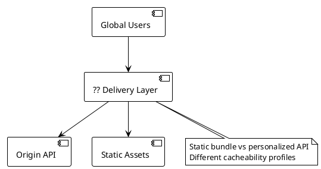

Scenario A: Static React bundle (1.2MB JS), same file for all users, changes weekly, users globally distributed, target <200ms TTFB.

Scenario B: Personalized recommendation API returning top 10 products for this user, requires user purchase history + real-time inventory, 2KB JSON, target <100ms.

**Which architecture is correct for each scenario?**

- A) CDN for both
- B) CDN for Scenario A; origin API with CDN passthrough for Scenario B
- C) Edge computing (Cloudflare Workers / Lambda@Edge) for Scenario B
- D) Origin only for both

---

### Q152. DNS TTL Strategy [★★☆]

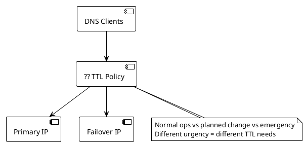

Three scenarios: (A) Production service, IP changes every 2 years, 1M req/sec, need failover within 5 minutes. (B) Planned maintenance in 3 days, need all clients on new IP within 1 hour. (C) Emergency failover needed in under 60 seconds.

**What TTL strategy handles all three scenarios?**

- A) Static TTL of 300 seconds
- B) TTL ladder
- C) Always TTL=30 seconds
- D) TTL=0 for all

---

### Q153. Content Delivery Optimization [★★☆]

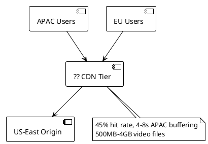

Video streaming platform: 500MB-4GB files, 50M global users (heavy APAC/EU), 100K concurrent streams. CDN hit rate currently 45%. APAC users experience 4-8 second buffering from long round-trips to US-East origin.

**What CDN optimization improves hit rate and reduces APAC latency?**

- A) Increase CDN edge node memory
- B) Multi-tier CDN with regional origin shields
- C) Move origin to Singapore
- D) Increase video chunk size

---

### Q154. Anycast vs Unicast Routing [★★☆]

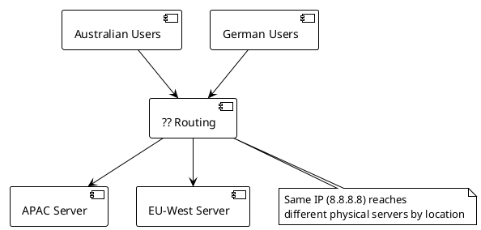

The same IP address (8.8.8.8) routes Australian users to APAC servers and German users to EU-West servers. Both reach different physical servers but via the same IP address.

**What routing mechanism enables this?**

- A) GeoDNS
- B) Anycast routing
- C) Load balancer with geographic rules
- D) DNS round-robin

---

### Q155. CDN for Dynamic Content [★★☆]

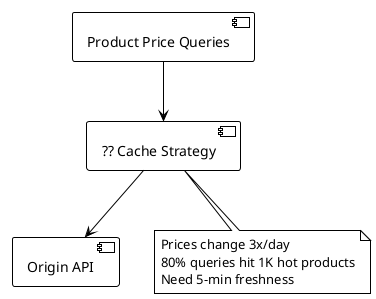

Product price API: prices change 3x/day, 1M products, 80% of queries hit 1,000 hot products. Currently Cache-Control: no-cache on all responses. Goal: reduce origin load 80% while keeping prices fresh within 5 minutes.

**What CDN caching strategy achieves 80% origin offload with 5-minute freshness?**

- A) Cache all responses for 24 hours
- B) `Cache-Control: public, max-age=300, stale-while-revalidate=60`
- C) Cache with surrogate keys, purge on price change
- D) Edge-side personalization

---

### Q156. DNS Load Balancing vs Layer 7 [★★☆]

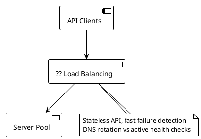

DNS round-robin returns different IPs per query; server failure stays in DNS rotation until TTL expires and DNS is updated. Layer 7 ALB: single IP, active health checks every 30 seconds, removes failed servers within 60 seconds.

**Which is correct for a stateless API needing fast failure detection?**

- A) DNS round-robin
- B) Layer 7 load balancer (ALB/Nginx)
- C) DNS round-robin with TTL=5 seconds
- D) Client-side retry

---

### Q157. Edge Caching for A/B Tests [★★☆]

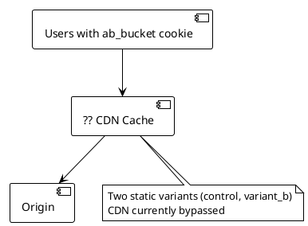

A/B test: 50% control, 50% variant B, assigned via cookie (ab_bucket=control|variant_b). Currently all responses bypass CDN because CDN can't differentiate buckets. Both variants are static beyond the bucket assignment.

**What CDN configuration enables caching both variants?**

- A) Cache by URL path
- B) `Vary: Cookie` header
- C) CDN cache key includes only `ab_bucket` cookie value
- D) Edge A/B assignment

---

### Q158. CDN Security: DDoS Mitigation [★★☆]

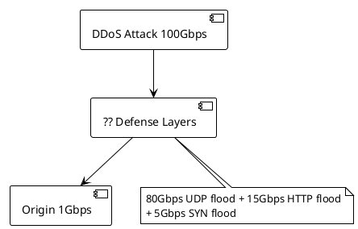

100Gbps DDoS attack: 80Gbps UDP flood, 15Gbps HTTP GET flood (300K req/sec), 5Gbps SYN flood. Origin bandwidth: 1Gbps.

**What layered defense correctly handles each attack vector?**

- A) Scale origin servers
- B) CDN absorbs volumetric attacks at edge with rate-limiting, SYN proxy, and origin IP hiding
- C) WAF rules on origin
- D) Increase origin bandwidth to 100Gbps

---

### Q159. Prefetching and Preloading [★★☆]

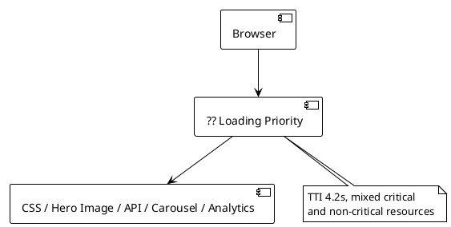

E-commerce page: Time to interactive 4.2 seconds. Resources: (A) Main CSS (blocking render), (B) Hero image (above fold), (C) Product API data (needed for render), (D) Related products carousel (below fold), (E) Analytics script (non-critical).

**What loading strategy correctly prioritizes resources?**

- A) Load all simultaneously
- B) Preload CSS and hero image; server-side prefetch API data; prefetch carousel; async analytics
- C) Inline CSS and JS
- D) Lazy load all images including hero

---

### Q160. HTTP/2 vs HTTP/3 [★★☆]

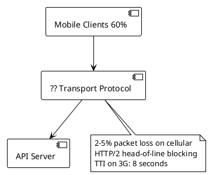

Mobile-heavy traffic (60% mobile), 2-5% packet loss on cellular, 20+ API calls per page. HTTP/2 head-of-line blocking at TCP layer: single packet loss stalls ALL streams. Time to interactive on 3G: 8 seconds.

**What protocol change addresses this?**

- A) HTTP/1.1 with connection pooling
- B) HTTP/3 (QUIC)
- C) HTTP/2 with server push
- D) WebSocket multiplexing

---

### Q161. Cache Warming for New Edge PoPs [★★☆]

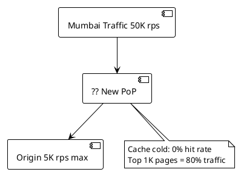

New CDN PoP in Mumbai. Cache cold: 0% hit rate. Expected traffic: 50K req/sec immediately. Origin capacity: 5K req/sec. Top 1,000 pages = 80% of traffic.

**What cache warming strategy prevents origin overload at PoP launch?**

- A) Launch cold into traffic
- B) Pre-warm before routing traffic
- C) Rate-limit Mumbai PoP traffic
- D) Disable cache initially

---

### Q162. DNS-Based Service Discovery [★★☆]

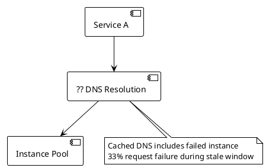

Service A caches DNS result containing failed instance (10.0.1.10) for remaining TTL (up to 30 seconds). 33% of requests fail during stale window.

**What combination minimizes stale DNS impact?**

- A) TTL=0
- B) Short DNS TTL (5-10s) + client retry on connection error
- C) TTL=300s with manual health check alerts
- D) Switch to service mesh

---

### Q163. Edge Computing Use Cases [★★☆]

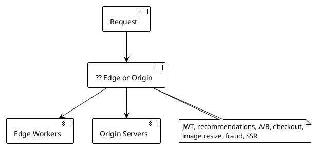

Classify for edge vs origin: (A) JWT validation, (B) Personalized recommendations (needs ML + user history DB), (C) A/B test bucket assignment, (D) Shopping cart checkout (payment), (E) Image resizing/WebP conversion, (F) Fraud detection (50ms ML inference), (G) Static HTML generation for SEO.

**Which operations are correct for edge execution?**

- A) All at edge
- B) Edge: A, C, E, G (stateless/cacheable); Origin: B, D, F (stateful/data-heavy)
- C) Edge: A, B, C, E; Origin: D, F, G
- D) Nothing at edge

---

## Topic 13: Authentication, Authorization & Security (Q164–Q175)

---

### Q164. OAuth 2.0 Flow Selection [★★☆]

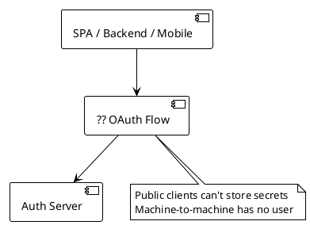

Case A: Single-page React app calling API, cannot store client secret. Case B: Backend service to service, no user involved, same org. Case C: Mobile app calling API, no secret storage possible, deep link callback required.

**Which OAuth 2.0 flow is correct for each case?**

- A) Authorization Code for all
- B) SPA/Mobile: Authorization Code + PKCE; Backend: Client Credentials
- C) SPA/Mobile: Implicit flow; Backend: Client Credentials
- D) SPA: Resource Owner Password; Mobile: Device Code; Backend: Client Credentials

---

### Q165. JWT vs Session Token [★★☆]

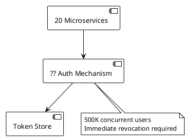

Microservices with 20 independent services, security requirement: immediate revocation on logout, 500K concurrent users.

**JWT or session token — which is correct and why?**

- A) JWT
- B) JWT with short expiry (15 minutes) + Redis revocation list
- C) Session tokens with centralized Redis
- D) Session tokens per service

---

### Q166. RBAC vs ABAC [★★☆]

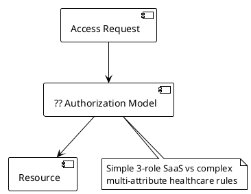

Use Case A: SaaS platform, 3 roles (Admin, Manager, Viewer), 50K users. Use Case B: Healthcare records — doctor accesses patient IF doctor.department == patient.primaryDepartment OR in care_team AND consent == true AND business_hours AND approved_facility.

**RBAC or ABAC for each?**

- A) RBAC for both
- B) RBAC for Use Case A; ABAC for Use Case B
- C) ABAC for both
- D) Neither

---

### Q167. API Key vs OAuth Token [★☆☆]

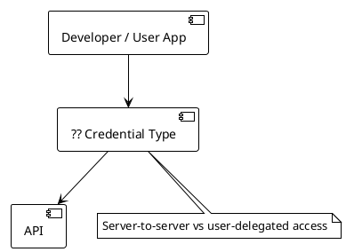

Scenario A: Third-party developer, server-to-server, no user, long-lived credential, rate limiting per developer. Scenario B: User delegates access to third-party app, limited scope, revocable by user.

**API key or OAuth token for each?**

- A) API key for both
- B) API key for Scenario A; OAuth access token for Scenario B
- C) OAuth for both
- D) Session tokens for both

---

### Q168. Password Hashing [★★☆]

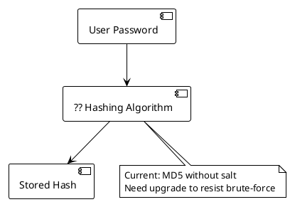

Current: MD5 without salt. Upgrade options: (A) SHA-256 without salt, (B) bcrypt work factor 12, (C) MD5 with salt, (D) Argon2id (memory: 64MB, iterations: 3).

**Which password hashing approach is correct?**

- A) SHA-256 without salt
- B) bcrypt (work factor 12)
- C) MD5 with salt
- D) Argon2id

---

### Q169. SQL Injection Prevention [★☆☆]

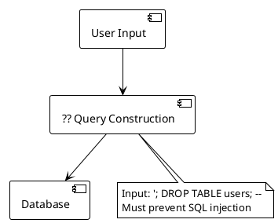

Vulnerable query: `"SELECT * FROM users WHERE username = '" + username + "'"`. User submits `'; DROP TABLE users; --`.

**What is the correct prevention mechanism?**

- A) Escape special characters
- B) Parameterized queries (prepared statements)
- C) Input length validation
- D) Stored procedures

---

### Q170. HTTPS Certificate Management [★★☆]

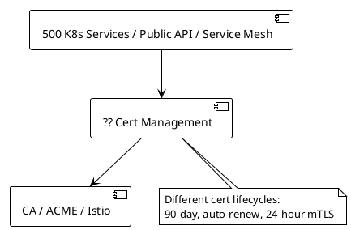

Scenario A: 500 Kubernetes microservices, 90-day certs, 2,000 manual rotations/year. Scenario B: Public API on custom domain, free cert preferred, auto-renewal. Scenario C: Internal service mesh mTLS, 100 services, 24-hour cert TTL.

**What certificate management approach is correct for each?**

- A) Manual rotation for all
- B) K8s: cert-manager; Public API: Let's Encrypt with ACME; Service mesh: Istio/Envoy built-in CA
- C) Self-signed certs for all
- D) Single wildcard cert for all

---

### Q171. Cross-Site Request Forgery (CSRF) [★★☆]

```plantuml
@startuml
!theme plain
skinparam backgroundColor white

[Attacker Page] --> [?? CSRF Defense]
[?? CSRF Defense] --> [Bank API]
note bottom of [?? CSRF Defense]
  Browser auto-sends cookies
  with cross-origin requests
end note
@enduml
```

CSRF attack: attacker page includes ``. Browser sends request WITH bank cookies. Bank processes transfer.

**What is the correct CSRF prevention mechanism?**

- A) HTTPS only
- B) CSRF token (synchronizer token)
- C) SameSite=Strict cookie
- D) Content-Security-Policy

---

### Q172. Secrets Management [★★☆]

```plantuml
@startuml
!theme plain
skinparam backgroundColor white

[Application] --> [?? Secrets Source]
[?? Secrets Source] --> [DB / API Keys / Certs]
note bottom of [?? Secrets Source]
  No secrets in code/env/git
  Auto-rotation + audit needed
end note
@enduml
```

Anti-patterns: DB password in application.properties, API key in environment variable, secrets in Docker layers, secrets in git. Requirements: secrets never in code, automatic rotation, access auditing, Kubernetes deployment.

**What secrets management architecture is correct?**

- A) Environment variables only
- B) HashiCorp Vault or AWS Secrets Manager
- C) Kubernetes Secrets
- D) Encrypted config files in git

---

### Q173. Zero Trust Architecture [★★☆]

```plantuml
@startuml
!theme plain
skinparam backgroundColor white

[Internal Services] --> [?? Trust Model]
[?? Trust Model] --> [Service A]
[?? Trust Model] --> [Service B]
note bottom of [?? Trust Model]
  VPN = implicit trust after entry
  Lateral movement risk
end note
@enduml
```

Traditional VPN model: once inside VPN, all traffic trusted. Lateral movement possible after device compromise.

**What Zero Trust architecture addresses this?**

- A) Stronger VPN with 2FA
- B) Per-request auth, mTLS, device verification, short-lived credentials, and micro-segmentation
- C) Service mesh with mTLS only
- D) Per-service firewall rules

---

### Q174. Content Security Policy [★★☆]

```plantuml
@startuml
!theme plain
skinparam backgroundColor white

[Browser] --> [?? CSP Header]
[?? CSP Header] --> [Allowed Scripts]
note bottom of [?? CSP Header]
  XSS: injected <script> tag
  Must block inline execution
end note
@enduml
```

XSS: attacker submits `<script>document.cookie to attacker.com</script>`. CSP options: (A) `default-src 'self'`, (B) `default-src *`, (C) `default-src 'self'; script-src 'nonce-{random}'`, (D) `default-src 'self'; script-src 'unsafe-inline'`.

**Which CSP prevents the XSS attack?**

- A) `default-src 'self'`
- B) `default-src *`
- C) `default-src 'self'; script-src 'nonce-{random}'`
- D) `default-src 'self'; script-src 'unsafe-inline'`

---

### Q175. mTLS Implementation [★★☆]

```plantuml
@startuml
!theme plain
skinparam backgroundColor white

[100 K8s Services] --> [?? mTLS Layer]
[?? mTLS Layer] --> [Internal CA]
note bottom of [?? mTLS Layer]
  Mutual auth, auto-rotation
  Zero code changes required
end note
@enduml
```

100 Kubernetes services need mutual TLS: both sides authenticate, internal CA, automatic rotation, zero code changes.

**What is the correct mTLS implementation?**

- A) Add TLS client cert handling to each service
- B) Service mesh sidecar (Istio/Envoy)
- C) API Gateway mTLS
- D) IPSec network encryption

---

## Topic 14: Observability (Q176–Q185)

---

### Q176. Three Pillars of Observability [★☆☆]

```plantuml
@startuml
!theme plain
skinparam backgroundColor white

[Checkout Incident] --> [?? Observability Signal]
[?? Observability Signal] --> [Metrics / Traces / Logs]
note bottom of [?? Observability Signal]
  How many failing? Which service slow?
  What happened before failure?
end note
@enduml
```

Incident: checkout is slow. Three questions: (1) How many requests are failing? (2) Which service in the call chain is slow? (3) What did the slow service log before failing?

**Match each question to: Metrics, Traces, or Logs.**

- A) Q1: Logs, Q2: Metrics, Q3: Traces
- B) Q1: Metrics, Q2: Traces, Q3: Logs
- C) Q1: Traces, Q2: Metrics, Q3: Logs
- D) Q1: Metrics, Q2: Logs, Q3: Traces

---

### Q177. Structured Logging [★★☆]

```plantuml
@startuml
!theme plain
skinparam backgroundColor white

[Application Events] --> [?? Log Format]
[?? Log Format] --> [Log Aggregation]
note bottom of [?? Log Format]
  Unstructured text vs structured JSON
  Queryability and correlation
end note
@enduml
```

Format A (unstructured text): `"2025-01-15 14:23:01 ERROR Failed to process order 12345..."`. Format B (structured JSON): `{"timestamp":"...","level":"ERROR","order_id":"12345","trace_id":"abc123",...}`.

**Why is structured logging operationally superior?**

- A) Format A is better
- B) Format B is correct
- C) Both equivalent
- D) Format B is worse

---

### Q178. Metrics Cardinality [★★☆]

```plantuml
@startuml
!theme plain
skinparam backgroundColor white

[http_requests_total] --> [?? Label Strategy]
[?? Label Strategy] --> [Prometheus TSDB]
note bottom of [?? Label Strategy]
  user_id: 50M values
  request_id: unique per request
  OOM crash from cardinality explosion
end note
@enduml
```

Metric: `http_requests_total{service, endpoint, method, status_code, user_id, request_id}`. user_id has 50M unique values. request_id is unique per request. Prometheus stores one time series per unique label combination → OOM crash.

**What is the correct approach?**

- A) Add more Prometheus storage
- B) Remove high-cardinality labels from metrics; use logs/traces for per-user/per-request data
- C) Different metrics backend
- D) Sample metrics at 1%

---

### Q179. Alerting on Symptoms vs Causes [★★☆]

```plantuml
@startuml
!theme plain
skinparam backgroundColor white

[Alert Candidates] --> [?? Classification]
[?? Classification] --> [Page / Investigate]
note bottom of [?? Classification]
  CPU, memory, error rate, P99,
  connection pool, disk usage
end note
@enduml
```

Alert options: A) CPU > 80%, B) Memory > 90%, C) Error rate > 1% for 5 minutes, D) P99 latency > 2,000ms for 5 minutes, E) DB connection pool > 95%, F) Disk usage > 85%.

**Which are symptom-based (alert immediately) vs cause-based (investigate)?**

- A) All are symptoms
- B) Symptoms: C (error rate), D (P99 latency); Causes: A (CPU), B (memory), E (connection pool), F (disk)
- C) All are causes
- D) Symptoms: A, C, D; Causes: B, E, F

---

### Q180. Distributed Tracing Sampling [★★☆]

```plantuml
@startuml
!theme plain
skinparam backgroundColor white

[100K req/sec Traces] --> [?? Sampling Strategy]
[?? Sampling Strategy] --> [Trace Storage 500MB/s]
note bottom of [?? Sampling Strategy]
  Full tracing: 5GB/s
  Budget: 500MB/s (10%)
end note
@enduml
```

100K req/sec generating traces. Each trace: 50KB. Full tracing: 5GB/sec. Storage budget: 500MB/sec. Options: (A) Head-based 10%, (B) Tail-based sampling, (C) Adaptive, (D) No sampling.

**Which sampling strategy correctly balances storage with observability value?**

- A) Head-based 10%
- B) Tail-based sampling (always store errors + slow requests, sample successful ones)
- C) Adaptive sampling
- D) No sampling

---

### Q181. SLO Error Budget [★★☆]

```plantuml
@startuml
!theme plain
skinparam backgroundColor white

[Risky Deployment] --> [?? Error Budget Check]
[?? Error Budget Check] --> [Deploy / Freeze]
note bottom of [?? Error Budget Check]
  99.9% SLO = 43.2 min budget
  30 min used, 13.2 min remaining
  Deploy risk: ~8 min downtime
end note
@enduml
```

SLO: 99.9% availability/month = 43.2 minutes error budget. Used: 30 minutes (5 min incident + 15 min maintenance + 10 min ongoing). Remaining: 13.2 minutes. Risky deployment historically causes 8 minutes downtime.

**What is the correct decision based on error budget principles?**

- A) Deploy anyway
- B) Freeze deploys; protect remaining budget
- C) Increase SLO to 99.5%
- D) Deploy in maintenance window

---

### Q182. Log Aggregation Architecture [★★☆]

```plantuml
@startuml
!theme plain
skinparam backgroundColor white

[50 K8s Services 5TB/day] --> [?? Log Pipeline]
[?? Log Pipeline] --> [Hot Storage]
[?? Log Pipeline] --> [Cold Storage]
note bottom of [?? Log Pipeline]
  30-day hot, 1-year cold
  Full-text search, cost-optimized
end note
@enduml
```

50 Kubernetes microservices, 5TB/day logs. Requirements: full-text search, 30-day hot retention, 1-year cold retention, <5s query latency, cost-optimized.

**Which log pipeline is most cost-efficient?**

- A) Direct to Elasticsearch
- B) Fluent Bit to Kafka to Logstash to Elasticsearch
- C) Fluent Bit to S3 (1-year cold) + Elasticsearch (30-day hot) with Athena for cold queries
- D) Cloud vendor logging

---

### Q183. Anomaly Detection in Metrics [★★☆]

```plantuml
@startuml
!theme plain
skinparam backgroundColor white

[Order Rate Signal] --> [?? Detection Model]
[?? Detection Model] --> [Alert / No Alert]
note bottom of [?? Detection Model]
  Weekday/evening/night patterns
  Black Friday spikes
  Must detect drops, ignore expected variance
end note
@enduml
```

Order rate: 1,000-1,500/min weekdays, 200-400/min evenings, 50-150/min nights, 8,000/min Black Friday. Alert on abnormally LOW order rate (payment failure), not on Black Friday spike or weekend dip. Static threshold (<500/min) fails both requirements.

**What anomaly detection handles seasonality correctly?**

- A) Higher static threshold (<2,000/min)
- B) Seasonal decomposition + dynamic baseline
- C) Alert on percentage drop
- D) Manual threshold updates for each event

---

### Q184. Health Check Design [★★☆]

```plantuml
@startuml
!theme plain
skinparam backgroundColor white

[K8s Probes] --> [?? Health Endpoint Design]
[?? Health Endpoint Design] --> [Liveness / Readiness / Startup]
note bottom of [?? Health Endpoint Design]
  Liveness: restart on deadlock, not DB outage
  Readiness: remove from LB if deps down
  Startup: 45s boot time
end note
@enduml
```

Liveness: "Is JVM running?" — should restart on deadlock/OOM, NOT on DB outage. Readiness: "Can serve traffic?" — remove from LB if DB unreachable, NOT if just slow. Startup: Spring Boot takes 45 seconds.

**What health check configuration is correct?**

- A) Same /health for liveness, readiness, startup
- B) Liveness: JVM-only check; Readiness: check DB + cache + circuit breakers; Startup: 50s delay before probing
- C) HTTP 200 check on port only
- D) Database query as liveness check

---

### Q185. OpenTelemetry Collector [★★☆]

```plantuml
@startuml
!theme plain
skinparam backgroundColor white

[50 Services (Java/Python/Go)] --> [?? Telemetry Pipeline]
[?? Telemetry Pipeline] --> [Jaeger / Prometheus / Elasticsearch]
note bottom of [?? Telemetry Pipeline]
  150 SDK configs to manage
  Backend migration = 50 SDK changes
end note
@enduml
```

50 services (Java, Python, Go) emit traces→Jaeger, metrics→Prometheus, logs→Elasticsearch. 150 SDK configurations to manage. Backend migration (Jaeger→Tempo) requires 50 SDK changes.

**What telemetry pipeline decouples services from backends?**

- A) Each service exports directly
- B) OpenTelemetry Collector as gateway
- C) Fluent Bit for all signals
- D) Service mesh for all telemetry

---

## Topic 15: Classic System Design Problems (Q186–Q200)

---

### Q186. URL Shortener — Core Design [★★☆]

```plantuml
@startuml
!theme plain
skinparam backgroundColor white

[Long URL] --> [?? Shortening Architecture]
[?? Shortening Architecture] --> [Short Code + Storage + Cache]
note bottom of [?? Shortening Architecture]
  100M URLs/day, 10B redirects/day
  7-char code, <10ms P99 redirect
end note
@enduml
```

Requirements: 100M URLs/day created, 10B redirects/day (100:1 read:write), 7-char code, redirect <10ms P99, optional expiry, click analytics.

**What is the correct architecture for code generation, storage, and redirect performance?**

- A) Sequential ID + base62 + MySQL
- B) Hash-based 7-char code with Cassandra storage and Redis read cache
- C) UUID as short code with PostgreSQL and CDN redirect
- D) Pre-generate all 7-char codes

---

### Q187. URL Shortener — Analytics [★★☆]

```plantuml
@startuml
!theme plain
skinparam backgroundColor white

[115K clicks/sec] --> [?? Analytics Pipeline]
[?? Analytics Pipeline] --> [Aggregated Counts + Leaderboard]
note bottom of [?? Analytics Pipeline]
  Hot row contention on direct UPDATE
  Need real-time top-100
end note
@enduml
```

115K clicks/sec must be counted per URL. Anti-pattern: `UPDATE urls SET click_count = click_count + 1` causes hot row contention.

**What analytics architecture handles this write volume?**

- A) Synchronous DB increment
- B) Click events via Kafka, Flink minute-aggregation to TimescaleDB, Redis sorted set for top-100
- C) Redis INCR per click, sync to DB every 5 minutes
- D) 1% sampling, multiply by 100

---

### Q188. Real-Time Chat System [★★☆]

```plantuml
@startuml
!theme plain
skinparam backgroundColor white

[1M Concurrent Users] --> [?? Message Delivery]
[?? Message Delivery] --> [Connection Servers + Storage]
note bottom of [?? Message Delivery]
  <100ms delivery, offline support
  Group chats up to 500 members
end note
@enduml
```

50M DAU, 1M concurrent WebSocket connections, <100ms P99 delivery, message persistence, offline delivery, group chats (500 members), read receipts, multi-device.

**What is the correct message delivery architecture?**

- A) Direct peer-to-peer
- B) Connection servers with Redis Pub/Sub fan-out, Cassandra persistence, and push for offline
- C) All connections to one server
- D) HTTP polling every 1 second

---

### Q189. News Feed System [★★★]

```plantuml
@startuml
!theme plain
skinparam backgroundColor white

[Post Created] --> [?? Fan-out Strategy]
[?? Fan-out Strategy] --> [Follower Feeds]
note bottom of [?? Fan-out Strategy]
  500M DAU, 200 avg follows
  Celebrities up to 10M followers
end note
@enduml
```

500M DAU, 200 average follows, celebrities up to 10M followers, <500ms feed load.

**Which fan-out strategy is correct?**

- A) Fan-out on write for all
- B) Fan-out on read for all
- C) Hybrid: fan-out on write for normal users, fan-out on read for celebrities (>1M followers)
- D) No caching, real-time feed computation

---

### Q190. Notification System [★★★]

```plantuml
@startuml
!theme plain
skinparam backgroundColor white

[Event Source] --> [?? Notification Architecture]
[?? Notification Architecture] --> [APNs / FCM / Email / SMS]
note bottom of [?? Notification Architecture]
  1B/day, priority routing
  Deduplication + retry + preferences
end note
@enduml
```

1B notifications/day, channels: iOS push (APNs), Android (FCM), email, SMS. Priority: urgent (<1s), normal (<30s). User preferences, deduplication, retry, multilingual templates.

**What is the correct architecture?**

- A) Synchronous HTTP from event source to each channel API
- B) Kafka-backed pipeline with preference filtering, Redis deduplication, per-channel priority queues, and retry with DLQ
- C) Direct call from each microservice
- D) Batch every hour

---

### Q191. Search Autocomplete [★★☆]

```plantuml
@startuml
!theme plain
skinparam backgroundColor white

[User Prefix Input] --> [?? Suggestion Engine]
[?? Suggestion Engine] --> [Top 5 Ranked Suggestions]
note bottom of [?? Suggestion Engine]
  <50ms P99, 100M queries/day
  Daily trend updates
end note
@enduml
```

Return top 5 ranked suggestions for any prefix in <50ms P99. Update trends daily. 100M queries/day (1,160/sec). Prefix length 1-20 characters.

**What data structure and storage correctly powers autocomplete?**

- A) SQL LIKE query
- B) Pre-computed trie in Redis with nightly rebuild from search logs
- C) Elasticsearch completion suggester
- D) In-memory trie per app server

---

### Q192. Rate-Limited API Gateway [★★☆]

```plantuml
@startuml
!theme plain
skinparam backgroundColor white

[500K req/sec] --> [?? Rate Limiter]
[?? Rate Limiter] --> [API Backend]
note bottom of [?? Rate Limiter]
  10M consumers, per-consumer limits
  <5ms latency budget
  Redis bottleneck at scale
end note
@enduml
```

10M API consumers, rate limits per consumer + endpoint, 500K req/sec peak, <5ms latency budget for rate limiter. Redis check adds 1-2ms. At 500K req/sec: 500K Redis calls/sec → Redis bottleneck.

**What architecture reduces Redis calls while maintaining accuracy?**

- A) Local counter per gateway node
- B) Redis pipeline batching + local token bucket approximation
- C) Consistent hash routing per API key
- D) PostgreSQL for rate state

---

### Q193. Distributed File Storage [★★★]

```plantuml
@startuml
!theme plain
skinparam backgroundColor white

[500M Users x 10GB] --> [?? Storage Architecture]
[?? Storage Architecture] --> [Deduplicated Block Store]
note bottom of [?? Storage Architecture]
  5 exabytes total
  Dedup + efficient sync
  99.99% availability, 11 nines durability
end note
@enduml
```

500M users, 10GB each = 5 exabytes. Deduplication required. Sync: only changed blocks. 99.99% availability, 11 nines durability.

**What storage architecture handles deduplication and efficient sync?**

- A) Store each file as one object in S3
- B) Block-level chunking + content-addressed storage
- C) Compression only
- D) NFS for all users

---

### Q194. Ride-Sharing Location Service [★★★]

```plantuml
@startuml
!theme plain
skinparam backgroundColor white

[5M Drivers @ 4s intervals] --> [?? Location Store]
[?? Location Store] --> [Nearby Query <200ms]
note bottom of [?? Location Store]
  1.25M updates/sec
  Geospatial: drivers within 5km
end note
@enduml
```

5M active drivers, location update every 4 seconds = 1.25M updates/sec. Nearby query: drivers within 5km. Query latency <200ms. Rider app refreshes every 5 seconds.

**What architecture handles write throughput and geospatial queries?**

- A) PostgreSQL with PostGIS
- B) Redis Geospatial + Cassandra for persistence
- C) MongoDB sharded cluster
- D) In-memory geographic grid

---

### Q195. Video Streaming Platform [★★★]

```plantuml
@startuml
!theme plain
skinparam backgroundColor white

[Upload 500 hrs/min] --> [?? Transcode + Deliver]
[?? Transcode + Deliver] --> [1B Views/day via CDN]
note bottom of [?? Transcode + Deliver]
  5 resolutions, 1 exabyte storage
  Adaptive bitrate streaming
end note
@enduml
```

500 hours uploaded/minute, transcode to 5 resolutions, 1 exabyte storage, 1B views/day globally, adaptive bitrate streaming.

**What is the correct transcoding and delivery architecture?**

- A) Single transcoding server
- B) Upload to S3, queued parallel transcoding to HLS/DASH segments, delivered via multi-tier CDN
- C) Transcode on first playback
- D) P2P delivery

---

### Q196. Web Crawler [★★★]

```plantuml
@startuml
!theme plain
skinparam backgroundColor white

[1B Pages/day] --> [?? Crawler Architecture]
[?? Crawler Architecture] --> [100 Crawler Nodes]
note bottom of [?? Crawler Architecture]
  URL dedup, robots.txt compliance
  1 req/sec/domain, PageRank priority
end note
@enduml
```

Crawl 1B pages/day, respect robots.txt, avoid duplicate content, max 1 req/sec per domain, prioritize high-PageRank pages, 100 crawler nodes.

**What architecture addresses URL deduplication, rate limiting, and prioritization?**

- A) Single crawler with local seen-set
- B) Domain-partitioned URL frontier with Bloom filter dedup, per-domain rate limiting, and PageRank priority queue
- C) Database seen-set
- D) Single priority queue

---

### Q197. Recommendation Engine [★★★]

```plantuml
@startuml
!theme plain
skinparam backgroundColor white

[100M Users x 5M Products] --> [?? Recommendation Architecture]
[?? Recommendation Architecture] --> [Top-K Items <100ms]
note bottom of [?? Recommendation Architecture]
  Weekly batch retrain
  Real-time behavior updates
  Cold start for new users
end note
@enduml
```

100M users, 5M products, <100ms P99 serving, weekly batch retrain, real-time behavior updates. Cold start: new user with no history.

**What architecture combines offline training with online serving?**

- A) Real-time collaborative filtering on every request
- B) Pre-computed embeddings with ANN search, online learning for real-time updates, content-based cold start fallback
- C) Popularity-based for all users
- D) User-user collaborative filtering

---

### Q198. Distributed Task Scheduler [★★☆]

```plantuml
@startuml
!theme plain
skinparam backgroundColor white

[1M Tasks/day] --> [?? Scheduler Architecture]
[?? Scheduler Architecture] --> [100 Workers]
note bottom of [?? Scheduler Architecture]
  At-most-once execution
  Worker failure recovery
  Priority + delayed execution
end note
@enduml
```

1M tasks/day, 100 workers, at-most-once execution, worker failure recovery, priority queues, delay queue for future execution.

**What architecture provides at-most-once scheduling with failure recovery?**

- A) Cron on each worker
- B) Redis sorted set delay queue with atomic task assignment and visibility timeout for failure recovery
- C) Kafka with delayed delivery
- D) Database polling with SELECT FOR UPDATE SKIP LOCKED

---

### Q199. Consistent Hashing in Chat Routing [★★★]

```plantuml
@startuml
!theme plain
skinparam backgroundColor white

[10K Chat Rooms] --> [?? Routing Strategy]
[?? Routing Strategy] --> [100 Connection Servers]
note bottom of [?? Routing Strategy]
  Stateful rooms, auto-scaling servers
  Minimize remapping on scale events
end note
@enduml
```

10K chat rooms, 100 connection servers (auto-scaling). Chat rooms are stateful. With pub/sub, server affinity not required. How to route users to the same server for their room without a central coordinator?

**How does consistent hashing solve the chat room routing problem?**

- A) Round-robin routing
- B) Consistent hashing of room_id to server, minimizing remapping on scale events
- C) Sticky sessions by user_id
- D) Random selection

---

### Q200. End-to-End Instagram-Like Feed [★★★]

```plantuml
@startuml
!theme plain
skinparam backgroundColor white

[1B DAU] --> [?? Component Architecture]
[?? Component Architecture] --> [Photos / Graph / Feed / Engagement]
note bottom of [?? Component Architecture]
  100M photos/day, 1B feed loads
  Storage + social graph + feed + real-time
end note
@enduml
```

1B DAU, 100M photos/day, 1B feed loads/day, 200 average follows, photo storage original + 3 resolutions, like/comment counts, real-time new posts, personalized feed.

**Which component assignment is architecturally correct?**

- A) Single database for everything
- B) S3+CDN for photos, Cassandra for metadata/graph, hybrid fan-out feed in Redis, real-time via WebSocket/SSE
- C) All on AWS RDS
- D) Synchronous REST fan-out

---
