# System Design — Decision-Based Questions
## Batch 5: Q201–Q220 — Back-of-Envelope Estimation

---

### Q201. Twitter Daily Tweet Storage Estimation [★☆☆]

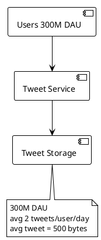

Twitter has 500M monthly active users, 300M daily active users. On average, each daily active user posts 2 tweets per day. Each tweet consists of 280 characters of text plus metadata (user ID, timestamp, geo, counters), totaling approximately 500 bytes per tweet. Ignoring media attachments, estimate the **daily raw text storage** needed for tweets.

**Which estimation is closest?**

- A) 30 GB/day
- B) 300 GB/day
- C) 3 TB/day
- D) 30 TB/day

---

### Q202. YouTube Video Upload Bandwidth [★★☆]

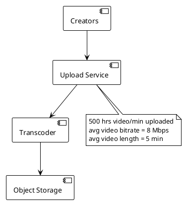

YouTube receives approximately 500 hours of video uploaded every minute. The average uploaded video is encoded at 8 Mbps bitrate and has an average length of 5 minutes. Estimate the **sustained ingress bandwidth** required for video uploads alone.

**Which estimation is closest?**

- A) 40 Gbps
- B) 400 Gbps
- C) 4 Tbps
- D) 40 Tbps

---

### Q203. Instagram Image Storage Per Year [★☆☆]

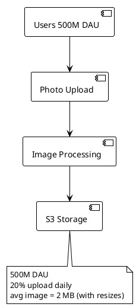

Instagram has roughly 2B monthly active users and 500M daily active users. About 20% of daily active users upload at least one photo per day. Each original photo is approximately 500 KB, but after generating 4 resized versions (thumbnail, small, medium, large), the total per photo is about 2 MB. Estimate the **annual storage growth** for photos only.

**Which estimation is closest?**

- A) 7 PB/year
- B) 73 PB/year
- C) 730 PB/year
- D) 7.3 EB/year

---

### Q204. WhatsApp Message QPS [★☆☆]

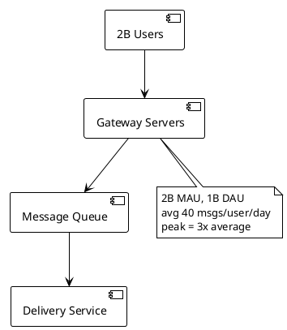

WhatsApp has approximately 2B monthly active users and 1B daily active users. Each daily active user sends an average of 40 messages per day. Messages are distributed unevenly throughout the day, with peak traffic roughly 3x the average. Estimate the **peak queries per second (QPS)** for message sends.

**Which estimation is closest?**

- A) 46K QPS
- B) 460K QPS
- C) 1.4M QPS
- D) 14M QPS

---

### Q205. Netflix Cache Memory for Popular Content Metadata [★★☆]

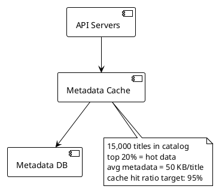

Netflix has approximately 15,000 titles in its catalog. Each title has metadata (description, cast, ratings, episode lists, artwork URLs, recommendation scores per region) averaging 50 KB per title. To achieve a 95% cache hit ratio, you want to cache the top 20% most-accessed titles plus session-level personalization data. There are 10M concurrent users, each with a 2 KB personalized recommendation payload in cache. Estimate the **total cache memory** needed across the fleet.

**Which estimation is closest?**

- A) 2 GB
- B) 20 GB
- C) 200 GB
- D) 2 TB

---

### Q206. Uber Ride-Matching QPS at Peak [★★☆]

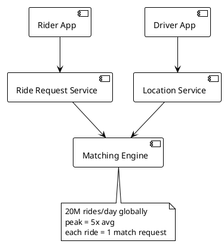

Uber completes approximately 20 million rides per day globally. Ride requests are heavily concentrated during morning and evening rush hours. Peak traffic is roughly 5x the daily average rate. Each ride request triggers one match query against the driver location index. Estimate the **peak QPS** for the ride-matching engine.

**Which estimation is closest?**

- A) 120 QPS
- B) 1,200 QPS
- C) 12,000 QPS
- D) 120,000 QPS

---

### Q207. Slack Message Database Row Size and Annual Growth [★★☆]

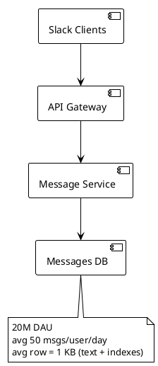

Slack has roughly 20M daily active users. Each user sends an average of 50 messages per day. Each message row in the database includes the message body (avg 200 bytes), plus metadata columns (sender_id, channel_id, workspace_id, timestamp, edit history, reactions, thread_parent_id) and secondary indexes, totaling about 1 KB per row. Estimate the **annual database storage growth** for messages.

**Which estimation is closest?**

- A) 36 TB/year
- B) 365 TB/year
- C) 3.6 PB/year
- D) 36 PB/year

---

### Q208. Google Search Number of Servers for Web Crawling [★★★]

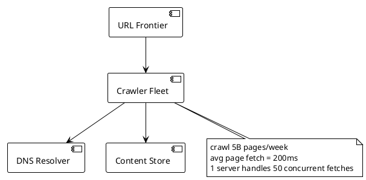

Google needs to crawl approximately 5 billion web pages per week to keep its index fresh. Each page fetch takes an average of 200ms (including DNS lookup, TCP connect, download). A single crawler server can handle 50 concurrent fetches using async I/O, so each server processes about 250 pages/second. The crawler fleet must operate continuously 24/7. Estimate the **number of crawler servers** needed.

**Which estimation is closest?**

- A) 330 servers
- B) 3,300 servers
- C) 33,000 servers
- D) 330,000 servers

---

### Q209. TikTok CDN Bandwidth for Video Serving [★★☆]

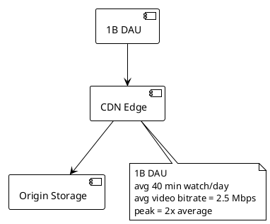

TikTok has approximately 1B daily active users. The average user watches 40 minutes of video per day. Videos are served at an average bitrate of 2.5 Mbps (adaptive, mixing 720p and 1080p). Assume viewing is spread across 16 active hours per day and peak load is 2x the average during those hours. Estimate the **peak egress bandwidth** from TikTok's CDN.

**Which estimation is closest?**

- A) 10 Tbps
- B) 100 Tbps
- C) 1 Pbps
- D) 10 Pbps

---

### Q210. Redis Cache Sizing for Session Store [★☆☆]

```plantml
@startuml
!theme plain
skinparam backgroundColor white

[Web Servers] --> [Redis Cluster]
[Redis Cluster] --> [Session Data]
note bottom of [Redis Cluster]
  50M concurrent sessions
  avg session = 2 KB
  Redis overhead = 1.5x raw data
end note
@enduml
```

An e-commerce platform has 200M daily active users, with an average session duration of 30 minutes. At peak, approximately 50M users are concurrently active. Each session object contains user preferences, cart state, auth tokens, and CSRF tokens, totaling about 2 KB of raw data. Redis has a memory overhead of roughly 1.5x the raw data size due to internal data structures and pointers. Estimate the **total Redis memory** needed for the session store.

**Which estimation is closest?**

- A) 15 GB
- B) 150 GB
- C) 1.5 TB
- D) 15 TB

---

### Q211. Facebook News Feed Fanout Write QPS [★★★]

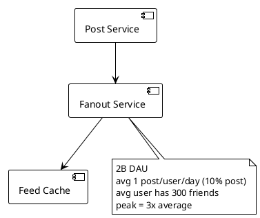

Facebook has approximately 2B daily active users. About 10% of DAU create at least one post per day, generating 200M new posts daily. Using a push (fanout-on-write) model for non-celebrity users, each post must be written to the news feed cache of each friend. The average user has 300 friends. Peak write traffic is 3x the average. Estimate the **peak fanout write operations per second**.

**Which estimation is closest?**

- A) 2.4M writes/sec
- B) 24M writes/sec
- C) 240M writes/sec
- D) 2.4B writes/sec

---

### Q212. Spotify Audio Storage Estimation [★☆☆]

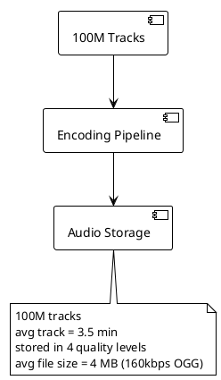

Spotify hosts approximately 100 million tracks. Each track averages 3.5 minutes in length. Each track is encoded and stored in 4 quality levels (low 24kbps, normal 96kbps, high 160kbps, very high 320kbps). The average file size across all quality levels is about 4 MB per version. Estimate the **total audio storage** required.

**Which estimation is closest?**

- A) 160 TB
- B) 1.6 PB
- C) 16 PB
- D) 160 PB

---

### Q213. DoorDash Number of Servers for Order Processing [★★☆]

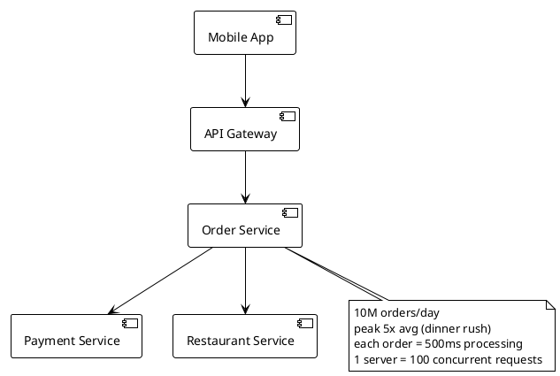

DoorDash processes approximately 10 million orders per day. Orders are heavily concentrated during lunch (11am-1pm) and dinner (5pm-8pm) windows, where peak traffic is roughly 5x the daily average rate. Each order involves payment authorization, restaurant notification, and driver assignment, taking about 500ms of server-side processing. A single application server can handle 100 concurrent requests. Estimate the **number of order-processing servers** needed for peak load.

**Which estimation is closest?**

- A) 3 servers
- B) 29 servers
- C) 290 servers
- D) 2,900 servers

---

### Q214. LinkedIn Connection Graph Database Sizing [★★★]

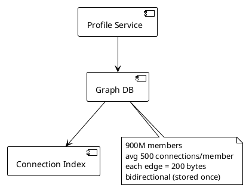

LinkedIn has approximately 900 million members. The average member has 500 first-degree connections. Each connection edge in the graph database stores two user IDs (8 bytes each), a timestamp, connection type, interaction weight, and indexing overhead, totaling about 200 bytes per edge. Connections are bidirectional but stored as a single edge. Estimate the **total storage for the connection graph** (edges only, excluding node data).

**Which estimation is closest?**

- A) 4.5 TB
- B) 45 TB
- C) 450 TB
- D) 4.5 PB

---

### Q215. Zoom Video Conferencing Network Throughput per Server [★★☆]

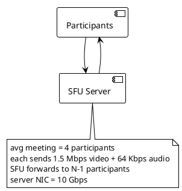

Zoom uses an SFU (Selective Forwarding Unit) architecture. In a typical meeting with 4 participants, each participant sends one video stream at 1.5 Mbps and one audio stream at 64 Kbps. The SFU receives each stream once and forwards it to the other 3 participants. Each media server has a 10 Gbps network interface. Estimate the **maximum number of concurrent 4-person meetings** a single SFU server can handle.

**Which estimation is closest?**

- A) 53 meetings
- B) 530 meetings
- C) 5,300 meetings
- D) 53,000 meetings

---

### Q216. Amazon Product Catalog Cache Memory [★★☆]

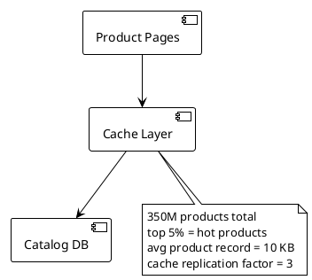

Amazon's product catalog contains roughly 350 million products. Analysis shows that the top 5% of products account for 80% of page views. Each product cache entry (title, price, images URLs, description snippet, availability, seller info, review summary) averages 10 KB. For high availability, the cache is replicated 3x across different availability zones. Estimate the **total cache memory** needed to store the hot product set with replication.

**Which estimation is closest?**

- A) 52.5 GB
- B) 525 GB
- C) 5.25 TB
- D) 52.5 TB

---

### Q217. Stripe Payment Transaction QPS [★★☆]

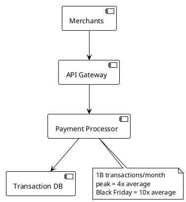

Stripe processes approximately 1 billion payment transactions per month. Traffic follows strong diurnal patterns with peak-to-average ratio of 4x during normal days. On Black Friday/Cyber Monday, the peak reaches 10x the normal average. Each transaction requires a synchronous write to the transaction database. Estimate the **Black Friday peak TPS** (transactions per second).

**Which estimation is closest?**

- A) 3,900 TPS
- B) 39,000 TPS
- C) 390,000 TPS
- D) 3.9M TPS

---

### Q218. GitHub Repository Storage and Database Sizing [★★☆]

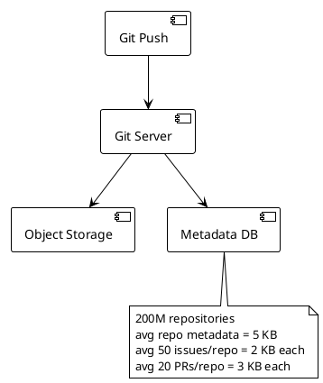

GitHub hosts approximately 200 million repositories. Each repository has metadata (name, description, settings, branch protection rules, webhooks) averaging 5 KB. The average repository has 50 issues (2 KB each including comments) and 20 pull requests (3 KB each including review comments and diff metadata). Estimate the **total relational database storage** for repository metadata, issues, and PRs (excluding git object storage).

**Which estimation is closest?**

- A) 3.3 TB
- B) 33 TB
- C) 330 TB
- D) 3.3 PB

---

### Q219. Cloud Gaming Number of GPU Servers [★★★]

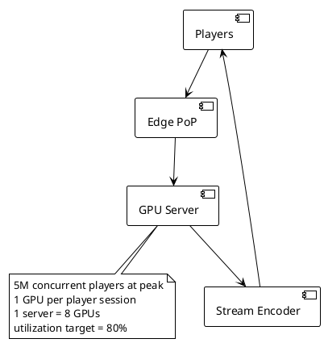

A cloud gaming service (like GeForce NOW or Xbox Cloud Gaming) needs to support 5 million concurrent players at peak. Each player requires a dedicated GPU for real-time game rendering. Each server is equipped with 8 GPUs. To maintain quality of service and allow for failover, the target GPU utilization is 80% (i.e., provision 20% extra capacity). Estimate the **number of GPU servers** required.

**Which estimation is closest?**

- A) 7,800 servers
- B) 78,000 servers
- C) 781,250 servers
- D) 7.8M servers

---

### Q220. Email Service Network Throughput for Sending [★☆☆]

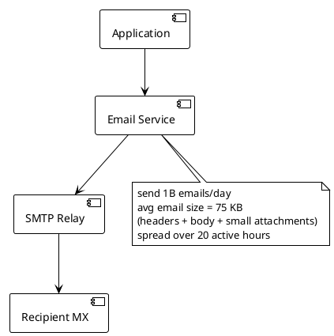

A transactional email service (like SendGrid or Mailgun) sends approximately 1 billion emails per day for its customers. The average email size including headers, HTML body, and small inline images is 75 KB. Email sending is distributed over roughly 20 active hours per day. Estimate the **average outbound network throughput** required.

**Which estimation is closest?**

- A) 8.3 Gbps
- B) 83 Gbps
- C) 830 Gbps
- D) 8.3 Tbps

---
