# System Design — Decision-Based Questions
## Batch 6: Q221–Q270 — Pragmatic System Design Patterns

---

## Topic 16: Concurrency Control & Race Conditions (Q221–Q232)

---

### Q221. Concurrent Bidding Race Condition [★☆☆]

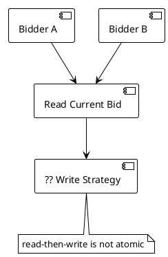

An auction platform handles 100K simultaneous auctions with up to 1K bidders each. Two bidders read the current highest bid of $50, then both attempt to write $55 and $60 respectively. The $55 bid overwrites the $60 bid because the write is not atomic.

**Which concurrency strategy prevents this lost-update problem with acceptable latency?**

- A) Pessimistic locking with row-level locks held for the entire bid evaluation
- B) Optimistic locking using UPDATE WHERE version = expected, retrying on conflict
- C) Application-level mutex synchronized across all service instances
- D) Eventual consistency with last-write-wins conflict resolution

---

### Q222. Coupon Claim Atomicity [★☆☆]

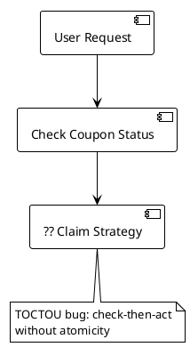

A flash sale system must distribute 10M coupons to 100M users within a 10-minute window, producing 1.2M req/sec at peak. The current implementation checks if a coupon is free, then assigns it — but under load, multiple users claim the same coupon.

**How do you eliminate this TOCTOU (time-of-check-time-of-use) bug?**

- A) Add a distributed lock around the check-then-act sequence
- B) Use a single atomic UPDATE: `UPDATE coupons SET user_id=? WHERE status='free' LIMIT 1`
- C) Queue all requests and process them sequentially in a single thread
- D) Use optimistic locking with version numbers on each coupon row

---

### Q223. Ticket Reservation Linearization [★★☆]

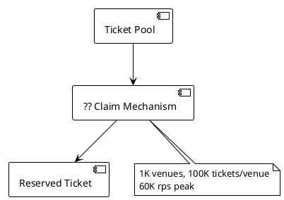

A ticketing system pre-creates 100K ticket rows per venue across 1K venues, handling 60K rps at peak. Multiple users simultaneously attempt to reserve the same seat.

**Which concurrency approach ensures exactly one user claims each ticket?**

- A) Linearization: pre-created rows with atomic UPDATE to claim a free ticket
- B) Optimistic locking with retry loops on every reservation attempt
- C) Distributed lock per seat with 30-second TTL
- D) Queue all reservation requests into a single Kafka partition per venue

---

### Q224. Auction Write Volume Sizing [★★☆]

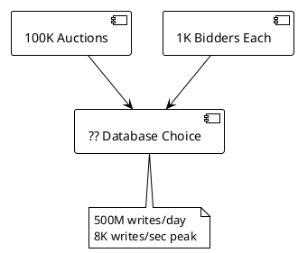

An auction platform processes 500M bid writes per day with 8K writes/sec at peak. Each write requires strong consistency to prevent lost updates via optimistic locking.

**Which database best fits this write pattern with strong consistency?**

- A) Redis — handles 100K+ ops/sec in-memory with single-threaded atomicity
- B) PostgreSQL — supports UPDATE WHERE version = expected with ACID guarantees
- C) Cassandra — optimized for write-heavy workloads with eventual consistency
- D) Elasticsearch — high write throughput with near-real-time indexing

---

### Q225. Queue-Based Bid Serialization Trade-off [★★★]

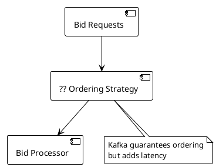

An auction system currently uses optimistic locking but experiences high retry rates (40% of bids fail on first attempt) during the final seconds of popular auctions. The team considers switching to Kafka-based serialization for strict ordering.

**What is the primary trade-off of switching to queue-based serialization?**

- A) Kafka adds write latency, which may cause bids to arrive after auction close
- B) Kafka cannot handle 8K writes/sec peak throughput
- C) Kafka does not guarantee message ordering within a partition
- D) Kafka requires all bidders to share a single consumer, creating a bottleneck

---

### Q226. Optimistic vs Pessimistic Locking Selection [★☆☆]

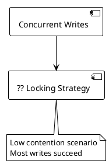

A product catalog service handles 2K updates/sec. Conflicts are rare — fewer than 1% of writes target the same row simultaneously. The team needs to choose between optimistic and pessimistic locking.

**Which locking strategy is the default choice for low-contention scenarios?**

- A) Pessimistic locking to guarantee no conflicts ever occur
- B) Optimistic locking — it is the default for low contention
- C) Queue serialization to enforce strict ordering
- D) No locking needed since conflicts are rare enough to ignore

---

### Q227. Ticket Status Machine Reversal [★★☆]

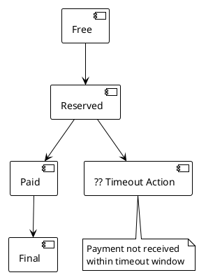

A ticketing system uses the status machine: Free -> Reserved -> Paid -> Final. A user reserves a ticket but does not complete payment within the timeout window.

**What should the system do when a reservation times out?**

- A) Transition to Reversed state, then back to Free for re-availability
- B) Delete the reservation row and re-create a free ticket
- C) Keep the Reserved status indefinitely until the user cancels
- D) Transition directly from Reserved to Final as a no-sale record

---

### Q228. Fixed Inventory Concurrency Pattern [★★☆]

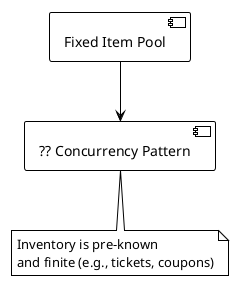

A system manages a fixed, pre-known inventory — such as 10M coupons or 100K tickets per venue. Multiple users attempt to claim items simultaneously.

**Which concurrency pattern is specifically designed for fixed inventory scenarios?**

- A) Optimistic locking with version-based retries
- B) Linearization: pre-create rows and use atomic claims
- C) Pessimistic locking with SELECT FOR UPDATE
- D) Saga pattern with compensating transactions

---

### Q229. Coupon Sharding Strategy [★★★]

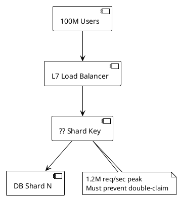

A coupon system handling 1.2M req/sec at peak must shard its database. Coupons are claimed via atomic UPDATE. The system uses an L7 load balancer with request hashing.

**What should the shard key be to prevent double-claiming while distributing load?**

- A) Shard by coupon_id to co-locate coupon state for atomic updates
- B) Shard by user_id with L7 load balancer hashing to ensure per-user consistency
- C) Shard by timestamp to distribute writes evenly across time
- D) Use a single unsharded database with connection pooling

---

### Q230. Strict Ordering Requirement [★☆☆]

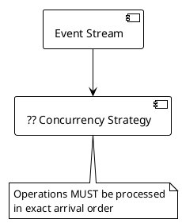

A financial ledger system requires that all transactions for a given account are processed in the exact order they arrive. No transaction may be processed out of sequence, even if it means adding latency.

**Which concurrency strategy enforces strict ordering?**

- A) Optimistic locking with version-based retries
- B) Queue serialization — Kafka partition per account guarantees ordering
- C) Linearization with pre-created rows
- D) Pessimistic locking with row-level locks

---

### Q231. Reservation UUID Correlation [★★☆]

```plantml
@startuml
!theme plain
skinparam backgroundColor white

[Ticket Service] --> [?? Correlation Mechanism]
[?? Correlation Mechanism] --> [Payment Gateway]
note bottom of [?? Correlation Mechanism]
  Async payment confirmation
  via webhook callback
end note
@enduml
```

A ticketing system reserves a ticket and sends the user to an external payment gateway. The payment gateway later sends an asynchronous webhook to confirm payment. The system must match the webhook to the correct reservation.

**How should the system correlate the async payment callback to the reservation?**

- A) Use the ticket ID as the payment reference
- B) Generate a reservation UUID and use it as the payment correlation ID
- C) Match by user email address in the webhook payload
- D) Poll the payment gateway every second until confirmation arrives

---

### Q232. Pessimistic Locking Use Case [★★★]

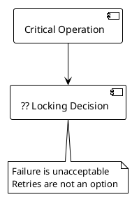

A bank transfer system debits one account and credits another. The operation must never fail due to a conflict — retries could cause inconsistent states. Contention is moderate at 5K ops/sec.

**When should you choose pessimistic locking over optimistic locking?**

- A) When write throughput exceeds 100K ops/sec
- B) When the operation must not fail and retries are not acceptable
- C) When contention is low and most operations succeed
- D) When the system uses eventual consistency

---

## Topic 17: Database Selection & Sharding (Q233–Q242)

---

### Q233. Default Database Selection [★☆☆]

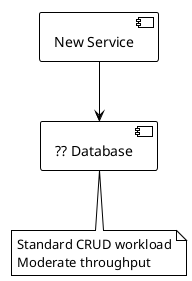

A new microservice handles standard CRUD operations at moderate throughput (under 10K ops/sec). It needs ACID transactions, relational queries, and strong ecosystem support.

**Which database is the default choice for a typical service with no extreme requirements?**

- A) Redis for maximum performance
- B) PostgreSQL as the default relational database
- C) Cassandra for distributed writes
- D) MongoDB for schema flexibility

---

### Q234. High-Throughput Cache Selection [★☆☆]

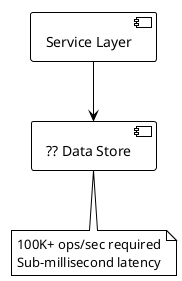

A URL shortener's read path handles 300K reads/sec at peak. The working set is 30GB (1% of 3TB total storage). Reads must return in sub-millisecond latency.

**Which data store handles 100K+ ops/sec with sub-millisecond latency?**

- A) PostgreSQL with connection pooling and read replicas
- B) Redis as a distributed cache for hot data
- C) Elasticsearch with in-memory segments
- D) Cassandra with local quorum reads

---

### Q235. Write-Heavy Database Selection [★★☆]

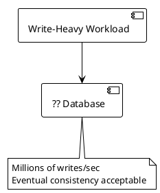

A web crawler stores crawl results for 15B URLs. The workload is heavily write-dominant — every crawl generates a write. Eventual consistency is acceptable since crawl freshness varies by hours.

**Which database is optimized for write-heavy workloads where eventual consistency is acceptable?**

- A) PostgreSQL with write-ahead log tuning
- B) Redis with append-only file persistence
- C) Cassandra — designed for write-heavy workloads with eventual consistency
- D) Elasticsearch with bulk indexing

---

### Q236. Full-Text Search Database [★☆☆]

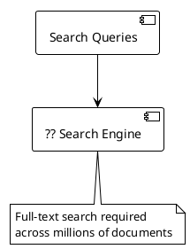

A news feed system needs to support full-text search across millions of posts. Users expect relevance-ranked results with typo tolerance and stemming.

**Which database is purpose-built for full-text search?**

- A) PostgreSQL with GIN indexes on tsvector columns
- B) Elasticsearch — purpose-built for full-text search
- C) Redis with sorted sets and prefix matching
- D) Cassandra with SASI indexes

---

### Q237. Ticketing System Shard Key [★★☆]

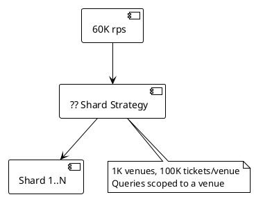

A ticketing system handles 60K rps across 1K venues with 100K tickets per venue. Most queries are scoped to a single venue (list available seats, reserve a seat).

**What should the shard key be?**

- A) Shard by ticket_id using hash-based distribution for even load
- B) Shard by venue — natural partition since queries are venue-scoped
- C) Shard by user_id to distribute user requests evenly
- D) Shard by timestamp using range-based partitioning

---

### Q238. Hash vs Range Sharding [★★☆]

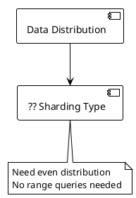

A URL shortener stores 30B URLs over 5 years. Lookups are always by exact short code — never by range. Load must be distributed evenly across shards.

**Which sharding strategy provides even distribution for point lookups?**

- A) Range-based sharding for efficient sequential scans
- B) Hash-based sharding — even distribution for point lookups
- C) Directory-based sharding for flexible routing
- D) Entity-based sharding for co-located data

---

### Q239. Consistent Hashing Benefit [★★★]

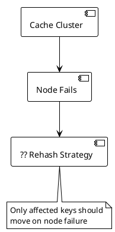

A Redis cache cluster with 10 nodes serves 300K reads/sec. When one node fails, the system must redistribute its keys without invalidating the entire cache.

**Which hashing strategy minimizes key redistribution on node failure?**

- A) Modulo hashing — simple and predictable key placement
- B) Consistent hashing — only affected keys rehash on node failure
- C) Random assignment with a lookup directory
- D) Range-based partitioning with manual rebalancing

---

### Q240. Bloom Filter vs Redis for URL Dedup [★★★]

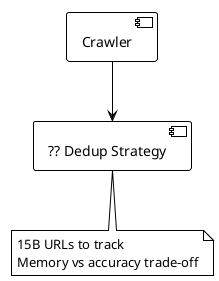

A web crawler must track 15B visited URLs for deduplication. A Bloom filter uses 50GB with ~1 in 1M false positive rate. Redis stores exact URLs but requires 700GB across 70 nodes.

**When should you choose the Bloom filter over Redis for URL deduplication?**

- A) When zero false positives are required for correctness
- B) When memory efficiency matters more than eliminating rare false positives
- C) When you need to delete individual URLs from the set
- D) When the URL set is smaller than available memory

---

### Q241. Entity-Based Sharding [★★☆]

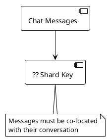

A chat system stores 1B messages/day. Messages in the same conversation must be on the same shard for efficient reads and ordered queries.

**Which sharding approach co-locates related data on the same shard?**

- A) Hash by message_id for even distribution
- B) Entity-based sharding by conversation — natural partition for co-located data
- C) Range by timestamp for time-ordered queries
- D) Random distribution with a lookup table

---

### Q242. One-Percent Cache Sizing Rule [★☆☆]

```plantuml
@startuml
!theme plain
skinparam backgroundColor white

[3TB Total Data] --> [?? Cache Size]
note bottom of [?? Cache Size]
  Pareto principle
  Hot data concentration
end note
@enduml
```

A URL shortener stores 3TB of data total. Access patterns follow a power-law distribution where a small fraction of URLs receive most traffic.

**How much cache do you need based on the 1% rule?**

- A) 300GB — 10% of total data
- B) 30GB — 1% of 3TB total data
- C) 3GB — 0.1% of total data
- D) 150GB — 5% of total data

---

## Topic 18: Communication Protocols & Real-Time Systems (Q243–Q252)

---

### Q243. Default API Protocol [★☆☆]

```plantuml
@startuml
!theme plain
skinparam backgroundColor white

[Client App] --> [?? Protocol]
[?? Protocol] --> [Backend Service]
note bottom of [?? Protocol]
  Standard request-response
  External-facing API
end note
@enduml
```

A new external-facing API serves mobile and web clients with standard request-response patterns. No real-time push or streaming is required.

**Which protocol is the default choice for external-facing APIs?**

- A) WebSockets for low-latency communication
- B) gRPC for efficient binary serialization
- C) REST — the default for standard request-response APIs
- D) Server-Sent Events for push-based updates

---

### Q244. Real-Time Bid Updates Protocol [★★☆]

```plantuml
@startuml
!theme plain
skinparam backgroundColor white

[Auction Server] --> [?? Protocol]
[?? Protocol] --> [1K Bidders]
note bottom of [?? Protocol]
  Bidirectional: bids up,
  updates down in real-time
end note
@enduml
```

An auction system needs to push real-time bid updates to up to 1K concurrent bidders per auction while also receiving new bids. Communication must be bidirectional and low-latency.

**Which protocol supports bidirectional real-time communication?**

- A) REST with polling every 500ms
- B) WebSockets — bidirectional real-time communication
- C) Server-Sent Events for server-to-client push only
- D) gRPC unary calls with client polling

---

### Q245. Chat Polling vs WebSockets [★★☆]

```plantuml
@startuml
!theme plain
skinparam backgroundColor white

[100M Active Users] --> [?? Delivery Protocol]
note bottom of [?? Delivery Protocol]
  Polling: 200K reads/sec overhead
  WebSockets: 3K reads/sec
  60x reduction
end note
@enduml
```

A chat system serves 100M active users. With HTTP polling, every client checks for new messages every 3 seconds, generating 200K reads/sec overhead — mostly empty responses. WebSockets reduce this to 3K reads/sec.

**Why should this chat system use WebSockets over polling?**

- A) WebSockets encrypt messages more securely than HTTP
- B) WebSockets reduce read overhead by 60x, from 200K to 3K reads/sec
- C) WebSockets are simpler to implement than HTTP polling
- D) WebSockets allow the server to batch messages into fewer packets

---

### Q246. Internal Service Communication Protocol [★★☆]

```plantuml
@startuml
!theme plain
skinparam backgroundColor white

[Service A] --> [?? Protocol]
[?? Protocol] --> [Service B]
note bottom of [?? Protocol]
  Internal microservice calls
  High throughput, type safety
end note
@enduml
```

Two internal microservices communicate at high throughput. Both teams own the contract. Type safety and efficient binary serialization are priorities. No browser compatibility is needed.

**Which protocol is best for internal service-to-service communication?**

- A) REST with JSON for universal compatibility
- B) WebSockets for persistent connections
- C) gRPC — efficient binary serialization for internal services
- D) GraphQL for flexible queries

---

### Q247. One-Way Server Push Protocol [★☆☆]

```plantuml
@startuml
!theme plain
skinparam backgroundColor white

[Server] --> [?? Protocol]
[?? Protocol] --> [Client Dashboard]
note bottom of [?? Protocol]
  Server pushes updates
  Client never sends data back
end note
@enduml
```

A monitoring dashboard displays live metrics. The server pushes updates every second, but the client never needs to send data back to the server.

**Which protocol is designed for one-way server-to-client push?**

- A) WebSockets — bidirectional but works for one-way too
- B) Server-Sent Events (SSE) — designed for one-way server push
- C) REST with long polling
- D) gRPC server streaming

---

### Q248. Chat Shard Key for Conversations [★★★]

```plantuml
@startuml
!theme plain
skinparam backgroundColor white

[Message Ingestion] --> [?? Shard Routing]
[?? Shard Routing] --> [DB Shard]
note bottom of [?? Shard Routing]
  Both users in a conversation
  must hit the same shard
end note
@enduml
```

A chat system stores 1B messages/day across shards. Messages between user_a and user_b must land on the same shard regardless of who sends. The system handles 12K writes/sec.

**How should conversation-based sharding determine the shard?**

- A) Hash by sender user_id
- B) Hash by hash(sorted([user_a, user_b])) to ensure both users map to the same shard
- C) Hash by message_id for even distribution
- D) Round-robin across shards for balanced writes

---

### Q249. Message Multiplexer Pattern [★★☆]

```plantuml
@startuml
!theme plain
skinparam backgroundColor white

[Message Writer] --> [?? Decoupling Layer]
[?? Decoupling Layer] --> [Delivery to Recipients]
note bottom of [?? Decoupling Layer]
  Decouple ingestion from delivery
  Handle offline users
end note
@enduml
```

A chat system writes 12K messages/sec. Some recipients are online (deliver immediately via WebSocket), others are offline (store for later retrieval). The write path should not block on delivery.

**Which pattern decouples message ingestion from delivery?**

- A) Synchronous write-then-deliver in the same request handler
- B) Message Multiplexer — decouples ingestion from delivery
- C) Fan-out on write to all recipient queues at ingestion time
- D) Client-side polling for new messages after write confirmation

---

### Q250. Message Delivery Status Design [★☆☆]

```plantuml
@startuml
!theme plain
skinparam backgroundColor white

[Message Sent] --> [?? Status Tracking]
note bottom of [?? Status Tracking]
  Sent, Delivered, Read
  status indicators
end note
@enduml
```

A chat application must show message status: single check for sent, double check for delivered, blue indicator for read. The system handles 1M concurrent chats.

**At which point should the "Delivered" status be confirmed?**

- A) When the message is written to the database
- B) When the recipient's device acknowledges receipt of the message
- C) When the message enters the delivery queue
- D) When the server processes the send request

---

### Q251. 301 vs 302 Redirect for URL Shortener [★★☆]

```plantuml
@startuml
!theme plain
skinparam backgroundColor white

[Short URL Hit] --> [?? Redirect Type]
[?? Redirect Type] --> [Original URL]
note bottom of [?? Redirect Type]
  301: browser caches, no analytics
  302: always hits server
end note
@enduml
```

A URL shortener handles 300K reads/sec at peak. The product team requires click analytics — every redirect must be counted. Using 301 redirects would cause browsers to cache and bypass the server.

**Which redirect type should you use when click analytics are required?**

- A) 301 Permanent Redirect — reduces server load via browser caching
- B) 302 Temporary Redirect — every click hits the server for analytics tracking
- C) 307 Temporary Redirect — preserves HTTP method
- D) 304 Not Modified — uses conditional caching with ETags

---

### Q252. WebSocket Connection Scaling [★★☆]

```plantuml
@startuml
!theme plain
skinparam backgroundColor white

[1M Concurrent Connections] --> [?? Scaling Strategy]
note bottom of [?? Scaling Strategy]
  1M concurrent chats
  Stateful WebSocket connections
end note
@enduml
```

A chat system maintains 1M concurrent WebSocket connections. Each connection is stateful — tied to a specific server instance. Adding more servers requires routing users to their assigned server.

**How do you scale stateful WebSocket connections across multiple servers?**

- A) Use a stateless load balancer with round-robin distribution
- B) Use sticky sessions or consistent hashing to route users to their assigned server
- C) Convert all WebSocket connections to HTTP polling for statelessness
- D) Limit to a single large server with vertical scaling

---

## Topic 19: Caching, Scaling & Resilience Patterns (Q253–Q262)

---

### Q253. Cache-Aside Pattern [★☆☆]

```plantuml
@startuml
!theme plain
skinparam backgroundColor white

[Application] --> [?? Cache Strategy]
[?? Cache Strategy] --> [Cache]
[?? Cache Strategy] --> [Database]
note bottom of [?? Cache Strategy]
  App checks cache first,
  loads from DB on miss
end note
@enduml
```

A URL shortener reads 300K requests/sec at peak. The application should check the cache first and only query the database on a cache miss, then populate the cache for future reads.

**Which caching pattern describes this read-through-application behavior?**

- A) Write-Through — writes go to cache and DB simultaneously
- B) Cache-Aside — application checks cache, loads from DB on miss
- C) Write-Behind — writes go to cache first, async flush to DB
- D) Read-Through — cache itself loads from DB transparently

---

### Q254. Cache Tier Selection [★★☆]

```plantuml
@startuml
!theme plain
skinparam backgroundColor white

[Request] --> [?? Cache Tier]
note bottom of [?? Cache Tier]
  In-process: ns, 1-4GB
  Redis: microseconds, 10-100GB
  CDN: ms, unlimited
end note
@enduml
```

A service needs to cache 30GB of hot URL mappings. In-process cache only supports 1-4GB. CDN is for static assets. The data changes on writes and must be consistent across multiple service instances.

**Which cache tier fits a 30GB distributed working set?**

- A) In-process cache on each service instance for nanosecond latency
- B) Redis — microsecond latency, supports 10-100GB distributed cache
- C) CDN for edge caching with global distribution
- D) Database query cache with result set caching

---

### Q255. Circuit Breaker Configuration [★★☆]

```plantuml
@startuml
!theme plain
skinparam backgroundColor white

[Service] --> [?? Circuit Breaker]
[?? Circuit Breaker] --> [External API]
note bottom of [?? Circuit Breaker]
  5 failures -> OPEN 30s
  -> HALF-OPEN (1 test)
end note
@enduml
```

A payment service calls an external gateway. When the gateway becomes unresponsive, the payment service keeps timing out, exhausting its thread pool. The circuit breaker should open after repeated failures.

**After how many consecutive failures should the circuit breaker open, and for how long?**

- A) 3 failures, then OPEN for 60 seconds
- B) 5 failures, then OPEN for 30 seconds, then HALF-OPEN with 1 test request
- C) 10 failures, then OPEN for 10 seconds
- D) 1 failure, then OPEN for 120 seconds

---

### Q256. Retry Policy Design [★★☆]

```plantuml
@startuml
!theme plain
skinparam backgroundColor white

[Failed Request] --> [?? Retry Strategy]
note bottom of [?? Retry Strategy]
  Max 3 retries
  Exponential backoff with jitter
  Only on 5xx errors
end note
@enduml
```

A service receives a 503 from a downstream dependency. The retry policy must avoid thundering herd while giving the dependency time to recover.

**Which retry configuration follows best practices?**

- A) Retry 5 times with fixed 1-second delay on any HTTP error
- B) Retry max 3 times with exponential backoff (100/200/400ms), jitter of plus/minus 50%, only on 5xx
- C) Retry indefinitely with 500ms delay until success
- D) Retry once immediately, then fail permanently

---

### Q257. Timeout Hierarchy [★★☆]

```plantuml
@startuml
!theme plain
skinparam backgroundColor white

[Client Request] --> [HTTP Call]
[HTTP Call] --> [DB Query]
[DB Query] --> [?? Timeout Values]
[HTTP Call] --> [Cache Lookup]
note bottom of [?? Timeout Values]
  Each layer needs appropriate
  timeout thresholds
end note
@enduml
```

A request flows through HTTP calls, database queries, and cache lookups. Each layer needs a timeout to prevent cascading failures. Cache is fastest, database is moderate, HTTP is slowest.

**What are the recommended timeout values for each layer?**

- A) HTTP 30s, DB 10s, Cache 1s
- B) HTTP 5s, DB 3s, Cache 100ms
- C) HTTP 1s, DB 500ms, Cache 10ms
- D) All layers use the same 5s timeout

---

### Q258. VIP Fan-Out Problem [★★★]

```plantuml
@startuml
!theme plain
skinparam backgroundColor white

[VIP Tweet] --> [?? Fan-Out Strategy]
note bottom of [?? Fan-Out Strategy]
  1 tweet x 10M followers
  = 10M writes spike
end note
@enduml
```

A social media platform uses fan-out on write (push model) for delivering tweets to follower timelines. When a VIP with 10M followers tweets, it generates a 10M write spike that overwhelms the write path.

**How should the system handle VIP fan-out?**

- A) Push to all 10M followers — the write path should handle the spike
- B) Hybrid: push for regular users (<1M followers), pull at read time for VIPs
- C) Switch entirely to fan-out on read (pull) for all users
- D) Rate-limit VIP posts to one per hour to smooth the write load

---

### Q259. Fan-Out on Write vs Read [★★☆]

```plantuml
@startuml
!theme plain
skinparam backgroundColor white

[New Post] --> [?? Fan-Out Model]
note bottom of [?? Fan-Out Model]
  10K tweets/sec
  300K reads/sec
  100 avg followers
end note
@enduml
```

A news feed system processes 10K tweets/sec with 300K reads/sec. The average user has 100 followers. Read latency is critical — users expect instant timeline loads.

**Which fan-out model provides O(1) read performance at the cost of write amplification?**

- A) Fan-out on read (pull) — compute timeline at read time
- B) Fan-out on write (push) — O(1) read, O(N followers) write
- C) No fan-out — query all followed users' posts at read time
- D) Batch fan-out every 5 minutes via scheduled jobs

---

### Q260. Tiered Storage for News Feed [★★☆]

```plantuml
@startuml
!theme plain
skinparam backgroundColor white

[Timeline Data] --> [?? Storage Tier]
note bottom of [?? Storage Tier]
  Hot: recent posts (fast access)
  Cold: old posts (cheap storage)
end note
@enduml
```

A news feed stores timeline data. Recent posts (last 24 hours) are accessed 100x more frequently than older posts. Storage costs must be minimized for the 99% of data that is cold.

**Which storage approach separates hot and cold data?**

- A) Store all data in Redis for uniform fast access
- B) Tiered storage: Redis cache for hot data, S3/HDFS for cold storage
- C) Store all data in S3 with CloudFront CDN for caching
- D) Keep only the last 24 hours and delete older data

---

### Q261. Key Generation Service for URL Shortener [★★☆]

```plantuml
@startuml
!theme plain
skinparam backgroundColor white

[URL Shortener] --> [?? ID Generation]
note bottom of [?? ID Generation]
  Must guarantee uniqueness
  300 writes/sec avg
  Base58 encoding, 58^6 = 38B keyspace
end note
@enduml
```

A URL shortener generates short codes at 300 writes/sec. The system uses Base58 encoding (excluding confusing characters like 0/O and 1/l) with 6-character codes providing a 38B keyspace for 30B URLs over 5 years.

**How should the system guarantee unique short code generation?**

- A) Generate random Base58 strings and retry on collision
- B) Use a Key Generation Service (KGS) that pre-generates and distributes unique keys
- C) Use auto-incrementing database IDs converted to Base58
- D) Use UUID v4 truncated to 6 characters

---

### Q262. 10-Layer Reference Architecture [★★★]

```plantuml
@startuml
!theme plain
skinparam backgroundColor white

[Client] --> [Edge]
[Edge] --> [Gateway]
[Gateway] --> [Service]
[Service] --> [?? Missing Layer]
[?? Missing Layer] --> [Cache]
[Cache] --> [Data]
note bottom of [?? Missing Layer]
  Decouples synchronous request
  from background processing
end note
@enduml
```

A reference architecture has 10 layers: Client, Edge, Gateway, Service, ???, Cache, Data, Storage, External, Observability. The missing layer sits between Service and Cache and handles background processing to decouple synchronous requests.

**Which layer fills this gap in the reference architecture?**

- A) Validation layer for input sanitization
- B) Async layer — decouples synchronous requests from background processing
- C) Authorization layer for access control
- D) Transformation layer for data mapping

---

## Topic 20: System-Specific Design Decisions (Q263–Q270)

---

### Q263. Web Crawler Politeness [★☆☆]

```plantuml
@startuml
!theme plain
skinparam backgroundColor white

[Crawler] --> [?? Politeness Strategy]
[?? Politeness Strategy] --> [Target Domain]
note bottom of [?? Politeness Strategy]
  Must respect robots.txt
  and Crawl-Delay directives
end note
@enduml
```

A web crawler processes 15B URLs. Some domains specify a Crawl-Delay of 10 seconds in their robots.txt. Without politeness controls, the crawler overwhelms small websites with concurrent requests.

**How should the crawler implement politeness?**

- A) Ignore robots.txt for faster crawling and rely on rate limiting alone
- B) Track last crawl time per domain and respect robots.txt/Crawl-Delay directives
- C) Set a global 1-second delay between all requests regardless of domain
- D) Only crawl domains that do not have a robots.txt file

---

### Q264. Crawl Frequency Adaptation [★★☆]

```plantuml
@startuml
!theme plain
skinparam backgroundColor white

[Page Monitored] --> [?? Crawl Frequency]
note bottom of [?? Crawl Frequency]
  Changed pages: crawl more
  Unchanged pages: crawl less
end note
@enduml
```

A web crawler recrawls 15B URLs periodically. Some pages change hourly (news sites), while others haven't changed in months (archived content). Crawling unchanged pages wastes bandwidth and compute.

**How should the crawler adapt its crawl frequency?**

- A) Crawl all pages at the same fixed interval regardless of change rate
- B) Increase frequency for pages that changed recently; decrease for unchanged pages
- C) Only recrawl pages when users explicitly request a refresh
- D) Stop crawling pages that haven't changed in the last 7 days

---

### Q265. JavaScript-Rendered Page Crawling [★☆☆]

```plantuml
@startuml
!theme plain
skinparam backgroundColor white

[Crawler] --> [?? Rendering Strategy]
note bottom of [?? Rendering Strategy]
  Modern SPAs render content
  via JavaScript, not HTML
end note
@enduml
```

A web crawler encounters single-page applications where content is rendered client-side via JavaScript. The raw HTML contains only a loading spinner — no indexable content.

**How should the crawler handle JavaScript-rendered pages?**

- A) Parse only the raw HTML and index whatever static content exists
- B) Use a headless browser to render JavaScript and extract the final DOM
- C) Skip all JavaScript-heavy pages as they cannot be crawled
- D) Download and execute JavaScript files directly in the crawler process

---

### Q266. Snowflake vs UUID for ID Generation [★☆☆]

```plantuml
@startuml
!theme plain
skinparam backgroundColor white

[New Record] --> [?? ID Strategy]
note bottom of [?? ID Strategy]
  Need time-sortable IDs
  for chronological queries
end note
@enduml
```

A chat system generates message IDs for 1B messages/day. Messages must be queryable in chronological order. UUID v4 is random and not time-sortable.

**Which ID generation strategy produces time-sortable unique IDs?**

- A) UUID v4 — universally unique but randomly ordered
- B) Snowflake IDs — time-sortable with embedded timestamp
- C) Auto-incrementing integers from a single database sequence
- D) Hash of message content for content-addressable IDs

---

### Q267. Webhook-Based Payment Confirmation [★★☆]

```plantuml
@startuml
!theme plain
skinparam backgroundColor white

[Ticket Reserved] --> [Payment Gateway]
[Payment Gateway] --> [?? Confirmation Method]
[?? Confirmation Method] --> [Ticket Service]
note bottom of [?? Confirmation Method]
  External gateway controls
  when payment completes
end note
@enduml
```

A ticketing system sends users to an external payment gateway after reserving a ticket. The payment may take seconds or minutes to process. The ticket service cannot predict when payment will complete.

**How should the ticket service receive payment confirmation from the external gateway?**

- A) Poll the payment gateway API every second until payment completes
- B) Webhook-based async callback — the gateway notifies the ticket service when done
- C) Hold the HTTP connection open until the payment gateway responds
- D) Ask the user to manually confirm payment after completing it

---

### Q268. URL Shortener Base58 Keyspace [★★☆]

```plantuml
@startuml
!theme plain
skinparam backgroundColor white

[URL Shortener] --> [?? Encoding Scheme]
note bottom of [?? Encoding Scheme]
  Must avoid confusing chars:
  0/O, 1/l
  Need 30B codes over 5 years
end note
@enduml
```

A URL shortener must generate human-readable short codes. Characters that look similar (0 vs O, 1 vs l) cause user confusion. The system needs at least 30B unique codes over 5 years.

**Which encoding provides a large keyspace while avoiding visually confusing characters?**

- A) Base64 with all alphanumeric characters plus special characters
- B) Base58 encoding — excludes 0/O and 1/l, 58^6 = 38B keyspace
- C) Base36 using only lowercase alphanumerics
- D) Base16 hexadecimal for simplicity

---

### Q269. News Feed Hybrid Fan-Out Threshold [★★★]

```plantuml
@startuml
!theme plain
skinparam backgroundColor white

[User Posts] --> [?? Fan-Out Decision]
note bottom of [?? Fan-Out Decision]
  Regular users: push
  VIPs (>1M followers): pull
  Where is the threshold?
end note
@enduml
```

A social media platform processes 10K tweets/sec. The average user has 100 followers, but VIPs can have up to 10M followers. A single VIP tweet with push-based fan-out generates a 10M write spike.

**At what follower threshold should the system switch from push to pull fan-out?**

- A) 10K followers — switch early to be safe
- B) 100K followers — balance between write cost and read simplicity
- C) 1M followers — the documented threshold for hybrid fan-out
- D) 10M followers — only switch for the absolute largest accounts

---

### Q270. Auction System End-to-End Architecture [★★★]

```plantuml
@startuml
!theme plain
skinparam backgroundColor white

[Bidder Client] --> [WebSocket Server]
[WebSocket Server] --> [Bid Service]
[Bid Service] --> [?? Consistency Layer]
[?? Consistency Layer] --> [PostgreSQL]
note bottom of [?? Consistency Layer]
  100K auctions, 1K bidders each
  8K writes/sec peak
  Must prevent lost updates
end note
@enduml
```

An auction platform serves 100K simultaneous auctions with 1K bidders each. Bidders connect via WebSocket for real-time updates. Bids are written at 8K/sec peak to PostgreSQL. The system must prevent lost updates from concurrent bids.

**Which combination of protocol and consistency mechanism fits this auction system?**

- A) REST polling + pessimistic locking on every bid
- B) WebSocket for real-time updates + optimistic locking (UPDATE WHERE version = expected) on PostgreSQL
- C) Server-Sent Events + queue serialization via Kafka
- D) gRPC streaming + distributed lock per auction with Redis
