# System Design — Decision-Based Questions
## Batch 7: Q271–Q320 — Applied System Design & Trade-offs

---

## Topic 21: Linearization, Inventory & Reservation Patterns (Q271–Q280)

---

### Q271. Pre-Created Inventory for Flash Sale [★☆☆]

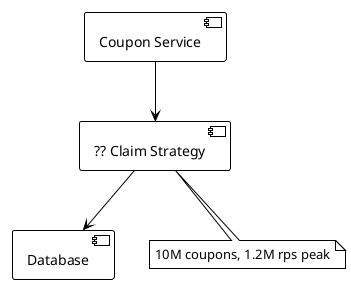

Your flash-sale platform must distribute 10M coupons under a 1.2M rps burst. You pre-create 10M coupon rows with `status='free'` and `user_id=NULL`.

**Which claim strategy lets the DB engine handle concurrency without application-level locking?**

- A) SELECT a free coupon, then UPDATE it in a separate transaction
- B) `UPDATE coupons SET user_id=?, status='claimed' WHERE status='free' LIMIT 1` as a single atomic statement
- C) Use a distributed lock service to serialize all claim requests
- D) INSERT a new claimed row and delete the free row in a two-step process

---

### Q272. Sharding a Coupon Pool [★★☆]

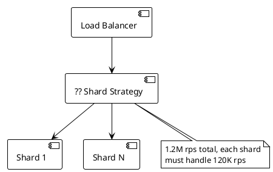

Your coupon system faces 1.2M rps at peak. You plan to split the coupon pool across shards so each shard handles roughly 120K rps.

**How many shards are needed to meet this throughput target?**

- A) 5 shards, each handling 240K rps
- B) 10 shards, each handling 120K rps
- C) 20 shards, each handling 60K rps for extra headroom
- D) 1 shard with Redis caching in front

---

### Q273. Ticket Reservation Timeout [★★☆]

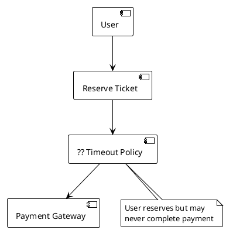

A ticketing system allows users to reserve seats, then redirects them to a payment gateway. Some users abandon the flow, leaving seats stuck in `reserved` status.

**What timeout policy should release unpaid reservations back to the pool?**

- A) Release immediately if the user navigates away from the page
- B) Release after 15 minutes if payment webhook has not confirmed
- C) Never release; let customer support handle it manually
- D) Release after 24 hours to give users maximum time

---

### Q274. Ticket Sharding by Venue [★★☆]

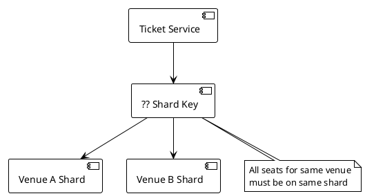

Your ticketing platform handles hundreds of venues. You need all tickets for a given venue on the same shard so that seat availability queries stay local.

**What should the shard key be?**

- A) Shard by user_id so each user's reservations are co-located
- B) Shard by venue_id so all seats for the same venue are on the same shard
- C) Shard by reservation_id for even distribution
- D) Shard by timestamp to distribute load across time-based partitions

---

### Q275. Coupon Counter with Redis vs DB [★☆☆]

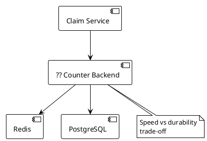

A team debates using Redis DECR as a fast counter for coupon claims versus the linearization approach with pre-created DB rows. Redis handles 100K+ ops/s easily, but the coupons represent real monetary value.

**When should you prefer the DB linearization approach over Redis DECR?**

- A) When latency under 1ms is the top priority
- B) When durability matters more than speed, since Redis DECR risks data loss on crash
- C) When you have fewer than 100 coupons to distribute
- D) When all users are in the same geographic region

---

### Q276. Ticket Pre-Creation Schema [★☆☆]

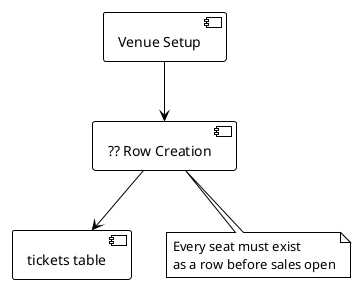

Before ticket sales open for a 50,000-seat stadium, you must prepare the database. The claim query uses `UPDATE tickets SET user_id=?, status='reserved' WHERE venue_id=? AND status='free' LIMIT 1`.

**What must happen before the first ticket can be claimed?**

- A) Create an entry in a seats_available counter table
- B) Pre-create one row per seat with `INSERT INTO tickets (venue_id, seat_id, status)` for all seats
- C) Create a single row tracking total remaining seats
- D) Wait for the first request and lazily create rows on demand

---

### Q277. Reservation ID for Payment Tracking [★★☆]

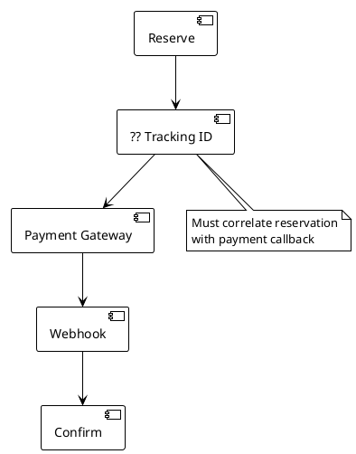

When a user reserves a ticket, the system redirects to a payment gateway. The gateway later sends a webhook to confirm payment. You need to correlate the callback with the original reservation.

**What identifier should be attached at reservation time to enable this correlation?**

- A) The user's email address
- B) A UUID reservation_id stored on the ticket row and passed to the payment gateway
- C) The seat number, since it is unique within a venue
- D) A sequential auto-increment ID visible in the URL

---

### Q278. Linearization vs Optimistic Locking Decision [★★★]

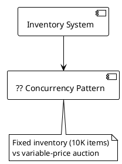

You are designing two subsystems: one for selling 10,000 fixed-price limited-edition items, and another for a variable-price auction with a version column on the auction row.

**Which concurrency pattern fits each subsystem?**

- A) Linearization for both, since both have inventory
- B) Optimistic locking for the fixed-price items, linearization for the auction
- C) Linearization for fixed inventory (pre-create rows, atomic claim), optimistic locking for the auction (version column, retry on conflict)
- D) Pessimistic locking for both, since neither must fail

---

### Q279. Payment Flow State Machine [★★☆]

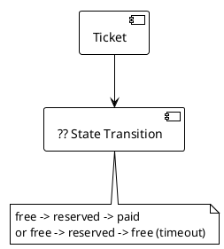

A ticket goes through states: `free` when available, `reserved` when a user claims it, and `paid` when the payment webhook confirms. If not paid within 15 minutes, it returns to `free`.

**What triggers the transition from `reserved` back to `free`?**

- A) The user clicking a cancel button on the frontend
- B) A scheduled job that checks for reservations older than 15 minutes without a payment confirmation
- C) The payment gateway sending a failure webhook immediately
- D) The database automatically expiring the row using a TTL column

---

### Q280. Queue Serialization for Auction Bids [★★★]

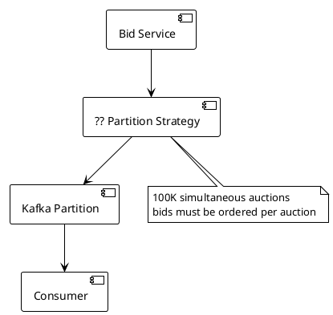

Your auction platform handles 100K simultaneous auctions with 500M writes/day. Bids for the same auction must be processed sequentially to prevent race conditions on price updates.

**How should bids be partitioned in Kafka to ensure sequential processing per auction?**

- A) Use a random partition key for even load distribution
- B) Use auction_id as the partition key so all bids for the same auction go to the same partition and are processed by a single consumer
- C) Use user_id as the partition key to group bids by bidder
- D) Use a round-robin strategy across all partitions

---

## Topic 22: Fan-out, Feed & Notification Architectures (Q281–Q290)

---

### Q281. Push vs Pull Feed Model [★☆☆]

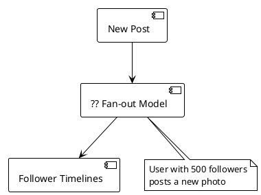

A user with 500 followers publishes a new post. You need to make it appear in each follower's feed.

**Which fan-out model writes the post_id to each follower's timeline cache at post time?**

- A) Pull model: followers fetch from the poster's feed on each load
- B) Push model: iterate the follower list and write post_id to each follower's timeline cache
- C) Hybrid model: only push to followers who are currently online
- D) Batch model: aggregate all posts and distribute once per hour

---

### Q282. Celebrity Fan-out Threshold [★★☆]

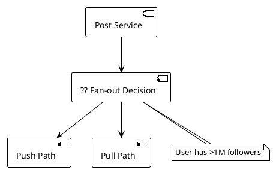

Your social platform uses a hybrid feed model. When a celebrity with over 1M followers posts, pushing to all follower timelines would cause a massive write storm.

**What should the system do for users with more than 1M followers?**

- A) Push to all followers but throttle the writes over several hours
- B) Switch to pull model for those users so followers fetch their posts at read time
- C) Drop the post if fan-out exceeds a threshold
- D) Push only to the first 1M followers and ignore the rest

---

### Q283. Feed Cache Data Structure [★★☆]

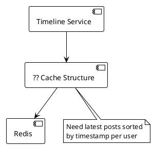

Each user's feed must show the most recent posts sorted by time. You store feed entries in Redis and need to efficiently retrieve the latest N items.

**Which Redis data structure supports this with score-based ordering and range queries?**

- A) A Redis hash with post_id as field and content as value
- B) A Redis sorted set per user with timestamp as score, using ZREVRANGE for latest posts
- C) A Redis list with LPUSH and LTRIM
- D) A Redis string storing a serialized JSON array

---

### Q284. Cold Storage Eviction Policy [★★☆]

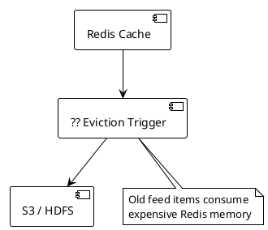

Your news feed keeps recent posts in Redis sorted sets, but Redis memory is expensive. Older posts are rarely accessed.

**After how many days should feed items be evicted from Redis to cold storage like S3 or HDFS?**

- A) After 1 day to minimize Redis memory usage
- B) After 5 days, balancing recency with cost
- C) After 30 days to ensure maximum cache hit rate
- D) Never evict; keep all data in Redis for fastest access

---

### Q285. Pull Model Merge Strategy [★★★]

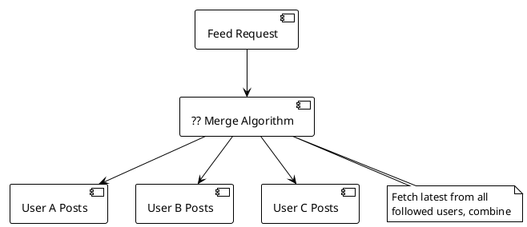

In the pull model, when a user loads their feed, the system fetches the latest posts from all users they follow and must combine them into a single chronological feed.

**What algorithm efficiently combines multiple sorted post lists into one timeline?**

- A) Fetch all posts into a single array and sort by timestamp
- B) Merge-sort by timestamp across the pre-sorted lists from each followed user
- C) Pick a random post from each followed user
- D) Show posts grouped by author rather than chronologically

---

### Q286. Hybrid Feed: Write Path Decision [★★☆]

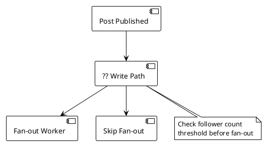

A hybrid feed system must decide at write time whether to fan out a new post. Regular users (under 1M followers) get push fan-out; celebrities get pull-based reads.

**What check determines the write path when a post is published?**

- A) Check the post content length to decide push vs pull
- B) Check if the poster's follower count exceeds the 1M threshold; if so, skip fan-out
- C) Always push, but use smaller payloads for popular users
- D) Check the current time of day and push only during off-peak hours

---

### Q287. Notification Fan-out for Group Events [★★☆]

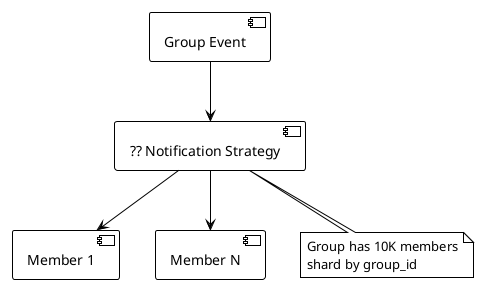

A group event triggers a notification to all 10,000 group members. The group's data is sharded by group_id.

**How should notifications be distributed to all members?**

- A) Send notifications synchronously in the request handler before responding
- B) Fan-out to all group members asynchronously via a message queue, with group data co-located on the same shard
- C) Store a single notification row and have each member poll for it
- D) Send notifications only to members who are currently online

---

### Q288. Feed Consistency: Push Model Drawback [★★☆]

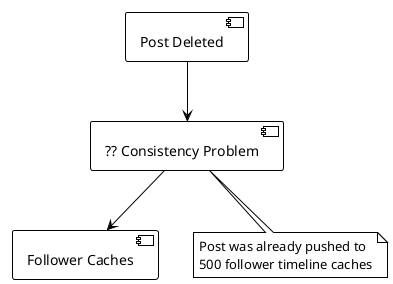

A user deletes a post that was already pushed to 500 follower timeline caches using the push model.

**What consistency challenge does the push model create when a post is deleted?**

- A) No challenge; the post disappears automatically from all caches
- B) The delete must fan out to all 500 follower caches to remove the stale post_id, which is expensive and may leave stale data
- C) Only the original poster's cache needs updating
- D) The database foreign key constraint automatically removes all cached references

---

### Q289. Feed Ranking: Beyond Chronological [★★★]

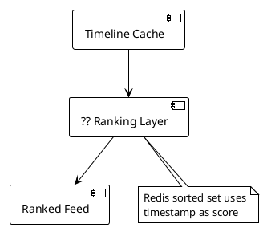

Your current feed uses Redis sorted sets with timestamp as the score, producing a pure chronological feed. Product wants to add engagement-based ranking.

**Where should the ranking logic be applied if the cache layer uses timestamp-sorted sets?**

- A) Change the Redis sorted set score to an engagement metric instead of timestamp
- B) Apply a ranking/re-ranking layer in the application after fetching candidates from the timestamp-sorted cache
- C) Let the client-side JavaScript re-sort the feed
- D) Store posts in an unsorted Redis set and sort on every read

---

### Q290. Feed Load: Avoiding Thundering Herd [★★★]

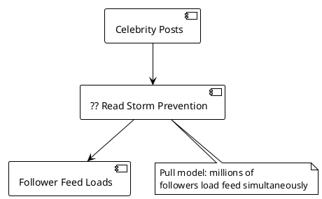

A celebrity with millions of followers uses the pull model. When they post, many followers open the app and trigger feed loads that all query the celebrity's recent posts.

**How can you prevent a read storm on the celebrity's post data?**

- A) Rate-limit all followers to one feed load per minute
- B) Cache the celebrity's recent posts in Redis so follower feed loads read from cache instead of hitting the DB repeatedly
- C) Convert the celebrity to push model despite the 1M+ follower count
- D) Delay showing the celebrity's post for 1 hour to spread load

---

## Topic 23: URL Shortening, Crawling & Content Systems (Q291–Q300)

---

### Q291. Base58 vs Base62 Encoding [★☆☆]

```plantuml
@startuml
!theme plain
skinparam backgroundColor white

[Short URL Generator] --> [?? Encoding Scheme]
note bottom of [?? Encoding Scheme]
  Users copy-paste URLs
  in emails and messages
end note
@enduml
```

Your URL shortener generates short codes from numeric IDs. Users frequently copy-paste these codes by hand. Characters like `0` vs `O` and `I` vs `l` cause confusion.

**Which encoding avoids visually ambiguous characters?**

- A) Base62 using a-z, A-Z, 0-9
- B) Base58 which removes 0, O, I, and l to avoid confusion
- C) Base32 using only lowercase letters
- D) Hexadecimal encoding for simplicity

---

### Q292. Key Generation Service Design [★★☆]

```plantuml
@startuml
!theme plain
skinparam backgroundColor white

[URL Shortener] --> [?? Key Source]
[?? Key Source] --> [Pre-generated Keys]
note bottom of [?? Key Source]
  Avoid collision checks
  on every write
end note
@enduml
```

Generating a random short key and checking for collision on every write adds latency. You want to eliminate collision checks entirely.

**What approach pre-generates unique keys so the shortener can hand them out without collision checks?**

- A) Use auto-incrementing DB IDs and encode them
- B) A Key Generation Service (KGS) that pre-generates a batch of unique keys and hands them out on request
- C) Generate UUIDs and truncate to 6 characters
- D) Use the hash of the URL, retrying on collision

---

### Q293. Redirect Status Code for Analytics [★★☆]

```plantuml
@startuml
!theme plain
skinparam backgroundColor white

[Short URL Click] --> [?? Redirect Code]
[?? Redirect Code] --> [Original URL]
note bottom of [?? Redirect Code]
  Product needs click
  tracking and analytics
end note
@enduml
```

Your URL shortener must track every click for analytics purposes. Choosing the wrong HTTP redirect status code could cause browsers to cache the redirect and bypass your server.

**Which redirect status code ensures every click hits your server for tracking?**

- A) 301 Moved Permanently, which the browser caches for future visits
- B) 302 Found, which always hits the server and enables analytics on every click
- C) 200 OK with a JavaScript redirect on the page
- D) 307 Temporary Redirect with no-cache headers

---

### Q294. URL Shortener Read Path [★☆☆]

```plantuml
@startuml
!theme plain
skinparam backgroundColor white

[Click Request] --> [?? Lookup Chain]
[?? Lookup Chain] --> [In-Memory Cache]
[?? Lookup Chain] --> [Redis]
[?? Lookup Chain] --> [Database]
note bottom of [?? Lookup Chain]
  Reads vastly outnumber writes
end note
@enduml
```

Your URL shortener is read-heavy. A click on a short URL must resolve to the original URL as fast as possible.

**What is the correct lookup order for the read path?**

- A) Database first, then cache the result for next time
- B) Check in-memory cache, then Redis, then DB, then cache the result at each miss level
- C) Always go directly to the database for consistency
- D) Check Redis only; skip in-memory cache and database

---

### Q295. Bloom Filter for URL Deduplication [★★★]

```plantuml
@startuml
!theme plain
skinparam backgroundColor white

[Web Crawler] --> [?? Dedup Check]
[?? Dedup Check] --> [URL Frontier]
note bottom of [?? Dedup Check]
  Billions of URLs
  memory-efficient check needed
end note
@enduml
```

Your web crawler has visited billions of URLs and must avoid re-crawling. Storing all visited URLs in a hash set is too memory-intensive. The formula for Bloom filter size is `m = -n*ln(p)/(ln2)^2`.

**Which data structure provides memory-efficient probabilistic membership testing with tunable false positive rate?**

- A) A standard hash map storing all visited URLs
- B) A Bloom filter, sized using m = -n*ln(p)/(ln2)^2 where n is the number of URLs and p is the target false positive rate
- C) A B-tree index on the URL column
- D) A trie data structure storing URL prefixes

---

### Q296. Crawler Politeness and URL Frontier [★★☆]

```plantuml
@startuml
!theme plain
skinparam backgroundColor white

[URL Frontier] --> [?? Queue Design]
[?? Queue Design] --> [Priority Queue]
[?? Queue Design] --> [Politeness Queue]
note bottom of [?? Queue Design]
  Must respect per-domain
  crawl rate limits
end note
@enduml
```

Your web crawler must prioritize important pages while also respecting per-domain crawl rate limits to avoid overwhelming target servers.

**How should the URL frontier be structured?**

- A) A single FIFO queue processing URLs in submission order
- B) A priority queue combined with a per-domain politeness queue that rate-limits requests to each domain
- C) A random shuffle of all pending URLs
- D) Separate queues per content type (HTML, PDF, images)

---

### Q297. DNS Caching for Crawlers [★☆☆]

```plantuml
@startuml
!theme plain
skinparam backgroundColor white

[Crawler Worker] --> [?? DNS Strategy]
[?? DNS Strategy] --> [DNS Resolver]
note bottom of [?? DNS Strategy]
  Same domain crawled
  thousands of times
end note
@enduml
```

Your crawler processes thousands of pages from the same domain. Each page fetch triggers a DNS lookup, adding latency and load on DNS servers.

**How should the crawler reduce redundant DNS resolution?**

- A) Use a new DNS resolver for each request for freshness
- B) Cache DNS results per domain to avoid repeated lookups for the same domain
- C) Hard-code IP addresses for all target domains
- D) Use DNS over HTTPS for every single request

---

### Q298. Content Deduplication Strategy [★★☆]

```plantuml
@startuml
!theme plain
skinparam backgroundColor white

[Crawled Page] --> [?? Dedup Algorithm]
[?? Dedup Algorithm] --> [Index or Discard]
note bottom of [?? Dedup Algorithm]
  Near-duplicate pages with
  minor template differences
end note
@enduml
```

Your crawler encounters many pages that are nearly identical -- same content but different headers, footers, or ads. Exact hash matching misses these near-duplicates.

**Which algorithm detects near-duplicate content rather than only exact matches?**

- A) MD5 hash comparison for exact deduplication only
- B) SimHash or MinHash for near-duplicate detection that tolerates minor differences
- C) Compare page byte sizes and discard if within 10%
- D) Compare only the page title tag

---

### Q299. Robots.txt Handling [★☆☆]

```plantuml
@startuml
!theme plain
skinparam backgroundColor white

[Crawler] --> [?? Robots Policy]
[?? Robots Policy] --> [Target Domain]
note bottom of [?? Robots Policy]
  Must respect crawl
  directives per domain
end note
@enduml
```

Your web crawler must respect the crawling rules published by each website in their robots.txt file. Fetching it on every single page request is wasteful.

**How should the crawler manage robots.txt files?**

- A) Ignore robots.txt entirely for maximum crawl coverage
- B) Fetch once per domain, cache it, and refresh periodically
- C) Fetch robots.txt before every single page request
- D) Only check robots.txt for the homepage of each domain

---

### Q300. JavaScript-Heavy Page Rendering [★★☆]

```plantuml
@startuml
!theme plain
skinparam backgroundColor white

[Crawler] --> [?? Rendering Strategy]
[?? Rendering Strategy] --> [HTML Parser]
[?? Rendering Strategy] --> [Headless Browser]
note bottom of [?? Rendering Strategy]
  Single-page app with
  client-side rendering
end note
@enduml
```

Your crawler encounters modern single-page applications where content is loaded dynamically via JavaScript. A standard HTML parser sees only an empty shell.

**How should the crawler handle JavaScript-heavy sites?**

- A) Parse only the raw HTML and index whatever static content exists
- B) Use headless Chrome (dynamic rendering) for JavaScript-heavy sites to execute JS and capture the rendered DOM
- C) Skip all JavaScript-rendered sites entirely
- D) Fetch only the JavaScript bundle files and index those

---

## Topic 24: Chat, Presence & Real-Time Messaging (Q301–Q310)

---

### Q301. User-to-Server Routing with Redis [★☆☆]

```plantuml
@startuml
!theme plain
skinparam backgroundColor white

[Message Router] --> [?? Lookup Strategy]
[?? Lookup Strategy] --> [Redis]
[Redis] --> [Chat Server]
note bottom of [?? Lookup Strategy]
  Need to find which chat
  server holds user 456
end note
@enduml
```

A chat system has multiple chat servers. When user 123 sends a message to user 456, the system must determine which server holds user 456's connection.

**How does the simplified Redis-based routing work?**

- A) Broadcast the message to all chat servers and let them check locally
- B) On connect, `SET user:456 server:xyz` in Redis; to route, `GET user:456` returns the target server
- C) Store routing in a SQL database and query on each message
- D) Use DNS to resolve user IDs to server addresses

---

### Q302. Bucket-Based Connection Management [★★☆]

```plantuml
@startuml
!theme plain
skinparam backgroundColor white

[User Connection] --> [?? Bucket Assignment]
[?? Bucket Assignment] --> [Chat Server A]
[?? Bucket Assignment] --> [Chat Server B]
note bottom of [?? Bucket Assignment]
  Each server handles a
  range of user ID buckets
end note
@enduml
```

Instead of Redis-based routing, a chat system assigns each chat server a bucket range of user IDs. A Message Multiplexer computes `bucket = hash(recipient_id) % num_buckets` to find the target server.

**What advantage does bucket-based routing have over per-user Redis lookups?**

- A) It requires no external state store; the bucket computation is deterministic from the user ID
- B) It guarantees message ordering across all users
- C) It eliminates the need for WebSocket connections
- D) It allows users to connect to any server regardless of their ID

---

### Q303. Offline Message Storage [★★☆]

```plantuml
@startuml
!theme plain
skinparam backgroundColor white

[Incoming Message] --> [?? Delivery Check]
[?? Delivery Check] --> [Deliver Now]
[?? Delivery Check] --> [Store for Later]
note bottom of [?? Delivery Check]
  Recipient is offline
end note
@enduml
```

User 123 sends a message to user 456, but user 456 is currently offline. The message must not be lost and should be delivered when user 456 reconnects.

**Where should undelivered messages be stored for offline users?**

- A) Keep them in the sender's outbox and retry every minute
- B) Store in Cassandra and deliver all pending messages on next connection
- C) Drop the message and notify the sender that delivery failed
- D) Buffer in the chat server's memory until the recipient reconnects

---

### Q304. Presence Detection via Heartbeat [★☆☆]

```plantuml
@startuml
!theme plain
skinparam backgroundColor white

[Client App] --> [?? Presence Mechanism]
[?? Presence Mechanism] --> [Presence Service]
note bottom of [?? Presence Mechanism]
  Need to show online/offline
  status to contacts
end note
@enduml
```

The chat application displays whether each contact is online or offline. The system needs a mechanism to detect when a user has disconnected or lost connectivity.

**What mechanism determines user presence status?**

- A) Check the user's last message timestamp
- B) Heartbeat every 30 seconds; if missed, mark the user as offline
- C) Rely solely on the TCP connection state of the WebSocket
- D) Ask the user to manually set their status

---

### Q305. Group Chat Fan-out and Sharding [★☆☆]

```plantuml
@startuml
!theme plain
skinparam backgroundColor white

[Group Message] --> [?? Distribution Strategy]
[?? Distribution Strategy] --> [Member 1]
[?? Distribution Strategy] --> [Member N]
note bottom of [?? Distribution Strategy]
  Shard by group_id for
  co-located member lists
end note
@enduml
```

A group chat with 200 members receives a new message. The system must fan out the message to all members. Group data is sharded by group_id.

**How should group messages be distributed?**

- A) Store the message once and have each member poll for new group messages
- B) Fan out to all group members, with the member list co-located on the group_id shard for efficient reads
- C) Send only to the first 50 members and let them relay to others
- D) Broadcast to all chat servers regardless of member locations

---

### Q306. Message Multiplexer Routing [★★☆]

```plantuml
@startuml
!theme plain
skinparam backgroundColor white

[Chat Server A] --> [?? Multiplexer]
[?? Multiplexer] --> [Chat Server B]
note bottom of [?? Multiplexer]
  Compute target server for
  recipient using hash function
end note
@enduml
```

User 123 on Chat Server A sends a message to user 456. The Message Multiplexer must route the message to the correct server.

**What computation does the Message Multiplexer perform?**

- A) Look up user 456 in a SQL database to find their server
- B) Compute `bucket = hash(recipient_id) % num_buckets` to determine which chat server handles user 456
- C) Send the message to a random chat server
- D) Forward to all chat servers and let them discard if irrelevant

---

### Q307. Chat System: WebSocket vs Polling [★☆☆]

```plantuml
@startuml
!theme plain
skinparam backgroundColor white

[Client] --> [?? Connection Type]
[?? Connection Type] --> [Chat Server]
note bottom of [?? Connection Type]
  Real-time message delivery
  with minimal latency
end note
@enduml
```

The chat application requires real-time message delivery with sub-second latency. The client needs to receive messages as soon as they arrive on the server.

**Which connection type supports server-initiated message delivery with minimal latency?**

- A) HTTP polling every 5 seconds
- B) WebSocket, which maintains a persistent bidirectional connection for instant server-to-client pushes
- C) HTTP long-polling with 30-second timeout
- D) Client-side polling via periodic REST API calls

---

### Q308. Presence at Scale: Reducing Fan-out [★★★]

```plantuml
@startuml
!theme plain
skinparam backgroundColor white

[Heartbeat Service] --> [?? Presence Broadcast]
[?? Presence Broadcast] --> [Contact List]
note bottom of [?? Presence Broadcast]
  User with 10K contacts
  comes online
end note
@enduml
```

When a user with 10,000 contacts comes online, broadcasting their presence change to all contacts creates a massive fan-out of notifications.

**How can presence updates be made more efficient at scale?**

- A) Broadcast to all 10K contacts immediately on every status change
- B) Only send presence updates to contacts who currently have the user's chat window open or who are on their contact list screen
- C) Disable presence for users with more than 100 contacts
- D) Batch presence updates and send them once per hour

---

### Q309. Message Ordering in Group Chat [★★★]

```plantuml
@startuml
!theme plain
skinparam backgroundColor white

[Multiple Senders] --> [?? Ordering Guarantee]
[?? Ordering Guarantee] --> [Group Timeline]
note bottom of [?? Ordering Guarantee]
  Messages from different
  users arrive concurrently
end note
@enduml
```

Multiple users send messages to the same group chat simultaneously. The group is sharded by group_id, and all messages for this group go to the same shard.

**How does sharding by group_id help with message ordering?**

- A) It guarantees global ordering across all groups
- B) It ensures all messages for the same group are processed on the same shard, enabling sequential ordering within that group
- C) It eliminates the need for timestamps on messages
- D) It allows messages to be processed in parallel without ordering

---

### Q310. Handling Server Failure in Chat [★☆☆]

```plantuml
@startuml
!theme plain
skinparam backgroundColor white

[Chat Server X] --> [?? Failure Recovery]
[?? Failure Recovery] --> [Reconnection]
[?? Failure Recovery] --> [Message Recovery]
note bottom of [?? Failure Recovery]
  Server crashes, users
  lose WebSocket connections
end note
@enduml
```

A chat server crashes, and all users connected to it lose their WebSocket connections. Those users had undelivered messages in transit.

**What should happen when the affected users reconnect to a different server?**

- A) All in-flight messages are permanently lost
- B) Users reconnect to a new server, their routing entry is updated, and pending offline messages stored in Cassandra are delivered
- C) Users must restart the app and re-register
- D) The crashed server is restored and all users must reconnect to it specifically

---

## Topic 25: Resilience, Observability & Interview Patterns (Q311–Q320)

---

### Q311. Circuit Breaker State Transitions [★★☆]

```plantuml
@startuml
!theme plain
skinparam backgroundColor white

[Service Call] --> [?? Circuit State]
[?? Circuit State] --> [CLOSED]
[?? Circuit State] --> [OPEN]
[?? Circuit State] --> [HALF-OPEN]
note bottom of [?? Circuit State]
  5 consecutive failures
  observed
end note
@enduml
```

Your service has experienced 5 consecutive failures calling a downstream dependency. The circuit breaker is currently in CLOSED state.

**What state should the circuit breaker transition to after 5 consecutive failures?**

- A) Stay in CLOSED and continue sending requests normally
- B) Transition to OPEN, rejecting all requests for 30 seconds before testing with HALF-OPEN
- C) Transition directly to HALF-OPEN and test one request
- D) Remove the downstream from the service registry permanently

---

### Q312. HALF-OPEN Circuit Breaker Test [★★☆]

```plantuml
@startuml
!theme plain
skinparam backgroundColor white

[Circuit Breaker] --> [?? Test Outcome]
[?? Test Outcome] --> [CLOSED]
[?? Test Outcome] --> [OPEN]
note bottom of [?? Test Outcome]
  HALF-OPEN: testing
  1 request to downstream
end note
@enduml
```

After 30 seconds in OPEN state, the circuit breaker transitions to HALF-OPEN and allows a single test request through to the downstream service.

**What happens if the test request fails in HALF-OPEN state?**

- A) Transition to CLOSED since one more attempt should be tried
- B) Transition back to OPEN for another 30-second cooldown period
- C) Stay in HALF-OPEN and try another test request immediately
- D) Permanently disable the circuit breaker

---

### Q313. Retry Policy: Which Errors to Retry [★☆☆]

```plantuml
@startuml
!theme plain
skinparam backgroundColor white

[Failed Request] --> [?? Retry Decision]
[?? Retry Decision] --> [Retry]
[?? Retry Decision] --> [Fail Fast]
note bottom of [?? Retry Decision]
  HTTP 400 Bad Request
  returned by downstream
end note
@enduml
```

A downstream service returns HTTP 400 Bad Request. Your retry policy must decide whether to retry this request.

**Should a 4xx client error be retried?**

- A) Yes, retry up to 3 times with exponential backoff
- B) No, never retry 4xx errors; only retry 5xx and timeouts since 4xx indicates a client-side problem that will not resolve on retry
- C) Retry only 400 errors but not other 4xx codes
- D) Retry all errors regardless of status code

---

### Q314. Bulkhead Pattern Configuration [★★☆]

```plantuml
@startuml
!theme plain
skinparam backgroundColor white

[Service A] --> [?? Bulkhead Config]
[?? Bulkhead Config] --> [Downstream B]
note bottom of [?? Bulkhead Config]
  Prevent one slow downstream
  from consuming all threads
end note
@enduml
```

Service A calls downstream B, which occasionally becomes slow. Without isolation, slow calls to B can exhaust all of Service A's threads, blocking calls to other downstreams.

**What bulkhead configuration limits the blast radius of a slow downstream?**

- A) Set no concurrency limits and rely on timeouts alone
- B) Max 10 concurrent calls to downstream B, queue up to 20, timeout at 500ms
- C) Allow unlimited concurrent calls but set a 5-second timeout
- D) Use a single shared thread pool for all downstream calls

---

### Q315. Consistent Hashing: Adding a Node [★★☆]

```plantuml
@startuml
!theme plain
skinparam backgroundColor white

[Hash Ring] --> [?? Key Migration]
[?? Key Migration] --> [New Node]
note bottom of [?? Key Migration]
  Adding 1 node to a ring
  with N existing nodes
end note
@enduml
```

Your cache cluster uses consistent hashing with virtual nodes. You add one new node to a ring with N existing nodes.

**How many keys need to be remapped when adding a node?**

- A) All keys must be redistributed across all nodes
- B) Only K/N keys move to the new node, where K is total keys and N is total nodes
- C) Exactly half of all keys must move
- D) No keys move; the new node starts empty and fills over time

---

### Q316. Virtual Nodes for Even Distribution [★★☆]

```plantuml
@startuml
!theme plain
skinparam backgroundColor white

[Hash Ring] --> [?? Virtual Node Strategy]
note bottom of [?? Virtual Node Strategy]
  3 physical nodes with
  uneven key distribution
end note
@enduml
```

Your consistent hashing ring has only 3 physical nodes, and keys are unevenly distributed because the nodes occupy only 3 points on the ring.

**How do virtual nodes solve the uneven distribution problem?**

- A) Add more physical servers to increase the number of ring positions
- B) Map each physical node to multiple virtual positions on the ring, spreading keys more evenly across nodes
- C) Use a different hash function that produces more uniform output
- D) Manually assign key ranges to each node

---

### Q317. Directory-Based Shard Rebalancing [★★★]

```plantuml
@startuml
!theme plain
skinparam backgroundColor white

[Shard Manager] --> [?? Rebalance Strategy]
[?? Rebalance Strategy] --> [Lookup Directory]
note bottom of [?? Rebalance Strategy]
  Need to move shards
  without rehashing all keys
end note
@enduml
```

Your system needs to rebalance shards when adding capacity. Hash-based sharding would require rehashing all keys, which is disruptive.

**What rebalancing strategy allows moving shards to new nodes without rehashing?**

- A) Rehash all keys using a new hash function and redistribute
- B) Directory-based sharding, where a lookup table maps shard IDs to physical nodes and can be updated without rehashing
- C) Stop all traffic, migrate data, then resume
- D) Use range-based partitioning and split ranges in half

---

### Q318. L4 vs L7 Load Balancer Selection [★☆☆]

```plantuml
@startuml
!theme plain
skinparam backgroundColor white

[Internet Traffic] --> [?? Load Balancer Type]
[?? Load Balancer Type] --> [Backend Servers]
note bottom of [?? Load Balancer Type]
  Need to route based on
  URL path and HTTP headers
end note
@enduml
```

Your application needs to route requests to different backend pools based on the URL path (e.g., `/api` vs `/static`) and HTTP headers.

**Which load balancer type can inspect HTTP-level information for routing decisions?**

- A) L4 load balancer, which operates at the TCP/IP level for fast routing
- B) L7 load balancer, which can inspect HTTP headers, cookies, and URLs for content-based routing
- C) DNS-based load balancing with round-robin
- D) Client-side load balancing with a service mesh

---

### Q319. ID Generation: Sortable vs Uncoordinated [★★☆]

```plantuml
@startuml
!theme plain
skinparam backgroundColor white

[New Record] --> [?? ID Strategy]
[?? ID Strategy] --> [UUID v4]
[?? ID Strategy] --> [Snowflake]
note bottom of [?? ID Strategy]
  Need time-sortable IDs
  across distributed nodes
end note
@enduml
```

Your distributed system creates records across multiple nodes. You need IDs that are globally unique and can be sorted by creation time for efficient range queries.

**Which ID generation strategy produces time-sortable IDs?**

- A) UUID v4, which is random and requires no coordination but is not time-sortable
- B) Snowflake IDs, which embed a timestamp component making them time-sortable, though they require coordination for worker ID assignment
- C) Auto-incrementing integers from a single database
- D) Random 64-bit integers with no embedded structure

---

### Q320. Message Queue Selection for High Throughput [★★★]

```plantuml
@startuml
!theme plain
skinparam backgroundColor white

[Event Pipeline] --> [?? Queue Selection]
[?? Queue Selection] --> [Queue System]
note bottom of [?? Queue Selection]
  Need 100K+ msg/sec with
  ordering per partition
end note
@enduml
```

Your event processing pipeline must sustain 100K+ messages per second with persistent storage and ordering guarantees within a partition. RabbitMQ handles approximately 20K msg/sec, and SQS approximately 3K msg/sec.

**Which message queue meets the throughput and ordering requirements?**

- A) RabbitMQ, which supports complex routing at approximately 20K msg/sec
- B) Amazon SQS, a fully managed queue at approximately 3K msg/sec
- C) Kafka, which handles 100K+ msg/sec with persistent storage and ordering per partition
- D) A custom in-memory queue built on Redis pub/sub

---
