# System Design — Decision-Based Questions
## Batch 1: Q1–Q50

---

## Topic 1: Load Balancing & Reverse Proxies (Q1–Q12)

---

### Q1. High-Frequency Trading Gateway [★★☆]

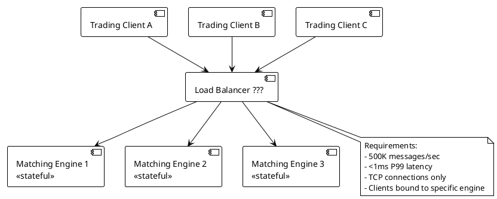

A financial exchange processes 500,000 order messages per second over persistent TCP connections. Each trading client must always reach the same matching engine (the engine holds in-memory order book state for that client's instruments). P99 latency must stay under 1ms.

**What is the most appropriate load balancing approach?**

- A) AWS Application Load Balancer (ALB) with sticky sessions via HTTP cookies
- B) Layer 4 (TCP) load balancer with IP hash-based consistent routing, no HTTP overhead
- C) Layer 7 load balancer with custom header inspection and round-robin to least-connected engine
- D) DNS-based round-robin with client-side retry on connection failure

---

### Q2. Long-Polling API Server [★★☆]

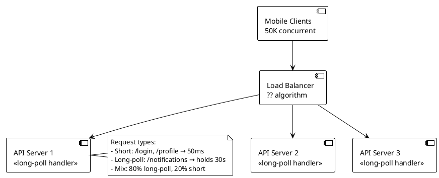

A mobile notification service has 50,000 concurrent clients. 80% of requests are long-poll `/notifications` endpoints that hold connections open for up to 30 seconds. 20% are fast API calls completing in under 50ms. Servers are running Spring Boot with virtual threads (Java 21).

**Which load balancing algorithm minimizes the risk of overloading a single server?**

- A) Round-robin — simple, equal distribution across all servers
- B) Random with jitter — avoids synchronized spikes better than strict round-robin
- C) Least connections — routes new requests to the server with the fewest active connections
- D) Weighted round-robin — assign higher weights to servers with more memory

---

### Q3. Shopping Cart Checkout Flow [★☆☆]

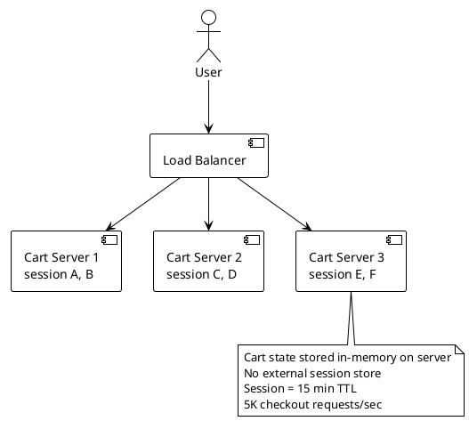

A retail platform stores shopping cart state in-memory on application servers (no Redis, no external session store). Cart data is not persisted between server restarts. There are 5,000 checkout requests per second. Users lose their cart if routed to a different server mid-session.

**What is the correct load balancing approach for this architecture?**

- A) Round-robin — fastest and simplest, users will re-add items if they lose their cart rarely
- B) Sticky sessions (cookie-based affinity) — route each user's requests to the same server for the session lifetime
- C) IP hash routing — deterministic server selection based on client IP
- D) Least connections — the server with the fewest sessions will get new users, naturally balancing

---

### Q4. Internal Microservices API Gateway [★★☆]

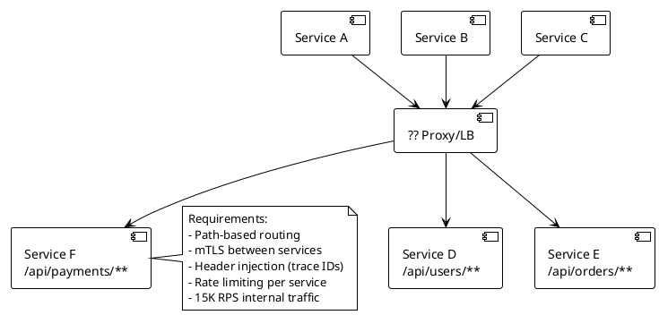

A backend-for-frontend layer must route 15,000 internal RPS across 12 microservices based on URL path, inject distributed tracing headers, enforce per-service rate limits, and terminate/initiate mTLS. The team runs on Kubernetes.

**Which solution is most appropriate?**

- A) HAProxy — battle-tested Layer 4/7 proxy, configure routing rules in haproxy.cfg
- B) AWS ALB with target groups per service path — managed, no Kubernetes-specific knowledge needed
- C) Envoy-based service mesh (Istio or Linkerd) — handles mTLS, routing, header injection, and rate limiting natively in Kubernetes
- D) Nginx with custom Lua scripts for rate limiting and header injection

---

### Q5. Zero-Downtime Health Check Strategy [★★☆]

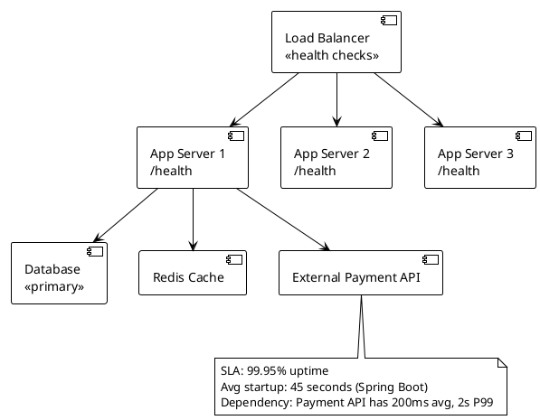

A Spring Boot application takes 45 seconds to start fully (context loading, cache warming). The `/health` endpoint checks the database, Redis, and an external payment API (200ms avg, 2s P99). The load balancer removes servers from rotation if health checks fail for 3 consecutive intervals.

**What health check strategy prevents premature traffic during startup and avoids false removal due to slow external dependencies?**

- A) Single `/health` endpoint checking all dependencies — remove from rotation if any check fails within 500ms timeout
- B) Separate `/health/liveness` (JVM alive) and `/health/readiness` (all deps green) endpoints — LB uses readiness; startup probe delays readiness check by 50 seconds
- C) TCP health check on port 8080 — if the port is open, the server is healthy
- D) Increase health check timeout to 5 seconds to accommodate the slow payment API; use a single endpoint

---

### Q6. Multi-Region User Latency [★★☆]

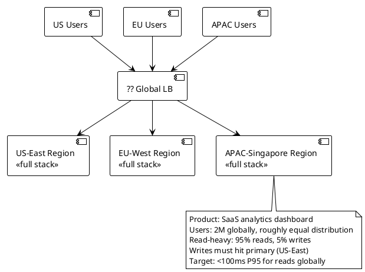

A SaaS analytics platform has 2 million users globally with roughly equal distribution across US, EU, and APAC. Reads are 95% of traffic. Writes must reach the primary database in US-East. Target latency for reads is under 100ms P95 globally.

**Which routing strategy achieves the read latency target while maintaining write consistency?**

- A) Round-robin across all three regions — simplest, relies on users retrying slow requests
- B) GeoDNS routing — resolve to nearest regional endpoint for reads; for writes, client library always targets US-East directly
- C) Single US-East deployment with aggressive CDN caching of API responses for 5 minutes
- D) Active-active multi-region with synchronous replication — all regions serve both reads and writes

---

### Q7. Blue-Green Deployment with Database Migration [★★★]

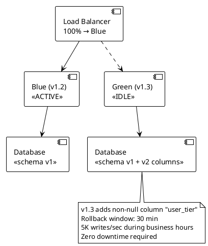

A team is deploying v1.3 which adds a NOT NULL column `user_tier` to the `users` table (50M rows). The current v1.2 doesn't know about this column. They use blue-green deployment with a 30-minute rollback window. The database is shared between blue and green.

**What is the correct deployment sequence to achieve zero downtime with safe rollback?**

- A) Run full migration (add NOT NULL column with default), flip LB to green, delete old columns after rollback window
- B) Three-phase migration: (1) add column as nullable, deploy v1.3 writing both, (2) backfill, add NOT NULL constraint, (3) remove v1.2 compatibility code in v1.4
- C) Take a maintenance window, run migration, deploy green, verify, remove blue
- D) Deploy green with feature flag disabling user_tier writes, flip LB, enable flag, migrate data online

---

### Q8. Connection Draining During Scale-Down [★★☆]

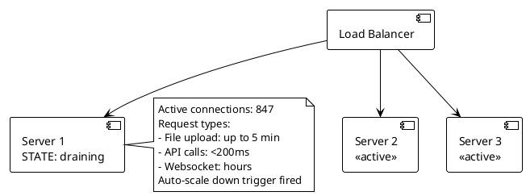

An auto-scaling group triggers scale-down on a server handling 847 active connections. Connections include file uploads (up to 5 minutes), fast API calls (<200ms), and long-lived WebSocket connections (hours). The platform SLA requires no dropped uploads.

**What connection draining configuration is correct?**

- A) Immediate termination — connections get reset, clients retry automatically with exponential backoff
- B) 5-minute draining timeout — stops new connections, waits up to 5 min for existing connections to complete; WebSocket clients will be disconnected and must reconnect
- C) 30-minute draining timeout to accommodate all WebSocket connections before termination
- D) Drain only HTTP connections; forcibly terminate WebSocket connections immediately since they reconnect by design

---

### Q9. SSL Termination Placement [★★☆]

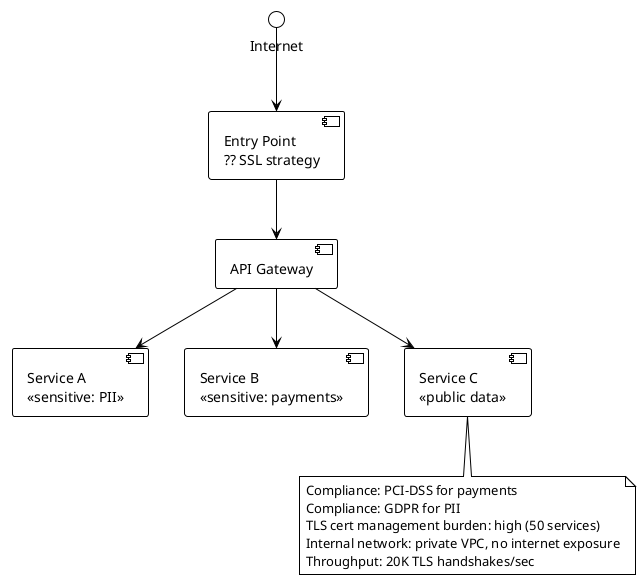

A financial platform must comply with PCI-DSS for payment services and GDPR for PII services. The internal network is a private VPC with no external exposure. Managing TLS certificates across 50 services is operationally expensive. TLS handshake load is 20,000/sec.

**Where should SSL be terminated?**

- A) End-to-end TLS: terminate and re-encrypt at every hop — full encryption throughout, maximum compliance
- B) Terminate at the load balancer, plain HTTP internally — simplest certificate management, VPC provides network isolation
- C) Terminate at the load balancer, re-encrypt only for payment and PII services; plain HTTP for non-sensitive services
- D) Terminate at the API Gateway; services behind it use mutual TLS (mTLS) only for payment and PII paths

---

### Q10. Canary Deployment Traffic Split [★★☆]

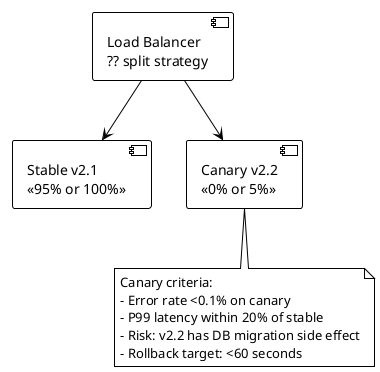

A team wants to validate v2.2 with 5% of traffic before full rollout. v2.2 includes a database migration that adds indexes (read-only, safe to run while v2.1 is active). Error rate threshold is 0.1%. P99 latency must stay within 20% of stable. Rollback must complete in under 60 seconds.

**Which canary approach is correct?**

- A) DNS-based split — update DNS TTL to 30 seconds, point 5% of records to canary IPs
- B) Weighted target groups at the load balancer (95/5 split) — instant rollback by setting canary weight to 0; run index migration before flipping any traffic
- C) Feature flags in application code — route 5% of requests internally to new code paths, no infrastructure change needed
- D) Shadow mode — send 100% of traffic to stable but also mirror 5% to canary without serving canary responses to users

---

### Q11. WebSocket Load Balancing [★★☆]

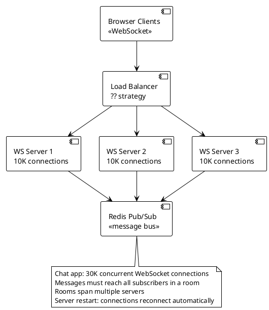

A real-time chat application maintains 30,000 concurrent WebSocket connections across 3 servers. Users in the same chat room may be connected to different servers. Messages published to a room must be delivered to all subscribers regardless of which server they're connected to.

**What is the correct architecture?**

- A) IP hash routing at the load balancer — users always hit the same server, so room members are on the same server
- B) Any routing strategy (round-robin or least-connections) + Redis Pub/Sub — servers subscribe to room channels in Redis, fan out to local connections regardless of which server a message arrives on
- C) Sticky sessions — cookie-based affinity ensures room members land on the same server
- D) Single server for WebSocket handling — eliminates cross-server fan-out complexity; scale vertically

---

### Q12. Path-Based Routing for Microservices [★☆☆]

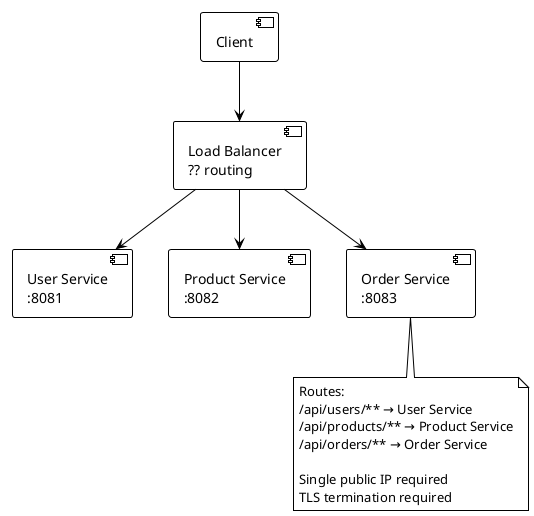

Three microservices run on separate ports (8081, 8082, 8083). The platform exposes a single public HTTPS endpoint. Requests must be routed based on URL path prefix. TLS must be terminated at the entry point.

**Which component should handle this routing?**

- A) DNS with CNAME records per service — each service gets its own subdomain, no shared entry point needed
- B) Layer 4 load balancer — TCP-level routing cannot inspect URL paths, but port-based routing can approximate it
- C) Layer 7 reverse proxy / API gateway (Nginx, Envoy, or AWS ALB) — inspects HTTP path after TLS termination, routes to correct upstream service
- D) Client-side load balancing — clients decide which port to call based on the API endpoint they need

---

## Topic 2: Caching Strategies (Q13–Q27)

---

### Q13. Product Catalog Read Pattern [★☆☆]

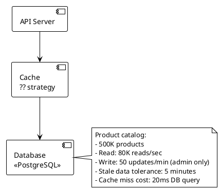

A product catalog API serves 80,000 reads per second with only 50 updates per minute (admin operations). The database query takes 20ms. Serving stale product data for up to 5 minutes is acceptable.

**Which caching pattern minimizes database load with the lowest implementation complexity?**

- A) Write-through — update cache synchronously on every admin write, always consistent
- B) Cache-aside (lazy loading) — application checks cache first, loads from DB on miss, sets TTL of 5 minutes
- C) Read-through — cache layer queries DB automatically on miss, transparent to application
- D) Write-behind (write-back) — buffer writes in cache, flush to DB asynchronously every 30 seconds

---

### Q14. Financial Ledger Write Pattern [★☆☆]

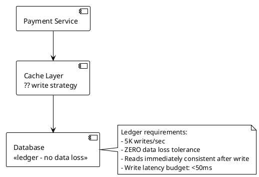

A payment ledger processes 5,000 writes per second. Zero data loss is acceptable — no transaction can be acknowledged to the client without durable persistence. Reads immediately after a write must see the written value.

**Which write caching strategy is appropriate?**

- A) Write-behind — fastest writes, buffer in cache, flush to DB; unacceptable data loss window if cache node fails
- B) Write-through — write to cache and database synchronously before acknowledging; consistent reads, durable
- C) Cache-aside with async DB write — acknowledge write after cache update, background thread persists to DB
- D) No cache for writes — write directly to database at 5K TPS, add read-through cache only for reads

---

### Q15. News Feed Eviction Policy [★☆☆]

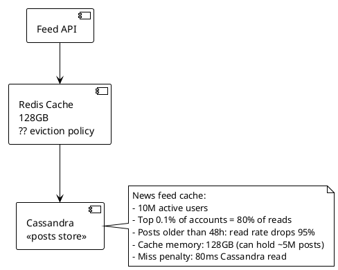

A social platform caches news feed posts in 128GB of Redis. The top 0.1% of accounts (celebrity posts) account for 80% of reads. Posts older than 48 hours see a 95% drop in read frequency. Cache can hold 5M posts; total post count is 500M.

**Which eviction policy best maximizes cache hit rate?**

- A) TTL-only (48-hour expiry) — automatically removes old posts; simple, predictable
- B) LRU (least recently used) — evicts posts that haven't been read most recently; hot celebrity posts stay
- C) LFU (least frequently used) — evicts posts with lowest access frequency; keeps high-read celebrity posts, removes old posts naturally
- D) Random eviction — statistically removes old posts over time, simplest implementation

---

### Q16. Session Storage Selection [★☆☆]

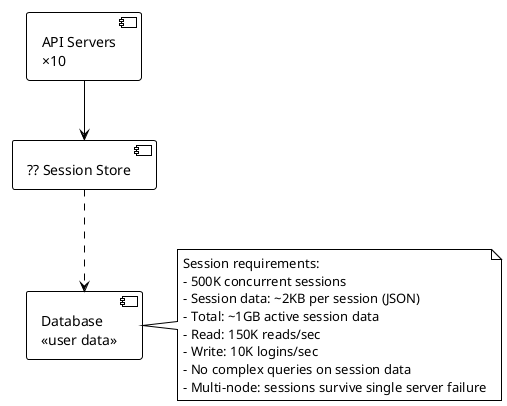

An application has 500,000 concurrent user sessions averaging 2KB each (~1GB total). Sessions are simple key-value lookups. Reads are 150K/sec and writes are 10K/sec. Sessions must survive individual server failures.

**Which session storage technology fits best?**

- A) Redis Cluster — in-memory key-value store with replication, sub-millisecond reads, horizontal scaling, native TTL support
- B) Memcached — simpler than Redis, faster for pure key-value; no persistence or replication (sessions lost on failure)
- C) PostgreSQL with a `sessions` table — durable, queryable, but adds DB load and higher latency for hot-path auth
- D) JWT tokens stored client-side — no server-side session store needed; stateless; session revocation is complex

---

### Q17. Local vs Distributed Cache [★☆☆]

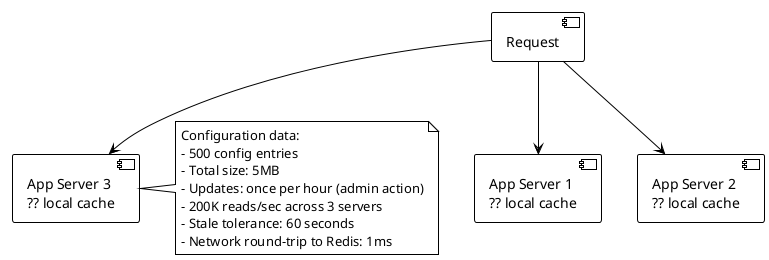

An application reads 500 configuration entries (5MB total) 200,000 times per second across 3 servers. Configuration changes happen once per hour via admin action. Stale config for up to 60 seconds is acceptable.

**Should this use local in-process cache or distributed cache (Redis)?**

- A) Redis — centralized, consistent across all servers, instant invalidation on config change
- B) Local in-process cache with 60-second TTL per server — eliminates network round-trip entirely; 5MB fits in JVM heap; eventual consistency on 1-hour change cycle is acceptable
- C) Ehcache with JGroups cluster replication — distributed local cache, updates propagate within milliseconds
- D) No cache — read from database; optimize with a connection pool and a materialized view

---

### Q18. Cache Stampede Prevention [★★★]

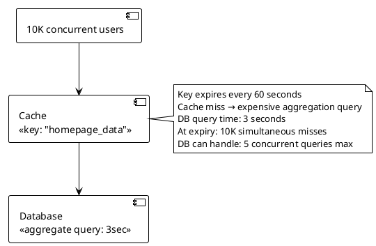

A homepage aggregation query takes 3 seconds to compute and is cached with a 60-second TTL. When the cache key expires, all 10,000 concurrent users get a cache miss simultaneously. The database can handle 5 concurrent expensive queries before becoming overwhelmed.

**Which technique prevents the stampede?**

- A) Increase TTL to 10 minutes — reduces expiry frequency, problem still occurs every 10 minutes
- B) Probabilistic early expiration (XFetch) + mutex lock — one request recomputes before expiry; mutex blocks concurrent miss requests during recomputation; all others wait on the single in-flight query
- C) Add a jitter of ±10 seconds to the TTL — distributes expiry across a window, reduces but doesn't eliminate simultaneous misses
- D) Read-through cache — delegates the problem to the cache layer but doesn't prevent concurrent DB calls

---

### Q19. CDN Cache Strategy for Personalized Content [★☆☆]

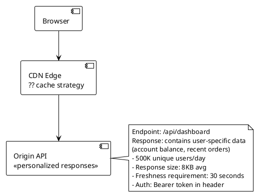

A dashboard API returns personalized data (account balance, recent orders) for authenticated users. 500,000 unique users request this endpoint daily. Responses must be fresh within 30 seconds. Authentication uses Bearer tokens in the Authorization header.

**What is the correct CDN caching strategy for this endpoint?**

- A) Cache at CDN with 30-second TTL, ignore Authorization header — reduces origin load, but serves wrong user's data to other users
- B) Do not cache at CDN — set `Cache-Control: no-store`; serve all personalized responses from origin
- C) Cache at CDN keyed by Authorization header value — each user gets their own cache entry; CDN storage grows linearly with unique users
- D) Cache a generic "shell" response at CDN; personalized data fetched client-side via JS after page load

---

### Q20. Cache Invalidation on Write [★☆☆]

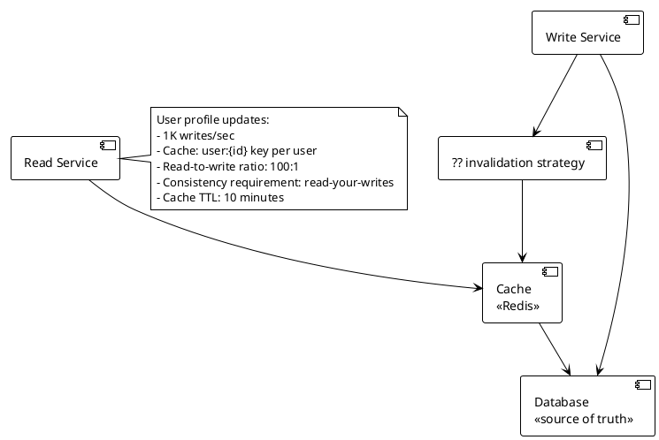

A user profile service caches individual user records under `user:{id}` keys. The read-to-write ratio is 100:1. After a user updates their profile, they must immediately see their new data (read-your-writes consistency). Cache TTL is 10 minutes.

**Which invalidation strategy is correct?**

- A) TTL-only — after update, wait up to 10 minutes for cache to expire naturally; violates read-your-writes
- B) Delete (invalidate) the cache key on write — next read repopulates from DB; simple, correct, avoids stale reads
- C) Update cache synchronously on write (write-through) — keep cache consistent; risk: write to DB succeeds but cache update fails leaves inconsistency
- D) Double-delete pattern — delete before write and after write with a 500ms delay; handles replication lag in read replicas

---

### Q21. Multi-Level Cache Architecture [★★★]

```plantuml
@startuml
!theme plain
skinparam backgroundColor white

[API Request] --> [L1: In-Process Cache\nCaffeine, 512MB]
[L1: In-Process Cache\nCaffeine, 512MB] --> [L2: Distributed Cache\nRedis, 64GB]
[L2: Distributed Cache\nRedis, 64GB] --> [L3: Database\nPostgreSQL read replica]

note right
  Product recommendation data:
  - 50K unique product IDs (hot set)
  - Full catalog: 5M products
  - Read: 500K reads/sec (10 app servers)
  - L1 miss penalty: 1ms Redis round-trip
  - L2 miss penalty: 15ms DB query
  - Update frequency: 1 batch/hour
end note
@enduml
```

A product recommendation engine serves 500,000 reads per second across 10 application servers. The hot set is 50,000 product IDs. Full catalog is 5M products. Data is refreshed once per hour via batch job.

**What multi-level cache configuration is correct?**

- A) L1 (Caffeine): 50K entries, 1-hour TTL; L2 (Redis): 5M entries, 1-hour TTL — L1 absorbs hot-set reads, L2 handles long-tail, DB is last resort
- B) Only L2 (Redis): 5M entries, 1-hour TTL — centralized cache eliminates L1 inconsistency across 10 servers
- C) Only L1 (Caffeine): unlimited size — keep everything in-process, never hit Redis or DB
- D) L1 (Caffeine): 5-minute TTL; L2 (Redis): 1-hour TTL — L1 provides freshness buffer for hourly batch updates

---

### Q22. Null/Empty Result Caching [★☆☆]

```plantuml
@startuml
!theme plain
skinparam backgroundColor white

[Attacker / Bot] --> [API\n/api/users/{id}]
[API\n/api/users/{id}] --> [Redis Cache]
[Redis Cache] ..> [Database\n<<user table>>]

note right
  Attack pattern:
  - 50K requests/sec for non-existent user IDs
  - Cache miss → DB query → 404 response
  - DB query: 5ms, max 1000 QPS
  - At 50K misses/sec: DB overwhelmed
  - Legitimate user lookups: <500/sec
end note
@enduml
```

An API endpoint `/api/users/{id}` is being hit with 50,000 requests per second for non-existent user IDs (bot or enumeration attack). Every cache miss triggers a database query. The database handles 1,000 QPS max before degrading.

**What caching strategy prevents database overload from non-existent key lookups?**

- A) Rate limiting only — cap requests per IP; sophisticated bots rotate IPs
- B) Cache null results — store a `USER_NOT_FOUND` sentinel in cache with a short TTL (e.g., 60 seconds) for non-existent IDs; subsequent lookups for same ID hit cache, not DB
- C) Increase database read replicas — scale DB to handle 50K QPS
- D) Return 404 from cache layer directly without querying DB, using a Bloom filter to track existing user IDs

---

### Q23. Cache Warming Strategy [★☆☆]

```plantuml
@startuml
!theme plain
skinparam backgroundColor white

[Cold Cache\n<<new deployment>>] --> [Application\n<<serving traffic>>]
[Application\n<<serving traffic>>] --> [Database\n<<10M products>>]

note right
  Cold start scenario:
  - New region deployment
  - Cache empty on startup
  - Expected traffic: 100K req/sec (immediate)
  - Top 10K products = 90% of reads
  - DB can handle: 500 concurrent queries
  - Cache warm time target: <5 minutes
end note
@enduml
```

A new regional deployment starts with an empty cache and expects 100,000 requests per second immediately at launch. The top 10,000 products account for 90% of reads. The database handles a maximum of 500 concurrent queries. Cache warm target is under 5 minutes.

**What cache warming strategy prevents the cold-start DB overload?**

- A) Let the cache warm naturally — requests will populate the cache within minutes through organic traffic
- B) Pre-warm before launch — load top 10K products into cache during deployment (before receiving traffic); rate-limit the warming job to 500 concurrent queries; flip DNS/LB after cache is warm
- C) Deploy with a read replica dedicated to warming — all cache-miss reads hit the replica, protecting primary
- D) Use a circuit breaker — when cache miss rate exceeds threshold, return stale data or 503 until cache warms

---

### Q24. Cache Penetration with Bloom Filter [★★★]

```plantuml
@startuml
!theme plain
skinparam backgroundColor white

[Client] --> [API]
[API] --> [Bloom Filter\n?? usage]
[Bloom Filter\n?? usage] --> [Redis Cache]
[Redis Cache] --> [Database\n<<500M user records>>]

note right
  User lookup: /api/users/{uuid}
  - 500M valid UUIDs in DB
  - Attackers probe random UUIDs (non-existent)
  - DB: 15ms/query, max 5K QPS
  - Cache: 2M entries, 8-byte UUID keys
  - Attack traffic: 200K non-existent UUID/sec
end note
@enduml
```

An API is being probed with 200,000 requests per second for random non-existent UUIDs. The database contains 500M valid user records. Cache holds 2M entries. The database is overwhelmed by cache misses for non-existent IDs.

**How should the Bloom filter be integrated to protect the database?**

- A) Bloom filter replaces the cache — check Bloom filter instead of Redis; false positives go to DB
- B) Check Bloom filter before cache and DB — if Bloom filter says "definitely not exists," return 404 immediately without touching cache or DB; only false positives (existing IDs that might look absent) proceed normally
- C) Check Bloom filter after cache miss, before DB — filter reduces DB queries from cache misses
- D) Bloom filter on writes only — new users are added to the Bloom filter on registration; reads use cache-aside without filter

---

### Q25. Hot Key Problem in Redis [★★★]

```plantuml
@startuml
!theme plain
skinparam backgroundColor white

[Application Servers\n×50] --> [Redis Cluster\n<<6 nodes>>]
note right of [Redis Cluster\n<<6 nodes>>]
  Hot key: "trending_post:12345"
  Reads: 200K/sec on single key
  All 50 app servers → same Redis node
  That node: CPU 100%, dropping requests
  
  Other keys: <1K reads/sec each
  Other nodes: CPU 15% avg
end note
@enduml
```

A trending post key `trending_post:12345` receives 200,000 reads per second, all routed to the same Redis cluster node (consistent hashing). That node is CPU-bound and dropping requests. Other nodes are at 15% CPU.

**Which solution correctly addresses the hot key problem?**

- A) Increase the Redis node's CPU — vertical scale the hot node
- B) Key replication with local read sharding — replicate the hot key to all 6 nodes as `trending_post:12345:{0..5}`, each app server reads from a random replica index; write updates all replicas
- C) Move the hot key to a dedicated Redis instance — isolate it from the cluster
- D) Add L1 in-process cache (Caffeine) on each app server with 1-second TTL — each of 50 servers caches locally, reducing Redis reads from 200K/sec to 50 reads/sec (one per server per second)

---

### Q26. Write-Behind Failure Handling [★★★]

```plantuml
@startuml
!theme plain
skinparam backgroundColor white

[Application] --> [Cache\n<<write-behind buffer>>]
[Cache\n<<write-behind buffer>>] --> [Async Writer\n<<background thread>>]
[Async Writer\n<<background thread>>] --> [Database]

note right
  Shopping cart write-behind:
  - 20K cart updates/sec
  - Async flush every 100ms
  - Cache node fails mid-flush:
    - 2,000 writes in buffer
    - Not yet persisted to DB
  - User expects: cart preserved
  - Acceptable loss: ZERO
end note
@enduml
```

A shopping cart service uses write-behind caching: cart updates are written to Redis, then flushed to the database every 100ms. A Redis node fails mid-flush, losing 2,000 buffered writes. Users expect their carts to survive system failures.

**What architecture change eliminates the data loss risk while keeping write performance high?**

- A) Reduce flush interval to 10ms — smaller loss window, still non-zero risk
- B) Switch to write-through — synchronous DB write before ACK; write-behind is fundamentally incompatible with zero data loss requirement
- C) Enable Redis persistence (AOF with fsync=always) — persists every write to disk on the Redis node; node failure recovers from AOF log
- D) Use Redis Cluster with 2 replicas — replication provides HA; buffered writes on primary propagate to replicas before flush

---

### Q27. Cache Consistency in Microservices [★★★]

```plantuml
@startuml
!theme plain
skinparam backgroundColor white

[Order Service] --> [Redis\n<<cache: product prices>>]
[Inventory Service] --> [Redis\n<<cache: product prices>>]
[Price Service] --> [Database\n<<canonical price>>]
[Price Service] ..> [?? invalidation mechanism]

note right
  Price update scenario:
  - Price changes: 500/day
  - 20 microservices read cached prices
  - Cache-aside pattern per service
  - Stale price = wrong order total
  - Acceptable stale window: 0 seconds
end note
@enduml
```

20 microservices each maintain their own cache-aside cache of product prices. When the Price Service updates a price in the database, all 20 services' caches must be invalidated immediately. Stale prices cause incorrect order totals.

**Which invalidation mechanism is correct for this scenario?**

- A) TTL of 1 second on all price cache entries — all services see fresh prices within 1 second; acceptable stale window is 0 seconds, so this fails
- B) Price Service publishes a price-updated event to a message bus (Kafka/Redis Pub/Sub); each service subscribes and invalidates its local cache entry on receipt
- C) Price Service calls each of the 20 services' cache-invalidation endpoints via REST on every price change — synchronous fan-out, 20 HTTP calls per price update
- D) No cache for prices — always read from Price Service API; Price Service adds read replicas to handle load

---

## Topic 3: Database Selection & Modeling (Q28–Q47)

---

### Q28. E-Commerce Product Catalog Store [★☆☆]

```plantuml
@startuml
!theme plain
skinparam backgroundColor white

[Product API] --> [?? Database]

note right
  Product catalog requirements:
  - 2M products, each with 20–200 attributes
  - Attributes vary by category:
    Electronics: voltage, watts, dimensions
    Clothing: sizes, colors, materials
    Books: ISBN, author, pages
  - Full-text search on title/description
  - Filter by arbitrary attribute combinations
  - 50K reads/sec, 500 writes/day
end note
@enduml
```

A product catalog stores 2 million products across 20 categories. Each category has 20–200 unique attributes with no overlap between categories. Product search requires full-text and attribute-based filtering. Reads are 50,000/sec; writes are 500/day.

**Which database best fits this schema?**

- A) PostgreSQL with EAV (Entity-Attribute-Value) pattern — flexible schema in relational DB; joins become expensive at 50K reads/sec
- B) MongoDB (document store) — each product is a self-contained document with its category-specific attributes; flexible schema, horizontal scaling, compound indexes for filter queries
- C) Cassandra — wide-column store; optimized for time-series writes; complex filtering across arbitrary attributes is not a strength
- D) Elasticsearch only — excellent for full-text and filter queries; not suitable as primary store (no ACID transactions, data loss risk without a primary source)

---

### Q29. IoT Sensor Time-Series Storage [★☆☆]

```plantuml
@startuml
!theme plain
skinparam backgroundColor white

[IoT Sensors\n50K devices] --> [Ingestion Layer]
[Ingestion Layer] --> [?? Time-Series DB]
[?? Time-Series DB] --> [Analytics Dashboard]

note right
  Requirements:
  - 50K sensors, each emitting every 10 seconds
  - Write throughput: 5,000 writes/sec
  - Retention: 2 years
  - Queries: time-range aggregations
    (avg, min, max over 1-hour windows)
  - Point queries: rare
  - Data size: ~2TB/year
end note
@enduml
```

50,000 IoT sensors emit readings every 10 seconds, producing 5,000 writes per second. Queries are predominantly time-range aggregations (average temperature for device X between 2pm–4pm). Point queries are rare. Retention is 2 years (~2TB/year).

**Which database is most appropriate?**

- A) PostgreSQL with a `readings` table and timestamp index — capable but requires manual partitioning, compression, and retention management at this scale
- B) InfluxDB or TimescaleDB — purpose-built for time-series: automatic time-based partitioning, built-in aggregation functions, columnar compression for temporal data, native retention policies
- C) Cassandra — write-optimized wide-column store; good for time-series writes but aggregation queries require full partition scans without additional tooling
- D) MongoDB with TTL index on timestamp — document store with TTL-based expiry handles retention; aggregation pipeline handles time-range queries with acceptable performance

---

### Q30. Fraud Detection Graph Queries [★☆☆]

```plantuml
@startuml
!theme plain
skinparam backgroundColor white

[Fraud API] --> [?? Database]

note right
  Fraud detection requirements:
  - Query: "Find all accounts connected to
    this account within 3 hops via shared
    IP, device, or phone number"
  - 200M accounts, 2B relationships
  - Query latency target: <500ms
  - 3-hop traversal: relational JOIN depth is O(n^k)
  - Writes: 10K account events/sec
end note
@enduml
```

A fraud detection system must traverse relationship graphs: find all accounts connected within 3 hops via shared IP addresses, device fingerprints, or phone numbers. There are 200M accounts and 2B relationships. Queries must return in under 500ms.

**Which database is appropriate?**

- A) PostgreSQL with recursive CTEs — can express graph traversal in SQL; performance degrades rapidly at 3+ hops over 2B rows
- B) Neo4j or Amazon Neptune (graph database) — native graph storage and traversal engine; 3-hop queries traverse pointer-linked nodes without full table scans; designed for exactly this query pattern
- C) Elasticsearch with nested documents — good for search; multi-hop relationship traversal is not a native capability
- D) Cassandra with denormalized adjacency lists — fast writes and reads for direct relationships; multi-hop traversal requires multiple application-level queries and in-memory join

---

### Q31. Write-Heavy Leaderboard [★★☆]

```plantuml
@startuml
!theme plain
skinparam backgroundColor white

[Game Servers\n×100] --> [Score Service]
[Score Service] --> [?? Storage]

note right
  Gaming leaderboard:
  - 10M active players
  - 50K score updates/sec
  - Query: top 100 players globally
  - Query: rank of specific player
  - Query: players within ±50 of my rank
  - Latency: <10ms for all queries
  - Exact ranking required (no approximation)
end note
@enduml
```

A gaming leaderboard receives 50,000 score updates per second across 10 million players. Queries must return the global top 100, the rank of a specific player, and players within ±50 positions of a given player, all under 10ms.

**What storage technology fits all these requirements?**

- A) PostgreSQL with `ORDER BY score DESC` — correct results but ranking queries require full table scan or complex index; <10ms unlikely at 10M rows with 50K writes/sec
- B) Redis Sorted Set (`ZADD`, `ZRANK`, `ZRANGE`) — O(log N) score updates, O(log N + M) range queries; built-in rank semantics; 10M members fit in memory; sub-millisecond operations
- C) DynamoDB with GSI on score — single-table design with score GSI; range queries require scan; no native rank function
- D) Elasticsearch with numeric score field — good for search, but exact rank computation requires expensive aggregations across 10M documents

---

### Q32. Reporting vs Transactional Workload [★★☆]

```plantuml
@startuml
!theme plain
skinparam backgroundColor white

[OLTP App\n<<orders, payments>>] --> [?? Architecture]
[Analyst Tools\n<<Tableau, SQL>>] --> [?? Architecture]

note right
  Combined workload:
  - OLTP: 5K transactions/sec
    (INSERT/UPDATE on orders, payments)
  - Analytics: complex JOINs across
    3 years of order history
    Query time on OLTP DB: 45 minutes
    OLTP degraded during analytics queries
  - Analyst SLA: query in <5 minutes
end note
@enduml
```

An orders database handles 5,000 OLTP transactions per second. Business analysts run complex JOIN queries across 3 years of order history; these take 45 minutes on the transactional database and degrade OLTP performance.

**What architectural change solves the contention?**

- A) Add read replicas for analytics — replica still uses row-oriented storage; 45-minute queries still run on replica; OLTP is isolated but analyst SLA unmet
- B) Extract to OLAP: replicate OLTP data to a columnar warehouse (Redshift, BigQuery, Snowflake) via CDC; analysts query the warehouse; OLTP is unaffected; columnar storage reduces 45-min query to <5 min
- C) Partition the orders table by year — reduces scan range; doesn't change storage engine; JOINs still slow
- D) Move analytics to Elasticsearch — fast for search; aggregation JOINs across order/payment/customer data are not a native strength

---

### Q33. Database Connection Pool Sizing [★☆☆]

```plantuml
@startuml
!theme plain
skinparam backgroundColor white

[Spring Boot App\n<<HikariCP pool: ?? >>] --> [PostgreSQL\n<<max_connections: 200>>]

note right
  App server: 4 vCPU, 8GB RAM
  Request throughput: 2,000 req/sec
  Avg DB query time: 5ms
  Max concurrent requests: 500 (thread pool)
  Number of app servers: 8
  Total connections PostgreSQL can serve: 200
end note
@enduml
```

8 Spring Boot servers with HikariCP connect to a PostgreSQL instance (max_connections: 200). Each app server has 4 vCPU and handles 2,000 requests/second with a 5ms average database query time. Thread pool max is 500.

**What is the correct HikariCP pool size per server?**

- A) pool-size = 500 — match the thread pool; ensures every thread can always get a connection
- B) pool-size = 25 — total connections across 8 servers = 200 (PostgreSQL max); sized by Little's Law: 2,000 req/sec × 5ms = ~10 concurrent DB queries needed; 25 provides headroom for spikes
- C) pool-size = 100 — leave some connections free on PostgreSQL; 8 × 100 = 800 exceeds PostgreSQL max_connections
- D) pool-size = 10 — too small; at 2,000 req/sec × 5ms, ~10 connections are always in use with no burst capacity

---

### Q34. Read Replica Usage [★☆☆]

```plantuml
@startuml
!theme plain
skinparam backgroundColor white

[App Server] --> [Primary DB\n<<writes + reads>>]
[Primary DB\n<<writes + reads>>] --> [Replica 1\n<<async replication>>]
[Primary DB\n<<writes + reads>>] --> [Replica 2\n<<async replication>>]

note right
  Current state:
  - Read:write ratio = 90:10
  - Primary CPU: 85% (reads dominating)
  - Replication lag: 50–200ms
  - Use case: social media posts feed
  - After-write read: "post published" confirmation
    must show user their own post immediately
end note
@enduml
```

A social media platform's primary database runs at 85% CPU. Reads are 90% of queries. Two read replicas exist with 50–200ms replication lag. After posting, users must immediately see their own post.

**What is the correct read routing strategy?**

- A) Route ALL reads to replicas — reduces primary load maximally; post-write reads will miss the just-posted content during lag window
- B) Route reads to replicas by default; route reads to primary for 500ms after a write from the same user session (read-your-writes guarantee via session token or sticky routing)
- C) Route all writes and post-write reads to primary; route all other reads to replicas — correct; implement via application-level read routing based on operation type and recency
- D) Eliminate replication lag by switching to synchronous replication — eliminates stale read but adds write latency on every transaction; CPU problem on primary persists

---

### Q35. Optimistic vs Pessimistic Locking [★☆☆]

```plantuml
@startuml
!theme plain
skinparam backgroundColor white

[User A] --> [Ticket Booking Service]
[User B] --> [Ticket Booking Service]
[User C] --> [Ticket Booking Service]
[Ticket Booking Service] --> [Database\n<<seats table>>]

note right
  Concert ticket booking:
  - 500 seats per show
  - 10K concurrent users trying to book
    same show simultaneously
  - Booking = read seat + mark reserved + charge
  - Conflict rate: very high (10K → 500 seats)
  - Overbook risk: catastrophic (legal liability)
end note
@enduml
```

A concert ticket booking system has 10,000 concurrent users competing for 500 seats in the same show. Overbooking is not acceptable (legal liability). The conflict rate is extremely high.

**Which concurrency strategy is correct?**

- A) Optimistic locking with version field — check version on update; if conflict, retry; at 10K:500 contention ratio, retry storms will overwhelm the database
- B) Pessimistic locking (`SELECT FOR UPDATE`) — lock the seat row when a user starts booking; serialize concurrent access; high contention means high wait time but zero overbooking
- C) Application-level Redis lock per seat — lock seat ID in Redis for booking duration (30 seconds); Redis lock prevents DB-level conflicts; atomic SETNX operation
- D) Last-write-wins with `UPDATE WHERE status='available'` — check affected rows; if 0 rows updated, return error to user; correct for preventing overbook but still requires careful implementation

---

### Q36. Materialized View for Aggregations [★★☆]

```plantuml
@startuml
!theme plain
skinparam backgroundColor white

[Dashboard API] --> [?? Query strategy]
[?? Query strategy] --> [Database\n<<orders: 500M rows>>]

note right
  Dashboard query:
  SELECT category, SUM(revenue), COUNT(orders)
  FROM orders
  WHERE date >= '2024-01-01'
  GROUP BY category
  
  - Table size: 500M rows
  - Query time: 3 minutes (full scan)
  - Dashboard load target: <2 seconds
  - Data freshness requirement: end-of-day
  - Updates: 5K inserts/sec during business hours
end note
@enduml
```

A dashboard aggregation query runs against a 500M-row orders table, taking 3 minutes. The dashboard must load in under 2 seconds. Data freshness of end-of-day (updated nightly) is acceptable.

**What is the correct solution?**

- A) Add a composite index on `(date, category)` — reduces scan range but GROUP BY aggregation still visits millions of rows; 2-second target unlikely
- B) Nightly materialized view refresh — pre-compute `(category, SUM(revenue), COUNT(orders))` by day; dashboard queries the materialized view (hundreds of rows, sub-millisecond); nightly refresh matches the end-of-day freshness requirement
- C) Read replica with query optimization — offloads load from primary but doesn't reduce 3-minute query time
- D) Elasticsearch aggregation on order data — would require syncing 500M rows to Elasticsearch; overkill for end-of-day batch aggregations

---

### Q37. Full-Text Search Implementation [★★☆]

```plantuml
@startuml
!theme plain
skinparam backgroundColor white

[Search API] --> [?? Search Engine]
[?? Search Engine] --> [Database\n<<PostgreSQL: articles table>>]

note right
  Article search requirements:
  - 10M articles, avg 2KB each
  - Queries: multi-word full-text search
  - Features: typo tolerance (fuzzy), boosting by recency
  - Filters: by author, category, date range
  - Search latency target: <100ms P99
  - Write: 1K new articles/day
end note
@enduml
```

A content platform needs full-text search across 10 million articles with fuzzy matching, recency boosting, and faceted filtering by author/category/date. Latency target is 100ms P99.

**Which approach meets all requirements?**

- A) PostgreSQL `tsvector` with GIN index — built-in full-text search; no fuzzy matching; no relevance tuning; 100ms target achievable but limited feature set
- B) Elasticsearch or OpenSearch — inverted index optimized for full-text; native fuzzy matching, relevance scoring, boosting, facets; 10M documents at sub-100ms is well within its design range; sync from PostgreSQL via CDC or batch
- C) MySQL FULLTEXT index — available but less powerful than dedicated search; no fuzzy matching without plugins
- D) LIKE queries with `%keyword%` — no index usage, full table scan on 10M rows; violates latency requirement

---

### Q38. Hot/Cold Data Tiering [★★★]

```plantuml
@startuml
!theme plain
skinparam backgroundColor white

[Application] --> [?? Storage Architecture]

note right
  Email archive:
  - Total: 5TB of emails
  - Last 30 days: accessed daily (20% of data)
  - 31–365 days: accessed weekly (30% of data)
  - >1 year: accessed quarterly (50% of data)
  - Access pattern: read-only after 30 days
  - Storage cost: SSD tier $0.25/GB/month
                  HDD tier $0.05/GB/month
                  Object storage $0.02/GB/month
  - Retrieval SLA: <2s for recent, <30s for archive
end note
@enduml
```

An email archive contains 5TB of data. 20% (last 30 days) is accessed daily, 30% accessed weekly, 50% (>1 year) accessed quarterly. Storage costs differ significantly across tiers.

**What tiering architecture minimizes cost while meeting retrieval SLAs?**

- A) Single SSD tier — meets all latency SLAs; costs $1,250/month; no optimization
- B) Hot (SSD, 30 days): 1TB; Warm (HDD, 31–365 days): 1.5TB; Cold (S3/object storage, >1 year): 2.5TB — lifecycle policies move data automatically; monthly cost ~$375; retrieval SLA met per tier
- C) Single HDD tier — reduces cost; 2TB hot data on spinning disk may miss <2s SLA for high-concurrency daily access
- D) All data on object storage — cheapest; <30s retrieval SLA for hot data is violated

---

### Q39. Polyglot Persistence Design [★★★]

```plantuml
@startuml
!theme plain
skinparam backgroundColor white

[E-Commerce Platform] --> [?? Multiple Stores]

note right
  Feature requirements:
  A) User accounts, orders → ACID, relational
  B) Product catalog → flexible schema, 150 attributes/product
  C) Session data → 500K concurrent, sub-ms, TTL
  D) Product recommendations → graph traversal, "bought together"
  E) Search → fuzzy, faceted, ranked
  F) Inventory counts → atomic decrement, high contention
end note
@enduml
```

An e-commerce platform has 6 distinct data access patterns. Each has different requirements for consistency, schema flexibility, query patterns, and latency.

**What is the correct polyglot persistence assignment?**

- A) Use PostgreSQL for A, B, C, D, E, F — single store simplifies operations; struggles with B (flexible schema), C (session TTL), D (graph), E (full-text at scale)
- B) A→PostgreSQL, B→MongoDB, C→Redis, D→Neo4j, E→Elasticsearch, F→Redis atomic INCRBY — each store chosen for its native strength; operational complexity is the tradeoff
- C) A→PostgreSQL, B→PostgreSQL (JSONB), C→PostgreSQL (sessions table), D→PostgreSQL (recursive CTE), E→PostgreSQL (tsvector), F→PostgreSQL (advisory locks) — PostgreSQL-only; workable but suboptimal for C (session scale) and D (graph at depth)
- D) A→DynamoDB, B→DynamoDB, C→ElastiCache, D→Neptune, E→Elasticsearch, F→DynamoDB — AWS-native stack; DynamoDB for relational ACID transactions is a design mismatch for A

---

### Q40. Event Sourcing as Primary Store [★★★]

```plantuml
@startuml
!theme plain
skinparam backgroundColor white

[Command API] --> [Event Store\n<<append-only>>]
[Event Store\n<<append-only>>] --> [Projection Builder]
[Projection Builder] --> [Read Model\n<<current state>>]

note right
  Bank account requirements:
  - Full audit trail required (regulatory)
  - "What was the balance on March 3 at 2pm?"
  - Compensating transactions (reversal without delete)
  - 10K transactions/sec
  - Current balance lookup: <50ms
  - Historical balance: <5 seconds
end note
@enduml
```

A banking system requires a complete audit trail, point-in-time balance queries ("what was my balance on this date?"), and compensating transactions without deleting history. Current balance lookups must be under 50ms; historical queries under 5 seconds.

**Is event sourcing the right pattern, and what is the critical infrastructure requirement?**

- A) No — event sourcing is overkill; use soft deletes and an audit log table in PostgreSQL for regulatory compliance
- B) Yes — event sourcing is correct for this use case; critical requirement is snapshots (materializing current state periodically), otherwise replaying 10K events/sec × years = unusable rebuild time for current balance
- C) Yes — event sourcing is correct; replaying all events on every balance query is acceptable since each event is small
- D) Yes — event sourcing is correct; use CQRS with a read model that is rebuilt nightly for the current balance

---

### Q41. Schema Migration for Zero Downtime [★★★]

```plantuml
@startuml
!theme plain
skinparam backgroundColor white

[v1.0 App\n<<running>>] --> [Database\n<<shared>>]
[v1.1 App\n<<deploying>>] --> [Database\n<<shared>>]

note right
  Migration: add NOT NULL column "email_verified"
  to users table (50M rows)
  
  Current state: column does not exist
  v1.0: does not read/write this column
  v1.1: requires this column (NOT NULL)
  
  Deployment: rolling (v1.0 and v1.1 coexist)
  Downtime budget: ZERO
end note
@enduml
```

A rolling deployment of v1.1 requires a `NOT NULL` column `email_verified` on the 50M-row `users` table. During rolling deployment, v1.0 and v1.1 run simultaneously against the same database.

**What is the correct migration sequence?**

- A) Migration: `ALTER TABLE users ADD COLUMN email_verified BOOLEAN NOT NULL DEFAULT false` → deploy v1.1 — adding NOT NULL with DEFAULT is an instant metadata operation on PostgreSQL 11+; safe for rolling deploy
- B) Three migrations: (1) add as nullable; (2) backfill + add NOT NULL; (3) cleanup — correct for databases where NOT NULL + DEFAULT isn't atomic; handles backfill of 50M rows safely
- C) Deploy v1.1 first, then run migration — v1.1 will crash on INSERT when the column doesn't exist yet
- D) Rename old table, create new table with column, copy data, redirect app — requires downtime or application-level shim

---

### Q42. Serverless Database Connection Management [★★★]

```plantuml
@startuml
!theme plain
skinparam backgroundColor white

[AWS Lambda\n<<auto-scales 0→3000 instances>>] --> [?? Connection Strategy]
[?? Connection Strategy] --> [PostgreSQL RDS\n<<max_connections: 500>>]

note right
  Lambda function: API backend
  Scale: 0 → 3,000 concurrent instances (burst)
  Each instance: opens DB connection on cold start
  At 3,000 instances: 3,000 connections
  RDS max_connections: 500
  Current: connection exhaustion at 500 concurrent Lambda instances
end note
@enduml
```

An AWS Lambda function scales to 3,000 concurrent instances during traffic bursts. Each instance opens a PostgreSQL connection on cold start. At 500 concurrent instances, RDS connection limit is exhausted.

**What solves the connection exhaustion problem?**

- A) Increase RDS instance size — larger instance = more max_connections; at 3,000 Lambdas, even the largest RDS instance is insufficient
- B) RDS Proxy — connection pooling proxy between Lambda and RDS; multiplexes thousands of Lambda connections to a small pool of DB connections (50–100); Lambda sees native RDS endpoint; transparently handles connection lifecycle
- C) Reduce Lambda concurrency limit to 500 — limits throughput to match DB connections; trades availability for stability
- D) Use connection pooling inside Lambda handler (HikariCP) — Lambda instances are stateless and short-lived; pool is re-created per cold start, provides no benefit across invocations

---

### Q43. Index Strategy for Composite Queries [★★☆]

```plantuml
@startuml
!theme plain
skinparam backgroundColor white

[Order API] --> [PostgreSQL\n<<orders table: 200M rows>>]

note right
  Common query patterns:
  Q1: WHERE user_id = ? AND status = 'PENDING'
  Q2: WHERE status = 'PENDING' ORDER BY created_at
  Q3: WHERE user_id = ? ORDER BY created_at DESC LIMIT 20
  Q4: WHERE created_at > ? AND status IN ('FAILED','REFUNDED')
  
  Table: orders(id, user_id, status, created_at, amount)
  Current indexes: PRIMARY KEY(id) only
  Slow queries: all 4 patterns >100ms
end note
@enduml
```

A 200M-row orders table has only a primary key index. Four query patterns are all running over 100ms. Each query has different filter and sort columns.

**What minimal index set covers all four query patterns efficiently?**

- A) Single index on `(user_id, status, created_at)` — covers Q1 (prefix), Q3 (prefix + sort), partial Q2 (missing user_id prefix), misses Q4
- B) Two indexes: `(user_id, status, created_at)` and `(status, created_at)` — Q1: index 1 with prefix; Q2: index 2; Q3: index 1 prefix + sort; Q4: index 2 with status IN filter and range on created_at
- C) Index on every column separately — 4 single-column indexes; PostgreSQL can sometimes combine them via bitmap AND, but composite indexes are more efficient
- D) Index on `(created_at)` only — allows range scans for Q2 and Q4 but forces filter step; Q1 and Q3 require full scan of `user_id` matches

---

### Q44. Normalization vs Denormalization [★★☆]

```plantuml
@startuml
!theme plain
skinparam backgroundColor white

[Order History API] --> [?? Schema design]

note right
  E-commerce order history:
  - Users: 10M
  - Orders: 500M (historical, immutable after creation)
  - Query: "Show order history with product name,
    category, price at time of purchase, seller name"
  - Normalized: 5-table JOIN (users, orders, order_items,
    products, sellers)
  - JOIN performance: 800ms on read replica
  - Write: orders created 5K/sec at peak
  - Product names/prices change after order creation
end note
@enduml
```

Order history queries require joining 5 tables and take 800ms. Order records are immutable after creation. Product prices and names change over time (but historical orders must show the price at purchase time).

**Should this schema be normalized or denormalized?**

- A) Keep normalized — add better indexes; the JOIN cost can be reduced with proper composite indexes on foreign keys
- B) Denormalize order_items — snapshot product name, price, category, and seller name into the `order_items` row at creation time; historical accuracy is preserved; query becomes a single table read with user filter; immutability makes denormalization safe
- C) Use a CQRS read model — maintain a separate pre-joined view table updated via CDC; adds operational complexity without addressing the root cause
- D) Shard by user_id — reduces table size per shard; doesn't reduce the JOIN depth within a shard

---

### Q45. Database-per-Service Microservice Pattern [★★★]

```plantuml
@startuml
!theme plain
skinparam backgroundColor white

[Order Service] --> [Orders DB\n<<PostgreSQL>>]
[Inventory Service] --> [Inventory DB\n<<PostgreSQL>>]
[Payment Service] --> [Payment DB\n<<PostgreSQL>>]

note right
  Cross-service query required:
  "Find all orders where inventory is low
   AND payment is pending"
  
  This query spans 3 databases.
  Current approach: API composition in Order Service
  (3 service calls, in-memory join)
  
  Problem: 10K results, 3 round-trips = 8 seconds
end note
@enduml
```

Three microservices each own their database. A business report requires joining data across all three. The current API composition approach (3 service calls + in-memory join) takes 8 seconds for 10K results.

**What is the correct solution in a database-per-service architecture?**

- A) Merge all three databases into one shared database — violates database-per-service principle; reintroduces tight coupling
- B) CQRS with a dedicated reporting read model — each service publishes events to a message bus; a report service consumes all events and maintains a denormalized reporting database (e.g., Elasticsearch or a PostgreSQL read model); cross-service queries hit the read model
- C) Allow Order Service direct read-only access to Inventory and Payment databases — creates coupling through shared DB; schema changes in one service break others
- D) GraphQL federation — allows querying across services; still requires 3 service round-trips underneath; doesn't solve the 8-second latency

---

### Q46. Time-to-Live (TTL) vs Hard Delete [★★☆]

```plantuml
@startuml
!theme plain
skinparam backgroundColor white

[Application] --> [DynamoDB\n<<user sessions>>]

note right
  Session management:
  - 2M active sessions at any time
  - Session expires after 30-day inactivity
  - Expired sessions: must not be accessible
  - Storage: must not grow unbounded
  - Cleanup: must not impact write throughput
  - DynamoDB: charges per GB stored
end note
@enduml
```

A DynamoDB table stores 2M user sessions that expire after 30 days of inactivity. The table must not grow unbounded, and cleanup must not impact write throughput.

**What is the correct expiry strategy?**

- A) Scheduled Lambda function runs nightly, deletes expired sessions with a scan + batch delete — scan at scale is expensive ($), impacts read capacity, misses sessions created between runs
- B) DynamoDB TTL attribute — set `expires_at` timestamp on each session item; DynamoDB automatically deletes expired items in the background within 48 hours; zero write throughput impact; standard practice
- C) Soft-delete flag: set `is_expired = true` on inactivity; filter queries to exclude expired; table still grows unbounded
- D) Application-level delete on session read — check expiry on read, delete if expired; items with no reads (abandoned sessions) never get deleted

---

### Q47. Connection Strategy for Serverless to Aurora [★★★]

```plantuml
@startuml
!theme plain
skinparam backgroundColor white

[API Gateway] --> [Lambda Functions\n<<variable: 0 to 2000 concurrent>>]
[Lambda Functions\n<<variable: 0 to 2000 concurrent>>] --> [?? Strategy]
[?? Strategy] --> [Aurora PostgreSQL\n<<max 1000 connections>>]

note right
  Traffic pattern:
  - Daytime: 1500 concurrent Lambdas
  - Nighttime: 5 concurrent Lambdas
  - Aurora max_connections: ~1000 (db.r6g.2xlarge)
  - Lambda cold start adds 200ms if new connection opened
  - DB operations: 10–50ms each
  - Cost: minimize idle connections
end note
@enduml
```

Aurora PostgreSQL supports ~1,000 connections on the chosen instance size. Lambda scales between 5 and 1,500 concurrent invocations. Opening a new connection per Lambda invocation causes cold-start latency and exhausts the connection limit at scale.

**What is the correct architecture?**

- A) Lambda with persistent connections (reuse connection across warm invocations) — helps with warm instances but doesn't solve the 1,500 > 1,000 connection limit problem
- B) RDS Proxy in front of Aurora — pools and multiplexes Lambda connections; 1,500 Lambda connections → ~50–100 pooled DB connections; cold start still opens a proxy connection (fast, no SSL handshake to Aurora itself); Aurora sees constant pool, not Lambda burst
- C) Increase Aurora instance to db.r6g.8xlarge — max_connections grows but cost increases; Lambda burst can still exceed max at peak
- D) Store data in DynamoDB instead — avoids the connection problem but requires redesigning the data model; not a migration answer, a rewrite

---

## Topic 4: SQL vs NoSQL Tradeoffs (Q48–Q59)

---

### Q48. High-Cardinality Time-Series Writes [★★☆]

```plantuml
@startuml
!theme plain
skinparam backgroundColor white

[Application Servers\n×200] --> [?? Database]

note right
  Application metrics ingestion:
  - 200 servers, each emitting 50 metrics/sec
  - Write throughput: 10,000 writes/sec
  - Metrics schema: (server_id, metric_name, timestamp, value)
  - Cardinality: 200 servers × 50 metrics = 10,000 unique series
  - Query: time-range aggregations per server per metric
  - Retention: 90 days
  - No transactions required
end note
@enduml
```

200 application servers emit 50 metrics per second each (10,000 writes/sec total). Data is queried by time range per server/metric. Retention is 90 days. No ACID transactions needed.

**SQL or Cassandra — which fits better and why?**

- A) PostgreSQL — ACID, mature, proven; hypertable extension (TimescaleDB) adds time-series optimization; handles 10K writes/sec with proper partitioning
- B) Cassandra with partition key `(server_id, metric_name)` and clustering key `timestamp` — write-optimized LSM tree, linear horizontal scaling, time-range queries are native to the data model; no transactions needed; strong fit
- C) MySQL with InnoDB — row-locking and B-tree index; 10K writes/sec causes write contention on time-series inserts; not recommended
- D) MongoDB — document model overhead per metric row; works but less efficient than columnar or wide-column storage for this write pattern

---

### Q49. Flexible Schema Product Configuration [★★☆]

```plantuml
@startuml
!theme plain
skinparam backgroundColor white

[Configuration API] --> [?? Database]

note right
  SaaS product configuration:
  - Each customer has unique config structure
  - Customer A: 15 config keys (string/int)
  - Customer B: 200 config keys (nested objects)
  - Customer C: config includes arrays and maps
  - Queries: always by customer_id (single customer lookup)
  - No cross-customer queries
  - Updates: partial updates common
  - Customers: 50K, growing 10%/month
end note
@enduml
```

A SaaS platform stores per-customer configuration. Each customer's config has a completely different structure (different keys, types, nesting). Queries are always for a single customer's config. No cross-customer queries are needed.

**PostgreSQL JSONB vs MongoDB — which fits better?**

- A) PostgreSQL with JSONB — stores arbitrary JSON, supports partial updates with jsonb operators; no schema enforcement needed; indexed on `customer_id` (primary key); single-server simplicity; correct for this use case if scale doesn't exceed single-node
- B) MongoDB with a config document per customer — native document store, idiomatic for this pattern, horizontal scaling built-in; better fit when multi-region or 50K+ customers with high write concurrency
- C) PostgreSQL with EAV table `(customer_id, key, value TEXT)` — flexible schema in relational; cross-attribute queries become multi-JOIN; partial updates require DELETE+INSERT per key
- D) Redis with customer config as JSON string — fast reads, but no partial update without full document rewrite; no persistence guarantee without explicit AOF/RDB config

---

### Q50. Atomic Counter Under High Contention [★★☆]

```plantuml
@startuml
!theme plain
skinparam backgroundColor white

[Like Button\n1000 clicks/sec] --> [?? Atomic Counter]
[View Counter\n50K views/sec] --> [?? Atomic Counter]

note right
  Social media post counters:
  - Post ID: uuid
  - like_count: atomic increment
  - view_count: atomic increment
  - Read: exact count displayed to user
  - Contention: 1 viral post = 50K concurrent increments/sec
  - DB transactions for increment: lock contention nightmare
  - Consistency: eventual OK (within 1 second)
end note
@enduml
```

A viral post receives 50,000 concurrent view increments per second and 1,000 like increments per second. Users see the count, which can be eventually consistent within 1 second. PostgreSQL `UPDATE SET count = count + 1` under this contention causes severe lock waits.

**What is the correct counter implementation?**

- A) PostgreSQL with `UPDATE posts SET view_count = view_count + 1 WHERE id = ?` — correct semantics but row-level lock at 50K/sec causes queuing; P99 latency degrades severely
- B) Redis `INCR post:{id}:views` — atomic, single-threaded Redis command; no locking; sub-millisecond at any throughput; periodically sync to PostgreSQL for persistence (e.g., every 5 seconds via batch job)
- C) DynamoDB atomic counter (`ADD` update expression) — correct, but costs increase linearly with 50K WCU/sec; expensive for pure counter use case
- D) Batched writes: collect increments in-process for 1 second, write single `UPDATE count = count + N` — reduces DB operations but loses counts if server crashes during batch window

---
